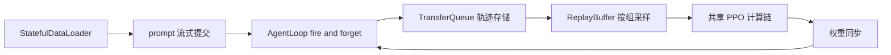

# verl V1 Trainer：三种状态机上的流式 PPO

> **源码基线**：volcengine/verl `main` @ `254a23edc62f25ebfae626e3932ae285d6f86009`
> **分析维度**：Deep Dive · V1 trainer 编排、异步采样与恢复
> **最后更新**：2026-08-28
>
> 本页回答：默认入口如何进入 V1；`sync`、`colocate_async`、`separate_async` 如何在生成与训练之间切换；prompt group 如何经 ReplayBuffer 被消费、淘汰和补充；异步 checkpoint 如何避免 dataloader 前进后丢 prompt；以及 separate async 如何固定旧策略并把空闲 trainer GPU 暂借给生成。TransferQueue 自身的控制面、存储后端与 API 分层见 [[16_verl_v1_transfer_queue_analysis]]，这里不重复。

## 1. 一条主线：数据与控制解耦，三种模式只改变资源状态机

经典同步 PPO 把「取 prompt、等待 rollout、训练、同步权重」串成一条大栅栏。长尾生成会让训练 GPU 等待；若简单地让 rollout 提前跑，又会引入旧样本、跨权重版本续跑和故障恢复问题。

V1 的核心选择不是为三种模式各写一套 PPO，而是共享一套 `PPOTrainer.fit → step → _step_once` 计算流水线，把 rollout 结果放入 TransferQueue，再由 ReplayBuffer 只按元数据选择可训练的 prompt group。模式差异集中在两个边界：**生成副本何时 abort/sleep/resume**，以及**训练侧何时向生成侧提交新权重**（`verl/trainer/ppo/v1/trainer_base.py:389-590`）。



这张图里的 TransferQueue 是数据面，不是 trainer 状态机本身；本页的承重点是 `FEED → RB → PPO → SYNC` 在三种模式中何时发生。

## 2. 默认入口与真实开关关系

### 2.1 默认已经是 V1 sync

默认配置同时给出：

- `trainer.use_v1: true`（`verl/trainer/config/ppo_trainer.yaml:227-228`）；
- `trainer.v1.trainer_mode: sync`（`verl/trainer/config/ppo_trainer.yaml:230-237`）。

`main()` 先根据 `trainer.use_v1` 选择 `TaskRunnerV1`；只有显式设为 false 才会导入 deprecated 的 V0 `TaskRunner`（`verl/trainer/main_ppo.py:183-192`）。进入 V1 后，runner 用 `get_trainer_cls(config.trainer.v1.trainer_mode)` 在 registry 中选择三个实现之一（`verl/trainer/main_ppo.py:137-152`；`verl/trainer/ppo/v1/trainer_base.py:1897-1924`）。

> [!contradiction] 相对旧基线的默认主链已经反转
> `8a694930` 上 `trainer.use_v1=false`，旧 [[20_verl_ray_trainer_analysis]] 因而把 `RayPPOTrainer.fit` 作为默认路径；当前基线默认执行本页的 V1 主链。V0 页面仍可作为 legacy 实现深潜，但不能再代表默认运行时。

### 2.2 `use_v1` 决定路由，V1 内部必用 TransferQueue

`transfer_queue.enable` 在独立配置文件中仍写作 false（`verl/trainer/config/transfer_queue/transfer_queue.yaml:1-2`），但 `TaskRunnerV1.run` 会把它强制改成 true，随后执行 `tq.init(config.transfer_queue)`，结束时无论成功失败都 `tq.close()`（`verl/trainer/main_ppo.py:141-163`）。因此在当前实现里：

- `trainer.use_v1` 是 V0/V1 路由开关；
- 进入 V1 后，TransferQueue 不是可选数据通路；
- 单独设置 `transfer_queue.enable=true` 不会反向把 V0 路由改成 V1。

有一个需要保留的时序边界：Ray 初始化前只有用户原始配置已经令 `transfer_queue.enable=true`，`run_ppo` 才会把 `TRANSFER_QUEUE_ENABLE=1` 放入 runtime env；V1 runner 的强制赋值发生在远端 actor 内，不能追溯修改已经创建的 runtime env（`verl/trainer/main_ppo.py:56-74,141-149`）。源码未说明外部 TransferQueue package 对该环境变量的完整依赖，不能把这处时序差异扩写成未经验证的故障结论。

## 3. 共享骨架：一次 global step 怎样流过 V1

### 3.1 初始化顺序

`PPOTrainer.init()` 先建立 worker group、LLM server 与 checkpoint engine，再让 rollout replica sleep、加载 actor/critic/dataloader/TQ checkpoint，最后调用模式钩子 `on_init_end()` 安装恢复后的权重（`verl/trainer/ppo/v1/trainer_base.py:219-229,352-371`）。TaskRunner 随后创建 `AgentLoopManagerTQ`，把 trainer 的 LLM client、teacher client 和 reward handles 注入进去，再进入 `trainer.fit()`（`verl/trainer/main_ppo.py:111-131,152-155`）。

这个顺序解释了恢复逻辑为何分两段：TQ snapshot 可以在 trainer 初始化时加载，但 pending/running prompt 要等 AgentLoopManager 已经存在，才能在 `fit()` 开头重新派发。

### 3.2 每步先供给，再按本模式的粒度消费

基础 `prepare_step()` 先调用 `_add_batch_to_generate()`，即从 dataloader 取一整个 `train_batch_size` 的 prompt 并提交给 AgentLoop（`verl/trainer/ppo/v1/trainer_base.py:1421-1434`）。随后 `step()` 把训练 batch 除以 `parameter_sync_step`，循环调用 `_step_once()`：sample → reward → balance → old/ref log-prob → value → advantage → critic update → actor update（`verl/trainer/ppo/v1/trainer_base.py:511-590`）。

`sync` 和 `colocate_async` 的 `parameter_sync_step` 默认是 1，因此 controller 一次消费完整 train batch；`separate_async` 默认是 4，每次只消费一个 `train_batch_size / 4` 的 controller mini-batch（`verl/trainer/config/ppo_trainer.yaml:236-252`）。所有 mini-batch 完成后，模式自己的 `on_step_end()` 才处理生成侧权重。

### 3.3 AgentLoop 返回的是状态与引用，不是一个大 batch

Manager 把输入按 worker 数切分，RPC 只等待 worker 创建后台任务；单个 prompt 的生成继续在 actor event loop 中运行（`verl/trainer/ppo/v1/agent_loop_tq.py:243-257`）。Worker 为每个 prompt 创建 fire-and-forget task，并把 prompt group 状态依次写成 `running` 与 `finished/failure`（`verl/trainer/ppo/v1/agent_loop_tq.py:85-110,131-148`）。

每条实际轨迹以 `uid_session_id_index` 为 key 单独写入，tag 记录序列长度及生成使用的最小/最大权重版本；prompt 自身的 uid 则承担 group 生命周期（`verl/trainer/ppo/v1/agent_loop_tq.py:177-227`）。这让 ReplayBuffer 可以先看轻量元数据决定「训练、等待还是丢弃」，到选中 batch 后再携带 `KVBatchMeta` 进入 worker 计算。

## 4. 三种模式的状态机

| 模式 | rollout 资源 | 采样边界 | step 末 | partial rollout |
|---|---|---|---|---|
| `sync` | trainer/rollout 同池 | 等齐本步新提交的完整 batch，采样后 sleep | 安装新权重 | 禁用 |
| `colocate_async` | trainer/rollout 同池 | 从 warmup/积压中取完整 batch，随后 abort + sleep | 安装新权重并 resume | 启用 |
| `separate_async` | standalone rollout 常驻 + hybrid trainer 池 | 逐 controller mini-batch 消费；hybrid 必要时在步间帮生成 | standalone 每步同步；hybrid 按策略出借 | 启用 |

### 4.1 sync：同池严格交替

背景是要保留最简单的 on-policy 基线。`prepare_step()` 提交本步 prompt，`ReplayBuffer.sample()` 阻塞到 terminal group 数量够一个完整 batch；`on_sample_end()` 让所有 rollout replica sleep，丢弃模型权重与 KV cache；训练完成后 `on_step_end()` 再调用 checkpoint manager 安装新权重（`verl/trainer/ppo/v1/trainer_sync.py:24-42`）。

它仍通过 TransferQueue 搬运轨迹，但没有跨步 warmup，也不使用 async staleness policy。`max_off_policy_strategy` 对 sync 是 no-op；sync 的额外复杂性主要来自 DAPO/failure refill，而非 off-policy 控制（`verl/trainer/ppo/v1/replay_buffer.py:93-113`）。

### 4.2 colocate_async：用 warmup 隐藏生成等待

训练开始前，colocate async 默认预先提交一个完整 warmup batch（`verl/trainer/ppo/v1/trainer_colocate_async.py:40-46`；`verl/trainer/config/ppo_trainer.yaml:239-243`）。进入某步后，基础 `prepare_step()` 又提交下一批，因此 ReplayBuffer 可以消费已完成的旧批，而生成侧继续处理积压请求。

当一个训练 batch 被选中，`on_sample_end()` 先 abort 未完成请求，再 sleep 同池 replica，把 GPU 内存还给训练；step 末更新权重并恢复生成（`verl/trainer/ppo/v1/trainer_colocate_async.py:48-59`）。模式使用 `FullyAsyncLLMServerClient`（`:32-34`）：仓内文档说明 abort 前已生成的 token/log-prob 会保留，后缀经 load balancer 重试并重建 prefix KV cache，因此轨迹可能跨模型版本；这部分实现位于本页限定范围外，属于文档级而非本页已走读代码结论（`docs/advance/v1_async_trainer.md:25,51-60`）。

### 4.3 separate_async：standalone 常驻，hybrid 专注训练

separate async 在基础 hybrid LLM manager 外再创建一个 standalone manager，并把 AgentLoop client 接到 standalone 一侧（`verl/trainer/ppo/v1/trainer_separate_async.py:126-148,180-188`）。hybrid replica 初始化后暂处 `ROLLOUT` 并加入同一个全局 load balancer；训练开始时根据开关和库存阈值将其收回（`:150-152,209-258`）。standalone rollout 不因 trainer 进入计算阶段而暂停，这才是该模式的持续生产者。

每个 global step 必须满足：

```text
train_batch_size = parameter_sync_step × ppo_mini_batch_size
```

构造器直接 assert 这个等式，并要求 standalone rollout 的节点/卡数为正、checkpoint engine backend 不能是 `naive`（`verl/trainer/ppo/v1/trainer_separate_async.py:50-65`）。如果启用 reward model，还必须给它独立 resource pool，因为 standalone rollout 不会停下来释放同池显存（`:66-71`）。

## 5. ReplayBufferAsync：以 prompt group 为原子保持 batch 新鲜

### 5.1 每轮 polling 都从 TQ 重建快照

ReplayBuffer 不把上轮内存状态当权威。每轮先 `tq.kv_list()`，清空并重建 `pending/running/finished/failure` 集合、prompt 的生成 step，以及轨迹 tag 分区（`verl/trainer/ppo/v1/replay_buffer.py:188-222`）。选择时按 prompt `global_steps` 从旧到新排序，避免新完成样本持续饿死旧样本（`:366-375`）。

terminal group 的三种淘汰原因是：

1. `drop` 策略下，prompt age 严格大于 `max_off_policy_threshold`；
2. DAPO 指标在组内所有轨迹上完全相同；
3. prompt group 状态为 failure。

三集合可以重叠；实现先取并集再一次性清掉 prompt key 与全部 trajectory key，因此一个 group 只产生一个 refill slot（`verl/trainer/ppo/v1/replay_buffer.py:300-364,503-522`）。验证分区直接返回空淘汰集合，不做 staleness、DAPO 或 failure refill（`:255-256,309-310,517-518`）。

### 5.2 `drop` 与 `wait` 的边界并不对称

`drop` 只淘汰已经 terminal 且 age **大于**阈值的 group（`verl/trainer/ppo/v1/replay_buffer.py:503-512`）。`wait` 不淘汰 stale terminal group；只要任一 pending/running prompt 的 age **达到**阈值，就暂不允许返回 batch，让它完成后仍可被训练（`:524-539`）。

这是 dropless 的代价：polling 循环没有内建超时；如果达到阈值的 in-flight 请求永久不能 terminal，训练会一直等待——这是由 `while True` 与固定 sleep 路径作出的【推断】，不是源码注释宣称的保证（`verl/trainer/ppo/v1/replay_buffer.py:547-573`）。

### 5.3 精确 refill 与所谓 streaming feed

async 每淘汰 `k` 个唯一 group，就调用 `refill_fn(k)`；replacement 自己若再 failure/被过滤，下一轮继续等量补充（`verl/trainer/ppo/v1/replay_buffer.py:547-567`）。为了让任意 `k` 都可精确映射到 dataloader，所有 async 模式会把 `data.gen_batch_size` 强制为 1；sync 只有启用 DAPO 或 failure refill 时才同样强制（`verl/trainer/ppo/v1/trainer_base.py:676-688`）。

这里的 streaming 不是 TransferQueue 项目的 `StreamingDataLoader`：trainer 仍使用 `StatefulDataLoader`。`_next_train_batch(k)` 连续做 `k` 次单 prompt fetch、在 controller 内 concat，再作为一个 batch 注册 `pending` 并一次提交给 AgentLoop（`verl/trainer/ppo/v1/trainer_base.py:690-714,1373-1419`）。它换来精确 refill，却会让大 train batch 产生大量 Python dataloader fetch；这是明确成本，不应描述成免费微批流水化。

sync 还有不同语义：DAPO 每淘汰 `k` 个 group 会累积 `2k` refill credit，按并发窗口逐步派发；已经有足量样本时停止新派发，等在途请求 drain 后丢掉 surplus，以保持 bufferless（`verl/trainer/ppo/v1/replay_buffer.py:423-483`）。因此“淘汰 k 就补 k”只适用于 async，不可外推到 sync DAPO。

## 6. checkpoint recovery：冻结消费位置，也冻结尚未训练的数据

只保存 actor/critic 与 dataloader 不足以恢复 async trainer：pending/running prompt 已经推进 dataloader cursor，却还没有进入 checkpoint 中的模型更新。V1 因而在 async 模式额外保存 TQ 状态，但要求已安装的 TransferQueue 至少为 `0.1.9` 且同时提供 `save_checkpoint/load_checkpoint`（`verl/trainer/ppo/v1/trainer_base.py:106-116,942-950`）。

恢复顺序是 actor → critic → dataloader → TQ；TQ 恢复发生在 AgentLoopManager 创建前，所以实际 reissue 延后到 `fit()`：先把 checkpoint step 加一，再扫描 train partition（`verl/trainer/ppo/v1/trainer_base.py:793-850,427-434`）。

对不同状态采取两种策略：

- finished group 与已完成轨迹原样留在 TQ，继续等待 ReplayBuffer 采样；
- pending/running prompt 从持久化 prompt data 取回，删除同 uid 的旧局部 trajectory，重标为当前 step 的 `pending`，再调用 AgentLoop 重新生成（`verl/trainer/ppo/v1/trainer_base.py:851-887`）。

所以恢复并不是续跑 checkpoint 时的 partial trajectory；in-flight 已完成的局部工作会被清掉。若 TQ 版本/API 不满足，代码会静默跳过 TQ snapshot，此时源码内没有机制找回 dataloader 已消费但尚未训练的 prompt。

## 7. separate async 的稳定旧策略

separate async 在一个 global step 内连续做多个 actor update。若每个 controller mini-batch 都用“当前权重”重算 old log-prob，后面的 mini-batch 就会看到已经被前面 mini-batch 改写的旧策略，破坏同一 PPO cycle 的共同参照。

实现把 `local_trigger_step` 作为周期内索引：第一个 mini-batch 把 `π_old` 保存到 CPU 并直接计算；后续 mini-batch 先保存当前新权重、恢复 CPU 上的 `π_old` 计算 old log-prob，再恢复新权重并清掉临时副本（`verl/trainer/ppo/v1/trainer_base.py:527-530`；`verl/trainer/ppo/v1/trainer_separate_async.py:154-178`）。

当 `algorithm.rollout_correction.bypass_mode=true` 时，这套 save/restore 被跳过，沿基础实现直接使用 rollout log-prob（`verl/trainer/ppo/v1/trainer_separate_async.py:164-171`）。非 bypass 路径得到稳定参照，但成本是 CPU↔GPU 权重搬运；它依赖 `DetachActorWorker` 提供 save/restore 能力（`:96-104`）。

## 8. GPU lending：只在预计收益覆盖切换成本时出借

### 8.1 要解决的空窗

standalone rollout 与 trainer 的固定资源比很难一直匹配样本长度分布。一个 step 结束时，如果下步 sampleable group 不足，hybrid trainer GPU 会闲等；`hybrid_rollout.enable_switch` 允许这些 GPU 在步间临时加入生成池，默认关闭（`verl/trainer/config/ppo_trainer.yaml:254-264`）。

阈值由 `switch_threshold_ratio × train_batch_size` 得到，并被 clamp 在「一个 controller mini-batch」与「完整 train batch」之间，保证收回 GPU 时至少立刻有一批可训（`verl/trainer/ppo/v1/trainer_separate_async.py:261-266`）。若 hybrid 仍处 rollout mode，`prepare_step()` 会等待 sampleable 数达到该阈值，再执行收回（`:244-259`）。

### 8.2 步末决策与转移顺序

步末先估计：

```text
benefit = remaining × observed_time_per_sample × hybrid_speedup_fraction
switch_cost = recent_to_rollout_cost + recent_to_trainer_cost
```

只有未到最后一步、库存缺口大于零，且未知成本或 `benefit > switch_cost` 时才出借（`verl/trainer/ppo/v1/trainer_separate_async.py:290-325`）。冷启动阶段没有历史成本，因此只要有缺口就会尝试；scaling factor 目前只是 trainer GPU 与 standalone GPU 数量的静态比值，源码留有“改为更准确或动态估计”的 TODO（`:106-124`）。

出借顺序是：先把 hybrid servers 加进 global load balancer并清 sticky cache；standalone rollout 安装本 step 已提交权重；再让 hybrid checkpoint manager 安装同版本权重、resume replica，并把状态设为 `ROLLOUT`（`verl/trainer/ppo/v1/trainer_separate_async.py:339-376`）。收回顺序则是 remove servers → abort partial requests → sleep replicas → `TRAINER`（`:378-394`）。先停止新路由再 abort，避免回收过程中继续接入请求。

### 8.3 自适应与不支持组合

若一次 step 的采样等待超过 ReplayBuffer poll interval，就记为 trainer idle；连续若干 idle step 后提高阈值，连续 calm step 后降低阈值，并把下界限制为一个 mini-batch 的比例（`verl/trainer/ppo/v1/trainer_separate_async.py:268-288`）。这是带迟滞的反馈，而不是每步追逐噪声。

GPU lending 当前不支持 rollout PD disaggregation；custom sampler 必须实现 `wait_for_sampleable` 与 `get_sampleable_count`，否则无法在归还 GPU 前保证已有可训练库存（`verl/trainer/ppo/v1/trainer_separate_async.py:77-94`）。这些 guard 只在 `enable_switch=true` 时生效，关闭 lending 的普通 separate async 不受影响。

## 9. 约束与失败边界

| 边界 | 后果 | 源码锚点 |
|---|---|---|
| `transfer_queue` 未安装 | V1 的直接 import/初始化失败 | `verl/trainer/main_ppo.py:137-149`、`verl/trainer/ppo/v1/agent_loop_tq.py:25` |
| async TQ checkpoint 能力不足 | dataloader 可恢复，但 in-flight prompt 无源码内恢复保障 | `verl/trainer/ppo/v1/trainer_base.py:106-116,942-950` |
| `wait` 遇到永久不 terminal 的旧请求 | polling 可能无限阻塞【推断】 | `verl/trainer/ppo/v1/replay_buffer.py:531-539,547-573` |
| sync failure group 没有可物化轨迹 | 默认可能报错；可 opt in 精确 refill | `verl/trainer/ppo/v1/replay_buffer.py:488-493` |
| separate async 使用 naive checkpoint backend | 构造期 assert 失败 | `verl/trainer/ppo/v1/trainer_separate_async.py:63-65` |
| separate async 使用同池 reward model | standalone 不暂停，无法靠 sleep 释放显存，构造期拒绝 | `verl/trainer/ppo/v1/trainer_separate_async.py:66-71` |
| lending 与 PD disaggregation 同开 | 构造期拒绝 | `verl/trainer/ppo/v1/trainer_separate_async.py:77-85` |

源码范围仍留下三处明确缺口：`FullyAsyncLLMServerClient` 的 partial-rollout 实现、各 checkpoint-engine backend 的传权细节、外部 TransferQueue package 的 snapshot 一致性协议均不在本页走读范围。以上相应结论只采用本页已打开代码能证明的边界；不会由 trainer 调用点反推底层实现保证。

## Related Pages

- [[10_verl_end_to_end_iteration_analysis]] —— verl 端到端迭代总览；应以本页 V1 主线替换其中旧的默认 V0 教学路径。
- [[16_verl_v1_transfer_queue_analysis]] —— TransferQueue 的控制面、数据面、存储后端与产品演进，本页刻意不重复这些底层内容。
- [[20_verl_ray_trainer_analysis]] —— `8a694930` 的 legacy `RayPPOTrainer.fit` 深潜，用于对照默认路径迁移。
- [[12_verl_dataproto_analysis]] —— V0 `DataProto` 契约与当前 V1 `KVBatchMeta`/延迟物化数据面的对照。
- [[14_verl_rollout_resharding_analysis]] —— trainer/rollout 权重同步与 sleep/wake 的底层背景。
- [[15_verl_rl_algorithms_analysis]] —— 本页共享 PPO pipeline 所调用的 advantage、KL 与 loss 数学实现。
