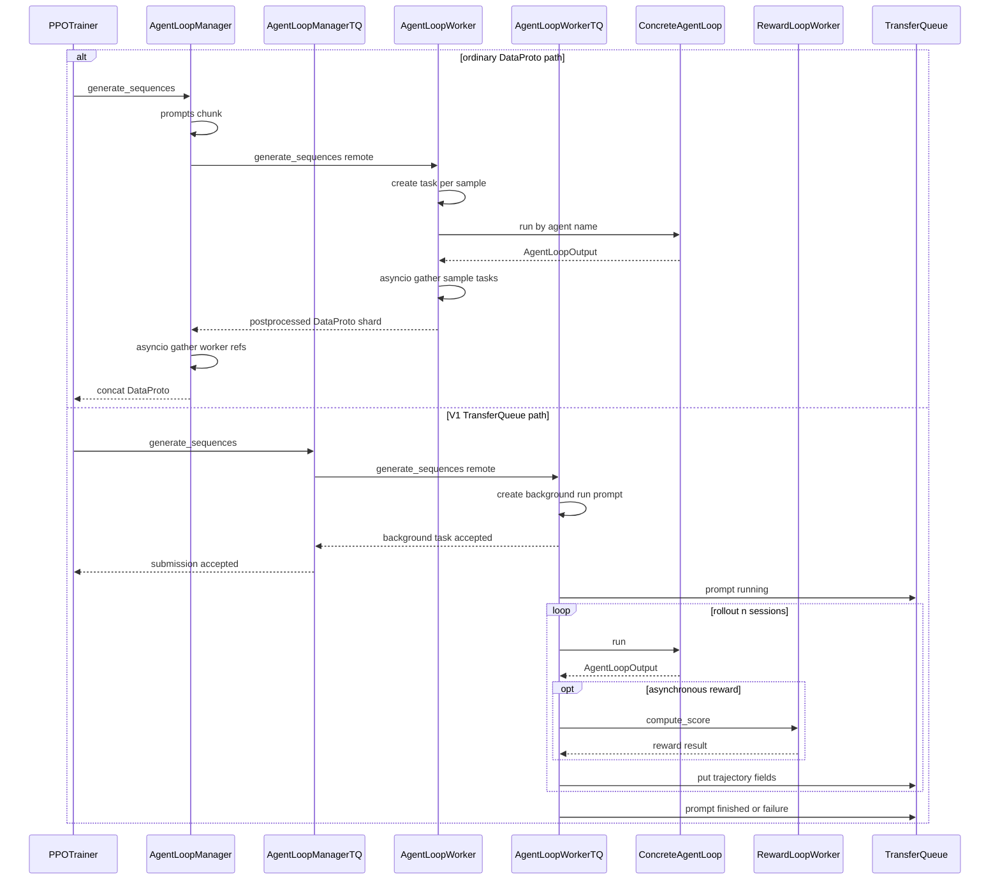

# verl AgentLoop 与 RewardLoop：从 prompt 到可训练 trajectory

> **代码基准**：verl `main` @ `254a23edc62f25ebfae626e3932ae285d6f86009`（2026-08-28）
> **最后更新**：2026-08-31 · **定位**：AgentLoop/RewardLoop 轨迹运行时唯一机制 owner
>
> **核心结论**：AgentLoop 是可替换的 per-trajectory coroutine runtime，不是 LLM server 的别名。
> 它选择单轮或工具多轮策略，把模型 token、工具 observation、多模态输入和可选 reward 归一成训练字段；
> RewardLoop 则把规则奖励、判别式/生成式 reward model 和用户函数统一成 per-sample score。V1 的 TQ
> adapter 只负责把这些结果持久化成 key/field/tag，不拥有 agent 或 reward 语义。

---

## 1. 四层 ownership

| 层 | 拥有的事实 | 不拥有的事实 |
|---|---|---|
| `AgentLoopBase` 与具体 loop | 一条 trajectory 的对话/工具状态、token 和 turn | 请求路由、KV cache、模型权重 |
| `AgentLoopWorker` | per-sample coroutine、postprocess、reward/teacher 接入 | prompt group 的训练 admission |
| `AgentLoopManager` | Ray workers 与 prompt batch dispatch | TQ key/tag、一致性与 ReplayBuffer 策略 |
| `RewardLoopManager/Worker` | reward worker、reward model router、score assembly | advantage、KL 与 policy loss |

四层不是按类名凑出的目录，而是四种状态寿命。**AgentLoopBase 是什么**：一条 trajectory 的可替换 coroutine；它在 `run()` 内与 LLM server 和环境交互。**AgentLoopWorker 怎么做**：对 batch 中每个样本按 `agent_name` 实例化 loop、并发执行，再统一 padding、mask、reward 和 teacher 后处理。**AgentLoopManager 为什么存在**：把 Ray worker 生命周期和 batch dispatch 从 per-trajectory 状态中移走，使具体 loop 不需要知道集群拓扑。RewardLoop 再单独持有模型 router/用户函数与 CPU/RM 资源生命周期（`verl/experimental/agent_loop/agent_loop.py:207-251,419-459,537-665`；`verl/experimental/reward_loop/reward_loop.py:93-155,273-341`）。

`【分析推断】` 若把这些职责都放进 LLM server，工具环境、reward 和训练字段会与 serving 的 KV/权重生命周期耦合；若全部放进 Trainer，每条轨迹的 coroutine 与外部副作用会阻塞训练控制面。当前拆分让 loop、worker 数和 reward 部署可以独立替换，代价是 trajectory 完成、TQ 持久化和训练 admission 分属不同 owner，不能用单个 coroutine 返回代表整条训练事务完成。

模块 docstring 明确把 `AgentLoopManager` 定义为一种可替换的 agent-framework implementation，并列出
Nemo-Gym、Bedrock AgentCore、SWE-agent 等可能替代者（`verl/experimental/agent_loop/agent_loop.py:14-27`）。
V1 `TaskRunnerV1` 也允许通过 fully qualified class 替换 manager，唯一硬契约是实现
`generate_sequences` 并把输出放进 TransferQueue（`verl/trainer/main_ppo.py:111-131`）。

所以“AgentLoop”不能和 vLLM/SGLang 混写：后者由 [[14_verl_rollout_runtime_analysis]] 拥有服务状态；
AgentLoop 只通过 `LLMServerClient` 发请求并解释结果。

## 2. 一条 trajectory 的真实路径



### 2.1 普通入口：两层 `gather` 后才返回 DataProto

```text
AgentLoopManager.generate_sequences(DataProto)
  → attach per-sample priority
  → prompts.chunk(num_workers)
  → asyncio.gather(worker.generate_sequences.remote(chunk) × workers)
      → AgentLoopWorker.generate_sequences
          → build sampling params and trajectory_info
          → asyncio.create_task(_run_agent_loop) × samples
          → asyncio.gather(sample tasks)
              → _run_agent_loop
                  → registry lookup and hydra instantiate by agent_name
                  → await concrete AgentLoopBase.run
                  → await _agent_loop_postprocess
          → _postprocess(outputs) → DataProto shard
  → DataProto.concat(worker outputs)
  → aggregate timing → return complete DataProto
```

manager 的 chunk、worker-level gather、concat 与 timing 聚合位于 `verl/experimental/agent_loop/agent_loop.py:1199-1230`；worker 的 per-sample task、sample-level gather、registry instantiate 与 `run` 在同文件 `537-665`。因此普通入口有两道完整批屏障：每个 worker 等自己的 sample tasks，manager 再等所有 worker refs。任一未处理异常会阻止完整 DataProto 返回。

### 2.2 V1 入口：`ray.get` 只确认后台任务已创建

```text
AgentLoopManagerTQ.generate_sequences(TensorDict)
  → prompts.chunk(num_workers)
  → ray.get(worker.generate_sequences.remote(chunk) × workers)
      → AgentLoopWorkerTQ.generate_sequences
          → for each prompt
              → asyncio.create_task(_run_prompt)
              → store task in background_tasks
          → return None
  ← submission accepted

background _run_prompt
  → TQ prompt tag running
  → create_task(_run_agent_loop) × rollout.n
  → each session runs concrete loop and TQ postprocess
  → gather all session tasks with return_exceptions
  → TQ prompt tag finished if no error else failure
```

manager 的 `ray.get` 位于 `verl/trainer/ppo/v1/agent_loop_tq.py:230-257`；worker 在 `59-105` 创建 background task 后就返回，真正 per-prompt/session 工作在 `107-148`。所以这处 `ray.get` 只证明 shard 已被 worker 接收且后台 task 已登记，不证明任何 trajectory 已生成。训练侧的完成屏障是 ReplayBuffer 之后观察 prompt terminal tag，而不是 manager 返回。

两种等待方式服务于不同消费者。普通入口需要立即交付一个完整、已 postprocess 的批对象，所以 `asyncio.gather` 是返回契约的一部分；V1 需要让采样生产与训练消费解耦，worker 只启动 background task，完成状态和字段随后进入 TQ。`【分析推断】` 后者避免 controller 因最慢 trajectory 建立整批屏障，但把 backpressure、group failure 和 admission 判断转移给 TQ/ReplayBuffer；它不是“同一个函数加了 async”这么简单。

## 3. Registry 与扩展契约

`AgentLoopBase.run()` 是 coroutine 抽象；`register(agent_name)` 将 class 写入 registry。worker 还可以从
`rollout.agent.agent_loop_config_path` 加载 Hydra configs，再按每条样本的 `agent_name` 实例化
（`verl/experimental/agent_loop/agent_loop.py:207-251,419-449,495-509,648-665`）。

当前内建两条基础路线：

- `single_turn_agent`：Continuous Token 构造 prompt，向 server 发一次请求，再把 assistant token 合入
  response mask（`verl/experimental/agent_loop/single_turn_agent_loop.py:28-105`）；
- `tool_agent`：在 `PENDING → GENERATING → PROCESSING_TOOLS → TERMINATED` 状态机中循环，限制 user turn、
  assistant turn、并行工具调用和 tool response 长度，并允许逐样本选择工具
  （`verl/experimental/agent_loop/tool_agent_loop.py:98-177,190-225`）。

自定义 loop 至少必须返回 `AgentLoopOutput` 的 prompt ids、response ids、response mask、turn 数和 metrics。
可选字段包括 response log-prob、routed experts、多模态数据、预先计算的 reward 及任意 extra fields
（`verl/experimental/agent_loop/agent_loop.py:79-120`）。如果 loop 自己已经计算 reward，例如外部 agent
环境给出终局分数，worker 不会再次覆盖。

## 4. Continuous Token 与多轮 mask

AgentLoop 的训练契约不是“把所有 response token 都算 loss”。`AgentLoopOutput.response_mask` 约定模型
生成 token 为 1，tool observation 与 padding 为 0；postprocess 再与 response attention mask 相乘，形成
最终训练 mask（`verl/experimental/agent_loop/agent_loop.py:88-108,698-750`）。

单轮 loop 也走相同 schema，并显式补空的 `turn_scores`/`tool_rewards`，避免下游按 loop 类型分叉
（`verl/experimental/agent_loop/single_turn_agent_loop.py:77-105`）。工具 loop 则把多轮生成和工具 token
合成一个响应序列，并把 per-turn score 与 tool reward 放入 extra fields
（`verl/experimental/agent_loop/tool_agent_loop.py:179-209`）。

postprocess 还负责：

1. prompt 左 padding、response 右 padding；
2. 组合 `input_ids`、`attention_mask`、`position_ids`；
3. 对 routed experts 和多模态输入保持 token 位置对齐；
4. 可选接入 reward 与 teacher log-prob；
5. 把逐 trajectory 输出拼回 DataProto。

实现位于 `verl/experimental/agent_loop/agent_loop.py:698-836,838-935,1001-1118`。多模态输入若没有
支持它的 Continuous Token builder 和 processor 会 fail loud，而不是静默退回文本路径
（`verl/experimental/agent_loop/agent_loop.py:254-270`）。

这些 mask 和位置是算法正确性的输入；advantage 与 loss 如何使用它们由 [[15_verl_rl_algorithms_analysis]]
负责。

## 5. RewardLoop 的三条打分路线

`RewardLoopWorker` 支持规则奖励、reward model 和用户函数。选择顺序是：有 custom reward function 时直接
调用 reward manager；否则启用 reward model 时走判别式 RM；都没有时走默认/注册的规则 reward manager
（`verl/experimental/reward_loop/reward_loop.py:93-155`）。生成式 RM 必须由用户函数组织请求，源码不会把
它误当判别式 `/classify`。

| 路线 | 执行位置 | 结果形式 | 主要边界 |
|---|---|---|---|
| rule/custom function | RewardLoop Ray CPU workers | scalar + extra info | 用户函数可访问 raw prompt/tool fields |
| colocated RM | Trainer 在采样后调用 manager | `rm_scores` TensorDict | RM 与 rollout 共享资源，不能与生成并行 |
| standalone RM pool | AgentLoop 中异步调用 reward workers | final trajectory reward | 需要额外资源池和 router 生命周期 |

`RewardLoopManager.reward_loop_worker_handles` 只在“无 RM”或“RM 有独立 resource pool”时返回 handles；
colocated RM 返回 `None`，Trainer 必须在 rollout 结束后批量打分
（`verl/experimental/reward_loop/reward_loop.py:273-322`；
`verl/trainer/ppo/v1/trainer_base.py:329-387,540-560`）。这不是一个性能小开关：它决定 reward 是 trajectory
coroutine 的一部分，还是训练 step 中的独立阶段。

设计原因来自资源可并发性，而不是 reward 算法名字：源码只在规则/自定义函数或独立 RM pool 可与 rollout 并行时返回 reward worker handles，colocated RM 则由 Trainer 在生成后批处理（`verl/experimental/reward_loop/reward_loop.py:312-322`）。`【分析推断】` 前者缩短 reward 进入 TQ 的等待，但增加 worker/router 与请求重试状态；后者减少独立常驻资源，却在 step 内形成显式 reward barrier。把 colocated RM 也塞进 AgentLoop coroutine 会让资源切换和生成请求竞争同一设备。

### 5.1 可并行 reward：在 trajectory coroutine 内等待

```text
AgentLoopWorkerTQ._agent_loop_postprocess(outputs)
  → AgentLoopWorker._compute_score(outputs, kwargs)
      → if final_output.reward_score already exists: skip
      → pad every output prompt/response into temporary DataProto
      → random choice one reward_loop_worker handle
      → await RewardLoopWorker.compute_score.remote(data)
          ├─ custom reward path → reward_manager.run_single
          ├─ discriminative RM path → compute_score_disrm on final row
          └─ rule path → reward_manager.run_single
      → assign reward_score and reward_extra_info to final_output only
  → copy final reward and extra info to earlier outputs in same session
  → write all session outputs to TQ
```

临时 DataProto 组装、随机 worker 选择与 remote await 在 `verl/experimental/agent_loop/agent_loop.py:937-999`；RewardLoopWorker 的 custom/discriminative/rule 分支在 `verl/experimental/reward_loop/reward_loop.py:138-155`；TQ adapter 的 sibling broadcast 在 `verl/trainer/ppo/v1/agent_loop_tq.py:150-181`。**完成点**是 reward remote 返回并且带 reward 的 trajectory fields 已写 TQ；只有 score 写到 Python `final_output` 还不够。若具体 loop 已提供终局 reward，`_compute_score` 跳过外部 RewardLoop，这是一条显式短路分支。

### 5.2 colocated reward：ReplayBuffer 之后的 batch barrier

```text
PPOTrainer._step_once
  → ReplayBuffer.sample returns KVBatchMeta
  → because reward_loop_worker_handles is None
      → PPOTrainer._compute_reward_colocate
          → TQ get prompts responses raw_prompt
          → nested lengths → padded prompts/responses and attention mask
          → temporary DataProto
          → RewardLoopManager.compute_rm_score
              → optional reward model wake_up
              → pad_dataproto_to_divisor num_workers
              → DataProto.chunk num_workers
              → ray.get RewardLoopWorker.compute_score_batch.remote × workers
                  → create per-sample compute_score tasks
                  → asyncio.gather
              → flatten and remove pad outputs
              → assemble_rm_scores
              → collect reward extra info
              → optional reward model sleep
          → padded rm_scores → response-length nested rm_scores
          → TQ put rm_scores and extra fields
```

Trainer 选择 colocated 分支与 TQ 读/写位于 `verl/trainer/ppo/v1/trainer_base.py:540-560,1436-1488`；RewardLoopManager 的 wake、pad、chunk、Ray gather、unpad、score assembly 和 sleep 位于 `verl/experimental/reward_loop/reward_loop.py:343-376`，worker 内部再对 chunk 的每个样本并发 `compute_score`（同文件 `138-155`）。这里的 padding 只满足 worker 数整除，manager 在 assembly 前按原 batch 长度丢掉补项；Trainer 最后又按原 response length 把 padded score 裁回 nested TQ 字段，所以补样本不能进入 advantage。

| reward 路径 | 输入 owner | 等待位置 | reward 首次附着位置 | 对训练可见的完成点 |
|---|---|---|---|---|
| loop 已给 reward | concrete AgentLoop | 无额外 reward RPC | `AgentLoopOutput.reward_score` | TQ trajectory write 完成 |
| async handles | AgentLoop worker | `_compute_score` await 单个 RewardLoopWorker | final output，再广播到 session siblings | 所有 session 写回且 prompt terminal |
| colocated batch | Trainer + RewardLoopManager | manager 的 `ray.get` 等所有 reward chunks | returned DataProto `rm_scores` | Trainer 将 nested scores/extra fields 写回 TQ |

## 6. V1 TQ adapter：只拥有落库适配

`AgentLoopWorkerTQ` 为 prompt uid 写 `running`，为每个 `rollout.n` session 启动 loop；只有所有 session
settle 后才把 prompt 标成 `finished` 或 `failure`，防止某个晚到 sibling 在 ReplayBuffer 清理失败 group 后
继续写数据（`verl/trainer/ppo/v1/agent_loop_tq.py:107-148`）。

每个 output 使用 `{uid}_{session_id}_{index}` 作为 trajectory key，写入 token、mask、position、reward、
extra fields，并把生成起止版本放入 tags（`verl/trainer/ppo/v1/agent_loop_tq.py:150-227`）。

一条 prompt 到 terminal group 的真实调用链是：

```text
AgentLoopWorkerTQ._run_prompt
  → tq.async_kv_put prompt status running
  → create_task AgentLoopWorker._run_agent_loop × rollout.n
      → lookup agent_name and hydra instantiate concrete loop
      ├─ SingleTurnAgentLoop.run
      │    → build Continuous Token prompt
      │    → LLMServerClient.generate once
      │    → merge assistant tokens → AgentLoopOutput
      └─ ToolAgentLoop.run
           → PENDING → GENERATING → PROCESSING_TOOLS
           → repeat until TERMINATED
           → AgentLoopOutput with turn and tool fields
      → AgentLoopWorkerTQ._agent_loop_postprocess
          → _compute_score
          → _compute_teacher_logprobs
          → broadcast final reward to earlier outputs in same session
          → build trajectory fields and tags
          → tq.async_kv_batch_put trajectory keys
  → _settle_session_tasks with return_exceptions
  → tq.async_kv_put prompt status finished or failure
```

基类 `_run_agent_loop` 完成 registry instantiate、具体 `run` 与动态 postprocess 调用（`verl/experimental/agent_loop/agent_loop.py:631-665`）。单轮 loop 的 Continuous Token、一次 server 请求与输出合并在 `verl/experimental/agent_loop/single_turn_agent_loop.py:28-107`；工具 loop 的状态机与最终输出在 `verl/experimental/agent_loop/tool_agent_loop.py:98-209`。TQ 子类 postprocess 的 score/teacher、reward 广播、key/field/tag 构造与批量写入位于 `verl/trainer/ppo/v1/agent_loop_tq.py:150-227`。

| 状态对象 | 输入/前态 | owner 与动作 | 输出/后态 | 完成信号 |
|---|---|---|---|---|
| prompt uid tag | `pending` | `_run_prompt` 写 `running` | group 正在生成 | async TQ put 返回 |
| session task | prompt + session id + sampling params | concrete loop 运行 LLM/tool 状态机 | 一个或多个 `AgentLoopOutput` | concrete `run` 返回仍未代表已落库 |
| session outputs | token/mask/extra fields，可选已有 reward | TQ postprocess 打分、teacher、位置与字段转换 | `{uid}_{session}_{index}` trajectory records | `async_kv_batch_put` 返回 |
| sibling set | N 个 session tasks | `_settle_session_tasks` 使用 `return_exceptions=True` 等全部结束 | errors 列表 | 所有 siblings 都不会再写 trajectory |
| prompt uid tag | `running` + errors 列表 | `_run_prompt` 选择 terminal status | `finished` 或 `failure` | terminal tag 写入后 ReplayBuffer 才可 admission/evict |

这里必须区分 session trajectory tag 的 `success` 与 prompt group tag 的 `finished`：前者说明某条输出已经写入，后者说明该 prompt 的所有 rollout siblings 已结束。只看到一条 `{uid}_{session}_{index}` 记录不能提前训练该 group；否则晚到 sibling 仍可能改变组样本集合。

这个 adapter 的定位是“提交轨迹字段”，而不是重新解释 AgentLoopOutput。实现保留 worker 的 token/mask/reward 结果，只负责生成稳定 key、写 running/finished/failure 和版本 tags。`【分析推断】` 这样做让相同 AgentLoop runtime 同时服务普通 DataProto 返回与 V1 引用流；代价是应用语义和持久化状态跨两层排错，尤其要区分“loop 已返回”与“所有 sibling 已 settle 且 group 已标记 finished”。

owner 边界是：

- 本页解释 output 为什么有这些字段、mask 和 reward；
- [[16_verl_v1_transfer_queue_analysis]] 解释 key/tag 怎样存储、查询和物化；
- [[17_verl_v1_async_trainer_analysis]] 解释 ReplayBuffer 怎样按 group、age 和 status admission。

## 7. 失败与可观测边界

| 失败点 | 当前行为 | 不能外推的保证 |
|---|---|---|
| 未注册 `agent_name` | instantiate 前 assert | 不会自动回退到 single-turn |
| 多模态 builder/processor 不匹配 | 状态改变前抛错 | 不会静默丢弃图片、视频或音频 |
| 一个 session 抛错 | TQ adapter 等所有 siblings settle，再把 group 标为 failure | 已完成外部工具副作用不会 rollback |
| reward HTTP 4xx | 不重试并抛错 | 配置/输入错误不会靠 retry 修复 |
| reward HTTP 5xx/连接错误 | 指数退避，最多 16 次 | 没有跨服务 exactly-once 语义 |
| loop 已给 reward | 跳过 RewardLoop | 外部 reward 的尺度与算法期望仍由用户负责 |

reward HTTP retry 位于 `verl/experimental/reward_loop/reward_loop.py:157-195`。AgentLoop metrics 记录
generate、tool call、score 与 preemption；rollout trace 按 step/sample/rollout_n 标记 coroutine
（`verl/experimental/agent_loop/agent_loop.py:79-86,515-526,639-647`）。这些信号能定位慢阶段，但不能
证明工具环境幂等、reward 服务无重复执行或 trajectory 已持久化。

## 8. 扩展检查表

1. 新 loop 返回的 prompt/response/mask 长度必须一致，并明确 observation token 的 loss mask；
2. 多模态必须保留 processor kwargs 和 token-position 对齐；
3. 自定义 reward 明确输入是单 output、整条 trajectory，还是终局状态；
4. reward extra info 使用逐样本数组，不要塞进全局 meta；
5. 工具副作用、HTTP retry 和 session retry 需要应用级幂等 key；
6. custom manager 必须满足 V1 的 fire-and-forget + TQ 输出契约；
7. 评测时分别报告 generation、tool、reward latency，不能只看总 rollout 时间。

## Related Pages

- [[10_verl_end_to_end_iteration_analysis]] —— Agent trajectory 在默认 V1 sync step 中的调用位置。
- [[12_verl_dataproto_analysis]] —— AgentLoop 输入输出使用的本地 batch 容器。
- [[14_verl_rollout_runtime_analysis]] —— AgentLoop 请求所连接的 LLM server 与 KV 生命周期。
- [[15_verl_rl_algorithms_analysis]] —— reward、mask 与 trajectory 字段进入 advantage/loss 后的语义。
- [[16_verl_v1_transfer_queue_analysis]] —— AgentLoop 输出的 key/tag/storage 与延迟物化。
- [[17_verl_v1_async_trainer_analysis]] —— prompt group 完成后如何进入 async admission。
- [[22_verl_fully_async_dynamic_schedule_deepdive]] —— experimental fully async 对同一 AgentLoop runtime 的独立调度。
