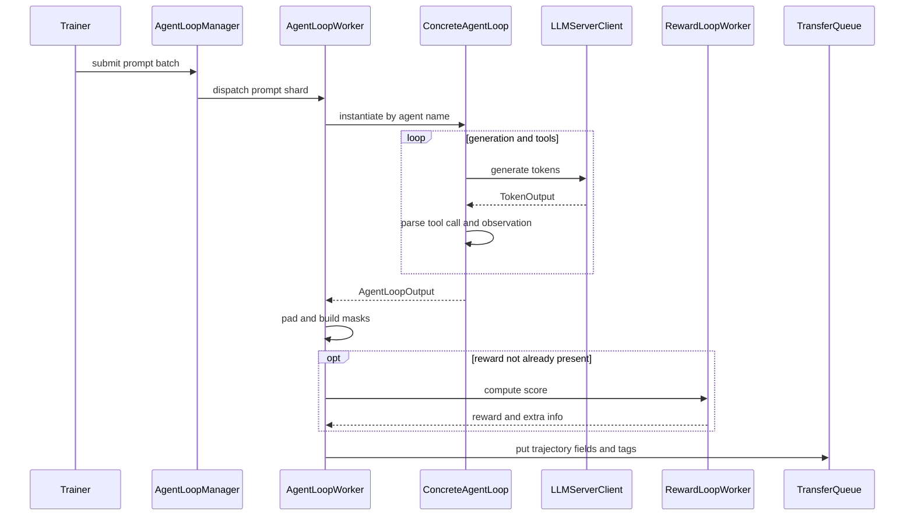

# verl AgentLoop 与 RewardLoop：从 prompt 到可训练 trajectory

> **代码基准**：verl `main` @ `254a23edc62f25ebfae626e3932ae285d6f86009`（2026-08-28）
> **最后更新**：2026-08-31 · **定位**：AgentLoop/RewardLoop 轨迹运行时唯一机制 owner
>
> **核心结论**：AgentLoop 是可替换的 per-trajectory coroutine runtime，不是 LLM server 的别名。
> 它选择单轮或工具多轮策略，把模型 token、工具 observation、多模态输入和可选 reward 归一成训练字段；
> RewardLoop 则把规则奖励、判别式/生成式 reward model 和用户函数统一成 per-sample score。V1 的 TQ
> adapter 只负责把这些结果持久化成 key/field/tag，不拥有 agent 或 reward 语义。

---

## 1. 四层 ownership

| 层 | 拥有的事实 | 不拥有的事实 |
|---|---|---|
| `AgentLoopBase` 与具体 loop | 一条 trajectory 的对话/工具状态、token 和 turn | 请求路由、KV cache、模型权重 |
| `AgentLoopWorker` | per-sample coroutine、postprocess、reward/teacher 接入 | prompt group 的训练 admission |
| `AgentLoopManager` | Ray workers 与 prompt batch dispatch | TQ key/tag、一致性与 ReplayBuffer 策略 |
| `RewardLoopManager/Worker` | reward worker、reward model router、score assembly | advantage、KL 与 policy loss |

模块 docstring 明确把 `AgentLoopManager` 定义为一种可替换的 agent-framework implementation，并列出
Nemo-Gym、Bedrock AgentCore、SWE-agent 等可能替代者（`verl/experimental/agent_loop/agent_loop.py:14-27`）。
V1 `TaskRunnerV1` 也允许通过 fully qualified class 替换 manager，唯一硬契约是实现
`generate_sequences` 并把输出放进 TransferQueue（`verl/trainer/main_ppo.py:111-131`）。

所以“AgentLoop”不能和 vLLM/SGLang 混写：后者由 [[14_verl_rollout_runtime_analysis]] 拥有服务状态；
AgentLoop 只通过 `LLMServerClient` 发请求并解释结果。

## 2. 一条 trajectory 的真实路径

普通 `AgentLoopWorker.generate_sequences` 从 DataProto 读取 sampling config，为每个样本创建 asyncio task，
按 `agent_name` 从 registry 取 Hydra config 并实例化具体 loop，最后 `gather` 全部结果
（`verl/experimental/agent_loop/agent_loop.py:537-665`）。V1 TQ adapter 改成 fire-and-forget：worker
立即为每个 prompt 启动 background task，输出完成后再写 TQ（`verl/trainer/ppo/v1/agent_loop_tq.py:53-105`）。

这两个入口共享 AgentLoop 语义，但等待方式不同：普通 manager 返回完整 DataProto；V1 manager 返回控制权，
Trainer 之后由 ReplayBuffer/TQ 状态判断哪些 prompt group 已完成。

## 3. Registry 与扩展契约

`AgentLoopBase.run()` 是 coroutine 抽象；`register(agent_name)` 将 class 写入 registry。worker 还可以从
`rollout.agent.agent_loop_config_path` 加载 Hydra configs，再按每条样本的 `agent_name` 实例化
（`verl/experimental/agent_loop/agent_loop.py:207-251,419-449,495-509,648-665`）。

当前内建两条基础路线：

- `single_turn_agent`：Continuous Token 构造 prompt，向 server 发一次请求，再把 assistant token 合入
  response mask（`verl/experimental/agent_loop/single_turn_agent_loop.py:28-105`）；
- `tool_agent`：在 `PENDING → GENERATING → PROCESSING_TOOLS → TERMINATED` 状态机中循环，限制 user turn、
  assistant turn、并行工具调用和 tool response 长度，并允许逐样本选择工具
  （`verl/experimental/agent_loop/tool_agent_loop.py:98-177,190-225`）。

自定义 loop 至少必须返回 `AgentLoopOutput` 的 prompt ids、response ids、response mask、turn 数和 metrics。
可选字段包括 response log-prob、routed experts、多模态数据、预先计算的 reward 及任意 extra fields
（`verl/experimental/agent_loop/agent_loop.py:79-120`）。如果 loop 自己已经计算 reward，例如外部 agent
环境给出终局分数，worker 不会再次覆盖。

## 4. Continuous Token 与多轮 mask

AgentLoop 的训练契约不是“把所有 response token 都算 loss”。`AgentLoopOutput.response_mask` 约定模型
生成 token 为 1，tool observation 与 padding 为 0；postprocess 再与 response attention mask 相乘，形成
最终训练 mask（`verl/experimental/agent_loop/agent_loop.py:88-108,698-750`）。

单轮 loop 也走相同 schema，并显式补空的 `turn_scores`/`tool_rewards`，避免下游按 loop 类型分叉
（`verl/experimental/agent_loop/single_turn_agent_loop.py:77-105`）。工具 loop 则把多轮生成和工具 token
合成一个响应序列，并把 per-turn score 与 tool reward 放入 extra fields
（`verl/experimental/agent_loop/tool_agent_loop.py:179-209`）。

postprocess 还负责：

1. prompt 左 padding、response 右 padding；
2. 组合 `input_ids`、`attention_mask`、`position_ids`；
3. 对 routed experts 和多模态输入保持 token 位置对齐；
4. 可选接入 reward 与 teacher log-prob；
5. 把逐 trajectory 输出拼回 DataProto。

实现位于 `verl/experimental/agent_loop/agent_loop.py:698-836,838-935,1001-1118`。多模态输入若没有
支持它的 Continuous Token builder 和 processor 会 fail loud，而不是静默退回文本路径
（`verl/experimental/agent_loop/agent_loop.py:254-270`）。

这些 mask 和位置是算法正确性的输入；advantage 与 loss 如何使用它们由 [[15_verl_rl_algorithms_analysis]]
负责。

## 5. RewardLoop 的三条打分路线

`RewardLoopWorker` 支持规则奖励、reward model 和用户函数。选择顺序是：有 custom reward function 时直接
调用 reward manager；否则启用 reward model 时走判别式 RM；都没有时走默认/注册的规则 reward manager
（`verl/experimental/reward_loop/reward_loop.py:93-155`）。生成式 RM 必须由用户函数组织请求，源码不会把
它误当判别式 `/classify`。

| 路线 | 执行位置 | 结果形式 | 主要边界 |
|---|---|---|---|
| rule/custom function | RewardLoop Ray CPU workers | scalar + extra info | 用户函数可访问 raw prompt/tool fields |
| colocated RM | Trainer 在采样后调用 manager | `rm_scores` TensorDict | RM 与 rollout 共享资源，不能与生成并行 |
| standalone RM pool | AgentLoop 中异步调用 reward workers | final trajectory reward | 需要额外资源池和 router 生命周期 |

`RewardLoopManager.reward_loop_worker_handles` 只在“无 RM”或“RM 有独立 resource pool”时返回 handles；
colocated RM 返回 `None`，Trainer 必须在 rollout 结束后批量打分
（`verl/experimental/reward_loop/reward_loop.py:273-322`；
`verl/trainer/ppo/v1/trainer_base.py:329-387,540-560`）。这不是一个性能小开关：它决定 reward 是 trajectory
coroutine 的一部分，还是训练 step 中的独立阶段。

异步路径在 `_compute_score` 中把一条 trajectory 的一个或多个 output 组装成临时 DataProto，随机选择
reward worker，最终只把 score 写到最后一个 output，并保存 extra info
（`verl/experimental/agent_loop/agent_loop.py:937-999`）。TQ adapter 再把 final score 复制给同一 session 的
早期 outputs，保证一条多输出 agent trajectory 使用共同终局 reward
（`verl/trainer/ppo/v1/agent_loop_tq.py:150-181`）。

批量 colocated 路径会 pad 到 reward worker 数的倍数、并发计算、unpad，再把 scalar 组装成 token-level
`rm_scores`（`verl/experimental/reward_loop/reward_loop.py:343-370`）。这里的 padding 是执行便利，不能
变成额外训练样本。

## 6. V1 TQ adapter：只拥有落库适配

`AgentLoopWorkerTQ` 为 prompt uid 写 `running`，为每个 `rollout.n` session 启动 loop；只有所有 session
settle 后才把 prompt 标成 `finished` 或 `failure`，防止某个晚到 sibling 在 ReplayBuffer 清理失败 group 后
继续写数据（`verl/trainer/ppo/v1/agent_loop_tq.py:107-148`）。

每个 output 使用 `{uid}_{session_id}_{index}` 作为 trajectory key，写入 token、mask、position、reward、
extra fields，并把生成起止版本放入 tags（`verl/trainer/ppo/v1/agent_loop_tq.py:150-227`）。

owner 边界是：

- 本页解释 output 为什么有这些字段、mask 和 reward；
- [[16_verl_v1_transfer_queue_analysis]] 解释 key/tag 怎样存储、查询和物化；
- [[17_verl_v1_async_trainer_analysis]] 解释 ReplayBuffer 怎样按 group、age 和 status admission。

## 7. 失败与可观测边界

| 失败点 | 当前行为 | 不能外推的保证 |
|---|---|---|
| 未注册 `agent_name` | instantiate 前 assert | 不会自动回退到 single-turn |
| 多模态 builder/processor 不匹配 | 状态改变前抛错 | 不会静默丢弃图片、视频或音频 |
| 一个 session 抛错 | TQ adapter 等所有 siblings settle，再把 group 标为 failure | 已完成外部工具副作用不会 rollback |
| reward HTTP 4xx | 不重试并抛错 | 配置/输入错误不会靠 retry 修复 |
| reward HTTP 5xx/连接错误 | 指数退避，最多 16 次 | 没有跨服务 exactly-once 语义 |
| loop 已给 reward | 跳过 RewardLoop | 外部 reward 的尺度与算法期望仍由用户负责 |

reward HTTP retry 位于 `verl/experimental/reward_loop/reward_loop.py:157-195`。AgentLoop metrics 记录
generate、tool call、score 与 preemption；rollout trace 按 step/sample/rollout_n 标记 coroutine
（`verl/experimental/agent_loop/agent_loop.py:79-86,515-526,639-647`）。这些信号能定位慢阶段，但不能
证明工具环境幂等、reward 服务无重复执行或 trajectory 已持久化。

## 8. 扩展检查表

1. 新 loop 返回的 prompt/response/mask 长度必须一致，并明确 observation token 的 loss mask；
2. 多模态必须保留 processor kwargs 和 token-position 对齐；
3. 自定义 reward 明确输入是单 output、整条 trajectory，还是终局状态；
4. reward extra info 使用逐样本数组，不要塞进全局 meta；
5. 工具副作用、HTTP retry 和 session retry 需要应用级幂等 key；
6. custom manager 必须满足 V1 的 fire-and-forget + TQ 输出契约；
7. 评测时分别报告 generation、tool、reward latency，不能只看总 rollout 时间。

## Related Pages

- [[10_verl_end_to_end_iteration_analysis]] —— Agent trajectory 在默认 V1 sync step 中的调用位置。
- [[12_verl_dataproto_analysis]] —— AgentLoop 输入输出使用的本地 batch 容器。
- [[14_verl_rollout_runtime_analysis]] —— AgentLoop 请求所连接的 LLM server 与 KV 生命周期。
- [[15_verl_rl_algorithms_analysis]] —— reward、mask 与 trajectory 字段进入 advantage/loss 后的语义。
- [[16_verl_v1_transfer_queue_analysis]] —— AgentLoop 输出的 key/tag/storage 与延迟物化。
- [[17_verl_v1_async_trainer_analysis]] —— prompt group 完成后如何进入 async admission。
- [[22_verl_fully_async_dynamic_schedule_deepdive]] —— experimental fully async 对同一 AgentLoop runtime 的独立调度。
