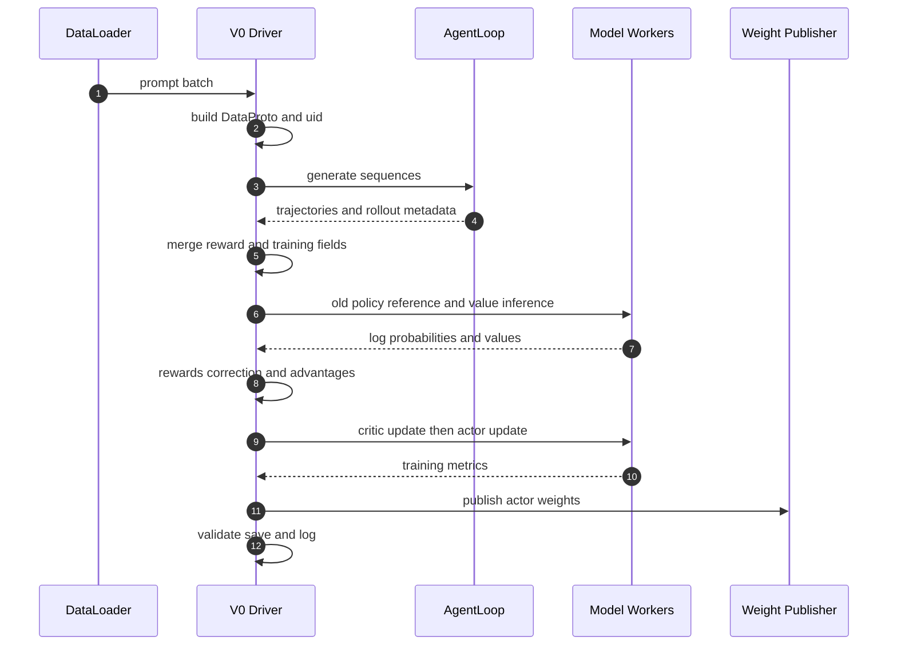

# verl V0 legacy：当前 RayPPOTrainer 生命周期

> **代码基准**：verl `main` @ `254a23edc62f25ebfae626e3932ae285d6f86009`
> **最后复核**：2026-08-31
> **概念所有权**：本页唯一负责当前 V0 `RayPPOTrainer` 的动态生命周期；V0 仍可显式选择，但类已被标记为 deprecated。

## 核心判断

当前 V0 不是一套与 V1 完全分离的旧系统。它保留了 **driver 持有整批 `DataProto`、按固定顺序发起远程调用** 的控制结构，却已经复用当前的 `AgentLoopManager`、`RewardLoopManager`、统一模型引擎 worker 和 `CheckpointEngineManager`。因此，理解 V0 的关键不再是记住一组历史 worker 类，而是看清：**整批状态在 driver 汇合，生成、奖励、模型计算和权重发布分别委托给共享运行时**（`verl/trainer/ppo/ray_trainer.py:772-981`、`verl/trainer/ppo/ray_trainer.py:1405-1719`）。

入口默认选择 V1；只有显式设置 `trainer.use_v1=false` 才构造 `RayPPOTrainer`（`verl/trainer/main_ppo.py:183-192`）。类本身也明确标注将被移除并建议使用 V1（`verl/trainer/ppo/ray_trainer.py:285-292`）。所以本页的用途是解释仍在仓库、仍能执行的 legacy 路径，而不是推荐新任务优先采用它。

## 1. 边界：本页讲什么，不讲什么

| 问题 | 本页负责 | 交给其他页 |
|---|---|---|
| V0 一步如何推进 | driver 上的阶段顺序、状态汇合点、远程调用点 | — |
| Ray worker 如何分发和收集 | 只说明调用发生在哪里 | [[11_verl_single_controller_analysis]] |
| `DataProto` 的字段与不变量 | 只说明何时构造、复制和合并 | [[12_verl_dataproto_analysis]] |
| AgentLoop 与 RewardLoop 内部机制 | 只说明 V0 如何接入 | [[18_verl_agent_loop_reward_runtime_analysis]] |
| advantage、KL 与 loss 数学 | 只标出算法阶段 | [[15_verl_rl_algorithms_analysis]] |
| 训练权重如何发布给 rollout | 只标出发布时机 | [[21_verl_weight_publication_analysis]] |
| 跨重启 checkpoint 与恢复 | 只标出保存时机 | [[23_verl_training_checkpoint_recovery_analysis]] |

## 2. 静态装配：legacy controller，现代共享组件

`RayPPOTrainer` 在单个 driver 进程上持有配置、数据集、全局步数以及各 worker group 的句柄；实际模型计算仍由 Ray worker 完成（`verl/trainer/ppo/ray_trainer.py:296-325`）。初始化时先根据算法和模型配置确定 ref、critic、reward model 与 teacher 是否需要，再记录 LoRA 场景下 ref 是否复用 actor（`verl/trainer/ppo/ray_trainer.py:341-360`）。

`init_workers()` 把这组逻辑需求落到运行时：

1. 建立资源池并登记 actor、critic、ref 的 worker 类（`verl/trainer/ppo/ray_trainer.py:772-845`）。
2. 将同一资源池中的角色合并为 colocated worker，创建 worker group，并依次初始化 critic、ref 和 actor-rollout（`verl/trainer/ppo/ray_trainer.py:847-907`）。
3. 创建 `RewardLoopManager`（`verl/trainer/ppo/ray_trainer.py:909-919`）。
4. 创建 LLM server 与 `AgentLoopManager`；这里生成模式固定为 async，因为旧 sync rollout 模式已废弃（`verl/trainer/ppo/ray_trainer.py:921-965`）。
5. 创建 `CheckpointEngineManager`，随后让 rollout replicas 休眠，等待载入训练 checkpoint 后再发布权重（`verl/trainer/ppo/ray_trainer.py:967-981`）。

这解释了一个容易误判的事实：**V0 的“legacy”主要在 trainer 编排方式，而不是说它仍运行一套被冻结的 rollout/reward/worker 实现。**

## 3. 当前一步训练的真实生命周期

### 3.1 恢复后先建立可采样版本

`fit()` 创建 tracker，调用 `_load_checkpoint()`，然后立即执行 `checkpoint_manager.update_weights(0)`，保证 rollout 在第一次生成前拿到训练侧权重（`verl/trainer/ppo/ray_trainer.py:1405-1431`）。这次调用是在线权重发布，不等价于把优化器、dataloader 和步数持久化；两类 checkpoint 的边界见 [[23_verl_training_checkpoint_recovery_analysis]]。

### 3.2 prompt 扩展为轨迹批

每个 dataloader batch 被转换为 `DataProto`，写入 temperature 和逐 prompt 的 `uid`，再按 `rollout.n` 复制生成请求（`verl/trainer/ppo/ray_trainer.py:1465-1505`）。`uid` 在复制前创建，因此同一 prompt 的多条响应仍能在 GRPO、RLOO 等组级算法中被识别为一组。

生成由 `async_rollout_manager.generate_sequences()` 执行；完成后立即让 rollout replicas 休眠，释放与训练共享的资源（`verl/trainer/ppo/ray_trainer.py:1507-1519`）。生成结果切片后与同样重复过的 prompt batch 合并，并补齐 `response_mask`；可选的 batch balancing 只改变物理排列，不改变按 `uid` 定义的组关系（`verl/trainer/ppo/ray_trainer.py:1521-1550`）。

### 3.3 奖励与训练所需的策略状态在 driver 汇合

V0 先补齐或提取奖励（`verl/trainer/ppo/ray_trainer.py:1561-1568`），再选择直接使用 rollout log-prob 或重算 `old_log_probs`（`verl/trainer/ppo/ray_trainer.py:1570-1617`）。需要 reference policy 或 critic 时，随后分别补齐 `ref_log_prob` 和 `values`（`verl/trainer/ppo/ray_trainer.py:1618-1628`）。

这些字段最终在 driver 的同一份 `DataProto` 中汇合。driver 把 reward 写入 token 级字段，按配置施加 KL 和 rollout correction，再调用统一 advantage 入口（`verl/trainer/ppo/ray_trainer.py:1630-1675`）。算法含义由 [[15_verl_rl_algorithms_analysis]] 负责；本页只强调控制事实：V0 必须等这一批所需字段齐备后，才进入更新阶段。

### 3.4 critic 先更新，actor 后更新，最后发布新版本

若启用 critic，V0 先更新 critic；critic warmup 结束后才更新 actor（`verl/trainer/ppo/ray_trainer.py:1676-1690`）。满足保存条件时，actor 更新后执行训练 checkpoint 保存，随后才调用 `checkpoint_manager.update_weights(global_steps)` 把新 actor 版本发布给 rollout（`verl/trainer/ppo/ray_trainer.py:1692-1719`）。

这套顺序给出两个不同的完成点：

- `_save_checkpoint()` 完成，表示跨重启所需的训练状态已按当前 V0 协议落盘；
- `update_weights()` 完成，表示当前进程内 rollout replicas 已切换到可用于下一次生成的 actor 版本。

两者不能互相替代。

## 4. 阶段、承载者与批状态

| 阶段 | 主要承载者 | driver 侧状态变化 | 当前源码 |
|---|---|---|---|
| prompt 准备 | V0 driver | `DataProto`、temperature、`uid`、重复请求 | `verl/trainer/ppo/ray_trainer.py:1478-1505` |
| 轨迹生成 | AgentLoop 与 LLM server | 合并 responses、rollout metadata、可选流式奖励 | `verl/trainer/ppo/ray_trainer.py:1507-1544` |
| 奖励 | RewardLoop 或已有生成结果 | 得到 reward tensor 与附加信息 | `verl/trainer/ppo/ray_trainer.py:1561-1568` |
| old policy | actor worker | `old_log_probs`、entropy 与可选路由信息 | `verl/trainer/ppo/ray_trainer.py:1570-1617` |
| ref 与 value | ref、critic worker | `ref_log_prob`、`values` | `verl/trainer/ppo/ray_trainer.py:1618-1628` |
| 算法变换 | V0 driver | token reward、correction、advantages、returns | `verl/trainer/ppo/ray_trainer.py:1630-1675` |
| 参数更新 | critic、actor worker | 更新模型，返回 metrics | `verl/trainer/ppo/ray_trainer.py:1676-1690` |
| 持久化与发布 | training checkpoint、CheckpointEngine | 保存恢复状态；发布下一采样版本 | `verl/trainer/ppo/ray_trainer.py:1692-1719` |

## 5. V0 与 V1 的本质差异

| 维度 | V0 `RayPPOTrainer` | V1 stable trainers |
|---|---|---|
| 生命周期所有者 | 单个 driver 的 `fit()` | sync trainer 或 async trainer 的显式模式协议 |
| 主数据形态 | driver 汇合完整 `DataProto` | `KVBatchMeta` 与 TransferQueue 形成跨阶段数据面 |
| 并发边界 | 一批生成完成后再进入本批训练 | async 模式允许 producer、trainer 以 queue 与 replay 解耦 |
| 共享能力 | AgentLoop、RewardLoop、Engine、CheckpointEngine | 同一组共享能力 |
| 推荐位置 | 兼容显式 `use_v1=false` 的 legacy 路径 | 当前默认路径 |

默认同步 V1 的一步见 [[10_verl_end_to_end_iteration_analysis]]；稳定异步 V1 的 replay、版本旧度与 GPU lending 见 [[17_verl_v1_async_trainer_analysis]]。把 V0 理解成“旧的同步 rollout worker”会同时误读两点：它现在也用 async AgentLoop 做生成，而它的训练控制仍然是 driver 级批同步。

## 6. 代价、故障边界与适用性

- **driver 是批状态汇合点**：完整训练批在 driver 上不断 `repeat`、`union`、补字段，机制直观，但 driver 内存、序列化和阶段串行更容易成为规模化瓶颈（`verl/trainer/ppo/ray_trainer.py:1478-1675`）。
- **阶段屏障清晰但重叠有限**：生成结束后才依次完成奖励、策略状态、advantage 和更新，故障定位简单，却没有 V1 async 的 producer-consumer 解耦。
- **共享组件持续演进**：AgentLoop、RewardLoop、Engine 或权重发布协议变化会直接改变 V0 的实际行为，因此不能再用历史提交的逐行叙述代表当前 V0。
- **迁移信号明确**：入口默认 V1，V0 类也已经 deprecated。除非在维护依赖 `use_v1=false` 的现有配置，否则新实验应先从 [[02_verl_quickstart_guide]] 的 V1 路径选择开始。

## Related Pages

- [[10_verl_end_to_end_iteration_analysis]] —— 当前默认 V1 sync 生命周期
- [[17_verl_v1_async_trainer_analysis]] —— 稳定 V1 async 生命周期
- [[11_verl_single_controller_analysis]] —— Ray 控制与 dispatch 基座
- [[12_verl_dataproto_analysis]] —— V0 driver 汇合的数据契约
- [[18_verl_agent_loop_reward_runtime_analysis]] —— 共享生成与奖励运行时
- [[21_verl_weight_publication_analysis]] —— 在线 actor 到 rollout 权重发布
- [[23_verl_training_checkpoint_recovery_analysis]] —— 跨重启保存与恢复协议
