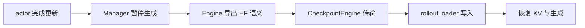
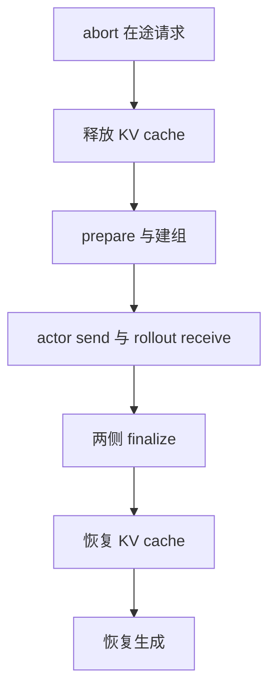

# verl 权重发布深潜 —— 从 full 广播到 shard-local delta

> **代码基准**：`volcengine/verl@254a23edc62f25ebfae626e3932ae285d6f86009`（`main`）
> **最后更新**：2026-09-03
> **定位**：本页是 verl 的 **full / delta_sharded 权重发布唯一机制 owner**。训练 Engine 的常规计算边界见 [[13_verl_workers_engine_analysis]]，rollout server 与 PD 架构见 [[14_verl_rollout_runtime_analysis]]，性能选择见 [[30_verl_optimization_analysis]]；这些页面只保留入口与链接，不再复述本页状态机。Trainer 的持久化与跨重启恢复属于 [[23_verl_training_checkpoint_recovery_analysis]]，不能因类名 `CheckpointEngine` 而并入本页。

> [!important] 一条主线
> verl 没有把“权重同步”压成一次 `broadcast`，而是拆成三个所有权边界：训练 Engine 负责把后端布局翻译成最终 HF 权重语义，CheckpointEngine 负责暂停世界并传输，rollout loader 负责把收到的 payload 写入正在服务的模型。`delta_sharded` 的核心不是压缩 full tensor，而是把 diff 下推到每个 rank 的本地 shard：第一次 dense seed 建立共同基线，之后只 gather 和广播 bit-exact 的变化位置。

---

## 1. 背景：为什么权重发布必须成为独立子系统

RL 后训练每次 actor 更新后，rollout 必须在下一轮生成前看见新参数。colocated 模式下训练与推理共享进程和 GPU，可以直接把 full tensors 交给本地 rollout adapter；disaggregated 模式下两侧是不同 Ray worker group，发布还要处理在途请求、KV cache、临时通信组以及推理进程内部的真正写入。`CheckpointEngine` 因而被定义成 actor→rollout 的传输抽象，而 `CheckpointEngineManager` 负责跨两组 worker 的生命周期协调（`verl/checkpoint_engine/base.py:116`、`verl/checkpoint_engine/base.py:381`）。

朴素 full 广播的网络流量随模型大小线性增长；更隐蔽的成本是训练后端往往必须先 all-gather full tensor，再由 rank 0 staging。官方设计记录指出，早期 plain `delta` 仍在 rank 0 保存 full-model snapshot 并先 full-gather 后 diff，实测始终慢于 shard-local 方案，因此已经删除；当前唯一注册的 delta backend 是 `delta_sharded`（`docs/advance/delta_weight_sync.md:20`、`docs/advance/delta_weight_sync.md:26`、`verl/checkpoint_engine/delta_checkpoint_engine.py:218`）。

| 层 | 拥有的事实 | 不拥有的事实 |
|---|---|---|
| 训练 Engine | 参数布局、HF 命名、to-HF 转换、full/shard/delta export | 跨 actor/rollout 的拓扑与请求暂停 |
| CheckpointEngine | prepare、通信组、bucket/flush、wire format、send/receive | Megatron/VeOmni 等后端布局语义 |
| rollout loader | 模型内部 name mapping、checksum、copy 与 cache flush | 训练 shard 如何组成 HF tensor |
| Manager | 两侧 worker 的顺序、并发、暂停与恢复 | 单个 tensor 的转换或写入细节 |

这种拆分的判据是“变化最慢的知识放在最靠近 owner 的位置”：并行布局随训练 backend 变化，传输协议随 CE backend 变化，模型写入规则随 rollout backend 变化。把三者揉进一个 exporter 会让任何一侧升级都迫使其它两侧跟着改。

## 2. 三段 ownership：语义、传输、应用

### 2.1 Engine 拥有最终 HF 语义

`TrainingWorker` 通过 `EngineRegistry.new` 持有具体 `BaseEngine`，Worker 只编排 mini-batch、loss 与远程入口；forward/backward、optimizer 以及参数导出都落在 Engine（`verl/workers/engine_workers.py:76`、`verl/workers/engine_workers.py:135`、`verl/workers/engine/base.py:99`）。权重面有三个契约：

- `get_per_tensor_param()` 产出 full HF `(name, tensor)`；
- `get_per_tensor_param_shard()` 产出本 rank 的 `(name, local_shard, ShardSpec)`；
- `get_per_tensor_param_delta_shard()` 产出已经转换到最终 HF 坐标的 sparse entries（`verl/workers/engine/base.py:151`、`verl/workers/engine/base.py:163`、`verl/workers/engine/base.py:207`）。

因此 CE 不需要知道 FSDP 的 DTensor、Megatron 的 TP/PP mapping 或 VeOmni 的 expert stack。`spec.py` 明确规定 weight→HF 命名、to-HF conversion、diff 和 snapshot 都是 backend 的业务，delta engine 只 gather、bucket、ship（`verl/workers/engine/spec.py:27`）。

### 2.2 CheckpointEngine 拥有 wire 与同步会话

actor 进程中 ModelEngine 与 CE 共进程；rollout 一侧 CE 在独立 `CheckpointEngineWorker` 中，再通过 same-GPU IPC 进入推理 worker（`verl/checkpoint_engine/base.py:381`、`verl/checkpoint_engine/base.py:387`）。这个额外进程边界让 NCCL、NIXL、Mooncake 等 transport 可以替换，而不把其依赖和生命周期塞进 vLLM/SGLang server。

CE 的通用 wire 只有两类：`named_tensors` 表示 full tensor 流，`delta_flush` 表示逐 flush 的稀疏 payload（`verl/checkpoint_engine/base.py:130`）。`CheckpointEngineWorker.update_weights` 从 CE `receive_weights` 取 generator，再把 wire format 显式交给 rollout adapter；adapter 不允许把这个参数误传给后端扩展（`verl/checkpoint_engine/base.py:354`、`verl/workers/rollout/base.py:54`）。

### 2.3 rollout loader 拥有最终写入

full 路径中，vLLM 使用 bucketed CUDA IPC，若 IPC 不可用则退回 shared memory；完成后清 KV cache 并更新 `global_steps`（`verl/workers/rollout/vllm_rollout/vllm_rollout.py:209`、`verl/workers/rollout/vllm_rollout/vllm_rollout.py:228`）。SGLang full 路径同样按 bucket 调用自己的 weight-sync helper，并在最后 flush radix cache（`verl/workers/rollout/sglang_rollout/sglang_rollout.py:357`、`verl/workers/rollout/sglang_rollout/sglang_rollout.py:379`）。

delta 路径只能走 SGLang。它把每个 flush 的 CUDA IPC handles gather 到 TP0，由 `update_weights_from_tensor` 在每个 TP worker 内动态导入 verl loader；loader 才真正调用模型的 `load_weights`（`verl/workers/rollout/sglang_rollout/sglang_rollout.py:405`、`verl/workers/rollout/sglang_rollout/delta_loader.py:14`）。

## 3. full 发布：同一个 payload，两种生命周期

### 3.1 colocated `naive`

`mode="auto"` 先解析成配置的 CE backend；显式或配置为 `naive` 时不走跨组 process group。Worker 先恢复 rollout 的 weights 映射，再让 Engine 生成 full HF tensors，经本地 rollout adapter 更新；若 actor 开启 param offload，写完后把模型移回 CPU，最后恢复 KV cache（`verl/workers/engine_workers.py:753`、`verl/workers/engine_workers.py:771`、`verl/workers/engine_workers.py:803`、`verl/workers/engine_workers.py:809`）。

LoRA 是这条路径里的额外状态：SGLang adapter 模式第一次要先同步 base，后续只更新 adapter；merge 模式则把 LoRA 合进 full HF 权重。`base_sync_done` 与 `sleep_level` 共同保证 base 没有被错误重复装载或在 level-1 sleep 中释放（`verl/workers/engine_workers.py:784`、`verl/workers/engine_workers.py:789`）。

### 3.2 disaggregated full CE

非 `naive` 且非 `delta_sharded` 时，actor Worker 把 `get_per_tensor_param()` generator 交给所选 CE backend（`verl/workers/engine_workers.py:756`）。Manager 的完整会话顺序是：

1. abort 并保存所有未完成请求；
2. 从所有 replica 的 CE workers 临时组出 rollout `RayWorkerGroup`；
3. 仅释放 KV cache，保留 live weights 作为接收目标；
4. 两侧 `prepare`，由 backend 构造 topology 并初始化 process group；
5. 同时触发 actor send 与 rollout receive，`ray.get` 等待全部完成；
6. 两侧 `finalize`，恢复 KV cache，再恢复未完成生成（`verl/checkpoint_engine/base.py:506`）。

### 3.3 Manager 生命周期与单次会话

`CheckpointEngineManager` 是长生命周期协调器：构造时固定 backend class，并持有 actor worker group 与 rollout replica 列表；真正的 rollout `RayWorkerGroup` 则在每次 `update_weights` 中从 replica workers 临时组装（`verl/checkpoint_engine/base.py:410`、`verl/checkpoint_engine/base.py:521`）。这一区别决定了“扩缩 replica”只修改下一次会话的参与者，不会在后台偷偷迁移权重。

| 阶段 | 活跃对象 | 新建或改变的状态 | 结束条件 |
|---|---|---|---|
| Manager 构造 | actor WG、replica handles | 解析 custom module 与 backend class | 训练任务结束 |
| 会话建组 | 临时 rollout WG、两侧 CE | `prepare` metadata、topology、process group | 全部 rank 初始化成功 |
| 传输 | Engine、两侧 CE、rollout loader | full 或 delta flush、同步 metrics | actor send 与所有 receive 都返回 |
| 会话收尾 | 两侧 CE、replicas | finalize、KV 恢复、请求恢复 | generation 重新开放 |

topology 不是 Manager 自己硬编码：它先收集两侧 `prepare` metadata，再让 backend class 按 actor/rollout world size 生成逐 rank kwargs，并检查长度后初始化组（`verl/checkpoint_engine/base.py:423`、`verl/checkpoint_engine/base.py:433`、`verl/checkpoint_engine/base.py:445`）。`add_replicas`/`remove_replicas` 只维护 handle 列表，下一次 update 才据此重建 topology（`verl/checkpoint_engine/base.py:450`、`verl/checkpoint_engine/base.py:458`）。

这里的 `full` 是 payload 形态，不是名为 `full` 的 registry backend。当前 full transport 包括 `naive`、`nccl`、`nixl`、`kimi_ckpt_engine`、`mooncake`；Ascend 的 HCCL 实现也注册在 `nccl` 名下（`verl/checkpoint_engine/base.py:245`、`verl/checkpoint_engine/nccl_checkpoint_engine.py:119`、`verl/checkpoint_engine/nixl_checkpoint_engine.py:238`、`verl/checkpoint_engine/kimi_checkpoint_engine.py:222`、`verl/checkpoint_engine/mooncake_checkpoint_engine.py:38`、`verl/checkpoint_engine/hccl_checkpoint_engine.py:103`）。

## 4. `delta_sharded`：dense seed 到 sparse steady

### 4.1 状态零：dense seed

`DeltaShardedCheckpointEngine` 继承 NCCL 的 group/ZMQ machinery，但 wire format 改为 `delta_flush`，并跳过父类的固定双 bucket 分配（`verl/checkpoint_engine/delta_checkpoint_engine.py:218`、`verl/checkpoint_engine/delta_checkpoint_engine.py:247`）。实例初始 `_shard_seeded=False`；第一次 `send_weights` 调 Engine 的 full exporter，用 values-only dense flush 流式广播。所有 trainer rank 都必须遍历 full generator，因为后端 full assembly 本身可能包含 collective；只有 master 真正 bucket 和 publish（`verl/checkpoint_engine/delta_checkpoint_engine.py:404`、`verl/checkpoint_engine/delta_checkpoint_engine.py:477`）。

seed 不是“第一次也发送稀疏 delta”。它覆盖所有参数，不附 positions，直接给 dummy-initialized rollout 建立正确 live base；每个 bucket 发出即释放，所以接收端不需要 full-model mirror（`verl/checkpoint_engine/delta_checkpoint_engine.py:300`、`verl/checkpoint_engine/delta_checkpoint_engine.py:524`）。

### 4.2 状态一：prime shard snapshot

dense seed 成功发送后，CE 立即调用 `engine.prime_delta_snapshots()`，把每个 rank 当前 local shard 复制到 CPU；因为同步期间训练权重不变，这份 snapshot 与 rollout 刚收到的 seed 对齐（`verl/checkpoint_engine/delta_checkpoint_engine.py:596`、`verl/workers/engine/base.py:189`）。默认使用 pinned host memory以加速下一次 H2D diff，但它与节点上其它 pinned pool 竞争；backend 可关闭 pinning（`verl/workers/engine/base.py:183`、`verl/workers/engine/utils.py:261`）。

### 4.3 状态二：sparse steady

后续同步调用 `get_per_tensor_param_delta_shard()`。默认 `hf_delta_export` 对本地 shard 与 snapshot 做 byte-exact 比较，把 local changed indices 转换为最终 HF indices，然后刷新 snapshot；无阈值、无近似，因此只要会话完整成功就不会累计量化漂移（`verl/workers/engine/utils.py:225`、`verl/workers/engine/utils.py:238`）。

各 rank 对同一参数贡献固定 slot 顺序与 counts，未命中的 slot 也必须给零 count 以保持 collective lockstep。CE 按参数批量 gather variable-length positions/values 到 rank 0，再按 bucket 大小组成 flush；wire 使用 int32 absolute positions 与 values，rank 0 不再理解 placement 或执行 HF conversion（`docs/advance/delta_weight_sync.md:32`、`docs/advance/delta_weight_sync.md:44`、`verl/checkpoint_engine/delta_checkpoint_engine.py:637`）。

rollout 每次只接收一个 flush。SGLang loader先核对 positions+values checksum；dense seed直接 chunked load，steady delta则 densify 成 NaN-masked tensor，并临时把 `Tensor.copy_` 改成“NaN 保留旧值、非 NaN 覆盖”，从而只改变化位置（`verl/workers/rollout/sglang_rollout/delta_loader.py:61`、`verl/workers/rollout/sglang_rollout/delta_loader.py:102`、`verl/workers/rollout/sglang_rollout/delta_loader.py:177`、`verl/workers/rollout/sglang_rollout/delta_loader.py:202`）。radix cache 只在最后一个 flush 后清理，避免每个 bucket 都做全局 cache flush（`verl/workers/rollout/sglang_rollout/sglang_rollout.py:384`）。

## 5. `ShardSpec`：让 CE 对训练布局无知

`ShardSpec` 的基本声明是 full shape、DeviceMesh 与 placements；`mesh=None` 表示本地 tensor 已是 full parameter。若后端的几何不能由 DTensor 表达，例如 VeOmni 手工 EP split，可以显式给 `BlockPlacement`、gather group 与 `contributes`（`verl/workers/engine/spec.py:58`）。

`derive_dtensor_placement` 纯数学地计算本 rank 的 block offset：replicate 维只有坐标零贡献，单 shard dim 使用其 subgroup，多 shard dim 建覆盖所有 shard 维的 group。`_StridedShard` 也按 block 处理，但不均匀 strided sharding 会显式拒绝（`verl/workers/engine/spec.py:159`、`verl/workers/engine/spec.py:202`）。

训练参数不总与 HF tensor 一一对应。`to_hf_chunk` 描述可按 dim-0 分段的 converter，`hf_slots` 静态枚举输出名与 shape；这样 fused expert stack 可在 sender 侧只转换本 rank 触及的行，rank 0 仍只做 slot-keyed concat（`verl/workers/engine/spec.py:36`、`verl/workers/engine/spec.py:77`）。这条边界是支持 Megatron/VeOmni 而不污染 CE core 的关键。

## 6. 当前真实支持矩阵

| 训练 Engine | full named tensors | `delta_sharded` | 关键约束 |
|---|---|---|---|
| FSDP1 | 支持 | 支持 | shard export 需先 staging 到 GPU；单卡退化为 replicated rank-0 路径（`verl/workers/engine/fsdp/transformer_impl.py:895`） |
| FSDP2 | 支持 | 支持 | DTensor shard 逐参数 lazy staging（`verl/workers/engine/fsdp/transformer_impl.py:901`） |
| FSDP Turbo | 支持 | 代码继承可达，未在指定测试/文档验证 | 仅 `language_model`；不可同时启用 verl Ulysses（`verl/workers/engine/fsdp/fsdp_turbo_impl.py:25`、`verl/workers/engine/fsdp/fsdp_turbo_impl.py:70`） |
| TorchTitan | 支持 | 支持 | TP、EP、CP、HSDP 可组合；PP 在 export 边界拒绝（`verl/workers/engine/torchtitan/transformer_impl.py:576`、`verl/workers/engine/torchtitan/transformer_impl.py:584`） |
| Megatron-Bridge | 支持 | 支持 | vanilla bridge 与 LoRA 拒绝；PP stage 用 zero-count 保持 lockstep（`verl/workers/engine/megatron/transformer_impl.py:1064`、`verl/workers/engine/megatron/transformer_impl.py:1075`） |
| VeOmni | 支持 | 支持 | EP block 有专用 converter；GPT-OSS 拒绝（`verl/workers/engine/veomni/transformer_impl.py:566`、`verl/workers/engine/veomni/utils.py:319`） |

| rollout | full | `delta_sharded` | 边界 |
|---|---|---|---|
| vLLM | 支持 | 不支持 | assert 只接受 `named_tensors`（`verl/workers/rollout/vllm_rollout/vllm_rollout.py:217`） |
| SGLang | 支持 | 支持 | 仅 non-PD；自定义 loader 在启动时自动注册（`verl/workers/rollout/sglang_rollout/sglang_rollout.py:395`、`verl/workers/rollout/sglang_rollout/async_sglang_server.py:279`） |
| TRT-LLM 及其它 | 依各 full adapter | 不支持 | rollout worker 启动即抛 `NotImplementedError`（`verl/checkpoint_engine/base.py:325`） |

`delta_sharded` 当前实现直接继承 NCCL transport 并使用 CUDA/CuPy staging，因此不能把“Ascend 上 full HCCL 可用”外推成“delta_sharded 在 NPU 可用”（`verl/checkpoint_engine/delta_checkpoint_engine.py:55`、`verl/checkpoint_engine/delta_checkpoint_engine.py:218`）。量化 rollout 也未进入 sparse apply contract；当前 loader 的 steady wire按训练侧 BF16 values 工作。

## 7. 同步不变量、校验与失败边界

### 7.1 必须守住的不变量

- full exporter 或 shard exporter 内只要有 collective，所有 rank 就必须以相同顺序完整迭代 generator；跳过非 leader 的迭代会让其它 rank 死锁（`verl/workers/rollout/sglang_rollout/sglang_rollout.py:333`）。
- delta 每个参数的 slot 数与顺序必须跨 rank 相同；replica owner 之外的 rank 用空 delta 保持 lockstep，而不是跳过条目（`verl/workers/engine/base.py:209`）。
- dense seed 完成前不能进入 steady；缺失 snapshot 会 fail loud，而不是默默以零为 base（`verl/workers/engine/utils.py:240`）。
- SGLang delta 不允许与 PD disaggregation 组合；vLLM PD 的 NIXL/Mooncake 是 KV transfer backend，不是 actor 权重 delta transport（`verl/workers/rollout/sglang_rollout/sglang_rollout.py:395`、`verl/workers/rollout/vllm_rollout/vllm_pd_replica.py:59`）。

### 7.2 checksum 与周期性 verify

每个 flush manifest 带 checksum；SGLang loader 在写模型之前重算，任何不一致直接抛 `RuntimeError`（`verl/workers/rollout/sglang_rollout/delta_loader.py:72`）。`verify_every=K` 还可在每 K 次 steady sync 后追加一次 full dense sweep：loader先保存真实 `copy_` destination，再走真实模型 loader，最后做 bitwise idempotence 比较；任何元素变化都说明 rollout 累积状态已经偏离 trainer，并 fail loud（`verl/checkpoint_engine/delta_checkpoint_engine.py:410`、`verl/workers/rollout/sglang_rollout/delta_loader.py:122`）。

### 7.3 失败不是事务

Manager 的 abort、release KV、send/receive、finalize、resume 是顺序代码，没有 `try/finally`。因此可从源码推断：send、loader 或 finalize 中途抛错时，本次调用不保证自动恢复 KV、generation 或销毁 process group（`verl/checkpoint_engine/base.py:518`、`verl/checkpoint_engine/base.py:546`、`verl/checkpoint_engine/base.py:552`）。这是 fail-stop 边界，不是带 rollback 的发布事务。

delta 还有更尖锐的窗口：`hf_delta_export` 在 yield payload 前就把 CPU snapshot 更新为当前 local shard。若后续 gather、wire 或 rollout apply 失败，trainer 的 diff base 可能已经前移，而 rollout 没有完成同一版本；下一次 steady sync 不能被假定为自动修复（`verl/workers/engine/utils.py:251`、`verl/workers/engine/utils.py:257`）。运维上应把 checksum/verify 失败视为需要重新 seed 或重启会话，而不是简单重试同一个 steady delta；当前代码没有显式 re-seed API。

backend import 失败也不是静默降级。registry 记录 optional transport 的 ImportError；真正请求不可用 backend 时，错误会连同缺失依赖一起抛出（`verl/checkpoint_engine/base.py:49`、`verl/checkpoint_engine/base.py:93`）。

### 7.4 哪些失败可以原地重试

| 失败位置 | 已经改变的 owner 状态 | 原地重试判断 |
|---|---|---|
| `prepare` 或建组前 | rollout live weights 未写，snapshot 未推进 | 修复依赖或 topology 后可重新发起完整会话 |
| full transport 中途 | rollout 可能只更新部分 buckets | 不能开放 generation；必须重新跑完整 full 发布 |
| delta checksum 在 apply 前失败 | 当前 flush 未写，但早先 flush 可能已写；trainer snapshot 可能已推进 | 不应把同一 steady delta 当作幂等重试 |
| delta apply 或 verify 失败 | rollout 版本未知，snapshot 已可能领先 | 重新 dense seed 或重建同步会话 |
| `finalize`/KV 恢复失败 | 权重可能已一致，但通信组或服务态未知 | 先恢复服务生命周期，不能仅 resume generation |

这里的判断是由 owner 边界推出的运维约束，不是代码提供的自动恢复协议。尤其 `_shard_seeded` 是 CE 实例内状态，而 snapshot 在 Engine 内；两者没有共同 commit record，所以无法通过单个标志证明 rollout、transport 与 trainer snapshot 已原子前进（`verl/checkpoint_engine/delta_checkpoint_engine.py:596`、`verl/checkpoint_engine/delta_checkpoint_engine.py:601`）。

## 8. 历史演进与两个容易写错的纠正

### 8.1 已退役的 SPMD 直连链

> [!history] 历史基线，不是当前实现
> 本小节只用于解释架构演进，源码定位固定在 `volcengine/verl@ab0705220a95952219111409d8f971872002c193`（2025-12-04）。该基线之后 `vllm_rollout_spmd.py` 被删除；当前行为只能以上文 `volcengine/verl@254a23edc62f25ebfae626e3932ae285d6f86009` 的 Engine / CheckpointEngine / rollout loader 契约为准。

旧 SPMD 路径把角色切换、语义重组和推理模型写入串在一条直接调用链上：`generate_sequences()` 先进入 `rollout_mode()`；后者从 bridge 或 `per_tensor_generator()` 得到 generator，随后直接调用 rollout 的 `update_weights()`；旧 vLLM adapter 最终调用模型的 `load_weights()`（历史 `verl/workers/megatron_workers.py:663-694,768-793`；历史 `verl/workers/rollout/vllm_rollout/vllm_rollout_spmd.py:559-585`）。这证明的是旧调用关系，不代表这些对象仍存在于当前版本。

`per_tensor_generator()` 当时同时知道三类知识：先在 PP 组发现参数 owner 并广播名称和 tensor，再按 EP/ETP、TP gather，最后做 HF 命名与 QKV/gate-up 等重组（历史 `verl/utils/megatron_utils.py:749-830,894-1035`）。与当前实现对照，所有权变化如下：

| 关注点 | 旧 SPMD 直连链 | 当前 owner |
|---|---|---|
| 训练布局转 HF 语义 | 集中在 `per_tensor_generator()`，与 Megatron PP/EP/TP 细节绑定 | 各训练 Engine 的 full/shard/delta export 契约 |
| 跨角色传输与会话 | worker 在角色切换中把 generator 直接交给 rollout | CheckpointEngine 与 Manager 管 prepare、wire、finalize 和服务暂停/恢复 |
| 推理模型应用 | vLLM SPMD adapter 直接调用 `model.load_weights()` | rollout loader/adapter 按 vLLM、SGLang 和 wire format 分别实现 |

两代实现共享的稳定目标是：先把训练布局翻译成接收端认识的参数语义，再安装到 live rollout；当前架构则把“语义转换、传输会话、模型写入”从一个直连链拆成三个 owner。旧页曾用“拓扑解耦”解释 Gather-Broadcast-Load：这可以作为对上述操作的分析重建——恢复接收端语义后，rollout 无须反推训练侧 TP/PP/EP 切法——但旧源码没有声明这是作者设计意图，也不能据此推出固定的显存膨胀倍数、全 rank 完整副本或全程阻塞。

### 8.2 plain `delta` 已删除

> [!contradiction] plain `delta` 已删除
> 当前 registry 没有 `delta` backend，只有 `delta_sharded`。所谓 plain delta 是被淘汰的 rank-0 full snapshot 路线；不要把 full、delta、delta_sharded 写成三个仍可并列选择的当前模式（`docs/advance/delta_weight_sync.md:26`、`verl/checkpoint_engine/__init__.py:78`）。

### 8.3 MindSpeed 不是整体删除

> [!contradiction] MindSpeed 不是整体删除
> 删除的是独立 MindSpeedLLM engine/config 路线；当前 `mindspeed` 包仍把 LM/value model 以 `backend="megatron", device="npu"` 注册，作为 NPU Megatron patch 层存在（`verl/workers/engine/mindspeed/transformer_impl.py:56`、`verl/workers/engine/mindspeed/transformer_impl.py:90`）。它没有独立 delta transport；不能因目录仍在就把已删除的 `mindspeed_megatron` strategy 写回配置矩阵。

另一个配置纠正是 `grad_offload`：当前通用 `EngineConfig` 只保留 param/optimizer offload；Megatron 的梯度 buffer 生命周期跟随 `param_offload`。底层 `to(..., grad=...)` 手动搬运参数仍在，但它不再对应第三个独立配置开关（`verl/workers/config/engine.py:89`、`verl/workers/config/engine.py:153`、`verl/workers/engine/megatron/transformer_impl.py:652`）。

## Related Pages

- [[13_verl_workers_engine_analysis]] —— Worker/Engine 计算边界与各训练 backend；本页只拥有它们的权重 export 契约。
- [[14_verl_rollout_runtime_analysis]] —— rollout server、sleep/wake、vLLM/SGLang 与 PD；权重发布状态机以本页为准。
- [[30_verl_optimization_analysis]] —— full 与 delta_sharded 的性能选择、offload 和异步资源利用；不重复协议细节。
- [[10_verl_end_to_end_iteration_analysis]] —— 把一次权重发布放回 PPO/GRPO 迭代时序中观察。
- [[20_verl_ray_trainer_analysis]] —— Ray trainer 的 worker-group 编排与训练拓扑；CheckpointEngine 是其独立的参数发布平面。
