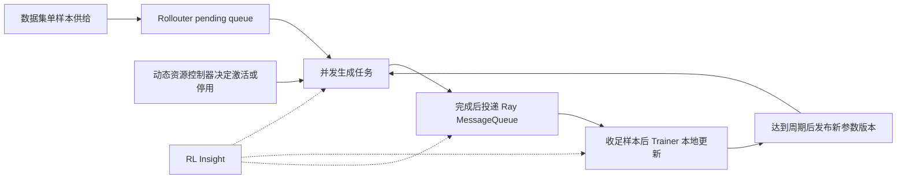

# verl Experimental Fully Async 深潜 —— 版本陈旧度、动态资源与可靠性边界

> **源码基线**：`volcengine/verl` `main` @ `254a23edc62f25ebfae626e3932ae285d6f86009`
> **核验日期**：2026-08-31
> **定位**：experimental fully-async TaskRunner 唯一生命周期 owner
> **范围**：`verl/experimental/fully_async_policy/`、`docs/advance/fully_async.md`、`docs/advance/dynamic_schedule.md`、`docs/advance/determinism.md`、`verl/utils/tracking.py` 及相关测试。
>
> **结论先行**：这里分析的是一个拥有独立入口、独立 Rollouter、独立 Trainer 和自建 MessageQueue 的 **experimental fully-async TaskRunner**，不是稳定 V1 trainer 的 `colocate_async` 或 `separate_async` mode。它以完成顺序消费和显式 policy version 换取生成与训练的持续重叠，再用 staleness admission、partial rollout 与动态 Hybrid GPU 调度控制代价；但队列并非无损、checkpoint 不保存全部在飞状态、bitwise determinism 也没有被证明。

---

## 1. 先划清边界：不是稳定 V1 async mode

稳定 V1 路径围绕 TransferQueue 组织数据流，其 completion-order 行为也被官方确定性文档单独列为边界（`docs/advance/determinism.md:82,102-106`）；本页目标则从 `fully_async_main.py` 直接导入 `FullyAsyncRollouter`、`FullyAsyncTrainer` 和 `MessageQueue`，以 `FullyAsyncTaskRunner` 作为自定义 task runner 交给 `run_ppo`（`verl/experimental/fully_async_policy/fully_async_main.py:25-29,35-49,222-238`）。

这个入口先创建 Trainer，再把 Trainer worker group 注入 Rollouter 作为 Hybrid replica 的宿主，最后创建共享 MessageQueue；checkpoint 恢复和初始权重同步完成后，Rollouter 与 Trainer 被两个 Ray future 同时启动（`verl/experimental/fully_async_policy/fully_async_main.py:77-115,117-157,186-193`）。任一 future 报错，runner 会取消另一侧；退出时只清空 MessageQueue（`verl/experimental/fully_async_policy/fully_async_main.py:195-219`）。

因此正确的对照关系是：

| 路径 | 控制入口 | 核心数据通道 | 本页是否展开 |
|---|---|---|---|
| 稳定 V1 sync / async trainer | `trainer/main_ppo.py` 与 `trainer/ppo/v1/` | TransferQueue | 否，只作为边界与 checkpoint 对照 |
| Experimental fully async | `experimental/fully_async_policy/fully_async_main.py` | 自建 Ray MessageQueue | 是 |

> [!warning] 名字相似不代表调用链相连
> 不能把 V1 的 TransferQueue checkpoint、callback 或确定性结论直接套到本页路径；反过来，也不能用本页 completion-order MessageQueue 解释稳定 V1 的所有 mode。

---

## 2. 一条主线：让两个长期循环只在版本边界相遇

分离式 rollout/train 的背景是 rollout 长尾会让 colocated GPU 在阶段切换中空等；官方设计说明把收益归因于资源隔离后两段时间发生重叠，而不是单段 rollout 或 train 自身变快（`docs/advance/fully_async.md:14-29,79-83`）。

图中的关键不是“异步 RPC”本身，而是三个不同节拍：Rollouter 按单样本持续生产，MessageQueue 按完成时间形成 FIFO，Trainer 每收足一个训练集合就更新，但只在累计若干本地更新后发布一次新参数版本（`docs/advance/fully_async.md:65-77`）。

### 2.1 Rollouter：admission 控制，而非逐样本 age 过滤

Rollouter 强制 `hybrid_engine=False`、`train_batch_size=0`、`gen_batch_size=1`，说明它不是传统整批生成器；GenRM/DisRM 还必须使用 standalone resource pool，因为异步 rollout 不会像 colocated 阶段那样整体暂停（`verl/experimental/fully_async_policy/fully_async_rollouter.py:329-365`）。

它把每次 Trainer collection 的最小样本数定义为 `ppo_mini_batch_size × require_batches`，再把一个参数同步周期的生产上限定义为：

`max_required_samples = required_samples × 触发同步次数 × 版本预算`

其中“版本预算”等于 `1 + staleness_threshold`；同一个值也成为 MessageQueue 容量，活动生成任务还受 `active_replicas × concurrent_samples_per_replica` 限制（`verl/experimental/fully_async_policy/fully_async_rollouter.py:421-429,491-507`）。

这意味着 `staleness_threshold` 首先约束的是一个版本窗口内可以启动和缓冲多少工作，不是 Trainer 在消费前逐条拒绝“超过 N 版”的样本。权重更新后，Rollouter 把 staleness 计数重置为“仍在飞任务数 + 队列存量”，把已经跨过版本边界的工作带入下一窗口（`verl/experimental/fully_async_policy/fully_async_rollouter.py:594-605`）。

### 2.2 两级 backpressure：能减速，但不保证无损

第一层 `pending_queue` 是本地有界 `asyncio.Queue`，dataset feeder 在容量 128 时阻塞；processor 再按 `max_concurrent_samples` 控制真正提交给 rollout engine 的任务数（`verl/experimental/fully_async_policy/fully_async_rollouter.py:460-462,858-890,969-989`）。

第二层是 processor 的暂停条件：MessageQueue 已满，或当前版本的 staleness 计数达到 `max_required_samples`。暂停后它会排空已完成任务并等待 reset 或 monitor 恢复；monitor 每 10 秒重新检查一次（`verl/experimental/fully_async_policy/fully_async_rollouter.py:902-948,1113-1164`）。

但最终 MessageQueue 的 `put_sample` 不会阻塞生产者。队列满时它先 `popleft` 丢掉最老样本，再追加新样本并返回 `False`（`verl/experimental/fully_async_policy/message_queue.py:55-83`）。所以 backpressure 是“尽量避免溢出”的控制环，不是 lossless queue；检查与实际 put 之间仍存在并发窗口。

### 2.3 MessageQueue：FIFO，但 FIFO 的是完成顺序

每个 rollout task 完成后才序列化 `RolloutSample` 并调用 `put_sample`；完成慢的长轨迹自然排在后面（`verl/experimental/fully_async_policy/fully_async_rollouter.py:991-1015`）。MessageQueue 只用一个锁保护 deque，消费者从左侧弹出，因此它保留“到达队列”的 FIFO，而不恢复 dataset submission order（`verl/experimental/fully_async_policy/message_queue.py:26-46,85-103`）。

Trainer 循环调用 `get_sample`，直到收足 `required_samples`，然后按收集到的顺序拼成 `DataProto`；dynamic policy 还会记录 collection 开始时已有多少 backlog，以区分“立即命中积压”和“真正等待新生成”的样本（`verl/experimental/fully_async_policy/fully_async_trainer.py:375-451`）。

由此得到一个重要推论：**即使单个请求的 token 完全确定，不同运行中的请求延迟抖动仍可能改变训练 batch 的排列与成员**。这是源码时序推论，不是官方对 experimental fully async 的确定性承诺。

---

## 3. Policy version：生成版本、训练版本与 partial span

Trainer 维护两个时钟：`global_steps` 表示逐次本地训练步，`current_param_version` 只在 `local_trigger_step` 达到 `trigger_parameter_sync_step` 后递增（`verl/experimental/fully_async_policy/fully_async_trainer.py:676-688`）。只有新周期开始时 `_fit_update_weights` 才真正把权重发给 rollout replicas（`verl/experimental/fully_async_policy/fully_async_trainer.py:690-706`）。

每次生成返回时，rollout client 从 server 输出读取 `global_steps`。一次 uninterrupted trajectory 的最小和最大版本相同；若请求因 abort 被续算，后续 token 可能来自新权重，因此 client 保留整个轨迹的 `min_global_steps` 与 `max_global_steps`（`verl/workers/rollout/llm_server.py:423-448,468-470`）。

batch assembly 使用两种口径：

- `max_global_steps` 作为 trajectory 的消费版本，用于判断相对当前 Trainer 是否 stale；
- `abs(max_global_steps - min_global_steps)` 作为 partial span，用于统计跨版本轨迹比例与最大跨度（`verl/experimental/fully_async_policy/detach_utils.py:151-169`）。

Trainer 把 `current_param_version - trajectory_version >= 1` 计为 stale trajectory，但没有在这里丢弃它；它累积 `stale_trajectory_processed` 并上报当前版本（`verl/experimental/fully_async_policy/fully_async_trainer.py:1033-1045`）。因此 freshness 是生产预算与观测口径，不是硬性消费过滤器。

> [!contradiction] 文档指标与当前实现不完全对应
> `docs/advance/fully_async.md:233-243` 列出 `fully_async/count/stale_samples_processed`，但当前源码只在聚合规则中提到该 key（`verl/experimental/fully_async_policy/detach_utils.py:205-230`），未找到实际赋值点。可核验的现行指标是 stale trajectory、dropped stale samples、param version 和 partial span。

### 3.1 Partial rollout 为什么能缩短版本切换尾巴

若 server 返回 `aborted`，`FullyAsyncLLMServerClient` 在 `partial_rollout=True` 时把已生成 token 拼回 prompt，等待一秒后重新生成剩余 token；关闭时则退出 retry loop（`verl/workers/rollout/llm_server.py:450-466`）。

它的收益是不用等长尾请求自然结束，也不用从零重做已经生成的前缀；代价是单条轨迹可能跨 policy version。代码因此同时保存版本跨度和旧 log-prob，而官方文档也要求 PPO/GRPO 的 old log-prob 必须与实际生成 token 的 rollout 参数对应（`docs/advance/fully_async.md:161-180,211-228`）。

这里不能把“跨版本续算”误写成纯吞吐优化：它改变了数据分布与 importance correction 的输入。`partial_rollout`、staleness、rollout log-prob 和 correction mode 必须作为一组契约验证。

---

## 4. Dynamic scheduling：把 Trainer GPU 暂借给 rollout

静态分离虽然能重叠两段计算，却可能出现 Trainer 等样本时 GPU 空闲、Standalone rollout 在训练阶段积压的双向失配。动态方案预注册两类 replica：Standalone 常驻独立 rollout GPU，Hybrid 则寄宿 Trainer GPU，空闲时参与生成，训练前归还显存（`docs/advance/dynamic_schedule.md:19-40`）。

`DynamicResourceController` 只维护两个状态：`STANDALONE_ONLY` 与 `HYBRID_ACTIVE`。激活先把 Hybrid server 注册进 load balancer，再 resume generation；停用的顺序必须是 remove、abort、sleep，先切断新路由，才不会让 retry 又落到正在释放的 replica（`verl/experimental/fully_async_policy/dynamic_schedule/dynamic_resource_controller.py:15-27,117-159`）。

权重同步也分两条路径：Standalone 使用常规 checkpoint manager；只有 policy 决定下个窗口需要 Hybrid 时，Trainer 才经 naive hybrid checkpoint manager 再同步一次并激活它们，从而避免无意义的第二次广播（`verl/experimental/fully_async_policy/fully_async_trainer.py:708-756`）。

### 4.1 Default policy：等待多少样本只是第一层判断

policy context 汇总固定配置、累计生产量、理论需求、buffer headroom、真实等待样本数和最近 activate/deactivate 耗时（`verl/experimental/fully_async_policy/dynamic_schedule/base.py:56-106`）。调用顺序固定为训练前判断停用、返回等待阈值、同步后判断激活、可选 rebalance、最后更新内部状态（`verl/experimental/fully_async_policy/dynamic_schedule/base.py:109-122`）。

默认 policy 在 Hybrid active 时总会尝试停用，但先等待 `deactivate_ratio × cycle_samples`。若本周期确实等待了新生成样本，说明 rollout 是瓶颈，ratio 按缺口比例增加且单次限制在 0.02 到 0.1；若完全命中 backlog，则 ratio 减少 0.02，让 Trainer 更早拿回 GPU（`verl/experimental/fully_async_policy/dynamic_schedule/default_policy.py:38-52,80-117`）。

是否重新激活还有第二道成本收益门：policy 用最近三次 activate 加 deactivate 的平均耗时作为 switch cost，没有历史时取 10 秒；再用真实等待时间除以真实等待样本数估算 standalone 单样本时间。只有预计样本缺口的等待成本大于 switch cost 才激活（`verl/experimental/fully_async_policy/dynamic_schedule/default_policy.py:86-90,132-209`）。

初始单样本时间被刻意设为 1000 秒，使冷启动阶段偏向先激活、收集真实信号后再收紧。这是保守探索策略，不应被解释为测得的生成延迟（`verl/experimental/fully_async_policy/dynamic_schedule/default_policy.py:29-33,142-175`）。

### 4.2 Rebalance：不是无成本的“重新均衡”

新 Hybrid 加入时，旧 sticky routing 不会自动把在飞请求迁过去。默认 policy 因此同步调用 Rollouter 的全量 rebalance（`verl/experimental/fully_async_policy/dynamic_schedule/default_policy.py:211-235`）：

1. 清空 sticky cache，使 retry 回到 least-loaded 选择；
2. abort 所有 active replica 上的请求；
3. 等待 load balancer 的 inflight 计数真正归零；
4. resume generation，让 retry 自然流向负载较低的新 Hybrid。

第三步不可省：`abort_all_requests` 只确认 engine 接收了 abort，client 的 `finally` 还未必完成 `release_server`。实现最多等待 30 秒，超时后仍继续 resume，因此监控必须同时看 timeout 日志、partial span 和重复计算成本（`verl/experimental/fully_async_policy/fully_async_rollouter.py:1211-1272`）。

> [!warning] `fixed_ratio` 的注册边界
> `fixed_ratio_policy.py` 定义了策略，但包入口只导入 default、controller 和 static policy（`verl/experimental/fully_async_policy/dynamic_schedule/__init__.py:15-28`）。未显式 import 时，配置 `fixed_ratio` 会在 registry 查找失败；官方动态调度文档也明确记录了这个前置动作（`docs/advance/dynamic_schedule.md:160-166`）。

---

## 5. 观测：RL-Insight 能看到什么，不能证明什么

FullyAsyncTrainer 仍通过通用 `Tracking` 写指标，因此把 `rl_insight` 加入 logger 后，标量会被转成 gauge；key 中的 `/` 被替换为 `_`，非数值对象被跳过（`verl/utils/tracking.py:49-71,188-194,224-295`）。

RL-Insight 还提供三类运行时信号：rollout state、显式 span、agent-loop session；span 和 session 要求 RL-Insight 至少 0.3.0，否则只 warning 并降级（`verl/utils/tracking.py:307-413`）。rollout server 初始化时会把每个 replica 的 metrics endpoint 与 replica label 注册给 RL-Insight，重复注册会被去重（`verl/workers/rollout/llm_server.py:594-609`；`verl/utils/tracking.py:441-458`）。

Experimental MessageQueue 本身只暴露队列长度、产消数和丢弃数等 Ray RPC 统计，没有独立 Prometheus endpoint（`verl/experimental/fully_async_policy/message_queue.py:105-119`）。因此 RL-Insight 对它的可见性来自 Trainer 汇总后的 scalar；`register_transfer_queue_metrics` 注册的是稳定 V1 的 TransferQueue endpoint，不能误当成本页 MessageQueue 的直接遥测（`verl/utils/tracking.py:425-438`）。

本页建议用以下指标成组判断，而不是只看总吞吐：

| 问题 | 主要信号 | 解释边界 |
|---|---|---|
| Trainer 饥饿 | collection wait、MQ size | backlog 会让单次 wait 看起来很小 |
| Rollout 过量 | staleness count、dropped samples | dropped 表示控制环已经溢出 |
| 跨版本续算 | partial ratio、max partial span | 比率低不等于 correction 正确 |
| 资源切换收益 | train、rollout、cluster utilization | 两侧分母口径不同 |
| Rebalance 代价 | abort、inflight drain、switch duration | 需要与省下的等待时间比较 |

cluster utilization 是基于 Hybrid 与 Standalone GPU 秒数的加权估计，并假设内置 policy 的 deactivate 语义；训练侧分母包含 param sync 与 activation，rollout 侧是纯 rollout 窗口，两者并非完全同口径（`verl/experimental/fully_async_policy/detach_utils.py:350-419`；`docs/advance/dynamic_schedule.md:302-316`）。所以 RL-Insight 提供的是定位证据，不是算法正确性或确定性的证明。

---

## 6. 可靠性边界：checkpoint、确定性与测试

### 6.1 Experimental checkpoint 不是队列一致性快照

Trainer 以 `current_param_version` 命名 checkpoint，保存 actor、可选 critic和 Rollouter dataloader state；本路径特有的边界是 pending、cancel、result 和 MessageQueue 中的在途样本不在 snapshot 内，源码明确警告恢复会丢样，完整无损恢复仍是 TODO（`verl/experimental/fully_async_policy/fully_async_trainer.py:917-978`；`verl/experimental/fully_async_policy/fully_async_rollouter.py:655-660`）。

本页只保留这个 experimental failure boundary。stable V1、V0 和本路径的保存状态矩阵、callback durability、恢复顺序与 crash window 统一由 [[23_verl_training_checkpoint_recovery_analysis]] 负责。

### 6.2 Full determinism 当前不能覆盖本页路径

verl 的 full determinism 会固定 hash seed、请求 seed、GPU kernel 和 deterministic routing，但官方要求 `trainer.use_v1=false`，因为稳定 V1 TransferQueue 的 completion-order collection 已足以改变 batch 顺序；多轮 agent 也不在 bitwise 支持范围（`docs/advance/determinism.md:84-126`）。

Experimental fully async 同样以任务完成顺序入 MessageQueue，而且 dynamic rebalance 主动 abort/retry。**据此推断**：即使底层 vLLM 与算子满足 batch invariance，也不能宣称两次 fully-async 运行会产生 bitwise-aligned batch 或 reward curve；需要专门冻结调度顺序或定义 order-insensitive 的训练契约后再验证。

### 6.3 当前测试缺口

`tests/experimental/fully_async_policy/` 目前只有异步 GenRM 配置断言测试，而且测试复制 validation 逻辑，并未实例化完整 Rollouter（`tests/experimental/fully_async_policy/test_async_genrm_config_on_cpu.py:15-18,68-102`）。未发现针对 MessageQueue 溢出、staleness admission、dynamic policy/controller、activate/deactivate、rebalance 或 checkpoint-resume 的专项测试。

仓库有 V1 callback 的顺序/失败传播测试，也有 vLLM 同实例、跨实例和 agent-loop determinism 测试（`tests/trainer/ppo/v1/test_checkpoint_callback_on_cpu.py:69-113`；`tests/workers/rollout/rollout_vllm/test_vllm_generation_determinism.py:242-281`），但它们不能替代 experimental fully-async E2E 覆盖。

---

## 7. 工程验收清单

修改这条路径时，至少同时验证以下不变量：

1. policy version：每条 trajectory 的 `min/max_global_steps` 与实际 token 生成版本一致；
2. staleness：生产 admission、队列存量和消费统计使用同一版本边界；
3. partial rollout：abort 后不重复 token，old log-prob 与生成版本匹配；
4. 动态资源：deactivate 严格保持 remove、abort、sleep 顺序；
5. rebalance：inflight 归零或超时必须可观测，retry 不回到 dying replica；
6. checkpoint：恢复测试显式核对样本集合、顺序、版本和重复率，而不只看模型能否 load；
7. observability：指标 key、聚合周期和利用率分母在 dashboard 中有明确口径；
8. determinism：分别测试 token、trajectory、batch 顺序和 reward curve，不能以单请求复现代替全流程复现。

## Related Pages

- [[10_verl_end_to_end_iteration_analysis]] —— 默认 sync 主链与 experimental fully async 的入口边界。
- [[14_verl_rollout_runtime_analysis]] —— partial rollout、abort/resume 与服务版本跨度。
- [[16_verl_v1_transfer_queue_analysis]] —— stable V1 TransferQueue 与本页 MessageQueue 的区别。
- [[18_verl_agent_loop_reward_runtime_analysis]] —— fully async 调度所复用的 trajectory/reward runtime。
- [[21_verl_weight_publication_analysis]] —— Standalone/Hybrid replicas 接收新参数的 publication 机制。
- [[23_verl_training_checkpoint_recovery_analysis]] —— 本路径无法保存全部在途状态的跨模式对照。
- [[10_determinism_and_numerical_reliability_analysis]] —— batch invariance 与全流程复现的可靠性背景。
