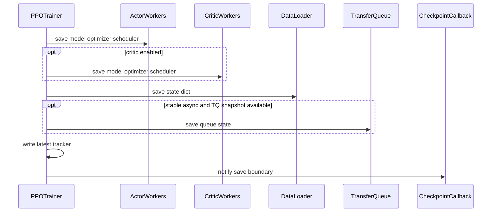

# verl 训练 Checkpoint 与恢复：模型、数据游标和在途轨迹的一致性

> **代码基准**：verl `main` @ `254a23edc62f25ebfae626e3932ae285d6f86009`（2026-08-28）
> **最后更新**：2026-08-31 · **定位**：训练持久化与恢复一致性唯一机制 owner
>
> **核心结论**：训练 checkpoint 不是一个模型目录，而是一组必须在同一逻辑边界对齐的状态：
> actor/critic 的模型、优化器和 scheduler，Trainer 的 global step，dataloader cursor，以及异步模式中
> 已消费但尚未训练的 prompt/trajectory。V1 async 只有在 TransferQueue 提供 snapshot API 时才能组合
> 保存后者；experimental fully async 明确只保存 dataloader，不能无损恢复全部在途样本。
> `CheckpointEngine` 则是 actor→rollout 的在线权重发布系统，与本页的恢复 checkpoint 无关。

---

## 1. 先消除同名歧义

| 名称 | 目的 | 生命周期 | 权威页 |
|---|---|---|---|
| Engine/Trainer checkpoint | 进程退出后恢复训练 | 跨重启、文件/远端存储 | 本页 |
| `CheckpointEngine` | 把 live actor 权重安装到 live rollout | 单次在线 publication session | [[21_verl_weight_publication_analysis]] |

前者通过 Worker/Engine 的 `save_checkpoint`/`load_checkpoint` 保存模型、优化器和 scheduler
（`verl/workers/engine/base.py:253-286`；`verl/workers/engine_workers.py:443-448,717-724`）。后者通过
transport 和 rollout loader 改变推理模型，不创建一个可供 Trainer resume 的组合状态。

把两者都简称“checkpoint”会导致两个错误推论：rollout 已看到新权重不等于训练状态已持久化；训练目录
存在也不等于 rollout 服务已切到该版本。

## 2. 恢复必须对齐哪些状态

| 状态 | 为什么必须保存或重建 | 缺失后的后果 |
|---|---|---|
| actor model/optimizer/scheduler | 决定下一梯度步和学习率 | 参数或优化轨迹回退 |
| critic model/optimizer/scheduler | GAE/value 路径的学习状态 | value 与 actor step 不对齐 |
| global step / parameter version | 指标、staleness、保存周期、采样版本 | 样本 age 与调度语义错误 |
| dataloader cursor/RNG | 已消费 prompt 的边界 | 重复或跳过输入 |
| finished trajectories | 已生成但尚未训练的可用样本 | 重算并改变样本集合 |
| pending/running prompts | dataloader 已前进、生成未完成 | prompt 永久丢失或重复 |
| queue/admission state | 哪些样本已被选中或淘汰 | 恢复后 batch 组成改变 |

“文件都写出来了”仍不足以证明这些状态来自同一逻辑时刻。正确的恢复测试要核对样本集合、版本、顺序和
重复率，而不只看模型能否 load。

## 3. V1 保存顺序

V1 `_save_checkpoint()` 以 `global_step_N` 建目录，先调用 actor workers，再调用可选 critic workers，然后
保存 dataloader state（`verl/trainer/ppo/v1/trainer_base.py:889-940`）。stable async 模式若
TransferQueue 版本/对象具有 save/load API，还会把 queue snapshot 放到同一 step 目录
（`verl/trainer/ppo/v1/trainer_base.py:106-116,942-950`）。

同步保存最后写 `latest_checkpointed_iteration.txt`，再调用 callback
（`verl/trainer/ppo/v1/trainer_base.py:952-971`）。tracker-last 降低 auto-resume 选择半成品目录的概率，
但它不是跨 actor ranks、critic、dataloader、TQ 和远端存储的原子 commit record；源码没有统一事务或
rollback。

保留数量按 actor/critic 分开控制。旧 `remove_previous_ckpt_in_save` 已 deprecated，代码把它翻译成
`max_actor_ckpt_to_keep=1` 与 `max_critic_ckpt_to_keep=1`
（`verl/trainer/ppo/v1/trainer_base.py:898-935`）。删除旧 checkpoint 的策略也不能早于新 checkpoint
真正 durable，否则一次中途失败可能同时失去新旧恢复点；具体 backend 是否保证这一点需查各 Engine，
不能由 Trainer 调用点外推。

## 4. V1 恢复顺序与 in-flight 重发

V1 `_load_checkpoint()` 按 `resume_mode` 选择无恢复、自动最新目录或指定 step path，并从目录名恢复
`global_steps`（`verl/trainer/ppo/v1/trainer_base.py:793-820`）。加载顺序固定为：

1. actor；
2. 可选 critic；
3. dataloader state；
4. stable async 的 TransferQueue snapshot。

对应代码在 `verl/trainer/ppo/v1/trainer_base.py:822-850`。TQ 必须在 AgentLoopManager 创建之前加载，
所以 pending/running prompt 的真正重发延迟到 `fit()` 拿到 manager 以后。

`_reissue_inflight_prompts()` 扫描 prompt tags：

- finished trajectories 保留，可继续被 ReplayBuffer 使用；
- pending/running prompt 取回原 prompt data；
- 清除同 uid 的旧局部 trajectory；
- 把 prompt 重标为当前 step 的 pending，再调用 AgentLoop 重新生成。

实现位于 `verl/trainer/ppo/v1/trainer_base.py:851-887`。因此恢复语义不是续接 partial token stream；
未完成 trajectory 的局部工作会丢弃并重算。外部工具或 reward 服务若有副作用，必须靠应用层幂等 key
避免重发造成重复操作。

## 5. 各模式实际保存了什么

| 模式 | 模型状态 | dataloader | 在途数据 | 恢复语义 |
|---|---|---|---|---|
| V1 sync | actor、可选 critic | 保存 | 不保存 TQ snapshot | checkpoint 位于完成的同步 step；下一 step 重新取 prompt |
| V1 stable async + TQ snapshot | actor、可选 critic | 保存 | finished 保留；pending/running prompt 可重发 | 局部 trajectory 清除后重算 |
| V1 stable async 无 snapshot API | actor、可选 critic | 保存 | 不保存 | dataloader 已消费但未训练的 prompt 无源码内找回保证 |
| V0 legacy | actor、可选 critic | 保存 | 无组合队列 snapshot | 恢复 driver-centric 同步循环 |
| Experimental fully async | actor、可选 critic | 保存 rollouter dataloader | pending、cancel、result、MQ 不保存 | 明确可能丢在途样本 |

V0 当前实现保存 actor、critic 和 dataloader，并用 tracker 选择最新 step；load local checkpoint 时对 epoch
边界做特殊处理，避免恢复一个“已耗尽”的 dataloader state
（`verl/trainer/ppo/ray_trainer.py:983-1050,1052-1117`）。它没有 V1 TQ 组合状态，不能把 V1 async 的
重发语义套到 V0。

Experimental fully async 用 `current_param_version` 命名 checkpoint，保存 actor、critic，并调用
Rollouter 保存 dataloader，最后写 tracker
（`verl/experimental/fully_async_policy/fully_async_trainer.py:917-980`）。Rollouter 源码明确警告：
pending、cancel、result queue 和 MessageQueue 中仍有在途样本，只保存 dataloader 会在 resume 时丢样，
无损恢复仍是 TODO（`verl/experimental/fully_async_policy/fully_async_rollouter.py:655-668`）。

## 6. Async save 与 callback 不代表 durable

V1 actor checkpoint 配置 `async_save=True` 时，Trainer 跳过 latest tracker，但仍调用 callback 并传入
`async_save=True`（`verl/trainer/ppo/v1/trainer_base.py:952-962`）。callback 接口文档明确说明：Megatron
后台 writer 在 callback 触发时可能仍在写，latest tracker 也尚未创建
（`verl/trainer/ppo/checkpoint_callback.py:49-63`）。

所以 callback 的安全语义是“driver 已完成 checkpoint RPC 调度且没有在同步调用处抛错”，而不是：

- 所有 rank 的文件已 fsync；
- 远端副本已完成；
- 目录已成为 auto-resume 可见的最新 durable checkpoint；
- TQ/dataloader 与异步模型文件已原子对齐。

自定义 callback 适合发事件、触发外部轮询或登记待完成任务；若要宣告 durable，必须再验证 backend 的
完成标志和文件集合。默认 no-op callback 不增加任何一致性
（`verl/trainer/ppo/checkpoint_callback.py:28-82`）。

## 7. Crash window 与可证明边界

| 崩溃窗口 | 可能状态 | 恢复决策 |
|---|---|---|
| actor 保存中 | 部分 rank 文件存在，tracker 未更新 | 不选择该 step；检查 backend completion |
| actor 完成、critic 失败 | 参数 step 不一致 | 整个 step 作废，不能只恢复 actor |
| 模型完成、dataloader 前 | 模型已前进但 cursor 仍旧 | tracker-last 应阻止 auto-resume 选择 |
| dataloader 完成、TQ 前 | async 已消费 prompt 未进入 snapshot | step 不具备组合恢复语义 |
| TQ 完成、tracker 前 | 完整目录可能存在但不可自动发现 | 人工验证后才可指定 resume path |
| tracker 后外部副本未完成 | local 可恢复、remote 未必 | 区分 local tracker 与 remote durability |

表中“tracker-last 应阻止”是由写序作出的约束，不是文件系统原子事务证明。尤其多节点共享存储、异步
writer、对象存储/HDFS 上传和进程突然退出可能改变可见性顺序；需要故障注入才能把推断升级为保证。

## 8. 恢复验收清单

一个合格的恢复测试至少核对：

1. actor/critic 参数、optimizer step 和 learning rate 与保存时一致；
2. global step/parameter version 与目录、metrics 和 sample tags 一致；
3. dataloader 后续 prompt 集合与无故障基线一致；
4. stable async 的 finished trajectory 不重复生成；pending/running prompt 恰好重发一次；
5. 旧 partial trajectories 已清除，没有和新结果混合；
6. V1 无 TQ snapshot 和 experimental fully async 明确记录预期丢样，而不是静默通过；
7. async save 必须等 backend completion 后才模拟重启；
8. `CheckpointEngine` publication test 与 Trainer resume test 分开执行。

## Related Pages

- [[10_verl_end_to_end_iteration_analysis]] —— 默认 V1 sync 在什么 step 边界触发保存。
- [[13_verl_workers_engine_analysis]] —— 各 Engine 对模型、优化器和 scheduler checkpoint 的实现边界。
- [[16_verl_v1_transfer_queue_analysis]] —— TQ snapshot 中 key/tag/field 状态的含义。
- [[17_verl_v1_async_trainer_analysis]] —— stable async 为什么存在已消费但未训练的在途 prompt。
- [[20_verl_ray_trainer_analysis]] —— V0 legacy 保存/恢复所在的 driver lifecycle。
- [[21_verl_weight_publication_analysis]] —— 与训练恢复不同的 actor→rollout 在线 publication。
- [[22_verl_fully_async_dynamic_schedule_deepdive]] —— experimental MQ 与版本窗口为什么无法被当前 checkpoint 无损覆盖。
