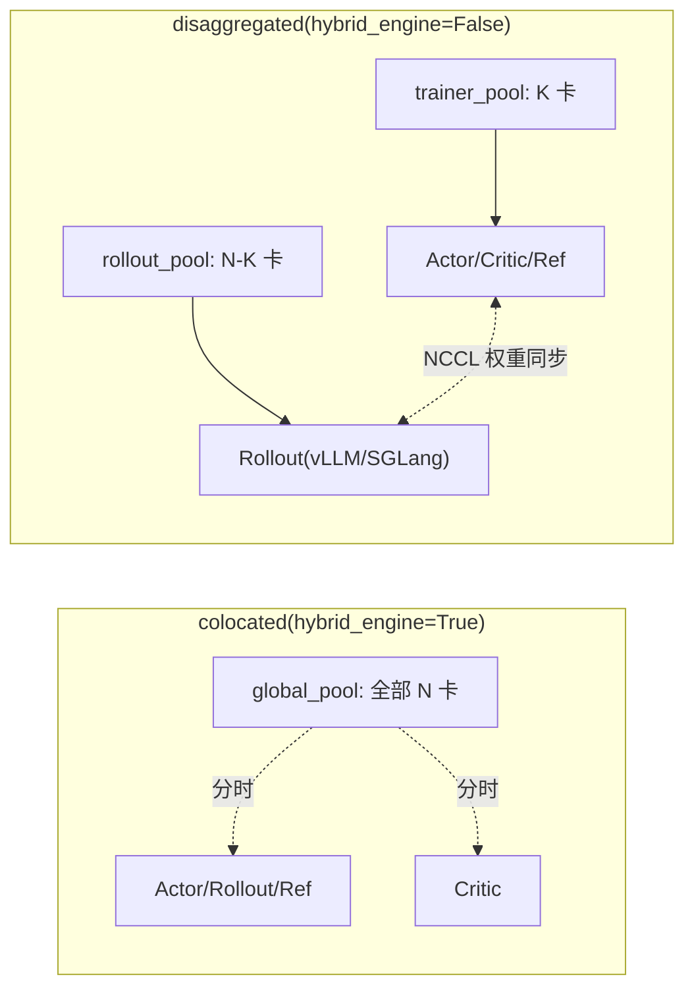
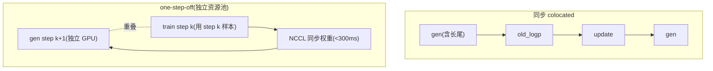

# verl 性能与显存优化 —— 重分片·序列打包·offload·placement·异步 RL

> **代码基准**:verl `main` @ `8a694930`
> **最后更新**:2026-06-22 · **系列**:verl RLHF 框架源码级分析(见 [[verl/index]])
>
> on-policy RL 的吞吐由 **rollout 长尾** 与 **train/generate 显存拉锯** 共同主导。本篇是 verl 性能/显存手段的**横切目录**:每个机制给一个代码锚点 + "为什么",不重复 3D-HybridEngine 的重分片细节(见 [[14_verl_rollout_resharding_analysis]])。
> 行号约定:默认以**内层包** `verl/`(即 `E:\...\verl\verl\`)为根;仓库根文件(如 `README.md`)显式标注 `[repo]`。

> [!note] 本页基线 verl `8a694930`;端到端迭代以 [[10_verl_end_to_end_iteration_analysis]](基线 `983cb0f`)为准,两基线间机制差异以新基线页为先。

---

## 1. 功能范围与定位

verl 是 HybridFlow 单控制器 + 多 worker 的 RLHF 框架(架构见 [[01_verl_architecture_overview_analysis]] / [[11_verl_single_controller_analysis]])。一个 PPO/GRPO step 串起 **rollout(生成)→ old_log_prob → ref/critic → advantage → actor/critic update** 五段;其中:

- **生成是吞吐瓶颈**:DAPO-32B 训练中 rollout 占总时长约 70%,且**加资源也压不下** rollout 的长尾(短样本早完、长样本拖尾,GPU 空转)——`experimental/one_step_off_policy/README.md:18-19`。
- **显存是 colocated 模式的核心矛盾**:同一组 GPU 上,训练态(param+grad+optimizer+激活)和推理态(权重副本+KV cache)要**分时复用**;谁常驻、谁让位,决定能不能跑得起、跑多大 batch。

围绕这两点,verl 的性能/显存"旋钮"分五类(本篇逐一展开):

```
省通信/省显存(切换 train↔generate):
  ① 3D-HybridEngine 重分片        训练分片 → 推理分片,零冗余、原地 all-gather(§2,详见姊妹页)
  ② placement / colocation       同组 GPU 分时(colocated) vs 独立资源池(disaggregated)(§3)
  ③ CPU offload                  param/grad/optimizer 落 CPU;FSDP2 offload_policy 与梯度累积兼容(§4)
省算力(吞吐):
  ④ 序列打包 / 去填充 / 动态批     变长 RL response 不补 0,按 token 预算切 micro-batch(§5)
  ⑤ Ulysses 序列并行             长序列沿 seq 维 all-to-all 分摊到 SP 组(§6)
重排流水(去长尾):
  ⑥ 异步 RL                      one-step-off / fully-async / transfer_queue,gen 与 train 重叠(§7)
其它:flash-attn2 / sequence packing / LoRA RL / Liger-kernel / 梯度检查点(§8)
```

---

## 2. 3D-HybridEngine 重分片经济性(摘要,详见姊妹页)

训练态用 FSDP/Megatron 的 **(DP×TP×PP)** 分片,推理态用 vLLM/SGLang 的 **(TP×PP)** 分片,两者切片不一致。3D-HybridEngine 的价值在于:**在同一组 GPU 上把训练分片就地重组成推理分片**,而不是把全量权重落盘/经 host 再灌进推理引擎。README 的官方表述:

> `README.md:42` [repo] *"Efficient actor model resharding with 3D-HybridEngine: **Eliminates memory redundancy and significantly reduces communication overhead** during transitions between training and generation phases."*

两层收益:**显存**——推理权重不另开一份全量副本,借训练分片原地 all-gather;**通信**——重组只在必要的并行轴上发生,不走 host 往返。完整的 sharding manager 状态机、`__enter__/__exit__` 时机、与 offload 的交互见 [[14_verl_rollout_resharding_analysis]]。本篇只需记住:**它是 colocated 模式下 train↔generate 切换不爆显存的前提**。

---

## 3. Placement / colocation 策略

### 3.1 两种布局



- **colocated**:所有角色映射到**同一个资源池** `global_pool`,在同一组 GPU 上**分时复用**。
- **disaggregated**:训练与生成各占**独立 GPU 池**,通过 NCCL 同步权重,gen 与 train 可**时间重叠**。

### 3.2 `ResourcePoolManager`:role → pool 的映射层

资源池管理器只有三个字段:池规格、role→池名映射、池字典(`single_controller/ray/base.py:185-193`):

```python
class ResourcePoolManager:
    resource_pool_spec: dict[str, list[int]]   # 池名 -> 每节点卡数列表
    mapping: dict[int, str]                     # Role -> 池名
    max_colocate_count: int = 3                 # 同池可叠放的 WorkerGroup 数
```

`get_resource_pool(role)` 就是 `resource_pool_dict[mapping[role]]`(`base.py:218-220`)。`max_colocate_count` 决定**一个物理 GPU 上能叠几个 WorkerGroup**:FSDP 后端可把 actor/critic/ref 合到 1 个,Megatron 推荐 >1(`base.py:200-207`);每个 worker 实际拿 `1/max_colocate_count` 张卡(`base.py:629`)。

**colocated 的构造**(`trainer/main_ppo_v0.py:81-84`):只建一个池,把所有角色塞进去——

```python
global_pool_id = "global_pool"
resource_pool_spec = {global_pool_id: [config.trainer.n_gpus_per_node] * config.trainer.nnodes}
```

角色注册时一律 `self.mapping[role] = "global_pool"`(actor `:65`,critic `:76`,reward `:121-123`)。RewardModel 可选独立池 `enable_resource_pool` → `reward_pool`(`:86-93`);蒸馏 teacher 同理走 `teacher_pool`(`:98-106`)。

`init_workers` 里 `hybrid_engine=True` 时 actor 与 rollout 落在**同一** `actor_rollout_resource_pool`(`trainer/ppo/ray_trainer.py:784-793`);`else: raise NotImplementedError`(`:794-795`)——**基线 ray_trainer 只支持 colocated**,disaggregated 必须走 experimental。

### 3.3 disaggregated:`experimental/separation` 与 `one_step_off_policy`

`experimental/separation/utils.py:33-47` 把训练类角色绑到 `trainer_pool`、rollout 角色另起池:

```python
training_roles = [Role.Actor, Role.ActorRollout, Role.Critic, Role.RefPolicy]
trainer_pool = [config.trainer.n_gpus_per_node] * config.trainer.nnodes
resource_pool_spec["trainer_pool"] = trainer_pool
for role in training_roles:
    if role in roles: mapping[role] = "trainer_pool"
```

`one_step_off_policy/main_ppo.py:121-122` 把 rollout 池的卡数从**独立配置** `config.rollout.{nnodes,n_gpus_per_node}` 取(与 `trainer.*` 解耦),并显式 `actor_rollout_ref.hybrid_engine=False`(README `:233-239`)。这正是 §7 异步训练的物理前提:**只有把生成搬到独立 GPU,才能让它和训练在时间上重叠**。

---

## 4. 显存 offload

### 4.1 三个 offload 开关(param/grad/optimizer)

`EngineConfig` 基类给出三个布尔开关,默认全 `False`(`workers/config/engine.py:90-94`):

```python
param_offload: bool = False      # 分片参数落 CPU
optimizer_offload: bool = False  # 优化器状态(m/v)落 CPU
grad_offload: bool = False       # 梯度落 CPU
```

FSDP 引擎在 `to(device, model, optimizer, grad)` 里按需搬运(`workers/engine/fsdp/transformer_impl.py:756-768`):

```python
if device == device_name:           # 上 GPU
    if model: load_fsdp_model_to_gpu(self.module)
    if optimizer and self.optimizer: load_fsdp_optimizer(self.optimizer, device)
elif device == "cpu":               # 落 CPU
    if model: offload_fsdp_model_to_cpu(self.module)
    if optimizer and self.optimizer: offload_fsdp_optimizer(self.optimizer)
```

`forward_only=True`(ref policy)**强制常驻 CPU**(`:749-751`)。这套手动 `to()` 就是 colocated 下"训练态让位给 rollout"的落地点:rollout 前把 actor 的 param/optimizer 推到 CPU,腾出显存给推理引擎和 KV cache;rollout 后再拉回。checkpoint 存取也借它临时上 GPU(`:781-815`)。Megatron 引擎同样继承这三个开关,并默认 `use_distributed_optimizer=True`(`config/engine.py:196`)分片优化器状态。

### 4.2 FSDP2 `offload_policy`:与梯度累积兼容

FSDP2 走的是原生 `CPUOffloadPolicy`,而非手动 `.to()`。`FSDPEngineConfig.offload_policy`(`config/engine.py:251`)置真时,建模处挂上 pinned-memory 的 offload policy(`fsdp/transformer_impl.py:434-439`):

```python
if self.engine_config.offload_policy or self.engine_config.forward_only:
    offload_policy = CPUOffloadPolicy(pin_memory=True)
    self._uses_fsdp2_cpu_offload_policy = True
```

关键差异(README 明示):

> `README.md:185` [repo] *"FSDP2 cpu offloading is **compatible with gradient accumulation**. You can turn it on to save memory with `actor_rollout_ref.actor.fsdp_config.offload_policy=True`."*

FSDP1 的手动 offload 在梯度累积时会有 D2H/H2D 与 CPU 加法的依赖冲突;FSDP2 的 `CPUOffloadPolicy` 由框架接管 CPU↔GPU 搬运,因此累积下仍可省显存。注意一旦启用,**它独占 CPU↔GPU 摆放权**——`get_per_tensor_param` 里特意跳过手动 `model.to(device)`,否则模块"半搬运"会让 `state_dict()` 崩(`:820-824`,#5995)。

---

## 5. 序列打包 / 去填充 / 动态批

RL 的 response 长度天然变长(同一 prompt 的 n 条采样长短不一)。若按定长 batch 补 padding,算力浪费随长尾放大。verl 用三层手段压平:

### 5.1 去填充(remove padding)

`use_remove_padding`(`config/engine.py:112`,默认 `True`;actor 侧 `config/actor.py:312`)在前向把 padding token 剔除,只算有效 token。Megatron 引擎据此切换 `thd`(packed)vs `bshd`(padded)数据格式(`engine/megatron/transformer_impl.py:915/1052`),且融合 kernel 要求 `use_remove_padding=True`(`:876-878`)。

### 5.2 动态批(dynamic bsz):按 token 预算切 micro-batch

`use_dynamic_bsz`(`config/engine.py:102`)开启后,**不按固定样本数**切 micro-batch,而是按**每卡 token 预算** `max_token_len_per_gpu` 贪心装箱(`workers/engine/utils.py:73-86`):

```python
if use_dynamic_bsz:
    max_token_len = max_token_len_per_gpu * sp_size           # SP 组共享预算
    micro_batches, batch_idx_list = rearrange_micro_batches(data, max_token_len=max_token_len, ...)
else:
    micro_batches = chunk(data, len // micro_batch_size_per_gpu)   # 定长回退
```

- 动态批走 `rearrange_micro_batches`(`utils/seqlen_balancing.py`),把样本重排进若干"token 数 ≈ `max_token_len`"的桶,**每个 micro-batch 的实际样本数随长度浮动**——短样本多装、长样本少装,显存峰值由 token 数而非样本数决定。
- 静态回退按 `micro_batch_size_per_gpu` 定长切,要求 `len % (force_group_size * mbs) == 0`(`utils.py:87-93`)。
- 配置侧两套互斥旋钮:`ppo_max_token_len_per_gpu`(默认 16384)对应动态批,`ppo_micro_batch_size_per_gpu` 对应静态批(`config/actor.py:114-156`);二者校验互斥(`actor.py:200-210`)。

### 5.3 跨 DP rank 负载均衡:`balance_batch`

单控制器在分发前对**整个 global batch** 重排,让每个 DP rank 拿到**总 token 数相近**的样本(`trainer/ppo/ray_trainer.py:1145-1213`):

```python
global_seqlen_lst = attention_mask.view(bs, -1).sum(-1)
workload_lst = calculate_workload(global_seqlen_lst)
global_partition_lst = get_seqlen_balanced_partitions(workload_lst, k_partitions=dp_size, equal_size=True)
...
batch.reorder(global_idx)               # :1209 按均衡结果重排
```

并把"小 micro-batch 排两端"以减少 PP 气泡(`:1199-1205`)。开关 `trainer.balance_batch`(`ray_trainer.py:1503-1504`)。注释提醒:重排会改变 mini-batch 组合,但因 advantage 基于 uid 计算故不影响优势值(`:1500-1502`)。**PrefixGrouper** 场景走 group-level 均衡,保证同 uid 样本落同一 rank(`:1160-1182`)。

### 5.4 共享前缀打包:`prefix_grouper_utils`

GRPO 下同一 prompt 采样 n 条 response,**prompt 前缀完全相同**。`prefix_grouper_utils.py` 用 `PrefixGrouper` 把前缀只算一次:`build_pg_from_micro_batch`(`:46`)按相邻 uid 聚组、抽出每组 prefix;`pg_forward`(`:103-147`)拼成 `prefix + 各 suffix` 一次前向,再 `split_output` 拆回每条的 suffix logits。`build_position_ids_for_prefix_grouper`(`:23-43`)让每条 response 的 position_id **从 `prefix_len` 重新计数**,保证语义正确。收益:n 条共享前缀只前向一遍,长 prompt + 多采样时省下大量重复算力。

### 5.5 多轨迹补齐:`padding_utils`(TransferQueue 路径)

每 prompt 轨迹数可变时,global batch 可能**不整除** `dp_size`/`mini_batch_size`。`upsample_batch_to_divisible_size`(`padding_utils.py:127-198`)追加**最小合成样本**(1 prompt token + 1 response token,`construct_minimal_padding_template:70-124`)凑整除数:reward/log_prob/loss_mask 全置零、打 `is_padding=True` 标记,**不污染 PPO/熵/KL 损失与 GRPO 优势**(用独立 `pad{uuid}` 的 uid,`:160-163`)。

---

## 6. Ulysses 序列并行(长序列)

当单条序列长到单卡装不下激活时,verl 接入 **DeepSpeed-Ulysses** 式序列并行:沿 **seq 维** 把序列切给 SP 组各 rank,在注意力处用 **all-to-all** 把"按 seq 切"转成"按 head 切"。

### 6.1 数据重分片:`FSDPUlyssesShardingManager`

`utils/ulysses.py:363-405`。它是个上下文管理器:`__enter__` 把当前 SP 进程组切到 `device_mesh["sp"]`(`:373-376`);`preprocess_data` 在 SP 组内 **all-gather** 数据(因为数据先按 FSDP/DP 切过,SP 组内必须看到同一份)(`:382-394`);`postprocess_data` 再按 SP rank `chunk` 回去(`:396-404`)。

### 6.2 注意力处的 all-to-all:seq↔head 维度互换

真正的序列并行发生在 attention 内部,由 monkey patch 注入(`models/transformers/monkey_patch.py:131-153`):

```python
query_states = gather_seq_scatter_heads(query_states, seq_dim=1, head_dim=2)   # all-gather seq, scatter head
key_states   = gather_seq_scatter_heads(key_states,   seq_dim=1, head_dim=2)
value_states = gather_seq_scatter_heads(value_states, seq_dim=1, head_dim=2)
# ... 全序列、本 rank 持有的 head 子集上做 SDPA ...
attn_output  = gather_heads_scatter_seq(attn_output, seq_dim=1, head_dim=2)     # 反向:gather head, scatter seq
```

`gather_seq_scatter_heads/gather_heads_scatter_seq`(`ulysses.py:66-105`)底层调 `SeqAllToAll.apply`(`ulysses.py:169-195`)——一次 `dist.all_to_all`(`all_to_all_tensor:137-156`)把 seq 维聚齐、head 维散开。约束:`num_heads % sp_size == 0`(`validate_ulysses_config:337-341`)。开关 `ulysses_sequence_parallel_size`(`config/actor.py:307` / `FSDPEngineConfig:258`),默认 1(不启用)。

> **为什么用 all-to-all 而非 all-gather**:Ulysses 把通信量摊在 head 维,**单次 all-to-all 的通信量与 SP 大小无关**(每 rank 收发 1/SP),比沿 seq 维全量 all-gather KV 省;代价是 head 数必须能被 SP 整除。这与 [[13_torchtitan_cp_analysis]] 的 Ring/All-gather CP 是不同取舍。

---

## 7. 异步 RL:让生成与训练重叠

colocated 同步训练里 `step ≈ gen + old_log_prob + update_actor`,gen 的长尾直接进关键路径。异步把 gen 移出关键路径。verl 有**三条**异步路线,激进程度递增。



### 7.1 one-step-off:错一拍重叠(`experimental/one_step_off_policy`)

核心:**当前 step 训练时,异步生成下一 step 的样本**;训练与生成参数差一步(one-step off-policy)。`README.md:80-131` 给出主循环骨架:`_async_gen_next_batch` 先 `sync_rollout_weights()` 再 `async_generate_sequences()` 返回 future;主循环 `batch = future.get()` 拿上一拍结果、立刻发起下一拍生成、然后训练当前批。要点:

- **资源隔离**:actor/rollout 各占独立池(§3.3),`hybrid_engine=False`(`README.md:233-239`)。
- **NCCL 权重同步**:actor→rollout 逐张量 broadcast,实测 <300ms,对 RLHF 可忽略(`README.md:135-211`)。
- 实测:colocate-sync 19h18m → one-step-off 15h34m(**+23%**,FSDP2);Megatron **+40%**(`README.md:62-74`)。
- 关键路径从 `gen+old_logp+update` 缩成 `wait_prev_gen+old_logp+update`——只剩**未被完全重叠的那段** gen(`README.md:69-70`)。

`one_step_off_policy/ray_trainer.py:141-149` 只为 `Role.Actor` 单独建类(rollout 在独立 wg),与基线 ray_trainer 的 colocated 装配明显不同。

### 7.2 fully-async:多步异步 + 流式 + partial rollout(`experimental/fully_async_policy`)

完全解耦 Rollouter / MessageQueue / Trainer / ParameterSynchronizer 四件套(`README.md:64-76`),把 one-step-off 的"硬性差一步"放宽成**可调的陈旧度**。关键旋钮:

| 旋钮 | 含义 | 来源 |
|---|---|---|
| `async_training.staleness_threshold` | 允许使用的陈旧样本最大比例;0=同步,1≈one-step-off | `README.md:126-145` |
| `async_training.trigger_parameter_sync_step` | Trainer 本地更新多少次再同步一次权重 | `README.md:117-124` |
| `async_training.require_batches` | 一次取多少个 `ppo_mini_batch_size` 才训练(=1 最接近纯流式) | `README.md:151-159` |
| `async_training.partial_rollout` | 同步权重时**中断**在飞 rollout、存状态、下轮续算(仅 staleness>0 生效) | `README.md:55-58/147-149` |

四种模式由这些参数组合出来(on-policy / stream-off / async-stale / async-partial,`README.md:188-230`)。实测 Qwen2.5-7B 128 卡 **2.35x–2.67x**(`README.md:8-9/354-361`)。权重同步可选 **checkpoint-engine**,235B 上 58.6s→23.7s(`README.md:452-462`)。

### 7.3 v1 / transfer_queue 路径:`TaskRunnerV1`(`trainer/main_ppo.py`)

`trainer.use_v1=True` 时走 `TaskRunnerV1`(`main_ppo.py:90/161-162`),强制 `config.transfer_queue.enable=True` 并 `tq.init`(`:122-134`),把 agent loop 产出灌进 **TransferQueue**——一个**子样本级、流式**的数据网关,解耦各计算任务的数据依赖(`docs/data/transfer_queue.md:14-20`)。训练器由 `get_trainer_cls(config.trainer.v1.trainer_mode)` 选(`main_ppo.py:124-126`),三种模式注册在 `trainer/ppo/v1/__init__.py:15-19`:

- `PPOTrainerSync`(`trainer_sync.py`)——同步基线;
- `PPOTrainerColocateAsync`(`trainer_colocate_async.py:25-57`)——**colocated + partial rollout**:`on_train_begin` 预热若干 batch(`:40-44`),`on_sample_end` abort 未完成请求并 `sleep_replicas` 让出显存(`:53-57`),`on_step_end` 更新权重并 `resume_generation_replicas`(`:46-51`);
- `PPOTrainerSeparateAsync`(`trainer_separate_async.py`)——分离资源池异步。

`register_trainer/get_trainer_cls` 注册表在 `trainer_base.py:1482-1510`。TransferQueue 的价值:**colocated 也能 partial-rollout 异步**(sleep/resume 让 KV cache 与训练态分时),并在多模态大集群上省 host 内存(官方 128×H100 多模态端到端 +49.1%,`transfer_queue.md:29`)。

---

## 8. 其它性能/显存特性(README Key Features)

`README.md:89-102` [repo] 列出的横切手段,各自的配置锚点:

| 特性 | 作用 | README / 配置锚点 |
|---|---|---|
| Flash-Attention 2 | 省激活显存 + 加速注意力 | `README.md:100`;VeOmni `attn_implementation` `config/engine.py:371` |
| Sequence packing(去填充) | 变长 RL 不补 0,见 §5.1 | `README.md:100`;`use_remove_padding` `config/engine.py:112` |
| Sequence parallelism(Ulysses) | 长序列分摊,见 §6 | `README.md:100`;`ulysses_sequence_parallel_size` `config/actor.py:307` |
| LoRA / **LoRA RL** | 低秩适配省显存,multi-GPU LoRA RL 进一步省 | `README.md:100-102`;per-unit LoRA summon(本基准 commit `8a694930`) |
| Liger-kernel | 融合 RMSNorm/SwiGLU/CE 等省显存提速 | `README.md:100`(`USE_LIGER=1`) |
| 梯度检查点(entropy) | 熵计算的激活重算 | `entropy_checkpointing` `config/engine.py:262`、`config/actor.py:310` |
| 分块熵 | 大词表熵分块算,降峰值 | `entropy_from_logits_with_chunking` / `_chunk_size` `config/engine.py:259-260` |
| `torch.compile` | inductor 融合 | `use_torch_compile=True`(默认)`config/engine.py:261` |
| 融合 kernel(fused lm head) | 减 kernel 启动 | `use_fused_kernels` `config/engine.py:110`(需 `use_remove_padding`) |
| FSDP2 升级 | 更优吞吐/显存、可组合 compile | `README.md:175-182` [repo] |
| 自定义优化器(8bit/bf16 SR) | 优化器状态省显存 | `build_optimizer` 动态 import `config/optimizer.py:218-271`(`torchao.optim` / `bitsandbytes.optim`) |

> 优化器侧值得单独点名:`FSDPOptimizerConfig` 把 `optimizer_impl` 做成**模块路径**(`config/optimizer.py:93/106-107`),`build_optimizer` 运行时 `importlib` 拉起对应类(`:258-271`)——于是 `bitsandbytes.optim.AdamW8bit`(8-bit 优化器状态)或 `torchao.optim._AdamW`(bf16 随机舍入)可零代码切入,直接压低优化器显存。

---

## 9. 主旋钮表:config key → 机制 → 作用 → 代码锚点

| 旋钮(config key) | 机制 | 作用 | 代码锚点 |
|---|---|---|---|
| `actor_rollout_ref.hybrid_engine` | colocated vs disaggregated | 决定 train/gen 同卡分时还是独立池重叠 | `ray_trainer.py:784-795`;`one_step_off/README.md:233-239` |
| `*.param_offload` / `optimizer_offload` / `grad_offload` | 手动 CPU offload | 训练态让位给 rollout,省显存 | `config/engine.py:90-94`;`fsdp/transformer_impl.py:756-768` |
| `actor.fsdp_config.offload_policy` | FSDP2 `CPUOffloadPolicy` | 省显存且**兼容梯度累积** | `config/engine.py:251`;`fsdp/transformer_impl.py:434-439`;`README.md:185` |
| `*.use_dynamic_bsz` | 动态批(token 装箱) | micro-batch 按 token 预算,削变长浪费 | `config/engine.py:102`;`engine/utils.py:73-86` |
| `*.ppo_max_token_len_per_gpu` | 动态批每卡 token 预算 | 控制显存峰值(× sp_size) | `config/actor.py:116`;`engine/utils.py:75-76` |
| `*.ppo_micro_batch_size_per_gpu` | 静态批回退 | 定长切 micro-batch | `config/actor.py:114`;`engine/utils.py:87-93` |
| `*.use_remove_padding` | 去填充 / 序列打包 | 只算有效 token | `config/engine.py:112`;megatron thd/bshd `:915` |
| `trainer.balance_batch` | 跨 DP 负载均衡重排 | 各 rank token 数相近,削气泡 | `ray_trainer.py:1145-1213/1503` |
| `actor.use_prefix_grouper` | 共享前缀打包 | 同 prompt 多采样前缀只算一次 | `prefix_grouper_utils.py:46-147` |
| `*.ulysses_sequence_parallel_size` | Ulysses 序列并行 | 长序列 all-to-all 分摊 | `config/actor.py:307`;`ulysses.py:363/66-105` |
| `*.entropy_checkpointing` / `entropy_from_logits_with_chunking` | 熵重算 / 分块 | 降熵计算激活峰值 | `config/engine.py:259-262` |
| `*.use_fused_kernels` / `use_torch_compile` | 融合 kernel / 编译 | 减启动、融合算子 | `config/engine.py:110/261` |
| `optimizer_impl` + `optimizer` | 8bit/bf16 优化器 | 压优化器状态显存 | `config/optimizer.py:218-271` |
| `async_training.staleness_threshold` | fully-async 陈旧度 | 0→同步,>0→异步流式 | `fully_async/README.md:126-145` |
| `async_training.trigger_parameter_sync_step` | 权重同步频率 | 本地更新 N 次再同步 | `fully_async/README.md:117-124` |
| `async_training.partial_rollout` | 部分 rollout | 同步时中断/续算在飞样本 | `fully_async/README.md:147-149` |
| `trainer.use_v1` + `trainer.v1.trainer_mode` | v1/TransferQueue 路径 | sync/colocate_async/separate_async | `main_ppo.py:90-162`;`v1/__init__.py:15-19` |

---

## 10. 源码复核小结

| 断言 | 位置 | 结果 |
|---|---|---|
| 基线 ray_trainer 仅支持 colocated(非 hybrid 即 raise) | `ray_trainer.py:794-795` | OK |
| role→pool 经 `ResourcePoolManager.mapping`;colocated 全映射 global_pool | `base.py:218-220`、`main_ppo_v0.py:65/76/81-84` | OK |
| disaggregated 由 separation/one-step-off 用独立 rollout 池 | `separation/utils.py:33-47`、`one_step_off/main_ppo.py:121-122` | OK |
| param/grad/optimizer 三 offload 开关默认 False | `config/engine.py:90-94` | OK |
| FSDP2 `offload_policy` = `CPUOffloadPolicy(pin_memory=True)`,兼容梯度累积 | `fsdp/transformer_impl.py:434-439`、`README.md:185` | OK |
| 动态批按 `max_token_len_per_gpu × sp_size` 装箱 | `engine/utils.py:73-86` | OK |
| balance_batch 跨 DP 按 token 均衡 + 重排 | `ray_trainer.py:1145-1213` | OK |
| PrefixGrouper 共享前缀只前向一次 | `prefix_grouper_utils.py:46-147` | OK |
| Ulysses = SeqAllToAll 在 attention 处 seq↔head 互换 | `monkey_patch.py:131-153`、`ulysses.py:66-195` | OK |
| 3D-HybridEngine "消除显存冗余 + 降通信" | `README.md:42` | OK |
| one-step-off:独立池 + NCCL 同步 + future 重叠 | `one_step_off/README.md:80-211` | OK |
| fully-async:staleness/partial_rollout 多步异步,2.35–2.67x | `fully_async/README.md:8-9/126-149` | OK |
| v1 三种 trainer_mode + TransferQueue | `v1/__init__.py:15-19`、`main_ppo.py:90-162` | OK |

---

## Related Pages

- [[14_verl_rollout_resharding_analysis]] —— 3D-HybridEngine 重分片细节(本篇 §2 只摘要,机制全在此)
- [[20_verl_ray_trainer_analysis]] —— PPO 主循环装配、`init_workers`、resource pool 接线
- [[13_verl_workers_engine_analysis]] —— FSDP/Megatron 引擎 worker、offload 与 micro-batch 执行
- [[11_verl_single_controller_analysis]] —— 单控制器 / WorkerGroup / dispatch,placement 的运行时基础
- [[12_verl_dataproto_analysis]] —— DataProto 与 batch 重排/分发的数据载体
- [[15_verl_rl_algorithms_analysis]] —— GRPO/PPO 与 advantage(prefix-grouper/uid 与之相关)
- [[01_verl_architecture_overview_analysis]] —— 总体架构与本目录定位
- [[verl/index]] —— verl 系列知识地图
- [[32_distributed_optimizer_deepdive]] —— 分布式优化器(Megatron `use_distributed_optimizer` 对照)
- [[11_torchtitan_fsdp_analysis]] —— FSDP2 标杆篇(offload_policy/混合精度跨框架对照)
- [[13_torchtitan_cp_analysis]] —— Context Parallel 对照(Ulysses vs Ring/All-gather CP 取舍)
- [[30_comm_compute_overlap_analysis]] —— 通信-计算重叠的跨框架视角(异步 RL 的更一般化)
