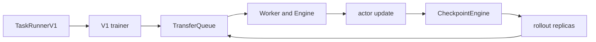

# verl 源码级分析

> **当前代码基准**：volcengine/verl `main` @ `254a23edc62f25ebfae626e3932ae285d6f86009`（2026-08-28 10:08 +08）
> **最后更新**：2026-08-28 · **规模**：14 篇内容页 + 本索引
>
> **总论**：当前 verl 默认执行 V1 sync，控制器用 TransferQueue 引用编排数据，Worker/Engine 负责计算，CheckpointEngine 负责权重发布。稳定 V1 async 与独立 experimental fully-async 是两套不同状态机；V0 `RayPPOTrainer`、single-controller dispatch/collect 与 DataProto 主契约保留为冻结的历史机制页。

---

## 1. 当前架构地图

| 平面 | 当前 owner | 权威页面 |
|---|---|---|
| 入口与控制 | `TaskRunnerV1`、V1 `PPOTrainer`、ReplayBuffer | [[01_verl_architecture_overview_analysis]] · [[10_verl_end_to_end_iteration_analysis]] · [[17_verl_v1_async_trainer_analysis]] |
| 数据 | TransferQueue、`KVBatchMeta`、`tqbridge` | [[16_verl_v1_transfer_queue_analysis]] |
| 算法 | advantage registry、policy-loss registry、global aggregation | [[15_verl_rl_algorithms_analysis]] |
| 计算 | Worker、Engine、parallel backend | [[13_verl_workers_engine_analysis]] |
| 生成 | LLM server、request/KV lifecycle、PD | [[14_verl_rollout_resharding_analysis]] |
| 权重 | CheckpointEngine、full/`delta_sharded`、loader | [[21_verl_delta_weight_sync_deepdive]] |
| 优化 | overlap、offload、staleness、dynamic resource、recovery | [[30_verl_optimization_analysis]] · [[22_verl_fully_async_dynamic_schedule_deepdive]] |



---

## 2. 页面职责

### 入门与主线

| 页面 | 唯一职责 |
|---|---|
| [[01_verl_architecture_overview_analysis]] | 当前四平面 ownership 与系统不变量 |
| [[02_verl_quickstart_guide]] | 从仓内 Qwen3-4B/FSDP 脚本进入默认 V1 sync |
| [[10_verl_end_to_end_iteration_analysis]] | `TaskRunnerV1 → PPOTrainerSync` 一次 step 的当前调用链 |

### 当前机制深潜

| 页面 | 唯一职责 |
|---|---|
| [[13_verl_workers_engine_analysis]] | Worker/Engine 边界、后端矩阵、offload 与 export |
| [[14_verl_rollout_resharding_analysis]] | rollout 请求/KV 生命周期、full 权重刷新与 PD |
| [[15_verl_rl_algorithms_analysis]] | 14 个 estimator、12 个 loss mode 与全局归一化 |
| [[16_verl_v1_transfer_queue_analysis]] | prompt/trajectory key、meta、字段读写与 TQ bridge |
| [[17_verl_v1_async_trainer_analysis]] | stable V1 三模式、ReplayBuffer、恢复、稳定旧策略与 GPU lending |
| [[21_verl_delta_weight_sync_deepdive]] | CheckpointEngine full/`delta_sharded` 状态机与支持矩阵 |
| [[22_verl_fully_async_dynamic_schedule_deepdive]] | 独立 experimental fully-async、MQ、staleness 与动态资源 |
| [[30_verl_optimization_analysis]] | 跨平面优化选择顺序与联合预算，不复制各机制页 |

### 冻结的 V0 机制档案

| 页面 | 历史基线 | 当前用途 |
|---|---|---|
| [[11_verl_single_controller_analysis]] | `8a694930275061f52ebd538c906ef8819af56dbd` | dispatch/collect、WorkerGroup 与 `DataProtoFuture` |
| [[12_verl_dataproto_analysis]] | 同上 | DataProto 的方法级容器分析；V1 中仍用于局部计算 |
| [[20_verl_ray_trainer_analysis]] | 同上 | `trainer.use_v1=false` 才进入的 V0 主循环 |

这三页保留原提交的行号，不做机械 repin。它们描述的机制仍有复用价值，但不能再代表当前默认数据/控制主链。

---

## 3. 三条阅读路线

### 第一次使用 verl

```text
01 架构 → 02 上手 → 10 当前 step → 15 算法 → 30 优化
```

### 诊断异步吞吐或旧样本

```text
10 当前 step → 16 TQ → 17 stable V1 async → 22 experimental fully async → 30 联合预算
```

### 接入训练/rollout 后端或权重同步

```text
13 Worker/Engine → 14 rollout lifecycle → 21 CheckpointEngine delta → 30 选择准则
```

只有在维护 V0、理解 HybridFlow 历史 dispatch 或追踪 DataProto 方法时，才进入 11/12/20。

---

## 4. 2026-08-28 更新要点

- 源码工作区从 `8a694930...` fast-forward 到最终远端 `254a23ed...`；保留的用户未跟踪文件 `GRPO_Analysis.md` 未修改。
- 默认主线统一为 V1 sync；关闭了“V1/TQ 尚未源码核实”的旧缺口。
- 新增 stable V1 async 专页，覆盖 completion、staleness、refill、checkpoint、稳定 old policy 与 GPU lending。
- 新增 CheckpointEngine/`delta_sharded` 专页，区分 dense seed、sparse steady state、Engine/CE/loader ownership。
- 新增 experimental fully-async 专页，明确它不是 V1 trainer mode，记录丢最老样本的 MQ、动态资源与恢复缺口。
- 算法页补齐 DRO、`token-sum`、REINFORCE++ observation-span 修复与 critic 全局归一化。
- Worker/Engine 页补齐 FSDP Turbo、TorchTitan 当前能力、MindSpeed 精确删除范围与 `grad_offload` 配置变化。
- rollout 页补齐 vLLM PD 边界和最终提交新增的 prefix-cache hit 可见性。

---

## 5. 基线与证据规则

当前页统一使用完整提交 `254a23edc62f25ebfae626e3932ae285d6f86009`；每个非平凡实现结论应落到仓库相对 `file:line`。11/12/20 是显式标记的历史基线例外，正文 locator 只在其冻结提交上成立。

若未来 `origin/main` 变化，应先检查以下高漂移区：

```text
verl/trainer/ppo/v1
verl/experimental/fully_async_policy
verl/checkpoint_engine
verl/workers/engine
verl/workers/rollout
verl/trainer/ppo/core_algos.py
```

---

## Related Pages

- [[02_engineering/04_posttrain_frameworks/index]] —— 后训练框架目录
- [[30_rl_framework_comparison]] —— verl 与其他 RL 后训练框架的统一比较
- [[25_on_policy_off_policy_staleness_analysis]] —— on/off-policy 与 staleness 理论坐标
- [[01_posttraining_infra_mechanism_analysis]] —— control/data/weight plane 的跨框架抽象
- [[31_cuda_ascend_posttraining_stack_comparison]] —— CUDA/Ascend 后训练栈比较
