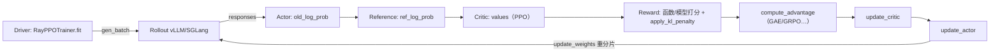

# verl(HybridFlow)RLHF 框架 — 知识地图

> **代码基准**:verl `main` @ `8a694930` · 配套 Ray / vLLM / SGLang / FSDP2 / Megatron-LM 后端
> **最后更新**:2026-06-22(新建:9 篇 verl 源码级分析,从架构→实现→优化、overview→quickstart→deep dive)
> 一套 9 篇 verl(开源版 **HybridFlow**,EuroSys'25,arXiv:2409.19256)源码级分析。verl 是 RL **后训练(RLHF)编排框架**,与预训练并行框架 [[torchtitan/index]] / [[megatron-lm/index]] 互补——后两者是 verl 的**训练后端**,verl 在其上编排「生成(rollout)→ 打分(reward)→ 优势(advantage)→ 更新(actor/critic)」的强化学习数据流。

---

## 设计哲学:单控制器编排,多控制器执行

verl 的核心是 **HybridFlow 混合控制器(hybrid-controller)编程模型**:

> **在 driver 上用「单控制器(single-controller)」的视角写一份中心化的 RL 数据流;每个算子下发到一组「多控制器(multi-controller)」的 SPMD worker 上并行执行。** 控制流集中、计算流分布。

这把 RLHF 这种「多模型、多阶段、强数据依赖」的复杂 dataflow,从手写分布式胶水里解放出来:driver 一行 `actor.update_actor(batch)` 背后,是把 `DataProto` 按 DP 切分(chunk)→ 散播到 N 个 worker → 各自 SPMD 计算 → 收集(concat)回 driver 的全套 dispatch/collect 机制(详见 [[verl_single_controller_analysis]] 与 [[verl_dataproto_analysis]])。

### 五条平面(plane)

| 平面 | 位置 | 职责 | 主分析页 |
|------|------|------|---------|
| **入口/驱动** | `trainer/main_ppo.py` · `trainer/ppo/ray_trainer.py` | Hydra 启动、Ray 初始化、`RayPPOTrainer.fit()` 主循环 | [[verl_ray_trainer_analysis]] |
| **控制面** | `single_controller/` | `Worker`/`WorkerGroup`/`RayWorkerGroup` + `@register` dispatch/collect | [[verl_single_controller_analysis]] |
| **数据面** | `protocol.py` | `DataProto` / `DataProtoFuture`:driver↔worker 的统一数据契约 | [[verl_dataproto_analysis]] |
| **计算面** | `workers/engine_workers.py` · `workers/engine/*` | 统一 Worker(actor+rollout+ref 混合)+ FSDP/Megatron/... 引擎抽象 | [[verl_workers_engine_analysis]] |
| **生成面** | `workers/rollout/*` | vLLM/SGLang 异步推理服务 + 3D-HybridEngine 权重重分片 | [[verl_rollout_resharding_analysis]] |
| **算法面** | `trainer/ppo/core_algos.py` | 14 种优势估计 + 11 种 policy loss + KL 惩罚 | [[verl_rl_algorithms_analysis]] |

## 文档系列(9 篇)

### 由浅入深三层(overview → quick start → deep dive)

| 页面 | 层次 | 核心机制 |
|------|------|---------|
| [[verl_architecture_overview_analysis]] | **Overview · 架构** | HybridFlow 混合控制器、五平面映射、五角色与混合 worker、v0/v1 入口分裂、master 架构图(**阅读起点**) |
| [[verl_quickstart_guide]] | **Quick Start** | 安装、`python -m verl.trainer.main_ppo` Hydra 启动、config 体系、一次 GRPO 端到端走查、后端/算法切换旋钮 |

### 深挖实现(deep dive · implementation)

| 页面 | 子系统 | 核心机制 |
|------|--------|---------|
| [[verl_single_controller_analysis]] | **控制面** | `Worker`/`WorkerGroup`、`_bind_worker_method`、`@register`+8 种 `Dispatch` 模式、`DP_COMPUTE_PROTO` chunk/concat、`RayWorkerGroup`+placement group、colocate(`create_colocated_worker_cls`/`FusedWorker`) |
| [[verl_dataproto_analysis]] | **数据面** | `DataProto`(batch/non_tensor_batch/meta_info)、chunk/concat/union/repeat/pad、`BatchData` 类型分发、`DataProtoFuture` 异步句柄 |
| [[verl_ray_trainer_analysis]] | **编排** | `Role`/`ResourcePoolManager`/`init_workers`、`fit()` 逐步追踪(gen→reward→old/ref logprob→values→KL→advantage→update_critic→update_actor→update_weights)、PPO/GRPO 数据流时序图 |
| [[verl_workers_engine_analysis]] | **计算面** | `TrainingWorker`/`ActorRolloutRefWorker`、`BaseEngine` 模板方法(train_batch/infer_batch)、FSDP/Megatron 引擎、`update_actor` 策略梯度路径、worker 级 offload |
| [[verl_rollout_resharding_analysis]] | **生成面 + 优化** | `BaseRollout`/异步 server(`ServerAdapter`)、vLLM/SGLang 集成、sleep/wake KV 释放、**3D-HybridEngine 重分片**(`get_per_tensor_param`+`CheckpointEngine`+CUDA-IPC bucketed transfer) |

### 算法与优化(algorithms & optimization)

| 页面 | 主题 | 核心机制 |
|------|------|---------|
| [[verl_rl_algorithms_analysis]] | **RL 算法** | `register_adv_est` 注册表(GAE/GRPO/RLOO/REINFORCE++/ReMax/OPO/GPG…14 种)、`register_policy_loss`(vanilla/GSPO/CISPO/clip_cov/kl_cov/geo_mean…11 种)、KL k1/k2/k3 估计与 in-reward vs in-loss 两处施加、算法→config 映射 |
| [[verl_optimization_analysis]] | **性能/显存** | 重分片经济性、colocated vs disaggregated placement、param/grad/optimizer offload、序列打包/去填充/`balance_batch`/动态批、Ulysses 序列并行、异步 RL(one-step-off / fully-async / v1 TransferQueue) |

## 五个逻辑角色

verl 把 RLHF 的模型职责拆成五个**逻辑角色**,但物理上高度 colocate:

| 角色 | 职责 | 物理承载(HEAD `8a694930`) |
|------|------|------|
| **Actor** | 被训练的策略;`update_actor` 跑策略梯度 | `ActorRolloutRefWorker` 内的训练 `TrainingWorker` |
| **Rollout** | 用 vLLM/SGLang 高速生成 response | 同一 worker 内的异步推理 server,与 actor **时分复用同一组 GPU** |
| **Reference** | 冻结参考策略,算 ref logprob 供 KL | 同一 worker 内第二个 `TrainingWorker`(无 LoRA 时可退化) |
| **Critic** | 价值函数(仅 PPO 等需要) | 带 value head 的 `TrainingWorker`(`model_type="value_model"`) |
| **Reward** | 函数式/模型式奖励 + KL 惩罚 | `workers/reward_manager/*` + `experimental/reward_loop` |

> [!note] HEAD 架构演进提示
> 本系列基准 `8a694930` 的代码已显著重构,与多数博客描述的「经典 HybridFlow」有出入,各页已逐一标注:
> - `RayPPOTrainer`(`ray_trainer.py`)被标 `@deprecated`,但默认 `trainer.use_v1=false` 仍走它,故仍是讲清数据流的**最佳教学入口**;新路径为 `trainer.use_v1=True` → `TaskRunnerV1` + TransferQueue + `AgentLoopManager`。
> - **不存在独立的 `CriticWorker`/`RewardModelWorker` 类**——critic 是带 value head 的 `TrainingWorker`,reward 走 reward_manager/reward_loop。
> - rollout 已退役 SPMD 同步模式,改为**异步 server**;生成由 `LLMServerManager`/`AgentLoopManager` 驱动,而非 worker RPC。

## 经典 RL 数据流(一个 PPO/GRPO step)

每一步对应「driver 调 worker 方法 → dispatch 切分 DataProto → SPMD 执行 → collect 回填字段」;完整逐行追踪见 [[verl_ray_trainer_analysis]],dispatch 机制见 [[verl_single_controller_analysis]],优势/损失数学见 [[verl_rl_algorithms_analysis]]。

## 与训练后端的关系(Cross-Domain Links)

verl 不自己实现并行,而是把 FSDP2 / Megatron-LM 当**训练后端**、vLLM / SGLang 当**生成后端**。要理解 verl 计算面的真实机制,需下钻到这些后端的源码分析:

- [[torchtitan/index]] / [[torchtitan_fsdp_analysis]] —— FSDP2 `fully_shard` 逐参数分片、`DTensor.full_tensor()`(verl 训练侧重分片的底座)
- [[megatron-lm/index]] —— Megatron TP/PP/EP 分片(verl Megatron 后端;`bridge.export_hf_weights` 反分片回 HF 权重)
- [[distributed_optimizer_deep_dive]] —— FSDP2/ZeRO/MindSpeed 优化器分片与 offload,对应 [[verl_optimization_analysis]] 的显存手段
- [[torchtitan_cp_analysis]] —— 序列/上下文并行,对照 [[verl_optimization_analysis]] 的 Ulysses 序列并行
- [[comm_compute_overlap_analysis]] —— 通信掩盖,对照 verl 异步 RL 的生成-训练重叠

## Related Pages

- [[03_posttraining/07_verl_end_to_end_iteration_analysis]] — verl `983cb0f` 当前 baseline 的同步主链、算法与 weight refresh
- [[rl_framework_comparison]] — verl、slime、AReaL、ROLL 统一机制矩阵
- [[03_posttraining/index]] — D00–D11 后训练统一学习域
- [[verl_architecture_overview_analysis]] · [[verl_quickstart_guide]] —— 入门两篇(架构总览 + 快速上手)
- [[verl_single_controller_analysis]] · [[verl_dataproto_analysis]] · [[verl_ray_trainer_analysis]] · [[verl_workers_engine_analysis]] · [[verl_rollout_resharding_analysis]] —— 实现五篇(控制/数据/编排/计算/生成)
- [[verl_rl_algorithms_analysis]] · [[verl_optimization_analysis]] —— 算法与优化两篇
- [[02_engineering/04_posttrain_frameworks/index]] —— 后训练框架目录索引(本系列所在)
- [[02_engineering/02_train_frameworks/index]] · [[torchtitan/index]] · [[megatron-lm/index]] —— 训练框架(verl 的训练后端)
