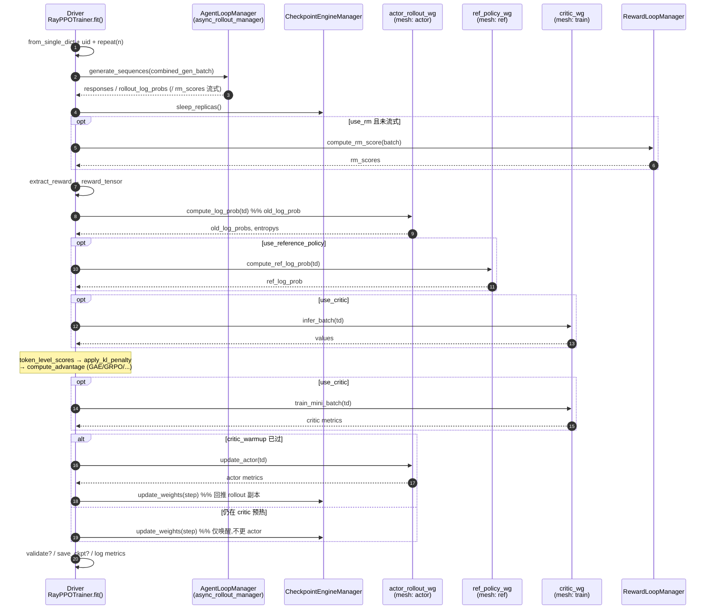

# verl 训练编排 —— RayPPOTrainer.fit() 的 RL 数据流主循环

> **代码基准**:verl `main` @ `8a694930`
> **最后更新**:2026-06-22 · **系列**:verl RLHF 框架源码级分析(见 [[verl/index]])
>
> 本文回答一个问题:**一条 prompt 从采样到把梯度回写进 actor,中间经过哪些角色、按什么顺序、每一步往 batch 里塞了什么字段?** 主角是单一驱动进程 `RayPPOTrainer`(`trainer/ppo/ray_trainer.py`),它通过 RPC 把重活派给各 worker group,自己只在 driver 上做"轻量"的 advantage / KL 计算。
>
> 行号约定:所有 `path.py:line` 均相对 verl **内层包根** `verl/`(即 `trainer/ppo/ray_trainer.py` 实际位于 `verl/verl/trainer/ppo/ray_trainer.py`)。

---

## 1. 功能范围与定位

`RayPPOTrainer` 是 **HybridFlow "single-controller" 模型的那个 controller**:它跑在一个 CPU/GPU 驱动节点上,持有数据集、采样器、各 worker group 的句柄,以及全局训练状态(`global_steps`)。它本身**不持有任何模型权重**——所有模型计算(rollout 采样、log-prob 重算、critic value、actor/critic 更新)都通过 Ray worker group 的远程方法分发出去,driver 只搬运 `DataProto` 并做 advantage / KL 这类标量级运算。

类的 docstring 把分工说得很清楚(`trainer/ppo/ray_trainer.py:1359`):

```python
def fit(self):
    """
    The training loop of PPO.
    The driver process only need to call the compute functions of the worker group through RPC
    to construct the PPO dataflow.
    The light-weight advantage computation is done on the driver process.
    """
```

它在三个层面与系列其它页耦合:

- **数据载体**:整条流水线传的都是 `DataProto`(driver 侧)/ `TensorDict`(下发 worker 时转换),见 [[verl_dataproto_analysis]]。
- **分发机制**:worker group 的 `spawn` / dispatch / colocate 由 single-controller 提供,见 [[verl_single_controller_analysis]]。
- **算法内核**:advantage / KL / loss 的具体数学在 `core_algos.py`,本页只记入口,细节见 [[verl_rl_algorithms_analysis]]。

> [!note] 版本定位:这是默认路径,但被标记为待废弃
> `RayPPOTrainer` 类带 `@deprecated` 装饰(`trainer/ppo/ray_trainer.py:285`),提示 "Legacy trainer ... 将在 v0.9.0 移除,请用 `trainer.use_v1=True`"。但配置默认 `trainer.use_v1: false`(`trainer/config/ppo_trainer.yaml:201`),`main_ppo.py:161` 的分支据此走向 `main_ppo_v0.py`,后者在 `trainer/main_ppo_v0.py:217` 实例化本类。也就是说:**本类目前仍是默认跑的 PPO 编排器**,V1(`TaskRunnerV1`)是并行存在的新实现。本页文档化的是 main @ `8a694930` 下这份事实主循环。

---

## 2. 角色、资源池与 worker 初始化

### 2.1 `Role` 枚举:逻辑角色

角色用一个枚举集中定义(`trainer/ppo/utils.py:27`),并带 `__str__` → 配置/字典里用的短名:

| `Role` 成员 | `str()` 短名 | 含义 |
|---|---|---|
| `Actor` / `Rollout` / `ActorRollout` | `actor` / `rollout` / `actor_rollout` | 策略训练 / 采样 / 二者合一 |
| `ActorRolloutRef` (=6) | `actor_rollout_ref` | actor+rollout+ref **三合一 colocate** |
| `Critic` (=3) | `critic` | 价值网络(仅 GAE/PPO) |
| `RefPolicy` (=4) | `ref` | 参考策略(KL 用) |
| `RewardModel` (=5) | `rm` | 奖励模型 |
| `TeacherModel` (=8) | `teacher` | 蒸馏教师 |

`Role` 字符串映射见 `trainer/ppo/utils.py:45-56`,反向 `from_string` 见 `:58`。哪些角色需要被启用由四个 `need_*` 判定函数从配置推出,`__init__` 缓存为布尔标志(`trainer/ppo/ray_trainer.py:343-348`):

- `use_reference_policy = need_reference_policy(config)` —— `use_kl_in_reward` 或 actor `use_kl_loss` 任一为真即需要 ref(`trainer/ppo/utils.py:75`)。
- `use_critic = need_critic(config)` —— 显式 `critic.enable`,否则 **仅当 `adv_estimator == GAE` 时才需要 critic**(`trainer/ppo/utils.py:96-107`);GRPO 等 critic-free 算法会关掉它。
- `use_rm = need_reward_model(config)`、`use_teacher_policy = need_teacher_policy(config)`。

另一个关键标志是 `ref_in_actor`(`trainer/ppo/ray_trainer.py:357-360`):当启用 LoRA 时,**参考策略 = 不挂 adapter 的 actor 本体**,无需单独的 ref worker group。

### 2.2 `ResourcePoolManager`:角色 → GPU 资源池

资源池由 `ResourcePoolManager` 管理(`single_controller/ray/base.py:185`),它持有两张表:`resource_pool_spec`(池名 → 每节点进程数列表)与 `mapping`(`Role` → 池名)。

- `create_resource_pool()`(`single_controller/ray/base.py:195`)把每个 spec 实例化成 `RayResourcePool`,FSDP 后端用 `max_colocate_count=3`(actor_critic_ref / rollout / 可选 reward 三类 WorkerGroup 共享同一组 GPU),Megatron 后端用 >1。
- `get_resource_pool(role)`(`:218`)= `resource_pool_dict[mapping[role]]`,这是"角色映射到物理 GPU"的唯一入口。
- `get_n_gpus()`(`:222`)汇总全集群 GPU 数,供吞吐指标用。
- `_check_resource_available()`(`:226`)在创建后校验集群可用 GPU/NPU ≥ 需求,不够直接抛错。

### 2.3 `init_workers()`:把角色变成活的 worker group

`init_workers()`(`trainer/ppo/ray_trainer.py:772`)是从"配置"到"可调用句柄"的关键一步,顺序如下:

1. **建池**:`resource_pool_manager.create_resource_pool()`(`:779`),并初始化 `resource_pool_to_cls`(池 → {角色串: 类描述})。
2. **登记 actor_rollout 类**:优先用 `ActorRolloutRef`(三合一),否则 `ActorRollout`(`:784`)。用 `RayClassWithInitArgs` 把"worker 类 + 初始化参数"打包(`:787`),挂到对应资源池下。`RayClassWithInitArgs`(`single_controller/ray/base.py:339`)只是延迟构造器:`__call__`(`:369`)在真正 `.remote()` 时才用 placement group 调度把 actor 拉起来。
3. **登记 critic**:仅当 `use_critic`(`:798`)。把 `critic` 配置转成统一的 `TrainingWorkerConfig`(`model_type="value_model"`,`:813`),走同一套 model-engine worker。
4. **登记 ref**:仅当 `use_reference_policy` 且映射里有独立 `RefPolicy`(`:826`)。
5. **创建 colocate WorkerGroup**:对每个资源池,把该池下登记的所有角色类用 `create_colocated_worker_cls(class_dict)`(`:861`)**合并成一个 `WorkerDict`**——它在一个 Ray actor 内实例化多个子 worker,并把各子 worker 的方法以 `{prefix}_{method}` 形式 monkey-patch 到外层(`single_controller/ray/base.py:1008-1025`)。这正是 actor+rollout+ref 能**共享同一块 GPU 显存**的底层机制(见 [[verl_single_controller_analysis]])。随后 `wg_dict.spawn(prefix_set=...)`(`:867`)把合并 group 拆回按角色寻址的句柄字典 `all_wg`。
6. **取句柄并初始化模型**:`critic_wg`(`:871`,`reset()` + `set_loss_fn(value_loss)`)、`ref_policy_wg`(`:881`,`init_model()`)、最后才 `actor_rollout_wg.init_model()`(`:891-892`)——注释说明 rollout 放最后是为了让 vLLM 更准地估算 KV cache 显存。若 `ref_in_actor`,`ref_policy_wg = actor_rollout_wg`(`:895`)。
7. **挂上 RL-system 级管理器**:`RewardLoopManager`(`:904`,流式奖励)、`LLMServerManager`(`:939`,rollout 推理服务)、`AgentLoopManager`(`:948`,异步多轮采样,`self.async_rollout_manager`)、`CheckpointEngineManager`(`:962`,`self.checkpoint_manager`,负责权重 sleep/wake 与同步)。最后 `checkpoint_manager.sleep_replicas()`(`:969`)让 rollout 副本先睡下,等加载 checkpoint。

---

## 3. `fit()` 主循环逐步追踪

### 3.0 进入循环前

`fit()`(`trainer/ppo/ray_trainer.py:1359`)开场:建 `Tracking` logger(`:1373`)→ `global_steps=0` → `_load_checkpoint()`(`:1383`)→ **`checkpoint_manager.update_weights(0)`**(`:1384`,把训练侧权重同步进 rollout 副本并唤醒)→ `SkipManager.init`。若 `val_before_train`(默认真,`:1392`)先跑一次 `_validate()`,`val_only` 时直接返回。然后 `global_steps += 1`,从 step 1 开始(`:1405`)。

外层 `for epoch`(`:1419`)× 内层 `for batch_dict in self.train_dataloader`(`:1420`)。注意 train dataloader 的 `batch_size` 取 `gen_batch_size`(回退 `train_batch_size`,`:407`),是 prompt 级批大小。

### 3.1 批准备与 `gen_batch` 抽取

```python
batch: DataProto = DataProto.from_single_dict(batch_dict)            # :1432
batch.non_tensor_batch["uid"] = np.array([str(uuid4()) ...])         # :1436  每条 prompt 一个组 id
gen_batch = self._get_gen_batch(batch)                                # :1440
gen_batch_output = gen_batch.repeat(repeat_times=rollout_n, ...)      # :1445  每 prompt 采 n 条
```

`_get_gen_batch`(`:572`)只保留生成必需的键(prompt 张量 + `data_source/reward_model/extra_info/uid` 这几个奖励要用的 non-tensor),其余统统 pop 掉,避免把训练侧大字段送进采样请求。`uid` 是后续 **GRPO/RLOO 组内归一**的分组依据,务必在 repeat 之前打上。

`REMAX` 是特例(`:1447-1459`):它把 `n` 条采样 + 1 条 greedy baseline 拼成一个请求(`combined_gen_batch`),避免副本睡眠后再发第二次请求。其余算法 `combined_gen_batch = gen_batch_output`。

### 3.2 generate_sequences(rollout 采样)

```python
with marked_timer("gen", timing_raw, color="red"):                   # :1464
    combined_gen_output = self.async_rollout_manager.generate_sequences(combined_gen_batch)  # :1467
    self.checkpoint_manager.sleep_replicas()                          # :1468 采样完即让 rollout 让出显存
```

采样**不走 worker-group 的 dispatch**,而是经 `AgentLoopManager`(`self.async_rollout_manager`)异步执行多轮 agent loop;若奖励是流式计算的,`rm_scores` 在这一步就已经在输出里了。产物切回(`:1475`,REMAX 还要切出 baseline 算 `reward_baselines`,`:1488-1489`)。然后:

```python
batch = batch.repeat(repeat_times=rollout.n, interleave=True)         # :1494  prompt 侧也复制 n 份对齐
batch = batch.union(gen_batch_output)                                 # :1495  把 responses/log_probs 并回
batch.batch["response_mask"] = compute_response_mask(batch)           # :1497  取 attention_mask 的 response 段
```

`compute_response_mask`(`:120`)= `attention_mask[:, -response_length:]`,后面所有 mask 计算都基于它。

### 3.3 batch balancing(可选)

若 `trainer.balance_batch`(`:1503`),调 `_balance_batch`(`:1145`),详见 §4。

### 3.4 reward 抽取 + 可选 colocate RM

```python
with marked_timer("reward", timing_raw, color="yellow"):             # :1515
    if self.use_rm and "rm_scores" not in batch.batch.keys():        # :1517
        batch_reward = self._compute_reward_colocate(batch)          # :1518 -> reward_loop_manager.compute_rm_score
        batch = batch.union(batch_reward)
    reward_tensor, reward_extra_infos_dict = extract_reward(batch)    # :1522
```

`_compute_reward_colocate`(`:588`)走 `RewardLoopManager.compute_rm_score`(colocate 奖励模型需借显存,故先前已 `sleep_replicas`)。`extract_reward`(`reward.py:160`)只是从 batch 里取出 `rm_scores` 和 `reward_extra_keys` 指定的附加列——**真正打分逻辑在 reward manager / reward loop 里**(`reward.py:111` `load_reward_manager`),此处只是搬运。注意:此时拿到的是 **token-level scores 张量**,还没变成训练用的 `token_level_rewards`。

### 3.5 重算 old_log_prob(actor)

非 bypass 模式下(`:1538`):

```python
with marked_timer("old_log_prob", timing_raw, color="blue"):
    old_log_prob, old_log_prob_mfu = self._compute_old_log_prob(batch)  # :1540
    ...
    batch = batch.union(old_log_prob)                                    # :1564
```

`_compute_old_log_prob`(`:1253`)把 `DataProto → TensorDict`、左右 padding 转无 padding(`left_right_2_no_padding`)、塞 meta(`calculate_entropy=True`),然后 **`self.actor_rollout_wg.compute_log_prob(batch_td)`**(`:1267`)。回来 `old_log_probs`、`entropys`(可选 `sum_pi_squared` / `routed_experts`)并回 batch。bypass 模式(`rollout_correction.bypass_mode`)则直接令 `old_log_probs = rollout_log_probs`(`:1530-1537`),省掉这次前向。entropy 用 `agg_loss`(`core_algos.py:1138`)聚合后入 metrics。

### 3.6 ref_log_prob(reference)

```python
if self.use_reference_policy:                                         # :1573
    with marked_timer(str(Role.RefPolicy), ...):                     # timer 名 "ref"
        ref_log_prob = self._compute_ref_log_prob(batch)             # :1576
        batch = batch.union(ref_log_prob)
```

`_compute_ref_log_prob`(`:1229`):若 `ref_in_actor` 走 `actor_rollout_wg.compute_log_prob`(带 `no_lora_adapter=True`,即关掉 LoRA 用基座当 ref),否则走 `ref_policy_wg.compute_ref_log_prob`(`:1240-1242`)。产出 `ref_log_prob`。

### 3.7 compute_values(critic,仅 PPO/GAE)

```python
if self.use_critic:                                                  # :1580
    with marked_timer("values", ...):
        values = self._compute_values(batch)                         # :1582
        batch = batch.union(values)
```

`_compute_values`(`:1215`)走 **`critic_wg.infer_batch(batch_td)`**(`:1221`,`compute_loss=False`),产出 `values`。GRPO 等无 critic 算法跳过整段。

### 3.8 reward 整形 + KL penalty + compute_advantage(driver 侧)

这是 driver 上唯一的"算法计算"区(`:1585` 起的 `adv` timer):

```python
batch.batch["token_level_scores"] = reward_tensor                    # :1588
if self.config.algorithm.use_kl_in_reward:                           # :1594
    batch, kl_metrics = apply_kl_penalty(batch, self.kl_ctrl_in_reward, ...)
else:
    batch.batch["token_level_rewards"] = batch.batch["token_level_scores"]  # :1600
...
batch = compute_advantage(batch, adv_estimator=..., gamma=..., lam=..., config=...)  # :1622
```

**KL penalty**(`apply_kl_penalty`,`:78`):逐 token 把参考散度从奖励里扣掉,

$$ r^{\text{token}}_t = s^{\text{token}}_t \;-\; \beta \cdot \mathrm{KL}\!\left(\pi_{\theta_{\text{old}}}(\cdot|s_t)\,\Vert\,\pi_{\text{ref}}(\cdot|s_t)\right) $$

其中 KL 由 `core_algos.kl_penalty(old_log_probs, ref_log_prob, kl_penalty)`(`core_algos.py:2126`)逐 token 算并乘 `response_mask`,`β` 来自自适应控制器 `AdaptiveKLController`(`core_algos.py:153`,`get_kl_controller` `:193`),并按本步 batch 大小 `kl_ctrl.update`(`:112`)。结果写入 `token_level_rewards`(`:113`)。

**compute_advantage**(`:187`)是 advantage 估计的总调度,按 `adv_estimator` 分三支:

- **GAE**(`:218`)→ `core_algos.compute_gae_advantage_return`(`core_algos.py:216`),需要 `values`。逐 token 反向递推:

$$ \delta_t = r_t + \gamma V(s_{t+1}) - V(s_t), \qquad \hat A_t = \delta_t + \gamma\lambda\,\hat A_{t+1}, \qquad R_t = \hat A_t + V(s_t) $$

advantage 末了再做 `masked_whiten` 标准化(`core_algos.py:262`)。

- **GRPO**(`:235`)→ `compute_grpo_outcome_advantage`(`core_algos.py:268`),**无 critic**,用同 `uid` 组内的结果奖励做基线:

$$ \hat A_i = \frac{R_i - \operatorname{mean}_{g(i)}(R)}{\operatorname{std}_{g(i)}(R) + \varepsilon} \quad(\text{广播到该回复全部 token});\quad R = \hat A $$

(`norm_adv_by_std_in_grpo=False` 时只减均值不除标准差。)

- **其它**(`:248`)→ `get_adv_estimator_fn(adv_estimator)`(`core_algos.py:137`)从注册表取函数,REINFORCE++/RLOO/REMAX/OPO/GDPO/optimal-token-baseline 等都走这支,按需补 `uid`/`reward_baselines`/`sum_pi_squared` 等 kwargs(`:256-276`)。

`AdvantageEstimator` 全量枚举见 `core_algos.py:88-110`。具体每种算法的推导属于 [[verl_rl_algorithms_analysis]],本页不展开。

产物:`batch["advantages"]`、`batch["returns"]`。

### 3.9 update_critic → update_actor

```python
if self.use_critic:                                                  # :1633
    with marked_timer("update_critic", ...):
        critic_output = self._update_critic(batch)                   # :1635
...
if self.config.trainer.critic_warmup > self.global_steps:            # :1640 critic 预热期
    self.checkpoint_manager.update_weights(self.global_steps)        # 只同步权重唤醒 rollout,不更 actor
else:
    with marked_timer("update_actor", ...):
        actor_output = self._update_actor(batch)                     # :1646
    ... 保存 checkpoint(条件满足时,:1660)...
    with marked_timer("update_weights", ...):
        self.checkpoint_manager.update_weights(self.global_steps)    # :1672 训练权重 -> rollout 副本
```

**顺序要点**:critic **先于** actor 更新(用同一份 advantage/returns),这样 actor 更新时 critic 已经吸收了本步信息;且有 `critic_warmup` 阶段只训 critic、不动 actor。

- `_update_critic`(`:1332`)→ **`critic_wg.train_mini_batch(batch_td)`**(`:1350`),内部按 `ppo_mini_batch_size × rollout.n` 切 mini-batch、跑 `ppo_epochs`(`:1336-1348`)。
- `_update_actor`(`:1290`)→ **`actor_rollout_wg.update_actor(batch_td)`**(`:1323`),meta 里塞 `temperature/multi_turn` 与 mini-batch/epoch 配置(`:1307-1322`)。两者都只返回 `metrics`(无新 batch 字段),经 `reduce_metrics` 并入日志(`:1636`、`:1674`)。

更新完调 `checkpoint_manager.update_weights`(`:1672`)把新权重推回 rollout 副本——**这就是"训练-采样权重同步"的发生点**,resharding 细节见 [[verl_rollout_resharding_analysis]]。

### 3.10 验证、保存、指标、收尾

- **validation**:`test_freq>0` 且到点/末步时跑 `_validate()`(`:1683-1690`)。`_validate`(`:596`)对验证集 repeat `val_kwargs.n`、`generate_sequences`、(可选)colocate RM 打分、`extract_reward`,再经 `process_validation_metrics` 算 `val-core/*`、`val-aux/*`(`:721` `_val_metrics_update`)。
- **checkpoint**:`save_freq>0` 且(末步 / 整除 / ESI 临期)时 `_save_checkpoint()`(`:1660-1668`,actor+critic+dataloader 状态)。
- **metrics**:`compute_data_metrics` / `compute_timing_metrics` / `compute_throughout_metrics`(用 `resource_pool_manager.get_n_gpus()`)/ `compute_variance_proxy_metrics` / spec-decode 指标,统一 `logger.log`(`:1717-1747`)。
- **收尾**:`progress_bar.update`、`global_steps += 1`、`SkipManager.set_step`;`is_last_step` 时 `_shutdown_dump_executor` 并 `return`(`:1749-1759`)。

### 3.11 实际步序总结(本基准下的真实顺序)

```
gen(采样) → sleep_replicas → reward 抽取(+colocate RM) → old_log_prob(actor)
  → ref_log_prob(ref) → values(critic) → [token_level_scores → KL penalty → compute_advantage]
  → update_critic → update_actor → save_ckpt? → update_weights(回推 rollout)
  → validate? → metrics/log
```

注意两个容易记反的点:**reward 在 old_log_prob 之前抽取,但 advantage 在三者(old/ref/values)之后才算**;**critic 更新先于 actor 更新**。

---

## 4. batch 均衡与 micro-batch 旋钮

`_balance_batch`(`trainer/ppo/ray_trainer.py:1145`)解决的是"各 DP rank token 数不均 → 长尾 rank 拖慢一步"。它:

1. 取每条序列有效 token 数 `attention_mask.sum(-1)`,转成 workload(`calculate_workload`,`:1153-1154`)。
2. 用 `_get_dp_size(actor_rollout_wg, "actor")`(`:1125`)从 dispatch 信息拿**真实 DP 大小**(剔除 TP/PP 维)。
3. `get_seqlen_balanced_partitions(..., equal_size=True)`(`:1198`)做等卡均分;`use_prefix_grouper` 时改用 group 级均衡保证同 `uid` 落同 rank(`:1160-1182`);`keep_minibatch` 时在 mini-batch 内部均衡(`:1184-1196`)。
4. 把小 micro-batch 摆到两端以压 PP 气泡(`:1199-1205`),最后 `batch.reorder(global_idx)`(`:1209`)。

> [!warning] 重排只改物理顺序,不改 advantage
> 注释明确(`:1499-1502`):reorder 改变数据顺序,但 advantage 基于 `uid` 分组算,不受影响;只可能因 mini-batch 重新组合而影响 loss。

micro/mini-batch 旋钮散落在更新函数里:actor 用 `actor.ppo_mini_batch_size × rollout.n`、`ppo_epochs`、`data_loader_seed`、`shuffle`(`:1307-1322`);critic 同构(`:1336-1348`)。dynamic batch / token-len 上限等吞吐侧细节见 [[verl_optimization_analysis]] 与 [[verl_workers_engine_analysis]]。

---

## 5. 一步训练的时序图(driver × 各 worker group)



---

## 6. fit() 阶段 → worker 方法 → dispatch 模式 → batch 新增字段

| fit() 阶段(行号) | 调用方法 | 承载组件 / dispatch 模式 | 写回 batch 的字段 |
|---|---|---|---|
| 采样 `gen`(`:1467`) | `generate_sequences` | `AgentLoopManager`(异步 agent loop,**非 WG dispatch**) | `responses`,`prompts`,`input_ids`,`attention_mask`,`rollout_log_probs`,(流式)`rm_scores` |
| colocate 奖励(`:1518`) | `compute_rm_score` | `RewardLoopManager`(仅 `use_rm` 且未流式) | `rm_scores` |
| 奖励抽取(`:1522`) | `extract_reward`(`reward.py:160`) | driver 本地 | (取出 `rm_scores` → `reward_tensor`) |
| `old_log_prob`(`:1267`) | `compute_log_prob` | `actor_rollout_wg`,`make_nd_compute_dataproto_dispatch_fn(mesh="actor")`(`workers/engine_workers.py:644`) | `old_log_probs`,`entropys`,(可选)`sum_pi_squared` / `routed_experts` |
| `ref_log_prob`(`:1242`) | `compute_ref_log_prob` | `ref_policy_wg`,mesh=`ref`(`engine_workers.py:637`);`ref_in_actor` 时走 actor `compute_log_prob` | `ref_log_prob` |
| `values`(`:1221`) | `infer_batch` | `critic_wg`,mesh=`train`,blocking=False(`engine_workers.py:379`) | `values` |
| KL penalty(`:1595`) | `apply_kl_penalty`(`:78`) | driver 本地 | `token_level_rewards`(由 `token_level_scores` 扣 KL) |
| advantage(`:1622`) | `compute_advantage`(`:187`) | driver 本地 → `core_algos` | `advantages`,`returns` |
| `update_critic`(`:1350`) | `train_mini_batch` | `critic_wg`,mesh=`train`,blocking=False(`engine_workers.py:233`) | (仅 metrics) |
| `update_actor`(`:1323`) | `update_actor` | `actor_rollout_wg`,mesh=`actor`(`engine_workers.py:652`) | (仅 metrics) |
| 权重同步(`:1672`) | `update_weights` | `CheckpointEngineManager` → `Dispatch.ONE_TO_ALL`,blocking=False(`engine_workers.py:669`) | (无,推权重到 rollout 副本) |

> dispatch 模式定义见 `single_controller/base/decorator.py`:`Dispatch` 枚举(`:26`)、`make_nd_compute_dataproto_dispatch_fn`(`:300`)。`mesh="actor"/"ref"/"train"` 决定 driver 侧 `DataProto` 如何切片下发到各 DP rank、再如何 gather 回来,机制见 [[verl_single_controller_analysis]]。

---

## Related Pages

- [[verl/index]] —— verl 系列总入口
- [[verl_architecture_overview_analysis]] —— HybridFlow / single-controller 架构总览,本页是其"主循环"具体化
- [[verl_single_controller_analysis]] —— worker group、`spawn`、colocate、dispatch(`make_nd_compute_dataproto_dispatch_fn`)机制
- [[verl_dataproto_analysis]] —— `DataProto` / `TensorDict` 数据载体,本页所有 `union/repeat/pop` 的语义
- [[verl_workers_engine_analysis]] —— `compute_log_prob` / `update_actor` / `infer_batch` / `train_mini_batch` 在 worker 侧的执行
- [[verl_rollout_resharding_analysis]] —— `generate_sequences` 与 `update_weights` 背后的采样/权重 resharding
- [[verl_rl_algorithms_analysis]] —— GAE / GRPO / REINFORCE++ 等 advantage 与 KL 的数学细节(`core_algos.py`)
- [[verl_optimization_analysis]] —— batch balancing、dynamic batch、micro-batch 等吞吐优化
- [[verl_quickstart_guide]] —— 跑起来一个 PPO/GRPO 任务的最短路径
