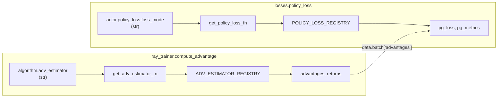

# verl RL 算法 —— 优势估计与策略损失全家桶(core_algos)

> **代码基准**:verl `main` @ `8a694930`
> **最后更新**:2026-06-22 · **系列**:verl RLHF 框架源码级分析(见 [[verl/index]])
>
> 本文剖析 `verl/trainer/ppo/core_algos.py` 这个"算法库"——它把 14 种优势估计器与 11 种策略损失收进两张注册表,靠 `algorithm.adv_estimator` 与 `actor.policy_loss.loss_mode` 两个字符串字段在运行时选型。重点回答:**优势怎么算?损失各家相对 vanilla PPO 改了什么?KL 在哪两处生效?**
>
> 行号约定:除特别标注外,所有 `file:line` 均指 `verl/trainer/ppo/core_algos.py`。

---

## 1. 功能范围与定位

`core_algos.py` 是纯函数算法库,**不持有任何分布式状态**,被两条主调用链消费:

- **优势估计**:trainer 侧 `compute_advantage`(`verl/trainer/ppo/ray_trainer.py:187`)在 rollout + 打分之后调用,把 `token_level_rewards` 折算为 `advantages` / `returns`,写回 `DataProto.batch`。见 [[verl_ray_trainer_analysis]]。
- **策略损失**:actor 侧 `verl/workers/utils/losses.py:103` 通过 `get_policy_loss_fn(loss_mode)` 拿到损失函数,在 `update_actor` 的每个 micro-batch 上算 `pg_loss` 并反传。损失执行的引擎细节见 [[verl_workers_engine_analysis]]。

设计哲学是**注册表 + 字符串选型**:新增算法只需写一个函数挂上装饰器,无需改 trainer/actor 任何分支。文件头 `__all__` 只导出 `register_adv_est` / `get_adv_estimator_fn` / `AdvantageEstimator`(`core_algos.py:21`),策略损失侧的注册 API 则不在 `__all__` 内,但同样对外可用。



---

## 2. 两张注册表与选型机制

### 2.1 优势估计注册表

`AdvantageEstimator` 是一个 `str` 枚举(`core_algos.py:88`),列举 14 个合法名字;`ADV_ESTIMATOR_REGISTRY` 是 `name → fn` 字典(`core_algos.py:113`)。装饰器 `register_adv_est`(`core_algos.py:116`)把枚举/字符串解析为 key 后登记,**重复注册不同函数会直接报错**(`core_algos.py:127`),避免静默覆盖:

```python
# core_algos.py:125
def decorator(fn):
    name = name_or_enum.value if isinstance(name_or_enum, Enum) else name_or_enum
    if name in ADV_ESTIMATOR_REGISTRY and ADV_ESTIMATOR_REGISTRY[name] != fn:
        raise ValueError(f"Adv estimator {name} has already been registered: ...")
    ADV_ESTIMATOR_REGISTRY[name] = fn
    return fn
```

枚举文档明确指出:它**创建后不可变**,自定义估计器不必扩展枚举,直接用字符串名 `register_adv_est("my_est")` 即可(`core_algos.py:91`)。`get_adv_estimator_fn`(`core_algos.py:137`)做反向查表,未命中即 `ValueError`。

| `adv_estimator` 取值 | 函数 | 行号 | 需要的额外输入 |
|---|---|---|---|
| `gae` | `compute_gae_advantage_return` | 216 | `values`(critic) |
| `grpo` | `compute_grpo_outcome_advantage` | 268 | `index`(uid 分组) |
| `grpo_vectorized` | `compute_grpo_vectorized_outcome_advantage` | 335 | `index` |
| `gdpo` | `compute_gdpo_outcome_advantage` | 362 | `non_tensor_batch` 多维奖励 |
| `grpo_passk` | `compute_grpo_passk_outcome_advantage` | 472 | `index` |
| `reinforce_plus_plus_baseline` | `compute_reinforce_plus_plus_baseline_outcome_advantage` | 536 | `index` |
| `rloo` | `compute_rloo_outcome_advantage` | 588 | `index` |
| `opo` | `compute_opo_outcome_advantage` | 640 | `index` |
| `reinforce_plus_plus` | `compute_reinforce_plus_plus_outcome_advantage` | 694 | `config.gamma` |
| `remax` | `compute_remax_outcome_advantage` | 733 | `reward_baselines`(贪心基线) |
| `gpg` | `compute_gpg_outcome_advantage` | 769 | `index` |
| `rloo_vectorized` | `compute_rloo_vectorized_outcome_advantage` | 832 | `index` |
| `optimal_token_baseline` | `compute_optimal_token_baseline_advantage` | 870 | `sum_pi_squared`、`old_log_probs` |
| `tir_optimal_token_baseline` | `compute_multi_turn_optimal_token_baseline_advantage` | 989 | 同上(多轮 TIR) |

`compute_advantage` 对 GAE / GRPO 有专门分支(`ray_trainer.py:218/235`),其余统一走 `get_adv_estimator_fn` 通用分发(`ray_trainer.py:250`),按需补 `index`(uid)、`reward_baselines`、GDPO 的多维奖励、OTB 的 `sum_pi_squared` 等 kwargs(`ray_trainer.py:256-276`)。

### 2.2 策略损失注册表

对称地,`POLICY_LOSS_REGISTRY`(`core_algos.py:50`)+ `register_policy_loss`(`core_algos.py:53`)+ `get_policy_loss_fn`(`core_algos.py:70`)。所有损失共享 `PolicyLossFn` 签名(`core_algos.py:37`):入参 `(old_log_prob, log_prob, advantages, response_mask, loss_agg_mode, config, rollout_is_weights)`,出参 `(pg_loss, metrics_dict)`。

| `loss_mode` 取值 | 函数 | 行号 | 一句话 |
|---|---|---|---|
| `vanilla` | `compute_policy_loss_vanilla` | 1279 | 标准 PPO clip + dual-clip |
| `dppo_tv` | `compute_policy_loss_dppo_tv` | 1373 | 全变差散度阈值掩码 + 截断 IS |
| `dppo_kl` | `compute_policy_loss_dppo_kl` | 1454 | 二值 KL 阈值掩码 + 截断 IS |
| `gspo` | `compute_policy_loss_gspo` | 1539 | 序列级重要性比 |
| `sapo` | `compute_policy_loss_sapo` | 1615 | sigmoid 门控平滑,无 clip |
| `gpg` | `compute_policy_loss_gpg` | 1700 | 纯 $-\log\pi\cdot A$ |
| `clip_cov` | `compute_policy_loss_clip_cov` | 1736 | 按协方差挑 token 置零梯度 |
| `kl_cov` | `compute_policy_loss_kl_cov` | 1841 | 按协方差挑 token 加 KL 罚 |
| `geo_mean` | `compute_policy_loss_geo_mean` | 1921 | GMPO 几何平均序列比 |
| `cispo` | `compute_policy_loss_cispo` | 2007 | stop-grad 裁剪 IS 权重 |
| `bypass_mode` | `compute_policy_loss_bypass_mode` | 2352 | rollout 校正调度入口 |

> [!note] `reinforce` 不在注册表里
> `compute_policy_loss_reinforce`(`core_algos.py:2271`)**没有** `@register_policy_loss` 装饰器——它是 `bypass_mode` 内部的辅助函数,通过 `rollout_correction.loss_type="reinforce"` 间接选用(`core_algos.py:2455`),不能直接当 `loss_mode` 用。另:行 1202 的 `compute_policy_loss` 是 `@deprecated` 标注的旧版独立函数(`core_algos.py:1202`),已被 `vanilla` 取代,仅留作兼容。

---

## 3. 优势估计器(数学 + 代码)

### 3.1 GAE —— 唯一需要 critic 的估计器

`compute_gae_advantage_return`(`core_algos.py:216`)。逐时间步逆序递推 TD 误差与 GAE:

$$
\delta_t = r_t + \gamma V_{t+1} - V_t,\qquad
A_t^{\text{GAE}} = \delta_t + \gamma\lambda\, A_{t+1}^{\text{GAE}},\qquad
R_t = A_t + V_t
$$

```python
# core_algos.py:250
for t in reversed(range(gen_len)):
    delta = token_level_rewards[:, t] + gamma * nextvalues - values[:, t]
    lastgaelam_ = delta + gamma * lam * lastgaelam
    # 观测 token 上跳过 value 与 TD-error
    nextvalues = values[:, t] * response_mask[:, t] + (1 - response_mask[:, t]) * nextvalues
    lastgaelam = lastgaelam_ * response_mask[:, t] + (1 - response_mask[:, t]) * lastgaelam
```

末尾对 advantages 做 `masked_whiten`(`core_algos.py:262`)标准化。这是全家桶里**唯一**用到 critic `values` 的估计器,其余皆为 outcome-only / group-based,无需价值网络。

### 3.2 GRPO —— 组内归一化

`compute_grpo_outcome_advantage`(`core_algos.py:268`)。同一 prompt 采样 $G$ 条回答构成一组(按 `index`=uid 分组),整条回答的标量奖励 $r_i=\sum_t r_{i,t}$ 用组均值/标准差归一,再广播回每个 token:

$$
A_i = \frac{r_i - \operatorname{mean}(\{r\}_g)}{\operatorname{std}(\{r\}_g) + \epsilon}
$$

```python
# core_algos.py:324
for i in range(bsz):
    if norm_adv_by_std_in_grpo:
        scores[i] = (scores[i] - id2mean[index[i]]) / (id2std[index[i]] + epsilon)
    else:
        scores[i] = scores[i] - id2mean[index[i]]
scores = scores.unsqueeze(-1) * response_mask
```

`norm_adv_by_std_in_grpo=False` 时退化为只减均值不除标准差,即 **Dr.GRPO**(`core_algos.py:296`,arXiv 2503.20783)。`grpo_vectorized`(`core_algos.py:335`)是等价的张量化实现,用 `group_mean_std` 一次算完所有组,避免 Python 逐样本循环。

### 3.3 GDPO —— 多维奖励解耦归一化

`compute_gdpo_outcome_advantage`(`core_algos.py:362`)。GRPO 先把各奖励分量加和再归一,会让强信号淹没弱信号;GDPO 对**每个奖励维度先各自做 GRPO 归一**,再加权求和,最后整 batch `masked_whiten`:

$$
A_k = \frac{r_k-\mu_g(r_k)}{\sigma_g(r_k)+\epsilon},\quad
A_{\text{sum}}=\sum_k w_k A_k,\quad
A_{\text{final}}=\text{whiten}(A_{\text{sum}})
$$

奖励分量从 `algorithm.gdpo_reward_keys` 指定的 `non_tensor_batch` 字段取(`core_algos.py:413`),权重 `gdpo_reward_weights`(`core_algos.py:435`)。内部对每维复用 `compute_grpo_outcome_advantage`(`core_algos.py:452`)。

### 3.4 GRPO-Pass@k —— 只奖励组内最优

`compute_grpo_passk_outcome_advantage`(`core_algos.py:472`)。组内只有最优样本拿到非零优势 $r_{\max}-r_{\text{2nd}}$,其余为零(arXiv 2503.19595):

$$
A_{i^\star} = \frac{r_{\max} - r_{\text{2nd-max}}}{\sigma_g+\epsilon},\quad A_{j\ne i^\star}=0
$$

```python
# core_algos.py:520
topk, topk_idx = torch.topk(rewards, 2)
r_max, r_second_max = topk[0], topk[1]
advantage = r_max - r_second_max
```

### 3.5 RLOO / OPO —— 留一法基线

`compute_rloo_outcome_advantage`(`core_algos.py:588`,arXiv 2402.14740)用留一法:对每条回答,基线是**组内其余回答**的均值,实现上等价于按 $\frac{n}{n-1}$ 缩放后减去组均值:

$$
A_i = r_i - \frac{1}{n-1}\sum_{j\ne i} r_j = \frac{n}{n-1}\big(r_i - \bar r_g\big)
$$

```python
# core_algos.py:628
response_num = len(id2score[index[i]])
if response_num > 1:
    scores[i] = scores[i] * response_num / (response_num - 1) \
              - id2mean[index[i]] * response_num / (response_num - 1)
```

`rloo_vectorized`(`core_algos.py:832`)用 `bincount` 张量化等价实现。**OPO**(`compute_opo_outcome_advantage`,`core_algos.py:640`,arXiv 2505.23585)则把基线换成**按回答长度加权**的均值:$b_g=\frac{\sum_i \ell_i r_i}{\sum_i \ell_i}$,$A_i=r_i-b_g$(`core_algos.py:683`)。

### 3.6 REINFORCE++ 系列

- `compute_reinforce_plus_plus_outcome_advantage`(`core_algos.py:694`,arXiv 2501.03262):带折扣的逆序 return $G_t=r_t+\gamma G_{t+1}$,EOS 后 reset,再全 batch `masked_whiten`(`core_algos.py:716-727`)。用到 `config.gamma`。
- `compute_reinforce_plus_plus_baseline_outcome_advantage`(`core_algos.py:536`):先减组均值,再 `masked_whiten`(`core_algos.py:581`)。

### 3.7 ReMax / GPG / OTB

- **ReMax**(`core_algos.py:733`,arXiv 2310.10505):reward-to-go 减去贪心解码基线 `reward_baselines`(`core_algos.py:762`),$A_t=G_t - b^{\text{greedy}}$。是少数需要额外 `reward_baselines` 输入的估计器。
- **GPG**(`core_algos.py:769`):组内减均值后再乘一个**非零样本占比**系数 $\alpha=\text{bsz}/\#\{r\ne 0\}$ 校正(`core_algos.py:808`),$A_i=\alpha(r_i-\mu_g)/f_{\text{norm}}$。
- **OTB / TIR-OTB**(`core_algos.py:870` / `989`):Optimal Token Baseline,逐时间步用累积路径方差 $W_t=\sum_{j\le t}\lVert s_j\rVert^2$($\lVert s_j\rVert^2=1-2\pi_j+\sum\pi^2$)做加权基线 $B_t^\star=\frac{\sum G_t W_t}{\sum W_t}$。需要 actor 提供 `sum_pi_squared`(`actor.calculate_sum_pi_squared=True`),并可用 `rollout_is_weights` 做 IS 修正(`core_algos.py:929`)。TIR 版按多轮工具调用展平后再算。

---

## 4. 策略损失(数学 + 代码)

所有损失末尾都调用 `agg_loss`(`core_algos.py:1138`)把 `(bs, resp_len)` 损失矩阵聚合成标量,支持 4 种 `loss_agg_mode`:`token-mean`、`seq-mean-token-sum`、`seq-mean-token-sum-norm`、`seq-mean-token-mean`(`core_algos.py:1168-1197`)。`agg_loss` 用 `dp_size`/`global_batch_size`/`batch_num_tokens` 做跨 DP 归一,保证损失对 FSDP/Megatron 并行度不变。

### 4.1 vanilla —— 标准 PPO clip + dual-clip

`compute_policy_loss_vanilla`(`core_algos.py:1279`)。记比值 $r_t=\exp(\log\pi_\theta-\log\pi_{\text{old}})$。标准 PPO 双侧裁剪取悲观上界:

$$
L^{\text{clip}}_t=\max\big(-A_t r_t,\ -A_t\,\text{clip}(r_t,1-\epsilon_{\text{low}},1+\epsilon_{\text{high}})\big)
$$

dual-clip 仅在 $A_t<0$ 时再加一道下界 $-A_t\cdot c$($c=$`clip_ratio_c`>1),防止负优势 token 的比值爆炸:

```python
# core_algos.py:1340
pg_losses2 = -advantages * torch.clamp(ratio, 1 - cliprange_low, 1 + cliprange_high)
clip_pg_losses1 = torch.maximum(pg_losses1, pg_losses2)
pg_losses3 = -advantages * clip_ratio_c
clip_pg_losses2 = torch.min(pg_losses3, clip_pg_losses1)
pg_losses = torch.where(advantages < 0, clip_pg_losses2, clip_pg_losses1)  # core_algos.py:1354
```

`negative_approx_kl` 先 clamp 到 $[-20,20]$ 防溢出(`core_algos.py:1331`)。clip 上下限分离(`clip_ratio_low`/`clip_ratio_high`)正是 **DAPO 的 clip-higher** 技巧的载体。

### 4.2 GSPO —— 序列级重要性比

`compute_policy_loss_gspo`(`core_algos.py:1539`,arXiv 2507.18071)。把 token 级比值换成**长度归一的序列级比值**,再以"序列比的 stop-grad × 当前 token 概率"组合,从而梯度仍流经每个 token:

$$
s_i(\theta)=\Big(\tfrac{\pi_\theta(y_i|x)}{\pi_{\text{old}}(y_i|x)}\Big)^{1/|y_i|}
=\exp\!\Big(\tfrac{1}{|y_i|}\sum_t (\log\pi_\theta-\log\pi_{\text{old}})\Big)
$$

```python
# core_algos.py:1576
seq_lengths = torch.sum(response_mask, dim=-1).clamp(min=1)
negative_approx_kl_seq = torch.sum(negative_approx_kl * response_mask, dim=-1) / seq_lengths
log_seq_importance_ratio = log_prob - log_prob.detach() + negative_approx_kl_seq.detach().unsqueeze(-1)
```

强制 `seq-mean-token-mean` 聚合(`core_algos.py:1598`)。相对 vanilla:**把方差源从 token 级搬到序列级**,对长序列更稳。

### 4.3 GMPO(geo_mean)—— 几何平均

`compute_policy_loss_geo_mean`(`core_algos.py:1921`,arXiv 2507.20673)。对 token 比值取**几何平均**(对数域求均值再 exp),并对 $\text{sgn}(A)\cdot\Delta\log p$ 做裁剪:

$$
r^{\text{geo}}_i=\exp\!\Big(\tfrac{1}{|y_i|}\sum_t \text{clip}_{\text{sgn}}(\log\pi_\theta-\log\pi_{\text{old}})\Big),\quad
L_i=-\bar A_i\, r^{\text{geo}}_i
$$

> [!note] 不走 `agg_loss`
> 几何平均损失末尾直接 `pg_loss = torch.mean(pg_losses)`(`core_algos.py:1992`),是全家桶里唯一**不经过 `agg_loss`** 的损失,因此对并行度不变性的保证与其余不同。

### 4.4 CISPO —— stop-grad 裁剪 IS 权重

`compute_policy_loss_cispo`(`core_algos.py:2007`,arXiv 2506.13585)。把裁剪后的比值 **detach 成常数权重**,梯度只走 $\log\pi_\theta$(REINFORCE 风格),从而"裁剪幅度但不裁剪梯度方向":

$$
L_t = -\,\text{sg}\big[\text{clip}(r_t,1-\epsilon_{\text{low}},1+\epsilon_{\text{high}})\big]\cdot A_t\cdot \log\pi_\theta
$$

```python
# core_algos.py:2038
clipped_ratio = torch.clamp(ratio, 1 - clip_ratio_low, 1 + clip_ratio_high)
clipped_ratio_sg = clipped_ratio.detach()
pg_losses = -clipped_ratio_sg * advantages * log_prob
```

### 4.5 clip_cov / kl_cov —— 按"优势-logp 协方差"挑 token

两者源自 PRIME-RL 的熵机制研究。先算每 token 协方差代理 $\text{cov}_t=(A_t-\bar A)(\log p_t-\overline{\log p})$:

- **clip_cov**(`core_algos.py:1736`):在协方差落入 $[\text{lb},\text{ub}]$ 的 token 里随机挑 `clip_cov_ratio` 比例,把它们的损失**乘 0**(置零梯度),抑制高协方差 token 推高熵(`core_algos.py:1810-1824`)。
- **kl_cov**(`core_algos.py:1841`):取协方差**最大的** `kl_cov_ratio` 比例 token,把它们的损失替换为带 KL 罚的版本 $-A_t r_t + \beta\lvert\Delta\log p_t\rvert$(`core_algos.py:1886`、`1903`)。

### 4.6 DPPO(dppo_tv / dppo_kl)—— 散度阈值掩码 + 截断 IS

`compute_policy_loss_dppo_tv`(`core_algos.py:1373`)/ `dppo_kl`(`core_algos.py:1454`,arXiv 2602.04879)。不做 PPO 双裁剪,而是:① 用**截断 IS** `truncated_ratio = clamp(ratio, max=c).detach()`(默认 $c=20$,`core_algos.py:1420`);② 用散度阈值生成 `valid_mask` 把越界 token 屏蔽;③ 损失 $L=-A\cdot\text{sg}[\hat r]\cdot\log\pi_\theta\cdot\text{mask}$。两者区别在散度度量:TV 用 $\lvert\pi-\pi_{\text{old}}\rvert$(`core_algos.py:1427`),KL 用二值 KL(`core_algos.py:1508`)。

### 4.7 SAPO —— sigmoid 门控平滑

`compute_policy_loss_sapo`(`core_algos.py:1615`,arXiv 2511.20347)。用平滑门控替代硬裁剪,正负优势用不同温度 $\tau_{\text{pos}}/\tau_{\text{neg}}$:

$$
f(r,\tau)=\sigma\big(\tau(r-1)\big)\cdot\tfrac{4}{\tau},\qquad L_t=-f(r_t,\tau_t)\,A_t
$$

```python
# core_algos.py:1649
def gate_function(x, tau):
    return torch.sigmoid(tau * (x - 1.0)) * (4.0 / tau)
taus = torch.where(advantages > 0, tau_pos, tau_neg)  # core_algos.py:1663
pg_losses = -gate_function(ratio, taus) * advantages
```

### 4.8 gpg / reinforce —— 纯策略梯度

`compute_policy_loss_gpg`(`core_algos.py:1700`):$L=-\log\pi_\theta\cdot A$,无 IS 无 clip(`core_algos.py:1723`)。`compute_policy_loss_reinforce`(`core_algos.py:2271`,未注册):同形式,但可选乘 IS 权重 $w=\pi_\theta/\pi_{\text{rollout}}$ 修正 rollout-train 失配(`core_algos.py:2327`)。

### 4.9 bypass_mode —— rollout 校正调度入口

`compute_policy_loss_bypass_mode`(`core_algos.py:2352`)。bypass 语义:trainer 令 `old_log_prob = rollout_log_prob`(省掉一次 old_logp 前向,3 策略变 2 策略)。它先调 `compute_rollout_correction_and_rejection_mask`(`core_algos.py:2435`)算 IS 权重与拒绝采样掩码,再按 `loss_type` 分派:`reinforce` 显式乘 IS 权重(`core_algos.py:2457`),`ppo_clip` 则复用 vanilla 且**不再乘 IS**(比值本身已含校正,避免双重计数,`core_algos.py:2471`)。详细 IS/RS 预设见 [[verl_rollout_resharding_analysis]]。

---

## 5. KL 惩罚、熵与价值损失

### 5.1 `kl_penalty` 的五种估计 + 直通技巧

`kl_penalty_forward`(`core_algos.py:2154`)实现 Schulman 的 KL 近似族:

| 名字 | 公式 | 行号 |
|---|---|---|
| `k1` / `kl` | $\log\pi-\log\pi_{\text{ref}}$ | 2166 |
| `abs` | $\lvert\log\pi-\log\pi_{\text{ref}}\rvert$ | 2169 |
| `k2` / `mse` | $\tfrac12(\log\pi-\log\pi_{\text{ref}})^2$ | 2172 |
| `k3` / `low_var_kl` | $\text{clip}(e^{\Delta}-\Delta-1,\,-10,10)$ | 2177 |
| `full` | 全词表 KL,**未实现**(NotImplementedError) | 2185 |

外层 `kl_penalty`(`core_algos.py:2126`)额外支持 `+` 后缀(如 `k3+`):前向用 k3 的值,**反向梯度替换为 k2 的梯度**(直通 straight-through),因为 k1/k3 的期望值无偏但期望梯度有偏,k2 才给正确梯度估计(`core_algos.py:2144-2151`):

```python
# core_algos.py:2149
backward_score = 0.5 * (logprob - ref_logprob).square()
return backward_score - backward_score.detach() + forward_score.detach()
```

### 5.2 KL 在两处生效

1. **In-reward 罚**(可选,`algorithm.use_kl_in_reward`):`apply_kl_penalty`(`ray_trainer.py:78`)把 KL 从 token 奖励中扣掉 $r'=r-\beta\cdot\text{KL}$(`ray_trainer.py:106`),系数 $\beta$ 由 KL 控制器给出。控制器有两种:`FixedKLController`(`core_algos.py:177`)恒定;`AdaptiveKLController`(`core_algos.py:153`,arXiv 1909.08593)按当前 KL 与 `target_kl` 的比例误差自适应缩放 $\beta$(`core_algos.py:164-174`)。工厂 `get_kl_controller`(`core_algos.py:193`)按 `algorithm.kl_ctrl.type` 选型;trainer 在 `ray_trainer.py:365` 建好 `kl_ctrl_in_reward`,主循环 `ray_trainer.py:1595` 调用。
2. **In-loss 罚**(可选,`actor.use_kl_loss`):`losses.py:135` 用 `kl_penalty(..., config.kl_loss_type)` 算 KL,聚合后乘 `kl_loss_coef` 加进策略损失(`losses.py:140`)。GRPO 类算法常用此路而非 in-reward。

> [!note] 两者互斥取舍
> in-reward 把 KL 折进优势(影响信用分配),in-loss 把 KL 作为独立正则项。一般二选一:GRPO/DAPO 倾向 in-loss(`use_kl_loss=True`),经典 PPO 倾向 in-reward。

### 5.3 熵与价值损失

- **熵损失** `compute_entropy_loss`(`core_algos.py:2067`):`entropy_from_logits` 后 `agg_loss`;在 `losses.py:128` 以 `-entropy_coeff * entropy_loss` 形式鼓励探索。
- **价值损失** `compute_value_loss`(`core_algos.py:2084`):critic 的裁剪 MSE,$L^V=\tfrac12\max\big((V-R)^2,(V^{\text{clip}}-R)^2\big)$(`core_algos.py:2117-2121`),`cliprange_value` 控制 value 更新幅度。仅 GAE/PPO 路径(有 critic)用到。

---

## 6. 算法 → 配置映射

把"论文里的算法"翻译成 verl 的两个字符串字段(键名核对自 `trainer/config/algorithm.py` 与 `workers/config/actor.py`):

| 算法 | `algorithm.adv_estimator` | `actor.policy_loss.loss_mode` | 关键旋钮 |
|---|---|---|---|
| **PPO** | `gae` | `vanilla` | `gamma`/`lam`、`clip_ratio`、`clip_ratio_c`(dual-clip)、critic `cliprange_value` |
| **GRPO** | `grpo` | `vanilla` | `norm_adv_by_std_in_grpo`(False=Dr.GRPO)、`use_kl_loss`+`kl_loss_coef` |
| **DAPO** | `grpo` | `vanilla` | `clip_ratio_low`/`clip_ratio_high`(clip-higher)、`filter_groups.enable`、常 `use_kl_loss=False` |
| **GSPO** | `grpo` | `gspo` | `clip_ratio_low/high`、`loss_agg_mode=seq-mean-token-mean` |
| **RLOO** | `rloo` / `rloo_vectorized` | `vanilla` 或 `gpg` | 组内 `rollout_n>1` |
| **REINFORCE++** | `reinforce_plus_plus` | `vanilla` | `gamma` |
| **REINFORCE++-baseline** | `reinforce_plus_plus_baseline` | `vanilla` | uid 分组 |
| **ReMax** | `remax` | `vanilla` | 需贪心 `reward_baselines` |
| **GMPO** | `grpo` | `geo_mean` | `clip_ratio_low/high` |
| **CISPO** | `grpo` | `cispo` | `clip_ratio_low/high` |
| **SAPO** | `grpo` | `sapo` | `tau_pos`(默认 1.0)、`tau_neg`(默认 1.05) |
| **Clip-Cov / KL-Cov** | `grpo` | `clip_cov` / `kl_cov` | `clip_cov_ratio`/`clip_cov_lb`/`clip_cov_ub` 或 `kl_cov_ratio`/`ppo_kl_coef` |
| **GPG** | `gpg` | `gpg` | `f_norm`、`alpha`(代码内自适应) |
| **GDPO** | `gdpo` | `vanilla` | `gdpo_reward_keys`、`gdpo_reward_weights` |
| **Bypass/Rollout-Corr** | 任意 | `bypass_mode` | `policy_loss.rollout_correction.*`(`loss_type`、`rollout_is`、`rollout_rs`…) |

`PolicyLossConfig` 默认值:`loss_mode="vanilla"`、`clip_cov_ratio=kl_cov_ratio=0.0002`、`ppo_kl_coef=0.1`(`actor.py:94-99`);`ActorConfig` 默认 `clip_ratio=0.2`、`clip_ratio_c=3.0`、`loss_agg_mode="token-mean"`(`actor.py:158-164`);`AlgoConfig` 默认 `gamma=lam=1.0`、`adv_estimator="gae"`、`kl_penalty="kl"`(`algorithm.py:651-656`)。

---

## 7. 与 RL 文献的对应(高层)

- **GRPO**:DeepSeekMath 提出的组相对策略优化,免 critic,用组内基线代替价值函数。Dr.GRPO(去掉除标准差)修正其长度/难度偏置。
- **DAPO**:在 GRPO 上引入 clip-higher(`clip_ratio_high`>`low`)、dynamic sampling(`filter_groups`)、token-level loss、overlong shaping;在 verl 里它**不是新损失**,而是 `grpo`+`vanilla`+一组旋钮。
- **GSPO**(Qwen):序列级重要性采样,缓解 token 级 IS 在长序列上的高方差与训练崩溃。
- **GMPO**:几何平均比值,对离群 token 比值更鲁棒。
- **RLOO**:留一法基线的纯策略梯度;**REINFORCE++** 在其上加全局优势白化与 KL,提升稳定性。
- **CISPO / SAPO / Clip-Cov / KL-Cov / DPPO**:都是围绕"如何裁剪/平滑重要性比、如何抑制熵塌缩、如何处理 rollout-train 失配"的不同变体,共享同一套 PPO 骨架,只换 token 级权重函数。

---

## Related Pages

- [[verl_ray_trainer_analysis]] —— `compute_advantage` / `apply_kl_penalty` 的调用方与主训练循环
- [[verl_workers_engine_analysis]] —— `policy_loss` / `value_loss` 在 actor/critic 引擎中的执行
- [[verl_rollout_resharding_analysis]] —— bypass_mode 用到的 rollout 校正(IS/RS)与 rollout-train 失配
- [[verl_dataproto_analysis]] —— `token_level_rewards`/`advantages`/`uid` 等张量的载体
- [[verl_architecture_overview_analysis]] —— core_algos 在 HybridFlow 整体中的位置
- [[verl_optimization_analysis]] —— 损失聚合 `agg_loss` 与并行度不变性
- [[verl/index]] —— verl 系列总览
