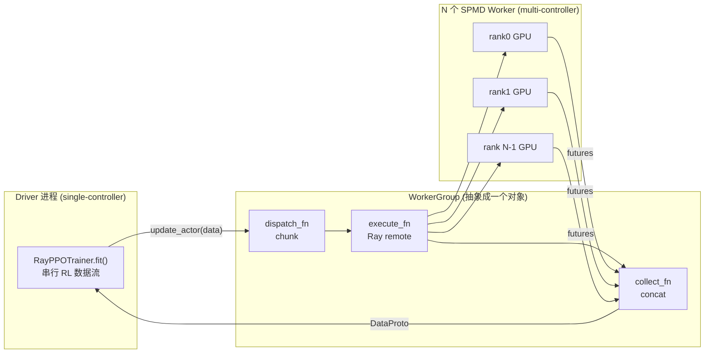
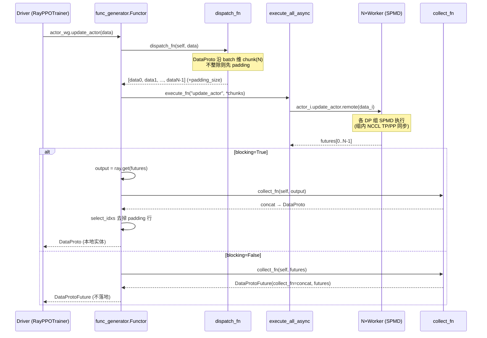

# verl 控制面 —— single_controller:单控制器驱动多控制器 SPMD

> **代码基准**:verl `main` @ `8a694930`
> **最后更新**:2026-06-22 · **系列**:verl RLHF 框架源码级分析(见 [[verl/index]])
>
> HybridFlow 的核心主张是「**single-controller 编程、multi-controller 执行**」:RL 算法代码在一个中心化 driver 进程上线性书写(`actor_wg.update_actor(data)` 一行调用),却要在底层 fan-out 到成百上千个 SPMD worker 上并发执行,再把各 rank 的结果聚合回 driver。本文逐行追踪这套机制——driver 上一次普通的方法调用,如何被拦截、切分(dispatch)、远程派发(execute)、聚合(collect),最终返回一个完整的 `DataProto`。
>
> 主要源文件:`single_controller/base/worker.py`(349 行)、`single_controller/base/worker_group.py`(256 行)、`single_controller/base/decorator.py`(445 行)、`single_controller/ray/base.py`(1128 行)

---

## 1. 功能范围与定位

### 1.1 single-controller vs multi-controller

传统 SPMD 训练(Megatron / torchtitan)是**纯 multi-controller**:每个 GPU 跑同一份脚本,各自走 `if rank == 0` 分支,集合通信靠 NCCL 隐式同步。这套范式在纯训练里很高效,但在 RLHF 里水土不服:RLHF 一个 step 要串起 **rollout 生成 → reward 打分 → ref/old logprob → advantage → actor/critic 更新** 多个异构阶段,每个阶段的并行度、模型、甚至后端(vLLM/SGLang vs FSDP/Megatron)都不同。若用纯 SPMD,控制流(「先 generate 再 compute_advantage」)会散落在每个 rank 的脚本里,极难维护。

HybridFlow 的解法是**两层混合**:

- **控制面(single-controller)**:一个 driver 进程(`RayPPOTrainer`,见 [[verl_ray_trainer_analysis]])串行书写整个 RL 算法的数据流;
- **计算面(multi-controller / SPMD)**:每个角色(Actor/Critic/Ref/Rollout)是一组 SPMD worker,组内用 NCCL 做张量/流水线并行,对 driver 暴露成**一个对象** `WorkerGroup`。

driver 调用 `worker_group.update_actor(data)` 时,`single_controller` 这一层负责:把 `data` 按 DP 维切成 N 份 → 每份发给一个 worker → N 个 worker SPMD 地跑 `update_actor` → 收集 N 份输出 → 拼回一个 `DataProto`。**driver 完全不感知底层有多少卡、怎么并行**。



### 1.2 三个抽象层

| 层 | 类 | 文件 | 职责 |
|----|----|----|----|
| 资源声明 | `ResourcePool` / `RayResourcePool` | `base/worker_group.py:27` / `ray/base.py:113` | 声明「N 个节点 × M 进程」,创建 Ray placement group |
| 进程组 | `WorkerGroup` / `RayWorkerGroup` | `base/worker_group.py:123` / `ray/base.py:418` | 拉起 worker actors,把 worker 方法绑到自身 |
| 单进程 | `Worker` | `base/worker.py:76` | SPMD 单个 rank,持有 rank/world_size/master 信息 |

派发逻辑(谁切、怎么切、怎么收)由 `@register` 装饰器 + `Dispatch` 枚举(`base/decorator.py`)横切在以上三层之间。

---

## 2. `Worker` 基类:一个 SPMD rank 的元信息载体

`Worker`(`base/worker.py:76`)继承 `WorkerHelper`,本身**不含任何训练逻辑**——它只负责把「我是 rank 几、world_size 多大、master 在哪」这些 SPMD 元信息从环境变量里读出来、再写回环境变量,好让 `torch.distributed.init_process_group()` 能正常 rendezvous。

### 2.1 rank / world_size / master 的来源

`Worker.__init__`(`base/worker.py:181`)从环境变量构造元信息:

```python
# base/worker.py:194-216
world_size = int(os.environ["WORLD_SIZE"])
rank = int(os.environ["RANK"])
self._rank = rank
self._world_size = world_size
master_addr = os.environ["MASTER_ADDR"]
master_port = os.environ["MASTER_PORT"]
local_world_size = int(os.getenv("LOCAL_WORLD_SIZE", "1"))
local_rank = int(os.getenv("LOCAL_RANK", "0"))
store = {"_world_size": world_size, "_rank": rank, ...}
self._configure_with_store(store=store)
```

关键点:**这些环境变量不是 worker 自己设的,而是 driver 在创建 Ray actor 时通过 `runtime_env.env_vars` 注入的**(见 §5.3)。`env_keys()`(`base/worker.py:169`)列出了被托管的 7 个变量:`WORLD_SIZE / RANK / LOCAL_WORLD_SIZE / LOCAL_RANK / MASTER_ADDR / MASTER_PORT / *_VISIBLE_DEVICES`。

`_configure_with_store`(`base/worker.py:283`)把 store 里的值同时写进 `self.__dict__`(供 `.rank`/`.world_size` 属性读)和 `os.environ`(供下游 `torch.distributed` 读):

```python
# base/worker.py:287-294
store_env_dict = {f"_{key.lower()}": store.get(f"_{key.lower()}", None) for key in type(self).env_keys()}
self.__dict__.update(store_env_dict)  # this is hacky
for key in type(self).env_keys():
    val = self.__dict__.get(f"_{key.lower()}", None)
    if val is not None:
        os.environ[key] = str(val)
```

`.rank`/`.world_size` 作为只读属性暴露(`base/worker.py:310-318`)。

### 2.2 设备可见性归一化

`_setup_env_cuda_visible_devices`(`base/worker.py:231`)处理 ROCm/HIP/CUDA 三套 `*_VISIBLE_DEVICES` 变量的冲突,并在 Ray 设了 `RAY_EXPERIMENTAL_NOSET_*_VISIBLE_DEVICES` 时,从 Ray runtime context 取回本 actor 分得的 accelerator id 来手动 `set_device`(`base/worker.py:273-281`)。这是 Ray 调度与 torch 设备绑定之间的胶水。

### 2.3 WorkerHelper:master 地址的 rendezvous 原语

`WorkerHelper`(`base/worker.py:50`)提供两个静态方法,是 rendezvous 的最底层:`_get_node_ip()` 用 `ray.util.get_node_ip_address()` 拿本机 IP(`base/worker.py:52`),`_get_free_port()` 用 `socket.bind(("",0))` 抢一个空闲端口(`base/worker.py:59`)。组合成 `get_available_master_addr_port()`(`base/worker.py:71`)——注意旧名 `get_availale_master_addr_port` 因拼写错误已 deprecate(`base/worker.py:64`)。

> 真正的 rendezvous 不在 worker 内完成,而在 driver:driver 通过一个跑在 PG 第一个 bundle 上的 Ray task 选出 master(§5.3),再把地址注入所有 worker 的 env。

### 2.4 `@register` 在 Worker 自身方法上的用法

`Worker` 自带两个被 `@register` 装饰的「执行器方法」,体现了 dispatch 机制的最小用例:

```python
# base/worker.py:320-333
@register(dispatch_mode=Dispatch.DP_COMPUTE_PROTO_WITH_FUNC)
def execute_with_func_generator(self, func, *args, **kwargs):
    ret_proto = func(self, *args, **kwargs)
    return ret_proto

# base/worker.py:335-348
@register(dispatch_mode=Dispatch.ALL_TO_ALL, execute_mode=Execute.RANK_ZERO)
def execute_func_rank_zero(self, func, *args, **kwargs):
    result = func(*args, **kwargs)
    return result
```

此外 `_query_dispatch_info` / `_query_collect_info`(`base/worker.py:102/118`)用 `Dispatch.ONE_TO_ALL` 装饰,供 driver 端的「lazy dispatch」反查每个 rank 的 DP 坐标(§4.5)。

---

## 3. `WorkerGroup` 与 `ResourcePool`:把 N 个 worker 方法绑成一个对象

### 3.1 ResourcePool:声明拓扑

`ResourcePool`(`base/worker_group.py:27`)用一个 `process_on_nodes` 列表描述拓扑——例如 `[8, 8]` 表示 2 节点各 8 进程:

```python
# base/worker_group.py:51-73
@property
def world_size(self):
    return sum(self._store)            # 16
def local_world_size_list(self):       # [8,8,...,8] 共 16 个
    ...
def local_rank_list(self):             # [0..7, 0..7]
    ...
```

`max_colocate_count`(`base/worker_group.py:34`)是同一组卡上最多可叠几个 WorkerGroup(colocate),直接决定 `num_gpus = 1 / max_colocate_count` 的资源切分(§5.3)。

### 3.2 ClassWithInitArgs:延迟实例化

`ClassWithInitArgs`(`base/worker_group.py:76`)把「类 + 构造参数」打包,推迟到远端再 `cls(*args, **kwargs)` 实例化(`base/worker_group.py:97`)。这是把 worker 类「序列化」到 Ray actor 的必要中间态。

### 3.3 核心:`_bind_worker_method` 把 worker 方法绑到 group 上

这是 single-controller 抽象的**关键魔法**。`WorkerGroup` 在初始化时遍历 worker 类的所有方法,凡是带 `MAGIC_ATTR` 标记(即被 `@register` 装饰过)的,就**在 group 对象上动态生成一个同名方法**:

```python
# base/worker_group.py:185-255 (节选)
for method_name in dir(user_defined_cls):
    method = getattr(user_defined_cls, method_name)
    if hasattr(method, MAGIC_ATTR):                      # 被 @register 标记
        attribute = getattr(method, MAGIC_ATTR)
        dispatch_mode = attribute["dispatch_mode"]
        execute_mode  = attribute["execute_mode"]
        blocking      = attribute["blocking"]
        # 取 dispatch/collect 函数对
        if isinstance(dispatch_mode, Dispatch):
            fn = get_predefined_dispatch_fn(dispatch_mode=dispatch_mode)
            dispatch_fn, collect_fn = fn["dispatch_fn"], fn["collect_fn"]
        else:                                            # dict:自定义(如 lazy mesh)
            dispatch_fn, collect_fn = dispatch_mode["dispatch_fn"], dispatch_mode["collect_fn"]
        # 取 execute 函数(execute_all / execute_rank_zero)
        execute_fn = getattr(self, get_predefined_execute_fn(execute_mode)["execute_fn_name"])
        # 生成并绑定
        func = func_generator(self, method_name,
                              dispatch_fn=dispatch_fn, collect_fn=collect_fn,
                              execute_fn=execute_fn, blocking=blocking)
        setattr(self, method_name, func)                 # group.update_actor = func
```

绑定后,driver 侧 `actor_wg.update_actor(data)` 调到的不是 worker 的原方法,而是 `func_generator` 合成的「dispatch→execute→collect」三段式包装器(§5.2)。`dispatch_mode` 既可是 `Dispatch` 枚举(查全局表),也可是 `{"dispatch_fn", "collect_fn"}` 字典(支持运行期定制,如 mesh-aware lazy dispatch)。

`WorkerGroup` 本身还提供 worker 存活检测:`start_worker_aliveness_check`(`base/worker_group.py:166`)起一个后台线程,任一 worker 死亡就 `signal.raise_signal(SIGABRT)` 拉崩主进程(`base/worker_group.py:102-120`),避免 driver 死等。

---

## 4. `@register` + Dispatch 系统:切分与聚合的策略表

### 4.1 `register` 装饰器

`register`(`base/decorator.py:398`)只做一件事:把 `(dispatch_mode, execute_mode, blocking)` 三元组写进函数的 `MAGIC_ATTR` 属性,供 `_bind_worker_method` 日后读取:

```python
# base/decorator.py:424-442 (节选)
def decorator(func):
    func = tqbridge(dispatch_mode=dispatch_mode)(func)     # TransferQueue 桥接(可选)
    @wraps(func)
    def inner(*args, **kwargs):
        if materialize_futures:
            args, kwargs = _materialize_futures(*args, **kwargs)
        return func(*args, **kwargs)
    @wraps(func)
    async def async_inner(*args, **kwargs): ...             # 协程版
    wrapper = async_inner if inspect.iscoroutinefunction(func) else inner
    attrs = {"dispatch_mode": dispatch_mode, "execute_mode": execute_mode, "blocking": blocking}
    setattr(wrapper, MAGIC_ATTR, attrs)
    return wrapper
```

两个细节:① `MAGIC_ATTR = "attrs_3141562937"`(`base/decorator.py:23`)是个魔数,避免和用户属性撞名;② `_materialize_futures`(`base/decorator.py:383`)在 **worker 端**执行前把传进来的 `DataProtoFuture` 真正 `.get()` 成 `DataProto`——这是 §6 非阻塞链式调用得以「driver 不落地数据」的关键。

`Dispatch` 与 `Execute` 都是 `DynamicEnum`(`base/decorator.py:26/50`),启动时 `init_predefined_dispatch_mode()`(`base/decorator.py:38`)注册全部模式,因此第三方可用 `register_dispatch_mode`(`base/decorator.py:338`)动态扩展。

### 4.2 Dispatch 枚举全集

实测注册的 8 种模式(`base/decorator.py:38-47`)及其语义如下:

| Dispatch 模式 | dispatch_fn → collect_fn | 语义 | 典型调用方 |
|---|---|---|---|
| `ONE_TO_ALL` | `dispatch_one_to_all` → `collect_all_to_all` | 同一份参数广播给全部 rank;输出原样返回 list | `init_model`、`load_checkpoint` 等控制类方法(`engine_workers.py:150/425`) |
| `ALL_TO_ALL` | `dispatch_all_to_all` → `collect_all_to_all` | 参数/返回都不动,直传直收 | `register` 默认值;底层/调试 |
| `DP_COMPUTE` | `dispatch_dp_compute` → `collect_dp_compute` | 调用方已切好 list(长度=world_size),逐 rank 派发,输出原样收 | 已分片的纯计算 |
| `DP_COMPUTE_PROTO` | `dispatch_dp_compute_data_proto` → `collect_dp_compute_data_proto` | **把一个 DataProto 沿 batch 维切 N 份**,各 rank 跑完再 concat 回一个 DataProto | 数据并行主力 |
| `DP_COMPUTE_PROTO_WITH_FUNC` | `dispatch_dp_compute_data_proto_with_func` → `collect_dp_compute_data_proto` | 同上,但首参是个函数,广播该函数 + 切分其余数据 | `execute_with_func_generator`(`base/worker.py:320`) |
| `DP_COMPUTE_METRIC` | `dispatch_dp_compute_data_proto` → `collect_dp_compute` | 切 DataProto,但收集时**不 concat**(返回各 rank 的 metric dict 列表) | 指标聚合 |
| `DIRECT_ROLLOUT_METHOD` | `dummy_direct_rollout_call`(抛异常)| 占位禁用——专给 vLLM `ExternalRayDistributedExecutor` 直连绕过 | rollout 外部执行器 |
| `RANK_ZERO` | (注册名,无内置 fn 对)| 仅 rank0 执行,常配 `Execute.RANK_ZERO` | 配 execute_mode 使用 |

dispatch/collect 函数对存在全局表 `DISPATCH_MODE_FN_REGISTRY`(`base/decorator.py:308`),由 `get_predefined_dispatch_fn`(`base/decorator.py:334`)按枚举取。

### 4.3 Execute 模式

`Execute` 只有两种(`base/decorator.py:61-63`),映射到 group 上的执行方法名(`base/decorator.py:357-366`):

| Execute | execute_fn_name | 行为 |
|---|---|---|
| `ALL` | `execute_all` | 派发给全部 worker |
| `RANK_ZERO` | `execute_rank_zero` | 只发给 `_workers[0]` |

### 4.4 DP_COMPUTE_PROTO 怎样切一个 DataProto

这是 RLHF 数据并行的核心路径。dispatch 端 `dispatch_dp_compute_data_proto`(`base/decorator.py:167`)对每个参数沿 batch 维 `chunk(world_size)`,且开启**自动 padding**:

```python
# base/decorator.py:91-117 (节选, _split_args_kwargs_data_proto_with_auto_padding)
def _padding_and_split_data(obj, chunks):
    if isinstance(obj, DataProto) and obj.is_padding_enabled():
        if data_proto_len is None:
            data_proto_len = len(obj)
            padding_size = (chunks - (data_proto_len % chunks)) if (data_proto_len % chunks > 0) else 0
        obj.padding(padding_size=padding_size)
    return obj.chunk(chunks=chunks)
...
if padding_size is not None:
    splitted_kwargs[_padding_size_key] = padding_size     # 把 padding 量随 kwargs 带下去
```

当 batch 不能被 world_size 整除时,先 pad 到整除再切,并把 `padding_size` 经特殊 key `_padding_size_key`(`protocol.py:71`)透传——`func_generator` 会在 collect 后把这些 pad 行 select 掉(§5.2)。底层 `chunk`/`concat`/`padding` 由 `DataProto` 实现(`protocol.py:864/917/849`),细节见 [[verl_dataproto_analysis]]。

collect 端 `collect_dp_compute_data_proto`(`base/decorator.py:191`)断言各 rank 输出可拼接,然后 `_concat_data_proto_or_future`(`base/decorator.py:138`)统一用 `BatchData(output).concat()`(`protocol.py:1291`)拼回一个对象。

`DP_COMPUTE_PROTO_WITH_FUNC`(`base/decorator.py:180`)的差别:`args[0]` 必须是函数,被广播到每个 rank(`[func]*world_size`),其余参数照切——用于把一个临时函数注入 SPMD 执行。

### 4.5 mesh-aware lazy dispatch:超越「均匀切 N 份」

纯 DP 假设所有 rank 都是独立 DP rank,但 Actor 通常是 **TP×PP×DP** 混合并行——只有每个 DP 组的「代表 rank」需要拿到一片数据,组内其余 rank 走 NCCL 同步。`make_nd_compute_dataproto_dispatch_fn(mesh_name)`(`base/decorator.py:300`)为此返回一对 partial 化的 lazy 函数:

```python
# base/decorator.py:266-297 (节选)
def dispatch_lazy_compute_data_proto(mesh_name, worker_group, *args, **kwargs):
    if mesh_name not in worker_group._dispatch_info:
        worker_group._dispatch_info[mesh_name] = worker_group._query_dispatch_info(mesh_name)  # 反查各 rank 的 dp_rank
    dp_rank_mapping = worker_group._dispatch_info[mesh_name]
    dp_size = max(dp_rank_mapping) + 1
    return dispatch_nd_compute_dataproto(dp_rank_mapping, dp_size, worker_group, *args, **kwargs)
```

机制:① group 第一次调用时,用 `_query_dispatch_info`(`ONE_TO_ALL` 远程方法)向每个 worker 问「你属于哪个 dp_rank」,得到一个长度=world_size 的映射;② `dispatch_nd_compute`(`base/decorator.py:202`)只把 `dp_size` 份数据按映射重新广播给同 dp_rank 的所有 rank(`dispatch_nd_compute_dataproto`,`base/decorator.py:250`);③ collect 时用 `collect_mask`(各 rank 的 `is_collect` 标志,经 `_query_collect_info` 反查)只保留每个 DP 组一份输出再 concat(`collect_nd_compute_dataproto`,`base/decorator.py:255`)。worker 端这些坐标由 `_register_dispatch_collect_info`(`base/worker.py:86`)在 SPMD 初始化时写入。

`engine_workers.py` 里 RL 主方法正是用它:

```python
# workers/engine_workers.py:652-655
@register(dispatch_mode=make_nd_compute_dataproto_dispatch_fn(mesh_name="actor"))
def update_actor(self, data: TensorDict) -> TensorDict:
    ...
```

---

## 5. Ray 后端:从声明到 Ray actor 集群

### 5.1 RayResourcePool → placement group

`RayResourcePool`(`ray/base.py:113`)在 `get_placement_groups`(`ray/base.py:131`)里把 `process_on_nodes` 翻译成 Ray placement group:每个进程一个 bundle `{"CPU": max_colocate_count, <device>: 1}`,按节点用 `STRICT_PACK` 策略打包(`ray/base.py:146-158`),`ray.get([pg.ready()...])` 阻塞到资源就绪,最后 `sort_placement_group_by_node_ip`(`ray/base.py:70`)按 IP 排序——保证多次 Ray job 间 RANK 与节点的对应稳定,FSDP 分片 checkpoint 才能正确续训。

`RayClassWithInitArgs.__call__`(`ray/base.py:369`)负责把一个 bundle 变成真正的 actor:绑 `PlacementGroupSchedulingStrategy` 指定 bundle index,叠加 GPU 资源选项,最终 `self.cls.options(**options).remote(...)`(`ray/base.py:415`)。若指定 `sharing_with`,则用 `NodeAffinitySchedulingStrategy` 把新 actor 钉到目标 actor 同节点并复用其可见设备(`ray/base.py:391-395`)。

### 5.2 func_generator:三段式包装器

被绑到 group 上的每个方法,本质是 `func_generator`(`ray/base.py:49`)产出的 `Functor`:

```python
# ray/base.py:49-67
def func_generator(self, method_name, dispatch_fn, collect_fn, execute_fn, blocking):
    class Functor:
        def __call__(this, *args, **kwargs):
            args, kwargs = dispatch_fn(self, *args, **kwargs)          # ① 切分
            padding_count = kwargs.pop(_padding_size_key, 0)
            output = execute_fn(method_name, *args, **kwargs)          # ② 远程派发(返回 futures)
            if blocking:
                output = ray.get(output)                               # ③ 阻塞则 ray.get
            output = collect_fn(self, output)                         # ④ 聚合
            if padding_count > 0:                                      # ⑤ 去掉 pad 行
                if isinstance(output, DataProto):
                    output = output.select_idxs([i for i in range(len(output))][:-padding_count])
                elif isinstance(output, list):
                    output = output[:-padding_count]
            return output
    return type(method_name, (Functor,), {})()      # 用 method_name 命名类,提升可观测性
```

注意 `blocking=False` 时第 ③ 步跳过,`output` 仍是 Ray future 列表,`collect_fn` 直接对 futures 聚合(配合 `DataProtoFuture`,见 §6)。

### 5.3 RayWorkerGroup 拉起 worker

`RayWorkerGroup.__init__`(`ray/base.py:426`)三条分支:detached(挂载已存在 actor)、SubResourcePool、普通资源池(`ray/base.py:474-491`)。普通路径 `_init_with_resource_pool`(`ray/base.py:538`)取 PG → 逐 (pg_idx, local_rank) 创建 worker。**master 的选定即 rendezvous**:仅在 pg_idx==0 时调 `_get_master_addr_port`(`ray/base.py:520`),它在 PG 第一个 bundle 上跑 Ray task `get_master_addr_port`(`ray/base.py:90`)拿到 IP+空闲端口。

随后 `_create_worker`(`ray/base.py:623`)把元信息打进 actor 的 `runtime_env.env_vars`:

```python
# ray/base.py:629-640 (节选)
num_gpus = 1 / resource_pool.max_colocate_count        # colocate 时按比例切 GPU
env_vars = {
    "WORLD_SIZE": str(world_size), "RANK": str(rank),
    "WG_PREFIX": self.name_prefix, "WG_BACKEND": "ray",
    "RAY_LOCAL_WORLD_SIZE": str(local_world_size),
    "MASTER_ADDR": self._master_addr, "MASTER_PORT": self._master_port,
}
```

这正好对应 §2.1 中 `Worker.__init__` 从 env 读取的那些键——**driver 注入、worker 读取**,闭环完成。`__init__` 末尾 `_bind_worker_method(self.ray_cls_with_init.cls, func_generator)`(`ray/base.py:494`)完成 §3.3 的方法绑定。

### 5.4 execute_all / execute_rank_zero

`execute_all_async`(`ray/base.py:866`)是派发引擎:若所有 args/kwargs 都是长度=world_size 的 list,就按 rank 切片逐 worker 派发;否则把同一份参数发给全部 worker:

```python
# ray/base.py:881-894 (节选)
length = len(self._workers)
if all(isinstance(arg, list) for arg in args) and all(...):
    if all(len(arg) == length for arg in args) and ...:
        result = []
        for i in range(length):
            sliced_args = tuple(arg[i] for arg in args)
            result.append(self._execute_remote_single_worker(self._workers[i], method_name, *sliced_args, ...))
        return result
return [self._execute_remote_single_worker(w, method_name, *args, **kwargs) for w in self._workers]
```

`_execute_remote_single_worker`(`ray/base.py:782`)发出实际的 `actor.method.remote(...)`;若是 fused worker 且方法不在直绑表里,则转走 `_fuw_execute` 间接调度(§5.5)。`execute_rank_zero_async`(`ray/base.py:814`)只对 `_workers[0]` 发。这两个名字正是 `get_predefined_execute_fn` 返回的 `execute_all`/`execute_rank_zero`(`ray/base.py:840/827`)。

### 5.5 colocate:Actor + Rollout + Ref 挤进同一个 Ray actor

RLHF 里 Actor/Ref/Rollout 常需 colocate 在同一组卡上(省显存、免传权重)。两条实现路线:

**旧路线 `create_colocated_worker_cls`(`ray/base.py:988`)**:动态合成一个 `WorkerDict` 类(`ray/base.py:1008`),其 `__init__` 把每个子 worker 类(用 `DISABLE_WORKER_INIT=1` 跳过重复初始化)实例化进 `self.worker_dict[key]`;再用 `_bind_workers_method_to_parent`(`ray/base.py:920`)把每个子类的 `@register` 方法以 `{key}_{method}` 前缀挂到 `WorkerDict` 上,转发给对应子 worker(`ray/base.py:937-939`)。

**新路线 `create_colocated_worker_cls_fused`(`ray/base.py:1107`)**:返回一个 `FusedWorker`(`ray/base.py:1061`),把子 worker 存进 `fused_worker_dict` 并互相注入(`ray/base.py:1080-1085`,使彼此可见)。调用通过 `_fuw_execute("{cls}_fwmn_{method}", ...)`(`ray/base.py:1087`)按 `_fwmn_` 分隔符解析出子类名+方法名再转发。配合 `RayWorkerGroup.spawn`/`fuse`(`ray/base.py:718/770`),可从一个 colocate group 派生出每个角色各自的 sub-WorkerGroup(`spawn_fused` 对每个 prefix `_bind_worker_method` 不同子类,`ray/base.py:753`)。

---

## 6. 端到端:一次 `update_actor(data)` 的旅程



**阻塞 vs 非阻塞**由 `@register(blocking=...)` 决定:

- `blocking=True`(默认):`func_generator` 内 `ray.get(output)` 把 futures 落地成 `DataProto` 再返回 driver。driver 拿到的是实体数据。
- `blocking=False`(如 `update_actor`,`engine_workers.py:652` 系列方法):跳过 `ray.get`,`collect_fn` 把 futures 包成一个 `DataProtoFuture`(`protocol.py:1174`)返回。该 Future 持有 `world_size` 个 `ray.ObjectRef`,**数据始终留在 Ray object store,不经过 driver**。

`DataProtoFuture` 的妙处在于**链式传递**:它支持 `.chunk()`(`protocol.py:1197`,把 future 再切成子 future)和 `.concat()`(`protocol.py:1193`),所以一个 group 的非阻塞输出可直接喂给下一个 group 的方法,中途完全不在 driver 落地;直到某处真正 `.get()`(`protocol.py:1212`)才 `ray.get` + concat + 可选二次切分。而 §4.1 的 `_materialize_futures` 保证 future 在**目标 worker 端**才被实体化。这套机制让 driver 串行的算法代码天然获得跨阶段的异步流水线能力。

---

## 7. 设计要点小结

1. **「写一遍、跑 N 份」的实现支点是 `_bind_worker_method` + `func_generator`**:把 worker 上 `@register` 的方法,在 group 对象上替换成「dispatch→execute→collect」三段式同名方法,从而让 driver 的单次调用透明地 fan-out/fan-in。
2. **dispatch 策略与业务方法解耦**:`@register(dispatch_mode=...)` 是唯一的耦合点,换一种切分语义只需换枚举,业务代码零改动;mesh-aware lazy dispatch 进一步支持 TP×PP×DP 非均匀拓扑。
3. **rendezvous 由 driver 主导**:master 地址在 driver 侧用 Ray task 选定,经 `runtime_env.env_vars` 注入,worker 端只是被动读 env——SPMD 的 `torch.distributed` 初始化由此无缝衔接。
4. **非阻塞 + `DataProtoFuture` 让中心化 driver 不成为数据瓶颈**:结果留在 object store,driver 只搬运 future 引用,RL 多阶段得以重叠。
5. **colocate(fused worker)是 RLHF 省显存的关键**:Actor/Ref/Rollout 物理同卡、逻辑分组,经 `spawn`/`fuse` 仍对 driver 暴露成独立 WorkerGroup。

---

## Related Pages

- [[verl_architecture_overview_analysis]] —— verl 总体架构与 HybridFlow 思想,本文是其控制面实现细节
- [[verl_ray_trainer_analysis]] —— driver 侧 `RayPPOTrainer` 如何串起各 WorkerGroup 调用本文的派发机制
- [[verl_dataproto_analysis]] —— `DataProto` / `DataProtoFuture` / `BatchData` 的 chunk/concat/padding 细节(§4.4、§6 的底座)
- [[verl_workers_engine_analysis]] —— `@register` 的实际使用方:Actor/Critic/Ref worker 的方法与 dispatch 模式选择
- [[verl_rollout_resharding_analysis]] —— colocate 与权重 resharding,延续 §5.5 的 fused worker
- [[verl_rl_algorithms_analysis]] —— 上层 RL 算法如何在 single-controller 数据流上书写
- [[verl_optimization_analysis]] —— 非阻塞流水线等性能手段
- [[verl_quickstart_guide]] —— 上手路径
- [[verl/index]] —— verl 系列总索引
