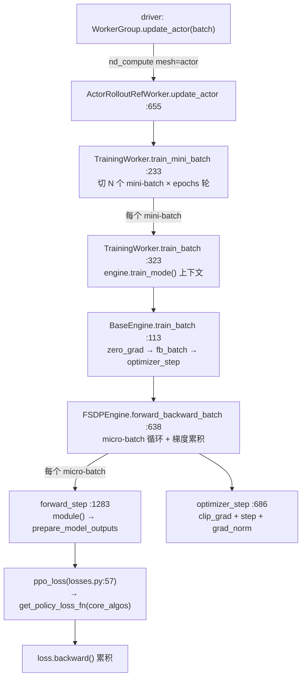
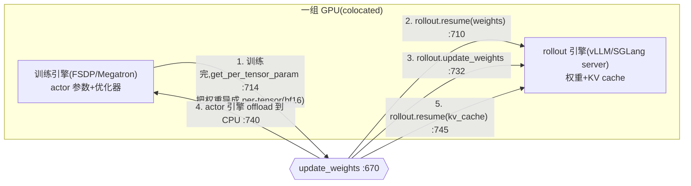

# verl 计算面 —— 统一 Worker 与 Engine 后端抽象(FSDP/Megatron/...)

> **代码基准**:verl `main` @ `8a694930`
> **最后更新**:2026-06-22 · **系列**:verl RLHF 框架源码级分析(见 [[verl/index]])
>
> verl 把"谁来跑模型计算"拆成两层:**Worker**(`single_controller` 的 `Worker` 子类,被 driver 通过 `@register` 方法远程调用,负责编排 mini-batch / 损失 / checkpoint)与 **Engine**(FSDP / Megatron / TorchTitan / VeOmni / ... 后端,负责真正的 forward / backward / optimizer step / 切分 / offload)。本文行号约定:以 verl 内层包 `verl/` 为根。
>
> **本文最重要的结论(与旧版 verl 有重大出入,务必先读)**:在 `8a694930` 上,`workers/engine_workers.py` **只有两个 worker 类**——底层的 `TrainingWorker` 与混合 worker `ActorRolloutRefWorker`。**已不存在独立的 `CriticWorker` / `RewardModelWorker` 类**,critic 只是"`model_type="value_model"` + `value_loss`"的另一个 `TrainingWorker`;reward 走 `experimental/reward_loop` 与 `workers/reward_manager`。rollout 也**只剩 async server 模式**,`generate_sequences` 不再是 worker 的 `@register` 方法。

---

## 1. 功能范围与定位

一次 RLHF 迭代里,"算"这件事被分成两层抽象:

| 层 | 类 | 文件 | 职责 |
|----|----|----|----|
| **Worker** | `TrainingWorker` / `ActorRolloutRefWorker` | `workers/engine_workers.py` | `single_controller` 的 `Worker` 子类;暴露 `@register` 入口给 driver(RayWorkerGroup);编排 mini-batch×epoch 循环、损失函数注入、metrics 聚合、checkpoint、权重同步 |
| **Engine** | `BaseEngine` 及其后端子类 | `workers/engine/{base,fsdp,megatron,...}` | 真正跑 forward/backward;管理参数切分(FSDP/TP/PP)、优化器、混合精度、offload、per-tensor 权重导出 |

Worker 与 Engine 是**组合(has-a)关系**而非继承:`TrainingWorker` 在 `__init__` 里通过 `EngineRegistry.new(...)` 持有一个 `BaseEngine` 实例(`engine_workers.py:127`),所有计算都委托给它。

```python
# workers/engine_workers.py:127-134
self.engine: BaseEngine = EngineRegistry.new(
    model_type=self.config.model_type,
    backend=self.engine_config.strategy,
    model_config=self.model_config,
    engine_config=self.engine_config,
    optimizer_config=self.optimizer_config,
    checkpoint_config=self.checkpoint_config,
)
```

与 [[verl_single_controller_analysis]] 的关系:driver 端只看见 `WorkerGroup` 上的方法名(`update_actor`、`compute_log_prob`...),`@register(dispatch_mode=...)` 决定数据如何 scatter 到各 rank、结果如何 gather 回来(见 §2.3)。Worker 内部再把单 rank 的活儿交给 Engine。

---

## 2. 统一 Worker 类

### 2.1 `TrainingWorker`:底层训练 worker(Tinker 式 API)

`TrainingWorker(Worker, DistProfilerExtension)`(`engine_workers.py:76`)是计算面的最小单元——一个进程持有一个 `BaseEngine`,对外暴露"训一个 batch / 推一个 batch"的粗粒度 API。它的 docstring 自承提供"Tinker-like API"(`:78`)。其 `@register` 入口:

| 方法 | 行 | Dispatch 模式 | blocking | 作用 |
|------|----|--------------|----------|------|
| `to(device, model, optimizer, grad)` | `:150` | `ONE_TO_ALL` | True | 手动 load/offload,转调 `engine.to` |
| `set_loss_fn(loss_fn)` | `:160` | `ONE_TO_ALL` | True | 注入损失函数 |
| `reset()` | `:164` | `ONE_TO_ALL` | True | 转调 `engine.initialize()`(建模型/优化器/scheduler) |
| `train_mini_batch(data)` | `:233` | `nd_compute(mesh="train")` | **False** | 把 batch 切成 N 个 mini-batch,跑 `epochs` 轮,每个 mini-batch 调 `train_batch`(§5) |
| `train_batch(data)` | `:323` | `nd_compute(mesh="train")` | **False** | 单 mini-batch:`engine.train_mode()` 上下文内调 `engine.train_batch` |
| `infer_batch(data)` | `:379` | `nd_compute(mesh="train")` | **False** | 单 batch 前向(log_prob / value):`engine.eval_mode()` 内调 `engine.infer_batch` |
| `save_checkpoint(...)` | `:425` | `ONE_TO_ALL` | True | 转调 `engine.save_checkpoint` |
| `load_checkpoint(...)` | `:429` | `ONE_TO_ALL` | True | 转调 `engine.load_checkpoint` |

注意 `TrainingWorker` 在 `__init__` 末尾就把自己的 dispatch 信息注册成 mesh **"train"**(`:137-141`),DP rank 与"哪个 rank 持有输出"都从 engine 查:

```python
# workers/engine_workers.py:137-141
self._register_dispatch_collect_info(
    mesh_name="train",
    dp_rank=self.engine.get_data_parallel_rank(),
    is_collect=self.engine.is_mp_src_rank_with_outputs(),
)
```

> **critic 在哪?** `TrainingWorker` 不区分 actor/critic。差别只有两处:`model_type`(`"language_model"` → LM head;`"value_model"` → value head,见 §4.3)与注入的损失函数(`ppo_loss` vs `value_loss`,见 §5)。所以"critic worker"就是一个 `model_type="value_model"` 的 `TrainingWorker`。

### 2.2 `ActorRolloutRefWorker`:混合(actor+rollout+ref colocated)worker

`ActorRolloutRefWorker(Worker, DistProfilerExtension)`(`engine_workers.py:434`)是 PPO 主路径上真正被 driver 创建的 worker。它**复合**了三个角色,由 `role` 字符串决定哪些被激活(`:455-458`):

```python
# workers/engine_workers.py:441-458
actor_worker_cls = TrainingWorker
ref_worker_cls = TrainingWorker
...
assert self.role in ["actor", "rollout", "ref", "actor_rollout", "actor_rollout_ref"]
self._is_actor   = self.role in ["actor", "actor_rollout", "actor_rollout_ref"]
self._is_rollout = self.role in ["rollout", "actor_rollout", "actor_rollout_ref"]
self._is_ref     = self.role in ["ref", "actor_rollout_ref"]
```

`init_model`(`:502`,`ONE_TO_ALL`)按 role 逐个构建子组件:

1. **ref**(`:507-542`):构造一个 `forward_only` 的 `TrainingWorker`(`self.ref`),并 `set_dispatch_collect(mesh_name="ref", ...)` 把 ref 的 DP 信息登记到混合 worker 上。ref 强制关掉 MTP(`:521`)。
2. **actor**(`:545-591`):构造训练用 `TrainingWorker`(`self.actor`),注入损失函数 `self.loss_fn = partial(ppo_loss, config=actor_config)`(`:587`;蒸馏时用 `distillation_ppo_loss`,`:583`),并登记 mesh **"actor"**。
3. **rollout**(`:594-619`):建 rollout 设备 mesh(dp×infer_tp×infer_pp,`:606`),`get_rollout_class(name, mode)` 拿到 server adapter 并实例化 `self.rollout`(`:611-614`)。
4. **checkpoint engine**(`:621-632`):建权重同步用的 `CheckpointEngine`。

混合 worker 的 `@register` 入口:

| 方法 | 行 | Dispatch 模式 | blocking | 委托到 |
|------|----|--------------|----------|--------|
| `init_model()` | `:502` | `ONE_TO_ALL` | True | 构建 actor/ref/rollout/ckpt |
| `set_loss_fn(loss_fn)` | `:493` | `ONE_TO_ALL` | True | `self.actor.set_loss_fn` |
| `to(device,...)` | `:497` | `ONE_TO_ALL` | True | `self.actor.to` |
| `compute_ref_log_prob(data)` | `:640` | `nd_compute(mesh="ref")` | True | `self.ref.infer_batch` |
| `compute_log_prob(data)` | `:647` | `nd_compute(mesh="actor")` | True | `self.actor.infer_batch` |
| `update_actor(data)` | `:655` | `nd_compute(mesh="actor")` | True | `self.actor.train_mini_batch` |
| `load_checkpoint(...)` | `:660` | `ONE_TO_ALL` | True | `self.actor.load_checkpoint` |
| `save_checkpoint(...)` | `:665` | `ONE_TO_ALL` | True | `self.actor.save_checkpoint` |
| `update_weights(...)` | `:670` | `ONE_TO_ALL` | **False**(`async`) | 把 actor 权重同步给 rollout(§6.2) |
| `execute_checkpoint_engine(method,...)` | `:752` | `DP_COMPUTE` | False | 转调 checkpoint engine 任意方法 |

> **没有 `generate_sequences` 这个 `@register` 方法!** 类注释明说:"ActorRolloutRefWorker no longer support spmd mode and run native server mode"(`:438`)。rollout 注册表 `_ROLLOUT_REGISTRY` 只剩 `("vllm","async")` / `("sglang","async")` / `("trtllm","async")` 三个 `ServerAdapter`(`workers/rollout/base.py:83-87`)。生成由 async server / agent loop 直接驱动,worker 这层只负责 rollout 的生命周期(`update_weights` / resume / sleep)。`generate_sequences` 仅作为 `BaseRollout` 的同步兜底接口存在(`base.py:71`,默认 `NotImplementedError`)。

### 2.3 关键的 `@register` dispatch 模式

`@register` 由 `single_controller/base/decorator.py:398` 定义,dispatch 模式来自全局注册表 `DISPATCH_MODE_FN_REGISTRY`(`decorator.py:308`):

- **`ONE_TO_ALL`**(`decorator.py:309`):同一份参数广播到所有 rank、各 rank 同样执行——用于 `init_model` / `to` / checkpoint 这类无数据切分的控制操作。
- **`DP_COMPUTE`**(`:317`):按 DP 切分输入。
- **`nd_compute`** = `make_nd_compute_dataproto_dispatch_fn(mesh_name)`(`decorator.py:300`):按**具名 mesh** 的 DP 维 lazy 切分 `DataProto`/`TensorDict`,只在 model-parallel src rank 收集输出。actor/ref 的计算入口全用它——这正是 hybrid worker 能把 actor 与 ref 注册成两套独立 DP 拓扑("actor" / "ref" mesh)的原因。

---

## 3. Engine 抽象

### 3.1 `BaseEngine` 接口与"模板方法"

`BaseEngine`(`workers/engine/base.py:30`)定义后端契约。要点:`train_batch` / `infer_batch` **不是抽象方法,而是模板方法**——后端只需实现 `forward_backward_batch`、`optimizer_step`、`optimizer_zero_grad`,训练步的骨架由基类写死:

```python
# workers/engine/base.py:113-132
def train_batch(self, data, loss_function):
    maybe_fix_3d_position_ids(data)
    self.optimizer_zero_grad()
    outputs = self.forward_backward_batch(data, loss_function, forward_only=False)
    grad_norm = self.optimizer_step()
    if self.is_mp_src_rank_with_outputs():
        outputs["metrics"]["grad_norm"] = grad_norm
    return outputs
```

`infer_batch`(`:134`)则是 `torch.no_grad()` 下的纯前向。其余接口分四组:

| 组 | 方法 | 行 |
|----|------|----|
| 生命周期 | `initialize` / `train_mode` / `eval_mode` | `:38 / :58 / :68` |
| 计算 | `forward_backward_batch`(抽象)/ `train_batch` / `infer_batch` / `optimizer_step` / `lr_scheduler_step` | `:99 / :113 / :134 / :84 / :90` |
| 拓扑 | `get_data_parallel_{size,rank,group}` / `is_mp_src_rank_with_outputs` | `:161 / :217` |
| 显存与同步 | `to(device, model, optimizer, grad)` / `get_per_tensor_param` / `save/load_checkpoint` / `is_param_offload_enabled` | `:170 / :151 / :183 / :46` |

### 3.2 自动 offload:`BaseEngineCtx`

`train_mode` / `eval_mode` 返回的上下文管理器都派生自 `BaseEngineCtx`(`base.py:230`)。进入时把组件搬上设备、退出时搬回 CPU,搬什么由 mode 与 offload 开关决定:

```python
# workers/engine/base.py:250-258
if self.mode == "eval":
    self.engine.to(device=device, model=self.engine.is_param_offload_enabled, optimizer=False, grad=False)
elif self.mode == "train":
    self.engine.to(device=device,
                   model=self.engine.is_param_offload_enabled,
                   optimizer=self.engine.is_optimizer_offload_enabled,
                   grad=self.engine.is_param_offload_enabled)
```

即:推理只可能把参数搬上来,训练才会连优化器/梯度一起搬。`disable_auto_offload=True` 可跳过(`:245`),这正是 `train_mini_batch` 在 mini-batch 循环里复用同一份已驻留显存的参数的手段(§5)。

### 3.3 `EngineRegistry`:按 (model_type, backend, device, vendor) 选后端

`EngineRegistry`(`base.py:269`)用三级字典 `_engines[model_type][backend][(device,vendor)]` 存放后端类,`@EngineRegistry.register(...)` 注册(`:281`),`get_engine_cls`(`:328`)按当前 `device`/`vendor` 查找,并带 fallback:vendor-specific → device-only → cuda 下回退到 nvidia(`:341-354`),还可用 `VERL_ENGINE_DEVICE` / `VERL_ENGINE_VENDOR` 环境变量覆盖(`:335-338`)。`workers/engine/__init__.py` 用 `try/except ImportError` 惰性导入各后端(`:24-64`),所以缺装 megatron/veomni 也不影响 FSDP 路径。

---

## 4. 后端实现:FSDP 与 Megatron

### 4.1 注册矩阵

| 后端类 | 文件 | `model_type` | `backend` | `device` |
|--------|------|--------------|-----------|----------|
| `FSDPEngineWithLMHead` | `fsdp/transformer_impl.py:946` | language_model | fsdp, fsdp2 | cuda, npu |
| `FSDPEngineWithValueHead` | `fsdp/transformer_impl.py:1339` | value_model | fsdp, fsdp2 | cuda, npu |
| `MegatronEngineWithLMHead` | `megatron/transformer_impl.py:800` | language_model | megatron | cuda |
| `MegatronEngineWithValueHead` | `megatron/transformer_impl.py:1032` | value_model | megatron | cuda |

其余后端各有 LMHead/ValueHead 两个变体并经 `__init__.py` 惰性注册:`torchtitan/`、`veomni/`、`automodel/`、`mindspeed/`(`workers/engine/{torchtitan,veomni,automodel,mindspeed}/transformer_impl.py`)。

### 4.2 FSDP:从 HF 模型到 sharded 计算

`FSDPEngine(BaseEngine)`(`fsdp/transformer_impl.py:85`)的 `initialize` → `_build_model_optimizer`(`:564`)三步:`_build_module`(HF `AutoModel` / valuehead,`:230`)→ 可选 LoRA(`:315`)/ QAT(`:512`)→ `_build_fsdp_module`(`:361`)。

`_build_fsdp_module` 按 `strategy` 分叉:`"fsdp"` 走 FSDP1 `FSDP(...)`(`:413`),`"fsdp2"` 走 `apply_fsdp2` + `fsdp2_load_full_state_dict`(`:448-449`)。混合精度策略在此落地(`param_dtype`/`reduce_dtype`/`buffer_dtype`,`:367-377`),fp16 训练才挂 `ShardedGradScaler`(`:382-385`)。分片策略由 `get_sharding_strategy`(`fsdp/utils.py:61`)按 mesh 维度 + `reshard_after_forward` 选 `FULL_SHARD`/`HYBRID_SHARD`(ZeRO-3)或 `SHARD_GRAD_OP`/`_HYBRID_SHARD_ZERO2`(ZeRO-2)。设备 mesh 由 `create_device_mesh`(`fsdp/utils.py:40`)给出 1D `[fsdp]` 或 2D `[ddp, fsdp]`;Ulysses 序列并行另起 `[dp, sp]` mesh(`:222-226`)。

计算路径 `forward_backward_batch`(`:638`):先 all-reduce 出全局 token 数做损失归一化(`:643-647`),`prepare_micro_batches`(`engine/utils.py:57`)按 `use_dynamic_bsz`(按 `max_token_len_per_gpu` 重排)或固定 `micro_batch_size_per_gpu` 切微批,逐微批 `forward_step` + `loss.backward()`(`:662-672`):

```python
# workers/engine/fsdp/transformer_impl.py:662-672
for micro_batch in micro_batches:
    with ctx:                                   # forward_only 时为 no_grad
        loss, meta_info = self.forward_step(micro_batch, loss_function=loss_function, forward_only=forward_only)
        if not forward_only:
            if scaler is not None: scaler.scale(loss).backward()
            else:                  loss.backward()
    output_lst.append(meta_info)
```

`forward_step`(`:1283`)在 autocast 下跑 `self.module(**model_inputs)`,经 `prepare_model_outputs` 算出 log_prob/entropy,再交给 `loss_function`。`optimizer_step`(`:686`)负责裁剪梯度(FSDP1 用 `module.clip_grad_norm_`,FSDP2 用 `fsdp2_clip_grad_norm_`)、非有限值跳过更新、返回 grad_norm。

`FSDPEngineWithValueHead`(`:1339`)只重写 `prepare_model_outputs`,把模型输出当作每 token value(`:1344-1390`)——注释直言"actor 与 critic 的唯一区别就是怎么处理原始输出"(`:1341`)。

### 4.3 Megatron:复用同一契约,内核换成 mcore

`MegatronEngine(BaseEngine)`(`megatron/transformer_impl.py:77`)在 `_init_device_mesh` 里调 `mpu.initialize_model_parallel`,一次性铺开 TP/PP/VPP/CP/EP/ETP(`:155-165`);模型经 mbridge 从 HF config 转 mcore(`:188-241`)。`forward_backward_batch`(`:608`)不再自己写微批循环,而是把 `forward_step` 喂给 Megatron 的 `get_forward_backward_func()`(PP 调度器,`:645-683`),并为 MoE 接入 router replay(`:661-668`)。但**对外接口与 FSDP 完全一致**——`train_batch`/`optimizer_step`/`get_per_tensor_param`/`to` 同名同义,这正是 worker 层能对后端无感的根因。详见 [[megatron-lm/index]] 与 [[distributed_optimizer_deep_dive]]。

---

## 5. `update_actor`:策略梯度损失怎么算出来

一次 `update_actor` 是三层嵌套循环,把"梯度更新粒度(mini-batch×epoch)"与"显存粒度(micro-batch 梯度累积)"解耦:



- **外层(mini-batch × epoch)**= `train_mini_batch`(`:233`):`tu.make_iterator` 生成 mini-batch 流(`:264`),逐个调 `train_batch`(`:301`);只在最后一个 mini-batch 触发 `lr_scheduler_step`(`:298`、`:357`)。每个 mini-batch 对应一次**优化器更新**。
- **中层(单 mini-batch)**= `engine.train_batch`(模板方法,`base.py:113`)= `optimizer_zero_grad` → `forward_backward_batch` → `optimizer_step`。
- **内层(micro-batch 梯度累积)**= `forward_backward_batch`(`:638`)逐微批前向 + `loss.backward()`,梯度在 `.grad` 上累加,直到 mini-batch 结束才 `optimizer_step`。

损失函数本体在 `workers/utils/losses.py`:`ppo_loss`(`:57`)从 model_output 取 `log_probs`/`entropy`,经 `get_policy_loss_fn(loss_mode)`(`:103`,来自 `trainer/ppo/core_algos.py`)算 PG loss,再叠加 entropy 项(`:124`)与可选 KL loss(`:132-142`);critic 用 `value_loss`(`:147`,clipped value loss)。策略族(vanilla/GSPO/clip-cov...)的细节见 [[verl_rl_algorithms_analysis]]。

> 损失归一化:`forward_backward_batch` 会 all-reduce 全局 token 数写进 `batch_num_tokens`/`dp_size`(`:643-648`),`ppo_loss` 据此决定 metric 聚合是 SUM 还是 MEAN(`losses.py:73-81`)——这样跨 DP/micro-batch 的 loss 才等价于全局均值。

### 5.1 推理路径:`compute_log_prob` / `compute_ref_log_prob`

PPO 一步里还有两个纯前向入口,与 `update_actor` 同构但走 `infer_batch`:`compute_log_prob`(`:647`,mesh "actor")算 old/behavior log-prob,`compute_ref_log_prob`(`:640`,mesh "ref")算参考策略 log-prob 供 KL。二者都转调对应 `TrainingWorker.infer_batch`(`:379`),后者在 `engine.eval_mode()` 上下文里调 `engine.infer_batch`(`base.py:134`,`no_grad` 前向),并用 `infer_*` 那套 batch 上限(`infer_max_token_len_per_gpu` / `infer_micro_batch_size_per_gpu`,`:391-392`)。ref 引擎是 `forward_only=True` 构建的,天然只占参数显存、无优化器状态(§4.2)。两个装饰器 `@_with_routing_replay_flag`(`:639`/`:646`)给 MoE router replay 打标:ref 关、actor 开(`engine_workers.py:61-73`)。

### 5.2 metrics 怎么聚合回 driver

无论训练还是推理,单 rank 的原始输出都要经 `_postprocess_output`(`:172`)折叠成一份可上报的 metrics:loss 先 `torch.sum` 再在 DP 组 `all_reduce(AVG)`(`:186-190`);grad_norm 不再 all-reduce(裁剪时已做);其余 metric 用 `allgather_dict_into_dict` 跨 DP 收齐(`:199-203`);并附上 `max_memory_allocated/reserved`、CPU 内存等 perf 指标(`:210-212`)与由 `FlopsCounter` 估出的 MFU(`:220-226`,纯前向再除 3 折算)。最终只有 model-parallel src rank(`is_mp_src_rank_with_outputs`)返回非 None(`:362`/`:412`),其余 rank 返回 `None`,交给 dispatch 的 collect_fn 丢弃——这与 `nd_compute` 的"只在 src rank 收集"语义闭环。

---

## 6. 显存杠杆与"训练-生成" GPU 时分复用

### 6.1 各档开关在哪配

| 杠杆 | 字段 | 位置 | 默认 |
|------|------|------|------|
| 参数 offload | `param_offload` | `EngineConfig`,`config/engine.py:90` | False |
| 优化器 offload | `optimizer_offload` | `:92` | False |
| 梯度 offload | `grad_offload` | `:94` | False |
| 纯前向(ref) | `forward_only` | `:96` | False |
| 动态 batch / 上限 | `use_dynamic_bsz` / `max_token_len_per_gpu` / `micro_batch_size_per_gpu` | `:102-105` | True / None / None |
| ZeRO-3 vs ZeRO-2 | `reshard_after_forward` | `FSDPEngineConfig`,`:252` | True(ZeRO-3) |
| FSDP2 CPU offload | `offload_policy` | `:251` | False |
| 混合精度 | `mixed_precision`(param/reduce/buffer dtype)| `:257` | None(→ bf16/fp32/fp32)|
| Ulysses SP | `ulysses_sequence_parallel_size` | `:258` | 1 |
| 熵 checkpoint | `entropy_checkpointing` | `:262` | False |
| 梯度检查点 | `enable_gradient_checkpointing` | `config/model.py:117` | **True** |
| 激活 offload | `enable_activation_offload` | `config/model.py:118` | False |
| remove padding | `use_remove_padding` | `config/model.py:120` | True |
| LoRA | `lora_rank` | `config/model.py:124` | 0 |
| 梯度裁剪 | `clip_grad` | `OptimizerConfig`,`config/optimizer.py:53` | 1.0 |

Megatron 侧并行度(TP/PP/VPP/CP/EP/ETP、`sequence_parallel`、`use_distributed_optimizer`)在 `McoreEngineConfig`(`config/engine.py:150-208`)。系统级优化全景见 [[verl_optimization_analysis]]。

实际的搬运动作落在 `FSDPEngine.to`(`:742`):`load_fsdp_model_to_gpu`/`offload_fsdp_model_to_cpu` + `load_fsdp_optimizer`/`offload_fsdp_optimizer`;`forward_only` 引擎直接强制 CPUOffload 并跳过(`:749-751`)。`initialize` 末尾就按开关把模型/优化器先 offload 到 CPU(`:202-207`),等真正计算时由 `BaseEngineCtx`(§3.2)再搬回来。

### 6.2 同一组 GPU 在"训练"与"生成"间时分复用

colocated 模式下 actor 训练引擎与 rollout 推理引擎共享同一批 GPU,靠 `update_weights`(`:670`)在两者间倒手显存:



关键序列(`engine_workers.py:705-749`):先 `set_expandable_segments(False)` →`rollout.resume(["weights"])` 把生成权重搬回显存 → `actor.engine.get_per_tensor_param(...)` 把训练权重(DTensor 聚合成完整张量再转 bf16,`fsdp/transformer_impl.py:861-869`)逐张量灌给 rollout → 若 `is_param_offload_enabled` 则把 actor 模型 offload 回 CPU(`:740`)给 rollout 腾地方 → `rollout.resume(["kv_cache"])`。生成阶段结束后,rollout 进入 sleep(`free_cache_engine`)、训练引擎再被 `train_mode()` 上下文搬回显存。这套"谁算谁占显存、算完就让位"的机制,以及权重在不同并行布局间的重切分(resharding),是 [[verl_rollout_resharding_analysis]] 的主题。

---

## 7. 一图看清 Worker↔Engine 分层

```mermaid
flowchart TD
    DRV["Driver / RayPPOTrainer<br/>(see verl_ray_trainer_analysis)"] -->|@register dispatch| WG["RayWorkerGroup<br/>(single_controller)"]
    WG --> HYB["ActorRolloutRefWorker(role=actor_rollout_ref)<br/>engine_workers.py:434"]

    subgraph HYB_INNER["混合 worker 内部组合"]
        direction TB
        ACT["self.actor: TrainingWorker<br/>(model_type=language_model)"]
        REF["self.ref: TrainingWorker<br/>(forward_only)"]
        ROL["self.rollout: BaseRollout<br/>(vLLM/SGLang async server)"]
        CKE["self.checkpoint_engine"]
    end
    HYB --> ACT & REF & ROL & CKE

    ACT -->|EngineRegistry.new| EBASE["BaseEngine 契约<br/>engine/base.py:30"]
    REF -->|EngineRegistry.new| EBASE
    EBASE -.实现.-> FSDP["FSDPEngineWith{LM,Value}Head<br/>fsdp/transformer_impl.py"]
    EBASE -.实现.-> MCORE["MegatronEngineWith{LM,Value}Head<br/>megatron/transformer_impl.py"]
    EBASE -.实现.-> OTH["TorchTitan / VeOmni / Automodel / Mindspeed"]

    ACT -. "update_actor / compute_log_prob" .-> TRAIN["训练计算面(§5)"]
    ROL -. "update_weights 时分复用(§6.2)" .-> GEN["生成计算面"]
    TRAIN <-.->|同一组 GPU| GEN
```

要点回顾:
1. driver 只看 `WorkerGroup` 上的 `@register` 方法,`dispatch_mode` 决定数据怎么切、结果怎么收。
2. `ActorRolloutRefWorker` 是 actor/ref(各是一个 `TrainingWorker`)+ rollout server + checkpoint engine 的**组合**;mesh "actor"/"ref" 让二者有独立 DP 拓扑。
3. 每个 `TrainingWorker` 持有一个 `BaseEngine`;`train_batch`/`infer_batch` 是模板方法,后端只填 `forward_backward_batch` + `optimizer_step`。
4. critic = `value_model` 的 `TrainingWorker` + `value_loss`;reward / generate 已移出本文件(分别走 reward_loop 与 async rollout server)。

---

## Related Pages

- [[verl_architecture_overview_analysis]] —— 三层架构与角色全景,本文是其"计算面"展开
- [[verl_single_controller_analysis]] —— `@register` / `Dispatch` / `WorkerGroup` 的派发机制
- [[verl_dataproto_analysis]] —— worker 入口收发的 `DataProto`/`TensorDict` 数据载体
- [[verl_ray_trainer_analysis]] —— driver 如何按序调用 `compute_log_prob`/`update_actor` 等入口
- [[verl_rollout_resharding_analysis]] —— rollout server 与训练引擎的权重重切分与 GPU 时分复用
- [[verl_rl_algorithms_analysis]] —— `ppo_loss` 背后的 `core_algos` 策略损失族
- [[verl_optimization_analysis]] —— 显存/吞吐系统级优化全景
- [[verl_quickstart_guide]] —— 跑起来一条 PPO 的最小路径
- 后端内核:[[torchtitan_fsdp_analysis]] · [[megatron-lm/index]] · [[distributed_optimizer_deep_dive]]
