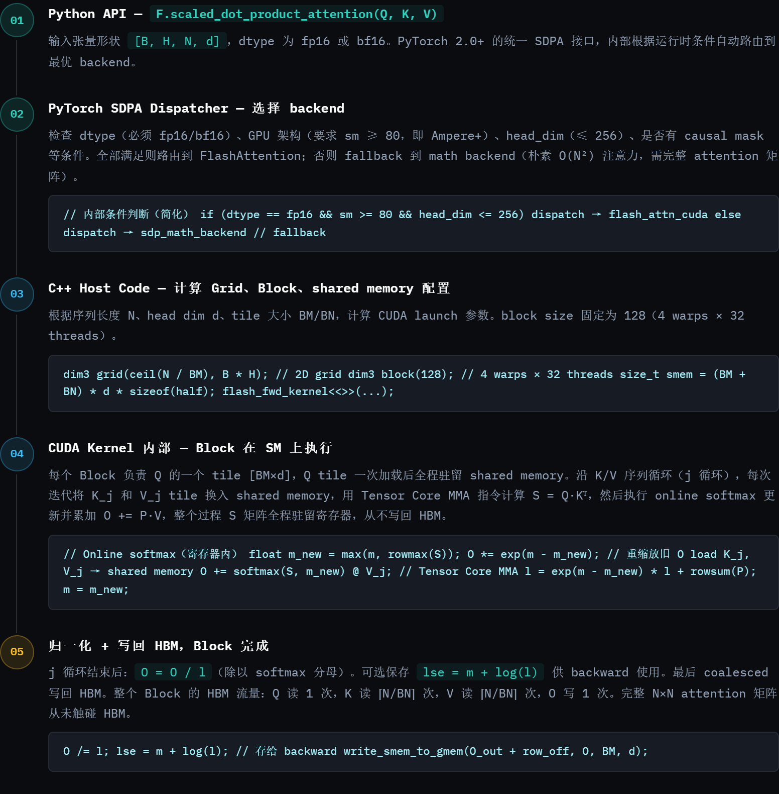

GPU · NPU · Kernel Engineering

# GPU Kernel 开发

*基础概念 → 深度优化*

覆盖执行层级模型、内存优化策略、torch.compile 编译路径、FlashAttention 完整执行链路，以及 NPU 架构差异。

**目录**

-   01 · 执行层级模型（指针，见执行模型权威页）
-   02 · 内存层级与访问
    -   Coalesced Access
    -   Shared Memory / Tiling
-   03 · Occupancy 与资源
-   04 · Warp Divergence
-   05 · Async Pipeline
-   06 · Tensor Core / MMA
-   07 · torch.compile 优化
    -   图断裂
    -   动态 Shape
    -   算子 Fusion
-   08 · FlashAttention 执行链路
    -   层级映射
-   09 · NPU 架构差异
-   10 · 诊断清单

## 01 执行层级模型

> CUDA 的执行模型（Grid → Block → Warp → Thread 四个逻辑层级如何映射到物理硬件 SM、为何 Warp 才是真正的执行单位）完整讲解见执行模型权威页 [[10_cuda_execution_model_guide]]；Grid/Block 维度与 GEMM Tiling 的映射关系（2D Grid 的 blockIdx.x/y 对应输出 tile 行列、K 维循环搬运）见 [[20_cuda_gemm_kernel_analysis]] §1。

## 02 内存层级与访问优化

> GPU 的内存层级从快到慢依次为：寄存器 → Shared Memory（SRAM）→ L1 Cache → L2 Cache → HBM（全局内存）。访问延迟差距高达 100 倍以上，内存访问模式是 kernel 性能的第一决定因素。

核心优化：Coalesced Access（合并访问）

### 让 warp 内相邻线程访问相邻地址

一个 warp 内 32 个线程的访存请求若地址连续且对齐（128 bytes），可合并为一次内存事务；否则触发多次独立事务，带宽利用率急剧下降。

Good：线程 t 访问 `A[t]`，连续对齐

```
int val = A[threadIdx.x];  // warp 内 32 个 thread 访问连续地址 → 1 次事务
```

Bad：跨步访问，触发 32 次独立事务

```
int val = A[threadIdx.x * stride];  // 地址散列 → 32 次事务，带宽浪费
```

---

Shared Memory Tiling

### 搬到片上，反复复用

核心流程：Global Memory → (DMA load) → Shared Memory → (compute) → Register → (store) → Global Memory。BM×BN 个线程共享一次 HBM 读取，片上完成计算后再写回。

Bank Conflict

### 避免 shared memory 串行化

Shared memory 分 32 个 bank，若 warp 内多线程访问同一 bank 的不同地址会串行执行。解决方式：padding，如 `float tile[32][33]`，末尾填充 1 列使行地址错开 bank 边界。

GEMM Tiling 伪代码

```
__shared__ half As[BM][BK], Bs[BK][BN];
// 避免 bank conflict：padding 1 列
__shared__ half As_pad[BM][BK+1];

for (int k = 0; k < K/BK; k++) {
    load_tile(As, A + row_off + k*BK, BM, BK);
    load_tile(Bs, B + k*BK*N + col_off, BK, BN);
    __syncthreads();
    // 片上 MMA，寄存器累加
    mma_sync(C_frag, As, Bs);
    __syncthreads();
}
write_tile(C + row_off*N + col_off, C_frag, BM, BN);
```

> **Tile 大小选择原则：**BM、BN 越大，arithmetic intensity 越高（每次 HBM 读取被更多线程复用），但 shared memory 用量越大，SM 上可并发的 Block 数越少（occupancy 下降）。A100 的 shared memory 最大 96KB 可配置，double buffering 下需留足 2×(BM+BN)×d×sizeof(half) 的空间。

## 03 Occupancy 与资源约束

> SM 同时驻留的 warp 数量越多，调度器切换 warp 的机会越多，越能隐藏内存访问延迟。但 occupancy 受三个硬件资源同时约束，取最紧的那个。

| 资源 | 约束来源 | 优化方向 |
| --- | --- | --- |
| **寄存器数量** | 每个线程寄存器越多，SM 上并发 warp 数越少（总量固定约 64K/SM） | 减少局部变量；避免不必要的临时中间值；用 `__launch_bounds__` 提示编译器 |
| **Shared Memory** | 每个 Block 用得越多，SM 上并发 Block 数越少 | 缩小 tile；使用 fp16 代替 fp32；调整 L1/shared 配比（`cudaFuncSetAttribute`） |
| **Block 内线程数** | 硬件限制 max threads/SM（A100：2048） | block size 选 128 或 256（4–8 个 warp），兼顾调度灵活性和资源用量 |

> **高 occupancy ≠ 高性能：**寄存器过多触发 register spill 到 local memory（属 HBM 层级，慢 100×），性能反而更差。应结合 roofline 模型判断实际瓶颈。分析工具：`nvcc --ptxas-options=-v` 查寄存器用量；NSight Compute 查 achieved occupancy。

## 04 Warp Divergence（分支发散）

> 同一 warp 的 32 个线程在 SIMT 模式下必须执行同一条指令。if/else 导致分支时，GPU 两条路都走，非活跃线程通过 predicate mask 屏蔽，实际吞吐减半或更低。

推荐写法

### 按 warp 边界对齐判断条件

```
// warp 内 0–15 号统一走一个分支
if (threadIdx.x < 16) { ... }
```

判断条件以 32 的倍数为界，保证同一 warp 内所有线程走同一条路，无发散。

避免写法

### 数据依赖的条件分支

```
// 每个线程 val 不同 → 每条路都执行
if (val > threshold) { ... }
```

warp 内线程各有不同的 val，两条分支均需执行，有效吞吐降低。

> 分析工具：NSight Compute 中的 `smsp__thread_inst_executed_per_inst_executed` 指标接近 1.0 表示发散少；接近 0.5 说明大量 warp 只有一半线程处于活跃状态。

## 05 异步 Pipeline（数据预取）

> Ampere 及以上架构（A100/H100）支持 `cp.async` 指令，在当前迭代计算的同时异步搬运下一块数据，消除"计算等 IO"的气泡。

软件 Pipeline 示意（double buffering）

```
Iteration N:   Compute tile[N]       |  Load tile[N+1] async (cp.async)
Iteration N+1: Compute tile[N+1]     |  Load tile[N+2] async
Iteration N+2: Compute tile[N+2]     |  Load tile[N+3] async
```

double buffering

### Ping-Pong 缓冲

在 shared memory 中分配两块 tile 缓冲区交替使用，一块计算时另一块在异步加载。代价是 shared memory 用量翻倍，需确认仍在 SM 容量内。

使用场景

### Triton / CUTLASS 已封装

Triton 的 `tl.load` 搭配 `prefetch` 提示，CUTLASS 3.x 的 Collective API，均封装了 `cp.async` pipeline。手写 CUDA 时需显式调用 `cuda::memcpy_async`。

## 06 Tensor Core / MMA 指令

> A100/H100 的 Tensor Core 通过 `wmma` 或底层 `mma.sync` 指令对特定形状做混合精度矩阵乘，FP16 吞吐比 CUDA Core 高约 16 倍。

| 架构 | 精度 | 指令形状（M×N×K） | 峰值吞吐 |
| --- | --- | --- | --- |
| A100 | FP16 / BF16 | 16×16×16 | 312 TFLOPS |
| A100 | INT8 | 16×16×32 | 624 TOPS |
| H100 | FP8 | 16×16×32 | ~1979 TFLOPS |
| H100 | FP16 | 16×16×16 | ~989 TFLOPS（SXM） |

> **使用 Tensor Core 的前提条件：**① 数据按 Tensor Core 要求的布局排列（`row_major` / `col_major`）；② tile 大小的 M、N、K 维度必须匹配指令支持的形状（M16N8K16 等）；③ FP16/BF16 精度。不满足时自动回退到 CUDA Core（SIMT FP32），吞吐大幅下降。

## 07 torch.compile 自动优化

> `torch.compile` 基于 TorchDynamo + Inductor，把 Python eager 图 capture 成 FX IR，再经过 Triton codegen 生成 GPU kernel。核心收益是算子 fusion，核心陷阱是图断裂。

主要性能陷阱：图断裂（graph break）

### 导致回退 eager 执行的常见场景

-   **Python 动态控制流**：FX 图无法静态表示依赖数据的 `if`、`while` 分支，遇到此类控制流时会自动断裂。
-   **访问 tensor 的 `.item()` 强制同步**：将标量拉回 CPU 会触发图断裂，常见于打印 loss、判断早停条件等场景。
-   **自定义 `autograd.Function` 未注册 FakeTensor**：形状推导失败会导致图断裂；需用 `torch.library.impl_abstract` 注册 meta kernel。
-   **不支持的 Python 内置操作**：Dynamo 无法 trace `len()`、`isinstance()` 等操作时会断裂；可用 `torch._dynamo.explain(fn)(...)` 定位具体原因。

定位图断裂

```
import torch._dynamo as dynamo
explanation = dynamo.explain(my_fn)(x)
print(explanation.break_reasons)  # 每处断裂的原因

# 或通过环境变量查看详细信息
# TORCH_COMPILE_DEBUG=1 python train.py
```

---

动态 Shape

### 避免频繁 recompile

默认 `torch.compile` 针对首次 shape 特化编译。batch size 变化时用 `dynamic=True`；用 `torch._dynamo.config.cache_size_limit` 控制缓存上限，每次 recompile 都有开销。

算子 Fusion

### 核心性能收益

Inductor 自动将 elementwise 操作（activation、add、mul 等）fuse 进同一 Triton kernel，减少 HBM 往返。`view`/`reshape` 有时阻断 fusion，保持 contiguous tensor 更友好。

编译模式选择

### mode 参数

`"reduce-overhead"`：减少 kernel launch overhead，适合小模型推理。`"max-autotune"`：对 BLOCK_M/N/K 做 autotuning 寻最优 tile size，编译慢但运行快，适合训练场景。

自定义算子兼容

### 注册 FakeTensor

CUDA 扩展（`torch.ops`）需通过 `register_fake` 或 `impl_abstract` 提供形状推导实现，否则 Dynamo 无法追踪形状，触发图断裂。

Triton Kernel Autotune 示例

```
@triton.autotune(
    configs=[
        triton.Config({'BLOCK_M': 128, 'BLOCK_N': 64,  'BLOCK_K': 32}, num_warps=4),
        triton.Config({'BLOCK_M': 64,  'BLOCK_N': 128, 'BLOCK_K': 32}, num_warps=8),
        triton.Config({'BLOCK_M': 128, 'BLOCK_N': 128, 'BLOCK_K': 64}, num_warps=8),
    ],
    key=['M', 'N', 'K'],
)
@triton.jit
def matmul_kernel(A, B, C, M, N, K, BLOCK_M: tl.constexpr, ...):
    ...
```

## 08 FlashAttention 完整执行链路

> 以 `F.scaled_dot_product_attention` 为入口，FlashAttention 经历五个层级的转换，最终在 GPU 的 SM 上执行。每一层都有明确的决策逻辑。



FlashAttention 中各层概念的完整映射：

| 层级 | FlashAttention 中的含义 | 关键数值（典型配置） |
| --- | --- | --- |
| **Grid（2D）** | `gridDim.x = ⌈N/BM⌉`（Q 序列分片）× `gridDim.y = B×H`（batch × head） | N=4096, BM=64, B=2, H=32 → grid=(64, 64) |
| **Block** | 负责一个 Q tile `[BM×d]`，遍历全部 K/V；驻留同一 SM | 128 threads（4 warps），BM=64 或 128 |
| **Shared Memory** | Q tile 全程驻留；K_j、V_j 每轮换入换出 | (64+64)×128×2 = 32 KB（double buffer = 64 KB） |
| **Warp（×4）** | 协作执行 `wmma::mma_sync`（Tensor Core 要求 warp-level 同步） | 4 warps = 128 threads |
| **Register** | O 累加器 fragment、l（归一化分母）、m（running max） | online softmax 的全部状态，从不溢出到 HBM |
| **Tile** | BM×BN 注意力分块；BM×d Q/O tile；BN×d K/V tile | BM=BN=64，d=128（标准 head dim） |

> **FlashAttention IO 复杂度降低的本质：**朴素 attention 需将 `[B,H,N,N]` 的 S 矩阵写回 HBM 再做 softmax，HBM 流量 O(N²)。FA 利用 online softmax 将 S 的整个生命周期锁在寄存器中，HBM 流量降为 O(N·d)，匹配 Q/K/V/O 本身的大小。IO 复杂度从 O(N²) 降至 O(N²·d / M)，其中 M 为 SRAM 大小。

## 09 NPU 架构差异

> NPU 的计算模型与 GPU 的 SIMT 有本质不同。以昇腾为代表的 NPU 采用显式数据搬运模型，编程粒度从线程上升到矩阵算子级别。

| 维度 | GPU（CUDA） | NPU（昇腾 / TPU 类） |
| --- | --- | --- |
| **执行模型** | SIMT，thread 级并行 | SIMD + 矩阵引擎，向量化编程 |
| **编程粒度** | thread / warp | cube（矩阵算子）/ vector |
| **内存层级** | HBM → L2 → L1/shared → RF | HBM → L2 → UB（片上统一缓冲区） |
| **数据搬运** | 隐式（访问全局地址即触发） | 显式 DMA（TIK/TBE 接口手动搬运） |
| **主要编程工具** | CUDA / Triton / CUTLASS | AscendCL / TBE / torch_npu |
| **torch.compile** | Inductor → Triton codegen | 图 capture 相似，codegen 走 CANN 体系 |

数据搬运显式化

### NPU 最大差异点

昇腾通常需要手动用 `tik` / `tbe` 的 DMA 接口把数据从 HBM 搬到 UB（统一缓冲区），等价于 GPU 上的 global → shared memory，但 NPU 上不写代码就不会发生搬运。

对齐要求严格

### 矩阵与向量对齐

昇腾 Cube Core 要求 M、N、K 维度按 **16 或 32 对齐**。Vector Core 要求数据按 **32B / 64B 对齐**，否则性能急剧下降。不满足时需要 pad 后再计算。

## 10 快速诊断清单

> 写完 kernel 后，按以下顺序逐步排查性能瓶颈。从宏观到微观，先确定瓶颈类型再针对性优化。

-   **Roofline 分析**：判断算子受 compute 还是 memory 限制。可使用 `ncu --metrics l1tex__t_bytes_pipe_lsu_mem_global_op_ld.sum,sm__cycles_active.avg`；若 arithmetic intensity 低于 roofline 交叉点，则属于 memory-bound，应优先优化访存。
-   **Coalescing 检查**：查看 NSight Compute 指标 `l1tex__t_sectors_pipe_lsu_mem_global_op_ld.sum` 与请求数之比。比值接近 1 表示合并良好；比值较高则存在跨步访问。
-   **Shared memory bank conflict 检查**：查看指标 `l1tex__data_bank_conflicts_pipe_lsu_mem_shared_op_ld.sum`。若存在冲突，应检查 tile 布局，并考虑增加 1 列 padding。
-   **Warp 效率检查**：查看分支发散指标 `smsp__thread_inst_executed_per_inst_executed`。接近 1.0 表示分支较少；接近 0.5 表示约一半线程被 mask。
-   **Occupancy 分析**：在 NSight Compute 的 Occupancy 面板中查看 achieved occupancy、theoretical occupancy 及其限制因素（寄存器 / shared mem / block size）。
-   **检查 torch.compile 的 fusion 是否生效**：用 `torch.profiler` + `export_chrome_trace` 查看 kernel launch 数量；kernel 数量较少通常说明 fusion 正常。用 `torch._dynamo.explain` 检查图断裂点。
-   **Register spill 检查**：编译时添加 `--ptxas-options=-v`，查看 "spills" 行。若发生 spill，应考虑拆分 kernel 或减少寄存器使用，而不是继续增大 tile。

> **通用优化优先级（经验顺序）：**① 修复 non-coalesced access → ② 引入 shared memory tiling → ③ 消除 bank conflict → ④ 减少 warp divergence → ⑤ 调整 occupancy（tile size / register 用量） → ⑥ 引入 async pipeline（cp.async）→ ⑦ 切换 Tensor Core MMA 指令。

GPU Kernel Engineering Reference · 内容来源：对话记录整理 · 所有技术细节均基于对话原文，未作增补

## Related Pages

- [[10_cuda_execution_model_guide]] — **执行模型权威页**：Grid / Block / Warp / Thread / SM 的执行模型地基（本页 §01 的完整展开版）
- [[11_operator_optimization_guide]] — **Roofline 权威页**：公式、Ridge Point 参数表、GPU/NPU profiling 指标
- [[20_cuda_gemm_kernel_analysis]] — SM80 生产级 GEMM 的完整切分、流水、寄存器与 epilogue
- [[21_cuda_nonmatmul_kernels_analysis]] — 非 GEMM 算子的 roofline 与数据依赖分类
- [[22_ascend_kernel_execution_model_analysis]] — DaVinci AI Core、显式缓冲链与 Cube–Vector 路径
- [[triton/index]] — Triton 从入门到优化的学习路线
- [[02_engineering/05_gpu_kernel/index|GPU Kernel 开发]] — GPU Kernel 领域索引
