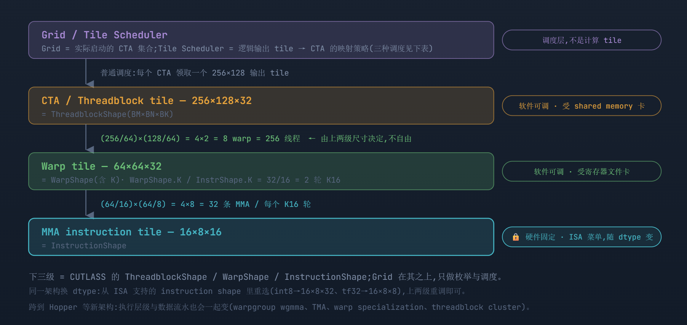
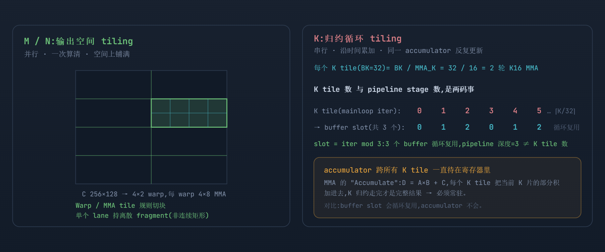
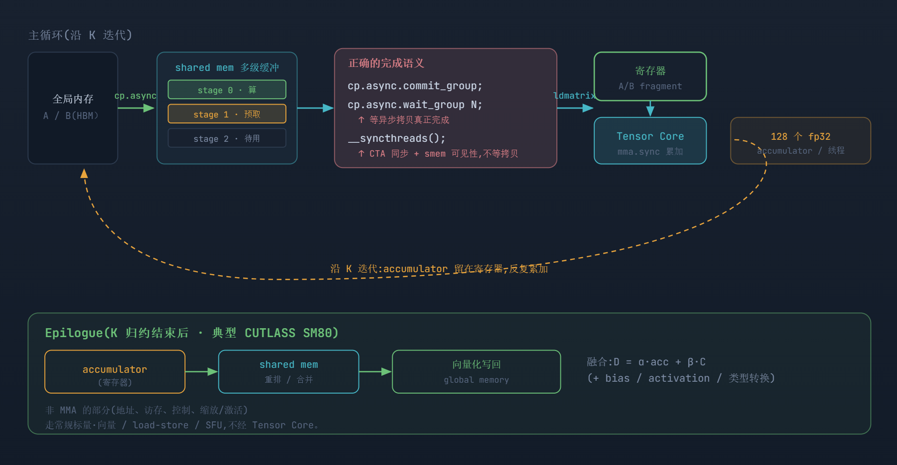
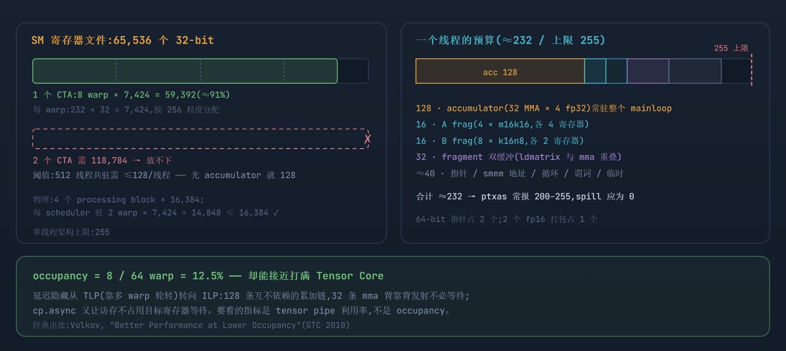

# 生产级 CUDA GEMM 完整解读：执行模型 · 寄存器 · 代码

> **Source baseline**: `raw/02_engineering/05_gpu_kernel/cuda_gemm_final.html`，本地快照 2026-07-22，SHA-256 `56f589a025ebf39622fdd224a6a49ef1e234466b51d5f4af10b64368ac2f85b0`
> **Dimension**: Deep Dive（mechanism-level）
> **Updated**: 2026-07-22
>
> 本页由原始 HTML 完整转换；各节的 `Source locator` 指向不可变 raw 文件中的 HTML 行号。文中硬件数值与性能判断以该 A100 / SM80 代表性配置为边界，不外推到其他架构。

以一个生产级 FP16 Tensor Core GEMM 为主线,完整走一遍 CUDA 编程模型的四个层面:软件层(grid / block / thread)、硬件层(SM / warp / Tensor Core)、内存层(global / shared / register)、指令层(cp.async / ldmatrix / mma.sync)——从执行模型讲到可对照的 kernel 代码。

代表性配置(CUTLASS 风格 SM80):CTA **256×128×32** · Warp **64×64×32** · MMA **m16n8k16** · **8 warp / 256 线程** · FP16 → FP32

> **一句话总纲:** tile 大小和线程数不是一一对应,但也*不是完全独立*。生产 kernel 由 **CTA tile、warp tile、MMA shape、pipeline stage 数和硬件资源约束**共同定死执行配置——没有哪个是能单独随便拧的旋钮。另有两条最易混淆的分界:**K tile(⌈K/32⌉ 个 mainloop 迭代)≠ pipeline stage(3 个循环复用的 buffer slot)**;**Grid(实际启动的 CTA 集合)≠ Tile Scheduler(逻辑 tile → CTA 的映射策略)**。

## 1. 四层结构：Grid（调度）→ CTA → Warp → MMA

> **Source locator**: `cuda_gemm_final.html:83-155`

真正的计算 tile 只有下面三级(= CUTLASS 的三个 Shape);*Grid 在它们之上,只负责枚举和调度输出 tile,本身不是更小一级的计算 tile*。三级里只有最底层 MMA 是硬件固定的。



调度层(非计算 tile） 软件可调(shared mem 约束） 软件可调(寄存器约束） 硬件固定(ISA）

定死 warp 数和线程数的,是 CTA tile ÷ warp tile 这个比值;所以线程数是被上两级尺寸推导出来的,不是独立选的。

> 调度 · Grid ≠ Tile Scheduler **Grid ≠ Tile Scheduler,三种调度也不能套同一个 gridDim。** 只有*普通直接调度*才是"一 CTA 一 tile";split-K 让多个 CTA 分担同一个输出 tile 的不同 K 段(还要事后归约),persistent 则只启动接近硬件可驻留数量的 CTA、每个在循环里算多个 tile。

| 调度 | CTA ↔ 输出 tile | Grid 规模 / 额外结构 |
| --- | --- | --- |
| 普通(direct) | 1 CTA ↔ 1 个 M×N tile | gridDim = (⌈N/128⌉, ⌈M/256⌉) |
| split-K | 多个 CTA 分担同一 M×N tile 的不同 K 段 | 多一个 K 分区维度 + 事后归约 kernel |
| persistent | 1 CTA 循环领取并计算多个 tile | 启动 CTA 数 ≈ 硬件可驻留 CTA 数 |

## 2. M/N 是空间切块,K 是循环归约 —— 别都当成"尺寸相乘"

> **Source locator**: `cuda_gemm_final.html:156-222`

三级尺寸的"乘法关系"只对 *M/N 方向*成立。*K 方向不是把不同 warp 在空间上排列,而是时间上的循环累加*。这是读懂 GEMM kernel 最重要的一条分界。



M/N 空间 tile(并行） K tile / buffer slot 常驻 accumulator

M/N:把输出切块,一次并行算清。K:沿时间循环归约,把部分积不断累加进同一批寄存器 accumulator。

## 3. 完整数据流：cp.async 的正确完成语义 + epilogue

> **Source locator**: `cuda_gemm_final.html:223-297`

两条容易搞错的语义:① `__syncthreads()` *不能单独*作为 cp.async 的完成机制——异步拷贝要靠 `commit_group` / `wait_group` 等待;`__syncthreads()` 负责 CTA 级同步与 shared memory 可见性,但不等拷贝完成;② 结果不是从寄存器直接写回全局内存,典型情况下(如 CUTLASS SM80)中间还有一个 epilogue。



完成语义 epilogue 常驻 accumulator

wait_group 等异步拷贝完成,__syncthreads 做 CTA 同步 + shared mem 可见性(不等拷贝)——两者分工。epilogue 里 accumulator 先经 shared mem 重排,再融合 α/β/bias/激活,向量化写回。

## 4. 寄存器：accumulator、fragment 与 occupancy 的完整账本

> **Source locator**: `cuda_gemm_final.html:298-383`

**寄存器是什么。**每个线程私有、无额外访问延迟的存储,由编译器(ptxas)在编译期静态分配,kernel 里的每个标量变量、数组元素、地址、临时值都要落在这里。A100 每个 SM 有 **65,536 个 32-bit 寄存器**(256 KB),物理上分属 4 个 processing block(各 16,384);分配以 *warp* 为单位(粒度 256 个),单线程架构上限 **255**。换算规则:1 个 fp32 占 1 个寄存器;2 个 fp16 打包占 1 个;64-bit 指针占 2 个。

**fragment:每个 lane 分到的那一小片。**一条 `m16n8k16` 由 warp 的 32 个线程协作完成,操作数按硬件规定布局摊到各 lane(不是连续小块):

| fragment | 每线程持有 | 占用寄存器 | 来源 |
| --- | --- | --- | --- |
| A frag | 8 × fp16 | 4 | 16×16 A 块的 256 元素 ÷ 32 lane |
| B frag | 4 × fp16 | 2 | 16×8 B 块的 128 元素 ÷ 32 lane |
| C/D frag | 4 × fp32 | 4 | 16×8 C 块的 128 元素 ÷ 32 lane |

**逐项算账:一个线程的 ≈232 个寄存器花在哪。**

> **① accumulator = 128,一个都省不掉。**两种算法殊途同归:warp tile 64×64 = 4,096 个 fp32 输出 ÷ 32 lane = 128 个/线程;或者 4×8 = 32 条 MMA × 每条 C frag 4 个 fp32 = 128。因为 MMA 的 accumulate 语义(D = A×B + C),这 128 个必须*常驻整个 K 循环*——从第一个 K tile 到最后一个,期间不能被挪作他用。这就是寄存器预算的地板。

> **② A/B fragment = 32(双缓冲则 64)。**每轮 K16,warp 要用 4 个不同的 A 块(沿 M)+ 8 个不同的 B 块(沿 N):每线程 4×4 + 8×2 = 32 个寄存器。若做 fragment 双缓冲——边对下一轮做 ldmatrix、边对本轮做 mma——则 ×2 = 64。

> **③ 地址与杂项 ≈ 25–45。**A/B/C 的全局指针(64-bit,各占 2)、shared memory 地址、循环计数、stage 序号、边界谓词、临时值。

> **合计 ≈ 185–235;ptxas 实报常在 200–255。**这就是前文"128–255 寄存器/线程"的完整来历——128 是 accumulator 铺的地板,其余是操作数与控制的天花板。



accumulator A/B fragment fragment 双缓冲 地址 / 控制

左:65,536 的寄存器文件被 1 个 CTA 吃掉 91%,第 2 个 CTA 的门槛(128/线程)被 accumulator 一项顶死。右:232 的逐项构成。下:低 occupancy 靠 ILP 补。

> 两个实践要点 **① 别硬压寄存器换 occupancy。**用 `maxrregcount` / `__launch_bounds__` 压下去的部分会 spill 到 local memory——名字里有 local,实际是*线程私有的全局内存*(经 L1/L2 缓存);内环里每次 spill/reload 都是一次访存,通常比低 occupancy 更慢。真要降寄存器压力,应整体换小一号 warp tile(如 64×64 → 64×32)重新调形。**② 纸面账必须用工具确认。**`ptxas -v` 看 registers / spill loads / spill stores(spill 应为 0);Nsight Compute 看 achieved occupancy(此类 kernel ~12.5% 属正常)与 tensor pipe active。shared memory 侧同理:A100 单 SM 最高 164 KiB,单个 CTA 上限 163 KiB。

## 5. 每一级由谁定、谁被谁推导

> **Source locator**: `cuda_gemm_final.html:384-402`

| 层级 | 本例 | 可调? | 被谁约束 / 如何被推导 |
| --- | --- | --- | --- |
| Grid | ⌈N/128⌉×⌈M/256⌉ | 调度策略 | 由问题尺寸 + CTA tile 推出;persistent / split-K 在此决定 |
| ThreadblockShape | 256×128×32 | ✓ 软件 | 主要受 shared memory:缓冲 ≈ 每级 payload 24KiB × slot 数,须满足单 CTA 上限 163KiB + padding |
| WarpShape | 64×64×32 | ✓ 软件 | 主要受寄存器;与 CTA tile 一起**决定 warp 数 = 8 → 线程数 = 256** |
| InstructionShape | 16×8×16 | ✗ 硬件 | ISA 固定,随 dtype 变(int8→16×8×32,Hopper→wgmma) |
| 线程数 | 256 | 被推导 | \= (BM/WM)×(BN/WN)×32,不是独立旋钮 |

> 表里的"主要约束"只是主导因素。实际上 CTA tile 与 warp tile **共同**影响数据复用、并行度、寄存器占用、shared memory 用量和 occupancy——是耦合的,要一起权衡,不是各自只受一种资源限制。

> 代表性 ≠ 标准 **这只是一个有代表性的配置,不是唯一"标准"。** 生产库(cuBLAS / CUTLASS）会为同一个 GEMM 准备一堆候选:`128×128×32`、`128×256×32`、`256×128×32`、`64×128×64` …… 再按 M/N/K 尺寸、A/B 布局、对齐、dtype、shared mem、寄存器压力、occupancy、split-K / persistent 调度和*实测 benchmark* 选择。不存在一个 tile 尺寸适合所有 GEMM。

## 6. 生产级 kernel 代码解析：从理论到实践

> **Source locator**: `cuda_gemm_final.html:403-530`

把前五章落成代码。下面是一个**教学精简、结构生产级**的 SM80 kernel:保留生产实现的全部骨架——多级 cp.async 流水、ldmatrix、内联 mma.sync、经 shared memory 的 epilogue——省略 swizzle、边界谓词等细节(6.7 列了完整差距清单)。每段代码后紧跟解读。

### 6.1 配置与 shared memory 布局

> **Source locator**: `cuda_gemm_final.html:406-427`

```
// —— 与全文一致的三级 Shape ——
constexpr int BM=256, BN=128, BK=32;      // ThreadblockShape
constexpr int WM=64,  WN=64;              // WarpShape(M,N);K 维 = BK
constexpr int STAGES=3;                   // 流水深度 = buffer slot 数
constexpr int WARPS=(BM/WM)*(BN/WN);      // 4×2 = 8 —— warp 数被推导
constexpr int THREADS=WARPS*32;           // 256 —— 线程数被推导

// smem 超过 48 KiB,必须用动态分配 + opt-in(生产必备细节)
// host 侧:cudaFuncSetAttribute(kernel,
//            cudaFuncAttributeMaxDynamicSharedMemorySize, SMEM_BYTES);
extern __shared__ __half smem[];
// 教学版:行末 +8 半精度 padding 抗 bank conflict(生产版用 XOR swizzle,不胀容量)
// sA[STAGES][BM][BK+8] ≈ 60 KiB;sB[STAGES][BK][BN+8] ≈ 25.5 KiB;共 ≈85.5 ≤ 163 KiB
auto sA = (__half (*)[BM][BK+8]) smem;
auto sB = (__half (*)[BK][BN+8]) (smem + STAGES*BM*(BK+8));

// 每个 warp 在 CTA tile 内的坐标(4×2 排布)
int warp_id = threadIdx.x / 32, lane = threadIdx.x % 32;
int warp_m = warp_id % 4, warp_n = warp_id / 4;   // 该 warp 负责 (warp_m*64, warp_n*64)
```

> 对照第 1 章:warp 数与线程数不是选的,是 `(BM/WM)×(BN/WN)` 推导出来的。对照第 4 章:padding 版 smem ≈85.5 KiB,这就是为什么生产版要用 swizzle——同样功能不胀容量(72 KiB),给更深的流水留空间。

### 6.2 Global → Shared：cp.async 搬运层

> **Source locator**: `cuda_gemm_final.html:428-452`

```
__device__ __forceinline__ void cp_async_16B(void* dst_smem, const void* src_gmem) {
  uint32_t s = __cvta_generic_to_shared(dst_smem);
  asm volatile("cp.async.cg.shared.global [%0], [%1], 16;\n" :: "r"(s), "l"(src_gmem));
}
// 搬运量:A 块 256×32 fp16 = 16 KiB → 256 线程 × 4 次 16B
//        B 块 32×128 fp16 =  8 KiB → 256 线程 × 2 次 16B
__device__ void load_tile_async(int slot, int kt, const __half* A, const __half* B,
                                int K, int N, int bm0, int bn0) {
  // 分工按「合并访存」定:相邻线程搬相邻 16B —— 与它待会儿算哪块 C 无关
  // A:每线程 4 行片段(行 = tid/4,列 = (tid%4)*8,跨 64 行 ×4)
  #pragma unroll
  for (int i = 0; i < 4; ++i) {
    int r = (threadIdx.x / 4) + i * 64, c = (threadIdx.x % 4) * 8;
    cp_async_16B(&sA[slot][r][c], &A[(bm0 + r) * K + kt * BK + c]);
  }
  // B:每线程 2 行片段(行 = tid/16,列 = (tid%16)*8,跨 16 行 ×2)
  #pragma unroll
  for (int i = 0; i < 2; ++i) {
    int r = (threadIdx.x / 16) + i * 16, c = (threadIdx.x % 16) * 8;
    cp_async_16B(&sB[slot][r][c], &B[(kt * BK + r) * N + bn0 + c]);
  }
}
```

> 对照第 3 章:`cp.async` 直通 shared memory、不过普通寄存器——所以第 4 章的预算里没有"staging 数据"这一项,访存不占记分板。"搬运的线程分工"与"计算的线程分工"是两套独立映射:搬按合并定,算按 fragment 定。

### 6.3 Prologue：预填流水

> **Source locator**: `cuda_gemm_final.html:453-460`

```
// 先填 STAGES-1 = 2 个 slot,留 1 个手位给循环内的持续预取
#pragma unroll
for (int s = 0; s < STAGES-1; ++s) {
  load_tile_async(s, s, A, B, K, N, bm0, bn0);
  asm volatile("cp.async.commit_group;\n");       // 每个 slot 一组
}
```

### 6.4 Mainloop：wait → ldmatrix → mma → prefetch

> **Source locator**: `cuda_gemm_final.html:461-488`

```
float acc[4][8][4] = {};                    // 128 个 fp32,第 4 章的"地板",常驻到底

for (int kt = 0; kt < K / BK; ++kt) {
  asm volatile("cp.async.wait_group %0;\n" :: "n"(STAGES-2)); // 允许 1 组在途
  __syncthreads();                          // slot kt%3 已就绪且全员可见
  int slot = kt % STAGES;

  #pragma unroll
  for (int kk = 0; kk < BK/16; ++kk) {     // 每个 K tile = 2 轮 K16(第 2 章)
    uint32_t a[4][4], b[8][2];
    // A:4 次 ldmatrix.x4(每次装 1 个 m16k16 的 warp fragment)
    // B:4 次 ldmatrix.x4.trans(每次装 2 个 k16n8;mma 的 .col 形态)
    ldmatrix_A(a, &sA[slot][warp_m*WM][kk*16]);
    ldmatrix_B(b, &sB[slot][kk*16][warp_n*WN]);
    #pragma unroll
    for (int m = 0; m < 4; ++m)
      #pragma unroll
      for (int n = 0; n < 8; ++n)
        mma_16816(acc[m][n], a[m], b[n]); // 32 条 mma.sync,铺满 64×64
  }

  int nxt = kt + STAGES - 1;                // 预取的 K tile 序号
  if (nxt < K / BK) load_tile_async(nxt % STAGES, nxt, A, B, K, N, bm0, bn0);
  asm volatile("cp.async.commit_group;\n"); // 尾部空组也提交,保持 wait 计数节奏
}
```

> **为什么这样是对的(slot 复用不变量)。**迭代 kt 里正在写的 slot 是 `(kt+2)%3 = (kt-1)%3`——恰是上一轮迭代读的那个;而本轮开头的 `wait_group + __syncthreads` 是全员栅栏,保证所有线程都已完成上一轮的读,才可能有人开始覆写。读的 slot(`kt%3`)与写的 slot 永远错开。这就是第 2 章"K tile 数 ≠ pipeline stage 数"在代码里的样子:kt 跑 ⌈K/32⌉ 轮,slot 只有 3 个循环转。生产实现用 `cuda::pipeline` / named barrier 把这个栅栏做得更细(producer/consumer 分开),原理相同。

### 6.5 两条核心指令的内联 PTX

> **Source locator**: `cuda_gemm_final.html:489-503`

```
// mma:D = A×B + C,C/D 同址 → "+f" 就是 accumulate 语义本身(第 2 章)
__device__ __forceinline__ void mma_16816(float c[4], const uint32_t a[4], const uint32_t b[2]) {
  asm volatile(
    "mma.sync.aligned.m16n8k16.row.col.f32.f16.f16.f32 "
    "{%0,%1,%2,%3}, {%4,%5,%6,%7}, {%8,%9}, {%0,%1,%2,%3};\n"
    : "+f"(c[0]), "+f"(c[1]), "+f"(c[2]), "+f"(c[3])
    : "r"(a[0]), "r"(a[1]), "r"(a[2]), "r"(a[3]), "r"(b[0]), "r"(b[1]));
}
// ldmatrix:warp 协作,把 smem 里 4 个 8×8 b16 矩阵按 mma 需要的布局装进各 lane
// lane i 提供第 i 行的 smem 地址;B 用 .trans 变体(装出 .col 形态)
asm volatile("ldmatrix.sync.aligned.m8n8.x4.shared.b16 {%0,%1,%2,%3}, [%4];\n"
             : "=r"(r0), "=r"(r1), "=r"(r2), "=r"(r3) : "r"(addr));
```

> 操作数形状与第 4 章 fragment 表逐位对上:A 4 个 .b32 = 8 fp16;B 2 个 .b32 = 4 fp16;C/D 4 个 .f32。每轮 K16 的寄存器账:4 次 ldmatrix.x4 → a\[4\]\[4\] = 16 个;4 次 → b\[8\]\[2\] = 16 个。`"+f"` 读改写约束让 accumulator 从头到尾待在原寄存器里——这就是"常驻"在指令层的实现。生产 kernel 最烧脑的部分在 ldmatrix 的*地址计算*:swizzle 布局下每个 lane 的行地址要做 XOR 变换,教学版用 padding 绕开了它。

### 6.6 Epilogue：重排与写回

> **Source locator**: `cuda_gemm_final.html:504-515`

```
// K 归约结束,acc 里是最终值,但 fragment 布局是离散的(第 4 章)→ 直写全局必然不合并
__syncthreads();                              // mainloop 结束,smem 可整体挪用作 staging
float* stage = reinterpret_cast<float*>(smem);
for (int pass = 0; pass < PASSES; ++pass) {  // 分批:如每批 64 行(64×128×4B = 32 KiB)
  // ① 各 warp 把本批的 acc 按 fragment→行主序写入 stage(离散写,片上无所谓)
  // ② __syncthreads()
  // ③ 按合并布局读出:D = alpha*acc + beta*C(+bias/激活/类型转换)
  // ④ float4 向量化写回 global;__syncthreads() 进下一批
}
```

> 对照第 3 章的 epilogue 带:离散→合并的转换发生在片上(shared memory 随便乱序,全局内存必须合并),这就是"先经 smem 重排"的全部理由。α/β/bias/激活在 ③ 融合,省一次独立的 elementwise kernel。

### 6.7 验证、对照 CUTLASS、教学版与生产版的差距

> **Source locator**: `cuda_gemm_final.html:516-530`

**编译验证:**`ptxas -v` 应看到 registers/thread ≈ 200–255、spill loads/stores = 0、smem ≈ 85 KiB(swizzle 版 72 KiB)。**运行验证:**Nsight Compute 看 tensor pipe active(应高)、achieved occupancy(≈12.5%,正常)、long scoreboard stall(应低——cp.async 在干活的证据)。

| 本文的块 | CUTLASS 3.x 里的对应物 |
| --- | --- |
| 6.2–6.4 mainloop(cp.async 多级流水) | CollectiveMainloop(SM80 multistage) |
| 6.5 ldmatrix + mma 组合 | TiledMMA / MMA Atom(CuTe) |
| 6.1 smem 布局(padding→swizzle) | cute::Layout + Swizzle |
| 6.6 epilogue | CollectiveEpilogue / EVT 融合树 |
| 第 1 章 Grid / 调度 | TileScheduler(persistent / stream-K) |

> **教学版刻意省略、生产版必有的东西:**边界与非对齐处理(带谓词的 cp.async,越界 zfill 补零;K 余数轮);XOR swizzle 取代 padding;`cuda::pipeline` / named barrier 取代粗粒度 __syncthreads(producer/consumer 分离);split-K / stream-K / persistent 调度;epilogue 的完整融合;dtype × layout × 对齐的模板特化与自动调参选型。骨架相同,工程量在这些"边角"里。

## 7. 完整执行模型

> **Source locator**: `cuda_gemm_final.html:531-551`

```
# 问题:C[M,N] = A[M,K] × B[K,N]

1. 选一个代表性配置        CTA 256×128×32 · Warp 64×64×32 · MMA 16×8×16
2. Grid 枚举输出 tile       普通调度:gridDim = (⌈N/128⌉, ⌈M/256⌉)  # split-K / persistent 另算
3. 一个 CTA 负责 256×128     4×2 warp = 8 warp = 256 线程    # 线程数被推导
4. 沿 K 循环(mainloop)     共 ⌈K/32⌉ 个 K tile;每个 K tile = 2 轮 K16;cp.async 预取 A[256,32]、B[32,128]
5. pipeline 缓冲            3 个 shared buffer slot 循环复用(深度=3 ≠ K tile 数);commit/wait_group 等拷贝 + __syncthreads
6. 每 warp 每个 K16 轮        执行 4×8 = 32 条 m16n8k16 MMA(空间上铺满 64×64)
7. 累加器常驻                每线程 128 个 fp32 accumulator,跨所有 stage 反复更新
8. Epilogue                  acc → shared mem 重排 → α·acc+β·C(+bias/act)→ 向量化写回 global
```

> **回到最初的问题链:** Grid 决定有多少 CTA 任务;CTA 负责较大的输出 tile;warp 负责 CTA tile 的一部分;*MMA 才是 Tensor Core 真正执行的最小矩阵运算*。而"tile 大小 ≠ 线程数,但也不独立"——是这套模型里最容易说错、也最该记住的一句。

---

A100 / SM80 · FP16 GEMM · 代表性配置 256×128×32 / 64×64×32 / 16×8×16 · 图为示意,简化绘制;代码为教学精简版,结构与生产实现一致(差距见 6.7)。
参考:[CUTLASS Efficient GEMM](https://docs.nvidia.com/cutlass/latest/media/docs/cpp/efficient_gemm.html) · [CUTLASS GEMM API](https://docs.nvidia.com/cutlass/latest/media/docs/cpp/gemm_api.html) · [PTX ISA: cp.async](https://docs.nvidia.com/cuda/parallel-thread-execution/index.html#data-movement-and-conversion-instructions-cp-async) · [PTX ISA: mma m16n8k16 fragments](https://docs.nvidia.com/cuda/parallel-thread-execution/index.html#matrix-fragments-for-mma-m16n8k16-with-floating-point-type) · [Ampere Tuning Guide](https://docs.nvidia.com/cuda/ampere-tuning-guide/index.html) · Volkov, Better Performance at Lower Occupancy(GTC 2010)

## Related Pages

- [[10_cuda_execution_model_guide]] — CUDA Grid / Block / Warp / SM 的执行模型地基
- [[21_cuda_nonmatmul_kernels_analysis]] — 同一执行模型下，非 GEMM 算子的依赖驱动优化轴
- [[22_ascend_kernel_execution_model_analysis]] — 把 GEMM 主线映射到 Cube / L0 / MTE / FixPipe
- [[01_gpu_kernel_guide]] — GPU/NPU Kernel 工程总览
- [[triton_12_matmul_guide]] — Triton 分块矩阵乘的可运行实现
- [[triton_13_autotune_guide]] — tile、warp 与 stage 的自动调优
- [[02_engineering/05_gpu_kernel/index|GPU Kernel 开发]] — GPU Kernel 领域索引
