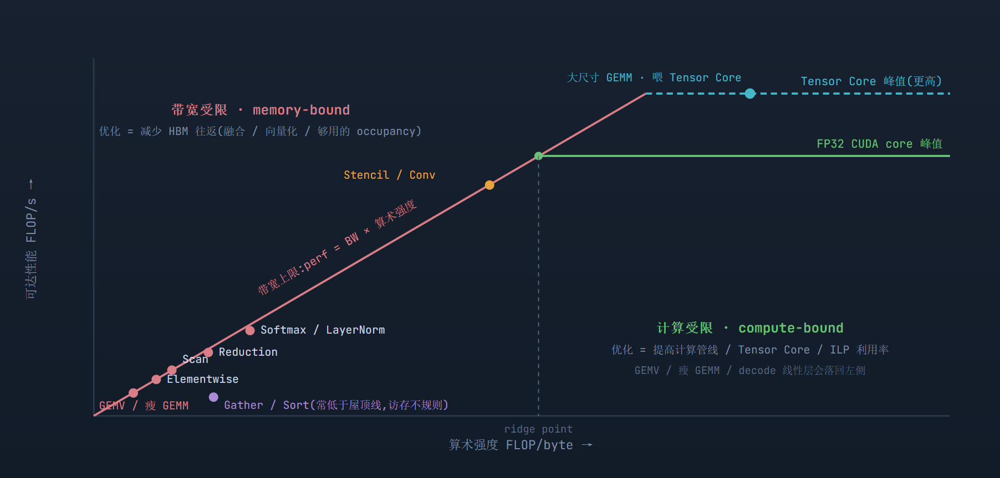
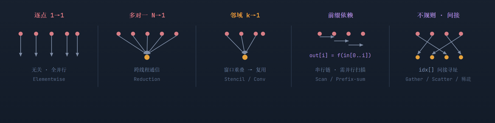
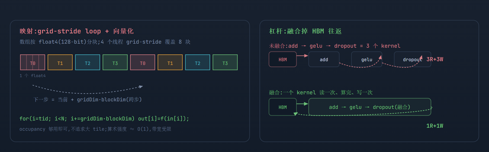
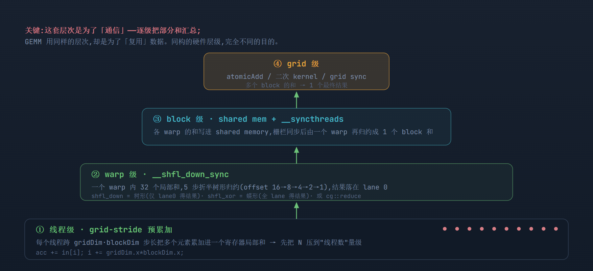
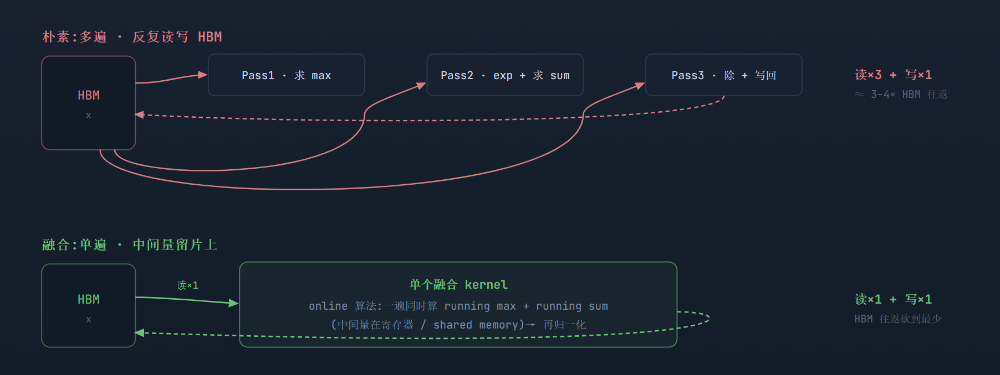
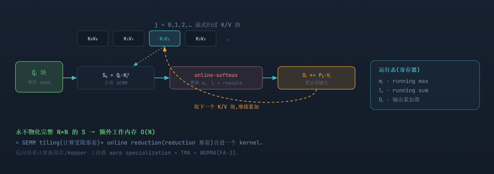
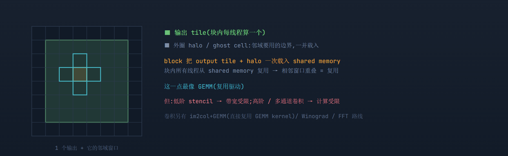
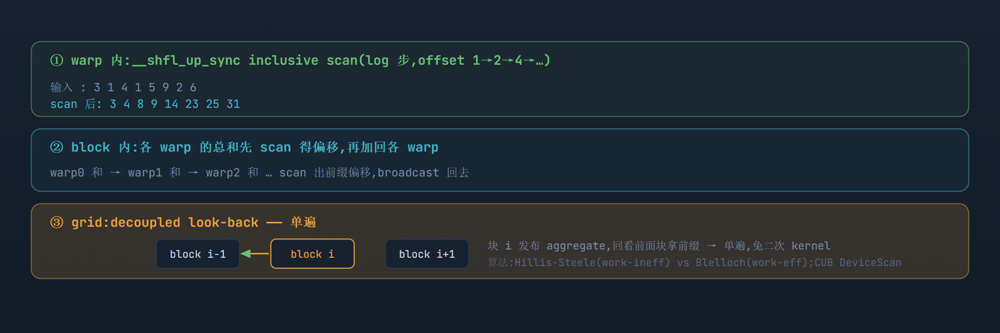
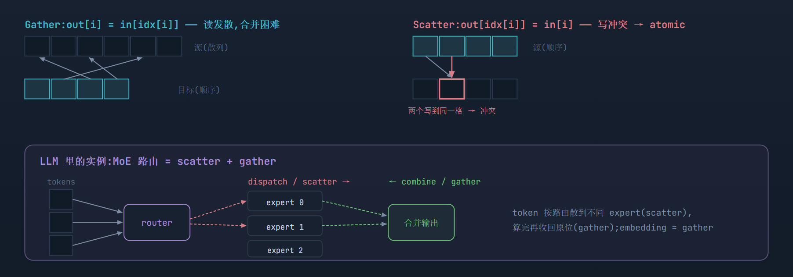

# 非 GEMM 类算子:统一的执行模型,不同的优化逻辑

> **Source baseline**: `raw/02_engineering/05_gpu_kernel/cuda_nonmatmul_kernels_final.html`，本地快照 2026-07-22，SHA-256 `ba1ce1f99adf1d9921da29e73485ecc1239238fe133b27fb05e84d883f7bdb02`
> **Dimension**: Deep Dive（mechanism-level）
> **Updated**: 2026-07-22
>
> 本页由原始 HTML 完整转换；各节的 `Source locator` 指向不可变 raw 文件中的 HTML 行号。roofline 图与算子位置是定性模型，除非正文另行给出，不代表实测性能。

grid / block / thread / warp / SM、SIMT、合并访存、occupancy 这一层,任何 kernel 都一样。但 GEMM 那套打法(shared memory 分块复用、warp tile、MMA、寄存器分块、多级流水)是"计算受限 + 高复用"这一特定处境的产物,换到别的算子基本不迁移。

> **第一层分类,看两个首要维度:** ① *算术强度(FLOP/byte)→ roofline 位置*:计算受限还是访存受限;② *数据依赖模式*:逐点无关 / 多对一通信 / 邻域复用 / 前缀依赖 / 不规则。这两个维度定下 kernel 的*基本结构*;实际调优还受问题规模与 shape、可用并行度、launch 开销、原子竞争、warp divergence、缓存命中、执行管线差异、数值确定性等影响(散见各节"坑")。GEMM 恰好是"高算术强度 + 强复用"的角落,大多数其他算子落在另一头。

## 1. 先定位:roofline 上,大多数非 GEMM 算子在左边

> **Source locator**: `cuda_nonmatmul_kernels_final.html:74-127`

屋顶线把算子分成两个世界。*左侧带宽受限(斜线区)*:性能上限 = 带宽 × 算术强度,你只是在搬数据,优化=减少 HBM 往返;*右侧计算受限(水平屋顶区)*:算术吞吐成为上限——数据复用已让每字节对应足够多的计算,继续省 HBM 流量收益有限,优化重点转为计算流水线 / Tensor Core / ILP 的利用率。*大尺寸、形状良好的* GEMM 通常在最右(靠 Tensor Core 把天花板顶得更高);但 GEMV、瘦 GEMM、小 batch、decode 阶段的线性层会落回左侧甚至 latency-bound——位置取决于形状,不取决于算子名字。elementwise / reduction / softmax / scan 挤在最左。

访存受限算子 可计算受限(有复用） 计算受限(GEMM） 不规则(常在屋顶线下）

同一条带宽斜线,两级计算天花板。Tensor Core 把 GEMM 的天花板顶高、把 ridge 推右;左侧算子受斜线约束,再优化也只能贴着带宽跑。

## 2. 再看依赖:五种数据依赖形状,五套 kernel 结构

> **Source locator**: `cuda_nonmatmul_kernels_final.html:128-195`

算子之间真正的区别是*数据依赖*——一个输出要看哪些输入。形状不同,能不能并行、要不要跨线程通信、能不能复用,就全不同。

依赖形状定下 kernel 的基本结构:1→1 全并行(无复用);N→1 必须通信;邻域重叠才有复用(像 GEMM);前缀是串行链(⊗ 需结合律);不规则靠间接寻址。

> 下面把每一类都按"依赖 → kernel 结构 → 关键技术 → 坑"展开,各配一张图。reduction 与 softmax 的详图见后续小节。

## 3. Elementwise:全并行,瓶颈是带宽 // 激活、加、缩放、cast、dropout

> **Source locator**: `cuda_nonmatmul_kernels_final.html:196-259`

**依赖**:无,每个输出只看对应输入,embarrassingly parallel。**结构**:grid-stride loop,一套 launch 配置吃任意 N,还便于线程复用、摊薄启动开销。**关键技术**:① 合并访存优先——warp 内相邻线程访问相邻地址即可形成完全合并的内存事务,*标量 float 也能打满带宽*;在对齐与尾部处理允许时,`float4`/128-bit 向量化能进一步减少指令数、地址计算与循环开销,是有益的优化而非达到高带宽的必要条件;② occupancy 只要"够用"盖住访存延迟即可,不追求最大化、更不追求大 tile;③ 最大杠杆是 *融合*——把一串 elementwise、或并进 GEMM 的 epilogue、或并进 norm/reduction,合成一个 kernel,省掉反复读写 HBM。**坑**:elementwise 往往不值得单独成 kernel——编译器(Triton / Inductor)会把它并进相邻算子;瓶颈是 HBM 带宽,不是算力。GEMM 的 warp tile / MMA 在这里一个都用不上。

float4 / grid-stride 分配 未融合(HBM 往返多) 融合(1 读 1 写)

每线程跨步搬多个 float4,一套配置吃任意 N;真正省时间的是把相邻 elementwise 融成一个 kernel。

## 4. Reduction:多对一通信,四级漏斗 // sum、max、norm、softmax 分母

> **Source locator**: `cuda_nonmatmul_kernels_final.html:260-311`

**依赖**:多对一,*必须跨线程通信*——最能体现 warp/block/SM 层次的非 GEMM 算子,但用这套层次是为了逐级汇总部分和(通信),不是复用数据。**结构**:四级漏斗(下图)。**关键技术**:warp 级用 shuffle(`shfl_down`,折半树形)避开 shared memory;block 级注意 bank conflict 与 `__syncthreads`;grid 级 `atomicAdd` 有争用,大规模用分层 partial reduction、二次 kernel 或 CUB `DeviceReduce`(注意:decoupled look-back 是 `DeviceScan` 的全局前缀传播算法,不要把它安到普通 DeviceReduce 头上,见 §8);每线程先 grid-stride 预累加以减小树深。**坑**:浮点归约*不满足结合律*,原子加的累加顺序不定 → 结果位级不可复现,训练要确定性时得用固定归约顺序或确定性归约;大数组求和用 pairwise / Kahan 降低误差。

warp 级(洗牌） block 级(shared mem） grid 级(atomic）

线程 → warp → block → grid,漏斗式逐级收窄。每层换一种通信原语:寄存器洗牌 → shared memory → 原子/二次 kernel。

## 5. Softmax / LayerNorm / RMSNorm:reduction + 逐点,融合成单遍 // 访存受限的第一杠杆

> **Source locator**: `cuda_nonmatmul_kernels_final.html:312-363`

**依赖**:reduction + elementwise 混合。**结构**:softmax = max 归约 → 减+exp(逐点)→ sum 归约 → 除(逐点);LayerNorm = 均值/方差归约 + 归一化 + affine;RMSNorm 少算一个统计量(均值)及相应算术——但 LayerNorm 用 Welford 同样能在一次遍历里同时得到均值与方差,所以 RMSNorm *不一定*少一次 pass 或全局归约。一行 / 一个 token 通常映射到一个 block 或一个 warp。**关键技术**:融成一个 kernel,用 online 算法把统计量的计算并进一次输入遍历——online-softmax 单遍同时维护 running max 与 normalizer(遇更大 max 就 rescale 已累加的和)、Welford 单遍得均值方差。但要说清:完整输出仍要除以*最终*分母,"一次 HBM 读 + 一次写"只在*整行驻留寄存器 / shared memory* 时成立;行超长、片上放不下时,需分块重读或多 CTA 协作——"单遍"是有条件的性质,不是无条件结论。**坑**:safe-softmax 必须先减 max 防 exp 溢出;带宽受限下,融合 + 减少遍数就是主战场。下图是"多遍 vs 单遍"的 HBM 流量对比,也是 GEMM 里"选 tile"之外的另一条优化主线。

朴素多遍(HBM 往返多） 融合单遍(HBM 往返少）

带宽受限下,HBM 流量就是一切。online-softmax / Welford 让"多遍"塌缩成"单遍"(前提:整行驻留片上;超长行需分块重读或多 CTA 协作)。

## 6. Attention / FlashAttention:两套逻辑合流 // 训练里最关键的融合 kernel

> **Source locator**: `cuda_nonmatmul_kernels_final.html:364-412`

**依赖**:matmul + softmax + matmul 串联,把右侧"计算受限 + 强复用"和左侧"reduction"两套逻辑合在一起。**结构**(FlashAttention,下图):把 Q 分块,对每个 Q 块流式扫过 K/V 块;每个 K/V 块算 S=Q·Kⱼᵀ(分块 GEMM),用 online-softmax 更新 running max mᵢ、running sum lᵢ,并 rescale 输出累加器 Oᵢ;*永不物化完整的 N×N 注意力矩阵*。**关键技术**:GEMM 的 shared-memory tiling + online reduction 合进一个 kernel;*额外工作内存*从 O(N²) 降到 O(N)(不含输入输出本身);反向用重计算(不存 S)换显存。Hopper 上进一步叠 warp specialization + TMA + WGMMA(FlashAttention-3)。**坑**:是少数把 reduction 也吃进"计算受限 + 强复用"的算子——现代训练最核心的融合 kernel。但场景要分开:prefill 长序列的 attention 计算占比高、偏 compute-bound;decode 的 attention 通常受 KV-cache 带宽与延迟约束,落回左侧。

Q 分块常驻,K/V 块流式进来;每来一块就算局部 attention、用 online softmax 修正、累加进输出——两套逻辑在一个 kernel 里合流。

## 7. Stencil / 卷积:邻域复用,最像 GEMM // halo tiling

> **Source locator**: `cuda_nonmatmul_kernels_final.html:413-447`

**依赖**:邻域复用——每个输出读一个固定形状的邻域窗口,相邻输出的窗口重叠。**结构**(下图):block 把自己的输出 tile 连同一圈 halo(ghost cell)边界一次性载入 shared memory,块内所有线程复用;每个线程从 shared memory 读 k 宽邻域算一个输出。**关键技术**:halo/ghost tiling(复用驱动,最像 GEMM);沿某一维滑动做寄存器分块(2.5D blocking);卷积另有 im2col+GEMM(摊成矩阵乘,直接复用 GEMM kernel)和 Winograd / FFT 路线。**坑**:别一律当计算受限——低阶 stencil(算术强度低)常带宽受限,只有高阶、或多通道卷积(通道维带来复用)才计算受限。

halo tiling:一次把 tile + 边界搬进 shared memory,块内复用重叠窗口——机制上最接近 GEMM,但是否计算受限取决于算术强度。

## 8. Scan / 前缀和:前缀依赖,并行扫描 // cumsum、MoE 容量、采样

> **Source locator**: `cuda_nonmatmul_kernels_final.html:448-480`

**依赖**:前缀依赖,`out[i] = in[0] ⊗ in[1] ⊗ … ⊗ in[i]`,天生是串行链。**前提(最重要的适用条件)**:二元运算 ⊗ 必须满足*结合律*((a⊗b)⊗c = a⊗(b⊗c)),并行扫描才被允许重排求值树;浮点加法只是*近似*结合,所以并行 scan 的结果可能与串行逐位不同——要位级确定性就固定归约树。**结构**(下图):三级——warp 内 `shfl_up` 做 inclusive scan(log 步);block 内先把各 warp 的总和 scan 得偏移再加回;grid 内用 *decoupled look-back*(块 i 发布自己的聚合值,回看前面块拿到前缀,单遍完成)。**关键技术**:两种算法风格——Hillis-Steele(实现简单,work-inefficient,O(n log n) 工作量)vs Blelloch up/down-sweep(work-efficient,O(n));高性能实现(CUB `DeviceScan`)用 decoupled look-back 达到单遍、近带宽。**坑**:朴素多遍扫描是带宽杀手;分清 inclusive / exclusive。

前缀依赖靠三级并行扫描拆开:warp 内 shfl_up、block 内加偏移、grid 用 decoupled look-back 单遍完成。

## 9. Gather / Scatter / 稀疏 / Sort:不规则寻址与流式重排 // MoE 路由、embedding、稀疏

> **Source locator**: `cuda_nonmatmul_kernels_final.html:481-547`

**依赖**:间接寻址。**结构**:gather `out[i]=in[idx[i]]`(读发散);scatter `out[idx[i]]=in[i]`(idx 碰撞需 atomic)。**Sort 要单说**:radix sort *不是*天然的随机访存——它把本篇的三个原语串成多轮*规则流水*:histogram(归约)→ scan(§8)→ 重排(仅 scatter 步受控地不规则),线性工作量,大规模可逼近带宽(CUB `DeviceRadixSort`)。**关键技术**:尽量让 idx 有局部性以改善合并;写冲突用 atomic 或"先排序再分段规约";负载均衡(每线程/块有效工作量不均);稀疏(SpMM/SDDMM)用 CSR/CSC + 专门 kernel。**LLM 相关**:MoE 路由就是 scatter/gather——router 把 token 分派到不同 expert(dispatch/scatter),算完再收回(combine/gather);embedding lookup 是 gather。**坑**:gather/scatter/稀疏常落在 roofline 之下(达不到带宽峰值),性能取决于访问模式而非纯 FLOP/byte——radix sort 是例外,它大部分阶段是规则流式。

不规则访存:gather 读发散、scatter 写冲突要 atomic;MoE 路由和 embedding 查表就是这类,常落在 roofline 之下。

## 10. 汇总:一张对照表

> **Source locator**: `cuda_nonmatmul_kernels_final.html:548-567`

| 算子类 | 数据依赖 | roofline | 关键技术 | GEMM 那套是否适用 |
| --- | --- | --- | --- | --- |
| Elementwise | 无(逐点) | 带宽受限 | grid-stride、float4、融合 | 否 —— 无复用可 tile |
| Reduction | 多对一通信 | 多为带宽受限 | warp shuffle → shared → atomic;预累加 | 部分 —— 借层次但为通信 |
| Softmax/LayerNorm | reduction + 逐点 | 带宽受限 | 单遍融合、online / Welford | 否(attention 例外) |
| Stencil/Conv(直接) | 邻域复用 | 可计算受限 | halo shared-mem tiling | **是 —— 最像 GEMM** |
| Scan | 前缀依赖 | 带宽受限 | work-efficient / warp scan | 自成一类 |
| Gather/Scatter/稀疏 | 不规则、间接 | 访存 / 原子受限 | 合并、原子、负载均衡 | 否 |
| Radix sort | 多轮规则流式 | 带宽受限 | histogram + scan + 受控 scatter | 自成一类(组合本表原语) |

> 倾向的反差(非绝对) **GEMM 常故意跑低 occupancy + 大 tile**(为最大化复用、把状态塞满寄存器,延迟隐藏靠 ILP);**访存受限的算子通常要足够的 occupancy 去压满带宽**——但"每线程状态越少越好"并不成立:它们同样能从每线程多元素、向量化、地址复用、ILP 中获益。共同的准则是*资源 × 延迟隐藏的平衡*:occupancy 不是越高越好,低 occupancy 也能靠 ILP 盖延迟——两类算子只是权衡的落点不同,不存在一刀切的相反方向。

## 11. 落到训练:一个 transformer step 的两条主线

> **Source locator**: `cuda_nonmatmul_kernels_final.html:568-586`

一个 transformer step 里,算子天然分成两拨,对应两条完全不同的优化主线:

| 部分 | 典型算子 | 处境 | 优化主线 |
| --- | --- | --- | --- |
| 计算受限 | 训练 / prefill 的大 GEMM、长序列 attention | compute-bound | 挑对库 kernel / tile 配置;attention 用 FlashAttention |
| 访存受限 | 激活、norm、residual add、dropout、优化器更新 | memory-bound | **融合它们、砍掉 HBM 往返**(Triton / torch.compile+Inductor / XLA) |

> 同一算子会换阵营:decode 阶段的线性层(GEMV / 瘦 GEMM)与 attention 都偏 KV-cache 带宽与延迟;小 batch、skinny 形状的 GEMM 也可能 memory-bound。roofline 位置取决于形状与场景,不取决于算子名字。

> **所以"编程逻辑是否一样"的答案是:** 底层执行模型(grid/block/thread/warp/SM)统一,但*优化逻辑几乎完全不同*。GEMM 那套(tiling / 复用 / MMA / 寄存器分块)是"计算受限 + 高复用"的专属打法;其余大多数算子是访存受限,主战场是**融合与向量化**——编译器(Triton、Inductor、XLA)的核心工作,和 GEMM 里"选 tile"是两条不同的线。

---

进一步阅读:Roofline model(Williams / Waterman / Patterson)· Milakov & Gimelshein, Online Normalizer Calculation for Softmax · FlashAttention(分块 + online-softmax)· NVIDIA Matrix Multiplication Performance Guide · NVIDIA CUB / CUTLASS(reduction / scan / sort / GEMM 参考实现)· Triton、torch.compile Inductor(算子融合)。
图为示意,roofline 斜率、算子位置为定性表达,非实测数值。

## Related Pages

- [[10_cuda_execution_model_guide]] — 所有 CUDA kernel 共用的执行模型地基
- [[20_cuda_gemm_kernel_analysis]] — compute-bound、高复用角落的生产级 GEMM 主线
- [[22_ascend_kernel_execution_model_analysis]] — 相同分类法在 Ascend Cube / Vector 上的映射
- [[01_gpu_kernel_guide]] — GPU/NPU Kernel 工程总览
- [[triton_01_gpu_essentials_guide]] — roofline、内存层级与性能估算
- [[triton_11_fused_softmax_guide]] — reduction + elementwise 融合实例
- [[triton_30_optimization_profiling_guide]] — profiling 与 FlashAttention 优化路径
- [[index]] — GPU Kernel 领域索引
