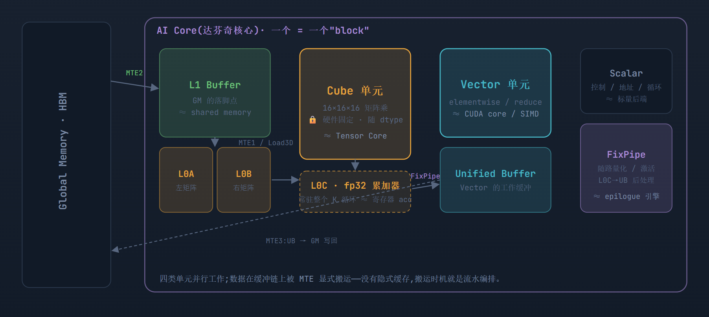
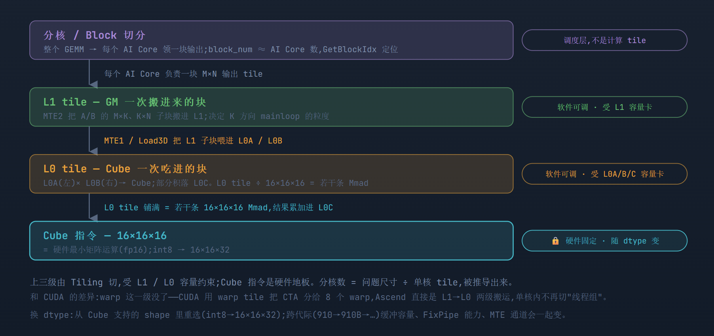
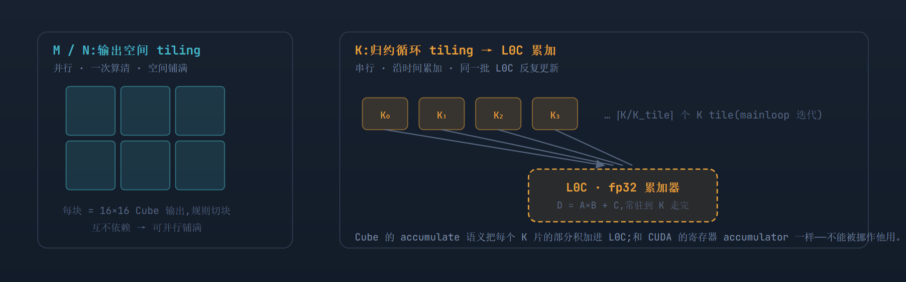
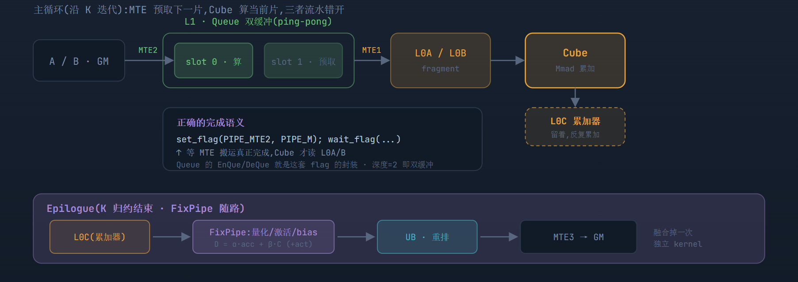
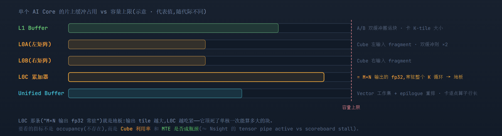
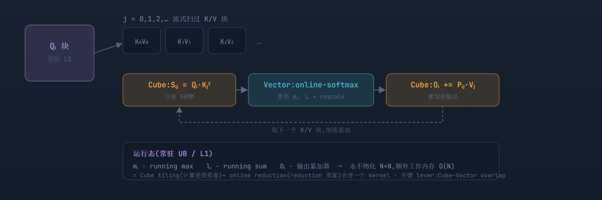

# 生产级 Ascend 算子完整解读:达芬奇执行模型 · 片上缓冲 · 流水

> **Source baseline**: `raw/02_engineering/05_gpu_kernel/ascend_kernels.html`，本地快照 2026-07-22，SHA-256 `1a6b9c36c7bea192be773cbd5687700233818cfbb440a2945d5dda02a380f7f0`
> **Dimension**: Deep Dive（mechanism-level）
> **Updated**: 2026-07-22
>
> 本页由原始 HTML 完整转换；各节的 `Source locator` 指向不可变 raw 文件中的 HTML 行号。本文是以 CUDA / SM80 两篇为参照的平台对照，不是华为官方文档；容量和配置均按原文标注为代表值。
>
> **与 [[operator_optimization_guide]] §6 的划界**：该页 §6 是面向"已掌握 GPU 优化方法"读者的 NPU 快速定位——架构要点摘要 + Tiling/DataCopy 对齐硬约束 + GPU 经验迁移 checklist（含 AICPU 与 host CPU fallback 辨析，本页不覆盖这一实践性区分）。本页是 DaVinci 执行模型本身的 source-faithful 深度机制分析（四类单元显式缓冲链、CUDA/Ascend 逐项对位表、GEMM 四层结构、非 GEMM 算子按类分派、FlashAttention Cube-Vector 融合、训练层三条主线整合），二者不重复正文，互为对方的深潜/速查入口。

以一个 fp16 Cube GEMM 为主线,完整走一遍 Ascend 的四个层面:软件层(分核 / Ascend C / Tiling)、硬件层(AI Core / Cube / Vector / Scalar / MTE)、内存层(GM / L1 / L0A·L0B·L0C / UB)、指令层(DataCopy / Load3D / Mmad / FixPipe)——再把非 GEMM 那一大类接到 Vector 单元这条路上。全篇以 CUDA/SM80 那套为参照,标出*哪里照搬、哪里换词、哪里断层*。

代表性配置:AI Core = **Cube + Vector + Scalar + 3×MTE** · Cube 基础 shape **16×16×16**(int8→16×16×32) · 缓冲链 **GM→L1→L0A/L0B→Cube→L0C→UB→GM** · fp16→fp32

> **一句话总纲:** 把 CUDA 的 **SIMT / warp / occupancy** 世界先忘掉——达芬奇没有 warp,也没有 occupancy 这个旋钮。AI Core 里 **Cube / Vector / Scalar / MTE 四类单元物理并行**,延迟隐藏靠*单元间 overlap + 片上缓冲双缓冲*,不是靠多 warp 轮转。GEMM 那套(tiling / 复用 / 累加常驻)照搬,只是介质从 shared memory / 寄存器换成 **L1 / L0 / UB**;非 GEMM 那套(融合 / 砍 HBM 往返)也照搬,只是全走 **Vector 单元 + UB**。两条最易错的分界:**K 循环迭代数 ≠ Queue 双缓冲深度**;**分核(实际启动的 block 数)≠ Tiling(逻辑 tile → AI Core 的切分策略)**。

## 1. 达芬奇 AI Core:四类单元,一条显式缓冲链

> **Source locator**: `ascend_kernels.html:85-191`

CUDA 的 SM 里是一堆同构的 CUDA core + Tensor Core,靠调度器塞 warp;达芬奇的 AI Core 里是*四类各司其职的异构单元*,它们之间用一条**程序员/编译器显式管理的片上缓冲链**串起来。没有自动 L1 缓存兜底——数据什么时候从 GM 搬到 L1、从 L1 搬到 L0,全是 MTE 按指令做的。



Cube / L0(矩阵) Vector / UB(逐点·归约) L1 / MTE(搬运) FixPipe(后处理)

GM ↔ AI Core;核内 Cube/Vector/Scalar 三类算力 + 三条 MTE 搬运通道 + FixPipe 后处理,靠一条显式缓冲链串联。

> **对位表(先建立词典):** 后面所有章节都在这张表的基础上展开。

| CUDA / SM80 | Ascend / DaVinci | 说明 |
| --- | --- | --- |
| Grid → CTA 调度 | 分核(GetBlockNum / GetBlockIdx) | SPMD,但一个 "block" = 一整个 AI Core 程序,不是 256 个 SIMT 线程 |
| Warp / 32 lane / shuffle | (无对应) | 没有 warp、没有 lane、没有 shfl——最大的抽象断层 |
| Tensor Core · mma 16×8×16 | Cube · 16×16×16(int8→16×16×32) | 硬件固定最小矩阵指令,随 dtype 变,与 CUDA 同构 |
| CUDA core / SIMD | Vector 单元(对 UB 操作) | 所有 elementwise / reduction / softmax 走这条路 |
| CTA tile / Warp tile | Tiling(L1 tile / L0 tile) | 同样"软件可调、受片上容量卡";分核数被 tiling 推导,不自由 |
| shared memory | L1 Buffer / Unified Buffer | 显式 scratchpad,比 smem 更"手动"——无自动缓存 |
| register file(acc 常驻) | L0C(Cube fp32 累加器) | 累加器住在*专用 buffer*,不是 GPR |
| cp.async + commit/wait_group | MTE 异步搬运 + Queue 双缓冲 | 完成语义靠 EnQue/DeQue 或 set_flag/wait_flag |
| epilogue(经 smem 重排 + α/β/act) | FixPipe / 随路后处理 | L0C→UB 路上做量化 / 激活 / bias,省掉独立 elementwise kernel |

## 2. GEMM 映射:分核 → L1 tile → L0 tile → Cube 指令

> **Source locator**: `ascend_kernels.html:192-252`

第一篇 CUDA 文档的四层结构(Grid → CTA → Warp → MMA)在 Ascend 上是*分核 → L1 tile → L0 tile → Cube 指令*。同样只有最底层是硬件固定的;上面几级都是 Tiling 在切,受片上缓冲容量约束。warp 那一级消失了,取而代之的是 L1/L0 两级 tiling。



调度层(分核) 软件可调(L1 约束) 软件可调(L0 约束) 硬件固定(Cube shape)

四级切分:分核在最上只做枚举;L1 / L0 两级 tiling 受各自缓冲容量卡;Cube 16×16×16 是硬件地板。

## 3. M/N 是空间切块,K 是循环归约 —— L0C 累加器常驻

> **Source locator**: `ascend_kernels.html:253-309`

和 CUDA 完全一样的分界:三级尺寸的"乘法关系"只对 *M/N 方向*成立。**K 方向不是空间上排布,而是时间上的循环累加**——沿 K 把一片片部分积加进同一批 L0C。第一篇里"accumulator 跨所有 K tile 常驻寄存器",在 Ascend 上就是 **L0C 常驻整个 mainloop**,K 走完才由 FixPipe/MTE3 撤出。



M/N 把输出切块并行算清;K 沿时间循环归约,部分积不断累加进常驻的 L0C——这条分界与 CUDA GEMM 一字不差,只是介质从寄存器换成 L0C。

## 4. 完整数据流:MTE 异步搬运 + Queue 双缓冲 + FixPipe epilogue

> **Source locator**: `ascend_kernels.html:310-377`

第一篇里两条易错语义,在 Ascend 上有直接对应:① `cp.async` 的 commit/wait_group → 这里是 **MTE 搬运 + Queue 的 EnQue/DeQue**(Ascend C 帮你把 producer/consumer 同步藏进队列);底层是 **set_flag / wait_flag** 在 `PIPE_MTE2` 与 `PIPE_M`(Cube)之间挂依赖——*搬运没完成,Cube 不能读*。② 结果不从 L0C 直写 GM——中间有 **FixPipe**,就是 CUDA 那个 epilogue。



MTE 异步预取 + Queue 双缓冲让搬运与 Cube 计算错开;set_flag/wait_flag 保证"搬完才读";FixPipe 在 L0C→UB 路上随路做 α/β/act,省掉独立 elementwise kernel。

## 5. 片上缓冲预算:L0C 是地板,"换 tile"是唯一出路

> **Source locator**: `ascend_kernels.html:378-433`

第一篇最硬核的一章是"寄存器账本"——128 个 fp32 accumulator 铺了地板,其余是操作数与控制的天花板。Ascend 上这本账换成*片上缓冲容量账*:L0C 的容量决定单核一次能算多大的 M×N 输出(那批 fp32 accumulator 必须放得下),L1/UB 的容量决定搬运块和 Vector 工作集的大小。**没有寄存器 spill 到 local memory 这回事,但一旦 tile 超出缓冲,只能换小一号 tile 重调形**——和 CUDA "别硬压寄存器换 occupancy、真要降压就换小 warp tile"的结论完全一致。



缓冲预算账本:L0C 的"M×N 输出 fp32 常驻"是地板,和 CUDA 的 128 fp32 accumulator 同构;tile 超容量的唯一出路是调小 tile,不是硬压。

> 坑 · pitfall **别照搬 occupancy 直觉。** CUDA 里"低 occupancy 靠 ILP 补"是个有效策略;Ascend 上根本没有 occupancy 这个量,别去找它的类比。这里的延迟隐藏 100% 靠**流水排布**:MTE 预取、Cube 计算、Vector 后处理三条 pipe 能不能真正 overlap。双缓冲深度不够、或某条 pipe 排空等另一条,就是你的性能坑——用 profiling 看每条 pipe 的 active 占比,而不是去调"线程数"。

## 6. 每一级由谁定、谁被谁推导

> **Source locator**: `ascend_kernels.html:434-446`

| 层级 | 本例 | 可调? | 被谁约束 / 如何被推导 |
| --- | --- | --- | --- |
| 分核 / block | ⌈M/BM⌉×⌈N/BN⌉ | 调度策略 | 由问题尺寸 + 单核 tile 推出;≈ AI Core 数时利用率最好 |
| L1 tile | M×K / K×N 子块 | ✓ 软件 | 主要受 L1 容量;决定 K 方向 mainloop 迭代数与双缓冲深度 |
| L0 tile | Cube 一次吃的块 | ✓ 软件 | 主要受 L0A/L0B/*L0C*;L0C 顶死单核 M×N 输出大小 |
| Cube shape | 16×16×16 | ✗ 硬件 | 固定,随 dtype 变(int8→16×16×32) |
| Queue 深度 | 2(双缓冲) | ✓ 软件 | 受缓冲容量;深度 ≠ K-tile 数,是循环复用的 slot 数 |

> **代表性 ≠ 标准。** 和 cuBLAS/CUTLASS 一样,生产库(CANN 的 GEMM / ATB / AscendC Matmul 模板)会为同一个 GEMM 备一堆候选 tile,按 M/N/K、dtype、缓冲、MTE 带宽、FixPipe 能力和*实测*选择。不存在一个 tile 适合所有 GEMM。

## 7. Ascend C kernel 骨架:CopyIn → Compute → CopyOut

> **Source locator**: `ascend_kernels.html:447-493`

第一篇把理论落成 SM80 kernel;这里把它落成 **Ascend C** 的三段式流水。核内逻辑不是"一堆线程各算一块",而是 *CopyIn(MTE)→ Compute(Cube/Vector)→ CopyOut(MTE)* 三段,用 `TQue` 在段间传数据、自动挂 producer/consumer 依赖;`TQue` 深度设 2 就是双缓冲。

```
// —— 三段式:每段一个 pipe,TQue 串起来,深度 2 = 双缓冲 ——
class MatmulKernel {
  TPipe pipe;
  TQue<TPosition::A1, 2> inQueueA;   // GM→L1 的 A,双缓冲
  TQue<TPosition::B1, 2> inQueueB;   // GM→L1 的 B
  TQue<TPosition::CO1,1> outQueueC;  // L0C→UB 的结果

  void Process() {
    for (int kt = 0; kt < K / BK; ++kt) {   // 沿 K 的 mainloop
      CopyIn(kt);      // MTE2:GM → L1(EnQue 触发依赖)
      Compute(kt);     // MTE1→L0 + Cube Mmad,累加进 L0C
    }
    Epilogue();       // FixPipe:L0C → UB(量化/激活)→ MTE3 写回
  }

  void CopyIn(int kt) {
    auto a = inQueueA.AllocTensor();
    DataCopy(a, aGM[kt * BK], ...);  // 异步搬运;分工按合并访存定
    inQueueA.EnQue(a);              // ← 相当于 cp.async.commit_group
  }

  void Compute(int kt) {
    auto a = inQueueA.DeQue();       // ← 相当于 wait_group,搬完才拿
    auto b = inQueueB.DeQue();
    Mmad(cL0C, a, b, /*initC=*/kt==0); // Cube:C += A×B,L0C 常驻
    inQueueA.FreeTensor(a);           // 归还 slot 供下轮复用
  }
}
```

> 对照第一篇:`EnQue/DeQue` = `cp.async` 的 `commit/wait_group`——搬运没落地,`DeQue` 拿不到,Cube 就不会读到脏数据。`Mmad` 的 `initC=(kt==0)` 就是 accumulate 语义:第一轮清零、之后累加,L0C 常驻到 `Epilogue` 才撤。搬运的线程分工(按合并访存)与计算分工(按 Cube fragment)是两套独立映射,和 CUDA 一样。

| 本文的块 | Ascend C / CANN 里的对应物 |
| --- | --- |
| §4 mainloop(MTE 双缓冲流水) | TPipe + TQue(A1/B1)· DataCopy · 深度=2 |
| §4 Cube 指令组合 | Mmad / AscendC Matmul API |
| §2 L1/L0 tiling | Tiling 结构体(host 侧算)+ TilingData |
| §4 epilogue | FixPipe(随路量化/激活)+ CopyOut |
| conv 的 img2col | MTE1 · Load3D(硬件原生 im2col) |
| §1 分核 / 调度 | GetBlockIdx / GetBlockNum + 图模式融合(GE) |

> 教学版省略、生产版必有:边界与非对齐(尾块补零 / K 余数轮)、更细的 pipe 同步(手工 set_flag/wait_flag 拆 producer/consumer)、多核负载均衡、dtype × 布局 × 对齐的模板特化与自动调 tiling。骨架相同,工程量在这些边角。

## 8. 非 GEMM:统一执行模型,Vector 单元这条路// roofline 左侧 · 融合砍 HBM

> **Source locator**: `ascend_kernels.html:494-516`

第二篇 CUDA 文档的核心结论——*底层执行模型统一,优化逻辑随算子处境而变*——在 Ascend 上完全成立。GEMM 那套(tiling / 复用 / Cube / L0C 分块)是"计算受限 + 高复用"的专属打法;**其余大多数算子访存受限,全走 Vector 单元 + UB,主战场是融合与向量化**。roofline 框架照搬:GEMV / 瘦 GEMM / decode 线性层落回左侧,位置取决于形状不取决于算子名字。

但几处因为"没有 warp"而换了打法,逐类标出:

| 算子类 | 数据依赖 | Ascend 落点 | 与 CUDA 的关键差异 |
| --- | --- | --- | --- |
| Elementwise | 逐点 1→1 | Vector + UB,分核 + 核内循环,融合 | "float4 向量化" → UB 内向量指令粒度;融合逻辑一致 |
| Reduction | 多对一 N→1 | UB 内 vector reduce;跨核走 workspace + 二次 kernel | *没有 warp shuffle*——四级漏斗塌成"核内 reduce + 核间 GM 归约" |
| Softmax / Norm | reduction + 逐点 | 单遍融合,online-softmax / Welford 在 UB 常驻 | "整行驻留片上"的前提是 *UB 容量*;超长行需分块重读 |
| Attention / FA | matmul + softmax | Cube–Vector 融合(见 §9) | 两套逻辑合流;关键 lever 是 Cube-Vector overlap |
| Stencil / Conv | 邻域复用 | MTE Load3D 硬件 im2col → 直喂 Cube | im2col 是*硬件原生*,比 CUDA 那条路更顺 |
| Scan | 前缀依赖 | 无 shuffle,靠 workspace 多阶段 | 结合律 / 确定性问题同样存在(见坑) |
| Gather/Scatter/MoE | 不规则、间接 | Vector/Scalar + workspace;dispatch/combine | 无高效全局 atomic → 更依赖"先排序再分段规约" |

> 坑 · 确定性 **归约顺序在 Ascend 上更容易不可复现。** 浮点归约不满足结合律,这条在 CUDA 里就有;Ascend 的跨核归约走 GM/workspace、顺序更不定,问题只会更突出。要位级可复现,就得**固定 tiling + 固定归约树 + 关掉非确定性的核间累加路径**。这也是训练侧做 bit-level reproducibility 时的主线——单核 kernel 视角刚好给了它一个"为什么"。

## 9. FlashAttention:Cube–Vector 融合// 训练里最关键的融合 kernel

> **Source locator**: `ascend_kernels.html:517-570`

第二篇把 FlashAttention 称作"两套逻辑合流"——右侧的分块 GEMM 和左侧的 online reduction 挤进一个 kernel。Ascend 上这正好落在*一个 AI Core 里 Cube 和 Vector 两类单元的协作*:Cube 算 S=Q·Kᵀ 和 P·V,Vector 做 online-softmax,中间量常驻 L1/UB,**永不物化完整的 N×N**。torch_npu 里对应 `npu_fusion_attention`(底层 FlashAttentionScore 融合算子)。



Qᵢ 常驻,K/V 块流式进来;每来一块 Cube 算局部 attention、Vector 用 online-softmax 修正、Cube 累加进输出——两类单元在一个 AI Core 里合流,不物化 N×N。

> 反向用重计算换显存(不存 S),和 CUDA 一致。场景要分开:prefill 长序列偏 compute-bound(喂满 Cube);decode 的 attention 受 KV-cache 带宽与延迟约束,落回左侧——和第二篇的判断相同。

## 10. 落到训练:两条主线 + 万卡的第三条

> **Source locator**: `ascend_kernels.html:571-598`

一个 transformer step 里,算子天然分两拨,对应两条优化主线;Ascend 上还多出被这两篇(单 device 视角)天然略过的第三条。

| 部分 | 典型算子 | 处境 | 优化主线(Ascend) |
| --- | --- | --- | --- |
| 计算受限 | 训练/prefill 的大 GEMM、长序列 attention | compute-bound | 挑对 tiling / 用融合 FA(npu_fusion_attention);喂满 Cube |
| 访存受限 | 激活、norm、residual add、dropout、优化器更新 | memory-bound | 融合它们、砍 HBM 往返——GE/CANN 融合 pass、torch_npu 图模式 + AscendC 融合算子 |
| 通信 | TP/DP/PP/EP 的 all-reduce、all-gather、all-to-all | comm-bound | HCCL comp-comm overlap;SDMA/RDMA 与 Cube/Vector 计算并行 |

前两条和第二篇一字不差:compute-bound 走 **Cube path**(挑 tiling、用融合 FA),memory-bound 走 **Vector path**(融合砍 HBM)。CUDA 侧那个"融合编译器"的角色(Triton / Inductor / XLA),在 Ascend 上是 **GE 图融合 pass + torch_npu 的 torch.compile 后端 + 手写 AscendC 融合算子**——dynamic shape 在这里尤其扎手:tiling 依赖 shape,shape 一动 tiling 就得重算,所以 Ascend 侧的融合比 CUDA 侧更吃"编译期能不能定 tiling"。

> **多出的一维。** 这两篇是单 device kernel 视角,天然不覆盖*卡间*那一层。到万卡尺度,HCCL 的 comp-comm overlap 叠在整个 kernel 层之上——本质上和核内"MTE 与计算 overlap"是同一种流水思想在不同粒度上的复现:**核内三单元 overlap ↔ 卡间计算/通信 overlap**。把这条接上,才是完整的训练 step 优化图景。
>
> 所以"编程逻辑是否一样"的答案和第二篇相同,只是换了硬件:**底层执行模型(AI Core / Cube / Vector / MTE / 缓冲链)统一,但优化逻辑几乎完全不同。** Cube 那套(tiling / 复用 / L0C 分块)是"计算受限 + 高复用"的专属打法;其余大多数算子访存受限,主战场是 Vector 路上的融合与向量化——和 GEMM 里"选 tiling"是两条不同的线。
>
> ---
>
> Ascend · DaVinci / 910B-class · 代表性配置 Cube 16×16×16 · 缓冲链 GM→L1→L0A/L0B→L0C→UB→GM · 图为示意,简化绘制;缓冲容量为代表值,随代际不同。
> 以 CUDA/SM80 两篇(《生产级 CUDA GEMM》《非 GEMM 类算子》)为参照做的平台对照,非官方文档。
> 参考:Ascend C 编程指南 · CANN 算子开发 · DaVinci 架构白皮书 · torch_npu(npu_fusion_attention)· HCCL · FlashAttention(分块 + online-softmax)· Roofline model(Williams / Waterman / Patterson)。

## Related Pages

- [[cuda_gemm_kernel_analysis]] — 对照基线：SM80 GEMM 的 CTA / Warp / MMA / accumulator 主线
- [[cuda_nonmatmul_kernels_analysis]] — 对照基线：roofline 与数据依赖驱动的非 GEMM 分类
- [[gpu_kernel_guide]] — GPU/NPU Kernel 工程总览
- [[operator_optimization_guide]] — CUDA 与 Ascend 算子优化方法及 FixPipe / TQue 背景
- [[mindspeed_ascend_affinity_analysis]] — 训练框架中的 Ascend 融合算子与硬件亲和路径
- [[21_npu_inductor_optimization_analysis]] — torch.compile NPU 后端的 tiling、融合与 codegen
- [[index]] — GPU Kernel 领域索引
