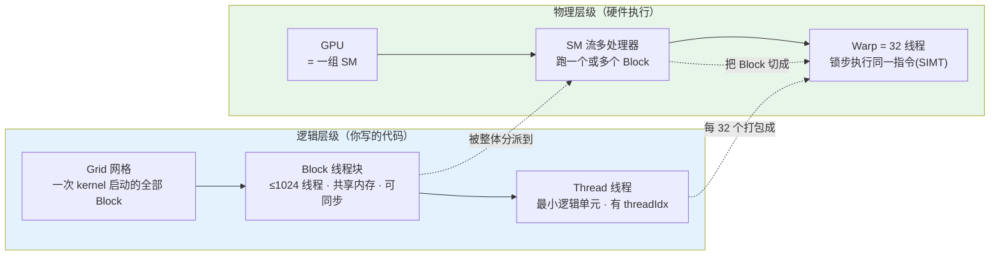
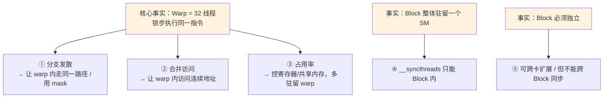

# CUDA 执行模型 — Grid·Block·Warp·Thread·SM 从概念到深入

> **源基线（权威）**: NVIDIA **CUDA C++ Programming Guide v12.9.1**（archive），§*Thread Hierarchy*（Programming Model）+ §*Hardware Implementation / SIMT Architecture*。Triton 对照锚定 `triton main @ 70e0929`。
> **维度**: GPU 编程地基（概念→深入）｜ 能力：全部能力的前置
> 本页专门拆掉初学者最容易卡住的那条链：**计算任务的逻辑层级 Grid→Block→Thread，如何映射到物理硬件 SM 上、并以 Warp 为真正的执行单位**。每个概念配可运行 demo。读完再回 [[triton_00_gpu_essentials_guide]] / [[gpu_kernel_guide]] 就通了。
> **本页地位**：GPU **执行模型权威页**（2026-07 归一定稿）——[[gpu_kernel_guide]] §01、[[triton_00_gpu_essentials_guide]] §2 直觉一的执行层级讲解均已收缩为指针，指回本页；Roofline 的姊妹权威页是 [[operator_optimization_guide]] §2。

---

## 1. 一条主线：两套层级，互相映射

> **GPU 编程里有两套层级在同时运转——你「写」的是逻辑层级（Grid → Block → Thread），硬件「跑」的是物理层级（GPU → SM → Warp）。理解这条映射链的钥匙是 Warp：一个 Block 被整体扔到一个 SM 上，SM 再把它切成每 32 个线程一组的 Warp，而 Warp 才是真正"锁步执行同一条指令"的单位。** 几乎所有 kernel 优化（合并访问、避免分支发散、占用率）都是这把钥匙的推论。



| 你写的（逻辑） | 硬件跑的（物理） | 映射关系（来源：CUDA Guide v12.9.1） |
|---|---|---|
| Grid | 整个 GPU 的 SM 阵列 | Grid 的 Block 被分派到「有空闲容量的 SM」 |
| Block | 一个 SM（整个生命周期） | 「一个 Block 的所有线程驻留在同一个 SM 核心上」 |
| Thread（32 个） | 一个 Warp | SM「以 32 个并行线程为一组（warp）创建/管理/调度/执行」 |
| Thread（单个） | Warp 内一条 SIMT 通道 | 单线程是逻辑视角；硬件按 warp 锁步 |

---

## 2. 概念层：每一层到底是什么（从零讲起）

### 一个生活类比（帮助建立直觉，非源陈述）

把一次 kernel 启动想成**一家公司接了个大订单**：

- **Grid（公司）** = 处理整个订单的所有人。
- **Block（部门）** = 一组协作的人，**坐在同一层楼**（同一个 SM），有**部门内的公共白板**（shared memory），开会能**集合点名**（`__syncthreads()`）。各部门之间互不依赖、谁先干完都行。
- **Thread（员工）** = 干活的最小个体，每人有工号（`threadIdx`）。
- **Warp（32 人的班组）** = 部门里每 32 人编成一个班，**班里所有人必须迈同一个步子**（同一条指令）——这是硬件强加的,不是你编的。

> 关键直觉:你只管「招多少员工、分几个部门」(Grid/Block),**班组(Warp)是硬件自动编的**。但你写代码时若无视班组步调一致这件事,性能就会暴跌(见 §4)。

### 索引变量：每个线程靠它定位「我是谁」

CUDA 给每个线程四个内置变量（源：§Thread Hierarchy）：

| 变量 | 含义 | 维度 |
|---|---|---|
| `threadIdx` | 我在 Block 内的编号 | 1D/2D/3D（`threadIdx` 是 3 分量向量，源原文） |
| `blockIdx` | 我的 Block 在 Grid 内的编号 | 1D/2D/3D |
| `blockDim` | 一个 Block 有多少线程 | — |
| `gridDim` | Grid 有多少 Block | — |

**全局唯一 ID 公式**（1D）：`int id = blockIdx.x * blockDim.x + threadIdx.x;`
源给出 2D/3D Block 内的 Thread ID 换算（§Thread Hierarchy 原文）：
$$\text{2D}(D_x,D_y):\ \text{tid}=x+y\,D_x \qquad \text{3D}(D_x,D_y,D_z):\ \text{tid}=x+y\,D_x+z\,D_x D_y$$

### Demo 1：打印每个线程的身份（可运行，最直观）

```cpp
// whoami.cu —— 编译: nvcc whoami.cu -o whoami && ./whoami
#include <cstdio>
__global__ void whoami() {
    int gid  = blockIdx.x * blockDim.x + threadIdx.x;   // 全局 ID
    int warp = threadIdx.x / warpSize;                  // 我属于 block 内第几个 warp（warpSize 是内置变量=32）
    printf("blockIdx=%d threadIdx=%2d -> globalId=%2d  (block 内第 %d 个 warp)\n",
           blockIdx.x, threadIdx.x, gid, warp);
}
int main() {
    whoami<<<2, 40>>>();          // 2 个 Block，每个 40 线程
    cudaDeviceSynchronize();      // 等 kernel 跑完，否则 printf 不刷出
    return 0;
}
```

跑一下你会看到:每个 Block 的 40 个线程被切成 **warp 0（线程 0–31）+ warp 1（线程 32–39）**——亲眼看到「Block 被切成 32 一组的 Warp」。这就是 §3 的物理映射。

---

## 3. 物理层：它们怎么落到硬件上（这一步最关键）

> 源（§Hardware Implementation）：GPU 由**一组多线程 SM（Streaming Multiprocessor）** 构成；kernel 启动时,Block 被分派到「有空闲执行容量的 SM」；**一个 Block 的线程在同一个 SM 上并发执行,多个 Block 也可同时驻留一个 SM**。

### Block → SM：一对一驻留

一个 Block 一旦被分派给某个 SM，就**在这个 SM 上待到执行完**，不会迁移。这正是「Block ≤ 1024 线程」的原因——源原文：

> 「一个 Block 最多 1024 个线程……因为一个 Block 的所有线程都要驻留在同一个 SM 核心上、共享该核心有限的内存资源。」（§Thread Hierarchy）

一个 SM 能同时驻留**几个** Block,取决于资源够不够（§4 占用率）。

### SM → Warp：32 个线程一组，锁步执行

源（§SIMT Architecture）原文：

> 「SM 以 **32 个并行线程为一组**（称为 **warp**）来创建、管理、调度和执行线程。」

- **warp size = 32**（NVIDIA GPU 固定值；AMD 的 wavefront 是 64，见 §6）。
- Block 按**连续 threadIdx** 切 warp：warp 0 = 线程 0–31，warp 1 = 线程 32–63……（Demo 1 已亲眼可见）。
- **Warp 才是真正的执行/调度单位**：源说「一个 warp 一次执行一条公共指令」（one common instruction at a time）。SM 的 warp 调度器在多个 warp 间快速切换,用「换班组干活」来**掩盖访存延迟**——这就是 GPU 吞吐机器的运作方式。

### Demo 2：查出你这张卡的真实硬件数字（可运行）

```cpp
// devinfo.cu —— nvcc devinfo.cu -o devinfo && ./devinfo
#include <cstdio>
#include <cuda_runtime.h>
int main() {
    cudaDeviceProp p; cudaGetDeviceProperties(&p, 0);
    printf("设备            : %s\n", p.name);
    printf("SM 数量         : %d\n", p.multiProcessorCount);          // 物理 SM 个数
    printf("warpSize        : %d\n", p.warpSize);                     // = 32
    printf("每 Block 最大线程: %d\n", p.maxThreadsPerBlock);          // = 1024
    printf("每 SM 最大线程  : %d\n", p.maxThreadsPerMultiProcessor);  // 如 2048
    printf("每 SM 寄存器    : %d\n", p.regsPerMultiprocessor);        // 如 65536
    printf("每 SM 共享内存  : %zu B\n", p.sharedMemPerMultiprocessor);
    return 0;
}
```

`maxThreadsPerMultiProcessor / warpSize` = 一个 SM **理论上**能同时驻留多少 warp（如 2048/32 = 64）。能不能达到，取决于寄存器和共享内存——这就是占用率（§4）。

### 逻辑 ↔ 物理 对照速查

| 逻辑概念 | 物理实体 | 关键约束（源） |
|---|---|---|
| Thread | SIMT 通道（warp 的 1/32） | — |
| **32 个 Thread** | **1 个 Warp** | 锁步执行同一指令（SIMT） |
| Block | 1 个 SM（驻留至结束） | ≤1024 线程；同 SM 共享资源 |
| Grid | SM 阵列 | Block 必须可独立、任意顺序执行 |
| （Cluster，CC 9.0） | 1 个 GPC | ≤8 Block 可移植；跨 Block 共享内存 |

---

## 4. 深入：为什么这条链是「所有优化的起点」

「**Warp = 32 个锁步线程**」这一个事实，直接派生出三条核心优化规则 + 两条结构约束：

### ① Warp 分支发散（Warp Divergence）

源（§SIMT Architecture）：warp 内 32 线程走**同一条**路径时效率最高；若因**数据相关分支**而发散，**warp 会把每条被走到的分支路径都执行一遍，期间关闭不在该路径上的线程**——即串行化。

```cpp
// ❌ 发散：同一 warp 内奇偶线程走不同分支 → 两条路串行
if (threadIdx.x % 2 == 0)  a(); else  b();

// ✅ 不发散：以 warp(32) 为粒度切换分支 → 整个 warp 走同一条
if ((threadIdx.x / warpSize) % 2 == 0)  a(); else  b();
```

> 推论:**让同一 warp 内的线程尽量走相同路径**。这也解释了 [[triton_01_programming_model_guide]] 为什么用 `mask` 而非 `if` 处理边界——mask 是无发散的谓词执行。

### ② 内存合并访问（Coalescing）

warp 的 32 个线程若访问**连续对齐**地址,硬件合并成一次大事务;若跳跃,退化成多次小事务,带宽利用率暴跌。（机制细节见 [[gpu_kernel_guide]] §02。）根因还是「32 线程同时发访存」这个 warp 事实。

### ③ 占用率（Occupancy）

源（§Hardware Implementation）：**一个 SM 能同时驻留多少 Block / Warp，取决于 kernel 用的寄存器和共享内存,以及 SM 上可用的量;若资源不足,kernel 直接启动失败。** 驻留的 warp 越多 → warp 调度器越有得切 → 越能掩盖访存延迟。这就是「占用率」要调的东西（[[triton_04_autotune_guide]] 的 `num_warps`、[[gpu_kernel_guide]] §03）。

### ④ `__syncthreads()` 只能在 Block 内同步

源：`__syncthreads()` 是个**栅栏**,Block 内所有线程都到齐才放行。**为什么只能 Block 内?** 因为一个 Block 整体在一个 SM 上(§3),硬件能让它们集合;而不同 Block 可能在不同 SM、甚至不同时间跑,无法互相等待。

### ⑤ Block 独立性 = 可扩展性

源原文：「Thread Block 必须能够独立执行——可以任意顺序、并行或串行地执行。」正因如此,**同一份代码在 2 个 SM 的小卡和 144 个 SM 的大卡上都能跑**,只是并行度不同。代价:**跨 Block 不能用 `__syncthreads` 同步**,需要拆成多个 kernel 或用 Cooperative Groups。



---

## 5. 映射到 Triton：为什么你能少操一半心

你正在学的 Triton 把 **Thread 和 Warp 这两层抽象掉了**——你只在 **Block 层**编程（Triton 叫 program），Warp 划分交给编译器。

| CUDA 概念 | Triton 对应 | 谁来管 |
|---|---|---|
| `blockIdx` | `tl.program_id(axis)` | 你 |
| Grid | `grid` / `kernel[grid](...)` | 你 |
| Block（一块数据） | 一个 program（处理一个块） | 你 |
| `threadIdx` | **无**（不可见） | 编译器 |
| Warp 划分 | `num_warps`（只给个数） | 编译器 |
| `__syncthreads` | 块内自动插入 | 编译器 |
| 合并访问 / bank conflict | 自动 | 编译器 |

> 所以 [[triton_00_gpu_essentials_guide]] 那张「分工表」的底气,正是来自本页:Warp 这层最难最易错的东西,Triton 替你处理了。但**你仍要懂 warp**——否则不知道 `num_warps` 在调什么、为什么用 mask、为什么访问要连续。

### Demo 3：在 Triton 里看 program ≈ block（可运行，无 GPU 也行）

```python
# triton_whoami.py —— 无 GPU 时: TRITON_INTERPRET=1 python triton_whoami.py
import triton, triton.language as tl, torch
DEVICE = triton.runtime.driver.active.get_active_torch_device()

@triton.jit
def whoami(out_ptr, BLOCK_SIZE: tl.constexpr):
    pid  = tl.program_id(axis=0)                         # ≈ blockIdx.x
    offs = pid * BLOCK_SIZE + tl.arange(0, BLOCK_SIZE)   # 本 program 负责的一块
    tl.device_print("program_id", pid)                  # 打印「我是第几个 program」
    tl.store(out_ptr + offs, offs)

n, BLOCK = 64, 16
out = torch.empty(n, dtype=torch.int32, device=DEVICE)
whoami[(triton.cdiv(n, BLOCK),)](out, BLOCK_SIZE=BLOCK)  # 启动 4 个 program（≈4 个 Block）
```

`program_id` 的输出 0,1,2,3 ↔ CUDA 的 `blockIdx`。`num_warps` 没出现——因为每个 program 用几个 warp 是编译器定的。打印细节见 [[triton_05_debug_guide]]。

---

## 6. 常见误解（以源为准，纠正直觉）

| 误解 | 实情（源） |
|---|---|
| 「Thread 是并行执行的最小单位」 | **Warp（32 线程）才是**硬件调度/执行单位;单 thread 只是逻辑视角(§SIMT Architecture)。 |
| 「一个 Block 里所有线程同时跑」 | Block 被切成 warp,**warp 之间由调度器轮转**,未必同时;只有同一 warp 内的 32 线程真正同步。 |
| 「warpSize 永远是 32」 | NVIDIA 是 32;**AMD 的 wavefront 是 64**。永远用 `warpSize`/`p.warpSize` 查询,别硬编码。 |
| 「可以用 `__syncthreads` 跨 Block 同步」 | **不能**。Block 相互独立、可能不同 SM/不同时间执行。跨 Block 需拆 kernel 或 Cooperative Groups。 |
| 「发散只是慢一点」 | 源:warp 会**逐条执行每个被走到的分支路径**并屏蔽其余线程,最坏退化到 1/32 有效吞吐。 |
| 「Volta 前后发散行为一样」 | **Independent Thread Scheduling 自 Volta（CC 7.0）引入**:每线程独立 PC;之前每 warp 共用一个 PC。行为与重收敛假设不同。 |

---

## 7. 动手验证 + 自测

```bash
nvcc whoami.cu  -o whoami  && ./whoami      # 看 Block 被切成 32 一组的 warp
nvcc devinfo.cu -o devinfo && ./devinfo     # 看你这张卡的 SM 数 / warpSize / 每SM上限
TRITON_INTERPRET=1 python triton_whoami.py  # 看 program_id ≈ blockIdx（无需 GPU）
```

**自测（答得出就过关）**
1. 一个 Block 被分派到几个 SM 上?为什么 Block 最多 1024 线程?
2. 40 个线程的 Block 会被切成几个 warp?最后一个 warp 满吗?对性能有何影响?
3. 为什么 `__syncthreads()` 不能跨 Block?跨 Block 想同步怎么办?
4. `num_warps`(Triton)对应 CUDA 的哪个概念?它影响什么?
5. 为什么「让 warp 内线程走同一分支 / 访问连续地址」是两条最基础的优化?

> 答不出第 2/5 题就回 §3/§4 重看——那是理解一切 kernel 优化的支点。

---

## 相关页面

- [[gpu_kernel_guide]] — GPU/NPU Kernel 工程总览（本页是其 §01 执行层级的「概念→深入」展开版）
- [[operator_optimization_guide]] — **Roofline 权威页**：本页是执行模型权威页，与该页 §2（Roofline）互为姊妹权威
- [[cuda_gemm_kernel_analysis]] — 把执行层级落到 SM80 生产级 Tensor Core GEMM
- [[cuda_nonmatmul_kernels_analysis]] — 同一执行模型下，按 roofline 与数据依赖切换优化逻辑
- [[ascend_kernel_execution_model_analysis]] — 对照没有 warp 的 DaVinci AI Core 执行模型
- [[triton_00_gpu_essentials_guide]] — GPU 编程要素（roofline / 内存层级；本页补齐其「执行层级」前置）
- [[triton_01_programming_model_guide]] — Triton SPMD 编程模型（program ≈ block 的实战）
- [[triton_04_autotune_guide]] — `num_warps` / 占用率怎么自动调
- [[triton_05_debug_guide]] — `device_print` / `TRITON_INTERPRET` 打印细节
- [[index]] — GPU Kernel 领域索引
