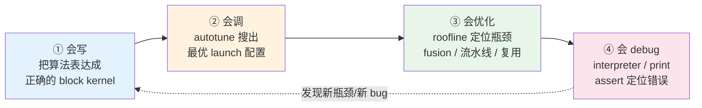

# Triton 学习路线 — 从小白到「会写·会调·会优化·会debug」的全能 Kernel 专家

> **源基线**: 官方 `triton-lang/triton` `main @ 70e0929` (2026-06-25)，Triton **v3.8.0**
> 本地源: `E:/97-codes/torch_parallel/triton`（浅克隆，作 `file:line` 可核验定位符）
> **维度**: 域入口 / 学习路线总索引
> 本页是整条 Triton 学习路线的入口与导航。每一页都**锚定官方 tutorial 源码**，每个知识点都配**可运行 demo**——这是本系列的铁律。
> **段位**(kb-reorg P7 Task 7,2026-07-31):原课程序号 `triton_00`–`triton_06` 规范化为段位前缀(`triton_` 前缀保留)——L0 地基→段 0(01);L1-L3 会写/会调/会debug→段 1(10-14);L4 会优化 + 总纲→段 3(30-31)。

---

## 一条主线（这条路线的核心赌注）

> **Triton 让你用「写 NumPy 的方式」写 GPU kernel：你只负责把计算切成块（block）、描述「一个块怎么算」，而把块内的线程划分、内存合并、shared memory 调度、寄存器分配这些最难的事交给编译器。**

这与 CUDA 的本质区别是**编程粒度**：

| | CUDA（thread-level） | Triton（block-level） |
|---|---|---|
| 你写的对象 | 单个 thread 做一个标量 | 一个 program 做一整块 tensor |
| 谁管 coalescing / shared mem / bank conflict | **你**（手写） | **编译器**（自动） |
| 谁管 tiling / 寄存器累加 | 你 | 你描述形状，编译器排布 |
| 谁管 warp 划分 | 你（`threadIdx`） | 编译器（你只给 `num_warps`） |
| 入门曲线 | 陡 | 平缓（Python + 块思维） |
| 性能天花板 | 最高（可榨干每条指令） | 接近 cuBLAS（matmul tutorial 220→245 TFLOPS on A100，源 `03-matrix-multiplication.py:145`） |

**为什么以 Triton 为切入点学 GPU 编程**：它把「GPU 编程要素」（执行层级、内存层级、roofline、合并访问、tiling、流水线）中**机械且易错的部分自动化**，让初学者能把注意力放在**算法结构与数据复用**这个真正决定性能的层面。等你在 Triton 里建立了「block + 内存层级 + roofline」的直觉，再下沉到 CUDA/PTX 或迁移到 NPU 都水到渠成。

---

## 全能专家 = 四种能力的闭环



四者不是线性阶段而是**循环**：写完要调，调时会暴露性能瓶颈（要优化），优化中会引入 bug（要 debug），debug 又回头改写法。本系列每一页对应其中一环，并标注它属于哪种能力。

---

## 学习路线（小白 → 专家）

| 阶段 | 页面 | 段位 | 能力 | 核心 demo（锚定源） | 你将学会 |
|------|------|------|------|--------|---------|
| **L0 认知** | [[triton_01_gpu_essentials_guide]] | 段 0 | 地基 | roofline 手算 + `do_bench` 量带宽 | GPU 执行/内存层级、SIMT、roofline、为什么 kernel 多是 memory-bound |
| **L1 会写①** | [[triton_10_programming_model_guide]] | 段 1 | 会写 | **向量加法**（`01-vector-add.py`） | `@triton.jit`、`program_id`、`arange`、`mask`、`load/store`、grid lambda |
| **L1 会写②** | [[triton_11_fused_softmax_guide]] | 段 1 | 会写 | **融合 softmax**（`02-fused-softmax.py`） | reduction（`tl.max/sum`）、kernel fusion 省带宽、`other=-inf` padding |
| **L1 会写③** | [[triton_12_matmul_guide]] | 段 1 | 会写+优化 | **分块矩阵乘**（`03-matrix-multiplication.py`） | 二维指针算术、`tl.dot`、fp32 累加器、L2 grouping、K 维 masking |
| **L2 会调** | [[triton_13_autotune_guide]] | 段 1 | 会调 | **autotune matmul**（`@triton.autotune`） | `Config`、`num_warps`、`num_stages`、`key`、剪枝、缓存陷阱 |
| **L3 会 debug** | [[triton_14_debug_guide]] | 段 1 | 会debug | **解释器模式抓越界**（`TRITON_INTERPRET=1`） | interpreter、`device_print`、`static_assert`、5 类高频 bug 排查 |
| **L4 会优化** | [[triton_30_optimization_profiling_guide]] | 段 3 | 会优化 | **proton 测 roofline + FlashAttention**（`06-fused-attention.py`） | profiler、占用率、`num_stages` 流水线、online-softmax 融合 |
| **总纲** | [[triton_31_knowledge_guide]] | 段 3 | 全部 | — | 四种能力对应的完整知识点清单 + 自测题 + 资源 |

> **学习建议**：严格按 L0→L4 顺序。每页末尾的「动手验证」务必亲手跑通 demo（哪怕没有 GPU，L1/L3 的 demo 可用 `TRITON_INTERPRET=1` 在 CPU 上跑，见 [[triton_14_debug_guide]]）。

---

## 环境准备（一次性）

```bash
# Triton 仅官方支持 Linux + NVIDIA(CUDA) / AMD(ROCm)；Windows 用 WSL2 或远程 Linux
pip install triton            # 随 torch 一起装通常已自带；单独装也可
python -c "import triton; print(triton.__version__)"   # 本系列基线 3.8.0
```

- **没有 GPU 也能学**：`TRITON_INTERPRET=1` 让 kernel 在 CPU 上以 Python 模拟执行（慢但可 `print`/单步），适合学语义、抓越界——详见 [[triton_14_debug_guide]]。
- **官方 tutorial 源**就是本系列的真源：`triton/python/tutorials/01..11-*.py`。强烈建议边读 wiki 边对照源文件。

---

## 关联域

- [[01_gpu_kernel_guide]] — GPU/NPU Kernel 工程总览（CUDA thread-level 视角、Tensor Core、NPU 差异）；与本系列**互补**：那页讲 CUDA 手写，本系列讲 Triton 自动化
- [[30_triton_vs_mlir_backend_analysis]] — Triton 作为 `torch.compile` 后端的编译流水线（FX→Inductor IR→Triton→PTX）
- [[20_inductor_codegen_analysis]] — TorchInductor 如何**自动生成** Triton kernel（你手写的，编译器也在生成）
- [[../../01_ai_frameworks/index]] — PyTorch 编译栈
- [[../../03_infer_frameworks/index]] — 推理框架（FlashAttention 等 Triton kernel 是性能关键）

---

## 维护说明

- 所有页面锚定 `triton main @ 70e0929`；Triton API 演进较快，引用行号随上游漂移时以本地 checkout 为准
- 新增页面需在本 index 表格登记，并在 [[changelog]] 记录
