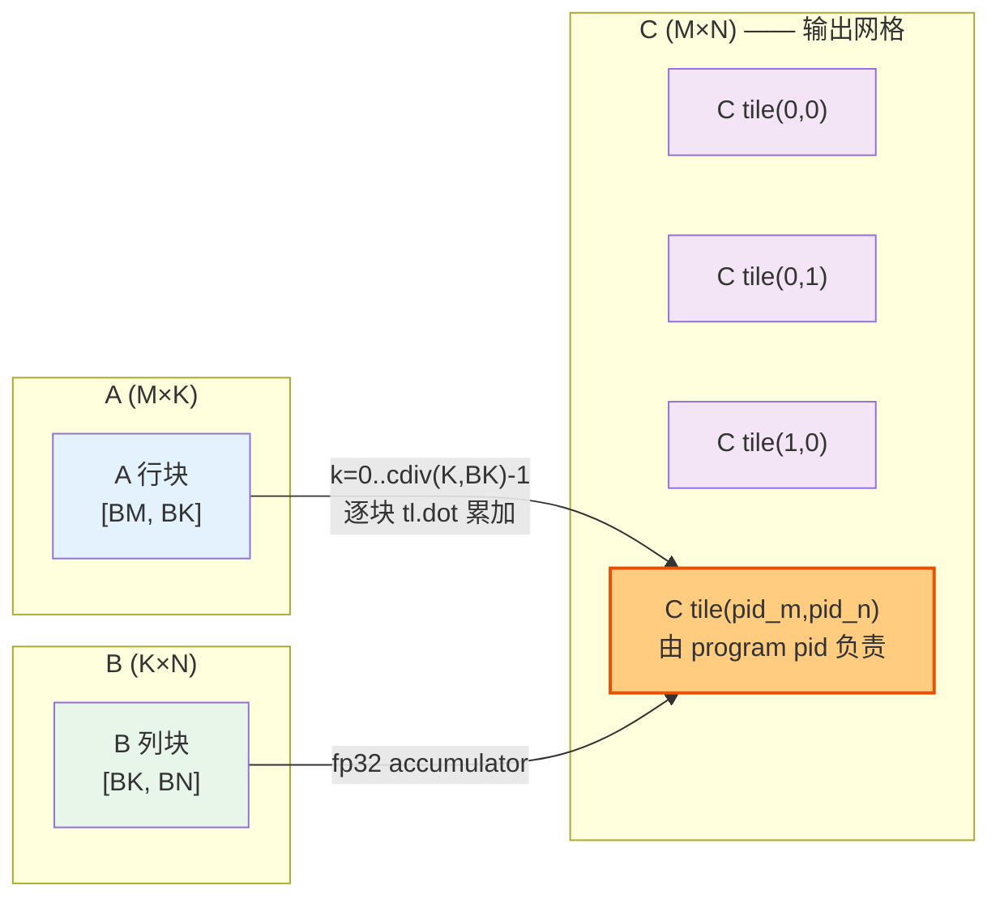

# L1 · 会写③ + 会优化 — 分块矩阵乘与 L2 cache 重排（matmul）

> **源基线**: `triton main @ 70e0929`，v3.8.0 ｜ 锚定 `python/tutorials/03-matrix-multiplication.py`（逐行可核验）
> **维度**: 学习路线 L1（会写③）+ L2（会优化：L2 cache）｜ 能力：**会写多维 kernel + 会做访存局部性优化**
> 本页用官方 matmul demo 讲清三件事：① 多维指针算术怎么生成 `[BM,BK]` 指针块；② 为什么用 **fp32 寄存器累加器** + `tl.dot` 沿 K 维累加；③ 一个纯调度顺序的改动（grouped ordering）如何把 L2 命中率拉高、A100 上从 220→245 TFLOPS。前置：[[triton_01_programming_model_guide]]（SPMD/mask/grid）与 [[triton_00_gpu_essentials_guide]]（roofline/compute-bound）。

---

## 1. 一条主线：分块矩阵乘 = 双重并行循环 + K 维寄存器累加

> **把 `(M,K)×(K,N)` 切成块：每个 Triton program 负责输出 `C` 的一个 `[BLOCK_SIZE_M, BLOCK_SIZE_N]` 块，沿 K 维循环，每步 `tl.load` 一块 A、一块 B，用 `tl.dot` 把它们的小矩阵乘**累加进一个 fp32 寄存器累加器**；K 跑完再把累加器转回 fp16 写出。M、N 两个维度是并行的（每个块一个 program），只有 K 维是串行循环。**

官方伪代码把这个结构写得最清楚（源注释 `:36-45`）：

```python
# Do in parallel                                  # ← M 维：每个块一个 program
for m in range(0, M, BLOCK_SIZE_M):
  # Do in parallel                                # ← N 维：每个块一个 program
  for n in range(0, N, BLOCK_SIZE_N):
    acc = zeros((BLOCK_SIZE_M, BLOCK_SIZE_N), dtype=float32)   # fp32 累加器
    for k in range(0, K, BLOCK_SIZE_K):           # ← K 维：唯一的串行内循环
      a = A[m : m+BLOCK_SIZE_M, k : k+BLOCK_SIZE_K]
      b = B[k : k+BLOCK_SIZE_K, n : n+BLOCK_SIZE_N]
      acc += dot(a, b)
    C[m : m+BLOCK_SIZE_M, n : n+BLOCK_SIZE_N] = acc
```

源原话：**「双重嵌套 for 的每一次迭代由一个专属的 Triton program 实例执行」**（`:47`）。也就是说外两层 `for m / for n` 不是 kernel 里的循环——它们被展开成 grid 上成千上万个并行 program，kernel 里**只剩 K 维那一层 `for`**（对应真实 kernel 的 `:298`）。

| 概念 | 含义 | 源锚点 |
|---|---|---|
| `BLOCK_SIZE_M / N / K` | C 块的高/宽 + K 维切片步长（`constexpr` 元参数） | `:245-246` |
| program ↔ tile | 一个 program 算 C 的一个 `[BM,BN]` 块 | `:96-97`、`:253` |
| 累加器 `accumulator` | `[BM,BN]` 的 **fp32** 寄存器矩阵，跨 K 步累加 | `:294-297` |
| `tl.dot(a, b, acc)` | 块级小矩阵乘 + 累加（走 Tensor Core） | `:304` |
| grouped ordering | program→tile 的映射顺序，提升 L2 复用 | `:254`、`:256-264` |
| `@triton.autotune` | 自动搜 `BLOCK_SIZE/num_warps/...`（细节见下页） | `:228-231` |



*图 1：grid 上每个 program 对应 C 的一个 tile；该 program 沿 K 维把对应的 A 行块与 B 列块逐块 `tl.dot`，累加进自己的 fp32 累加器。M/N 并行、K 串行。*

---

## 2. 完整 demo（逐字摘自官方源）

### 2.1 计算 kernel `matmul_kernel`（源 `:232-320`，下方为忠实摘录 + 中文注释）

```python
import torch
import triton
import triton.language as tl

@triton.autotune(                       # :228 —— 自动调参（配置细节见 [[triton_04_autotune_guide]]）
    configs=get_autotune_config(),      # :229
    key=['M', 'N', 'K'],                # :230 —— M/N/K 变化时重新搜索最优配置
)
@triton.jit
def matmul_kernel(
        a_ptr, b_ptr, c_ptr,            # :235 三个矩阵的首元素指针
        M, N, K,                        # :237 运行时维度
        stride_am, stride_ak,           # :241 A 的行/列 stride（相邻行差 stride_am，相邻列差 stride_ak）
        stride_bk, stride_bn,           # :242 B 的行/列 stride
        stride_cm, stride_cn,           # :243 C 的行/列 stride
        BLOCK_SIZE_M: tl.constexpr, BLOCK_SIZE_N: tl.constexpr, BLOCK_SIZE_K: tl.constexpr,  # :245 编译期块大小
        GROUP_SIZE_M: tl.constexpr,     # :246 grouped ordering 的组高
        ACTIVATION: tl.constexpr        # :247 可选融合激活（""/"leaky_relu"）
):
    # ---- ① pid → (pid_m, pid_n)，grouped 排布以提升 L2 复用（:252-264）----
    pid = tl.program_id(axis=0)                       # :256 一维 grid 里我是第几个 program
    num_pid_m = tl.cdiv(M, BLOCK_SIZE_M)              # :257 M 方向块数
    num_pid_n = tl.cdiv(N, BLOCK_SIZE_N)              # :258 N 方向块数
    num_pid_in_group = GROUP_SIZE_M * num_pid_n       # :259 一个组里的 program 数
    group_id = pid // num_pid_in_group                # :260 我属于第几组
    first_pid_m = group_id * GROUP_SIZE_M             # :261 本组首行块的行号
    group_size_m = min(num_pid_m - first_pid_m, GROUP_SIZE_M)  # :262 末组可能不满
    pid_m = first_pid_m + ((pid % num_pid_in_group) % group_size_m)  # :263 组内列主序 → 行号
    pid_n = (pid % num_pid_in_group) // group_size_m  # :264 组内列主序 → 列号

    # ---- ② 给后端整数范围提示，优化地址计算（:266-277）----
    tl.assume(pid_m >= 0)                             # :270
    tl.assume(pid_n >= 0)                             # :271
    tl.assume(stride_am > 0)                          # :272 （stride_ak/bn/bk/cm/cn 同，:273-277）

    # ---- ③ 多维指针算术：构造首个 A/B 块的指针块（:279-290）----
    offs_am = (pid_m * BLOCK_SIZE_M + tl.arange(0, BLOCK_SIZE_M)) % M  # :286 行下标（% M 防越界）
    offs_bn = (pid_n * BLOCK_SIZE_N + tl.arange(0, BLOCK_SIZE_N)) % N  # :287 列下标（% N 防越界）
    offs_k = tl.arange(0, BLOCK_SIZE_K)                                # :288 K 维 0..BK-1
    a_ptrs = a_ptr + (offs_am[:, None] * stride_am + offs_k[None, :] * stride_ak)  # :289 [BM,BK] 指针块
    b_ptrs = b_ptr + (offs_k[:, None] * stride_bk + offs_bn[None, :] * stride_bn)  # :290 [BK,BN] 指针块

    # ---- ④ K 维循环：fp32 累加（:292-307）----
    accumulator = tl.zeros((BLOCK_SIZE_M, BLOCK_SIZE_N), dtype=tl.float32)  # :297 fp32 累加器
    for k in range(0, tl.cdiv(K, BLOCK_SIZE_K)):                            # :298 沿 K 维分块循环
        a = tl.load(a_ptrs, mask=offs_k[None, :] < K - k * BLOCK_SIZE_K, other=0.0)  # :301 K 尾块补 0
        b = tl.load(b_ptrs, mask=offs_k[:, None] < K - k * BLOCK_SIZE_K, other=0.0)  # :302
        accumulator = tl.dot(a, b, accumulator)        # :304 块级矩阵乘 + 累加
        a_ptrs += BLOCK_SIZE_K * stride_ak             # :306 A 指针块前移一个 K 块
        b_ptrs += BLOCK_SIZE_K * stride_bk             # :307 B 指针块前移一个 K 块

    # ---- ⑤ 累加器仍是 fp32 时融合激活，再转 fp16（:308-312）----
    if ACTIVATION == "leaky_relu":                     # :310
        accumulator = leaky_relu(accumulator)          # :311 任意激活都能在此融合
    c = accumulator.to(tl.float16)                     # :312 输出转回 fp16

    # ---- ⑥ 带 mask 写回 C 块（:314-320）----
    offs_cm = pid_m * BLOCK_SIZE_M + tl.arange(0, BLOCK_SIZE_M)            # :316
    offs_cn = pid_n * BLOCK_SIZE_N + tl.arange(0, BLOCK_SIZE_N)            # :317
    c_ptrs = c_ptr + stride_cm * offs_cm[:, None] + stride_cn * offs_cn[None, :]  # :318
    c_mask = (offs_cm[:, None] < M) & (offs_cn[None, :] < N)              # :319 M/N 尾块越界保护
    tl.store(c_ptrs, c, mask=c_mask)                   # :320


@triton.jit
def leaky_relu(x):                                     # :324-326 融合用的激活（纯 tl.* 子集）
    return tl.where(x >= 0, x, 0.01 * x)               # :326 无分支：谓词执行
```

### 2.2 host wrapper（源 `:334-352`）

```python
def matmul(a, b, activation=""):
    assert a.shape[1] == b.shape[0], "Incompatible dimensions"   # :336 K 维必须对齐
    assert a.is_contiguous(), "Matrix A must be contiguous"      # :337 A 要求连续
    M, K = a.shape                                               # :338
    K, N = b.shape                                               # :339
    c = torch.empty((M, N), device=a.device, dtype=torch.float16)  # :341 预分配 fp16 输出
    # 关键：2D 的输出块网格被压平成 1D grid，长度 = cdiv(M,BM) * cdiv(N,BN)
    grid = lambda META: (triton.cdiv(M, META['BLOCK_SIZE_M']) * triton.cdiv(N, META['BLOCK_SIZE_N']), )  # :343
    matmul_kernel[grid](
        a, b, c,                                                # :345
        M, N, K,                                                # :346
        a.stride(0), a.stride(1),                               # :347 把 torch 的 stride 传进 kernel
        b.stride(0), b.stride(1),                               # :348
        c.stride(0), c.stride(1),                               # :349
        ACTIVATION=activation                                   # :350 BLOCK_SIZE 等由 autotune 注入，不在此传
    )
    return c
```

> 注意 `:343` 的 grid 是 **1D**：kernel 内部再用 `:256-264` 的算术把一维 `pid` 解码回二维 `(pid_m, pid_n)`。这与 [[triton_01_programming_model_guide]] 的一维向量加法启动语法一脉相承，只是块映射更复杂。

### 2.3 正确性测试（源 `:361-372`）

```python
torch.manual_seed(0)
a = torch.rand((512, 512), device=DEVICE, dtype=torch.float16) - 0.5   # :362
b = torch.rand((512, 512), device=DEVICE, dtype=torch.float16) - 0.5   # :363
triton_output = matmul(a, b)                                           # :364
torch_output  = torch.matmul(a, b)                                     # :365 参考实现 = cuBLAS
if torch.allclose(triton_output, torch_output, atol=1e-2, rtol=0):     # :369 fp16 容差 1e-2
    print("✅ Triton and Torch match")                                 # :370
else:
    print("❌ Triton and Torch differ")                                # :372
```

`atol=1e-2`（源 `:369`）是 fp16 matmul 的合理容差——fp32 累加把误差压住了，但输出 fp16 本身只有 ~3 位十进制有效数字，所以不要求逐 bit 相等。

---

## 3. 逐行讲解

### 3.1 多维指针算术：`[:,None]` / `[None,:]` 广播出指针块（源 `:286-290`）

行主序张量 `X` 的元素地址公式（源注释 `:61-62`）：

$$\&X[i,j] = X_{\text{base}} + i \cdot \texttt{stride\_xi} + j \cdot \texttt{stride\_xj}$$

要一次性得到整个 `[BM,BK]` 块的**所有指针**，把行下标向量与列下标向量做**广播外积**：

- `offs_am`：长度 `BM` 的行下标向量（`:286`）；`offs_k`：长度 `BK` 的列下标向量（`:288`）。
- `offs_am[:, None]` 形状 `[BM,1]`，`offs_k[None, :]` 形状 `[1,BK]`；二者相加按 NumPy 广播规则得到 `[BM,BK]`：

$$\texttt{a\_ptrs}[i,j] = \texttt{a\_ptr} + \underbrace{\texttt{offs\_am}[i]}_{\text{行}}\cdot\texttt{stride\_am} + \underbrace{\texttt{offs\_k}[j]}_{\text{列}}\cdot\texttt{stride\_ak}$$

这正是 `:289`。源把这个广播写法和上面的地址公式在注释 `:63-69` 里逐一对应过。一句话：**`[:,None]` 把向量竖起来当行索引，`[None,:]` 把向量躺平当列索引，相加就枚举了块里每个元素的地址**。B 同理（`:290`），只是 K 在行、N 在列。

`offs_am` 末尾的 `% M`（`:286`）和 `offs_bn` 的 `% N`（`:287`）：M/N 非整除块大小时，越界行/列被折叠回合法地址（读到的是"无用但合法"的数据），最终靠写回时的 `c_mask`（`:319`）丢弃——源注释 `:72-75` 明确说"用无用值填充，不影响结果"。

### 3.2 grouped ordering：把 `pid` 解码成 `(pid_m, pid_n)`（源 `:256-264`）

朴素行主序只要两行（源注释 `:104-107`）：`pid_m = pid // grid_n; pid_n = pid % grid_n`。源直接断言它**"就是不够用"**（`:109`，"is just not going to cut it"）——原因见 §4。grouped 版本（`:256-264`）逐行含义：

| 行 | 代码 | 含义 |
|---|---|---|
| `:257` | `num_pid_m = cdiv(M, BM)` | M 方向块数 |
| `:258` | `num_pid_n = cdiv(N, BN)` | N 方向块数 |
| `:259` | `num_pid_in_group = GROUP_SIZE_M * num_pid_n` | 一个"超组"含 `GROUP_SIZE_M` 行 × 整列的块 |
| `:260` | `group_id = pid // num_pid_in_group` | 我落在第几个超组 |
| `:261` | `first_pid_m = group_id * GROUP_SIZE_M` | 本组第一行块的行号 |
| `:262` | `group_size_m = min(num_pid_m - first_pid_m, GROUP_SIZE_M)` | 末组不满时取实际高度 |
| `:263` | `pid_m = first_pid_m + ((pid % num_pid_in_group) % group_size_m)` | **组内列主序**得到行号 |
| `:264` | `pid_n = (pid % num_pid_in_group) // group_size_m` | 组内列主序得到列号 |

关键是 `:263-264`：在一个超组**内部**，program 按**列主序**走（先把一列 `group_size_m` 个块走完再换列），所以相邻 `pid` 倾向于复用同一批 A 行块。源注释 `:131` 原话："Within groups, programs are ordered in a column-major order"。

### 3.3 fp32 累加器：精度与硬件的折中（源 `:294-297`、`:312`）

`accumulator = tl.zeros((BM,BN), dtype=tl.float32)`（`:297`）。源注释 `:294-296` 给的理由是**"累加成 fp32 以获得更高精度"**。机制（我的解释，源未展开）：K 维要把 `K` 个乘积相加，若每步都在 fp16 里累加，舍入误差随 K 线性堆积；放在 fp32 累加器里，乘法可由 fp16 输入喂给 Tensor Core，但**求和在 fp32 域**完成，K 跑完才 `c = accumulator.to(tl.float16)`（`:312`）转回 fp16。这就是 §2.3 里 `atol=1e-2` 能过的原因。

### 3.4 K 维 masking 与指针推进（源 `:301-307`）

K 非整除 `BLOCK_SIZE_K` 时，最后一个 K 块会越界。源不用 `% K` 折叠，而用 **load mask**（源注释 `:74-75` 说 K 维"稍后用 masking load 处理"）：

```python
a = tl.load(a_ptrs, mask=offs_k[None, :] < K - k * BLOCK_SIZE_K, other=0.0)  # :301
b = tl.load(b_ptrs, mask=offs_k[:, None] < K - k * BLOCK_SIZE_K, other=0.0)  # :302
```

`K - k*BLOCK_SIZE_K` 是本轮 K 维剩余长度；超出的列/行被 `other=0.0` 填 0（`:301-302`）。**补 0 不影响结果**——因为乘加里 `a*0 + b*0 = 0`，对累加和无贡献。然后 `tl.dot(a, b, accumulator)`（`:304`）把这块乘积累进累加器，指针块整体平移一个 K 块（`:306-307`）：`a_ptrs += BLOCK_SIZE_K * stride_ak`（沿 A 的列方向走）、`b_ptrs += BLOCK_SIZE_K * stride_bk`（沿 B 的行方向走）。

### 3.5 `tl.dot` —— 块级矩阵乘走 Tensor Core（源 `:304`）

`tl.dot(a, b, accumulator)` 把 `[BM,BK] × [BK,BN]` 做成 `[BM,BN]` 并加到第三参数累加器上。这是 Triton 把整块映射到硬件 MMA / Tensor Core 指令的入口（源未在本文件展开实现，归 [[triton_vs_mlir_backend_analysis]]）。block 思维在这里达到顶点：你写一行 `tl.dot`，编译器负责切 warp、排 Tensor Core、管 shared memory。

### 3.6 `tl.assume(...)`：给后端整数范围提示（源 `:266-277`）

`tl.assume(pid_m >= 0)`、`tl.assume(stride_am > 0)` 等 8 条（`:270-277`）。源注释 `:267-269` 说得很直白：**"帮助引导后端的整数分析，优化 load/store 偏移地址的计算"**。它们不改变语义，只是告诉编译器"这些整数恒非负 / 恒正"，让地址算术能省掉一些符号判断、做更激进的优化。本页只需知道它是性能提示，深入留给后端分析。

---

## 4. L2 Cache 优化：grouped ordering（90 vs 54 块）

**主题句**：matmul 是 compute-bound（见 §5、[[triton_00_gpu_essentials_guide]]），但 A/B 块要反复从 HBM 经 L2 加载；**计算 C 块的顺序决定了哪些 A/B 块同时"活"在 L2 里，从而决定 L2 命中率**。源把这个纯调度问题量化成一个 9×9 块的例子（源注释 `:137-145`）。

设 C 是 9×9 个块。要算"前 9 个输出块"：

**行主序**（前 9 个 = C 的第 0 整行）：
- 这 9 个块共享 A 的第 0 行块 → **9 个 A 块**；
- 但各自要 B 的第 0..8 列，每列 9 个块 → **9×9 = 81 个 B 块**；
- 合计 **90 个块**。（源 `:138-139`：行主序"需要载入 90 个块"。）

**grouped 排布**（前 9 个 = 一个 3×3 的块方阵）：
- 覆盖 A 的第 0,1,2 行，每行 9 块 → 27 个 A 块；
- 覆盖 B 的第 0,1,2 列，每列 9 块 → 27 个 B 块；
- 合计 **54 个块**。（源 `:139-140`：grouped"只需 54 个块"。3×3 的拆分是我据 `GROUP_SIZE_M` 语义的推断，源只给了 54 这个数。）

```text
        前 9 个输出块覆盖的区域（█ = 要算的 C 块）

  行主序 row-major                  grouped (3×3 超组)
  C 列→ 0 1 2 3 4 5 6 7 8          C 列→ 0 1 2 3 4 5 6 7 8
  行0  █ █ █ █ █ █ █ █ █           行0  █ █ █ . . . . . .
  行1  . . . . . . . . .           行1  █ █ █ . . . . . .
  行2  . . . . . . . . .           行2  █ █ █ . . . . . .
  ...                              ...
  需要 A: 1 行×9 = 9 块             需要 A: 3 行×9 = 27 块
  需要 B: 9 列×9 = 81 块            需要 B: 3 列×9 = 27 块
  ───────────────────              ───────────────────
  合计 90 块                        合计 54 块  ← 同样算 9 块，少载 40%
```

**为什么 grouped 更省**：把工作"团成方块"而非"摊成长条"，让同时在算的这批 program 复用的 A 行 / B 列**更集中**，于是这批被反复读的块更可能仍驻留在 L2，命中率上升。源给的实测收益（源 `:144-145`）：**"在某些硬件上提升 10% 以上（例如 A100 上从 220 提到 245 TFLOPS）"**——对比对象是同一 kernel 的行主序版本，硬件 A100。

> 这是一个**零计算成本**的优化：FLOP 数一字不变，只改了 `pid → tile` 的映射顺序（`:256-264`）。属于典型的"会优化"——不动数学，只动访存局部性。

---

## 5. 机制与权衡

### 5.1 为什么累加用 fp32、输出用 fp16
- **精度**：K 维求和的舍入误差会累积；fp32 累加把它压住，最终才降到 fp16（§3.3、源 `:294-297`/`:312`）。
- **吞吐 / 带宽**：A、B、C 都用 fp16 存（`:341`、`:362-363`），HBM 流量与 Tensor Core 输入位宽都减半；累加器只活在寄存器里，不占带宽。**输入低精度省带宽 + 累加高精度保正确**，二者兼得。

### 5.2 为什么"算子融合"是 Triton 相对 cuBLAS 的核心优势（源 `:26-29`、`:308-311`）
源动机段 `:24-29` 点破：vendor 库（cuBLAS）**闭源、难定制**，无法塞进"融合激活"这类深度学习需求。Triton 让你**在累加器还是 fp32 时**就地接任意激活（`:308-309` 注释 "while the accumulator is still in FP32!"）：

```python
if ACTIVATION == "leaky_relu":          # :310
    accumulator = leaky_relu(accumulator)   # :311
```

`leaky_relu` 用 `tl.where(x >= 0, x, 0.01*x)`（`:326`）——无分支谓词执行。**意义**：matmul+激活本要两趟 kernel（写出中间结果再读回），融合后中间结果从不落 HBM，省一次全量读写。这正是"自己写 kernel"压过调库的地方。

### 5.3 tile 大小的权衡（链 [[triton_00_gpu_essentials_guide]] roofline）
- tile 越大 → 每个 program 的算术强度（reuse）越高、越靠近 roofline 的 compute 屋顶，但寄存器 / SRAM 压力越大、occupancy 越低；
- tile 越小 → occupancy 高但 reuse 差、更易卡在访存。
- 这是个没有普适最优解的空间，依赖 M/N/K 和硬件——所以源直接用 `@triton.autotune`（`:228-231`）枚举十多组 `BLOCK_SIZE/num_warps/num_stages`（`:164-199`）让运行时自己选。**这些配置项怎么定义、怎么搜，是下一页 [[triton_04_autotune_guide]] 的内容，本页不展开。**

### 5.4 它确实是 compute-bound（印证 [[triton_00_gpu_essentials_guide]]）
benchmark 的度量是 **TFLOPS**（`:418` ylabel、`:438` `perf = 2*M*N*K*1e-12/(ms*1e-3)`），而非 GB/s。用 FLOP 吞吐衡量、且能逼近 cuBLAS（源标题 `:4-5` "on par with cuBLAS"），说明大矩阵 matmul 卡在算力屋顶而非带宽——与 [[triton_00_gpu_essentials_guide]] 的 roofline 判据一致；对照 [[triton_01_programming_model_guide]] 的向量加法（memory-bound，度量 GB/s）。

---

## 6. 常见 bug（对照自查）

| 症状 | 根因 | 修法 / 源锚点 |
|---|---|---|
| `Incompatible dimensions` 断言失败 | `a.shape[1] != b.shape[0]`，K 维没对齐 | 检查传入形状（`:336`） |
| `Matrix A must be contiguous` | A 非连续（如来自转置/切片） | 先 `a.contiguous()`（`:337`） |
| 结果右/下边缘乱 | M/N 尾块越界但没 mask 写回 | 写回必须带 `c_mask`（`:319-320`） |
| K 非整除时结果偏大/偏小 | K 尾块没补 0 | load 带 `mask=offs_k<K-k*BK, other=0.0`（`:301-302`） |
| 大 K 时数值明显偏差 | 误用 fp16 累加器 | 累加器必须 `tl.float32`（`:297`），循环后再转 fp16（`:312`） |
| `[:,None]`/`[None,:]` 写反 → 指针块形状错 | 行/列广播维度搞混 | A 是 `offs_am[:,None]*stride_am + offs_k[None,:]*stride_ak`（`:289`） |
| 改 `BLOCK_SIZE` 不生效 / 传参报错 | 块大小该由 autotune 注入，却手动传 | wrapper 只传 `ACTIVATION`（`:350`），其余交给 `@triton.autotune` |
| L2 优化没效果 | `GROUP_SIZE_M=1` 退化成行主序 | 用 autotune 配置里的 `GROUP_SIZE_M=8`（`:166` 等） |

---

## 7. 动手验证（必做）

```bash
cd triton/python/tutorials
python 03-matrix-multiplication.py     # 应打印 "✅ Triton and Torch match" 并跑出 TFLOPS 对比曲线
```

无 GPU 时（CPU 模拟语义，速度无意义、但能验正确性）：
```bash
TRITON_INTERPRET=1 python 03-matrix-multiplication.py   # 详见 [[triton_05_debug_guide]]
```

**巩固练习（坐实"会写③"+"会优化"）**：
1. 把 `matmul(a, b)` 改成 `matmul(a, b, activation="leaky_relu")`，对比 `torch.nn.functional.leaky_relu(torch.matmul(a,b), 0.01)`，体会融合（§5.2）。
2. 把 `:263-264` 临时换成行主序 `pid_m = pid // num_pid_n; pid_n = pid % num_pid_n`，跑 benchmark 看 TFLOPS 掉多少——亲手复现 §4 的 220→245 故事（你的卡数值会不同）。
3. 打印某个 program 的 `pid_m, pid_n`（`device_print`，见 [[triton_05_debug_guide]]），确认 grouped 顺序确实是组内列主序。

---

## 8. 「会写③」能力清单

- [ ] 能默写分块 matmul 的三层结构：M/N 并行（grid）+ K 串行（kernel 内 `for`）+ fp32 累加器
- [ ] 会用 `offs_x[:,None]*stride + offs_y[None,:]*stride` 广播出 `[BM,BK]` 指针块，并解释行主序地址公式
- [ ] 理解 fp32 累加 + fp16 输出的精度/带宽折中，知道 `accumulator.to(tl.float16)` 的时机
- [ ] 会写 K 维 masking（`other=0.0` 补 0 不影响结果）与指针块平移
- [ ] 能讲清 grouped ordering 为什么提升 L2 命中（90 vs 54），并知道它零计算成本
- [ ] 会在累加器仍是 fp32 时融合任意激活，并说明这是相对 cuBLAS 的核心优势
- [ ] 知道 kernel 头上的 `@triton.autotune` 在做什么（配置细节 → [[triton_04_autotune_guide]]）

下一步 → [[triton_04_autotune_guide]]：本页那十几组 `Config(BLOCK_SIZE..., num_warps, num_stages)` 是怎么定义、怎么按 `key=['M','N','K']` 自动搜出最优的。

---

## 相关页面

- [[index]] — Triton 学习路线总索引
- [[triton_00_gpu_essentials_guide]] — 前置：roofline / compute-bound vs memory-bound（本页 §5.4 印证）
- [[triton_01_programming_model_guide]] — 前置：SPMD / `program_id` / `mask` / grid（本页是其多维进阶）
- [[triton_02_fused_softmax_guide]] — 同属"会写"：reduction 与 fusion 的另一面
- [[triton_04_autotune_guide]] — 下一步：`@triton.autotune` 的 Config / num_warps / num_stages / key
- [[triton_05_debug_guide]] — `TRITON_INTERPRET` / `device_print` 调试本 kernel
- [[triton_06_optimization_profiling_guide]] — 更系统的 L2/occupancy/profiling 方法
- [[triton_knowledge_map]] — Triton 知识全景图
- [[gpu_kernel_guide]] — CUDA 手写 GEMM tiling 对照（shared memory / register tiling 的硬件视角）
- [[cuda_gemm_kernel_analysis]] — SM80 生产级 GEMM 的 CTA/Warp/MMA、`cp.async` 与 epilogue 深挖
- [[triton_vs_mlir_backend_analysis]] — `tl.dot` 之后：Triton → Tensor Core MMA 的编译路径
