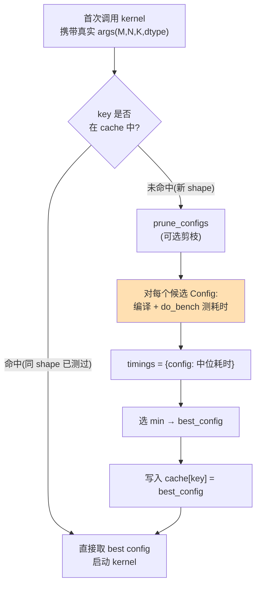

# L2 · 会调① — Triton Autotune：别手猜 launch 配置

> **源基线**: `triton main @ 70e0929`（2026-06-25），v3.8.0 ｜ 锚定 `python/tutorials/03-matrix-multiplication.py` 的 autotune 段 + `python/triton/runtime/autotuner.py`（逐行可核验）
> **维度**: 学习路线 L2（会调）｜ 能力：**会调**
> 上一阶段 [[triton_03_matmul_guide]] 你已经能写出 matmul kernel，但 `BLOCK_SIZE_M/N/K`、`num_warps` 这些旋钮该取多少？本页讲 Triton 的自动调参机制 `@triton.autotune`：给一份候选菜单，让它在你的真实 shape 上 benchmark 出最优。前置 [[triton_01_programming_model_guide]] 的 meta 参数概念。

---

## 1. 一条主线：你不该手猜 launch 配置

> **`BLOCK_SIZE`、`num_warps`、`num_stages` 的最优取值因 GPU 型号、矩阵 shape、dtype 而异——没有一个常数能通吃。正确做法是：给一份 `Config` 候选菜单，Triton 在你的真实输入上把每个候选都编译并 benchmark 一遍，选出最快的那个，再按 `key` 把结果缓存起来，后续相同 shape 直接复用。**

手猜的问题：向量加法里 `BLOCK_SIZE=1024` 拍脑袋能用，但 matmul 的搜索空间是 `BLOCK_SIZE_M × N × K × num_warps × num_stages` 的笛卡尔积，且最优点随 shape 漂移。`@triton.autotune` 把「猜」换成「测」。

| 概念 | 含义 | 源 |
|---|---|---|
| `triton.Config` | 一个候选配置 = meta 参数 + 编译选项（`num_warps`/`num_stages`/...） | `autotuner.py:328-358` |
| `@triton.autotune(configs, key)` | 装饰器：声明候选菜单 + 触发重测的 key | `autotuner.py:408`；matmul `:228-231` |
| benchmark 每个候选 | 逐个 `Config` 跑 `do_bench`，取中位耗时，选最小 | `autotuner.py:240,243` |
| 按 key 缓存 | key 值未变 → 命中缓存不重测 | `autotuner.py:228,266` |



> 图注：autotune 的运行时决策流——新 shape 触发「全菜单 benchmark」（橙框，慢），相同 shape 命中缓存（快）。对应 `autotuner.py:run()` `:217-282`。

---

## 2. demo：给 matmul 加 autotune

官方 `03-matrix-multiplication.py` 的做法分两步。**第一步**：写一个返回 `Config` 列表的函数（源 `get_cuda_autotune_config()` `:164-199`，下面摘前 8 条 + 1 条 fp8 专用，共 16 条）：

```python
import triton

def get_cuda_autotune_config():
    return [
        triton.Config({'BLOCK_SIZE_M': 128, 'BLOCK_SIZE_N': 256, 'BLOCK_SIZE_K': 64, 'GROUP_SIZE_M': 8},
                      num_stages=3, num_warps=8),                       # 源 :166-167
        triton.Config({'BLOCK_SIZE_M': 64,  'BLOCK_SIZE_N': 256, 'BLOCK_SIZE_K': 32, 'GROUP_SIZE_M': 8},
                      num_stages=4, num_warps=4),                       # 源 :168-169
        triton.Config({'BLOCK_SIZE_M': 128, 'BLOCK_SIZE_N': 128, 'BLOCK_SIZE_K': 32, 'GROUP_SIZE_M': 8},
                      num_stages=4, num_warps=4),                       # 源 :170-171
        # ... 略 ...
        triton.Config({'BLOCK_SIZE_M': 64,  'BLOCK_SIZE_N': 32,  'BLOCK_SIZE_K': 32, 'GROUP_SIZE_M': 8},
                      num_stages=5, num_warps=2),                       # 源 :178-179（小块 → 多 stage、少 warp）
        # Good config for fp8 inputs.（源注释 :182）
        triton.Config({'BLOCK_SIZE_M': 128, 'BLOCK_SIZE_N': 256, 'BLOCK_SIZE_K': 128, 'GROUP_SIZE_M': 8},
                      num_stages=3, num_warps=8),                       # 源 :183-184
        # ... 共 16 条，完整见源 :164-199 ...
    ]
```

**第二步**：把 `@triton.autotune` 叠在 `@triton.jit` 之上（源 `:228-232`，**autotune 在外、jit 在内**）：

```python
@triton.autotune(
    configs=get_autotune_config(),   # 候选菜单（CUDA 走上面 16 条，HIP 走另一套 :202-213）
    key=['M', 'N', 'K'],             # 这三个值变了才重新 autotune（源 :230）
)
@triton.jit
def matmul_kernel(a_ptr, b_ptr, c_ptr, M, N, K, ...,
                  BLOCK_SIZE_M: tl.constexpr, BLOCK_SIZE_N: tl.constexpr,
                  BLOCK_SIZE_K: tl.constexpr, GROUP_SIZE_M: tl.constexpr, ...):
    ...
```

关键点：**meta 参数不再由你传**。host 端启动时只给 `M,N,K,stride...`，`BLOCK_SIZE_*` / `GROUP_SIZE_M` 这些 `constexpr` 由 autotuner 从胜出的 `Config` 注入（源 `run()` 在 `:276-280` 用 `**config.all_kwargs()` 把它们补进 kernel 调用）。源对此的官方说明见注释 `:223-227`：autotune「消费一份 `Config` 列表」+「一个 key，其值变化触发对所有 config 的评估」。

---

## 3. Config 字段逐个讲

`class Config.__init__` 签名（源 `:351`）：

```python
def __init__(self, kwargs, num_warps=4, num_stages=3, num_ctas=1,
             maxnreg=None, pre_hook=None, ir_override=None):
```

### `kwargs` —— meta 参数字典（`BLOCK_SIZE_*` / `GROUP_SIZE_M`）
第一个位置参数，docstring 称为「a dictionary of meta-parameters to pass to the kernel as keyword arguments」（源 `:332-333`）。matmul 里它装的就是 `{'BLOCK_SIZE_M':..., 'GROUP_SIZE_M':...}`——这些在 kernel 签名里都是 `tl.constexpr`（matmul `:245-246`），决定每个 program 处理多大的 tile、tile 的分组顺序（`GROUP_SIZE_M` 影响 L2 复用，详见 [[triton_03_matmul_guide]]）。**无默认值**，每条 Config 必须显式给。

### `num_warps` —— 块内并行度（默认 `4`，源 `:351`）
官方 docstring（源 `:334-337`）：「the number of warps to use for the kernel when compiled for GPUs. For example, if `num_warps=8`, then each kernel instance will be automatically parallelized to cooperatively execute using `8 * 32 = 256` threads.」

即：**一个 program（一个 tile）由多少个 warp 协作完成**。`num_warps=8` → 256 个线程一起算这块。它直接影响 occupancy——warp 越多，单块算力越强但每块占的寄存器/SRAM 也越多，能并发的块数（占用率）随之下降。这是个权衡，没有通用最优，故交给 autotune。注意源里小 tile 常配小 `num_warps`（如 `:178-179` 的 `32×64` 块配 `num_warps=2`），大 tile 配大 `num_warps`（如 `:166-167` 的 `128×256` 块配 `num_warps=8`）。

### `num_stages` —— 软件流水线级数（默认 `3`，源 `:351`）
官方 docstring（源 `:338-340`）：「the number of stages that the compiler should use when software-pipelining loops. Mostly useful for matrix multiplication workloads on SM80+ GPUs.」

机制：matmul 主循环里每次迭代要从 HBM 把下一块 A/B 搬进 SRAM 再算。`num_stages=N` 让编译器把循环展开成 N 级流水，用 `cp.async`（SM80+ 的异步拷贝）**提前预取后续若干块**，让访存与计算重叠，掩盖 HBM 延迟。代价是每多一级就多占一份 SRAM 缓冲。这与 [[triton_06_optimization_profiling_guide]] 讲的流水线/double-buffering 优化是同一回事，只是这里由 autotune 帮你选级数。docstring 明确它「主要对 SM80+ 上的矩阵乘有用」——对 memory-bound 的逐元素 kernel 调它意义不大。

### `num_ctas` —— block cluster 大小（默认 `1`，源 `:351`）
docstring（源 `:341-342`）：「number of blocks in a block cluster. SM90+ only.」即 Hopper（SM90）才有的 thread block cluster 特性，多个 block 组成一个 cluster 共享分布式 SRAM。非 Hopper 卡保持默认 `1` 即可。

### `maxnreg` —— 每线程最大寄存器数（默认 `None`，源 `:351`）
docstring（源 `:343-345`）：「maximum number of registers one thread can use. Corresponds to ptx `.maxnreg` directive. Not supported on all platforms.」限制寄存器用量可提高 occupancy（更多块并发），但过低会导致寄存器溢出到 local memory。默认 `None` = 不限制。

> 这些字段最终如何进 kernel：`Config.all_kwargs()`（源 `:369-381`）把 `kwargs` 和非 `None` 的 `num_warps/num_ctas/num_stages/maxnreg/ir_override` 合并成一个 dict，由 `run()` 注入。

---

## 4. key 与缓存机制

`key=['M', 'N', 'K']`（matmul `:230`）的语义，官方 docstring（源 `:437-438`）：「a list of argument names whose change in value will trigger the evaluation of all provided configs.」

运行时逻辑在 `Autotuner.run()`（源 `:217-282`）：

1. **构造缓存键**（源 `:223-227`）：从实参里取出 `key` 列出的那些参数的值（这里是 `M,N,K`），并**额外追加每个 tensor 参数的 `dtype` 字符串**（源 `:224-226`），拼成 tuple。
2. **查缓存**（源 `:228`）：`if key not in self.cache:` → 未命中才进入 benchmark 分支；命中则跳过，直接 `config = self.cache[key]`（源 `:266`）。
3. **记录 best_config**（源 `:269`）：`self.best_config = config`——胜出配置存在 kernel 对象上，可事后查看（见 §7）。

```
首次 (M=512,N=512,K=512,fp16) → key 未命中 → 测 16 个 config → 选最优 → cache[key]=best
再来 (M=512,N=512,K=512,fp16) → key 命中           → 0 开销，直接用 best
换成 (M=1024,...)              → 新 key 未命中     → 又测 16 个 config（重新 autotune）
```

**两个隐含捷径**（源）：
- 若整份 `configs` 只有 1 条（或被剪到只剩 1 条），直接采用、**不 benchmark**（源 `:220` `if len(self.configs) > 1` 把关；`:232-235` 对剪枝后单候选也跳过测试）。
- 不带 `@autotune` 但想要默认行为时，`Autotuner` 在 `configs` 为空时回退到单条默认 `Config({}, num_warps=4, num_stages=3, num_ctas=1)`（源 `:32-33`）。

此外可选**磁盘缓存**：`cache_results=True` 或环境变量 `TRITON_CACHE_AUTOTUNING`（源 knobs `knobs.py:383`）会把 timings 落盘（源 `check_disk_cache` `:175-215`），跨进程复用调参结果。

---

## 5. 进阶参数：剪枝与原地 kernel 的重置/还原

`autotune` 完整签名（源 `:408-409`）：

```python
def autotune(configs, key, prune_configs_by=None, reset_to_zero=None,
             restore_value=None, pre_hook=None, post_hook=None, ...):
```

### `prune_configs_by` —— 提前剪掉不值得测的候选
一个 dict，含三个字段（docstring 源 `:439-444`）：`perf_model`（用性能模型预测耗时）、`top_k`（只保留预测最快的前 k 个去真测）、`early_config_prune`（自定义剪枝函数，须至少返回 1 个 config）。逻辑在 `prune_configs()`（源 `:284-313`）：先跑 `early_config_prune` 过滤非法/低效配置（源 `:286-290`），再用 `perf_model` 估时、排序、截取 `top_k`（源 `:291-312`）。用途：当菜单很大时，**避免把每个 config 都真测一遍**，先用启发式砍掉一批。

### `reset_to_zero` / `restore_value` —— 给原地 kernel 的安全网
这是为什么需要它们：benchmark 时**每个 config 都会真实运行一次 kernel**（源 `:240` 的 `_bench` 循环），docstring 在 `:426-429` 明确警告——「当所有配置被评估时，kernel 会运行多次，意味着 kernel 更新的任何值都会被更新多次」。对**累加型 / 原地（in-place）kernel** 这是灾难：被加了 16 次。

- `reset_to_zero`（docstring 源 `:445-446`）：一组参数名，**每个 config 评估前清零**。实现见 `_pre_hook`（源 `:59-62`）调 `kwargs[name].zero_()`。
- `restore_value`（docstring 源 `:447-448`）：一组参数名，**每个 config 评估后还原**。实现：评估前 `clone()` 一份（源 `:64-68`），评估后在 `_post_hook` 里 `copy_()` 写回（源 `:77-80`）。

源把这两套逻辑统一挂在 `pre_hook`/`post_hook` 上（源 `:42-47` 收集名单，`:57-82` 装配钩子），也允许用户传自定义 `pre_hook`/`post_hook` 覆盖默认行为（源 `:54-56,72-74`）。

> matmul 的 C 是直接写（非累加）、且每次重算，所以它**没用** `reset_to_zero`——这恰说明：是否需要取决于 kernel 是否在 benchmark 间被污染。

---

## 6. 代价与陷阱

**陷阱一：首调极慢。** 首次遇到新 key 时，autotuner 要把**每个候选 config 都编译一遍并 benchmark**（源 `:240` `{config: self._bench(...) for config in pruned_configs}`）。16 个 config 就是 16 次编译 + 16 次计时，首次调用可能卡几秒甚至几十秒。后续命中缓存才快。**生产部署务必做 warmup**（先用真实 shape 跑一次，把调参开销挪到服务启动阶段）。

> 编译失败/资源不够的 config 不会让程序崩，而是被记为 `inf` 耗时直接淘汰（源 `:170-173`：`OutOfResources` 等异常 → 返回 `[inf,inf,inf]`）。所以菜单里塞个别超大 tile 是安全的。

**陷阱二：动态 shape → 反复重 autotune。** 缓存键由 `M,N,K` 的**实际值**（外加 dtype，源 `:224-226`）构成。如果你的输入 shape 不停变化（变长序列、动态 batch），几乎每次调用都是新 key → cache miss → 又把整份菜单测一遍，调参开销吃满，得不偿失。这是真实工程陷阱：

- 缓解 1：把 shape **分桶 / padding 到固定档位**，让 key 收敛到有限几种。
- 缓解 2：候选菜单**精简**到几条，缩短每次重测时间。
- 缓解 3：用 `prune_configs_by` 的 `perf_model` 先剪枝（§5）。
- 缓解 4：开 `TRITON_CACHE_AUTOTUNING` 磁盘缓存（§4），至少跨进程不重复。

> 注意 dtype 也进 key：fp16 调好的结果，换 fp8 会重新 autotune（这也是为什么菜单里专门给了 fp8 config，源 `:182-198`）。

---

## 7. 动手验证

```bash
cd triton/python/tutorials
TRITON_PRINT_AUTOTUNING=1 python 03-matrix-multiplication.py
```

`TRITON_PRINT_AUTOTUNING` 是**已核实存在**的环境变量：定义在 `knobs.py:384`（`print: env_bool = env_bool("TRITON_PRINT_AUTOTUNING")`），autotune docstring 也说明（源 `:431-433`）「若该变量设为 `"1"`，Triton 会在每个 kernel 调参后打印一条消息，含调参耗时和最优配置」。打印逻辑见 `run()` 源 `:270-272`，会输出形如 `best config selected: BLOCK_SIZE_M: 128, ..., num_warps: 8, num_stages: 3`。

**代码内查看胜出配置**：autotuner 把结果存在 `best_config` 字段（已核实，源 `:269` `self.best_config = config`）。被 `@triton.autotune` 装饰后的 `matmul_kernel` 实际是个 `Autotuner` 对象，调用过一次后即可读取：

```python
matmul(a, b)                      # 触发一次真实运行 → 完成 autotune
print(matmul_kernel.best_config)  # 打印胜出的 Config（含 BLOCK/num_warps/num_stages）
```

**对照实验**：把 `M,N,K` 从 512 改成 1024 再调一次，观察 `TRITON_PRINT_AUTOTUNING` 是否**再次**打印调参信息——会，因为 key 变了（§4/§6）。再用同一 shape 调第二次，则不打印（命中缓存）。这直观验证了「按 key 缓存」。

---

## 8. 「会调①」能力清单

- [ ] 能讲清主线：不手猜，给 `Config` 菜单让 Triton 真测出最优（`autotuner.py:240,243`）
- [ ] 会写 `get_*_config()` + `@triton.autotune(configs=, key=)` 叠在 `@triton.jit` 上（matmul `:228-232`）
- [ ] 说得出 5 个字段：`kwargs`/`num_warps`/`num_stages`/`num_ctas`/`maxnreg` 各自含义与默认值（`autotuner.py:351`）
- [ ] 理解 `key` 决定何时重测、值含 dtype、命中即零开销（`autotuner.py:223-228,266`）
- [ ] 知道 `reset_to_zero`/`restore_value` 是给原地/累加 kernel 防污染的（`autotuner.py:445-448,59-80`）
- [ ] 警惕两大陷阱：首调慢（要 warmup）、动态 shape cache miss（要分桶）
- [ ] 会用 `TRITON_PRINT_AUTOTUNING=1` 和 `.best_config` 观察谁胜出（`knobs.py:384`；`autotuner.py:269`）

下一步 → [[triton_05_debug_guide]]：kernel 调对了配置但结果不对怎么排查（`TRITON_INTERPRET`、`device_print`）；性能侧的流水线/访存优化见 [[triton_06_optimization_profiling_guide]]。

---

## 相关页面

- [[index]] — Triton 学习路线总索引
- [[triton_03_matmul_guide]] — 前置：被调参的 matmul kernel 本体、`GROUP_SIZE_M` 的 L2 复用
- [[triton_01_programming_model_guide]] — meta 参数 / `constexpr` 的来历
- [[triton_06_optimization_profiling_guide]] — `num_stages` 背后的软件流水线与访存优化原理
- [[triton_05_debug_guide]] — 配置对了但结果错的排查路径
- [[triton_knowledge_map]] — 全图：autotune 在 Triton 能力树中的位置
- [[21_inductor_autotuning_analysis]] — `torch.compile` 的 max-autotune 在更上层自动做同一件事（自动生成 + benchmark Triton/cutlass 候选）
- [[20_inductor_codegen_analysis]] — Inductor 如何生成被 autotune 的 Triton kernel
- [[gpu_kernel_guide]] — occupancy / warp / 寄存器压力的硬件背景（`num_warps`/`maxnreg` 的物理含义）
