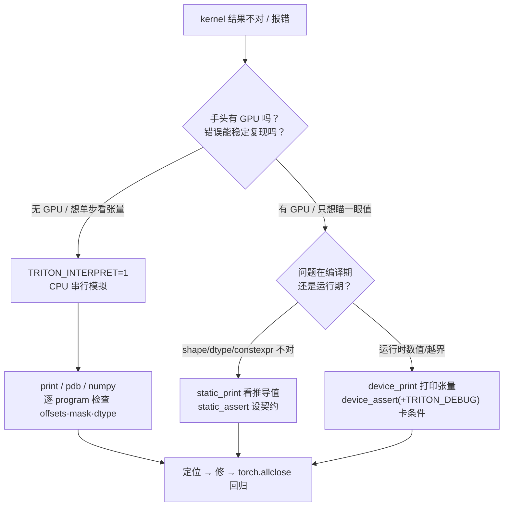

# L3 · 会 debug — Triton 调试：CPU 解释器 + 打印/断言四件套

> **源基线**: `triton-lang/triton` `main @ 70e0929`（2026-06-25），v3.8.0 ｜ 本地源根 `E:/97-codes/torch_parallel/triton`
> **维度**: 学习路线 L3（会 debug）｜ 能力：**会 debug**
> kernel 在 GPU 上并行跑、中间 IR 不透明，传统 `printf`/断点几乎用不上。本页给出 Triton 自带的全套调试武器：**CPU 解释器模式 `TRITON_INTERPRET=1`**（把 kernel 搬到纯 Python 里逐 program 模拟，`print`/`pdb`/numpy 随便用、无需 GPU）+ 设备端 `device_print` / 编译期 `static_print`·`static_assert` / 运行期 `device_assert`。前置：[[triton_01_programming_model_guide]]。

---

## 1. 一条主线：把「并行 + 不透明」退化成「串行 + 纯 Python」

> **Triton 难 debug 的根因有两条：① kernel 在 GPU 上成百上千个 program 同时跑，没有断点、没有 stdout 顺序；② `@triton.jit` 之后源码被编译进 Triton IR → LLVM IR → PTX，中间产物对你不透明（见 [[triton_vs_mlir_backend_analysis]]）。解药是把问题「降维」——用 `TRITON_INTERPRET=1` 让 kernel 在 CPU 上用纯 Python 逐 program 串行模拟执行，于是 `print`/`pdb`/numpy 全部恢复可用；GPU 上则用 `device_print` 远程打印、`static_*` 在编译期就拦下错误、`device_assert` 做运行期检查。**

### 工具速查表

| 工具 | 源定位 | 编译期 / 运行期 | 需 `TRITON_DEBUG`？ | 一句话 |
|---|---|---|---|---|
| `TRITON_INTERPRET=1` | `knobs.py:471` | 运行前换执行后端 | 否 | CPU 纯 Python 模拟，`print`/`pdb` 可用，无需 GPU |
| `tl.static_print(...)` | `core.py:3398` | **编译期** | 否 | 打印 constexpr / 推导出的 dtype·shape |
| `tl.static_assert(cond)` | `core.py:3414` | **编译期** | **否**（`:3416-3417` 明示） | 编译期断言，不满足直接编译失败 |
| `tl.device_print("pfx", v)` | `core.py:3428` | **运行期**（设备） | 否 | 从 GPU 流式打印运行时张量值 |
| `tl.device_assert(cond)` / `assert` | `core.py:3478` | **运行期**（设备） | **是**（`:3480-3481` 明示） | 设备端断言，仅当 `TRITON_DEBUG!=0` 才生效 |

> ⚠️ 易混点：builtin `print` 在 kernel 里**不是** Python 的 print——它被映射到 `device_print`（`core.py:3402-3403`、`:3434`），参数规则随 `device_print`（首参必须是字符串字面量）。

### 调试决策流



---

## 2. 解释器模式 `TRITON_INTERPRET`

**怎么开**：设环境变量即可，无需改一行 kernel 代码：

```bash
TRITON_INTERPRET=1 python my_kernel.py      # Linux/Mac
$env:TRITON_INTERPRET=1; python my_kernel.py  # PowerShell
```

判定逻辑就是简单的 env 读取：`knobs.py:471` 的 `interpret = env_bool("TRITON_INTERPRET")`，以及测试侧 `_internal_testing.py:32` 的 `os.environ.get('TRITON_INTERPRET','0')=='1'`。

**机制（这是关键）**：开启后，被 `@triton.jit` 装饰的函数不再走「编译成 PTX 上 GPU」，而是改由 `InterpretedFunction`（`interpreter.py:1511`）接管。它把所有张量参数**拷回 host（CPU）**（`interpreter.py:1393` 调 `_to_cpu`），然后用一个三重 `for` 循环**逐 program 串行**执行 kernel 体：

```python
# interpreter.py:1410-1414（逐字结构）
for x in range(grid[0]):
    for y in range(grid[1]):
        for z in range(grid[2]):
            interpreter_builder.set_grid_idx(x, y, z)
            self.fn(**args)          # 用纯 Python/numpy 跑这一个 program
```

`tl.program_id(axis)` 这时返回的就是当前循环下标（`interpreter.py:498` `create_get_program_id` 直接取 `grid_idx[axis]`）；`tl.load/store` 退化成 numpy 取址。**因为整段在 Python 解释器里跑，你可以**：

- 在 kernel 体里直接写 Python `print(...)`、`import pdb; pdb.set_trace()` 单步；
- 打印任意中间张量（它们就是普通 numpy 数组）；
- **完全不需要 GPU**——这正是「无 GPU 也能学 Triton」的底座（呼应 [[triton_01_programming_model_guide]] §6 的无 GPU 动手验证）。

异常处理也对调试友好：kernel 体内抛的异常会被包成 `InterpreterError` 并**保留原始报文**（`interpreter.py:1415-1418`），定位比 GPU 上一句 `CUDA error: illegal memory access` 清楚得多。（提示：源同处显示，设 `TRITON_FRONT_END_DEBUGGING` 可让原始异常直接 re-raise，保留完整 traceback。）

**代价 / 局限**（重要，别误用）：
- **慢**：纯 Python 串行跑每个 program，规模一大就难以忍受——只用最小复现 shape；
- **串行**：它**不**暴露 GPU 上的并发/竞态问题（race、`atomic`、barrier 时序），这类 bug 解释器抓不到；
- **并非所有特性都支持**：偏底层/硬件相关的算子在模拟器下可能缺失或行为不完全一致。解释器是**语义**调试器，不是**性能/并发**调试器（性能见 [[triton_06_optimization_profiling_guide]]）。

---

## 3. 打印与断言四件套

### ① `tl.device_print` —— 运行期从 GPU 打印（`core.py:3428`）

docstring（`:3430-3432`）明确两条铁律：**字符串格式化对运行时值无效**，要打印的值必须作为**参数**逐个传；**首参必须是字符串字面量**（`:3457` 校验 `isinstance(prefix, str)`，且断言为 ASCII），其后是标量或张量。builtin `print` 等价于它（`:3434`）。

```python
pid = tl.program_id(0)
offsets = pid * BLOCK_SIZE + tl.arange(0, BLOCK_SIZE)
tl.device_print("offsets", offsets)   # 对 ✓：值作参数传
print("pid", pid)                      # 等价 ✓（builtin print 映射到 device_print）
# tl.device_print(f"pid={pid}")        # 错 ✗：f-string 里的运行时值不会被格式化（:3430-3431）
```

> CUDA 上 printf 走有限大小的缓冲区（docstring `:3443-3451` 实测约 6912 KiB），打印过多会被丢弃，可用 `triton.runtime.driver.active.utils.set_printf_fifo_size(...)` 调大。

### ② `tl.static_print` —— 编译期打印（`core.py:3398`）

在**编译期**把 constexpr / 推导出的 dtype·shape 打到终端，最适合排查「类型/形状被推成了什么」。docstring 例（`:3408`）：

```python
tl.static_print(f"BLOCK_SIZE={BLOCK_SIZE}")      # 编译时即打印
tl.static_print("x dtype", x.dtype)              # 看张量被推导成的 dtype（排查 bug②）
```

### ③ `tl.static_assert` —— 编译期断言（`core.py:3414`）

编译期校验契约，**不需要** `TRITON_DEBUG`（docstring `:3416-3417` 原文：*Does not require that the `TRITON_DEBUG` environment variable is set*）。不满足直接编译失败，零运行时开销：

```python
tl.static_assert(BLOCK_SIZE == 1024)             # docstring :3422 例
tl.static_assert(BLOCK_SIZE & (BLOCK_SIZE - 1) == 0, "BLOCK_SIZE 必须是 2 的幂")
```

### ④ `tl.device_assert` / `assert` —— 运行期断言（`core.py:3478`）

设备端运行时断言，**必须** `TRITON_DEBUG` 设为非 `0` 才生效（docstring `:3480-3481`；该 env 真实存在于 `knobs.py:474` `debug = env_bool("TRITON_DEBUG").get()`）。Python `assert` 语句等价于它，但第二参数必须给且为字符串（`:3483-3485`）；`cond` 要求是 boolean 张量（`:3493`）：

```python
tl.device_assert(offsets < n_elements)           # docstring :3490 风格
assert pid == 0, "pid != 0"                       # 等价；需 TRITON_DEBUG!=0 才有效（:3491）
```

```bash
TRITON_DEBUG=1 python my_kernel.py    # 不设这个，上面的 device_assert/assert 形同空操作
```

> 一句话区分：`static_*` 在**编译期**、不看 env；`device_print` 运行期、不看 env；`device_assert` 运行期、**只认 `TRITON_DEBUG`**。

---

## 4. demo：从越界 bug 到修复

取 [[triton_01_programming_model_guide]] 里**已知正确**的向量加法 kernel，**故意删掉 `mask`** 造一个尾块越界 bug，再用解释器 + 打印抓住它。下列 API（`program_id`/`arange`/`load`/`store`/`device_print`）均在源中核实过。

```python
import torch, triton
import triton.language as tl

# —— 错误版：删掉了 mask（offsets 在尾块会越过 n_elements）——
@triton.jit
def add_buggy(x_ptr, y_ptr, out_ptr, n_elements, BLOCK_SIZE: tl.constexpr):
    pid = tl.program_id(axis=0)
    offsets = pid * BLOCK_SIZE + tl.arange(0, BLOCK_SIZE)
    tl.device_print("pid", pid)                 # 运行期打印：看是哪个 program
    tl.device_print("offsets", offsets)         # 打印这一块负责的全局下标
    x = tl.load(x_ptr + offsets)                # ✗ 无 mask：尾块读越界
    y = tl.load(y_ptr + offsets)
    tl.store(out_ptr + offsets, x + y)          # ✗ 无 mask：尾块写越界

def add(x, y, kernel):
    out = torch.empty_like(x)
    n = out.numel()
    grid = lambda meta: (triton.cdiv(n, meta['BLOCK_SIZE']),)
    kernel[grid](x, y, out, n, BLOCK_SIZE=64)   # 故意让 size 不是 64 的倍数 → 触发尾块
    return out

size = 100                                       # 100 不是 64 的倍数：第 2 个 program 越界
x = torch.rand(size); y = torch.rand(size)       # CPU 张量（解释器模式下即可）
out = add(x, y, add_buggy)
print("allclose:", torch.allclose(out, x + y))   # 预期 False / 或直接抛 InterpreterError
```

**抓 bug（无需 GPU）**：

```bash
TRITON_INTERPRET=1 python demo.py
```

解释器把 kernel 搬到 CPU 串行跑（§2），两条 `device_print` 会打出每个 program 的 `pid` 与 `offsets`。你会看到 **`pid=1` 的 `offsets` 取到 64..127，越过了 `n_elements=100`**——尾块下标超界一目了然；越界访问要么让 `torch.allclose` 返回 `False`（尾部数值错乱），要么直接抛被包成 `InterpreterError` 的异常（`interpreter.py:1415-1418`），并指向出错的源码行。需要更细可在该行前 `import pdb; pdb.set_trace()` 单步看 numpy 数组。

**修复**：把 `mask` 补回（与 §源基线的正确版一致），越界位置不再访存：

```python
@triton.jit
def add_fixed(x_ptr, y_ptr, out_ptr, n_elements, BLOCK_SIZE: tl.constexpr):
    pid = tl.program_id(axis=0)
    offsets = pid * BLOCK_SIZE + tl.arange(0, BLOCK_SIZE)
    mask = offsets < n_elements                  # ✓ 越界保护
    x = tl.load(x_ptr + offsets, mask=mask)
    y = tl.load(y_ptr + offsets, mask=mask)
    tl.store(out_ptr + offsets, x + y, mask=mask)
```

```python
out = add(x, y, add_fixed)
assert torch.allclose(out, x + y)                # ✓ 回归通过
print("max diff:", (out - (x + y)).abs().max())  # 预期 0.0
```

**复盘**：解释器把「GPU 上一句模糊的 illegal memory access」变成「CPU 上能打印、能单步、能定位到行的 Python 错误」——这就是 §1 主线「降维」的全部价值。

---

## 5. 五类高频 bug 速查

| # | 症状 | 根因 | 怎么抓 | 修法 |
|---|---|---|---|---|
| ① | `illegal memory access` / 结果尾部错 | 缺/错 `mask`，尾块越界 | `TRITON_INTERPRET=1` + `device_print("offsets", offsets)`，看是否 ≥ `n_elements`；解释器下越界即报/数值错 | 补 `mask = offsets < n_elements`，load/store 都带上 |
| ② | 数值偏差大 / `tl.dot` 类型报错 | dtype 不匹配（fp16 输入喂进 fp32 累加器，或 `.to()` 漏写） | `tl.static_print("x dtype", x.dtype)`（`core.py:3398`）在编译期看推导 dtype | 累加器显式 `tl.float32`，必要处 `x.to(tl.float32)` |
| ③ | 结果整体错位 / 转置 | 指针-stride 算术错：`[:, None]` 与 `[None, :]` 广播方向反了 | 解释器 + `print(offsets)`，逐 program 对照预期下标 | 校正广播轴与 `stride`，行 `[:,None]`、列 `[None,:]` |
| ④ | `tl.arange` 报错 / 形状错 / 改值不生效 | `BLOCK_SIZE` 非 2 的幂，或漏标 `: tl.constexpr` | `tl.static_assert(BLOCK_SIZE & (BLOCK_SIZE-1) == 0)`（`core.py:3414`）编译期即拦 | 标 `: tl.constexpr` 且取 2 的幂 |
| ⑤ | 编译失败 `out of shared memory` | `num_stages` 过大，软件流水占用 SRAM 超额 | 编译期错误信息直指 shared memory 超额；对照卡的 SRAM 容量 | 调小 `num_stages` / `BLOCK_SIZE`，详见 [[triton_04_autotune_guide]] |

---

## 6. 调试工作流

```
1. 缩小到最小可复现 shape   ── size 取「刚好触发尾块/边界」的小数（如 BLOCK=64, size=100）
2. TRITON_INTERPRET=1 跑    ── CPU 串行模拟，print/pdb/numpy 全可用，无需 GPU
3. 打印关键中间量          ── device_print/print 看 pid·offsets·mask·dtype；static_print 看 constexpr
4. 定位根因                ── 对照「五类高频 bug」表；必要时 pdb 单步看 numpy 数组
5. 修                      ── 最小改动（补 mask / 改 dtype / 正广播轴 / 调 num_stages）
6. 回归                    ── 关掉解释器、回 GPU，torch.allclose(out, ref) 验证语义不变
```

要点：**先在解释器里把语义调对，再回 GPU 调性能**。解释器只管「算得对不对」，并发/性能问题（race、占用率、流水）属于另一阶段——见 [[triton_06_optimization_profiling_guide]]。

---

## 7. 「会 debug」能力清单

- [ ] 能说清 Triton 难调的两条根因（GPU 并行 + 中间 IR 不透明），以及解释器「降维」为何是解药
- [ ] 会用 `TRITON_INTERPRET=1` 在**无 GPU** 的 CPU 上跑 kernel，并用 `print`/`pdb` 检查中间张量
- [ ] 分得清四件套的触发时机：`static_*`=编译期·不看 env；`device_print`=运行期·不看 env；`device_assert`/`assert`=运行期·**需 `TRITON_DEBUG!=0`**
- [ ] 知道 kernel 里 builtin `print` 其实是 `device_print`，且字符串格式化对运行时值无效（值要当参数传）
- [ ] 能独立复现 demo：删 `mask` → 解释器 + 打印抓越界 → 补 `mask` → `torch.allclose` 回归
- [ ] 能对照「五类高频 bug」表，用正确的工具（解释器 / `static_print` / `static_assert`）定位并修复
- [ ] 知道解释器的边界：抓不到并发/竞态、不反映真实性能

下一步 → [[triton_06_optimization_profiling_guide]]：语义调对之后，怎么量化并优化 kernel 的性能。

---

## 相关页面

- [[index]] — Triton 学习路线总索引
- [[triton_knowledge_map]] — 能力图谱中本页的位置（L3 会 debug）
- [[triton_01_programming_model_guide]] — 前置：SPMD/`mask`/`constexpr`，demo 的正确基准
- [[triton_00_gpu_essentials_guide]] — GPU 执行模型（理解为何 GPU 难直接调试）
- [[triton_02_fused_softmax_guide]] — reduction kernel，dtype/形状 bug 的常见场景
- [[triton_03_matmul_guide]] — 指针-stride 算术与广播方向（bug③）的高发地
- [[triton_04_autotune_guide]] — `num_stages`/`BLOCK_SIZE`（bug④⑤）与 SRAM 约束
- [[triton_06_optimization_profiling_guide]] — 下一步：语义对了之后调性能
- [[triton_vs_mlir_backend_analysis]] — 「中间 IR 不透明」的背景：`@triton.jit` 后的编译流水线
- [[gpu_kernel_guide]] — CUDA 视角的并发/竞态，解释器抓不到的那一类
