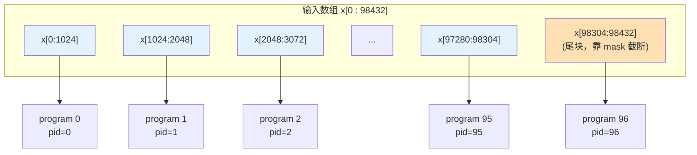

# L1 · 会写① — Triton 编程模型与你的第一个 kernel（向量加法）

> **源基线**: `triton main @ 70e0929`，v3.8.0 ｜ 锚定 `python/tutorials/01-vector-add.py`（逐行可核验）
> **维度**: 学习路线 L1（会写）｜ 能力：**会写**
> 本页用官方最小 demo「向量加法」手把手讲清 Triton 的 SPMD block 编程模型：`@triton.jit` / `program_id` / `arange` / `mask` / `load·store` / grid。读完你能独立写出任意逐元素 kernel。前置：[[triton_01_gpu_essentials_guide]]。

---

## 1. 一条主线：SPMD —— 「写一个 program 怎么处理一块，启动一大群」

> **Triton 的编程模型是 SPMD（Single Program, Multiple Data）：你只写「第 `pid` 个 program 如何处理它负责的那一块数据」，然后用一个 grid 同时启动成百上千个 program。块内的线程怎么分、访存怎么合并，编译器负责。**

对照 CUDA：CUDA 让你写「一个 thread 处理一个标量」；Triton 让你写「一个 program 处理一个**块**（block）」。块思维是 Triton 的全部精髓。



`grid = cdiv(98432, 1024) = 97` 个 program 并行跑，各管 1024 个元素，最后一个只有 128 个有效元素（靠 `mask` 处理）。

---

## 2. 完整 demo（逐字摘自官方源）

`01-vector-add.py` 的 kernel（源 `:29-54`）：

```python
import torch
import triton
import triton.language as tl

@triton.jit
def add_kernel(x_ptr,            # *指针*：第一个输入向量
               y_ptr,            # *指针*：第二个输入向量
               output_ptr,       # *指针*：输出向量
               n_elements,       # 向量长度（运行时标量）
               BLOCK_SIZE: tl.constexpr,   # 每个 program 处理多少元素（编译期常量）
               ):
    pid = tl.program_id(axis=0)                       # 我是第几个 program（1D grid，axis=0）
    block_start = pid * BLOCK_SIZE                     # 我负责的块起点
    offsets = block_start + tl.arange(0, BLOCK_SIZE)   # 块内 BLOCK_SIZE 个偏移（一个向量！）
    mask = offsets < n_elements                        # 越界保护：尾块超出的元素标 False
    x = tl.load(x_ptr + offsets, mask=mask)            # 从 HBM 读一块 x（mask 处不读）
    y = tl.load(y_ptr + offsets, mask=mask)            # 读一块 y
    output = x + y                                     # 整块相加（块级运算）
    tl.store(output_ptr + offsets, output, mask=mask)  # 写回一块（mask 处不写）
```

host 端 launcher（源 `:62-78`）：

```python
DEVICE = triton.runtime.driver.active.get_active_torch_device()   # 源 :26

def add(x: torch.Tensor, y: torch.Tensor):
    output = torch.empty_like(x)                       # 预分配输出（:64）
    assert x.device == DEVICE and y.device == DEVICE and output.device == DEVICE
    n_elements = output.numel()                        # :66
    grid = lambda meta: (triton.cdiv(n_elements, meta['BLOCK_SIZE']), )   # :70 网格大小=块数
    add_kernel[grid](x, y, output, n_elements, BLOCK_SIZE=1024)           # :75 启动！
    return output
```

正确性校验（源 `:84-93`）：

```python
torch.manual_seed(0)
size = 98432
x = torch.rand(size, device=DEVICE)
y = torch.rand(size, device=DEVICE)
output_torch  = x + y
output_triton = add(x, y)
print(f'max diff: {torch.max(torch.abs(output_torch - output_triton))}')   # 期望 0.0
```

---

## 3. 逐行讲解：六个必须吃透的点

### ① `@triton.jit` —— 标记一个 Triton kernel（源 `:29`）
被它装饰的函数在**首次调用时**被 JIT 编译成 GPU kernel（Triton 是 JIT，见 [[30_triton_vs_mlir_backend_analysis]]）。函数体内只能用 `tl.*` 的语言子集，不能用任意 Python。

### ② 参数：指针 + 标量 + `constexpr`（源 `:30-35`）
- `x_ptr` 等：传入的 `torch.Tensor` 会被**隐式转换成指向其首元素的指针**（源注释 `:72`）。kernel 里靠指针算术访问。
- `n_elements`：普通运行时标量。
- `BLOCK_SIZE: tl.constexpr`：**编译期常量**。标 `constexpr` 才能用作形状（`tl.arange` 的上界必须是 constexpr），且不同取值会触发不同的编译产物。

### ③ `tl.program_id(axis=0)` —— 定位「我是谁」（源 `:39`）
SPMD 的核心。1D grid 用 `axis=0`；2D/3D grid 可用 `axis=1/2`（matmul 会用到，见 [[triton_12_matmul_guide]]）。

### ④ `tl.arange(0, BLOCK_SIZE)` —— 生成一个**块**（源 `:45`）
这不是标量循环，而是一次性产生 `[0,1,...,BLOCK_SIZE-1]` 的**向量**。`block_start + arange(...)` 得到本 program 负责的 `BLOCK_SIZE` 个全局下标。**「一次操作一整块」正是 block 编程的体现**。⚠️ `BLOCK_SIZE` 必须是 2 的幂（Triton 限制，见 `02-fused-softmax.py:79-81`）。

### ⑤ `mask` —— 越界保护（源 `:47`）
当 `n_elements` 不是 `BLOCK_SIZE` 整数倍时，最后一个 program 的部分 `offsets` 会越界。`mask = offsets < n_elements` 把越界位置标 False；`tl.load(..., mask=mask)` 对 False 位置**不访存**（可选 `other=` 给默认值），`tl.store(..., mask=mask)` 对 False 位置**不写**。
> **这是新手第一大 bug 来源**：忘了 mask → 读/写越界 → 非法内存访问或静默错误。

### ⑥ grid 与启动（源 `:70,75`）
- `grid = lambda meta: (triton.cdiv(n_elements, meta['BLOCK_SIZE']),)`：grid 是个函数，接收 meta 参数（含 `BLOCK_SIZE`），返回 program 数量。`cdiv` = 向上取整除，保证覆盖所有元素。
- `add_kernel[grid](...)`：`kernel[grid](args)` 是 Triton 的启动语法（类比 CUDA 的 `<<<grid,block>>>`）。meta 参数（`BLOCK_SIZE=1024`）用**关键字**传。
- 启动是**异步**的：`add` 返回时 kernel 可能还在跑（源注释 `:76-77`），需要结果时 torch 会自动同步。

---

## 4. 机制：为什么这样设计

| 设计 | 动机 | 为什么不选「显式 thread」 |
|---|---|---|
| program 操作整块（不是单 thread） | 让编译器在块内自由排布线程、合并访存、用 SRAM | 显式 thread（CUDA）把 coalescing/shared mem 的负担全压给程序员，易错且占用心智 |
| `mask` 而非分支处理边界 | SIMT 下分支会发散；mask 是无发散的谓词执行 | `if offset < n` 会造成 warp divergence（见 [[01_gpu_kernel_guide]] §04） |
| `BLOCK_SIZE` 设为 `constexpr` | 块大小编译期已知 → 编译器能展开、向量化、算 SRAM 用量 | 运行时块大小无法静态优化 |

**为什么 `BLOCK_SIZE=1024` 是合理默认**：向量加法是 memory-bound（[[triton_01_gpu_essentials_guide]] §3 算过 AI≈0.083），大块 → 每个 program 发起更大的连续访存 → 更易打满带宽。最优值因卡而异——这正是下一阶段 [[triton_13_autotune_guide]] 要自动搜索的。

---

## 5. 新手高频 bug（对照自查）

| 症状 | 根因 | 修法 |
|---|---|---|
| `CUDA error: illegal memory access` | 忘了 `mask`，尾块越界 | `mask = offsets < n_elements`，load/store 都带上 |
| `tl.arange` 报错 / 形状错 | `BLOCK_SIZE` 不是 constexpr 或非 2 的幂 | 标 `: tl.constexpr`，取 2 的幂 |
| 结果全 0 或部分错 | grid 算少了，没覆盖全部元素 | 用 `triton.cdiv` 而非整除 |
| `BLOCK_SIZE` 改了不生效 | 当成普通参数传 | 必须作关键字 meta 参数：`kernel[grid](..., BLOCK_SIZE=1024)` |
| 没 GPU 跑不了 | 缺设备 | `TRITON_INTERPRET=1` 在 CPU 模拟，见 [[triton_14_debug_guide]] |

---

## 6. 动手验证（必做）

```bash
cd triton/python/tutorials
python 01-vector-add.py        # 应打印 max diff = 0.0，并画出 GB/s 曲线
```

无 GPU 时：
```bash
TRITON_INTERPRET=1 python 01-vector-add.py   # CPU 模拟执行，验证语义（详见 L3）
```

**改造练习（巩固「会写」）**：把 `add_kernel` 改成 `output = x * y + 1.0`（逐元素 FMA），或写一个 ReLU kernel `output = tl.where(x > 0, x, 0.0)`。只改 kernel 体的那一行计算，其余照搬——这说明逐元素 kernel 的模板是固定的。

---

## 7. 「会写①」能力清单

- [ ] 能默写 SPMD 五件套：`program_id` → `block_start` → `offsets=base+arange` → `mask` → `load/compute/store`
- [ ] 知道 `constexpr` 的作用与 `BLOCK_SIZE` 必须 2 的幂
- [ ] 会写 grid lambda + `cdiv`，理解 `kernel[grid](...)` 启动语法
- [ ] 理解 `mask` 防越界、且无 warp 发散
- [ ] 能把任意逐元素运算（FMA/ReLU/缩放）改写成 Triton kernel

下一步 → [[triton_11_fused_softmax_guide]]：当一行数据要做 max/sum 这种**跨元素归约**时怎么写，以及 fusion 为什么快。

---

## 相关页面

- [[index]] — Triton 学习路线总索引
- [[triton_01_gpu_essentials_guide]] — 前置：GPU 执行/内存层级与 roofline
- [[triton_11_fused_softmax_guide]] — 下一步：reduction 与 kernel fusion
- [[triton_14_debug_guide]] — `TRITON_INTERPRET` 无 GPU 调试、`device_print`
- [[10_cuda_execution_model_guide]] — Grid·Block·Warp·Thread·SM 执行模型（program ≈ block 的来龙去脉）
- [[01_gpu_kernel_guide]] — CUDA thread-level 视角对照（warp/coalescing 硬件细节）
- [[30_triton_vs_mlir_backend_analysis]] — `@triton.jit` 之后：Triton→PTX 编译流水线
