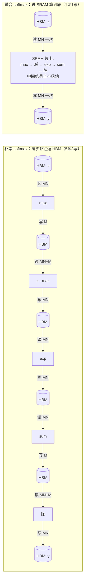

# L1 · 会写② — Fused Softmax：一行进 SRAM，片上算完只写一次

> **源基线**: `triton-lang/triton main @ 70e0929`（2026-06-25），v3.8.0 ｜ 锚定 `python/tutorials/02-fused-softmax.py`（逐行可核验）
> **维度**: 学习路线 L1（会写）｜ 能力：**会写②**（reduction + kernel fusion）
> 上一页 [[triton_10_programming_model_guide]] 写的是逐元素 kernel（一个输出只依赖一个输入位置）。本页迈出一步：当一行要做 `max` / `sum` 这种**跨元素归约**时怎么写，并用官方读写量公式证明 **kernel fusion 为什么快**。前置：[[triton_01_gpu_essentials_guide]]（roofline / memory-bound）。

---

## 1. 一条主线：fusion —— 「别在 HBM 之间来回搬，一次读进 SRAM 算到底」

> **朴素 softmax 把一行数据在 HBM 与片上之间来回搬了 5 趟读、3 趟写（每个中间结果都落地 DRAM 再读回）。融合后的 kernel 把整行一次性读进 SRAM，在片上依次做 `max → 减 → exp → sum → 除`，只把结果写回一次。省下的全是 HBM 带宽——softmax 是 memory-bound 的（算得少、搬得多），所以省带宽 ≈ 省时间。**

源在 tutorial 顶部就把这条主线讲透：朴素实现 `naive_softmax` 需「reading $5MN+2M$ elements from DRAM and writing back $3MN+2M$ elements」（源注释 `:64`），而融合 kernel「only reads X once and does all the necessary computations on-chip」（源注释 `:65-66`），理论加速 ~4×（源注释 `:67-68`）。

| 概念 | 朴素 PyTorch（`naive_softmax`，`:42-59`） | 融合 Triton（`softmax_kernel`，`:84-109`） |
|---|---|---|
| 中间结果 `z / numerator / denominator` | 每个都**落地 HBM** 再读回 | 全程留在 **SRAM 寄存器**，不落地 |
| HBM 读 | $5MN+2M$（`:64`） | $MN$（整行读一次，`:99`） |
| HBM 写 | $3MN+2M$（`:64`） | $MN$（结果写一次，`:109`） |
| 归约 `max`/`sum` | torch 各起一个 kernel | 块内 `tl.max`/`tl.sum`，编译器自动 warp/block reduce（`:101,:104`） |
| 限制 | 无 | 一行必须装进一个 block（`BLOCK_SIZE` 为 2 的幂，`:79-81`） |



*图说*：左侧朴素路径每个算子都把整张矩阵写回 HBM 再读回（5 趟读 3 趟写）；右侧融合路径整行只过一次 HBM 边界，所有归约和逐元素运算都在 SRAM 内完成。

---

## 2. 完整 demo（逐字摘自官方源）

### 2.1 融合 kernel（源 `:84-109`）

```python
import torch
import triton
import triton.language as tl

@triton.jit
def softmax_kernel(output_ptr, input_ptr, input_row_stride, output_row_stride,
                   n_rows, n_cols,
                   BLOCK_SIZE: tl.constexpr,        # 块大小 = next_pow2(n_cols)，编译期常量
                   num_stages: tl.constexpr):       # 软件流水级数，编译期常量
    row_start = tl.program_id(0)                    # 我这个 program 从第几行开始（:88）
    row_step  = tl.num_programs(0)                  # 一共启了多少个 program（:89）
    # 持久化循环：每个 program 跨步 row_step 处理多行（:90）
    for row_idx in tl.range(row_start, n_rows, row_step, num_stages=num_stages):
        # 行指针算术：stride 是「前进一行要加多少」（:92）
        row_start_ptr = input_ptr + row_idx * input_row_stride
        col_offsets = tl.arange(0, BLOCK_SIZE)      # 一行内的列偏移向量（:95）
        input_ptrs  = row_start_ptr + col_offsets   # （:96）
        # 整行读进 SRAM；BLOCK_SIZE 可能 > n_cols，故用 mask 守护（:98-99）
        mask = col_offsets < n_cols
        row  = tl.load(input_ptrs, mask=mask, other=-float('inf'))  # 填充位 = -inf
        # 减最大值做数值稳定（块内归约 max）（:101）
        row_minus_max = row - tl.max(row, axis=0)
        # Triton 的 exp 快但近似（≈ CUDA 的 __expf）（:102-103）
        numerator   = tl.exp(row_minus_max)
        denominator = tl.sum(numerator, axis=0)     # 块内归约 sum（:104）
        softmax_output = numerator / denominator    # （:105）
        # 结果写回 DRAM，同样用 mask（:107-109）
        output_row_start_ptr = output_ptr + row_idx * output_row_stride
        output_ptrs = output_row_start_ptr + col_offsets
        tl.store(output_ptrs, softmax_output, mask=mask)
```

### 2.2 host 启动器关键部分（源 `:124-175`，省略硬件分支）

```python
def softmax(x):
    n_rows, n_cols = x.shape
    # 一行装进一个块 → 块大小取 ≥ n_cols 的最小 2 的幂（:128）
    BLOCK_SIZE = triton.next_power_of_2(n_cols)
    num_warps  = 8                                  # 手动启发式：每行用 8 个 warp（:134）
    # 片上 SRAM 大就多开流水级（:137）
    num_stages = 4 if SIZE_SMEM > 200000 else 2
    y = torch.empty_like(x)

    # 预编译拿到寄存器/SRAM 用量，用于算 occupancy（:143-147）
    kernel = softmax_kernel.warmup(y, x, x.stride(0), y.stride(0), n_rows, n_cols,
                                   BLOCK_SIZE=BLOCK_SIZE, num_stages=num_stages,
                                   num_warps=num_warps, grid=(1, ))
    kernel._init_handles()
    n_regs    = kernel.n_regs
    size_smem = kernel.metadata.shared
    # —— NVIDIA 路径（HIP 分支见源 :148-165）——
    occupancy    = NUM_REGS // (n_regs * WARP_SIZE * num_warps)   # 寄存器约束（:167）
    occupancy    = min(occupancy, SIZE_SMEM // size_smem)         # SRAM 约束（:168）
    num_programs = NUM_SM * occupancy                            # 总驻留 program 数（:169）
    num_programs = min(num_programs, n_rows)                     # 别超过行数（:171）

    # 启动「持久化」grid：program 数 << n_rows，每个靠 tl.range 处理多行（:174）
    kernel[(num_programs, 1, 1)](y, x, x.stride(0), y.stride(0),
                                 n_rows, n_cols, BLOCK_SIZE, num_stages)
    return y
```

### 2.3 正确性单测（源 `:186-190`）

```python
torch.manual_seed(0)
# 故意用「不规则」1823×781：列数 781 不是 2 的幂，专门验证 padding / mask（:183-187）
x = torch.randn(1823, 781, device=DEVICE)
y_triton = softmax(x)
y_torch  = torch.softmax(x, axis=1)
assert torch.allclose(y_triton, y_torch), (y_triton, y_torch)   # 期望逐元素一致（:190）
```

---

## 3. 逐行讲解：归约 kernel 比逐元素 kernel 多出来的点

> 逐元素五件套（`program_id → block_start → offsets → mask → load/compute/store`，见 [[triton_10_programming_model_guide]]）这里仍在。本节只讲**新增**的四件事。

### ① `program_id` + `num_programs` —— 持久化网格的「我是谁 / 一共几个」（源 `:88-89`）
`row_start = tl.program_id(0)`（`:88`）是本 program 的起始行；`row_step = tl.num_programs(0)`（`:89`）是 grid 里 program 的**总数**。两者配合做跨步循环：program 0 处理行 0, step, 2·step…；program 1 处理 1, 1+step…。与 01 页不同——那里 program 数 = 块数（一一对应）；这里 program 数**远小于**行数（`num_programs ≤ NUM_SM·occupancy`，`:169`），所以一个 program 必须循环吞下多行。

### ② `tl.range(..., num_stages=...)` —— 带软件流水的持久化循环（源 `:90`）
`for row_idx in tl.range(row_start, n_rows, row_step, num_stages=num_stages)` 是设备端的跨行循环。`num_stages` 让编译器把循环做**软件流水**（software pipelining）：在算第 $k$ 行时预取第 $k{+}1$ 行的 load，用计算掩盖访存延迟。这是「持久化 kernel」（persistent kernel）的写法——程序常驻、复用一次启动开销处理多行。

### ③ reduction：`tl.max(row, axis=0)` / `tl.sum(numerator, axis=0)`（源 `:101,:104`）
- `row` 是长度 `BLOCK_SIZE` 的一维块，代表**一整行**。`axis=0` 沿这唯一一个轴归约 → 得到该行的标量 max / sum。这是**块内归约**（block-level reduction）：把整块元素折叠成一个标量。
- 程序员只写 `tl.max(row, axis=0)`，**编译器自动**把它降成 warp shuffle + block 内 SRAM 归约（跨 `num_warps=8` 个 warp 合并），无需手写树形规约或 `__shfl_down`。这正是 Triton 相对 CUDA 省心的地方——对照 thread 级手写归约见 [[01_gpu_kernel_guide]]。
- `tl.max(row, axis=0)` 返回标量后广播相减（`:101`），`tl.sum`（`:104`）同理；中间量 `row_minus_max`、`numerator` 全在寄存器里，对应主线「不落地 HBM」。

### ④ `other=-float('inf')` —— padding 不污染归约的关键（源 `:99`）
因为 `BLOCK_SIZE = next_pow2(n_cols) ≥ n_cols`，块尾会有 `BLOCK_SIZE - n_cols` 个**填充位**（如 781→1024，多 243 个）。`tl.load(..., mask=mask, other=-float('inf'))` 让被 mask 掉的填充位读成 $-\infty$：
- 对 `tl.max`：$-\infty$ 不可能成为最大值 → 不影响行最大值；
- 对 `tl.sum`：$\exp(-\infty - \text{max}) = e^{-\infty} = 0$ → 填充位贡献 0，不污染分母。

> **若填充位用默认 0 而非 $-\infty$**：`tl.max` 可能误把 0 当最大值（当真实元素全为负时），且 `exp(0-max)>0` 会给分母加进虚假项 → 结果错。所以 `other=-inf` 不是可选项，是数值正确性的一部分。store 端（`:109`）同样用 `mask` 保证不写出界。

### ⑤ `BLOCK_SIZE = triton.next_power_of_2(n_cols)`（源 `:128`，约束见 `:79-81`）
Triton 的硬约束：**每个 block 的元素数必须是 2 的幂**（源注释 `:79-81`「each block must have a power-of-two number of elements」）。为了「一行装进一个块」，host 取 ≥ `n_cols` 的最小 2 的幂作块大小，多出来的位靠 ③④ 的 mask + `-inf` 兜底。这也解释了单测为何用 781 这种非 2 的幂列数——专测 padding（源注释 `:183-184`）。

---

## 4. 机制：fusion 为什么快（带数字的量化论证）

`naive_softmax`（源 `:42-59`）逐行标注了 HBM 流量，把它列成表（行号对应源代码行 / 其上方注释行）：

| 步骤 | 源代码行 | 注释行 | 读 | 写 |
|---|---|---|---|---|
| `x_max = x.max(dim=1)[0]` | `:49` | `:48` | $MN$ | $M$ |
| `z = x - x_max[:,None]` | `:51` | `:50` | $MN+M$ | $MN$ |
| `numerator = torch.exp(z)` | `:53` | `:52` | $MN$ | $MN$ |
| `denominator = numerator.sum(dim=1)` | `:55` | `:54` | $MN$ | $M$ |
| `ret = numerator / denominator[:,None]` | `:57` | `:56` | $MN+M$ | $MN$ |
| **合计** | — | `:58` | $\mathbf{5MN+2M}$ | $\mathbf{3MN+2M}$ |

总 HBM 流量（读 + 写）：

$$
\text{naive} = (5MN+2M) + (3MN+2M) = 8MN + 4M
$$

融合 kernel 只把每行读一次（`:99`）、写一次（`:109`）：

$$
\text{fused} = \underbrace{MN}_{\text{读一次}} + \underbrace{MN}_{\text{写一次}} = 2MN
$$

理论加速比（源 `:67-68` 给出的正是这个式子）：

$$
\frac{8MN + 4M}{2MN} \;\xrightarrow{\;N \gg 1\;}\; \approx 4\times
$$

**为什么省的是带宽而不是算力**：softmax 每元素只做一次 `exp` 和几次加减乘除——算术强度极低，是典型 memory-bound（见 [[triton_01_gpu_essentials_guide]] 的 roofline）。benchmark 的度量单位就直接选了 **GB/s** 而非 FLOP/s（源 `:211 ylabel="GB/s"`），其公式

```python
gbps = lambda ms: 2 * x.numel() * x.element_size() * 1e-9 / (ms * 1e-3)   # :225
```

里的 `2` 正是融合后的「一读一写 = 2MN 字节」。**度量带宽这件事本身就证明了瓶颈在带宽**——fusion 把 $8MN{+}4M$ 砍到 $2MN$，时间随之约降 4×。源结论也印证：「Triton is 4x faster than the Torch JIT … the Torch JIT does not do any fusion here」（源注释 `:233`）。

> **证据边界**：$8MN+4M \to 2MN$ 是源给出的**理论**字节量比；实测 4× 是 benchmark 对比 `torch.softmax` / `naive_softmax` 的结果（源 `:203-235`），二者吻合但前者是上界、后者含 launch/cache 等实际因素。

---

## 5. 进阶：持久化 kernel 与 occupancy（概念讲清，不逐行抄硬件分支）

朴素思路是「一行一个 program，grid = n_rows」。本 tutorial 用了更进阶的**持久化（persistent）kernel**：只启动 `num_programs` 个常驻 program（远少于行数），每个靠 `tl.range`（`:90`）循环吞多行。好处是省下「启动海量 program」的调度开销，并让软件流水（`num_stages`）跨行复用。

关键是**算出一个 SM 能同时驻留几个 program**（occupancy），再乘以 SM 数。NVIDIA 路径（源 `:166-171`）：

```text
occupancy    = NUM_REGS // (n_regs * WARP_SIZE * num_warps)   # 寄存器够开几个 program（:167）
occupancy    = min(occupancy, SIZE_SMEM // size_smem)         # 再被 SRAM 容量卡一道（:168）
num_programs = NUM_SM * occupancy                            # 全卡总驻留数（:169）
num_programs = min(num_programs, n_rows)                     # 行数不够就别多开（:171）
```

逐项含义：

- `n_regs` / `size_smem` 不是猜的——host 先用 `softmax_kernel.warmup(...)`（`:143`）**预编译**一遍，`kernel._init_handles()` 后读出真实寄存器数 `kernel.n_regs`（`:146`）与 SRAM 用量 `kernel.metadata.shared`（`:147`）。
- 一个 program 占 `n_regs * WARP_SIZE * num_warps` 个寄存器；SM 总寄存器 `NUM_REGS`（`:117`）除以它 = 寄存器允许的驻留数（`:167`）。
- SRAM 同理：`SIZE_SMEM // size_smem`（`:168`）。两个约束取 min。
- `NUM_SM`（`:116`）乘 occupancy 得全卡驻留上限，再 clamp 到 `n_rows`（`:171`，行太少没必要多开）。

> 这套手算硬件资源的逻辑也解释了为什么 `num_warps`（`:134`）和 `num_stages`（`:137`）这里是**手填启发式**（源注释 `:130-133` 明说「come up with manual heuristics yourself」）。**下一页 [[triton_13_autotune_guide]] 会用 `@triton.autotune` 自动搜这两个旋钮**，省掉手算。HIP/CDNA 的寄存器分池细节（VGPR 两类、CDNA 翻倍）见源 `:148-165`，本页不展开。

---

## 6. 常见 bug（对照自查）

| 症状 | 根因 | 修法 |
|---|---|---|
| softmax 结果数值不对（某些全负行尤其错） | padding 用了默认 `other=0` 而非 `-inf`，污染 `max`/`sum` | `tl.load(..., other=-float('inf'))`（源 `:99`） |
| `tl.arange`/编译报形状错 | `BLOCK_SIZE` 不是 2 的幂，或没标 `constexpr` | `BLOCK_SIZE = triton.next_power_of_2(n_cols)`（`:128`），形参标 `: tl.constexpr` |
| `n_cols` 大于一行能装下的块 → SRAM 溢出/编译失败 | 本 kernel 假设「一行装进一个块」，行太宽不成立 | 该假设仅适用「行能进 SRAM」的矩阵（源 `:6-7`）；超宽行需分块/online-softmax（见 [[triton_12_matmul_guide]] 的分块思路） |
| 越界写、结果尾部脏 | store 忘了 `mask` | `tl.store(..., mask=mask)`（`:109`） |
| `axis` 写错，归约结果是向量不是标量 | `tl.max/sum` 的 `axis` 选错维 | 行是一维块，沿 `axis=0` 归约（`:101,:104`） |
| 改 `num_warps`/`num_stages` 没效果或报参数错 | 当成运行时参数传 | 它们是 meta/`constexpr`，按源签名（`:85-86`）位置/关键字传 |
| 没 GPU 跑不了 | 缺设备 | `TRITON_INTERPRET=1` CPU 模拟，见 §7 与 [[triton_14_debug_guide]] |

---

## 7. 动手验证（必做）

```bash
cd triton/python/tutorials
python 02-fused-softmax.py     # 先过 assert torch.allclose（:190），再画 softmax-performance 曲线
```

观察 benchmark（源 `:203-229`）：x 轴是列数 N（`:206`，128·2…128·99），三条线 `triton` / `torch` / `naive_softmax`（`:208`），y 轴 GB/s（`:211`）。预期看到 Triton 线最高、`naive_softmax` 最低——印证 §4 的带宽论证。

无 GPU 时：
```bash
TRITON_INTERPRET=1 python 02-fused-softmax.py   # CPU 解释执行，验证 max/sum/mask 语义（详见 L3）
```
解释器模式下可在 kernel 里用 `print`/`tl.device_print` 看 `row`、`tl.max` 中间值，定位 padding/归约问题——完整调试手段见 [[triton_14_debug_guide]]。

**改造练习（巩固「会写②」）**：把 `softmax_kernel` 改成 **log-softmax**（`row - tl.max(...) - tl.log(tl.sum(tl.exp(...)))`），只动片上那几行、`load/store`/mask 照搬——体会「归约 kernel 的骨架固定，换的只是片上算式」。

---

## 8. 「会写②」能力清单

- [ ] 能讲清 fusion 主线：朴素 softmax 5 读 3 写 HBM，融合后 1 读 1 写，省的是带宽
- [ ] 会用 `tl.max(x, axis=0)` / `tl.sum(x, axis=0)` 做**块内归约**，知道编译器自动做 warp/block reduce
- [ ] 知道 `other=-float('inf')` 是为了让 padding 位不污染 `max`/`sum`（数值正确性，非可选）
- [ ] 理解 `BLOCK_SIZE = next_power_of_2(n_cols)` 的「一行一块」约束（块必须 2 的幂）
- [ ] 能读懂持久化 kernel：`program_id`/`num_programs` + `tl.range` 跨行循环，program 数 ≪ 行数
- [ ] 看得懂 occupancy 的寄存器/SRAM 双约束，知道 `num_warps`/`num_stages` 是手填、下一页自动搜
- [ ] 能用 $\frac{8MN+4M}{2MN}\approx 4\times$ 量化解释 memory-bound 算子 fusion 的收益

下一步 → [[triton_12_matmul_guide]]：当计算变成 compute-bound 的矩阵乘、且数据**装不进一个块**时，如何用二维 block + 分块累加；以及 [[triton_13_autotune_guide]] 自动调 `num_warps`/`num_stages`。

---

## 相关页面

- [[02_engineering/05_gpu_kernel/triton/index|Triton 学习路线]] — Triton 学习路线总索引
- [[triton_31_knowledge_guide]] — 能力坐标图（本页 = L1 会写②）
- [[triton_01_gpu_essentials_guide]] — 前置：roofline / memory-bound（softmax 属此类）
- [[triton_10_programming_model_guide]] — 上一步：逐元素 kernel 与 SPMD 五件套
- [[triton_12_matmul_guide]] — 下一步：二维 block、分块累加、compute-bound
- [[triton_13_autotune_guide]] — 自动搜索 `num_warps` / `num_stages` / `BLOCK_SIZE`
- [[triton_14_debug_guide]] — `TRITON_INTERPRET=1`、`tl.device_print` 调试归约/padding
- [[triton_30_optimization_profiling_guide]] — 带宽/occupancy 实测与 profiling
- [[01_gpu_kernel_guide]] — CUDA thread 级视角：手写 warp shuffle 归约对照
