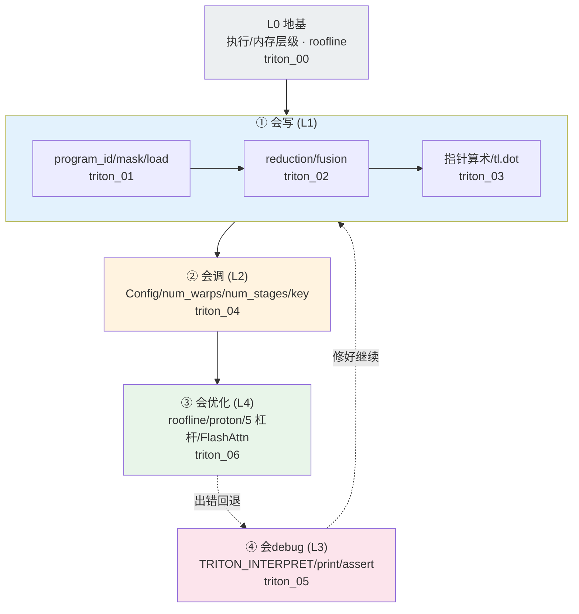

# Triton 全能专家知识地图 — 会写·会调·会优化·会debug 的完整知识点清单

> **源基线**: `triton main @ 70e0929`，v3.8.0 ｜ 锚定 `python/tutorials/01..11-*.py` + `python/triton/{language,runtime}/`
> **维度**: 学习路线总纲（能力清单 + 自测 + 进阶 + 资源）｜ 能力：四者汇总
> 本页把整条路线的知识点按**四种能力**收口成一张可勾选的地图，配自测题、进阶方向与**真实可查的官方资源**。建议学完 L0–L4 后用本页查漏补缺。前置：[[index]]。

---

## 1. 四种能力 = 一个闭环

> **「全能 kernel 专家」不是会写就行，而是「写→调→优→debug」四件事都能独立闭环。** 写出正确的 block kernel（会写）→ autotune 搜出最优 launch 配置（会调）→ roofline 定位瓶颈再上 fusion/流水线（会优化）→ 出错时用解释器/print/assert 定位（会debug）→ 回头改写法。任何一环缺失，都卡在「能跑但不够快」或「快但不敢改」。

| 能力 | 一句话定义 | 主战页 | 核心可验证产物 |
|------|-----------|--------|--------|
| **① 会写** | 把算法表达成正确的 block kernel | [[triton_01_programming_model_guide]]·[[triton_02_fused_softmax_guide]]·[[triton_03_matmul_guide]] | `torch.allclose` 通过 |
| **② 会调** | 给 Config 菜单，让 Triton 搜最优 | [[triton_04_autotune_guide]] | autotune 后 TFLOPS/带宽提升 |
| **③ 会优化** | profile 定瓶颈，拉对的杠杆 | [[triton_06_optimization_profiling_guide]] | 逼近 roofline 上界 |
| **④ 会debug** | 解释器/打印/断言定位错误 | [[triton_05_debug_guide]] | bug 复现→修复→回归 |

地基是 [[triton_00_gpu_essentials_guide]]：执行/内存层级 + roofline，四种能力共用的判断坐标系。

---

## 2. 知识点全景表（按能力勾选）

### ① 会写 —— 编程模型与块思维

- [ ] SPMD 模型：`tl.program_id` / `tl.num_programs` / grid（`01-vector-add.py:39,70`）
- [ ] 块构造：`block_start + tl.arange(0, BLOCK_SIZE)`，`BLOCK_SIZE: tl.constexpr` 且为 2 的幂（`01:45`、`02-fused-softmax.py:79-81`）
- [ ] 越界保护：`mask = offsets < n`，`tl.load/store(..., mask=, other=)`（`01:47,50,54`）
- [ ] 归约算子：`tl.max/tl.sum(x, axis=)`，块内归约编译器自动降 warp/block reduce（`02:101,104`）
- [ ] 数值稳定：减最大值 + padding `other=-inf` 不污染归约（`02:99,101`）
- [ ] 多维指针算术：`offs_m[:,None]*stride_m + offs_k[None,:]*stride_k` 广播成块（`03-matrix-multiplication.py:286-290`）
- [ ] 矩阵乘三件套：fp32 累加器（`03:297`）+ `tl.dot(a,b,acc)`（`03:304`）+ K 维 masking（`03:301-302`）
- [ ] 算子融合：累加器在 fp32 时融合激活（`03:308-311`）
- [ ] 启动语法：`kernel[grid](args, META=val)`，meta 走关键字（`01:75`）

### ② 会调 —— autotune 与 launch 配置

- [ ] `@triton.autotune(configs=[...], key=[...])` 叠在 `@triton.jit` 上（`03:228-231`）
- [ ] `triton.Config(meta, num_warps=, num_stages=, num_ctas=)`，默认 `num_warps=4/num_stages=3`（`autotuner.py:351`）
- [ ] `num_warps` = 一个 program 的块内并行度（`autotuner.py:334-337`）
- [ ] `num_stages` = 软件流水线级数（cp.async 多缓冲预取，`autotuner.py:338-340`）
- [ ] `key` 决定何时重搜：key 值不变则命中缓存（`03:230`，`autotuner.py:run`）
- [ ] 进阶：`prune_configs_by` / `reset_to_zero` / `restore_value`（原地 kernel 必需，`autotuner.py:408,42-47,284`）
- [ ] 陷阱：首调要 benchmark 全菜单（慢）；动态 shape → cache miss → 反复重搜

### ③ 会优化 —— roofline 驱动 + 五杠杆

- [ ] 判别 bound：GB/s 度量=memory-bound，TFLOPS 度量=compute-bound（`01:128` vs `03:438`）
- [ ] 先 profile：proton（`import triton.profiler as proton`，`09-persistent-matmul.py`）+ Nsight；`do_bench` 自带 warmup/清 L2（`testing.py`）
- [ ] 杠杆一 fusion：减 HBM 往返（[[triton_02_fused_softmax_guide]]）
- [ ] 杠杆二 `num_stages` 流水线：隐藏访存延迟
- [ ] 杠杆三 `num_warps` 占用率：`occupancy = NUM_REGS//(n_regs*WARP_SIZE*num_warps)`（`02:167`）
- [ ] 杠杆四 分块&L2：grouped ordering（`03:256-264`，A100 +10%）
- [ ] 杠杆五 Tensor Core：`tl.dot` 走 MMA
- [ ] 标杆 FlashAttention：online-softmax 三状态 `m_i/l_i/acc` + 重标定，S 不落 HBM，流量 O(N²)→O(N·d)（`06-fused-attention.py:69-110`）
- [ ] 反向更难：梯度并发累加 → 分块归约/atomic/锁（`05-layer-norm.py` 反向）

### ④ 会debug —— 解释器 + 打印/断言

- [ ] `TRITON_INTERPRET=1`：CPU 逐 program 串行模拟，可 `print`/`pdb`/numpy，无需 GPU（`knobs.py:471`、`interpreter.py`）
- [ ] `tl.device_print("prefix", val)`：运行期设备打印；builtin `print` 等价（`core.py:3428,3434`）
- [ ] `tl.static_print(...)`：编译期打印 constexpr（`core.py:3398`）
- [ ] `tl.static_assert(cond)`：编译期断言，**不需** TRITON_DEBUG（`core.py:3414`）
- [ ] `tl.device_assert(cond)`：运行期断言，**需** `TRITON_DEBUG!=0`（`core.py:3478`）
- [ ] 五类高频 bug：缺 mask 越界 / dtype 不匹配 / 指针-stride 广播错 / BLOCK 非 2 幂或漏 constexpr / num_stages 过大 SRAM 超额
- [ ] 工作流：最小复现 → 解释器+print → 定位 → 修 → `allclose` 回归

---

## 3. 一张图看懂「知识点 → 能力 → 页面」

---

## 4. 分级自测（能独立答出即过关）

**L1 会写**
1. 为什么 `BLOCK_SIZE` 必须标 `tl.constexpr`、且通常取 2 的幂？
2. 不写 `mask` 会发生什么？为什么 mask 比 `if offset < n` 更好？（提示：warp 发散）
3. matmul 里累加器为什么用 fp32 而输入/输出用 fp16？

**L2 会调**
4. `num_warps` 和 `num_stages` 各调的是什么？默认值多少？
5. `key=['M','N','K']` 改成 `key=[]` 会怎样？动态 shape 下 autotune 的陷阱是什么？

**L3 会debug**
6. 没有 GPU 怎么调 Triton kernel？`TRITON_INTERPRET=1` 做了什么？
7. `static_assert` 与 `device_assert` 的触发时机和对 `TRITON_DEBUG` 的依赖有何不同？

**L4 会优化**
8. 怎么一眼判断一个 kernel 是 memory-bound 还是 compute-bound？
9. FlashAttention 为什么不把 N×N 的注意力分数矩阵 S 写回 HBM？这把 IO 复杂度从多少降到多少？

> 答案分散在各对应页的「机制」节与能力清单；答不出就回去重读那一页的 demo。

---

## 5. 专家进阶方向（官方源里都有真 demo）

学完 L0–L4 后，按下列**真实 tutorial**继续深挖（均在 `triton/python/tutorials/`）：

| 主题 | 源 | 学什么 |
|------|-----|--------|
| 随机数 / 低内存 dropout | `04-low-memory-dropout.py` | 种子化随机、省中间张量 |
| LayerNorm 前向+反向 | `05-layer-norm.py` | 反向 kernel、并发梯度累加 |
| 外部函数 | `07-extern-functions.py` | 调 libdevice（`__expf` 等） |
| 分组 GEMM | `08-grouped-gemm.py` | 一个 kernel 处理多个不同尺寸 matmul（MoE 关键） |
| Persistent matmul | `09-persistent-matmul.py` | persistent kernel + proton profiling + TMA |
| Block-scaled matmul | `10-block-scaled-matmul.py` | MXFP/FP8 块缩放（低精度前沿） |
| 程序化依赖启动 | `11-programmatic-dependent-launch.py` | PDL、kernel 间依赖 |
| Gluon | `tutorials/gluon/` | Triton 新一代更底层的 tile 语言 |

再往下：读 [[30_triton_vs_mlir_backend_analysis]] 理解 Triton→PTX 编译栈；读 [[20_inductor_codegen_analysis]] 看 `torch.compile` 如何**自动生成** Triton；迁移到 NPU 见 [[gpu_kernel_guide]] §09。

---

## 6. 真实学习资源（全部可核验）

- **官方 tutorial 源**（本系列的真源）：`triton/python/tutorials/01..11-*.py` —— 边读 wiki 边对照源文件，是最高效路径。
- **语言/运行时源**：`triton/python/triton/language/core.py`（`tl.*` API + docstring）、`triton/python/triton/runtime/autotuner.py`（autotune 实现）。
- **FlashAttention 论文**（`06-fused-attention.py:5,11` 引用）：Flash-Attention v2 (Tri Dao) + 原始 FA (arXiv:2205.14135)。
- **本系列基线**：`triton main @ 70e0929`，v3.8.0；行号随上游漂移时以本地 checkout 为准。

---

## 相关页面

- [[index]] — Triton 学习路线总索引
- [[triton_00_gpu_essentials_guide]] — L0 地基
- [[triton_01_programming_model_guide]] · [[triton_02_fused_softmax_guide]] · [[triton_03_matmul_guide]] — L1 会写
- [[triton_04_autotune_guide]] — L2 会调
- [[triton_05_debug_guide]] — L3 会debug
- [[triton_06_optimization_profiling_guide]] — L4 会优化
- [[gpu_kernel_guide]] — CUDA/NPU Kernel 工程总览
- [[30_triton_vs_mlir_backend_analysis]] · [[20_inductor_codegen_analysis]] — Triton 作为编译后端
