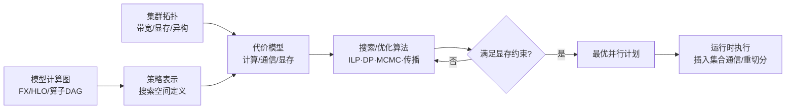

# 自动并行(Auto-Parallelism)业界研究综述

> 面向分布式大模型训练的并行策略自动搜索综述：搜索空间、代价模型与搜索算法
> 最后更新: 2026-06-22
>
> 注：本文为基于公开论文/官方文档的领域综述（非本地源码分析），用于建立"自动并行"知识地图；各系统具体实现以其上游为准。

---

## 1. 定位：自动并行要解决什么问题

给定一个模型计算图与一个设备集群（拓扑/带宽/显存），**自动**求解一组决策：

- **每个算子（张量）怎么切**（intra-operator：DP/TP/SP/EP/分片）
- **计算图怎么分段、放到哪些设备**（inter-operator：PP + 设备放置）
- **在同一设备上按什么顺序执行**（时间维调度）

使端到端**吞吐最大 / 单步时间最小**，约束是**每张卡不能 OOM**。

### 为什么"自动"是必需的

手工调并行（Megatron 式的 DP×TP×PP×CP×EP 网格）依赖专家经验，且每换一个模型/集群就要重调。而**搜索空间呈组合爆炸**——一个 80 层 Transformer 叠加各类并行 + 显存优化后，可行配置可达 $\sim 10^{125}$ 量级。人不可能穷举，必须用系统化的建模 + 搜索。

### 通用流水线（几乎所有系统的共同骨架）

决定最终效果的不只是搜索算法本身，更取决于三点：**① 策略表示是否具备足够的表达能力，同时保持规模可控；② 代价模型是否准确，尤其是通信和显存模型；③ 问题能否得到合理分解。**

---

## 2. 技术谱系与代表系统

### ① 早期 / 算子级搜索（Pre-LLM，多为 CNN）

| 系统 | 出处 | 核心思想 |
|------|------|---------|
| **OptCNN** | ICML'18 | 单算子并行维度的动态规划，CNN 专用 |
| **Mesh-TensorFlow** | NeurIPS'18 | 命名维度上的手工 SPMD 标注（半自动） |
| **FlexFlow** | MLSys'19 | 提出 **SOAP** 搜索空间（Sample / Operator / Attribute / Parameter），用 **MCMC** 随机搜索 + 执行**模拟器**评估代价 |
| **PipeDream** | SOSP'19 | 流水并行的 DP 切分 + 异步 1F1B |

### ② 编译器 / SPMD 标注-传播线（Google 系）

| 系统 | 出处 | 核心思想 |
|------|------|---------|
| **GShard** | 2020 | MoE 的 sharding 标注，自动补全 |
| **GSPMD** | arXiv'21 (XLA) | 用户少量标注 → 编译器**优先级 sharding 传播**自动补全全图；Replicated / Tiled / Partially-tiled 三类切分；单程序(SPMD)，编译时间与设备数解耦 |
| **PartIR** | MLSys'24 | MLIR 上可组合的 SPMD 分区"战术(tactics)"，**自动发现**复合分区策略 |

### ③ 联合分层搜索（LLM 时代的标杆）

| 系统 | 出处 | 核心思想 |
|------|------|---------|
| **Alpa** ⭐ | OSDI'22 | 把并行分两层：**inter-operator**（图切 stage + 集群切 submesh，用 **DP** 求解）+ **intra-operator**（每 stage 内张量切分，用 **ILP** 求解）。统一 DP/TP/PP，是该领域**最经典的参考实现** |
| **Unity** | OSDI'22 | FlexFlow 后继：把"代数变换 + 并行化"统一表示为**图替换(graph substitution)** 联合搜索 |

### ④ 显存感知 / Transformer 专用

| 系统 | 出处 | 核心思想 |
|------|------|---------|
| **Galvatron** | VLDB'23 | 针对 Transformer 的复合并行(DP/TP/PP/SDP)，**决策树剪枝 + DP**，显式建模显存 |
| **Galvatron-BMW** | 扩展 | Balanced Memory Workload：加入显存均衡与激活重计算，覆盖 4D |
| **Aceso** | EuroSys'24 (MSRA) | 当前**搜索空间最大**的吞吐最优调优器：基于细粒度算子/通信预 profiling 的代价模型 + **迭代扰动**搜索，联合搜并行 + 激活重计算 |

### ⑤ 约束 / 原语驱动的通用空间

| 系统 | 出处 | 核心思想 |
|------|------|---------|
| **nnScaler** ⭐ | OSDI'24 (MSR) | 三原语 **op-trans / op-assign / op-order**（切分 / 空间放置 / 时间排序）让专家**自定义搜索空间**，再用**约束**防爆炸；能找到非显然新方案，对 Swin/AlphaFold2 比 Megatron/DeepSpeed/Alpa 快 **3.5×** |

### ⑥ 异构 / 动态 / 省钱（2024–2026 新方向）

| 系统 | 出处 | 关注点 |
|------|------|---------|
| **AMP** | NeurIPS'22 | 自动混合并行 |
| **Metis** | ATC'24 | 异构 GPU 集群 |
| **Mist** | 2025 | **显存-并行协同优化** |
| **Astra** | 2025 | 异构 GPU 上的**省钱**策略搜索 |
| **Sailor** | 2025 | 动态/异构/地理分布式集群 |
| **MILP 算子级规划** | 2025 | 把算子级并行规划建成混合整数规划 |

### ⑦ 框架原生 / 生产可用

| 系统 | 核心思想 |
|------|---------|
| **PyTorch DTensor + AutoParallel** | SPMD device mesh + Shard/Replicate/Partial 切分 + **sharding 传播**；与 FSDP2 / SimpleFSDP / torchtitan 集成，PyTorch 原生 auto-parallel 正在成型 |
| **veScale**（字节） | Eager 模式 SPMD，面向 PyTorch 原生自动并行 |
| **OneFlow / SBP** | 用 **SBP**(Split/Broadcast/Partial) 签名做一致性自动并行传播 |
| **MindSpore 自动并行** | sharding 传播 + 双递归/SAPP 策略搜索（见 [[10_mindspore_compiler_analysis]]）|
| **ColossalAI** | 内置 Alpa 式 ILP 的 auto-parallel 模块 |

---

## 3. 建模分析的四个维度

业界把问题拆成**四块建模**，这也是后续深入研究的骨架。

### A. 策略表示 / 搜索空间（"能切成什么样"）

- **Intra-operator（算子内 / 张量切分）**：DP、TP（Megatron 行/列切）、SP/CP（序列/上下文）、EP（专家）、ZeRO/FSDP（参数/梯度/优化器状态分片）。
- **Inter-operator（算子间 / 图切分）**：PP（GPipe / 1F1B / interleaved / zero-bubble）+ 设备放置。
- **表示语言**决定空间大小与可表达性：SOAP(FlexFlow)、SBP(OneFlow)、Shard/Replicate/Partial(DTensor/GSPMD)、op-trans/assign/order(nnScaler)。

### B. 代价模型（“每个方案的成本是多少”）——三大成本

**① 计算时间**：按 FLOPs 估，或 profiling 真实 kernel 时间。

**② 通信时间**：集合通信量 × **拓扑感知带宽**（节点内 NVLink vs 节点间 IB/以太网常差一个量级），用 **α-β 模型**：

$$
T_{\text{comm}} = \alpha + \frac{m}{\beta}
$$

其中 $\alpha$ 为延迟、$\beta$ 为带宽、$m$ 为消息量。以 Ring All-Reduce 为例（$p$ 卡、张量 $m$ 字节）：

$$
T_{\text{allreduce}} = 2(p-1)\,\alpha + \frac{2(p-1)}{p}\cdot\frac{m}{\beta}
$$

不同并行策略对应不同集合原语（all-gather / reduce-scatter / all-to-all），通信量随切分方式变化。

**③ 显存占用**（作为**硬约束**）：

$$
M_{\text{param}} + M_{\text{grad}} + M_{\text{opt}} + M_{\text{act}} + M_{\text{buf}} \le M_{\text{device}}
$$

激活显存 $M_{\text{act}}$ 受重计算/offload 影响，常是搜索中最敏感的一项。

此外还要建模**通信/计算 overlap** 与**流水气泡(bubble)**——这两项决定理论与实测的差距。

### C. 硬件 / 拓扑模型

设备 mesh、分层带宽（节点内/节点间）、**异构性**（不同卡型/不同网络）。FlexFlow 用设备拓扑图：节点=加速器，边=互连（NVLink/PCIe/IB）。

### D. 优化目标

- 主流目标：在显存容量约束下，**最大化吞吐或最小化单步时间**。
- 新方向：异构集群上**最小化成本（美元）**，或满足动态资源约束（Astra/Sailor）。

---

## 4. 策略搜索方法（怎么求解 $10^{125}$ 空间）

| 类别 | 代表 | 说明 |
|------|------|------|
| **精确最优化** | Alpa(intra-op **ILP**)、Alpa/Galvatron/PipeDream(**DP**)、MILP 算子级规划 | 把子问题建成 ILP/MILP/DP 求全局最优，可解到数万算子 |
| **元启发式** | FlexFlow(**MCMC**)、PartIR(MCTS)、Aceso(**迭代扰动**)、模拟退火/进化 | 空间太大时随机/启发式逼近 |
| **贪心传播** | GSPMD(优先级传播)、OneFlow(SBP)、MindSpore(双递归) | 从少量标注沿图传播补全，近似线性复杂度 |
| **分解 + 剪枝** | Alpa(inter/intra **分层**)、nnScaler(**约束剪枝**)、Galvatron(决策树剪枝) | 按拓扑层次或约束缩小搜索空间，是控制组合爆炸的关键 |
| **模拟器纳入搜索闭环** | FlexFlow simulator、ASTRA-sim、profile-based | 用模拟或预 profiling 代替实际运行来评估代价 |

---

## 5. 关键设计范式与洞察

1. **分解是核心招式**：Alpa 的 inter/intra 两级分解，把一个超大联合问题拆成"DP 套 ILP"，是大多数后续系统的蓝本。
2. **空间表示的取舍**：固定模板（DP/TP/PP）易搜但表达力有限；nnScaler 用原语 + 约束换取"自定义空间"，能发现专家想不到的方案，代价是要写约束。
3. **代价模型的准确性 > 搜索算法的先进性**：通信（拓扑/overlap）和显存（激活/碎片）建不准，最优解就是"纸面最优"。Aceso/Galvatron-BMW 的价值大半在更精细的代价模型。
4. **传播 vs 搜索的分野**：Google/编译器系（GSPMD/SBP/MindSpore）走"标注+传播"，快但偏局部最优；学术系（Alpa/Aceso）走"全局搜索"，优但慢。生产框架在两者间折中。

---

## 6. 演进趋势（2024–2026）

1. **从"找并行"到"并行 + 显存协同"**：Aceso、Mist 把激活重计算/offload 纳入联合搜索。
2. **从同构走向异构/动态/地理分布式**：Metis、Astra、Sailor。
3. **从独立框架走向框架原生**：PyTorch DTensor/AutoParallel、veScale——auto-parallel 正逐步融入主流训练栈，而不再只以独立编译器的形式存在。
4. **MoE 把 4D 推到 5D**：在 DP/TP/PP/CP 之上加 **EP(专家并行)**，all-to-all 通信建模更复杂。
5. **通用搜索空间**：nnScaler 让用户自定义空间，跳出固定模板。

---

## 7. 与本 wiki 的连接 / 后续拆页计划

本页是"罗盘"总览。与现有页面的关系：

- [[megatron-lm/index]] — **手工** 5D 并行的工业标杆，是自动并行的"对照组"与执行后端。
- [[torchtitan/index]] — DTensor/FSDP2 的 PyTorch 原生实现，是框架原生 auto-parallel 的载体。
- [[10_mindspore_compiler_analysis]] — sharding 传播式半自动并行的代表。
- [[31_comm_compute_fusion_guide]] — 通信/计算 overlap，是代价模型 B 维度的实测依据。
- [[32_distributed_optimizer_deepdive]] — ZeRO/FSDP 分片，是 intra-op 搜索空间的一部分。

后续可按系统拆专页（建议优先级）：`alpa_analysis`（ILP+DP 范式）、`nnscaler_analysis`（原语+约束）、`galvatron_analysis`（显存感知 DP）、`gspmd_sharding_propagation_analysis`（传播范式）、`pytorch_dtensor_autoparallel_analysis`（框架原生）。

---

## Sources（核心论文/文档）

- [Alpa: Automating Inter- and Intra-Operator Parallelism (OSDI'22)](https://www.usenix.org/system/files/osdi22-zheng-lianmin.pdf)
- [GSPMD: General and Scalable Parallelization for ML Computation Graphs](https://arxiv.org/pdf/2105.04663)
- [nnScaler: Constraint-Guided Parallelization Plan Generation (OSDI'24)](https://www.usenix.org/system/files/osdi24-lin-zhiqi.pdf)
- [PartIR: Automatic Discovery of Composite SPMD Partitioning Strategies](https://arxiv.org/pdf/2210.06352)
- [Galvatron-BMW: Balanced Memory Workload Optimization](https://arxiv.org/pdf/2307.02031)
- [A Survey on Auto-Parallelism of Neural Networks Training](https://www.techrxiv.org/users/683936/articles/678682/master/file/data/Auto_parallel/Auto_parallel.pdf)
- [Efficient Training of LLMs on Distributed Infrastructures: A Survey](https://arxiv.org/pdf/2407.20018)
- [Systems for Parallel and Distributed Large-Model DL Training](https://arxiv.org/pdf/2301.02691)
- [PyTorch DTensor README](https://github.com/pytorch/pytorch/blob/main/torch/distributed/tensor/README.md) · [veScale: PyTorch-Native Auto-Parallel](https://volcengine.github.io/veScaleWeb/blog/mlsys2024.html)
- [Mist (memory-parallelism co-opt)](https://arxiv.org/html/2503.19050v1) · [Astra (heterogeneous)](https://arxiv.org/pdf/2502.13480) · [Sailor (dynamic/geo-distributed)](https://arxiv.org/html/2504.17096v2)

---

## Related Pages

- [[02_engineering/06_auto_parallel/index|自动并行]] — 自动并行域索引（罗盘入口）
- [[megatron-lm/index]] — Megatron-LM 手工 5D 并行（对照组 / 执行后端）
- [[torchtitan/index]] — torchtitan DTensor/FSDP2 原生并行
- [[10_mindspore_compiler_analysis]] — MindSpore 自动并行（传播范式）
- [[31_comm_compute_fusion_guide]] — 通信/计算融合与 overlap
- [[32_distributed_optimizer_deepdive]] — ZeRO/FSDP 分片
- [[../index]] — 工程实现知识地图
