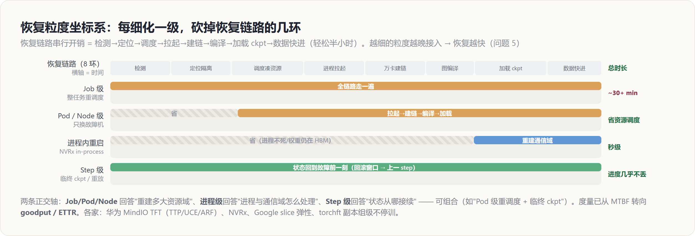
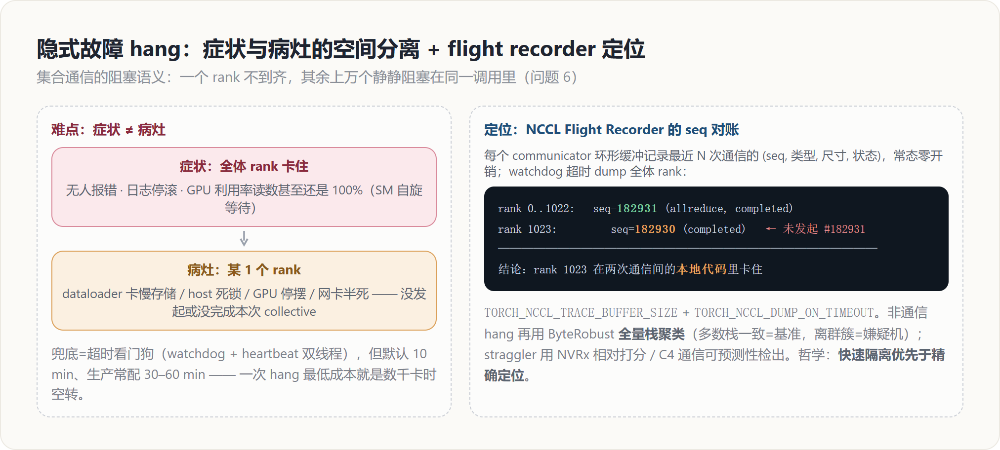

# 故障容错与自动恢复：goodput · 五级恢复坐标系 · hang/straggler · checkpoint · 链路切流

> **来源**：`docs/research/wanka_determinism_reliability_deep_analysis.md` 第二部分（问题 5–8）——一份多来源综述深度分析文档的结构化摄入，机制/数字/命令/代码忠实于原文。
> **维度**：机制级深挖（背景 → 影响 → 如何发现 → 解决方案与代码）。
> **所属簇**：[[07_training_reliability/index]]（万卡级训练：确定性与可靠性问题域）。
> 最后更新: 2026-07-06

本页贯穿一条主线——**恢复粒度的演进：整任务重启 → 弹性缩容 → 进程内重启 → step 级重放**，每细化一级就把恢复链路砍掉几环；度量口径同步从 MTBF 收敛到 **goodput / ETTR**。四个问题依次是：显式故障的恢复链路开销（问题 5）、隐式故障 hang/straggler（问题 6）、Checkpoint 体系（问题 7）、网络链路故障与切流（问题 8）。

---

## 一、问题 5：显式故障高频化与恢复链路开销（goodput 问题）



### 背景

显式故障指有明确信号的失败：进程崩溃、CUDA/HBM（High Bandwidth Memory，高带宽堆叠显存）不可纠正 ECC 错误、掉卡、节点宕机、断链。同步训练的架构决定了**一卡故障 = 全局停摆**：下一个集合通信永远等不齐人。公开基线数据来自 Llama 3：16384 张 H100 训练 54 天，466 次中断中 419 次非计划，平均每 3 小时一次；GPU 相关占 58.7%（GPU 本体 30.1%、HBM3 17.2%），CPU 仅 2 次；仅 3 起需要显著人工干预，其余全部自动化处置，最终仍维持 90% 以上有效训练时间。Gemini 2.5 的规模下硬件故障中断达到每小时多次。规模外推是线性而残酷的：故障率 ≈ 单卡故障率 × 卡数，十万卡集群的故障间隔以十分钟计——**自动化不是优化项，是及格线**。

真正的成本不在故障本身，而在**恢复链路的串行开销**。把传统「整任务杀掉重排」路径逐环节拆开看量级：

```text
检测（hang 场景可达超时上限 10~60 min）
→ 定位隔离（分钟级，见问题 6/8）
→ 调度器重新凑资源（分钟级，资源紧张时更久）
→ 进程拉起 + Python import + CUDA context 初始化（分钟级）
→ NCCL/HCCL 万卡通信域建链（分钟级，且随规模超线性变差）
→ 图编译（若有整图编译，分钟级）
→ checkpoint 从共享存储加载（分钟级，TB 级状态）
→ 数据迭代器快进回放
```

串起来轻松半小时——用最贵的恢复方式处理最频繁的事件。近年的全部工程创新，本质都是把这条链上的某几环**砍掉或摘出关键路径**。

### 影响

行业度量指标已从 MTBF（Mean Time Between Failures，平均故障间隔时间）转向 **goodput / ETTR（Effective Training Time Ratio）**：真正产出训练进度的时间占比。单次中断损失 = 检测延迟 + 恢复链路时间 + 回滚步数（上个 checkpoint 以来的进度，期望为保存间隔的一半）。新集群前两周故障率最高（浴盆曲线左侧，早期夭折期），大规模开训初期是最痛苦的阶段。

### 如何发现

显式故障的检测相对成熟：进程 exit code、NCCL/HCCL 通信错误上抛、硬件带外告警（GPU XID 事件（NVIDIA 驱动定义的标准化错误码，如 Xid 63/64 对应显存页隔离、Xid 79 对应 GPU 掉总线）、ECC 计数、PCIe AER（Advanced Error Reporting，PCIe 链路层错误上报机制）、NPU health monitor）、K8s/Slurm 节点状态、心跳超时。难点不在「发现」而在后续的定位与快速恢复（定位见问题 6、8）。

### 解决方案与代码实现

恢复粒度的演进是这个问题的主线：**整任务重启 → 弹性缩容 → 进程内重启 → step 级重放**，每细化一级就砍掉恢复链路的几环。

#### （0）先立一个统一坐标系：五级恢复坐标系

Job 级 / Pod 级 / Node 级 / 进程级 / Step 级。这套五级说法在 K8s + 昇腾断点续训生态中是标准表述（Job 级重调度 / Pod 级重调度 / 进程级恢复是 MindCluster 文档中的正式特性名），但它不是全行业统一标准，且内部混着两条正交的轴：**资源调度粒度**（这次故障要重建多大的资源域）与**状态恢复粒度**（训练态从哪里接续）。把各级摊开：

| 级别 | 处置动作 | 保留什么（= 省掉恢复链路的哪几环） | 代表实现 |
|---|---|---|---|
| Job 级 | 销毁全部 Pod，整任务重新调度、重新拉起 | 什么都不保留，恢复链路全走一遍 | MindCluster Job 级重调度（默认模式，Volcano 触发）；Slurm requeue；K8s/Volcano 销毁重建全部 Pod |
| Pod 级 | 只销毁并重建**故障 Pod**（训练部署中通常 1 Pod = 1 节点 8 卡），健康 Pod 原地等待，随后全体重拉训练进程 | 健康节点的调度结果与容器；省掉全量资源调度与 Pod 创建（rank 0 所在 Pod 故障时通常直接回退 Job 级） | MindCluster Pod 级重调度（不可恢复时自动回退 Job 级） |
| Node 级 | 故障整机隔离下线，温备/热备机顶替进入原拓扑位 | 资源池层面的「换人」动作，一般与 Pod/Job 级重调度组合出现，砍掉「等调度器凑资源」一环 | ByteRobust 温备机、Gemini 热备、各家集群备卡策略 |
| 进程级 | 容器与调度不动，只处理训练进程。由重到轻是一个内部梯度：进程级重调度（杀进程重拉）→ 进程级在线/原地恢复（复用容器与设备上下文）→ 进程内重启（进程不死，原地重建通信域） | 容器与调度结果，进而（逐级递增地）保留进程、CUDA/NPU 上下文、编译缓存、乃至显存中的模型状态 | torchrun elastic / NVRx `ft_launcher`（Elastic Agent 重拉本地 worker 进程）；MindCluster TaskD 系列（`ELASTIC_PROCESS_RECOVER_ENABLE=1`）；MindIO ARF（增量重启 worker 并重建通信组）；NVRx in-process restart |
| Step 级 | 状态粒度概念：把可接续点推进到故障前一刻（临终 CKPT），或对单个可疑 step 做确定性重算/重放裁决 | 训练进度几乎不丢（回滚窗口从「上个 checkpoint」缩到「上一 step」） | MindIO TTP 临终 CheckPoint；MindIO UCE（片上内存不可纠错故障的 Step 级重计算与在线修复）；Gemini split-phase 确定性重放（问题 4）；TU Berlin 单步重算 |
| （更细：算子级/链路级） | 通信算子失败原地重执行、流量切到健康链路，故障不上抛给框架 | 训练完全无感，连「恢复」这个动作都不发生 | HCCL 算子重执行（`HCCL_OP_RETRY_ENABLE`，对 SDMA/RDMA CQE 类错误重试通信算子）；LongCat 链路切流（问题 8） |

两点辨析。**其一，命名的生态差异**：NVIDIA 生态（Slurm + NVRx）只区分 job restart 与 in-process restart，没有 Pod 概念；Google 用 slice 弹性 + step 重放的语言；字节/阿里论文用任务级 + 备机顶替的语言——粒度阶梯的思想共通，切法与叫法各家不同，跨生态对话时要先对齐。**其二，三条轴可以组合而非互斥**：Job/Pod/Node 回答「重建多大资源域」，进程级回答「进程与通信域怎么处理」，Step 级回答「状态从哪接续」——例如「Pod 级重调度 + 临终 CKPT」就是资源只换一个 Pod、状态回到故障前一刻的组合。把五级排成一条线，只是按典型恢复时间做的近似排序。

#### 各家术语与坐标对照

用这套坐标去读各家公开体系，对应关系与各自的定义要点如下：

| 体系 | 自有术语与定义要点 | 映射到坐标系 |
|---|---|---|
| 华为 MindCluster + MindIO TFT | 命名最完整的一家：Job 级重调度 / Pod 级重调度 / 进程级重调度、在线恢复、原地恢复（TaskD + Elastic Agent）；MindIO TFT 容错家族——TTP（Try To Persist：故障后校验中间状态完整性，从存活副本卡生成临终 CKPT）、UCE（片上内存不可纠错错误的 Step 级重计算与在线修复）、ARF（Air Refuelling：以进程/节点为单位增量重启 worker 并重建通信组，不停整个集群）；再往下有 HCCL 算子重执行、借轨通信。组合开启时按 UCE → ARF → 临终 CKPT 逐级兜底，前一级救得回就不触发下一级 | 五级全覆盖 + 算子/链路级；本报告采用的五级坐标即源自这套体系 |
| NVIDIA（NVRx + Slurm/K8s） | 只区分两层：launcher 级自动重启（`ft_launcher` 重拉 worker 进程）与 in-process restart（进程不死、原地重建通信域）；配套 local/async checkpoint 与 straggler detection；Job 级交给调度器（Slurm requeue），换节点交给资源层，GB200 机架级由 Mission Control 自动诊断修复 | 进程级（两档）+ state 粒度为主；无 Pod 概念（Slurm 语境），Job/Node 级由生态其他层承担 |
| PyTorch 原生/社区 | torchrun elastic：每节点一个 Elastic Agent 监控本地 worker，故障后重拉 worker 进程并重新 rendezvous（进程级重调度的通用底座）；torchft（Meta）：DP 副本组级容错——故障副本组退出、其余副本组不停训、修复后经活权重传输重新加入 | 进程级底座；torchft 介于进程级与弹性缩容之间，是「不停训容错」进入 PyTorch 原生生态的标志 |
| Google（Gemini/Pathways） | slice 粒度弹性（故障 slice 摘除后自动缩规模续训，恢复期约 97% 吞吐、单次中断损失数十秒）；hot standby 热备机轮换；split-phase SDC detection（step 级确定性重放裁决）；模型状态内存冗余加速恢复 | slice 弹性 ≈ Node/Pod 级的 TPU 语境版；step 级能力最完整；无 Job/Pod 命名（Borg/Pathways 语境） |
| 字节（MegaScale/ByteRobust） | 任务级重启 + 温备机顶替 + 聚合热更新 + fault-aware checkpointing；系统哲学是快速隔离优先于精确定位 | Job 级 + Node 级 + state 粒度；进程级形态未见公开强调 |
| 阿里云（C4/Aegis）与蚂蚁 DLRover | C4：实时检测 → 隔离故障节点 → 自动重启任务；Aegis：故障定界粒度从任务级向设备级演进；DLRover：node 级容错（自动检测/隔离/替换节点、弹性伸缩）+ Flash Checkpoint（内存级快存快恢） | Node 级隔离 + Job 级重启的组合；DLRover 补上 state 粒度 |
| Meta（Llama 3 运维 → torchft） | Llama 3 时期以全量重启为主、但自动化到极致（419 次非计划中断仅 3 次需人工），flight recorder 负责定位；此后 torchft 转向副本组级不停训容错 | Job 级的极致自动化 → 向进程/副本组级演进 |
| 美团 LongCat | 弹性扩缩卡、HCCL 异常处理、链路故障切流（隔离对训练无感）、自动故障恢复 | Node/资源级弹性 + 算子/链路级吸收；链路级做到「训练无感」是其公开亮点 |

下面 (1)–(4) 按这条线展开。

#### （1）自动重启：launcher 层底座与任务级重调度

基础设施是 torchrun elastic（`--max-restarts` + rendezvous：每节点一个 Elastic Agent 监控本地 worker，故障后重拉 worker 进程，存活成员回到集合点重新组网）；NVRx（NVIDIA Resiliency Extension，NVIDIA 官方开源的训练容错扩展库）的 `ft_launcher` 在其上叠加心跳与分段超时检测，训练进程周期性上报，超时即自动重启工作负载：

```bash
ft_launcher --nnodes=$N --nproc-per-node=8 \
  --ft-param-rank_heartbeat_timeout=600 \
  --max-restarts=100 train.py ...
```

按（0）的坐标系有一处需要澄清：**launcher 层重启的对象是 worker 进程——Pod/Slurm 资源分配原地不动，严格说这属于进程级重调度而非 Job 级**（MindCluster 的进程级重调度正是构建在 Elastic Agent 之上）。真正的 Job 级动作发生在调度器层：Slurm requeue、K8s/Volcano 销毁并重建全部 Pod。生产闭环通常是两层组合——launcher 层先兜进程级重启，进程级救不回的场景（硬件损坏、节点失联）再升级到调度器层重调度并结合备机顶替。

国内对应的开源体系有蚂蚁 DLRover（弹性容错 + Flash Checkpoint）。这一级仍要走完大部分恢复链路，价值在「无人值守」。

#### （2）热备/温备与弹性训练（资源级）

两条互补路线：

- **备机顶替**：ByteRobust 维护温备机（warm standby）池——故障机被隔离后备份机直接顶上，砍掉「等调度器凑资源」一环；配合聚合热更新（把多个待处理故障合并到一次重启窗口处理，避免反复停训）。Gemini 从 1.0 起保留少量热备 cube 支持故障顶替与滚动维护。
- **弹性训练（elastic training）**：把「参与训练的卡数/节点数」从常量变成运行期变量——任务在生命周期内可以缩容（少几个节点继续训）和扩容（资源回来后加回去），全程不从零重启。它与容错交叉但不等同：**容错的目标是恢复到原规模，弹性的目标是规模本身可变**。

业界做弹性有两个动机，对应两类场景。**容错语境的弹性（缩容不等资源）**：传统恢复路径里最不可控的一环是「等调度器凑齐替换资源」（资源紧张时可达几十分钟），弹性把它从同步阻塞变成异步——故障节点摘除后立刻以 N−1 继续训，备机/修好的机器到位后再扩回来。LongCat 的弹性扩缩卡与 Gemini 2.5 的 slice 粒度弹性即此用法，后者公开指标是天花板：局部故障时自动以更少的 TPU slice 继续训练，单次中断仅损失数十秒（对比无弹性时等待重调度的 10 分钟以上），故障 slice 恢复期间维持约 97% 吞吐。**利用率语境的弹性（吃波动资源）**：让训练任务消化集群的闲置与波动容量——潮汐混部（夜间推理低谷把卡借给训练、白天还回去）、spot/抢占式实例、高优任务到来时低优训练缩容让路而不是被杀。蚂蚁 DLRover、阿里 AntMan（OSDI'20）、CMU Pollux（OSDI'21）主要面向此场景；这条线的极致是 Pollux——调度器不只动卡数，还联动调整 batch size 与学习率，按全集群 goodput 最优做协同分配。

同步数据并行的全部隐含假设都建立在「world size 固定」上，弹性等于把地基抽掉，必须重新解决四件事：

**a. 动态组网。** 成员变化后要重新发现彼此、重排 rank、重建通信域。标准机制是 rendezvous 协议：

```bash
torchrun --nnodes=2:8 --rdzv-backend=c10d --rdzv-endpoint=$HOST:29400 train.py
# --nnodes=MIN:MAX 声明弹性区间；成员变化触发新一轮 rendezvous，
# 区间内凑齐成员即 barrier 通过、分配新 rank、重建 process group
```

**b. 状态重分布（技术核心）。** 难度取决于状态怎么切：纯 DP + 完整优化器副本时最简单——新成员从任意存活副本拉一份权重与优化器状态（活迁移广播、或读 ckpt）即可；一旦使用 ZeRO/Megatron 分布式优化器，优化器状态按 DP 度分片，DP 从 64 变 63 意味着**全部分片重新切分**。工程解法两条：离线路径靠与并行度解耦的 checkpoint 格式（ByteCheckpoint、torch DCP、DeepSpeed Universal Checkpoint——保存时按逻辑张量组织，加载时按新并行度重切，即问题 7 (2) 所述能力，也是它「是弹性能落地的前提」的原因）；在线路径做内存中的 gather–rescatter，省掉一次存储往返。

**c. 优化语义保持。** global batch size 是超参的一部分，卡数变了不能让它跟着漂。标准做法是调梯度累积步数补偿（DP 度 × 每副本 accum 步数 × micro-batch size ≈ 常数），保证 loss 曲线的优化语义连续；做不到整除时要么容忍近似、要么走 Pollux 路线连学习率一起调。另一个必须记录在案的数学事实（问题 1 背景第 3 层的直接推论）：规模一变，梯度 allreduce 的规约树形态必变，**弹性事件之后 loss 轨迹必然比特级分叉**——分叉是合法的，但必须有事件标注，否则与故障导致的异常分叉无法区分。

**d. 数据不重不漏。** 数据分片映射按新 world 重排，靠 consumed_samples + shuffle 状态快进到断点（问题 7 (4)），保证缩扩容前后每条样本恰好被训一次。

各家实现构成一条「重启程度」的光谱：最重的是 **torchrun elastic**——成员变化时 agent 把所有 worker 进程杀掉重拉、从 ckpt 恢复，本质是「进程级重调度 + 可变 world size」，状态管理全交给用户代码；轻一档是 **Horovod Elastic**——进程不死，异常驱动的 reset 机制重建通信环，state 对象带 commit/rollback 语义，新成员进来后由 rank 0 广播状态、内存态直接续训；**DLRover** 把这套做成 K8s Operator 产品（ElasticJob 动态增删节点 + Flash Checkpoint 内存级快存快恢兜底）；**torchft**（Meta）代表最新形态——DP 副本组级弹性，故障组退出时**其余组连停都不停**，quorum 机制维护成员视图，修复后经活权重传输重入；**Gemini slice 弹性**是同一形态的 TPU 版，靠 Pathways 单控制器 + 状态内存冗余把单次中断压到数十秒。昇腾侧 MindCluster 将弹性训练列为断点续训之上的独立特性，与 Volcano 配合完成卡数变化后的续训。

弹性的边界与开放问题：生产级弹性几乎都**只做 DP 维**——TP/PP 切分与权重布局强耦合，动它等于重建模型，因此弹性的最小单元是「一个完整的模型副本」（Gemini 的 slice、torchft 的 replica group 都是这个单元）。由此直接导出 MoE 大 EP 的真空地带：EP 把专家切进 DP 组内部，专家状态没有天然副本，「摘掉一个 EP 组员」不再是干净操作，弹性缩容与专家负载均衡的交互尚无公认方案（呼应趋势第二条）。RL 场景则一分为二：rollout 集群近乎无状态、天然适合弹性与抢占，trainer 侧弹性叠加训推一致性要求（问题 2）后复杂度陡增。

#### （3）进程内重启（进程级，秒级恢复）

NVRx 的 in-process restart 把恢复链路里「杀进程重拉起」整段砍掉：故障发生时**进程不死**——所有 rank 中止当前集合通信（ncclCommAbort 语义）、销毁通信域、把故障 rank 从成员表摘除、重新 rendezvous 组网、从**仍在显存里的模型状态**（或内存副本）原地恢复训练循环：

```python
from nvidia_resiliency_ext import inprocess

@inprocess.Wrapper(store_kwargs={...}, health_check=...)
def train(base_store, ...):
    # wrapper 负责：监控 → 故障时软重启该函数 → 换掉坏 rank 后原地续训
    ...
```

被跳过的恢复环节一目了然：进程拉起、Python import、CUDA context 初始化、全量建链、图编译（context 还在，编译缓存热的）、checkpoint 磁盘加载（权重根本没离开 HBM）——恢复从分钟级进入秒级。前提是故障没有污染进程状态（宕机整节点仍需走备机路径），所以它与（1）（2）是叠加关系而非替代。配套的通信库原语在跟进：较新版本 NCCL 提供 communicator shrink 类 API，支持不销毁整个通信域、只剔除故障 rank 的收缩式重建。昇腾侧的对应形态即（0）表中 MindCluster 的进程级恢复梯度——进程级重调度 / 在线恢复 / 原地恢复由 TaskD 统一管理，越靠后的形态保留的设备上下文越多、恢复越快，进程内重启可视为这条梯度的极限形态。

#### （4）重建链路的加速（国产栈的重点投入）

华为公开口径的「1-3-10」（1 分钟感知、3 分钟定界、10 分钟内恢复）配套三层快恢，两个关键技术点：**快速建链**压缩 HCCL 通信域重建（万卡建链是恢复链路中随规模恶化最快的一环，优化点在并行建链、连接信息缓存复用）；**图编译缓存**——GE（Graph Engine，昇腾图引擎）/整图下沉模式下图编译是分钟级开销，缓存以图结构 hash 为 key 存编译产物，故障重启后命中缓存直接加载二进制、免重编译。HBM 与网络链路故障场景的恢复时间挑战 30 秒。LongCat 的「月均日故障率降低 70%」是 HCCL 异常处理 + 弹性扩缩卡 + 自动故障恢复三件事叠加的结果。

---

## 二、问题 6：隐式故障——hang、慢节点（straggler）与性能劣化

### 背景：为什么「没死但不动」比崩溃更贵

比崩溃更难对付的是「没死但不动/变慢」。根源在集合通信的**阻塞语义**：AllReduce/AllGather 要求全体 rank 到齐才能完成，任意一个 rank 因为任何原因（dataloader 卡在慢存储上、host 侧死锁、GPU 停摆、网卡半死）没有发起或没有完成本次 collective，**其余上万个 rank 都会静静地阻塞在同一个调用里**——没有人报错、日志全部停止滚动、GPU 利用率读数甚至还是 100%（SM 在自旋等待）。故障的「症状」（全员卡住）和「病灶」（某一个 rank）在空间上完全分离，这是 hang 定位难的本质。

兜底机制是超时看门狗，但它天然是钝的：PyTorch ProcessGroupNCCL 为每个下发的集合通信登记一个 work 对象，**watchdog 线程**轮询这些 work 是否在时限内完成，超时则 abort 通信域、终止进程（配合 `TORCH_NCCL_ASYNC_ERROR_HANDLING`）；另有一个 **heartbeat monitor 线程**盯着 watchdog 本身是否还活着（watchdog 也可能被卡死，`TORCH_NCCL_HEARTBEAT_TIMEOUT_SEC` 兜底自杀）。默认超时 10 分钟，生产系统常配到 30–60 分钟以避免把「正常的慢」（首次建链、大 checkpoint 保存、编译）误杀成故障——这意味着一次 hang 的**最低成本**就是数千卡时的空转。ByteRobust 的生产统计显示 hang 类事故占比超过 10%。

straggler 是同一语义的另一形态：同步训练的 step 时间 = **最慢 rank** 的时间。单卡因降频（散热、功耗墙）、坏 HBM 通道（带宽减半）、PCIe 降速等原因慢 10%，整个万卡任务就慢 10%，且没有任何报错——它可以潜伏数周，表现仅仅是「这个集群的 MFU（Model FLOPs Utilization，模型算力利用率）比隔壁低一点」。性能劣化（MFU 缓慢下降/抖动）更难归因：IO、计算、通信指标一起变差、互为因果。

### 影响

万卡任务 hang 半小时 = 5000+ 卡时纯浪费；straggler 的隐性税可长期存在；诊断本身也有代价——Aegis Phase-1 的教训是一旦进入离线诊断，任务全部主机都要隔离，严重复杂化调度、伤害集群利用率。

### 如何发现与定位：四种互补手段



**（1）进度看门狗（发现「卡住了」）。** 心跳 + 训练进度双超时：心跳证明进程活着，进度（step 计数推进）证明训练在跑——两者分开监控才能抓住「进程活着但训练停了」的情形。NVRx 区分 soft/hard progress timeout；PyTorch 侧即上述 watchdog + heartbeat monitor 双线程结构。看门狗只能回答「卡没卡」，回答不了「卡在谁身上」，于是需要下面三种定位手段。

**（2）NCCL Flight Recorder（定位「卡在哪个通信、哪个 rank」）。** Meta 在 Llama 3 训练中大量使用的手段。机制：每个 communicator 维护一个环形缓冲，登记最近 N 次集合通信的（序号 seq、算子类型、张量尺寸、发起/完成状态），常态零开销；watchdog 超时触发时把**全体 rank** 的记录 dump 出来：

```bash
export TORCH_NCCL_TRACE_BUFFER_SIZE=2000   # 开启 flight recorder，记录最近 2000 条集合通信
export TORCH_NCCL_DUMP_ON_TIMEOUT=1        # watchdog 超时自动 dump 全部 rank 的记录
```

分析逻辑是一次简单的对账：同一 communicator 内比对各 rank 的最新 seq——

```text
rank 0..1022:  seq=182931 (allreduce, completed)
rank 1023:     seq=182930 (allreduce, completed)   ← 未发起 #182931
结论：rank 1023 在两次通信之间的本地代码里卡住（dataloader/host 逻辑/前向计算）

或者：
rank 0..1022:  seq=182931 (allreduce, started, 未完成)
rank 1023:     seq=182931 (allreduce, started, 未完成) 且其网卡计数器异常
结论：全员进入但完不成 → 通信/网络层问题（转问题 8 的定界）
```

由此把「全局 hang」还原成「rank 4711 未发起 allreduce」这样可执行的结论——**没进入本次 collective 的 rank**或**进入了但状态异常的 rank**就是嫌疑对象。

**（3）全量栈聚类（定位「哪台机器行为离群」）。** flight recorder 覆盖不到非通信 hang 的细节（只能告诉你「某 rank 没发起通信」，不知道它在干嘛）。ByteRobust 的补充手段：检测到静默失败时对**所有**训练进程抓取运行时调用栈（py-spy/gdb 类无侵入采样——前者可在不停进程的前提下抓取运行中 Python 进程的调用栈），对栈做归一化后聚类——绝大多数 rank 的栈形态一致（都阻塞在同一个 collective 的等待路径上），**离群簇即嫌疑机器**，且离群栈的内容直接给出病灶（卡在存储读、卡在某把锁、卡在某个自定义算子）。这个方法的漂亮之处在于把「上万个都卡住的 rank」从噪声变成了基准：多数即正常，异常自动凸显。其系统哲学值得单独记录：**快速隔离优先于精确定位**——万卡等着，先摘除嫌疑机拉起温备恢复训练，精确诊断放到离线做，最大化 ETTR。

**（4）straggler 打分（发现「谁在拖后腿」）。** 对各 rank 的关键段（前向、反向、集合通信发起前的等待）分别计时，按同构 rank 群体做相对归一化打分——绝对时间没有意义（不同 PP stage 本来就不等长），**同角色 rank 之间的相对偏慢**才是信号。NVRx straggler detection 提供该能力（低于阈值报告，可选自动保存 checkpoint 并退出）：

```python
from nvidia_resiliency_ext.attribution.straggler import Detector
# 包裹训练 step，周期性输出各 rank 相对性能分，识别持续性慢卡
```

通信侧的对应物是 Alibaba C4：它利用了集合通信的**强可预测性**——参与者固定、消息尺寸规律、周期严格（每个 step 同样的通信模式重复一遍），任何偏离（某链路耗时漂移、某 rank 迟到）在这种规律背景下极易统计检出。C4 扩展 ACCL（Alibaba Collective Communication Library，阿里云自研集合通信库）内建各 worker 运行状态实时监控，检测到即自动隔离故障节点重启任务，并叠加全局流量工程消除路径冲突型的「伪 straggler」（hash 不均导致的链路热点，机理见问题 8）。

### 当前解决方案小结

检测层（watchdog / flight recorder / 流量监控）+ 定位层（seq 对账 / 栈聚类 / straggler 打分）+ 处置层（快速隔离 + 温备顶替 + 停时自检）。**停时诊断（stop-time checks）**作为中间档值得一提：暂停训练跑一组轻量基准——单机 GEMM（算力自检）、点对点带宽（链路自检）、小规模 allreduce（通信域自检）——几十秒内给出硬件嫌疑排序，比离线全面体检快两个数量级，MegaScale 与 ByteRobust 均采用。华为侧对应能力是全栈可观测（集群运行视图/链路监控/流可观测）+ 跨域故障诊断 + 覆盖 95% 常见问题的全栈故障模式库，支撑「3 分钟定界」。

---

## 三、问题 7：Checkpoint 体系——保存开销、恢复时间与丢失窗口

### 背景

checkpoint 是所有容错手段的最终兜底，但自身成为瓶颈。先算规模账：完整训练态 = 参数 + 优化器状态（Adam 的一阶/二阶矩）+ 混合精度的 FP32 master weights，按经典布局约 16 字节/参数——万亿参数模型即 ~16 TB 一份，MoE 更大。同步落盘期间训练全停（分钟级），共享存储在保存时刻承受全集群突发写入洪峰。

间隔的两难可以写成一个 goodput 损失公式：

```text
损失率 ≈ 保存开销/间隔  +  故障率 × (间隔/2 + 恢复加载时间)
        └─ 存得勤的税        └─ 存得疏的税（平均丢一半间隔的进度）
```

最优间隔随故障率动态变化（新集群浴盆期应更密）——这是「故障感知 checkpointing」的立论基础。SDC（问题 4）追加了一个维度：被污染的 checkpoint 使「回滚」失效，必须多版本保留 + 有能力判断哪个版本是干净的（配合问题 4 的检测时间点做污染窗口推断）。

### 解决方案与代码实现

**（1）异步保存：把落盘从关键路径摘除。** Megatron distributed checkpointing 的标准配置：

```bash
--ckpt-format torch_dist --async-save
```

机制拆解：训练线程只承担 D2H 拷贝（把状态从 HBM 复制到 host 内存，耗时为秒级），序列化和写入存储均由后台进程完成，因此训练几乎无需停顿。PyTorch 原生提供的对应接口是 `torch.distributed.checkpoint.async_save(state_dict, checkpoint_id=...)`。这里必须处理一种竞态：**如果保存尚未完成时恰好发生故障**，就会留下只写了一部分的 checkpoint；恢复时若误加载该文件，得到的将是一个实际并不存在的模型状态。解决办法是采用原子提交协议：

```text
1) 写入临时目录 tmp_step_N/
2) 全部分片 fsync（强制把页缓存刷写到持久介质的系统调用）落盘
3) 写入完整性标记（元数据含分片清单与 checksum）
4) 原子 rename 为 step_N/          ← rename 是文件系统的原子操作
恢复时：只认带完整标记的最新版本，tmp_* 一律清理
```

这些在 Megatron dist-ckpt 与 NVRx 的实现中均已内置，但自研保存路径时是最常见的翻车点。

**（2）分层/本地 checkpoint：不依赖共享存储。** 共享存储的带宽和稳定性决定了保存频率的上限，绕开这一限制的办法是就近保存：NVRx local checkpointing 让每个节点把自己的分片写入**本地 SSD/内存盘**（带宽高一个量级，因此可以更频繁地保存），再向小组内的邻居节点复制副本（LazyCliqueReplication：将节点分成多个 clique，组内互为备份）。当单个节点彻底失联时，替代它的新节点可从持有副本的邻居拉取分片并恢复。该思路的学术源头是 Gemini（SOSP'23，与 Google 模型重名的 checkpoint 论文）提出的内存 checkpoint；Gemini 1.0 报告披露的经验也与此一致：在内存中冗余模型状态能显著加快非计划故障后的恢复，说明**恢复并不一定要经过磁盘**。字节 ByteCheckpoint 解决的是另一个维度的问题：它把训练状态的存储表示与并行布局**解耦**（按逻辑张量而非 rank 组织分片），使 checkpoint 能在故障后由另一种 TP/PP/DP 配置加载并自动重新切分；这是问题 5 中弹性缩容能够落地的前提。

**（3）故障感知与临终保存。** 两个互补机制：其一，**先存后退**——收到抢占/维护信号时保存再退出（Megatron `--exit-signal-handler`，收到 SIGTERM 终止信号触发保存），把「计划内中断」的回滚损失清零；其二，**临终 checkpoint**——故障已经发生、但状态还有救时的抢救式落盘。可行性来自冗余：单 rank 崩溃时，其余 rank 的显存/host 内存里仍持有完整的最新训练态（DP 复制、或优化器分片的跨副本冗余），控制面在故障时刻触发从**存活副本**紧急落盘，把「回滚到上个 checkpoint」变成「回滚到故障前一刻」。昇腾生态的 MindIO TTP 即此类能力（配合副本机制做故障时刻的训练态抢救），ByteRobust 的 fault-aware checkpointing 同属此类。

**（4）恢复侧与数据回放。** 恢复时间的大头是加载与重建：并行加载、按需 reshard。一个容易被低估的部分是**数据迭代器状态**：`consumed_samples`、shuffle 的种子与 epoch 状态必须随 checkpoint 一起保存，恢复后据此重建**完全相同的数据顺序**并快进到断点——不存它的后果是数据重复/漏训（收敛正确性问题），以及续训曲线与原轨迹永久分叉（可复现性问题，回到问题 1：数据顺序本身就是「输入」的一部分，顺序漂移则一切比对失效）。

---

## 四、问题 8：网络/链路故障的识别、切流与定界体系

### 背景

万卡网络的器件基数巨大：数万光模块、数千交换机端口、数百公里线缆——按器件失效率乘上去，链路事件必然是日常。Llama 3 统计中交换机+线缆占非计划中断的 8.4%；光模块闪断/劣化（误码率爬升、光功率衰减）是大集群最高频的部件事件之一。MoE 大 EP 的 all-to-all 使训练对链路抖动的敏感度远超纯 DP 时代（任意两卡之间都可能有依赖）。

RoCE（RDMA over Converged Ethernet，承载在以太网上的 RDMA）无损网络还有两类自己的病，机理值得展开：

- **PFC 风暴/死锁**。RDMA（Remote Direct Memory Access，远程直接内存访问——网卡绕过 CPU 直接读写对端内存，集合通信高带宽低延迟的基础）要求网络不丢包，RoCE 靠 PFC（Priority Flow Control）实现：下游端口缓冲将满时向上游发 pause 帧暂停发送。问题在于 pause 会**逐级向上游传播**——一个慢接收端（坏光模块、降速网卡）使其入端口持续拥塞，pause 帧一路向上游扩散，最终大片无辜链路被按下暂停键（风暴）；环形依赖时甚至互相等待成死锁。一个部件的降速由此放大成整网性能事件。
- **ECMP hash 不均**。数据中心网络靠 ECMP（Equal-Cost Multi-Path，等价多路径路由）对流做负载均衡：按五元组（源/目的 IP、源/目的端口、协议号）hash 选路径。它对海量小流统计上均匀，但 AI 训练流量是**少量长寿命大象流**（几条 collective 连接扛满带宽）——几条大象流被 hash 到同一条上行链路的概率不可忽略，撞上即热点：无任何硬件故障，表现却是某些 rank 间通信持续偏慢（问题 6 中「伪 straggler」的来源）。这是 C4 做显式路径控制、以及各家自研网络（rail-optimized、多平面）的直接动机。

传统处置路径的荒谬之处在于：一次光模块闪断（毫秒~秒级的物理事件）→ 通信超时 → 整任务重启（问题 5 的全套开销）——**用最重的恢复手段处理最高频、最轻的故障**。LongCat 那段话（端到端监控驱动识别/切流/恢复、隔离对训练无感、修复后压测回归）描述的正是把这条路径彻底改造后的形态。

### 影响

链路事件若不能在通信库/网络层吸收，就会全额转化为问题 5 的整任务恢复开销；路径冲突型问题则表现为难以归因的长尾 step time。故障定界横跨端侧（网卡/HCA——Host Channel Adapter，InfiniBand 体系对主机侧网卡的称谓）、网侧（交换机/光模块）、软件侧（通信库配置），跨域归因是运维最大痛点——这正是华为把「跨域故障诊断」单列为能力项的原因。

### 如何发现

- **端网协同监控**。关键词是「端到端」：单看任何一侧都无法闭环——交换机计数器说不清训练是否受损，训练侧 step time 说不清坏在哪段链路。可用的做法是把三层信号对齐到同一时间轴关联分析：**网侧**（端口误码/FEC 纠错计数（FEC：Forward Error Correction，前向纠错——物理层自动纠正传输误码，纠错次数持续爬升即链路劣化的早期信号）、PFC/CNP 统计（CNP：Congestion Notification Packet，RoCE 拥塞控制的显式拥塞通知报文）、光模块 DDM（Digital Diagnostic Monitoring，光模块内置的数字诊断接口）遥测——收发光功率、偏置电流、温度）、**端侧**（RDMA 重传计数、QP（Queue Pair，RDMA 的连接抽象——一对收发队列）错误、网卡降速事件）、**训练侧**（per-communicator 通信耗时、flight recorder 记录）。LongCat 的「端到端监控驱动链路故障的识别、切流与恢复，全程无人工介入」即这套关联体系的自动化闭环。
- **预测性维护**。光模块的死法通常不是猝死而是渐衰：pre-FEC（纠错前）误码率爬升、光功率衰减在彻底失效前数天~数周就可观测。对这些指标做趋势预测，把「故障后恢复」前移为「失效前主动换件/切流」——华为的网络自诊断可靠性管理即针对光链路做此类预测。
- **静默网络故障**。不掉链路但悄悄错包/丢包的情形（网络版 SDC），依赖传输层校验（如 ICRC——RDMA 报文中端到端不变部分的 CRC 校验字段）与 C4 式的通信行为建模来暴露——链路「看起来是通的」不等于数据是对的。

### 当前解决方案与代码实现

**（1）链路级快恢：让训练无感。** 目标是把故障吸收在通信库/网卡层，不上抛到框架。分层看：**传输层**——RDMA 可靠传输的重传机制天然吸收毫秒级闪断，配合 QP 级的断链重建；**通信库层**——HCCL 具备链路异常的重试与传输通道切换能力（故障链路上的流量切到健康路径继续，LongCat「故障链路隔离对训练无可感知影响」即这一层做成的效果）；**网络层**——adaptive routing 绕开坏路径/拥塞路径。华为公开数字是光模块故障影响降低 96%。**拓扑层**的对应设计是 DeepSeek 的多平面网络（multi-plane fat-tree）：每张网卡归属独立的网络平面，平面之间互不相通——单平面的交换机/链路故障天然被限制在本平面内，其余平面照常工作，故障域从「整网」切成「1/N 网」。NCCL 生态在这一层长期偏弱（链路错误即上抛 abort，交给框架整任务处理），近期才通过 communicator shrink/重建原语补课——**通信库的故障吸收能力是国产栈真正做出差异化的地方**。

**（2）流量工程：消灭冲突型劣化。** C4 的第二半场：通信库掌握全局拓扑与路径资源，为 ACCL 连接**显式分配路径**、全局均衡负载——绕开 ECMP hash 的随机性，把「大象流撞车」这类玄学慢从根上消掉。

**（3）修复回归纪律。** LongCat：修复后的链路必须通过压测方可重新投入使用；华为：5 层压测准入。这条纪律的针对性在于**修复过的部件是浴盆曲线的高危群体**（换件工艺、连接器复插、同批次器件的共性缺陷），直接回池等于埋雷——与问题 4 第一层「带外筛查」是同一逻辑在网络域的投影。

**（4）定界体系化。** Aegis（NSDI'25）的演进路径浓缩了这个问题的工程史：Phase-1 用训练日志 + 诊断流程把任务级失败缩小到设备级，复杂案例兜底离线诊断；发现离线诊断需隔离全部主机、伤害调度后，演进为在线定界优先。配合全栈故障模式库（华为口径覆盖 95% 常见问题——把历史故障的「指纹」沉淀成模式库，新故障先匹配已知模式再走未知流程），支撑分钟级定界 SLA（Service Level Agreement，服务等级承诺）。

---

## Related Pages

- [[07_training_reliability/index]] — 本簇目录索引（9 个问题 × 两条主线、问题地图、一手来源）
- [[10_determinism_and_numerical_reliability_analysis]] — 姊妹页（问题 1–4）：浮点非确定性、batch 不变性/RL 一致、低精度长链累加、SDC/比特翻转四层检测（确定性是「重放定界」的地基，本页的 step 级重放/临终裁决以其为前提）
- [[12_training_dynamics_stability_analysis]] — 姊妹页（问题 9）：loss spike/NaN 的根因、监控与四层防线（spike 鉴别与故障定界在排查流程上闭环）
- [[longcat_2_analysis]] — LongCat 链路无感切流 / 弹性扩缩卡 / 自动容错的一手深挖（本页问题 5/8 的运行主线）
- [[10_collectives_analysis]] — 集合通信阻塞语义（问题 6 hang 的机理根源：AllReduce/AllGather 全员到齐才完成）
- [[14_expert_parallel_analysis]] — 大 EP 的容错真空地带（专家状态无天然副本，弹性缩容与负载均衡交互无成熟方案）
- [[02_engineering/02_train_frameworks/megatron-lm/index]] — Megatron dist-ckpt（`--ckpt-format torch_dist --async-save`）/ 断点续训 / 分布式优化器分片
