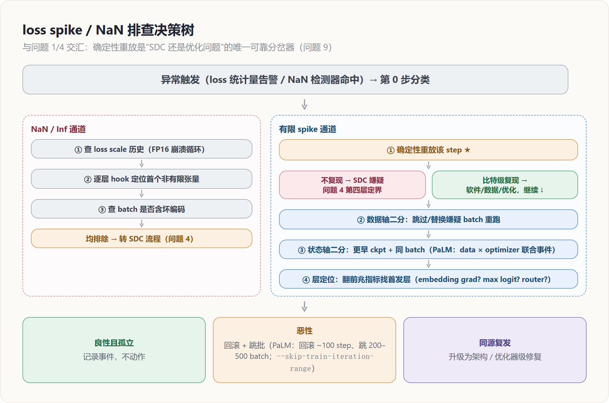
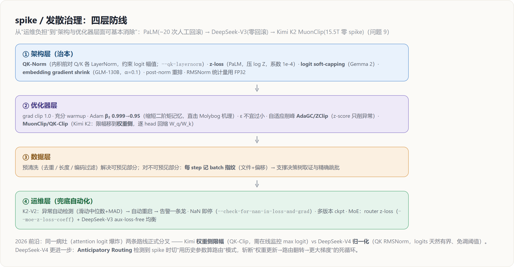

# 训练动力学稳定性：loss spike · NaN · 发散 · 2026 前沿

> **来源**：`docs/research/wanka_determinism_reliability_deep_analysis.md` 第三部分（问题 9：训练动力学不稳定——loss spike、NaN 与发散），含「2026 前沿一代」与「与其他问题的交叉」两节。
> **维度**：机制级深挖（背景 → 影响 → 如何发现 → 排查 → 解决方案 → 前沿 → 交叉）。
> **所属簇**：[[07_training_reliability/index]]（万卡级训练：确定性与可靠性问题域）。
> **保真度**：本页是对上述二手综述的结构化摄入，机制、数字、命令、代码、arXiv id 与归属均忠实于原文。

前八个问题回答的是「机器算得对不对、坏了怎么恢复」；本问题是稳定性的另一半：**硬件无故障、数值无损坏、通信正常，loss 却突然跳升甚至发散**。这是系统侧一切正常、模型自己训炸的情形，其排查流程与确定性（问题 1）、SDC（问题 4）、低精度（问题 3）、Checkpoint（问题 7）焊在同一个闭环里。

---

## 一、背景：系统一切正常，模型自己训炸了

先钉住三个术语：

- **loss spike**：loss 曲线上的瞬时跳升，按后果分**良性**（数十至数百 step 内自愈回到原轨迹）与**恶性**（一去不返，走向发散）；
- **NaN/Inf**：数值彻底越界，训练即刻不可用；
- **缓慢发散**：loss 不再下降、grad/param norm 持续攀升的慢性形态。

规模放大了这一切——**PaLM 540B 全程记录了约 20 次 loss spike**，每次都要人工回滚处置；一份 **65B 模型的训练报告披露，处理 spike 额外耗费了 30 天与 129.3 MWh 电力**。

### 根因谱系：四类根因

根因可分四类（**Baidu AdaGC 论文**给出了与此一致的归纳），前两类与本报告前文直接交叉。

**其一，数据性。** 异常样本（超长重复模式、损坏编码、离群分布的片段）与优化器状态在特定时刻相遇。**PaLM 的关键观察**是：**把肇事 batch 单独重放并不能稳定复现 spike**——spike 是「特定数据 × 特定优化器状态」的联合事件，两者单独都不触发。这个观察定义了后文排查流程里「数据轴/状态轴双向二分」的必要性。

**其二，数值性（接问题 3）。** FP16 时代的主要杀手是动态 loss scaling 的崩溃循环——溢出 → 缩 scale → underflow 梯度归零 → 再溢出，**OPT-175B 的训练日志忠实记录了数十次由此导致的重启与手工调参**；BF16 迁移基本消灭了 overflow 类 NaN，但留下了逻辑类 NaN（除零、log(0)、全 mask 行的 softmax 产生 -inf 行、masking 中的 0×inf）与低精度归一化的病：**把 RMSNorm 的统计量从 BF16 提到 FP32 可显著改善稳定性**；AdaGC 还记录了一个反直觉现象——**FP8 的隐式量化有时反而通过压制 outlier 提高了稳定性**。

**其三，优化动力学。** 两条已被机理化的链路：

- **(a) attention logit 爆炸**——QK 内积无界，训练中期个别 head 的 max logit 可增长到数百，softmax 进入饱和区后梯度病态，**ViT-22B 首次完整记录该现象并提出 QK-Norm**；
- **(b) Adam 状态滞后**——**Molybog et al.（Meta）**的理论分析指出，spike 前兆是早期层梯度 RMS 塌缩到 ε 量级、更新方向被过时的二阶矩主导，梯度时域相关性破坏后一次性释放；这解释了为什么调大 β₂ 或调小 ε 都会诱发 spike（**AdaGC 复现验证了这一点**），也解释了 **K2-V2 观察到的「绝大多数 spike 集中在训练前 40%」**——早期 Adam 状态最不成熟。

**Takase et al.（Spike No More）**从 Jacobian 谱范数角度补充了第三条：**embedding 范数过大会放大整个网络的梯度上界**，导出「小尺度 embedding 初始化 + LN 位置约束」的稳定条件——这与 **GLM-130B 的经验观察（embedding 层梯度尖峰先于 loss spike 出现）**互相印证。

**其四，硬件性（即问题 4）。** **SDC 产生的 spike 与本问题的 spike 在 loss 曲线上不可区分**，这是两个问题域必须共享同一套排查入口的原因。

### MoE 特有的病

MoE 另有自己的病：router 是「连续 logits → 离散 top-k」的决策点（问题 3 已述其放大效应），训练中可能出现**负载崩塌**（少数专家赢者通吃、其余专家死亡）与 **router logits 漂移**；**ST-MoE 系统研究了 MoE 特有的不稳定性**，指出多数稳定性手段以质量为代价，**router z-loss 是少数两者兼得的例外**。

---

## 二、影响

- **恶性 spike** = 回滚 + 排查 + 重训，直接吃 goodput（与问题 5 的故障同一本账，但根因排查更难，因为「没有任何东西坏了」）；
- **良性 spike 也不免费**：它逼迫团队采用保守超参（更低 LR、更强 clip），付出收敛速度税——**NVIDIA 的实验给出了反向量化：QK-Norm + softmax capping 组合可以把可用学习率提高 1.5 倍而不发散**，稳定性技术直接兑换成了训练效率；
- **行业基线的演进本身说明问题可治**：PaLM（2022）约 20 次 spike 全靠人工回滚 → **DeepSeek-V3（2024）公开声明全程无不可恢复 spike、零回滚** → **Kimi K2（2025）用 MuonClip 在 15.5T token 上做到零 spike** → 2026 年的 **DeepSeek-V4 与 GLM-5** 进一步把 Muon 系优化器与全自动 spike 处置纳入默认配置（详见第六节）。spike 正在从「运维负担」变成「架构与优化器层面可基本消除的问题」。

---

## 三、如何发现：分层监控 + 前兆指标

只盯 loss 是不够的——loss 是最滞后的指标。生产级监控体系（**K2-V2 报告给出了完整样例**）分三层：

**结果层**：loss 与其鲁棒统计量。K2-V2 的做法值得抄：对 loss 维护滑动中位数 $m_t$ 与 **MAD**（中位数绝对偏差），用标准化分数 $\lvert loss - m_t\rvert / \text{MAD}_t$ 判异常（对 spike 本身鲁棒，不会被 spike 污染阈值），触发即自动重启并推送告警；**ZClip 对梯度范数做同样的 z-score 异常判据**。

**前兆层**（领先 loss 数十到数百 step，是告警的主力）：

- **max attention logit**（逐层逐 head，**ViT-22B / Chameleon / OLMo 2** 的一级指标）；
- **embedding 层梯度范数**（**GLM-130B** 的先行指标）；
- **早期层梯度 RMS 是否塌向 ε**（**Molybog 判据**）；
- param norm 增速、activation RMS、softmax 归一化因子 $\log Z$ 的漂移。

**MoE 层**：router 熵、各专家负载分布、token drop 率、router logits 幅值——router 精度问题（问题 3）与负载崩塌都先在这些指标上显形。

---

## 四、排查思路：一棵决策树



这是本问题与问题 1/4 交汇的地方，完整流程如下：

```text
异常触发（loss 统计量告警 / NaN 检测器命中）
│
├─ 第 0 步：分类。NaN/Inf？有限 spike？还是 norm 缓慢攀升？
│
├─ NaN 通道：
│   1. FP16 遗留栈：先查 loss scale 历史（崩溃循环特征：scale 指数下坠）
│   2. 定位首个非有限张量：逐层 forward/backward hook 扫描
│      （调试场景可用 torch.autograd.set_detect_anomaly，代价大，不进生产）
│   3. 检查输入 batch 本身是否含 NaN/坏编码（数据管道问题）
│   4. 均排除 → 转问题 4 的 SDC 流程（指数位翻转是 NaN 的经典硬件成因）
│
├─ 有限 spike 通道：
│   1. 确定性重放该 step（前提=问题 1 的全栈确定性）
│      ├─ 不复现 → SDC 嫌疑，走问题 4 第四层（per-device checksum 定界）
│      └─ 比特级复现 → 软件/数据/优化问题，继续
│   2. 数据轴二分：同一模型状态 + 跳过/替换嫌疑 batch 重跑
│      ├─ 正常 → 数据性；留存肇事 batch 做离线取证（超长重复、坏 unicode、
│      │        离群领域片段），并沉淀进数据清洗规则
│      └─ 仍 spike → 继续
│   3. 状态轴二分：更早的 checkpoint + 同一 batch 重放
│      └─ 典型结论（PaLM）：单独都不触发 → data × optimizer state 联合事件
│   4. 层定位：翻前兆指标曲线找首发层
│      （embedding 梯度先动？某 head 的 max logit 先爆？某 MoE 层 router 先漂？）
│
└─ 处置分级：
    良性且孤立 → 记录事件，不动作
    恶性 → 回滚 + 跳批续训（PaLM 配方：回滚到 spike 前约 100 step 的 ckpt，
           跳过其后 200–500 个 batch；Megatron 提供
           --skip-train-iteration-range 在续训时跳过指定迭代区间）
    同源复发 → 升级为架构/优化器级修复（见下）
```

注意第 1 步的地位：**没有确定性重放，「SDC 还是优化问题」这个分岔就只能靠猜**——这是确定性（问题 1）在系统侧之外的第四个用途。

---

## 五、解决方案与代码实现：四层防线



### （1）架构层（治本，主要来自各实验室报告）

- **QK-Norm**：对 Q、K 在内积前各做一次 LayerNorm，直接约束 attention logit 幅值。源自 **ViT-22B**，被 **Chameleon、OLMo 2、Gemma 3** 等采纳，**Megatron 开关 `--qk-layernorm`**。
- **z-loss**（**PaLM**）：softmax 归一化因子 $Z$ 的漂移是 logit 整体膨胀的信号，加一项辅助 loss 把 $\log Z$ 压向 0：

```python
# z-loss：约束输出 softmax 的归一化因子，系数按 PaLM 取 1e-4
lse = torch.logsumexp(logits, dim=-1)          # log Z
loss = ce_loss + 1e-4 * (lse ** 2).mean()
```

- **logit soft-capping**（**Gemma 2**）：`logits = cap * tanh(logits/cap)` 硬性限幅（注意与 FlashAttention 的兼容性代价，**Gemma 3 已转向 QK-Norm**）；**NVIDIA 实验显示 QK-Norm 与 softmax capping 组合可换取 1.5 倍学习率**。
- **embedding 侧**（**GLM-130B 的 EGS + Spike No More 的初始化条件**）：

```python
# embedding gradient shrink（GLM-130B，alpha=0.1）：前向值不变，反向把
# embedding 的梯度缩小到 alpha 倍——针对"embedding 梯度尖峰先于 spike"的观察
word_embedding = word_embedding * alpha + word_embedding.detach() * (1 - alpha)
```

- **归一化布局与精度**：**post-norm 重排**（**Chameleon / OLMo 2** 把 LN 移到子层输出侧）；**RMSNorm 统计量用 FP32 计算**（接问题 3 的高精度关键路径原则）。

### （2）优化器层

- **常规项**：全局 grad clip（1.0 是行业默认）、充分 warmup、**Adam β₂ 从 0.999 降到 0.95**（大模型标配，直接针对 Molybog 机理——缩短二阶矩记忆）、ε 不宜过小。
- **自适应 clip 一族**：固定阈值 clip 对「合法的梯度量级漂移」与「异常尖峰」一视同仁，**AdaGC（每参数组 EMA 自适应阈值）与 ZClip（z-score 异常判据）**把 clip 从常量变成统计量，只削异常不压正常：

```python
# 工业常见的自动跳步/自适应削峰骨架
if zscore(grad_norm, hist) > k:        # ZClip 判据；或 AdaGC 的 per-group EMA 阈值
    skip_or_rescale_step()             # 跳过本次 optimizer.step() 或按比例缩放
    log_incident(step, batch_fingerprint, layer_norms)   # 留证据供决策树取证
```

- **MuonClip / QK-Clip**（**Kimi K2**）：把限幅从梯度侧移到**权重侧**——逐 head 监控 max pre-softmax logit，超过阈值 $\tau$ 时按比例回缩 $W_q$、$W_k$（各乘 $\sqrt{\tau / S_h}$），从源头钉死 logit 上界；**K2 以此在 15.5T token 上实现零 spike，是「优化器内置稳定性」路线目前最强的工业实证**。

### （3）数据层

预清洗（去重、长度与编码过滤）解决可预见的部分；对不可预见的部分，工程要点是**肇事数据可追溯**——每 step 记录 batch 指纹（数据文件与偏移），决策树第 2 步的取证与 `--skip-train-iteration-range` 的精确跳批都依赖它（这也再次落在问题 7 (4) 数据迭代器状态管理的延长线上）。

### （4）运维层（兜底自动化）

PaLM 时代的人工流程（观察 → 回滚 → 跳批）已经产品化：**K2-V2 展示的形态是异常自动检测 → 自动重启 → 告警推送一条龙**；**NaN 即停**（**Megatron `--check-for-nan-in-loss-and-grad`**）防止污染扩散进 checkpoint；多版本 checkpoint 保留（问题 7）保证「回滚到 spike 前 N 步」永远有版本可用。MoE 侧的对应物：

- **router z-loss**（**ST-MoE**，**Megatron `--moe-z-loss-coeff`**）；
- **DeepSeek-V3 的 aux-loss-free 负载均衡**（用逐专家 bias 动态调节替代辅助 loss，绕开「稳定性辅助 loss 伤主任务质量」的两难）；
- **router 关键路径 FP32**。

---

## 六、2026 前沿一代：GLM-5、DeepSeek-V4、Kimi K2.5 与依旧沉默的两家

### （1）Muon 系优化器从单点实证变成路线共识

时间线：

- **Kimi K2（2025.07）** 用 MuonClip 首证 15.5T token 零 spike →
- **DeepSeek-V4（2026.04，arXiv:2606.19348）** 把 Muon 列为与混合注意力（CSA/HCA）、**mHC（流形约束超连接，针对深层残差稳定性）**并列的三大升级之一，动机明确写为「更快收敛与更强训练稳定性」，在 **32T token、1.6T 参数（V4-Pro，激活 49B）**的 MoE 上落地，并披露了 **hybrid Newton–Schulz 正交化**的工程细节——**前 8 步用激进系数 (3.4445, −4.7750, 2.0315)** 把奇异值快速收敛到 1 附近，**末 2 步切换保守系数 (2, −1.5, 0.5)** 精确稳定 →
- **GLM-5（2026.02，28.5T token）** 的优化器选型同样直接站在 MuonClip 工程化验证的基础上。

「把稳定性内置进优化器」从 Kimi 的孤证变成多家旗舰的默认配置；AdamW 时代靠 β₂/ε 手工走钢丝的问题（Molybog 机理）被部分地从源头消解。

### （2）同一病灶的两条路线正式分叉

针对 attention logit 爆炸，两家在同一个月发布，互为对照组：

| 维度 | **norm 路线（DeepSeek-V4）** | **clip 路线（Kimi K2 / QK-Clip）** |
|------|------------------------------|-------------------------------------|
| 手段 | 对 attention 的 **query 与 KV 都做 RMSNorm**，logits 天然有界，报告明确说明「因此未采用 QK-Clip」 | **权重侧限幅**：max logit 超阈时回缩 $W_q$/$W_k$ |
| 代价 | 付**常驻计算**、**免调阈值** | **不动架构**、**需在线监控 max logit** |

这印证了本问题方案 (1)(2) 的可替换性。两家在同一个月发布互为对照组，是稳定性技术成熟度的标志。

### （3）spike 自动处置进化出「换模式续训」的新形态

**DeepSeek-V4 的 Anticipatory Routing（预期路由）**值得单独记录：常态下正常训练；系统检测到 loss spike 时自动触发短暂回滚，并切换到「用历史参数 $\theta_{t-\Delta t}$ 计算路由并提前缓存」的模式——解耦主干与 router 的同步更新，斩断「权重更新 → 路由翻转 → 分布突变 → 更大梯度」的 spike 死循环（正是问题 3 所述 router 离散放大效应的运行态版本）——稳定后切回正常模式，**激活期额外 wall-clock 开销约 20%、平时零开销**。对照 PaLM 的「回滚 + 跳数据」，这里跳的不是数据而是**训练模式**，且全程无人工。

配套的 **SwiGLU Clamping**（线性分量钳位 $[-10, 10]$、门控分量上限 10）是激活侧限幅的新样本，与 soft-capping 同族。另有一处与问题 3 直接呼应：**V4 的 MoE 梯度以 BF16 量化传输、用 two-phase reduce-scatter 规避低精度累加误差**——树形/分段累加原则在通信路径上的又一次落地。

### （4）RL 阶段成为稳定性的新前沿，并与问题 2 合流

- **Kimi K2.5** 在 K2 基础上引入 **token 级裁剪的梯度 mask** 实现：对数比率落在 $[\alpha, \beta]$ 内的 token 正常回传，**出界 token 梯度直接置零**——双边严格限界，与 PPO clip 的语义不同，报告明确其动机是**训练与推理框架差异放大的 off-policy 问题**（即问题 2 的训推不一致），并认定该机制对长程多步工具调用场景的训练稳定性至关重要。
- **GLM-5 的 slime 异步 RL** 给出另一组配方：**TITO（Token-in-Token-out）网关**保留 token 级精确对应、消除重分词不匹配；**直接双边重要性采样**（token 级 $[1-\varepsilon_l, 1+\varepsilon_h]$ 裁剪）在不追踪历史策略 checkpoint 的前提下控制离策偏差；外加一个非常规动作——**每次权重推送到推理端后重置优化器状态**以对冲策略滞后。

几家不约而同把「训推数值/分词差异」列为 RL 稳定性的头号敌人，**TIS 系校正正在成为事实标准**。

### （5）Anthropic 与 OpenAI 依旧沉默

截至 2026 年中，两家的公开产出仍集中在对齐与安全研究，预训练稳定性侧没有任何新增技术披露（OpenAI 的下一代模型据报道已完成预训练，但无技术报告）。本问题的公开知识版图由此进一步倾斜：**spike/NaN 治理的前沿实证几乎全部来自中国实验室的开源技术报告，加上 Google 的间接披露**——引用与对标时需要意识到这个样本偏差。

---

## 七、与其他问题的交叉

spike 鉴别把本报告的两条主线焊在一起：

- **确定性重放（问题 1）是 SDC（问题 4）与优化问题的唯一可靠分岔器**；
- **数值精度治理（问题 3）决定了 router 与归一化层的稳定裕量**；
- **回滚-跳批的可执行性完全建立在 checkpoint 多版本保留与数据迭代器精确回放（问题 7）之上**。

反过来，本问题贡献的前兆指标体系（**max attention logit、embedding grad norm、早层梯度 RMS**）也应并入问题 6 的在线监控面板——系统异常与动力学异常共用同一套观测底座。

---

## Related Pages

- [[07_training_reliability/index]] — 本簇目录索引（9 个问题 × 两条主线）
- [[10_determinism_and_numerical_reliability_analysis]] — 兄弟页（问题 1-4）：spike 与 SDC / 确定性重放在决策树第 1 步交汇
- [[11_fault_tolerance_and_recovery_analysis]] — 兄弟页（问题 5-8）：回滚-跳批依赖 checkpoint 多版本保留与数据迭代器精确回放
- [[11_muon_analysis]] — Muon 优化器（本问题第六节「Muon 路线共识」的一手原理）
- [[11_kimi_k2_analysis]] — Kimi K2 的 MuonClip / QK-Clip（15.5T token 零 spike）
- [[13_deepseek_v4_analysis]] — DeepSeek-V4 的 Muon / mHC / Anticipatory Routing / SwiGLU Clamping
- [[01_glm_5_analysis]] — GLM-5 的 slime 异步 RL / TITO / 双边重要性采样
- [[12_deepseek_v3_analysis]] — DeepSeek-V3 全程零不可恢复 spike、零回滚
- [[20_rl_training_inference_precision_analysis]] — RL 训推一致（本问题第六节第四点「RL 稳定性与问题 2 合流」）
