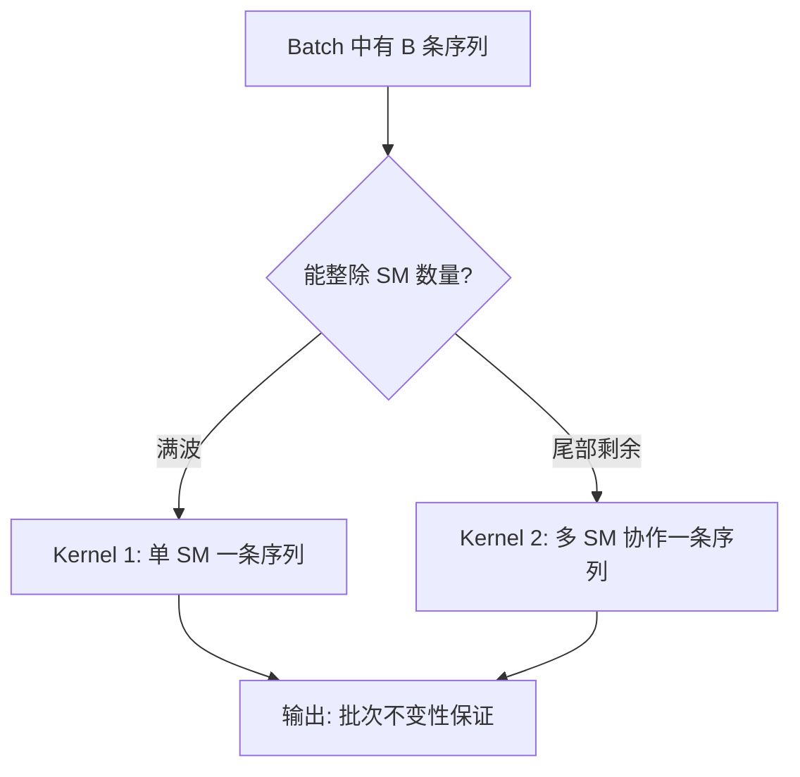
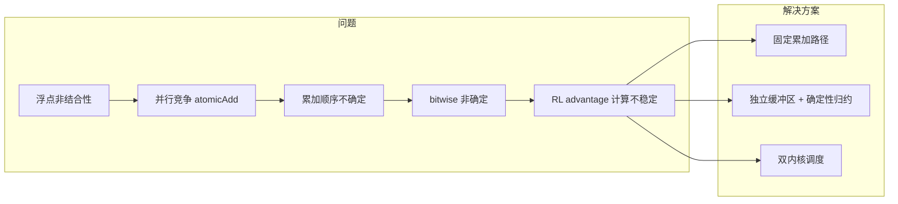

# 批次不变性与确定性算子开发指南

> **来源**: `raw/01_theory/01_models/deepseek/DeepSeek_V4.pdf` §3.3 + DeepGEMM 源码分析
> **创建日期**: 2026-05-14
> **说明**: 本文系统梳理 DeepSeek V4 技术报告中批次不变性（Batch Invariance）与确定性（Determinism）算子的设计动机、实现原理与代码示例。面向算子开发者与训练框架维护者。

---

## 一、问题背景：为什么需要批次不变性？

### 1.1 定义

**批次不变性（Batch Invariance）**：对任意输入 token $x$，其输出 $f(x)$ 必须是 **bitwise 完全相同** 的，无论 $x$ 在 batch 中处于什么位置、与哪些其他样本一起被处理。

```
batch1 = [A, B, C]  →  A 的输出 = O_A
batch2 = [B, A, C]  →  A 的输出 = O_A  (bitwise 相同)
batch3 = [C, X, A]  →  A 的输出 = O_A  (bitwise 相同)
```

**确定性（Determinism）**：同一输入在同一硬件上每次运行产生 bitwise 相同的输出，不受线程调度、硬件竞争等影响。

### 1.2 为什么后训练 RL 必须保证批次不变性？

后训练阶段使用 GRPO 等强化学习算法，核心机制是**组内相对比较**：

1. 同一 prompt 生成 $G$ 个 response
2. 在组内计算 advantage：$\hat{A}_i = \frac{r_i - \text{mean}(\mathbf{r})}{\text{std}(\mathbf{r})}$
3. 根据 advantage 更新策略

如果同一 response 的 logit 因 batch 中其他样本的位置不同而产生微小差异（FP32 最后几个 bit），这些差异在 advantage 计算中被放大，导致：
- 组内排名不可靠 → 训练信号噪声增大
- Loss spike（在万亿参数 MoE 训练中尤为致命）
- 调试困难（同一输入、同一代码、不同 run 结果不同）

此外，确定性训练也是**预训练/后训练/推理三条流水线 bitwise 对齐**的基础，对稳定性和可调试性至关重要。

---

## 二、浮点非结合性：根源问题

### 2.1 IEEE 754 加法不满足结合律

浮点加法的非结合性是所有批次不变性问题的数学根源：

$$(a + b) + c \neq a + (b + c)$$

在 FP32 下：

```python
a = np.float32(1e7)
b = np.float32(1e-7)
c = np.float32(-1e7)

(a + b) + c  # = 0.0       (b 的贡献被吞掉)
a + (b + c)  # = 0.0       (同理, 1e-7 + -1e7 → -1e7, b 同样丢失)
```

在 GPU 并行计算中，当多个 SM 的 partial result 通过 `atomicAdd` 合并时，到达顺序的微小差异导致**有效累加树不同** → 最终结果在最后几个 bit 上不同。

### 2.2 影响算子分类

| 算子类别 | 非确定性来源 | 传统优化手段 | 是否破坏批次不变性 |
|---------|-------------|-------------|------------------|
| Attention（前向） | FlashAttention split-KV → 跨 SM 原子累加 | split-KV 提升 SM 利用率 | **是** |
| MatMul（前向） | cuBLAS split-k → 跨 CTA 原子累加 | split-k 提升小 batch 性能 | **是** |
| Attention（反向） | KV token 梯度的 atomicAdd | 直接原子累加 | **是** |
| MoE（反向） | 跨 rank 并发写同一 buffer | 写入位置动态协商 | **是** |

---

## 三、Attention 批次不变性：双内核策略

### 3.1 为什么不能使用 split-KV？

FlashAttention 的 split-KV 优化将**同一条序列**的 Attention 计算拆分到多个 SM 上：

```
序列长度 4096，拆成 4 份：
  SM-0: tokens [0:1024]     → partial_o_0 → atomicAdd(&O, partial_o_0)
  SM-1: tokens [1024:2048]   → partial_o_1 → atomicAdd(&O, partial_o_1)
  SM-2: tokens [2048:3072]   → partial_o_2 → atomicAdd(&O, partial_o_2)
  SM-3: tokens [3076:4096]   → partial_o_3 → atomicAdd(&O, partial_o_3)

  O[t] = partial_o_0[t] + partial_o_1[t] + partial_o_2[t] + partial_o_3[t]
       = ((partial_o_0 + partial_o_1) + partial_o_2) + partial_o_3  ← 顺序不确定!
```

`atomicAdd` 的到达顺序取决于硬件调度，不可控、不可复现。

> **结论**: 要实现批次不变性，必须放弃 split-KV，让一条序列的 Attention 在**单个 SM 内**完成。

### 3.2 放弃 split-KV 后的新问题：Wave Quantization

GPU 有固定数量的 SM（如 H100 有 132 个 SM）。当 batch 大小不能被 SM 数量整除时：

```
第 1 波 (wave): SM-0~131 全满  →  132 条序列完成
第 2 波 (wave): SM-0~55 工作, SM-56~131 闲置  →  利用率 42%
```

最后一个部分波（partially-filled wave）中大量 SM 空转，延迟与满波相同但吞吐骤降。**RL 后训练通常 batch 很小**（几条到几十条序列），wave quantization 的影响尤其严重。

### 3.3 双内核策略设计



#### Kernel 1（主 Kernel）：单 SM 一条序列

```
SM-0: [序列 0, 全部 token] → output_0  (累加路径: j=0→1→2→...→N-1)
SM-1: [序列 1, 全部 token] → output_1  (累加路径: j=0→1→2→...→N-1)
...
```

- 全部累加在 SM 的 shared memory + register 内顺序完成
- 没有 `atomicAdd`，没有跨 SM 竞争
- 输入相同 → 输出 bitwise 相同 → **批次不变性成立**
- 适用场景：满波（batch size ≥ SM 数量）

#### Kernel 2（尾部 Kernel）：多 SM 协作 + 固定顺序归约

```
剩余 3 条序列，但有 100+ 个空闲 SM：

  Cluster-A (SM-0~31):   协同处理 序列 A → output_A
  Cluster-B (SM-32~63):  协同处理 序列 B → output_B
  Cluster-C (SM-64~95):  协同处理 序列 C → output_C
```

**关键设计**：Kernel 2 的输出必须与 Kernel 1 **bitwise 相同**。

Kernel 1 的有效累加路径：
$$O = (\dots((v_0 w_0 + v_1 w_1) + v_2 w_2) + \dots + v_N w_N)$$

Kernel 2 必须保证等效路径：
$$O = (\dots((\text{partial}_0 + \text{partial}_1) + \text{partial}_2) + \dots + \text{partial}_K)$$

**实现手段**：

1. **Distributed Shared Memory**（SM90+ thread-block cluster 特性）：cluster 内 SM 可直接互访 shared memory，无需经 global memory
2. **固定顺序跨 SM 归约**：Block 0 显式按 block_id 顺序 `0 → 1 → 2 → ...` 累加所有 partial，替代 `atomicAdd`
3. **累加路径等价**：Block 0 的归约顺序与 Kernel 1 的 token 级累加顺序一致

```cuda
// Kernel 2 核心归约逻辑（简化）
if (block_id == 0) {
    for (int src_block = 1; src_block < num_blocks; src_block++) {
        cluster_arrive_and_wait();
        float* src_partial = cluster_map_shared_memory(src_block, partial_output);

        for (int t = 0; t < num_queries; t++)
            for (int d = 0; d < HEAD_DIM; d++)
                partial_output[t][d] += src_partial[t][d];
                // 固定顺序: block_1 → block_2 → ... 而非 atomicAdd
    }
    // 最终 O = (...((p0 + p1) + p2) + p3) ← 与 Kernel 1 等价
    store_to_global(O, partial_output);
}
```

### 3.4 双内核调度器

```python
class DualKernelScheduler:
    def __init__(self, num_sms: int = 132):  # H100
        self.num_sms = num_sms

    def dispatch(self, batch_size: int) -> str:
        full_waves = batch_size // self.num_sms
        remainder = batch_size % self.num_sms
        if remainder == 0:
            return f"Kernel1 × {full_waves} waves"
        else:
            return f"Kernel1 × {full_waves} + Kernel2 for last {remainder} seqs"
```

完整的调度器与 CUDA 伪代码示例见本文 §六 及 `tools/batch_invariance_demo.py`。

---

## 四、矩阵乘法确定性：DeepGEMM 替代 cuBLAS

### 4.1 cuBLAS 为什么不保证批次不变性？

cuBLAS 是 NVIDIA 闭源库，内部使用了 split-k 等性能优化：
- **split-k**：将 K 维度拆分到多个 CTA，每个算一段 partial dot-product，最后 `atomicAdd` 合并
- 小 batch 下 split-k 是提升 SM 利用率的关键手段
- 但 `atomicAdd` 的到达顺序不确定 → 累加路径不确定

### 4.2 DeepGEMM 的 1D1D 布局

DeepGEMM 的核心设计理念：**每个输出 tile 恰好由一个 CTA 计算**，杜绝跨 CTA 累加。

```cuda
// DeepGEMM 1D1D GEMM kernel 简化结构
// 源码: deep_gemm/include/deep_gemm/impls/sm90_fp8_gemm_1d1d.cuh

template <int BLOCK_M, int BLOCK_N, int BLOCK_K>
__global__ void sm90_fp8_gemm_1d1d_impl(
    __nv_fp8_e4m3* gmem_a,
    __nv_fp8_e4m3* gmem_b,
    uint32_t shape_m, uint32_t shape_n, uint32_t shape_k
) {
    float final_accum[WGMMA::kNumAccum] = {0};

    // Persistent Scheduler: 每个 CTA 独立领取一个 (m_block, n_block) tile
    Scheduler scheduler(shape_m, shape_n);
    while (scheduler.get_next_block(m_block_idx, n_block_idx)) {
        // 遍历所有 K blocks（本 CTA 独立完成，不拆分!)
        for (int k_block = 0; k_block < shape_k / BLOCK_K; k_block++) {
            // TMA 加载 + WGMMA 计算
            wgmma(accum, smem_a, smem_b);

            // ★ 本 CTA 内部顺序累加，没有跨 CTA 的 atomicAdd
            for (int i = 0; i < WGMMA::kNumAccum; i++)
                final_accum[i] += accum[i];
        }

        // 直接写回全局内存（本 tile 仅此一个 writer）
        store_to_gmem(gmem_c, final_accum, m_block_idx, n_block_idx);
    }
}
```

**关键点**：
- Scheduler 按 `(m_block, n_block)` tile 粒度分配工作，同一 tile 只有一个 CTA 写入
- K 维度全由同一个 CTA 完成，不存在 K 分片合并 → 无需 `atomicAdd`
- 累加路径完全由本 CTA 的循环顺序决定 → **bitwise 确定**

### 4.3 小 batch 优化：放弃 split-k 后的性能补偿

DeepGEMM 用以下手段弥补放弃 split-k 的 SM 利用率损失：

| 优化 | 原理 |
|------|------|
| **更细粒度 Tiling** | `BLOCK_M=64, BLOCK_N=64`（而非 128×128）→ 更多 tile → 更多 CTA |
| **Warp Specialization** | TMA warp 专做数据搬运，Math warp 专做计算 → 隐藏访存延迟 |
| **Multi-Stage Pipeline** | 多个 shared memory buffer 流水线 → TMA 延迟被完全隐藏 |
| **Persistent Kernel** | CTA 处理完一个 tile 后领取下一个 → 省去 kernel launch overhead |

DeepGEMM 官方报告在大部分场景下非 split-k 性能达到甚至超过标准 split-k。

---

## 五、MoE 反向传播的确定性累加

### 5.1 问题

MoE 反向传播中，多个 rank 的多个 SM 向同一 expert 梯度缓冲区并发写入：

```
SM-0 (rank 0): token_0 → expert_3 → atomicAdd(&grad_buffer[expert_3], ...)
SM-1 (rank 0): token_1 → expert_3 → atomicAdd(&grad_buffer[expert_3], ...)
SM-0 (rank 1): token_5 → expert_3 → atomicAdd(&grad_buffer[expert_3], ...)
                                         ↑  写入顺序不确定
```

### 5.2 方案：三步确定化

**Step 1 — Per-SM 独立缓冲区**

```cuda
__global__ void moe_backward_collect(
    float* token_grads,
    int* expert_assignments,
    float* per_sm_buffers,    // [NUM_SMS][NUM_EXPERTS][HIDDEN_DIM], 每个 SM 独占
    int num_tokens
) {
    int sm_id = blockIdx.x;
    int token_id = blockIdx.x * blockDim.x + threadIdx.x;

    if (token_id < num_tokens) {
        int expert_id = expert_assignments[token_id];
        int offset = sm_id * NUM_EXPERTS * HIDDEN_DIM + expert_id * HIDDEN_DIM;
        for (int d = 0; d < HIDDEN_DIM; d++)
            per_sm_buffers[offset + d] += token_grads[token_id * HIDDEN_DIM + d];
    }
}
```

每个 SM 在自己的独占区域内累加，无跨 SM 竞争。

**Step 2 — 确定性全局求和**

```cuda
__global__ void deterministic_global_sum(
    float* per_sm_buffers,
    float* global_grads,
    int num_experts
) {
    int expert_id = blockIdx.x;
    int dim = threadIdx.x;

    float accum = 0.0f;
    // ★ 固定 SM 顺序：SM 0 → SM 1 → ... → SM N-1
    for (int sm = 0; sm < NUM_SMS; sm++) {
        int offset = sm * NUM_EXPERTS * HIDDEN_DIM + expert_id * HIDDEN_DIM + dim;
        accum += per_sm_buffers[offset];
    }
    global_grads[expert_id * HIDDEN_DIM + dim] = accum;
}
```

无论硬件调度如何，`for (int sm = 0; sm < NUM_SMS; sm++)` 的迭代顺序始终不变 → 累加路径确定。

**Step 3 — Token 顺序预处理（跨 rank 场景）**
- 每个 rank 在发送 expert 梯度前，按 `(expert_id, token_id)` 排序
- 确保同一 expert 内的 token 以确定顺序处理
- 跨 rank buffer 隔离：rank_i 只写自己的区域，不与 rank_j 重叠

---

## 六、完整代码示例

以下 Python/numpy 演示了批次不变性的核心概念。完整 CUDA 伪代码见 `tools/batch_invariance_demo.py`。

### 6.1 浮点非结合性演示

```python
import numpy as np

# FP32 加法不满足结合律
a = np.float32(1e7)
b = np.float32(1e-7)
c = np.float32(-1e7)
r1 = np.float32(np.float32(a + b) + c)  # (1e7 + 1e-7) - 1e7
r2 = np.float32(a + np.float32(b + c))  # 1e7 + (1e-7 - 1e7)
print(f"(a+b)+c = {r1:.15f}")
print(f"a+(b+c) = {r2:.15f}")
# 结果: 虽然本例中可能碰巧相同，但在更复杂的场景中 (a+b)+c ≠ a+(b+c)
```

### 6.2 确定性 vs 非确定性累加对比

```python
# 模拟 4 个 SM 的 partial 值（有数量级差异）
partials = np.array([1e7, -1e7, 1e-7, 2e-7], dtype=np.float32)

# 非确定性：3 次不同 atomicAdd 到达顺序
np.random.seed(42)
for trial in range(3):
    order = np.random.permutation(4)
    result = np.float32(0.0)
    for idx in order:
        result = np.float32(result + partials[idx])
    print(f"  atomicAdd 顺序 {order}: {result:.7f}")

# 确定性：固定顺序累加（Kernel 2 的做法）
for trial in range(3):
    result = np.float32(0.0)
    for i in range(4):  # 固定顺序 0,1,2,3
        result = np.float32(result + partials[i])
    print(f"  固定顺序累加 #{trial}: {result:.7f}")
# 固定顺序 3 次结果完全相同
```

### 6.3 确定性 Attention 的简化演示

```python
def scaled_dot_product_attention(q, k, v):
    """单 SM 风格：所有累加本地顺序完成 → 天然确定"""
    d_k = k.shape[-1]
    scores = q @ k.T / np.sqrt(d_k)
    # softmax
    scores_max = np.max(scores, axis=-1, keepdims=True)
    e_x = np.exp(scores - scores_max)
    attn = e_x / np.sum(e_x, axis=-1, keepdims=True)
    return attn @ v

seq_a = np.random.randn(4, 64).astype(np.float32)
out1 = scaled_dot_product_attention(seq_a, seq_a, seq_a)
out2 = scaled_dot_product_attention(seq_a, seq_a, seq_a)
print(f"两次运行 bitwise 相同: {np.array_equal(out1, out2)}")  # True
```

---

## 七、设计原则总结



| 目标 | 核心技术 | 适用场景 | 性能开销 |
|------|---------|---------|---------|
| Batch Invariance（前向） | 双内核 Attention + DeepGEMM 1D1D | 注意力/矩阵乘法的前向传播 | 可忽略 |
| Determinism（反向） | Per-SM 独立缓冲区 + 固定顺序全局求和 | MoE/Attention 反向传播 | 极小 |
| 跨 rank 确定性 | Token 顺序预处理 + Buffer 隔离 | Expert Parallelism | 可忽略 |

核心设计哲学：**用可控的固定累加顺序替代并行竞争**，以微小的性能代价换取 bitwise 可复现性。这在万亿参数 MoE 模型的 RL 后训练中是不可妥协的基础设施要求。

---

## 相关页面

- [[07_training_reliability/index]] — 本页新归属目录:万卡级训练确定性与可靠性问题域索引（2026-07-31 kb-reorg P5 从 `04_posttrain_frameworks/` 迁入）
- [[determinism_and_numerical_reliability_analysis]] — 问题 2「训推数值不一致 / batch 不变性」的系统侧上游分析，本页是其 kernel 层算子级实现细化
- [[deepseek_v4_analysis]] — DeepSeek V4 整体架构，批次不变性上下文
- [[deepseek_v4_implementation_details]] — V4 核心组件伪代码实现
- [[deepseek_v4_technical_deep_dive]] — CSA/HCA/DSA/MLA 对比
- [[deepseek_v4_fp4_qat_analysis]] — FP4 QAT 训练流程（同属训练基础设施）
- [[tilelang_analysis]] — TileLang DSL，V4 融合 kernel 开发工具
- [[comm_compute_fusion_guide]] — 通算融合（WaveEP 等，同属基础设施优化）
- [[rl_sandbox_design_analysis]] — Coding RL Sandbox 设计（同属后训练框架）
- [[rl_infra_efficiency_analysis]] — Coding RL Infra 效率优化（异步训练对 batch invariance 的要求）
- [[02_engineering/01_ai_frameworks/index]] — AI 框架目录索引
