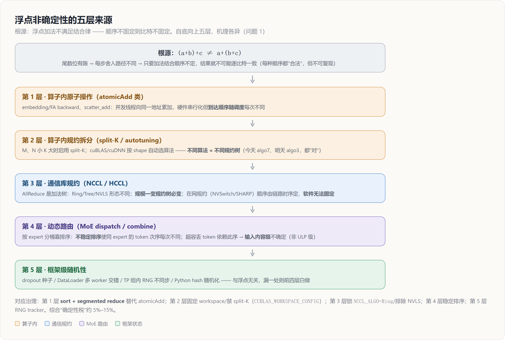
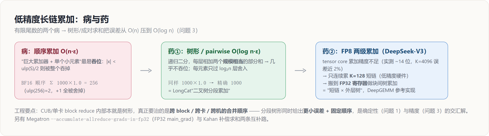
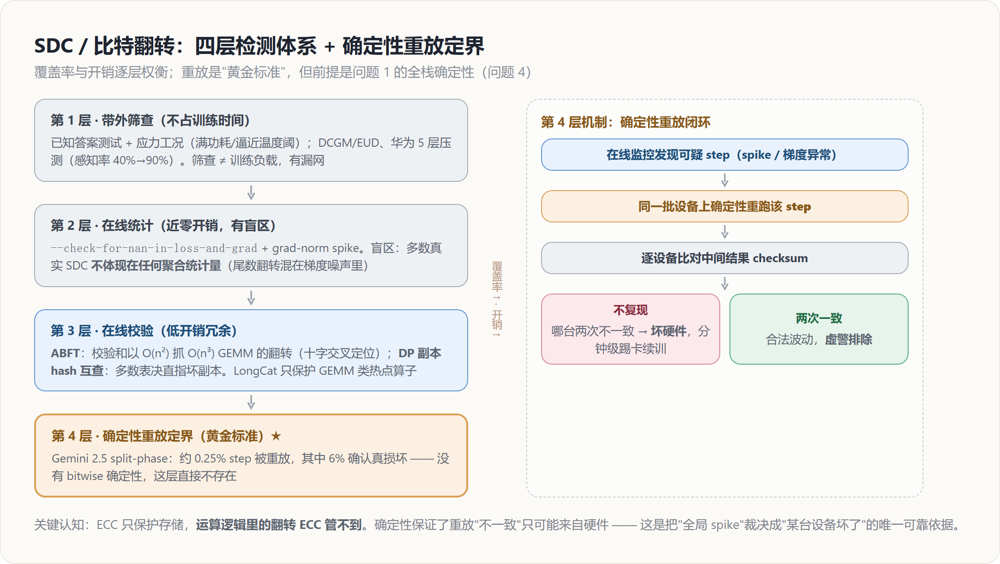

# 确定性与数值可靠性：浮点非确定性 · batch 不变性 · 低精度累加 · SDC

> **来源**：`docs/research/wanka_determinism_reliability_deep_analysis.md`（《万卡级 LLM 训练：确定性与可靠性问题域深度分析》）第一部分（问题 1–4）
> **维度**：机制级深挖（背景→影响→如何发现→解决方案与代码实现）
> **所属簇**：[[07_training_reliability/index]]

本页覆盖「确定性 / 数值可靠性」主线的四个问题：训练比特级不可复现（浮点非确定性）、训推数值不一致与 batch 不变性、低精度长链累加误差、静默数据损坏（SDC）与硬件比特翻转。四题共享一条底层逻辑：**没有 bitwise 可复现，就无法用「重放 + 比对」区分随机噪声与硬件故障**——确定性是故障定界的地基。

---

## 一、问题 1：训练过程比特级不可复现（浮点非确定性）

### 背景：不确定顺序的五层来源



一切的根源是一条数学事实：**浮点加法不满足结合律**。浮点数只有有限的尾数位，每次加法都要把精确结果舍入到最近的可表示数，所以 `(a+b)+c` 和 `a+(b+c)` 走过的舍入路径不同，结果可以相差若干 ULP（unit in the last place，最后一位的单位）。这意味着：只要一个并行系统中**加法的结合顺序**不固定，结果就不可能逐比特一致——即使每一种顺序算出的都是「合法」的和。训练栈里顺序不固定的来源自下而上有五层，每层的机理不同：

**第 1 层：算子内原子操作（atomicAdd 类）。** 多个线程并发向同一地址累加，硬件把原子操作排队串行化，但排队顺序由调度决定、每次运行不同。这是 embedding backward、FA backward、`scatter_add`/`index_put` 类算子的非确定性来源（具体机理与改写方法见下文「解决方案（3）」）。

**第 2 层：算子内规约拆分（split-K 与算法自动选择）。** 先看 GEMM 在 GPU 上的常规并行方式：输出矩阵 C 被切成二维 tile，每个 thread block 负责一块 C tile，沿 K 维在 block **内部顺序**累加——这条路径的加法顺序固定，本身确定。问题出在 M、N 较小而 K 很大的形状（万卡训练里大量出现：小 micro-batch 的线性层、decode 阶段的 GEMV）：此时输出 tile 数量不足以喂满上百个 SM，库会启用 **split-K**——把 K 维切成 S 段分给不同 block 并行算部分和，最后跨 block 合并。合并有两种实现：用原子累加（顺序随调度漂移，直接非确定）；或写入独立 workspace 再由第二个 kernel 归约（单次运行确定，但 S 是启发式按占用率选的——shape、SM 数量、可用 workspace 大小都影响选择，S 一变结合顺序就变）。cuBLAS/cuDNN 的 autotuning 把这件事进一步一般化：它们按 shape、对齐、硬件状态在多个算法实现间自动选择，而**不同算法就是不同的规约树**——今天选 algo 7、明天选 algo 3，结果比特级不同，但两者都「对」。

**第 3 层：通信库规约（NCCL/HCCL 的算法与在网计算）。** 集合通信的 AllReduce 本质也是一棵加法树，树的形态由算法决定。Ring AllReduce 分两阶段：reduce-scatter 阶段每个 rank 把数据切成 N 块，沿环形拓扑逐跳传递，每跳把收到的块与本地块相加——**累加顺序就是环上的邻居顺序**，rank 0 的贡献总在固定位置进入求和链；随后 allgather 阶段把归约完的块沿环分发。Tree 算法则做递归二分（recursive halving/doubling），加法的括号结构完全不同。所以：同一算法、同一规模、同一拓扑下，NCCL 是**运行间确定**的；但库会按消息大小、节点数、拓扑在 Ring/Tree/CollNet/NVLS 间自动切换，且**规模一变（弹性扩缩容、改 DP 度）规约树形态必变**，跨规模的比特一致在数学上就不成立。更棘手的是在网规约（NVLS 依托 NVSwitch、SHARP 依托 IB 交换机）：加法被卸载到交换机的 ALU 上执行，各端口数据到达交换机的先后由链路时序决定，**软件层没有任何手段固定这个顺序**——这是确定性模式必须排除在网规约的根本原因，不仅是工程取舍。（规约树机理详见 [[collectives_analysis]]。）

**第 4 层：动态路由类模块（MoE dispatch/combine）。** MoE 前向要把 (token, expert) 对按 expert 分桶，这一步靠排序实现。若使用**不稳定排序**（unstable sort，如基数排序的某些并行实现、bitonic sort），相同 key（同一 expert）的元素相对次序不保证——同一 expert 收到的 token 排列每次运行都可能不同，combine 端做 $\sum w_i \cdot x_i$ 加权求和的顺序随之改变。此外，带 capacity 限制的 MoE 在超容时要丢 token，「丢谁」直接依赖这个不稳定的顺序——这已经不是 ULP 级差异，而是**输入内容级**的不确定。这就是 MoE 模型成为不可复现重灾区、LongCat 把 MoE 列入自研确定性算子清单的原因。（MoE all-to-all 排序详见 [[expert_parallel_analysis]]。）

**第 5 层：框架级随机性。** dropout 种子管理、DataLoader 多 worker 的取数交错顺序、TP 组内 RNG 状态不同步、Python hash 随机化（影响某些 dict 遍历序）。这一层与浮点无关，纯粹是状态管理问题，但只要漏掉一处，前四层做得再好也白费。

### 影响

- **故障定界能力丧失**。分不清「这次 loss 和上次不一样」是浮点噪声还是坏卡产生的 SDC。Gemini 报告明确指出，完全确定性的基础设施是他们能快速定位（含硬件故障在内的）根因、支撑 Ultra 稳定训练的关键要素。
- **回滚验证失效**。故障回滚重训后 loss 曲线漂移，无法验证「修复是否正确」「数据是否重放对齐」。
- **芯片精度验收无基准**。在国产算力上，若软件栈本身不确定，就无法用「与 GPU 基线逐位对照」的方法验收芯片数值正确性——LongCat 的 Bitwise 一致性验证、以及昇腾生态的精度比对流程，都以确定性为前提。
- **实验科学性受损**。消融实验的差异可能来自噪声而非改动本身；loss spike 无法二分定位到 step。

### 如何发现

工程上的标准做法是**双跑比对 + 分层摘要**：

- 同种子、同数据、同并行配置跑两次，逐 step 比对 loss / grad-norm 是否逐位一致。注意必须比对**比特**（如把 float 按位转 int 比较）而非「约等于」——差 1 个 ULP 就说明存在未治理的非确定源；
- 对参数与梯度做逐层 hash/checksum（而非仅看标量 loss——loss 一致不代表中间状态一致：两处误差可能恰好抵消在标量上）；
- 利用 DP 的天然冗余：数据并行各副本在梯度同步后权重应完全一致，Megatron 提供现成开关：

```bash
# Megatron-LM：定期校验 DP 副本间权重 hash 是否一致
--check-weight-hash-across-dp-replicas-interval 200
```

- 改变并行度（如 TP=4→8）后做 loss 等价性测试，可暴露「依赖规约顺序」的隐藏实现问题；
- `torch.use_deterministic_algorithms(True)` 本身就是扫描器：它对每个算子查询是否存在确定性实现，有则切换、没有则**当场抛错**——跑一遍训练，抛错点就是完整的非确定算子清单。这正是自研确定性算子（LongCat 的 Embedding/FA/LSA/MoE，昇腾生态同类工作）的需求发现方式。

### 当前解决方案与代码实现

**（1）PyTorch / CUDA 层开关。**

```python
import torch, os

os.environ["CUBLAS_WORKSPACE_CONFIG"] = ":4096:8"  # 见下文解释
torch.use_deterministic_algorithms(True)           # 强制确定性实现，无确定性实现的算子直接报错
torch.backends.cudnn.deterministic = True          # cuDNN 只从确定性算法集合中选择
torch.backends.cudnn.benchmark = False             # 禁止按 shape 现场测速选算法
```

逐项解释这些开关「关掉的是什么」：`CUBLAS_WORKSPACE_CONFIG=:4096:8` 为每个 CUDA stream 预分配固定尺寸的 cuBLAS workspace（8 块 4096 KB 缓冲）。cuBLAS 的部分算法（含 split-K 类）需要 workspace 存放跨 block 部分和；不固定 workspace 时，cuBLAS 可能因可用缓冲不同而在「有 workspace 的确定性归约路径」与「无 workspace 的原子累加路径」之间摇摆——固定它等于锁死算法选择的这个自由度（这是 CUDA 10.2+ 上 cuBLAS 确定性的必要条件）。`cudnn.benchmark=False` 关掉的是「第一次遇到新 shape 时现场跑几个算法测速、选最快」的机制——测速结果受当时硬件状态影响，两次运行可能选中不同算法，即不同规约树。`cudnn.deterministic=True` 则把候选集直接约束到确定性算法。

**（2）Megatron-LM 的确定性模式。** Megatron 把上述开关与生态约束打包成 `--deterministic-mode`，官方文档同时要求：

```bash
export NCCL_ALGO=Ring          # 或 "^NVLS"：固定/排除在网规约，锁定通信规约顺序
export NVTE_ALLOW_NONDETERMINISTIC_ALGO=0   # TransformerEngine：禁用非确定性 attention 后端
python pretrain_gpt.py ... --deterministic-mode
```

`NCCL_ALGO` 的语义对应背景第 3 层：把算法族钉死在软件可控顺序的 Ring/Tree 上，排除交换机侧累加顺序不可控的 NVLS/CollNet。`NVTE_ALLOW_NONDETERMINISTIC_ALGO=0` 对应 TransformerEngine 的 fused attention 后端选择——cuDNN fused attention 的部分 backward 实现含原子累加，该开关强制回退到确定性实现。

TP 场景下 dropout 的确定性由 RNG 状态追踪器保证，值得展开它解决的问题：TP 把一个逻辑张量切到多张卡上，dropout 的语义必须**等价于单卡上做一次采样**。对未切分的「复制区域」张量（如 LayerNorm 输出），所有 TP rank 持有同一份数据，mask 必须完全相同——否则 rank 间数据就地分叉，后续 allreduce 的输入都不一致；对被切分的「并行区域」张量（如 MLP 中间激活的分片），各 rank 持有不同片段，mask 必须**互不相同**且拼起来恰好等于单卡的一次完整采样——若共用种子，切分维度上会出现周期性重复的 mask 模式。Megatron `tensor_parallel/random.py` 的 `get_cuda_rng_tracker()` 为此维护两套命名 RNG 状态（default / model-parallel-rng），进出并行区域时显式切换。任何自定义并行算子若引入随机性都必须挂进该 tracker，否则复现性被破坏——这是自研算子 review 时的必查项。

**（3）算子级确定性实现的典型手法。** 先把 atomicAdd 这个非确定性的最典型来源讲透，再看改写方案。

atomicAdd 是 GPU/NPU 提供的硬件原子「读-改-写」指令：`atomicAdd(addr, v)` 把 `*addr += v` 作为一个不可分割的操作执行。它解决的问题是**并发写冲突**——成千上万个线程同时向同一个内存地址累加时，普通的「读出、加、写回」会互相覆盖丢失加数，原子指令保证每个加数都不丢。embedding backward 恰好是这种场景：一个 batch 里同一个 token id 会出现成百上千次（想想 "the"、逗号、换行符这类高频 token），这些位置的输出梯度都要累加到 `grad_weight` 的**同一行**上；最自然的并行写法就是每个 token 位置一个线程，各自向目标行发 atomicAdd。

问题在于：**原子性只保证「不丢加数」，完全不保证「加的顺序」**。硬件会把并发到达同一地址的原子操作排队串行执行，但谁排在前面取决于哪个 warp 先被调度、哪个 SM 的访存请求先到达——受时钟抖动、缓存状态、同机其他 kernel 的占用等影响，每次运行的到达顺序都不同。如果累加的是整数，顺序无所谓（整数加法严格满足交换律和结合律，任何顺序结果逐比特相同，所以 atomicAdd 用于计数器是完全确定的）；但浮点加法每一步都要舍入，**结合顺序不同 → 舍入路径不同 → 结果比特不同**。一个极端但直观的 FP32 例子：

```text
a = 2²⁴ = 16777216.0,  b = 1.0,  c = -2²⁴
顺序一：(a + b) + c = 16777216.0 + c = 0.0   # fp32 尾数仅 24 位，a+b 时 1.0 被舍入吞掉
顺序二：(a + c) + b = 0.0 + b       = 1.0
```

真实梯度的动态范围没这么极端，单步差异通常只在最后几个 ULP，但两次运行从这一步起就比特级分叉，随后被网络逐层放大到宏观可见。注意「非确定」不等于「算错了」：每种顺序得到的都是浮点意义上合法的和，只是**不可复现**——这正是问题 1 关心的性质。

确定性版本的通用改写，是把「到达顺序随机的并发累加」换成「顺序由数据本身固定的归约」，即 **sort + segmented reduce**：

```text
非确定：for each token i (并行): atomicAdd(&grad_weight[ids[i]], grad_out[i])
        # 同一 id 的多个 grad_out 以随机到达顺序被加进同一行
确定性：1) 对 (ids, grad_out) 按 ids 做稳定排序
        2) 对相同 id 的连续段做固定顺序的段内规约（segmented reduce）
        3) 每行一次性写回 grad_weight[id]，无并发写冲突，无需原子指令
```

代价是一次排序，但累加顺序完全由数据决定、与硬件调度无关——同样的输入永远得到同样的比特。FA backward 的非确定性是同一机制的另一处体现：backward 沿 KV 维并行时，多个 block 要向同一个 dQ 位置 atomicAdd 部分和；FlashAttention-2 的 `deterministic=True` 用「每个并行分片写入独立缓冲、最后按固定顺序合并」替代原子累加，代价是额外显存与约一到两成的 backward 性能。MoE 的确定性 dispatch 要求稳定排序（`argsort(kind='stable')` 语义，保证同分数 token 的相对次序固定）并固定 combine 端的加和顺序。

**（4）通信侧。** 基于背景第 3 层的机理，通信确定性的可达边界是清晰的：`NCCL_ALGO`/`NCCL_PROTO` 锁定算法族后，可获得「**同一拓扑、同一规模下**」的运行间确定性；跨规模确定性原理上不可得（规约树形态必变），弹性场景要接受「缩容后 loss 曲线合法分叉」这一事实并靠等价性测试兜底。昇腾侧 HCCL 提供确定性开关：

```bash
export HCCL_DETERMINISTIC=true   # HCCL 集合通信确定性计算模式
```

配合 `torch.use_deterministic_algorithms(True)`（torch_npu 将其映射到 CANN 算子的确定性实现路径）构成 NPU 上的两级确定性。综合性能税：禁 split-K/原子路径、FA 确定性 backward、放弃在网规约与部分高吞吐算法，业界实测约在 **5%–15%** 区间。Google 与 LongCat 的选择是全程开启并把税吃掉，换回的是问题 4 中「分钟级 SDC 定界」的运维杠杆；NVIDIA 生态默认关闭、按需开启。

---

## 二、问题 2：训推数值不一致与 batch 不变性（RL 时代的确定性）

### 背景：为什么「别人的请求」会改变你的结果

问题 1 讨论的是「两次运行是否一致」，本问题是更隐蔽的一层：**同一样本的数值结果依赖 batch 里的其他样本**。关键是区分两个概念：

- **运行间确定（run-to-run deterministic）**：固定输入、固定 batch，跑两次结果一致。问题 1 治理的是这个。
- **batch 不变（batch-invariant）**：同一条样本，无论和谁拼在一个 batch 里、batch 多大，它自己那部分的结果一致。这是一个更强的性质，且默认的高性能 kernel **普遍不满足**。

机理直接承接问题 1 背景第 2 层：kernel 的规约拆分策略是**按整个 batch 的形状选的**。三个具体例子：

- **matmul/GEMV**：单条请求 decode 时 M=1，是典型的「输出 tile 极少、K 很大」形状，库会选深度 split-K 甚至专门的 GEMV kernel（K 维切几十段并行归约）；同一时刻若服务器上凑了 8 条请求，M=8，可能走浅切分或不切分的 tile 路径。你这条请求对应的那一行输出，其 K 维加法的**结合括号方式取决于同 batch 有多少别的请求**——请求内容完全没变，结果比特变了。
- **RMSNorm**：batch 大时一个 thread block 处理一行（行内规约顺序固定）；batch 小时为了填满 SM，单行会被拆给多个 block 做 split reduction，再跨 block 合并——单行的规约树形态随 batch 大小切换。
- **attention（FlashDecoding 类）**：KV 序列拆成多少段并行处理（split-KV 数量），取决于 batch×heads 是否足以喂满 GPU；段数变，softmax 归一化与加权和的合并次数、顺序都变。

于是系统级不确定性的完整链条是：**服务器负载不确定 → 动态 batching 凑出的 batch 大小不确定 → kernel 规约拆分不确定 → 同一请求结果不确定**。每个 kernel 单独看都是运行间确定的，拼成推理系统就不确定了——这是 Thinking Machines 2025 年 9 月分析的核心论点：temperature=0 不可复现的主因不是笼统的「浮点 + 并发」，而是 batch 依赖性这个可修的工程缺陷。

RL 训练把这个问题从「体验问题」升级为「正确性问题」：rollout 引擎（vLLM/SGLang）与训练引擎（Megatron/FSDP）是**两套 kernel 栈**——不同的 GEMM 实现、不同的 attention kernel、不同的规约顺序，同一 (prompt, response) 算出的 per-token log-prob 存在系统性偏差。名义上的 on-policy RL（假设样本恰好采自当前策略）实际在做隐式 off-policy 更新，而算法里没有任何机制在校正这个偏差。（RL 训推精度细节见 [[RL_Training_Inference_Precision_Analysis]]、[[10_rl_ppo_loss_and_grpo_analysis]]；batch 不变性的算子级实现见 [[batch_invariance_guide]]。）

### 影响

- Thinking Machines 实验：对 Qwen3-8B 同一 prompt 采样 **1000 次**（temperature=0），得到 **80 种**不同补全；换用 batch 不变 kernel 后 1000 次逐位一致——量化了「负载噪声」对确定性的真实破坏程度。
- RL 训练中，训推 log-prob 偏差导致 importance ratio 漂移、KL 发散、reward 崩塌；用确定性推理 + 重要性加权可得到 KL 恒为零的干净训练曲线。发散的机理：log-prob 偏差在序列维累乘（$\prod \pi_{\text{train}}/\pi_{\text{rollout}}$），长序列上指数放大，梯度方向被少数偏差大的样本主导。
- 生产事故的实例是 Anthropic 2025 年 8–9 月的质量劣化：其中最深的一个 bug 是 XLA:TPU 对 approximate top-k 的误编译。approximate top-k 本身是一个「性能换精确性」的算子——不做全量排序、分桶近似取前 k，正常情况下近似误差无关紧要；但编译器 bug 使它在**特定 batch size 与配置组合**下返回完全错误的候选集，叠加 16/32 位混合精度冲突，导致最高概率 token 偶发被整个丢弃。用户侧表现为「模型变笨」且难以稳定复现（batch 相关！），排查耗时数周——一个教科书级的「batch 相关 + 精度相关」复合数值缺陷。
- 评测噪声被误读为模型能力波动，benchmark 可信度受损。

### 如何发现

- **千次采样 diff**：同 prompt、temperature=0、在不同并发压力下重复请求，统计不同输出的种类数。若种类数 > 1 且随负载变化，即为 batch 依赖性实锤（负载低谷/高峰对照是关键控制变量）；
- **训推逐位对账**：训练引擎与推理引擎对同一 (prompt, response) 各算一遍 per-token log-prob，逐 token 比对差值分布与两者 KL——健康系统应在 1e-3 量级以下且无长尾，观察到系统性偏移即说明两套 kernel 栈数值不等价；
- **RL 在线监控**：把 sampler-trainer KL 作为一级告警指标，漂移即说明数值栈不一致或 kernel 版本回归。

### 当前解决方案与代码实现

**（1）batch 不变 kernel。** 核心原则只有一条：**规约策略只由张量自身的维度决定，不随 batch 组成变化**。落到实现上：matmul 固定 tile 尺寸、禁用 split-K（或固定 split 数量为常数）；RMSNorm 固定「一行一 block」（哪怕小 batch 下占用率难看）；attention 固定 split-KV 策略；padding 元素严格 mask 出统计量。代价是放弃了「按 shape 挑最优实现」的整个优化维度——小 batch 下吞吐损失最明显。Thinking Machines 开源了 `batch-invariant-ops`，通过 `torch.Library` 机制在 aten 层替换 `mm/addmm/log_softmax/mean` 等实现，可直接注入 vLLM：

```python
from batch_invariant_ops import set_batch_invariant_mode
with set_batch_invariant_mode():
    ...  # 该上下文内 matmul/log_softmax 等走 batch 不变实现
```

**（2）推理引擎产品化。** SGLang 集成上述 kernel 并叠加 CUDA graph / radix cache 适配，开关为 `--enable-deterministic-inference`，把最初约 **61.5%** 的吞吐损失压到约 **34%**；vLLM 提供 `VLLM_BATCH_INVARIANT=1`。后续工作（如 verified speculation 路线）在尝试把确定性与 split-K/TMA/warp specialization 等优化解耦——思路是允许快速非不变路径先算，再用便宜的校验保证输出等价——目标是把确定性税进一步压低。

**（3）RL 侧两条路线。** 激进路线是**训推同一套算子**（bitwise 一致的 on-policy）：FSDP/Megatron 与推理引擎共享 kernel 实现，log-prob 逐位一致，importance ratio 恒为 1，这是各家 RL 框架（含 slime 等）都在收敛的方向。务实路线是承认不一致、做**截断重要性采样（TIS）校正**：

```text
per-token 权重  rₜ = exp(logπ_train(aₜ|s) − logπ_rollout(aₜ|s))
loss 中乘以     min(rₜ, C)        # C 为截断上限
```

重要性权重在数学上精确校正分布偏移，但方差随偏差指数增长，截断把方差压回可用范围、代价是引入截断偏差。前者贵而干净，后者便宜但有偏——工程上常见的组合是先 TIS 保底、逐步推进算子统一。

**（4）Anthropic 的修复路径**具有参考价值：与 XLA:TPU 团队修编译器 bug 的同时，直接**换用 exact top-k 并将相关算子标准化到更高精度**——即在「性能近似优化」与「数值正确性」冲突时回退到精确实现。这与 Megatron 生态「确定性模式禁用近似算法」的取向一致：近似算法的误差模型在编译器/硬件缺陷面前会失效，正确性敏感路径上宁可付性能代价。

---

## 三、问题 3：低精度长链累加误差（FP8/BF16 规约的数值可靠性）



### 背景：格式、吞位与误差增长律

先把数值格式钉清楚。BF16 的位分配是 1 符号 + 8 指数 + 7 尾数：指数位与 FP32 相同（所以动态范围一样大、不容易上下溢，这是它取代 FP16 的原因），但尾数只有 7 位（加隐含前导 1 共 8 个有效二进制位），相对精度约 2⁻⁸ ≈ 0.4%，折合 2–3 位十进制有效数字。FP8 更极端：E4M3 是 4 指数 + 3 尾数，E5M2 是 5 指数 + 2 尾数。

有限尾数带来两个独立的病：

**病一：吞位（swamping）。** 当累加器 S 已经很大时，若新加数 x 满足 |x| < ulp(S)/2，则 S + x 舍入后仍等于 S——加数被整个吞掉。一个能在真实规约里发生的极简例子：**用 BF16 顺序累加 1000 个 1.0，结果是 256，不是 1000**。因为 ulp(256) = 2⁸⁻⁷ = 2，走到 256 之后每次 +1 都是「半个 ulp」的平局，舍入到偶数回到 256，累加器从此纹丝不动。LayerNorm 的行和、loss 的 batch 和、长序列的 softmax 分母，都是这个形状的计算。

**病二：误差随链长累积。** 顺序求和 `((x₁+x₂)+x₃)+...` 每一步都对「越来越大的部分和」做一次相对舍入，最坏误差界随链长 n **线性增长** $O(n \cdot \varepsilon)$。K=4096 的 GEMM、百万 token 的统计量、跨万卡的梯度规约，链条都足够长。

FP8 在硬件层还有第三个坑：**tensor core 的内部累加精度受限**。Hopper 上 FP8 GEMM 的累加器并非完整 FP32——DeepSeek-V3 报告实测约 **14 位**有效累加精度，并给出量化后果：K=4096 的累加最大相对误差可接近 **2%**。也就是说即使你在软件里写着 `accum=fp32`，硬件路径上真实的累加精度是打折的。

规约链条遍布全栈：GEMM 的 K 维累加、LayerNorm/softmax 的行规约、梯度 allreduce（万卡 DP 下链条极长）、optimizer 二阶矩累积、MoE combine 的加权求和——每一处都同时暴露在病一与病二之下。（低精度格式与误差治理见 [[low_precision_training_analysis]]。）

### 影响

- loss 漂移与毛刺，且**改变并行切分（TP/PP/DP/EP 重组）后 loss 无法对齐**——切分方式决定了规约的分段方式，即决定了加法括号结构。这使「并行实现 bug」与「合法数值噪声」无法区分，直接抬高分布式开发的调试成本；
- **MoE 的离散放大效应**。router 是一个「连续输入 → 离散决策」的函数：token 的 top-k 专家选择由 logits 的大小关系决定。当两个专家的 logits 差距在累加噪声量级（BF16 下 ~0.4%）以内时，ULP 级扰动就能翻转排序、改变路由——token 走进另一个专家，产生**完全不同的输出**。连续误差经离散决策点被放大成宏观差异，这解释了为什么 MoE 模型对数值实现远比 dense 敏感；
- 国产芯片验收争议：误差到底来自芯片实现还是累加顺序？没有规约顺序的规范化这个问题无解——这正是 LongCat 把「所有规约类算子二叉树分段累加」与「严格高精度基线对照验证国产芯片精度」两件事绑在一起做的原因：先钉死顺序，误差才可归因。

### 如何发现

- **高精度 golden run 对照**：以 FP32（关键处 FP64）跑参考基线，逐算子/逐层 dump 中间张量，统计相对误差、ULP 分布、误差随网络深度的传播曲线。昇腾生态的 msprobe/精度比对工具链、以及 Megatron 侧逐层 hook dump 都是这个思路的工程化。判读要点：单算子误差在其精度的理论界内、且不随深度指数增长，即为健康；某一层误差突跳则聚焦该层实现；
- **累加顺序敏感性测试**：同一算子分别用顺序累加 / 树形累加 / FP32 累加三种实现对同一输入计算，输出的散布宽度直接量化该算子的「顺序敏感度」——散布大的算子优先治理；
- **并行度等价性测试**：作为 CI 项固化——同一模型在两种并行配置下短跑若干 step，loss 偏差超阈值即报警（阈值按已治理算子的理论噪声界标定）。

### 当前解决方案与代码实现

**（1）树形/成对求和：把误差从 $O(n)$ 压到 $O(\log n)$。** LongCat 的「二叉树分段累加」即 pairwise summation：

```text
sequential_sum:  s = ((((x0+x1)+x2)+x3)+...)      误差 ~ O(n·ε)
pairwise_sum:    递归二分，先求左右半段和再相加     误差 ~ O(log n · ε)
```

为什么树形更准？两个互相强化的原因：其一，每个元素到最终结果只经过 **log₂n 层**加法（顺序求和里第一个元素要经过 n−1 次舍入）；其二，树的每一层相加的两个操作数都是**规模相当的部分和**（各为约 n/2ᵏ 个元素之和），量级相近的加法几乎不吞位——而顺序求和是「巨大的累加器 + 单个小元素」这种最容易吞位的形态。1000 个 1.0 的例子里，树形求和的每一步都是等量级相加，能精确得到 1000。关键工程点：CUB/单卡 block reduce 内部本来就是树形，真正需要治理的是**跨 block、跨卡、跨机的合并顺序**——分段树形累加同时给出更小误差与固定顺序，是问题 1（确定性）与本问题（精度）的交汇解。（详见 [[longcat_2_analysis]]。）

**（2）FP32 主权重与 FP32 梯度通路。** Megatron 的标准配置：

```bash
--accumulate-allreduce-grads-in-fp32   # bf16 grad 立即累加进每参数常驻的 fp32 main_grad 缓冲
```

这个开关针对的是一条具体的吞位链：梯度累积要把几十个 micro-batch 的 BF16 梯度加在一起，累加器越滚越大、后来的梯度相对越小——纯 BF16 累积到后期，新 micro-batch 的贡献会被部分或整体吞掉。代码层面，Megatron 的 DDP 为每个参数维护 `main_grad`（FP32 buffer），backward hook 中把 BF16 局部梯度**第一时间**加进 FP32 buffer（只做一次 BF16→FP32 转换，之后全程 FP32），梯度累积与 allreduce 均在 FP32 上进行；optimizer 持 FP32 master weights，step 后 cast 回 BF16 参数。master weights 解决的是同一个病的权重版：BF16 相对精度 0.4%，而单步更新量 lr·grad 相对权重常在 1e-4 以下——纯 BF16 权重会出现 `w + Δ == w`，训练「看起来在跑、参数纹丝不动」。（Megatron 实现见 [[02_engineering/02_train_frameworks/megatron-lm/index]]。）

**（3）FP8 的两级累加（DeepSeek 方案）。** 针对 tensor core 累加精度不足，DeepSeek-V3 的做法是分块提升（promotion）：tensor core 只连续累加 K=128 个元素（链条短，14 位累加精度下误差可控），然后把部分和搬到 CUDA core 的 **FP32 寄存器**上继续块间累加——本质上是把长链切成「短链（低精度硬件）× 外层树（FP32）」的两级结构，与（1）的树形思想同源。配合 1×128（激活）/128×128（权重）的 block-wise scaling 抑制 outlier 对量化范围的挤占。开源的 DeepGEMM 即该两级累加的参考实现。这一设计后来直接转化为对硬件厂商的诉求（ISCA'25）：未来加速器应原生支持可配置的高精度累加。（详见 [[deepseek_v3_analysis]]。）

**（4）补偿求和用于优化器。** 纯 BF16 优化器状态的吞位问题（`w + Δ == w`）除了 FP32 master weights，另一条省显存的路是 Kahan 补偿求和（torchao 的 `AnyPrecisionAdamW` 即内置 Kahan buffer）：

```python
# Kahan summation：用补偿项 c 显式接住每次加法被舍入丢掉的低位
y = delta - c      # 先把上一轮欠的债扣回来
t = w + y          # 大数加小数，低位在这一步丢失
c = (t - w) - y    # (t-w) 是"实际被加进去的量"，减 y 得到本轮丢失的低位，记账
w = t
```

原理：每一步都精确计算出「这次舍入吞掉了多少」，存在补偿变量里下一轮加回，使总误差不随 n 增长（$O(1) \cdot \varepsilon$），代价是每参数多一个补偿 buffer 与几条标量指令。

**（5）通信规约精度。** HCCL 提供高精度 AllReduce 模式（中间结果以 FP32 累加后再降精度输出）；NCCL 无内建等价物，框架侧的做法是 reduce-scatter 之后本地 FP32 累加、或先 cast 再 reduce。启用在网规约（SHARP/NVLS）时需单独确认交换机 ALU 的累加精度语义——交换机侧以什么精度累加、是否可配，厂商文档往往语焉不详，这是确定性/高精度模式通常排除在网规约的第二个原因（第一个是顺序不可控，见问题 1）。

---

## 四、问题 4：静默数据损坏（SDC）与硬件比特翻转

### 背景：为什么「算错了且不自知」是物理现实

SDC 指硬件产出错误计算结果但不触发任何显式失败信号：不是崩溃、不是 ECC 告警，而是「算错了且不自知」。要理解它为什么存在，需要打破一个默认假设——「CPU/GPU 的运算逻辑永远正确」。根因有四类：**制造缺陷逃逸**（出厂测试覆盖不到所有工况的边缘缺陷）、**硅片老化**（电迁移、NBTI（负偏压温度不稳定性）等使晶体管阈值随年限漂移，某条路径的时序裕量逐渐耗尽）、**边界工况**（高温、电压毛刺、激进的 DVFS（动态电压频率调节）让边缘路径偶发出错）、**辐射**（宇宙射线/热中子打翻锁存器——液冷会提高热中子通量，这是液冷数据中心的一个反直觉副作用）。Google（"cores that don't count"）与 Meta（"silent data corruptions at scale"）的车队级研究把它从都市传说变成工程事实：大规模机群中存在千分之一量级的「不老实的核」，且**同一颗坏芯片往往只在特定指令序列、特定数据模式、特定温度下出错**——这解释了为什么出厂测试抓不住、也为什么复现极难。

关键认知：**ECC 只保护存储单元（DRAM/HBM/SRAM 的存放过程），运算逻辑中的翻转 ECC 管不到**——数据从寄存器进入乘加单元、在流水线里被算错，ECC 全程无感知。

比特翻转的影响与位置强相关，故障注入研究（TU Berlin、LLM-PRISM 等）给出的敏感性图谱：**指数位高位翻转**使数值瞬间放大 2 的几十到上百次幂 → Inf/NaN 或巨大 spike，可见但暴力；**尾数低位翻转**只造成 2⁻⁷ 以下的相对误差，完全隐身；**符号位/指数中位**居中。同样重要的是发生位置：翻转在激活里只污染一个 step，翻转在**梯度或优化器更新路径**里则被永久写进参数并随 checkpoint 固化。

规模决定频率：Gemini 报告称在其训练规模下预期每一两周就有一次 SDC 影响训练；Llama 3 在 54 天里记录了 6 起 SDC 事件；LLM-PRISM 通过 RTL（Register Transfer Level，寄存器传输级——芯片逻辑电路层面的设计描述）级 GPU 故障仿真 + Megatron 注入引擎跑了 7664 次训练，系统刻画了故障类型/频率/数值格式对训练韧性的影响。

### 影响

SDC 的三种表现按可见性递减、危险性递增：

1. **NaN/Inf 传播**——最幸运的情况，现有检测能抓住。注意传播速度：一个 NaN 进入 GEMM 会污染整行输出，两三层内扩散到全部激活，allreduce 再把它广播到所有 DP 副本；
2. **瞬时异常**——loss/grad-norm/attention logits 短时尖峰后「自愈」，容易被当成普通 loss spike 放过；
3. **持久参数偏移**——不影响任何聚合统计量，悄悄改变优化轨迹，**并随 checkpoint 固化**：一旦污染发生在数天前，回滚也回不到干净状态，且你不知道该回滚到哪个版本。

另一个正在恶化的维度：FP8/FP4 时代量化噪声本身变大，SDC 与「合法低精度噪声」的可区分边界收窄，纯统计检测的信噪比在下降——低精度化与 SDC 检测存在结构性冲突。

### 如何发现：四层检测体系



覆盖率与开销逐层权衡。

**第一层：带外筛查（不占训练时间）。** 入池压测 + 周期巡检 + 修复后回归。先把「压测」的原理讲清楚——它是**已知答案测试（known-answer test）+ 应力施加**的组合，两个成分缺一不可：

其一，测试负载必须**结果可校验**。选一批答案已知、或可用高精度参考实现交叉验证的计算内核——大尺寸 GEMM 对照参考结果、固定种子的伪随机数流做哈希校验、长规约链比对等——每轮执行后把输出与参考答案**逐位**比对。这是压测与普通「烤机」的本质区别：烤机只看芯片会不会崩溃、过热、降频，压测的核心是**校验它算得对不对**，专门冲着 SDC 这种「不崩溃但算错」的病去。

其二，施加**应力工况**：满功耗、温度逼近阈值、时钟推到边界、显存带宽打满。原因回到本问题背景里 SDC 的物理成因——病灶是「特定电压/温度/指令组合下时序裕量耗尽的边缘电路路径」，常规负载可能几周才偶然踩中一次出错条件，应力 + 高强度重复把触发概率压缩到小时级，让边缘芯片主动露出马脚。

具体工具与体系逐个展开：NVIDIA 侧是 DCGM（Data Center GPU Manager，数据中心 GPU 管理与健康监控组件）的分级诊断——`dcgmi diag` 按 r1→r4 由浅入深（秒级健康位检查 → 显存/PCIe 等子系统测试 → 长时间满负荷压力测试），最深层级挂接 EUD（Extended Utility Diagnostics，NVIDIA 的扩展现场诊断包，接近产线级的器件测试，能覆盖常规负载触发不到的电路路径）。Google 的做法是在空闲机器上跑主动 SDC scanner（车队级后台扫描器，持续循环已知答案测试），配合热备机轮换——生产机器排班轮流退出服务接受体检、热备机顶上，使全部机器定期受筛而训练不停。华为的 **5 层压测**从单器件到整集群逐层施加校验型压力负载，公开口径是把硬件故障感知率从 **40% 提到 90%**。LongCat 的纪律是修复后的链路必须通过压测才能重新投入。局限同样明确：筛查负载 ≠ 训练负载，温度/电压/指令模式对不上，总有漏网之鱼——所以只能作为第一层。

**第二层：在线统计监控（近零开销，有盲区）。** NaN/Inf 与梯度范数检查：

```bash
# Megatron-LM
--check-for-nan-in-loss-and-grad     # NaN/Inf 即刻报错，避免污染扩散与写入 checkpoint
```

配合 loss/grad-norm spike 的时序告警。盲区已被 ACL 2025 的实测研究证实（用真实坏硬件训练十亿级模型）：真实 SDC 的大多数**不体现在任何聚合统计量上**——尾数位翻转的扰动混在梯度噪声里，统计上不可分。

**第三层：在线校验（低开销冗余）。** 两类做法：

- **ABFT（algorithm-based fault tolerance）**：用代数恒等式以 $O(n^2)$ 的代价校验 $O(n^3)$ 的 GEMM。完整构造：对 C = A·B（A 为 M×K，B 为 K×N），给 A 追加一行列和、给 B 追加一列行和：

```text
A_c = [ A  ]          B_r = [ B , B·e ]        （e 为全 1 向量）
      [eᵀA ]

则  A_c · B_r = [ C      C·e  ]
                [ eᵀC   eᵀC·e ]

校验：扩展行应等于对计算出的 C 逐列求和（eᵀC），扩展列应等于逐行求和（C·e）。
定位：若第 j 列校验失败 且 第 i 行校验失败 → 错误元素为 C[i][j]（十字交叉定位），
      单个错误甚至可以用校验差值直接修正，无需重算。
```

  数学上，任何单点计算错误必然同时破坏它所在行与列的校验和——这就是「校验和抓翻转」的原理。开销分析：额外计算是几次 GEMV（矩阵-向量乘，O(MK+KN+MN)），相对 O(MNK) 的 GEMM 可忽略；真正的工程难点是**容差标定**——校验和自己也是浮点累加，与「逐列求和」走的顺序不同，两者天然有舍入级差异，阈值 τ 必须压在「合法舍入差异上界」与「最小有害翻转的影响下界」之间。低精度下 ε 变大、这个窗口正在变窄（呼应上文结构性冲突），τ 需要按 dtype、按 K 长度分别标定。LongCat「在部分计算密集型算子上加入比特翻转检测」即此类思路的落地——只保护 GEMM 类热点算子（覆盖了绝大部分 FLOPs），把开销控制在个位数百分比。（SDC 检测落地见 [[longcat_flash_analysis]]。）
- **DP 副本互为冗余**。原理链条：allreduce 按定义给所有 rank 返回**同一个**归约结果 → 各 DP 副本以相同权重 + 相同梯度做相同的 optimizer step → 权重轨迹必须逐比特一致（前提：optimizer kernel 确定性，见问题 1）。因此周期性互查权重 hash，任何一个副本出现分歧，就说明它在本地路径（optimizer 计算、显存存放、H2D/D2H——Host↔Device，主机内存与显存间的拷贝）上遭遇了损坏，且**多数表决直接指出坏副本是谁**。`--check-weight-hash-across-dp-replicas-interval` 把 DP 天然的复制冗余变成了零额外计算的多模冗余校验。

**第四层：确定性重放定界（黄金标准）。** Gemini 2.5 的 split-phase SDC detection 是目前公开的最完整闭环，机制值得拆开：

1. **前提**是问题 1 的全栈确定性 + step 输入可重建（数据 batch 可由 dataloader 状态重取、RNG 状态有记录、模型状态就在显存里）；
2. 在线监控发现某 step 指标可疑（spike、梯度异常）→ **立即在同一批设备上确定性重跑该 step**；
3. 两次执行逐设备比对中间结果 checksum：**瞬态 SDC 不会在重放中复现** → 哪台设备两次 checksum 不一致，坏硬件就是它（确定性保证了「不一致」只可能来自硬件，别无他因）；若两次一致，则本次 spike 是数据/优化本身的合法波动，虚警排除；
4. 确认的坏加速器分钟级踢出任务，从最近干净状态续训。

公开数字勾勒出运行画像：该次训练约 **0.25%** 的 step 被重放（开销千分之二点五量级），其中 **6%** 确认为真实硬件损坏——「可疑」中绝大多数是虚警，重放正是那个便宜的裁决者。**没有 bitwise 确定性，这一整层直接不存在**：重放结果的差异无法归因，第 4 层塌回第 2 层。

### 当前解决方案小结

- **事前**：资源池准入压测 + 周期巡检 + 修复回归（DCGM/EUD、华为 5 层压测、SDC scanner）；
- **事中**：统计监控（NaN/grad-norm）+ 热点算子 ABFT + DP 副本 hash 校验；
- **事后/裁决**：确定性重放 + per-device checksum 定界（Gemini 范式）；检测到可疑更新时**重算最近一步**而非回滚整段（TU Berlin 方案，代价一个 step）；
- **硬件路线**：DeepSeek ISCA'25 明确呼吁——硬件应内置超越 ECC 的校验机制（checksum 校验/硬件加速冗余校验），并随硬件交付完整诊断工具包供用户全生命周期自验。华为 RAS（Reliability/Availability/Serviceability，可靠性-可用性-可维护性，服务器业界对故障管理能力体系的统称）统一故障管理框架（检错纠错/隔离/容错/深度巡检与故障预测）是国产侧对应的体系化答案。

---

## Related Pages

- [[07_training_reliability/index]] — 本簇目录索引（9 个问题 × 两条主线的问题地图）
- [[fault_tolerance_and_recovery_analysis]] — 姊妹页：第二部分（问题 5–8）故障容错与自动恢复
- [[training_dynamics_stability_analysis]] — 姊妹页：第三部分（问题 9）训练动力学稳定性
- [[longcat_2_analysis]] — LongCat 确定性算子 / 二叉树分段累加 / bit-flip 检测（问题 1、3、4 的一手落地）
- [[longcat_flash_analysis]] — LongCat 的 SDC 检测（问题 4 第三层 ABFT 热点算子保护）
- [[low_precision_training_analysis]] — 低精度训练格式与误差治理（问题 3 背景）
- [[deepseek_v3_analysis]] — FP8 两级累加 / block-wise scaling / DeepGEMM（问题 3 方案 3）
- [[RL_Training_Inference_Precision_Analysis]] · [[10_rl_ppo_loss_and_grpo_analysis]] — 训推一致与重要性采样（问题 2）
- [[batch_invariance_guide]] — batch 不变性的算子级实现:双内核 Attention、DeepGEMM 1D1D、MoE 反向确定性累加（问题 2 的 kernel 层落地）
- [[collectives_analysis]] — ring/tree allreduce 规约树（问题 1 第 3 层通信规约顺序）
- [[expert_parallel_analysis]] — MoE all-to-all 与排序不确定（问题 1 第 4 层动态路由）
- [[02_engineering/02_train_frameworks/megatron-lm/index]] — Megatron-LM 确定性模式与 FP32 main_grad 实现
