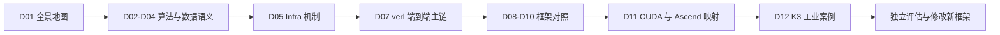

# D00 LLM 后训练前沿源码学习路线

> **阶段**：S00–S05 已完成，本文为综合验收版
> **文档编号**：D00
> **快照日期**：2026-07-28
> **适用目标**：理解 Reasoning RL、Agentic/Coding RL 的前沿机制，并具备阅读、修改和评估工业级后训练框架的能力
> **阅读导航**：[[03_posttraining/index|上一篇：后训练纵向学习域首页]] · [[posttraining_frontier_map_analysis|下一篇：D01 后训练前沿全景地图]]

---

## 0. 怎样使用这条路线

这不是按天数安排的课程表，而是一条按**可验证能力**推进的路线。推荐顺序是 D00 → D12，但不要求把每篇文档逐字记忆。每读完一段，应能完成对应的图、公式、源码定位或设计判断；做不到，就回到前置文档补齐。

整条路线遵循三个原则：

1. **算法与系统一起学**：loss 的统计假设必须与 rollout 数据实际怎样生成、缓存和消费对应。
2. **先建立主链，再比较变体**：先用 verl 贯通一次端到端迭代，再用 slime、AReaL、ROLL 比较不同设计赌注。
3. **先解释 CUDA 基线，再判断 Ascend 适配**：不把“能安装”误当成训练闭环、性能和正确性已经等价。

推荐的最短闭环是：



---

## 1. D00 → D12 推荐阅读顺序

“读完后任务”是进入下一篇前的验收，不只是复述摘要。

| 顺序 | 文档 | 阶段 | 学习问题 | 前置知识 | 读完后应能完成的任务 | 状态 |
|---:|---|---|---|---|---|---|
| 1 | D00 本文 | S00/S05 | 整个研究域怎样组织，什么算真正掌握 | PyTorch 基础；LLM 训练/推理常识 | 根据自己的薄弱点标出阅读路径和验收物 | 已完成 |
| 2 | D01 [[posttraining_frontier_map_analysis|后训练前沿全景地图]] | S00 | 当前前沿为什么同时是算法、在线数据和系统问题 | D00 | 画出五层闭环，并把一个新工作定位到算法/数据/系统/硬件层 | 已完成 |
| 3 | D02 [[reasoning_rl_algorithm_evolution_analysis|Reasoning RL 算法演进]] | S01 | GRPO、DAPO、GSPO 等方法改变了哪个估计量、clip 或采样假设 | policy gradient、KL、importance sampling | 从公式推导 loss 所需字段，并指出它对 rollout batch 的要求 | 已完成 |
| 4 | D03 [[agentic_rl_algorithm_analysis|Agentic RL 算法与环境]] | S01 | 多轮工具调用和 coding task 怎样改变 trajectory、reward 与 credit | D02；MDP/trajectory 基础 | 为一个 coding agent 定义 trajectory schema、reward 时点和失败处理 | 已完成 |
| 5 | D04 [[on_policy_off_policy_staleness_analysis|On-policy、Off-policy 与 Staleness]] | S01 | policy lag、importance ratio 与 train–inference mismatch 怎样相互作用 | D02、D03；概率比 | 给出样本版本规则，判断一个异步方案在什么意义下偏离 on-policy | 已完成 |
| 6 | D05 [[03_posttraining/05_posttraining_infra_mechanism_analysis|后训练 Infra 核心机制]] | S01 | control/data/weight 三平面怎样协同，bubble、backpressure 和故障怎样产生 | D04；分布式通信基础 | 画出一次迭代的消息时序并标明数据、权重和状态的 owner | 已完成 |
| 7 | D06 [[03_posttraining/06_framework_comparison|工业后训练框架对比]] | S02/S05 | 怎样用统一术语比较 verl、slime、AReaL、ROLL | D05 | 不依赖 README 口径，完成一张机制与证据等级对比表 | 已完成 |
| 8 | D07 [[03_posttraining/07_verl_end_to_end_iteration_analysis|verl 端到端训练迭代]] | S02 | 一批 prompt 怎样穿过 rollout、reward、advantage、update 与权重刷新 | D06；Ray；FSDP/Megatron 基础 | 从配置/入口追到关键类与函数，并指出扩展 loss 或 rollout 的位置 | 已完成 |
| 9 | D08 [[slime_architecture_analysis|slime 高性能与异步架构]] | S03 | Megatron、SGLang、DataSource、buffer 和 async producer 怎样组合 | D07 | 对照 verl 解释 slime 的吞吐来源及其 freshness/correctness 代价 | 已完成 |
| 10 | D09 [[areal_async_architecture_analysis|AReaL Fully Async 与 Agentic 架构]] | S03 | 服务化 training/inference/agent/weight update 如何维持在线 RL 闭环 | D08 | 定位 staleness 控制、agent trajectory 和 weight service 的所有权边界 | 已完成 |
| 11 | D10 [[roll_strategy_and_ascend_analysis|ROLL Strategy、异构与 Ascend]] | S04 | Strategy/AutoDeviceMapping 能屏蔽哪些后端差异，哪些不能 | D09；Ascend 软件栈常识 | 从 CUDA 配置映射到 Ascend，列出需要改动和需要实测的组件 | 已完成 |
| 12 | D11 [[cuda_ascend_posttraining_stack_comparison|CUDA–Ascend 后训练栈对照]] | S04 | 通信、推理、并行、权重同步、kernel 与诊断的差距在哪里 | D10 | 独立评估一个后训练方案的 NPU 可行性、风险和验证矩阵 | 已完成 |
| 13 | D12 [[kimi_k3_posttraining_case_study_analysis\|Kimi K3 后训练案例]] | S05 | 九专家、MOPD、partial rollout、white-box environment、QAT 与百万 token 状态怎样形成一条工业闭环 | D02–D05、D11 | 区分报告事实、机制推导和源码未知项，并画出跨 GPU/CPU/NVMe/sandbox 的状态生命周期 | 已完成 |

### 1.1 如果只想先抓主干

按 `D00 → D01 → D02 → D04 → D05 → D07 → D11 → D12` 阅读。这条短路线先建立：

- optimizer 与样本分布的关系；
- on/off-policy 和 TIM 的正确性边界；
- 一次工业 RL 迭代的真实调用链；
- CUDA 方案迁移到 Ascend 时的判断框架。
- 用一个最新工业报告把算法、trajectory、infra 与部署约束重新对齐。

随后再用 D03、D08、D09、D10 补 Agentic 和多框架源码对照。

---

## 2. 六级能力门槛

### L1：能解释核心数学对象

你应能不依赖框架名回答：

- policy、old/reference policy 分别用于什么；
- reward、return、advantage、KL、entropy、importance ratio 的定义；
- token、sequence、trajectory 和 prompt group 是什么统计单位；
- clip 是在限制什么，为什么 ratio 的来源必须语义一致。

**验收物**：给定一条 response 的 token log-prob、reward 和 mask，写出某个 GRPO/PPO 类 loss 需要的全部张量、shape 和聚合维度。

### L2：能画出一次训练迭代

你应能画出：

```text
prompt → rollout → reward/verifier → advantage
       → policy update → weight publish → next rollout
```

并为每条边标出数据类型、生产者、消费者、同步点和 policy version。

**验收物**：解释长尾 response、慢 verifier 或权重刷新分别在哪里造成 bubble，以及同步和异步方案怎样处理。

### L3：能追踪 verl 主链路

你应能从真实配置和启动入口开始，追踪到：

- controller/trainer 怎样创建角色和资源；
- rollout 怎样生成并返回数据；
- reward 与 advantage 在哪里计算；
- policy loss 和 optimizer step 在哪里发生；
- train layout 怎样转换成 rollout layout。

**验收物**：对固定 commit 给出可复核的 `入口 → 类 → 方法 → 数据结构 → collective/RPC` 路径，并指出修改一个算法所需的最小变更面。

### L4：能比较同步与 Fully Async

你应能区分：

- phase-level overlap、streamed pipeline、partial async、fully async；
- 系统异步、样本 staleness 和算法 off-policy；
- 吞吐提升来自消除 bubble，还是来自允许旧样本；
- group-wise 与 single-rollout 优化对调度的不同约束。

**验收物**：为同一 workload 比较同步、RollPacker 类 freshness-preserving 方案和 AReaL 类 fully async 方案，明确各自的收益来源与风险。

### L5：能分析权重同步与资源布局

你应能回答：

- train 和 rollout 是否 colocate，显存如何切换；
- FSDP/Megatron layout 与推理 TP/EP layout 怎样转换；
- 参数通过 collective、RPC、共享内存还是中间服务传递；
- “新权重可见”在哪个事件上提交；
- 部分 rank 失败或超时后，谁能恢复一致状态。

**验收物**：画出 weight publish 的时序图，列出通信量、额外峰值显存、阻塞点、版本原子性和一致性校验。

### L6：能独立评估新框架与 NPU 适配

你应能不依赖项目宣传完成：

1. 固定仓库 commit、依赖和运行配置；
2. 找到入口、owner、状态、数据与通信；
3. 判断算法语义与训练/rollout 实现是否一致；
4. 区分接口兼容、功能闭环、正确性闭环和性能闭环；
5. 给出 CUDA → Ascend 的适配矩阵和最小验证计划。

**验收物**：针对一个未被 D06 覆盖的新框架，写一份含证据等级、风险、适配工作量和最小实验的评估报告。

---

## 3. 论文阅读方法：不要从摘要开始做结论

每篇论文按下面五问记录：

| 问题 | 要记录什么 | 常见误区 |
|---|---|---|
| 1. Problem | 原方法的具体失败模式；在哪个 workload/假设下发生 | 把“效果更好”当作问题定义 |
| 2. Mechanism | 改了估计量、目标、采样、数据结构还是调度 | 只改写摘要，不写因果链 |
| 3. Evidence | 公式、消融、对照、代码和配置分别支持什么 | 只抄最终 benchmark |
| 4. Alternative | 为什么不采用更直接的同步、重采样、过滤或系统扩容 | 忽略机制可能只是工程折衷 |
| 5. Limitation | 分布假设、规模、硬件、模型、任务和实现边界 | 把作者没有测试解释成“已经支持” |

### 3.1 算法论文的最小笔记模板

```text
优化单位：
behavior / old / reference / current policy：
rollout 时保存的数据：
trainer 重算的数据：
advantage / credit 的粒度：
ratio 与 clip 的粒度：
样本 freshness 假设：
需要的 group / batch 结构：
论文直接证据：
尚未验证的机制推断：
对 infra 的新增要求：
```

### 3.2 系统论文的最小笔记模板

```text
被消除的 bubble：
资源与 role placement：
数据生产者 / 消费者：
buffer 与 backpressure：
weight update 协议：
允许的 staleness：
正确性不变量：
故障与恢复边界：
性能数字的完整配置：
代价转移到了哪里：
```

---

## 4. 源码阅读方法：从 owner 和状态变化出发

不要先全局收集类名。对一个后训练机制，按以下顺序追踪：

1. **入口**：启动命令、配置、main、trainer/controller 的创建点。
2. **Owner**：谁持有 policy、optimizer、rollout engine、buffer、environment 和全局 step。
3. **状态与数据结构**：batch/trajectory schema、model version、worker state、queue item。
4. **调用链**：入口到关键计算之间真实可达的函数跳转。
5. **通信**：RPC、collective、queue、object store、host/device copy 和 barrier。
6. **失败路径**：超时、部分 worker 失败、OOM、坏样本、权重刷新中断怎样处理。

### 4.1 每条调用链必须回答的六个问题

| 问题 | 示例 |
|---|---|
| 谁调用它 | trainer loop、Ray actor、inference service、callback |
| 它读什么状态 | policy version、global step、buffer watermark、device mesh |
| 它产生什么 | trajectory、reward、advantage、gradient、weight snapshot |
| 结果交给谁 | trainer、rollout、reward worker、weight service |
| 哪里同步 | barrier、future、event、queue watermark、collective |
| 失败后怎样 | retry、drop、rollback、restart、重新广播、无公开处理 |

### 4.2 源码证据记录格式

对快速演进项目，至少记录：

```text
Repository:
Branch:
Commit:
Verified date:
Entry/config:
Call chain with file:line:
Key state/schema:
Communication primitive:
Observed test/example:
README–code discrepancy:
Inference vs verified fact:
```

行号会随版本变化，所以 commit 是证据的一部分。升级 baseline 后不得静默沿用旧行号。

---

## 5. 工业实现的四级“支持”口径

看到“支持某后端/算法/硬件”时，先判断它属于哪一级：

| 级别 | 含义 | 最低证据 |
|---|---|---|
| P1 接口存在 | 配置项、类或 adapter 已出现 | 固定 commit 的源码入口 |
| P2 功能可达 | example 能走完目标调用链 | 官方示例、测试或可复现实跑 |
| P3 正确性闭环 | loss、log-prob、权重和结果满足明确不变量 | 数值对照、单测、TIM/weight 验证 |
| P4 性能闭环 | 在目标规模和约束下有稳定收益 | 完整硬件/模型/并行/序列配置与对照 |

只有 README 一句话时，最多先记为“项目方声明”。尤其在 Ascend 适配上，P1 不应被写成 P3/P4。

---

## 6. 学习过程中的实践题

建议在每个阶段留下一个可复用产物：

| 阶段 | 实践题 | 产物 |
|---|---|---|
| S00 | 把一个新论文/框架放进 D01 的五层地图 | 一页定位卡：问题、机制、证据、深挖目标 |
| S01 | 对同一 rollout 写出 token-level 与 sequence-level 更新所需字段 | 公式—张量—数据生产者映射表 |
| S02 | 从 verl 配置追踪一个完整 step | 调用链、时序图和扩展点清单 |
| S03 | 比较 verl/slime/AReaL 处理慢 trajectory 的方式 | freshness–throughput–complexity 权衡表 |
| S04 | 将一个 CUDA 训练/rollout 配置映射到 Ascend | 兼容、缺口、风险、验证用例矩阵 |
| S05 | 独立评估一个新框架、技术报告或 baseline 升级 | 带固定版本、证据等级、未知项和差异结论的审计报告 |

---

## 7. 版本与复习节奏

- D01、D06 以及四个框架专题属于快速变化页面；超过 30 天未核验时标记 staleness。
- 新论文先进入雷达，只有明确改变机制或系统约束、且有一手证据时进入主线。
- 框架升级先比较 commit diff，再复查入口、数据 schema、weight update 和实验配置。
- 若新证据推翻旧结论，保留原结论的版本条件并记录修订原因，不直接抹除历史。
- 本版已用 Kimi K3 Technical Report `0797decb` 完成一次 S05 前沿案例复核；下一次复核触发条件是框架 baseline 升级、K3 训练源码公开或快速变化页面超过 30 天。

---

## 8. 最小源码路径与终局验收

按顺序完成整套材料后，至少应能独立复现以下路径：

| 能力 | 最小阅读路径 | 最终验收 |
|---|---|---|
| 算法 | D02 → D04 | 从公式推导 batch schema、ratio provenance 与 freshness 假设 |
| Agentic | D03 → D05 | 定义 per-call version、reward event、sandbox failure 和 credit |
| verl | D06 → D07 | 从 `main_ppo.py` 追到 `RayPPOTrainer.fit`、actor update 与 weight refresh |
| slime | D08 | 从 `train.py` 追到 DataSource、Megatron actor、SGLang 和 updater |
| AReaL | D09 | 从 PPOTrainer 追到 workflow、staleness admission 与 v2 weight gateway |
| ROLL | D10 | 从 RLVR/Agentic pipeline 追到 Strategy、device mapping 与 NPU platform |
| 硬件 | D11 | 给出 CUDA→Ascend 的 M1–M4 迁移与实验 gate |
| 综合案例 | D12 | 把专家 RL、MOPD、partial rollout、environment、QAT 和 1M 状态管理映射回 D02–D05/D11，并标出源码未知项 |

真正完成不是“能说出框架特点”，而是能对一个新框架产出固定版本、真实调用链、正确性不变量、性能条件和硬件适配矩阵。

---

## Related Pages

- [[posttraining_frontier_map_analysis|D01 后训练前沿全景地图]]
- [[kimi_k3_posttraining_case_study_analysis|D12 Kimi K3 后训练案例]]
- [[01_theory/04_posttraining/index|旧后训练理论入口]]
- [[02_engineering/04_posttrain_frameworks/index|旧后训练框架入口]]
- [[02_engineering/04_posttrain_frameworks/verl/index|verl 既有分析索引]]
- [[02_engineering/04_posttrain_frameworks/rl_infra_efficiency_analysis|RL Infra 效率分析]]
- [[02_engineering/04_posttrain_frameworks/rl_sandbox_design_analysis|RL Sandbox 设计]]
