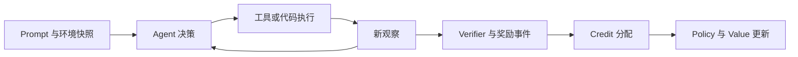

# D03 Agentic RL 算法与环境

> **阶段**：S01
> **文档编号**：D03
> **快照日期**：2026-07-28
> **证据基线**：固定 arXiv 版本与四框架 S00 commit，完整台账见 `docs/research/2026-07-27-posttraining-source-ledger.md`
> **结论先行**：Agentic RL 的主要变化不是“多轮 prompt”，而是 policy action、环境状态、credit、版本和失败恢复不再与单条 token 序列天然对齐。
> **阅读导航**：[[03_posttraining/02_reasoning_rl_algorithm_evolution_analysis|上一篇 D02]] · [[03_posttraining/04_on_policy_off_policy_staleness_analysis|下一篇 D04]]

---

## 1. 五层数据单位

| 层级 | 定义 | 典型 owner | 不能丢的字段 |
|---|---|---|---|
| episode | 从任务 reset 到终止 | environment manager | env seed、终止原因、总 reward |
| trajectory | 一个 policy 与环境的完整交互记录 | rollout/agent service | policy versions、所有 turn、reward events |
| turn | 一次 observation 到下一次 observation | agent runtime | messages、tool call、tool result、latency |
| action | 一次 LLM call、tool call 或外部操作 | policy/proxy/tool | action type、arguments、mask、completion id |
| token | policy LLM 生成的训练原子 | inference engine/trainer | token id、log-prob、loss mask、engine |

不能把所有环境文本直接拼接后假设它们都是 policy action。tool result、编译日志和用户 observation 通常应进入 context，但不进入 policy loss。

## 2. 最小 trajectory schema

```text
episode_id, trajectory_id, prompt_id, group_id
env_name, env_version, env_seed, reset_snapshot
harness_config_hash, tool_schema_hash, history_mode
policy_version_start, policy_version_per_call
turns:
  observation
  llm_input_tokens
  llm_output_tokens
  rollout_log_probs
  loss_mask
  tool_name, tool_args, tool_result
  completion_id, start_time, end_time
reward_events:
  source, target_turn, value, timestamp, verifier_version
terminal_reason, timeout_stage, retry_count
artifacts: patch, test_log, sandbox_snapshot, kv_continuation
```

`policy_version_per_call` 是必要字段：fully async 下，一条 trajectory 可能跨多次 weight refresh。把整条 trajectory 只标一个版本会掩盖 partial rollout。

K3 还说明 `history_mode` 不是展示层元数据：XTML 的 thinking mode 会把历史 `think` channel 始终保留，哪怕内容为空。删除 thinking history 会改变下一次 LLM call 的 observation，应与 tool result 一样进入可重放 trajectory contract（Kimi K3 Technical Report Appendix F，pp.46–47；详见 [[03_posttraining/12_kimi_k3_posttraining_case_study_analysis|D12]]）。

## 3. Agentic 闭环



### 3.1 Reward 的时点

- **Outcome reward**：任务终止后判定，例如测试全过、数学答案正确。
- **Process reward**：在 turn/step 上判定，例如检索结果有效、工具参数合法。
- **Cost reward**：token、wall time、工具调用、容器成本。
- **Safety reward**：越权、网络、文件系统或 secret 访问。

它们不能简单相加而不记录组成。否则 reward hacking 发生后无法判断是 verifier、成本权重还是环境漏洞。

### 3.2 Credit 的粒度

把 episode return \(R\) 广播到所有 policy token 是最简单 baseline：

\[
A_{k,t}=R-b(x)
\]

但它会把早期探索、错误工具调用、纠错 turn 和最终答案视为同等因果贡献。

[Agent Lightning v1](https://arxiv.org/abs/2508.03680v1) §3.2–3.3 把 agent execution 表示为 MDP 数据接口，再用 hierarchical credit module 把 trajectory return 分配到每次 LLM invocation。关键价值是 agent 与 trainer 解耦，而不是声称某个固定 credit rule 已解决所有长程归因。

[RAGEN v2](https://arxiv.org/abs/2504.20073v2) §3–4 则表明，长轨迹训练还会出现 Echo Trap 等退化；trajectory filtering、critic 与 gradient stabilization 是一个联合稳定性问题。

## 4. Group barrier 与 single-rollout

Agentic workload 的完成时间重尾：一个 trajectory 可能 30 秒结束，另一个需要十几分钟和多个 sandbox。若 advantage 依赖同 prompt 的 \(G\) 个样本，最快的 \(G-1\) 个也必须等最后一个。

有三种不同解法：

| 解法 | 保留什么 | 牺牲什么 | 适合 |
|---|---|---|---|
| tail packing | 保留同步 freshness 和 group 统计 | 增加调度复杂度 | 同构任务、可预估长度 |
| partial/streamed group | 更早消费完成样本 | 需要定义 group 完成和补样 | 大规模生成 |
| single-rollout | 取消 group barrier | 需要 critic/其他 baseline | 在线 agent、独一环境反馈 |

[SAO v1](https://arxiv.org/abs/2607.07508v1) §3 选择第三条：单 rollout、value model、双侧 token mask。它说明 Agentic RL 会反向改变 optimizer，但不意味着所有 agent 任务都应放弃 group comparison。

K3 选择第二条的一个具体版本：\(N\times K\) 活跃轨迹完成到 \(\lambda NK\) 后暂停其余长尾，下轮优先恢复；但同一 prompt 的 \(K\) 条 response 仍需全部完成后才送优化。因此 partial rollout 解决全局 phase 的 straggler，不取消 \(K\)-response completion/dispatch boundary，也不等同 fully async；报告没有据此公开所有任务的 advantage estimator（Kimi K3 Technical Report §4.1.2，p.13）。

## 5. Coding RL 的额外状态

代码任务的 reward 不是一个纯函数 `answer -> score`。至少依赖：

- repository commit 与初始工作树；
- build/test image、依赖缓存和网络策略；
- patch application 是否成功；
- 测试集合与 hidden tests 版本；
- timeout、OOM、进程泄漏和磁盘配额；
- grader 是否被模型输出污染。

三个固定源码例子展示了这一点：

- slime `examples/coding_agent_rl/swe.py:151-364` 分开 evaluability、workspace、patch 与 evaluator；
- AReaL `examples/sandbox_daytona/reward_example.py:11` 把代码执行封装为 grader；
- ROLL `roll/pipeline/rlvr/rewards/code_sandbox_reward_worker.py` 把 sandbox reward 作为独立 worker。

因此 sandbox 是训练数据面的一部分，不只是安全外围设施。

## 6. Agent runtime 与 trainer 的边界

理想边界是可重放的 trajectory contract：

| Agent runtime 负责 | Trainer 负责 |
|---|---|
| 会话、工具、环境、超时、重试 | token mask、log-prob、advantage、loss |
| 记录每次 LLM call 的 token 与版本 | 检查 behavior/old/current policy |
| 产生 reward event 与 artifact | credit 分配、clip、optimizer step |
| 保证环境隔离和幂等 | batch、parallel、weight publish |

AReaL 当前代码用 `RolloutWorkflow`、`WorkflowExecutor` 和 v2 agent service protocol 表达这条边界：`areal/infra/workflow_executor.py:263,747` 与 `areal/v2/agent_service/protocol.py:29-318`。ROLL 用多种 env manager、tool 与 proxy 适配不同交互语义；slime 则把 custom rollout function 接入同一 DataSource/rollout 路径。

### 6.1 Harness configuration 也是环境状态

K3 的 unified white-box environment 把 tools、system prompt、context management、skills、memories、subagents 拆成可组合模块，并在 RL 中动态构造 Kimi Code、Claude Code、Codex、OpenClaw、Hermes 等不同 harness。目标是避免 policy 只记住一个 tool schema、prompt 或 context protocol（Kimi K3 Technical Report §4.2.1，pp.14–15）。

因此 `env_version` 至少应展开为：

```text
task_source_version
harness_config_hash
tool_schema and tool_runtime_version
system_prompt_hash
context_management_policy
memory and subagent configuration
verifier_public_version and hidden_version
```

K3 的 AET 还把初始状态、受约束目标、工具空间、execution budget 和独立 verifier 作为任务定义，不提供参考轨迹；reward 由最终环境状态决定，并用 public/hidden verifiers 与提交预算抑制 hacking（Kimi K3 Technical Report §4.2.6，p.16）。

## 7. 失败不是一个布尔值

建议至少区分：

```text
MODEL_STOP
ENV_TERMINAL
VERIFIER_FAIL
TOOL_TIMEOUT
SANDBOX_CRASH
INFRA_RETRYABLE
POLICY_VERSION_EXPIRED
MAX_TURNS
MAX_TOKENS
```

训练策略也应分开：

- 作为负 reward；
- 从 estimator 丢弃；
- 回收到 buffer 重试；
- 保留已完成 prefix，继续 partial rollout；
- 标记 infra failure，不污染 reward。

slime 的 fully async worker 会把 aborted group 重新加入 data buffer，而不是直接送训：`slime/rollout/fully_async_rollout.py:178-189`。这是一种清晰的失败语义，但 README 也说明续跑未完全接线，当前是整条重启。

K3 展示了更完整的恢复目标：暂停 rollout 时既要保存模型侧 KV/KDA state，也要保存环境侧 microVM state。AgentENV 的 Pause/Resume 释放等待 inference 时的环境资源，Fork 为无副作用 reward judging 派生同状态副本，Snapshot 用于错误恢复（Kimi K3 Technical Report §5.3.1–5.3.2，pp.21–22）。这三种操作分别对应“续跑”“旁路判分”和“故障恢复”，不应压成一个 `sandbox_snapshot` 布尔值。

## 8. 验收清单

一个工业 Agentic RL 方案至少要回答：

1. 哪些 token 是 policy action，mask 谁生成、谁验证？
2. trajectory 中每次 LLM call 是否保存真实 policy version？
3. reward 是何时产生，如何绑定 turn/completion？
4. 环境是否可复现，失败是否与任务失败分离？
5. group、single-rollout 或 critic 的选择如何改变 estimator？
6. 长尾是通过打包、流式还是旧样本解决？
7. sandbox artifact、日志和成本是否进入可观测性？
8. harness config、thinking history 和动态 tool declaration 是否能完整重放？
9. Pause、Fork、Snapshot 是否区分，并且与 KV continuation 使用同一 trajectory id？

## Related Pages

- [[03_posttraining/02_reasoning_rl_algorithm_evolution_analysis|D02 Reasoning RL 算法演进]]
- [[03_posttraining/04_on_policy_off_policy_staleness_analysis|D04 On-policy、Off-policy 与 Staleness]]
- [[03_posttraining/05_posttraining_infra_mechanism_analysis|D05 后训练 Infra 核心机制]]
- [[03_posttraining/12_kimi_k3_posttraining_case_study_analysis|D12 Kimi K3 后训练案例]]
- [[02_engineering/04_posttrain_frameworks/rl_sandbox_design_analysis|既有 RL Sandbox 设计]]
