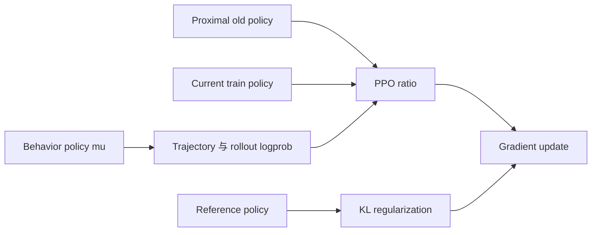

# D04 On-policy、Off-policy 与 Staleness

> **阶段**：S01
> **文档编号**：D04
> **快照日期**：2026-07-27
> **证据基线**：固定 arXiv 版本与四框架 S00 commit，完整台账见 `docs/research/2026-07-27-posttraining-source-ledger.md`
> **结论先行**：异步是执行结构，staleness 是版本年龄，off-policy 是分布关系，TIM 是同参数下的实现差异；四者相关但绝不等价。
> **阅读导航**：[[03_posttraining/03_agentic_rl_algorithm_analysis|上一篇 D03]] · [[03_posttraining/05_posttraining_infra_mechanism_analysis|下一篇 D05]]

---

## 1. 四个概念必须拆开

| 概念 | 可测定义 | 常见错误 |
|---|---|---|
| system async | generation、reward、training 是否并发 | “并发就一定 off-policy” |
| policy lag | 当前 update 与生成样本版本之差 | 只记录 wall-clock age |
| off-policy | 训练期望分布与 behavior 分布不同 | 把版本相同当成分布相同 |
| TIM | 同参数在 rollout 与 train engine 的 token 概率不同 | 把它归因于 staleness |

同步系统也可能因 TIM 而 off-policy；异步系统也可以通过 version bound、重算/校正与尾部打包把偏差控制在明确范围。

## 2. 四个 policy



\[
r_{\text{ppo}}=\frac{\pi_\theta}{\pi_{\text{old}}},
\qquad
w_{\text{beh}}=\frac{\pi_{\text{old}}}{\mu},
\qquad
\frac{\pi_\theta}{\mu}=r_{\text{ppo}}w_{\text{beh}}.
\]

把分母写成 `old_log_prob` 并不能证明它来自 behavior。必须知道它是 rollout 保存、trainer 重算，还是某个历史 checkpoint 前向得到。

## 3. 三种年龄

建议同时记录：

\[
\Delta_v=v_{\text{train}}-v_{\text{sample}},
\quad
\Delta_u=\text{optimizer updates since sampling},
\quad
\Delta_t=t_{\text{consume}}-t_{\text{generate}}.
\]

- version distance 适合控制 policy lag；
- update count 能识别一个 version 内多次 minibatch update；
- wall-clock age 能暴露慢 environment/verifier，但不等价于参数变化。

Agentic partial rollout 还需 `version_per_call`，因为一条 trajectory 内可能有多个 \(\mu_k\)。

## 4. Freshness 的系统设计点

| 方案 | barrier | 允许旧样本 | 优点 | 主要代价 |
|---|---|---:|---|---|
| 严格同步 batch | 全 batch | 0 step | 语义最清楚 | 长尾 bubble |
| tail packing | 重排尾部 | 0 step | 保 freshness，削减 straggler | packing 与公平性 |
| streamed bounded | watermark/窗口 | 小于阈值 | overlap 高 | buffer 与回压复杂 |
| fully async | 无全局 phase barrier | 配置上限 | 利用率高，适合 agent | correction、版本和恢复更难 |

[RollPacker v1](https://arxiv.org/abs/2509.21009v1) §3–4 的价值是说明“解决 rollout 长尾”不必自动接受 stale data；[AReaL v5](https://arxiv.org/abs/2505.24298v5) 则探索 bounded fully async 的另一端。

## 5. AReaL 的可执行 freshness 公式

AReaL 固定快照 `areal/infra/staleness_manager.py:20-112` 同时限制并发与可排队样本：

```text
concurrency_capacity = max_concurrent_rollouts - running
staleness_capacity =
  max_staleness + current_version + 1
  multiplied by consumer_batch_size
  minus accepted and running
available = min of both capacities
```

这不是单个样本的 rejection rule，而是**生产侧 admission control**。checkpoint 恢复时版本跳变若不修正 accepted counter，会突然放大容量；源码 `115-131` 专门处理这一点。

AReaL 文档还显式区分：

\[
\frac{\pi_{\text{proximal}}}{\pi_{\text{behave}}}
\quad\text{和}\quad
\frac{\pi_\theta}{\pi_{\text{proximal}}},
\]

见 `docs/en/best_practices/algo_perf.md:54-81`。这比只打印一个 `importance_ratio` 更易诊断。

## 6. Correction 方案

| 方法 | 作用位置 | 能处理 | 不能保证 |
|---|---|---|---|
| token IS | 每 token 乘 \(\pi_{\text{old}}/\mu\) | behavior lag/TIM 的局部偏差 | 长序列方差可控 |
| truncated IS | 对 correction weight 截断 | 限制极端梯度 | 无偏 |
| token rejection | mask 高 mismatch token | 局部异常 | 保留完整学习信号 |
| sequence rejection | 丢整条高 mismatch response | 累积偏差 | 不浪费昂贵 trajectory |
| version bound | admission/drop | 参数版本 lag | 同版本 TIM |
| LR/update control | optimizer | mismatch 放大后的动态不稳 | 消除根因 |
| exact rollout | 系统实现 | 同参数 train/rollout 差异 | 异步版本 lag |

verl 固定快照已实现 rollout correction helper：`verl/trainer/ppo/rollout_corr_helper.py:554-601` 包含 raw weight、sequence expansion、clipping 和 rejection mask；policy loss 调用在 `core_algos.py:1357-1358` 等处。它是可配置工具箱，不意味着默认组合在目标 workload 上已校准。

## 7. TIM：同一 checkpoint 也可能是两个 policy

[Diagnosing TIM v1](https://arxiv.org/abs/2605.14220v1) §3.1 用 VeXact 统一模型与 kernel，并使用 batch-invariant kernel 建立零 mismatch 对照；§3.2 与 Fig. 2 显示，小 token 概率差在对照实验中即可独立触发不稳定。§4.1 还区分：

- **recompute**：trainer 用自己的 kernel 重算 old log-prob；
- **bypass**：直接使用 rollout log-prob；
- 两者都可能以不同路径改变有效 ratio。

§4.2 表明 token+sequence correction 可逼近 exact baseline，但需要阈值且会丢学习信号，不能替代 exact diagnostic。

[Beyond Precision v1](https://arxiv.org/abs/2602.01826v1) §3、§4.1–4.4 进一步指出 mismatch 与 response-length surge、gradient noise、update size 动态耦合；LR scheduler 与 IS 不是互相替代的修补。

## 8. inference policy 才是部署对象

[MIPI/MIPU v1](https://arxiv.org/abs/2606.29526v1) §4.1 把同参数下的 trainer policy \(\pi\) 与 inference policy \(\mu\) 分开，并提出两步：

1. 以 sampler-referenced correction 构造 candidate train policy；
2. 同步到 inference engine 后，用 inference-side proxy 决定接受或回滚。

这是一个重要前沿方向，但当前证据集中在 moderate-scale、FP8-quantized rollout；不能直接视为所有工业管线的成熟默认项。

## 9. 正确性不变量

每个样本进入 optimizer 前应检查：

```text
policy_version and engine_build are present
sampling_config_hash is stable
rollout_log_probs align with response tokens
old_log_probs have declared provenance
ratio is computed against the intended denominator
staleness is within configured bound
token and sequence rejection reasons are logged
weight publish commits atomically before new-version rollout
```

至少监控：

- \(\Delta_v,\Delta_u,\Delta_t\) 分布；
- token/sequence ratio 的均值、分位数与 clip/reject fraction；
- rollout-vs-train log-prob 差；
- response length、entropy、gradient norm 的联动；
- stale drop 成本和环境完成时间。

## 10. 判断一套“异步 RL”是否可信

1. 它是否给出 behavior、old、current、reference 的真实来源？
2. 是通过 overlap 提升吞吐，还是通过无限消费旧数据？
3. freshness bound 在 producer、buffer 还是 trainer 执行？
4. weight version 何时提交，in-flight request 怎样归属？
5. TIM 与 version lag 是否分别度量？
6. correction 的 bias/variance 和丢样成本是否可观测？
7. checkpoint 恢复后 version、queue watermark 和 optimizer 是否一致？

## Related Pages

- [[03_posttraining/02_reasoning_rl_algorithm_evolution_analysis|D02 Reasoning RL 算法演进]]
- [[03_posttraining/03_agentic_rl_algorithm_analysis|D03 Agentic RL 算法与环境]]
- [[03_posttraining/05_posttraining_infra_mechanism_analysis|D05 后训练 Infra 核心机制]]
- [[02_engineering/04_posttrain_frameworks/rl_infra_efficiency_analysis|既有 RL Infra 效率分析]]
