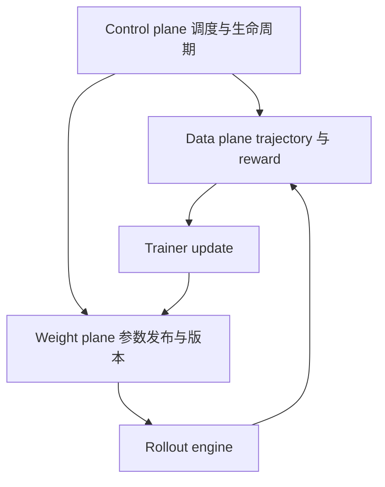

# D05 后训练 Infra 核心机制

> **阶段**：S01
> **文档编号**：D05
> **快照日期**：2026-07-27
> **证据基线**：四框架 S00 commit 与 Async/Freshness 固定论文版本，完整台账见 `docs/research/2026-07-27-posttraining-source-ledger.md`
> **结论先行**：工业 RL infra 的最小完整模型不是 actor/rollout 两个进程，而是 control、data、weight 三个平面，加上一组跨平面的版本提交与恢复不变量。
> **阅读导航**：[[03_posttraining/04_on_policy_off_policy_staleness_analysis|上一篇 D04]] · [[03_posttraining/06_framework_comparison|下一篇 D06]]

---

## 1. 三平面模型



### 1.1 Control plane

负责：

- role 与 resource placement；
- global step、phase、pause/resume；
- workflow、retry、timeout、health check；
- checkpoint、故障恢复和实验配置。

### 1.2 Data plane

承载：

- prompt、group、trajectory、token 和 mask；
- rollout log-prob、reward event、advantage；
- buffer、queue、object store、backpressure；
- sandbox artifact 和 verifier 结果。

### 1.3 Weight plane

负责：

- train layout 到 inference layout 的转换；
- full/delta/LoRA 参数传输；
- collective、P2P、共享内存或 disk transport；
- version commit、cache invalidate 与 in-flight request 归属。

三个平面可以由同一进程实现，但不能在设计上混为一谈。比如 `generate()` 返回不代表权重已经刷新；checkpoint 成功也不代表 buffer 与 policy version 可恢复。

## 2. 四种执行结构

| 结构 | generation 与 train | freshness | 主要 bubble | 正确性负担 |
|---|---|---|---|---|
| phase-synchronous | 串行 | 通常 0 step | rollout、reward、weight sync | 低 |
| colocated time-share | 串行但共卡 | 通常 0 step | sleep/wake、reshard | 中 |
| streamed pipeline | 局部 overlap | 有界 | watermark、尾部 | 中高 |
| fully async | 长期并发 | 显式上限 | 降低 phase bubble | 高 |

“async”不能单独作为性能解释。必须指出被消除的是：

- rollout 长尾；
- reward/verifier 等待；
- trainer idle；
- weight sync blocking；
- 还是资源重载。

## 3. Placement 与并行

训练和推理的并行目标不同：

| 维度 | Training 倾向 | Rollout 倾向 | 转换成本 |
|---|---|---|---|
| DP | 扩大全局 batch | 扩大并发请求 | replica 数不一致 |
| TP | 分摊参数与算子 | 满足单模型显存/低延迟 | shard layout |
| PP | 大模型训练 | 推理通常谨慎使用 | bubble 与 stage mapping |
| EP | MoE 吞吐 | MoE serving 路由 | expert placement/routing |
| CP/SP | 长序列训练 | prefill/长 context | sequence shard 与 kernel |

因此 weight sync 不是简单 broadcast。它要把 FSDP/Megatron 的训练分片映射为 vLLM/SGLang 的 TP/EP 参数布局，并处理量化、fused weight 与 MoE expert。

## 4. 数据面的 owner 与 backpressure

一个可恢复的 buffer 至少要知道：

```text
producer role
sample policy version
group and trajectory completeness
consumer reservation
accepted or rejected state
retry count
checkpoint watermark
```

Backpressure 有三层：

1. **并发容量**：同时执行多少 rollout；
2. **staleness 容量**：最多预生成多少未来 batch；
3. **内存容量**：object store、host RAM、NVMe 和 network queue。

只限制 queue 长度会让短样本挤占版本预算；只限制版本会在慢 verifier 下耗尽内存。AReaL 的 `StalenessManager` 同时取 concurrency 和 staleness capacity 的最小值，是一个清楚的参考实现，见 `areal/infra/staleness_manager.py:80-112`。

## 5. Dynamic batching 与 group 语义

continuous batching 优化 inference engine 的 token 调度；dynamic sampling 优化 RL 的有效 group。二者不是同一层：

- inference batch 可以跨 prompt 混排；
- RL group 必须保留 `prompt_id/group_id`；
- sequence 完成后才能确定 finish reason、reward 和有效 token；
- partial rollout 若提前消费，必须定义 credit 与版本边界。

优化长尾的顺序应是：

1. continuous batching 与请求调度；
2. length-aware packing；
3. verifier 并发与缓存；
4. bounded streaming；
5. 最后才是接受更旧样本。

## 6. Weight publish 协议

推荐把一次刷新视为事务：

```text
PREPARE version v plus one
  freeze or snapshot train parameters
  convert and partition
TRANSFER
  send every shard with checksum
INSTALL
  inference workers load into inactive slot
COMMIT
  all workers atomically expose new version
RETIRE
  finish or abort requests pinned to old version
```

关键指标：

- 参数字节数与额外峰值显存；
- conversion、transfer、install、cache rebuild 时间；
- first/last rank commit 差；
- failed shard 与 retry；
- old/new version 同时驻留时间。

slime 展示 full NCCL、tensor、disk 和 disk delta 的多 transport；AReaL v2 把 training/inference pair 和 version 交给 weight-update gateway；ROLL 用 `ModelUpdateGroup` 连接 source/target cluster；verl stable path 则由 trainer 调 worker/rollout update。

## 7. Reward、Environment 与 Sandbox

应把 reward worker 当作可版本化服务：

```text
reward = f
  trajectory artifact
  verifier image and code version
  reference data version
  timeout policy
  normalization config
```

需要防：

- verifier 与训练共享可写目录；
- model output 注入 grader；
- retry 造成重复 side effect；
- hidden test 泄漏；
- 环境失败被计为负 reward；
- slow reward 把 buffer 推向 stale。

## 8. Checkpoint 与恢复

一个完整 checkpoint 不只有 model/optimizer：

| 状态 | 不保存的后果 |
|---|---|
| policy/version counter | 恢复后 freshness 容量失真 |
| optimizer/lr scheduler | 学习动力学改变 |
| dataloader/prompt cursor | 重复或漏样 |
| buffer watermark/reservation | 重复训练或丢 trajectory |
| reward/verifier version | reward 不可复现 |
| weight publish state | inference 看到混合版本 |
| RNG 与 sampling config | group 对照不可复现 |

不必把所有 in-flight 请求持久化，但必须定义恢复时 drop、replay 或 resume。

## 9. 故障域

| 故障 | 识别 | 安全动作 |
|---|---|---|
| rollout engine 崩溃 | health probe、request lease | 重试并保留原版本 |
| reward 超时 | stage-specific timeout | 标 infra failure，不直接负奖 |
| trainer OOM | step transaction | 不发布半更新权重 |
| weight shard 失败 | checksum 与 all-rank ack | 不 commit 新版本 |
| object store 压力 | queue bytes/watermark | producer backpressure |
| sandbox 泄漏 | namespace/process monitor | 销毁环境并隔离 artifact |

## 10. 可观测性最小集

- 每阶段 latency、GPU/NPU utilization、bubble；
- token throughput 与 completed trajectory throughput；
- queue items、bytes、age、version distance；
- response length、finish reason、reward component；
- rollout/train log-prob mismatch；
- update/clip/reject/entropy/gradient norm；
- weight conversion/transfer/install/commit；
- retry、drop、timeout 与恢复原因。

性能优化必须和正确性指标同图观察，否则“吞吐上升”可能只是允许更多旧样本或丢弃更多难样本。

## 11. 工业设计评审模板

1. 画 control/data/weight 三平面，标 owner。
2. 写清从 prompt 到 next-version rollout 的 commit event。
3. 列出 group、trajectory、token 的 schema 与 invariant。
4. 给出 freshness admission、drop 和 correction 规则。
5. 给出 train-to-inference layout 及通信量。
6. 设计故障注入：rollout crash、reward timeout、weight partial failure、checkpoint restore。
7. 先在 exact/synchronous baseline 验正确性，再引入 overlap。

## Related Pages

- [[03_posttraining/04_on_policy_off_policy_staleness_analysis|D04 On-policy、Off-policy 与 Staleness]]
- [[03_posttraining/06_framework_comparison|D06 工业后训练框架对比]]
- [[03_posttraining/07_verl_end_to_end_iteration_analysis|D07 verl 端到端训练迭代]]
- [[02_engineering/04_posttrain_frameworks/rl_infra_efficiency_analysis|既有 RL Infra 效率分析]]
