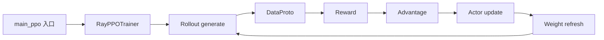

# D07 verl 端到端训练迭代

> **阶段**：S02
> **文档编号**：D07
> **源码基线**：verl `983cb0f24443f87b3d161fad318445130a620b07`
> **核验日期**：2026-07-27
> **结论先行**：学习 verl 应先贯通 stable `RayPPOTrainer.fit` 的同步主链，再单独研究 experimental fully async；不要把两条路径拼成一个不存在的调用链。
> **阅读导航**：[[03_posttraining/06_framework_comparison|上一篇 D06]] · [[03_posttraining/08_slime_architecture_analysis|下一篇 D08]]

---

## 1. 稳定主链地图



固定源码入口：

- [`verl/trainer/main_ppo.py:34-168`](https://github.com/verl-project/verl/blob/983cb0f24443f87b3d161fad318445130a620b07/verl/trainer/main_ppo.py#L34-L168)：Hydra main、Ray task 和 `run_ppo`；
- [`verl/trainer/ppo/ray_trainer.py:286`](https://github.com/verl-project/verl/blob/983cb0f24443f87b3d161fad318445130a620b07/verl/trainer/ppo/ray_trainer.py#L286)：`RayPPOTrainer`；
- `verl/trainer/ppo/ray_trainer.py:772`：初始化 workers；
- `verl/trainer/ppo/ray_trainer.py:1380`：`fit` 主循环。

## 2. 启动与角色创建

`verl/trainer/main_ppo.py` 的职责是：

1. 读取 Hydra 配置；
2. 初始化 Ray；
3. 在 remote task 内构造 tokenizer、reward manager、role worker mapping 与 resource pools；
4. 创建 trainer，调用 `init_workers()` 后进入 `fit()`。

角色抽象让 actor/rollout、critic、reference、reward model 可以映射到不同 worker 类与资源池。真正的 placement、并行与后端细节在 worker，而 trainer 主要编排数据依赖。

阅读时先回答：

```text
role name
worker implementation
resource pool
colocate or disaggregate
training backend
rollout backend
```

## 3. DataProto 是跨 role 契约

[`verl/protocol.py:318`](https://github.com/verl-project/verl/blob/983cb0f24443f87b3d161fad318445130a620b07/verl/protocol.py#L318) 定义 `DataProto`。常用变换：

- `pop`：`verl/protocol.py:721`；
- `union`：`verl/protocol.py:781`；
- `reorder`：`verl/protocol.py:963`；
- `repeat`：`verl/protocol.py:971`。

它同时装 tensor batch、non-tensor batch 与 meta info。工业修改必须维护：

- batch 第一维一致；
- prompt 重复后 group uid 不丢；
- response mask 与 log-prob shape 对齐；
- reorder 后 reward/advantage 同步重排；
- policy version 和 sampling meta 不被 `pop/union` 丢失。

## 4. 一轮 `fit` 的真实顺序

固定快照中的承重点：

| 阶段 | locator | 读写对象 |
|---|---|---|
| rollout | `verl/trainer/ppo/ray_trainer.py:1488` | prompt batch → response batch |
| reward | rollout 后的 reward manager/model 路径 | token/sequence score |
| advantage | `verl/trainer/ppo/ray_trainer.py:1642` 调 `compute_advantage` | reward、mask、old values |
| actor update | `verl/trainer/ppo/ray_trainer.py:1665`，内部 `_update_actor` 在 `1302` | policy loss、optimizer |
| worker update | `verl/trainer/ppo/ray_trainer.py:1344` 调 `actor_rollout_wg.update_actor` | sharded batch |
| rollout refresh | `verl/trainer/ppo/ray_trainer.py:1690-1691` | 新 actor 参数 → rollout |

抽象时序：

```text
prompt batch
  generate sequences
  attach uid and masks
  compute reward
  compute or attach old and reference log probabilities
  compute advantages
  rebalance and split minibatches
  update actor
  publish new weights to rollout
```

有 critic、reference、reward model、validation 或 async reward 时会插入额外 future，但算法不变量不变。

## 5. Advantage 与 loss

`verl/trainer/ppo/ray_trainer.py:187` 的 `compute_advantage` 根据 estimator 分派。新增 estimator 时应同时确认：

1. group uid/schema；
2. response mask；
3. reward/return 粒度；
4. normalization divisor；
5. distributed aggregate。

policy loss registry 在 `verl/trainer/ppo/core_algos.py`：

| 算法/路径 | locator | 关注点 |
|---|---|---|
| vanilla PPO 类 | `1279-1358` | token ratio、clip、rollout IS |
| GSPO | `1538-1594` | sequence ratio 与 clip |
| SAPO | `1615` 起 | soft gate 语义 |
| CISPO | `2007` 起 | clip importance sampling |
| REINFORCE | `2292-2348` | baseline 与 rollout IS |
| bypass | `2373-2456` | rollout log-prob 与 correction |

新增算法的最小改动通常是 estimator + loss function + config；若改变 group/single-rollout、trajectory schema 或 policy version，就不再是纯 loss 修改，必须改 data/rollout。

## 6. 权重刷新

`RayPPOTrainer` 在 actor update 后触发 rollout weight refresh。worker 承重点：

- [`verl/workers/engine_workers.py:705-725`](https://github.com/verl-project/verl/blob/983cb0f24443f87b3d161fad318445130a620b07/verl/workers/engine_workers.py#L705-L725)：actor update 与 rollout sleep/wake 边界；
- `verl/workers/engine_workers.py:783-787`：调用 rollout `update_weights`；
- [`verl/workers/rollout/vllm_rollout/vllm_rollout.py:271-320`](https://github.com/verl-project/verl/blob/983cb0f24443f87b3d161fad318445130a620b07/verl/workers/rollout/vllm_rollout/vllm_rollout.py#L271-L320)：异步权重接收、bucket、cache reset 和 generation 入口。

`verl/workers/rollout/vllm_rollout/vllm_rollout.py:278` 说明 CUDA IPC 不可用时可 fallback 到 shared memory。它描述传输实现，不等于跨节点任意 layout 自动兼容。

评审 weight refresh 时要找：

```text
trainer update completion
rollout sleep or request drain
weight buckets and transport
all-rank install completion
KV and prefix cache reset
new version visibility
```

## 7. On-policy 与 TIM 接口

verl 的同步 batch barrier 只控制版本时序，不消除 TIM。固定快照提供：

- policy loss 中可选 rollout IS；
- `verl/trainer/ppo/rollout_corr_helper.py:554-601` 的 raw correction weight、sequence expansion、clip、token/sequence rejection；
- bypass 路径直接使用 rollout log-prob。

推荐诊断顺序：

1. 同 checkpoint 比较 rollout/train token log-prob；
2. 区分 recompute 与 bypass；
3. 记录 token 和 sequence mismatch；
4. 再启用 IS/rejection；
5. 和 exact/small baseline 对比，不只看最终 reward。

## 8. Stable 与 experimental fully async

`verl/experimental/fully_async_policy/README.md:64` 把实验架构拆成 rollouter、trainer、message queue 等组件；`verl/experimental/fully_async_policy/fully_async_main.py:25-29,222` 使用独立入口。

边界是：

| stable PPO path | experimental fully async |
|---|---|
| `verl/trainer/main_ppo.py` + `RayPPOTrainer.fit` | `verl/experimental/fully_async_policy/fully_async_main.py` |
| phase-level rollout/update | producer/consumer 长期并发 |
| `DataProto` batch 主导 | message queue/version 主导 |
| 容易建立 correctness baseline | 适合研究 bounded staleness |

不能用 experimental README 解释 stable trainer 的实时行为，也不能以 stable tests 推断 fully async 已达到相同成熟度。

## 9. 修改指南

### 9.1 加新 loss

```text
register loss in core_algos
declare required tensors and masks
add config and validation
unit-test positive and negative advantage branches
test all-reduce divisor and variable response length
```

### 9.2 加新 rollout/agent loop

```text
define trajectory to DataProto conversion
preserve token loss mask and per-call version
separate tool observation from policy tokens
handle timeout and retry without reward pollution
add weight-refresh request-drain semantics
```

### 9.3 加新硬件/后端

```text
worker device and collective
train parallel backend
rollout engine
weight layout conversion
TIM measurement
checkpoint and profiler
```

## 10. 最小验证实验

| 层次 | 实验 | 通过标准 |
|---|---|---|
| 数据 | 2 prompt × 2 response 手工 batch | uid、mask、reward、advantage 对齐 |
| 算法 | tiny model 一步 update | loss/ratio 与独立实现一致 |
| 权重 | update 前后固定 prompt logit | rollout 看到完整新版本 |
| TIM | 同参数跨 train/rollout | mismatch 有基线与阈值 |
| 恢复 | weight refresh 中断 | 不暴露混合版本 |
| 性能 | 固定有效 token 与 freshness | 吞吐提升不靠旧样本/丢样 |

## Related Pages

- [[03_posttraining/06_framework_comparison|D06 工业后训练框架对比]]
- [[03_posttraining/08_slime_architecture_analysis|D08 slime 高性能与异步架构]]
- [[02_engineering/04_posttrain_frameworks/verl/index|既有 verl 分析索引]]
- [[03_posttraining/04_on_policy_off_policy_staleness_analysis|D04 On-policy、Off-policy 与 Staleness]]
