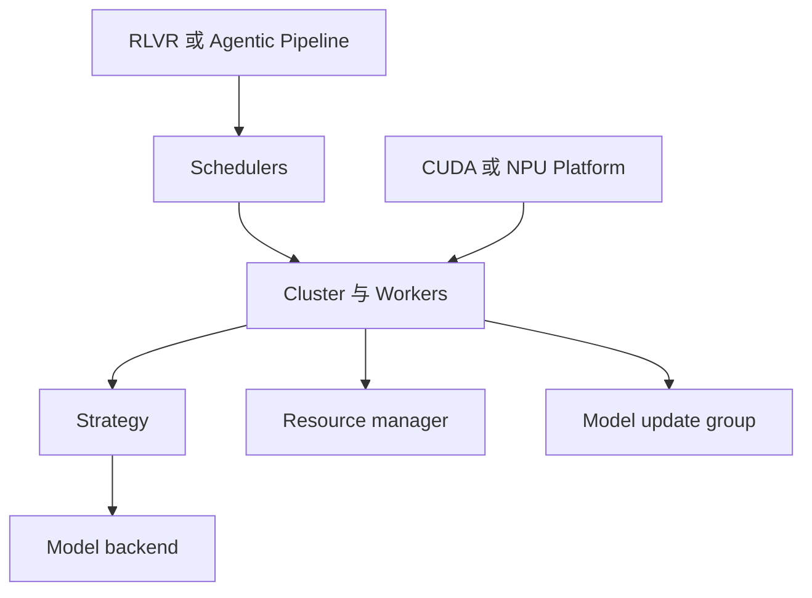

# D10 ROLL Strategy、异构与 Ascend

> **阶段**：S04
> **文档编号**：D10
> **源码基线**：ROLL `370cb24c1036ea9145365478fcc40612b2186fc8`
> **核验日期**：2026-07-27
> **结论先行**：ROLL 的核心抽象是 Pipeline 编排、Cluster 执行、Strategy 后端和显式 device mapping；这能统一控制接口，但硬件与后端的 kernel、dtype、collective 和权重布局仍需要分别验证。
> **阅读导航**：[[03_posttraining/09_areal_async_architecture_analysis|上一篇 D09]] · [[03_posttraining/11_cuda_ascend_posttraining_stack_comparison|下一篇 D11]]

---

## 1. 分层架构



| 层 | 责任 |
|---|---|
| Pipeline | global step、generate、reward、advantage、train、save |
| Scheduler | dynamic sampling、reward routing、remote storage |
| Cluster | worker 生命周期与调用广播 |
| Strategy | forward、generate、train、offload 的后端实现 |
| Platform | device、Ray resource key、memory、runtime env |
| ModelUpdateGroup | train cluster 到 inference cluster 的权重连接 |

## 2. RLVR 主链

[`roll/pipeline/rlvr/rlvr_pipeline.py:121-374`](https://github.com/alibaba/ROLL/blob/370cb24c1036ea9145365478fcc40612b2186fc8/roll/pipeline/rlvr/rlvr_pipeline.py#L121-L374) 初始化：

- dataset 与 tokenizer；
- actor train/infer clusters；
- critic/reference/reward clusters；
- per-domain `DynamicSamplingScheduler`；
- model update pair 与 checkpoint clusters。

`roll/pipeline/rlvr/rlvr_pipeline.py:459` 起的一轮：

```text
optional model update and state offload
generate per domain
concatenate DataProto
reference and old log probabilities
reward postprocess
compute token reward and advantage
apply train-infer corrections
actor and critic train
checkpoint and validation
```

`roll/utils/train_infer_corrections.py` 是 TIM/off-policy correction 的集中入口，阅读时要与 actor loss 的 ratio denominator 一起核对。

## 3. `async_pipeline` 的边界

`roll/pipeline/rlvr/rlvr_pipeline.py:454,477-565` 显式分支：

- async 模式预先 load reward clusters；
- scheduler 可收集 unfinished；
- model update 前 pause sampling；
- generate/reward state 的 onload/offload 顺序不同。

这是一条 pipeline overlap 机制，但仍由 global-step loop 驱动。它不等同 AReaL 的独立 producer admission，也不自动给所有 agent trajectory per-call version。

评估时至少测：

```text
scheduler queue age
unfinished sample recycle
model update frequency
sampling pause duration
global step distance
```

## 4. Agentic 不是 RLVR 的一个 flag

ROLL 有独立：

- `roll/pipeline/agentic/agentic_pipeline.py`；
- `agentic_rollout_pipeline.py`；
- `environment_worker.py`；
- env managers、agent runners、LLM proxy、MCP/tools。

它支持 step、trajectory、proxy/native environment 等不同交互语义。Agentic 数据需要额外的 turn、tool、environment、reward event 和 failure fields，不能只复用单轮 RLVR 的 response tensor。

因此必须分别说明：

- 普通 RLVR async：scheduler/pipeline 层；
- Agentic async：environment/trajectory 层；
- 两者是否共享 version/correction contract：需从目标配置逐条追。

## 5. Strategy 能屏蔽什么

[`roll/distributed/strategy/factory.py:11-28`](https://github.com/alibaba/ROLL/blob/370cb24c1036ea9145365478fcc40612b2186fc8/roll/distributed/strategy/factory.py#L11-L28) 按名称创建 Strategy；固定快照包含：

- HF；
- FSDP2；
- Megatron；
- vLLM；
- SGLang；
- mock。

统一接口覆盖：

- data input；
- log-prob/entropy；
- generate；
- train；
- model update hooks；
- memory offload/onload。

但 Strategy 不能屏蔽：

- fused op 与精度差异；
- TP/EP/CP layout；
- NCCL/HCCL/XCCL 语义和性能；
- vLLM 与 vLLM-Ascend 能力差；
- SGLang 版本 patch；
- checkpoint 格式；
- TIM。

## 6. AutoDeviceMapping 的实际含义

ROLL README 称其为 AutoDeviceMapping，固定源码的核心执行是 `device_mapping`：

[`roll/distributed/scheduler/resource_manager.py:94-142`](https://github.com/alibaba/ROLL/blob/370cb24c1036ea9145365478fcc40612b2186fc8/roll/distributed/scheduler/resource_manager.py#L94-L142) 将全局设备序号切给 worker，并绑定 Ray placement group。

它能表达：

- actor train 与 infer 共卡；
- reward 独占卡；
- 多节点连续 rank；
- disaggregated train/rollout。

`ModelUpdateGroup` 在 `roll/distributed/executor/model_update_group.py:9-37` 连接 source/target cluster，并要求 train/infer device set 连续。这是当前实现约束，不应被“灵活映射”宣传掩盖。

## 7. Weight plane

`ModelUpdateGroup`：

1. 根据 train/infer device 是否重叠决定 colocate 语义；
2. 让 train worker `setup_model_update`；
3. 每到 frequency 触发 `start_model_update`；
4. 等待 worker refs。

SGLang Strategy 的固定源码还暴露：

- init weight update group：`roll/distributed/strategy/sglang_strategy.py:398`；
- distributed update：`401`；
- tensor update：`404`；
- release/resume memory：`407-410`。

端到端验证仍需覆盖 shard conversion、版本提交、cache invalidation 和 partial failure。

## 8. NPU Platform

[`roll/platforms/__init__.py:16-43`](https://github.com/alibaba/ROLL/blob/370cb24c1036ea9145365478fcc40612b2186fc8/roll/platforms/__init__.py#L16-L43) 的检测顺序包含 `torch_npu`；[`roll/platforms/npu.py:11-105`](https://github.com/alibaba/ROLL/blob/370cb24c1036ea9145365478fcc40612b2186fc8/roll/platforms/npu.py#L11-L105) 定义：

- `device_type = npu`；
- Ray resource key `NPU`；
- Ascend visible-device 环境；
- vLLM-Ascend `NPUWorker` 的版本兼容导入；
- runtime env 与 allocator 调整；
- `torch.npu.mem_get_info`。

`roll/distributed/scheduler/protocol.py:230-240,378-386` 在 NPU 上把 tensor `int64` 转成 `int32`，并禁止某些 remote batch 路径。这说明 NPU 适配已经进入数据契约，而不只是设备字符串。

## 9. Ascend 支持等级

| 组件 | 公开证据 | 级别 | 仍需验证 |
|---|---|---|---|
| device detection | 主树源码 | P1 | 多节点 Ray resource |
| vLLM-Ascend worker | 主树导入逻辑 | P1/P2 | 指定版本 E2E |
| DataProto dtype | 主树转换 | P2 | 所有模型输入语义 |
| FSDP2/Megatron train | Strategy 存在 | P1/P2 | torch_npu/MindSpeed 组合 |
| SGLang | ROLL 固定快照的 CUDA Strategy 明确 | 未建立 NPU 专用 Strategy contract | ROLL adapter 与 upstream SGLang NPU 的版本/E2E |
| RLVR example | README/官方 guide | P2 | 模型、规模、曲线 |
| Agentic + NPU | agent 与 NPU 组件分别存在 | 证据不足 | 同一配置 E2E |

## 10. 适配风险

### 10.1 dtype 与动态 shape

NPU 的 `int64 -> int32` 转换可能影响：

- token ids 范围；
- index/gather op；
- mask 与 position ids；
- serialization 后 dtype 恢复。

### 10.2 third-party patch

ROLL 包含多版 vLLM/SGLang patch。工业升级必须建立：

```text
ROLL commit
PyTorch and torch_npu
CANN
vLLM and vLLM-Ascend
SGLang if used
Megatron or FSDP2
driver and firmware
```

### 10.3 collective 与 topology

`device_mapping` 能分配 rank，但不能保证 HCCL 拓扑、跨机 bandwidth、EP all-to-all 或 weight update group 达到 CUDA 等价性能。

## 11. 修改与验证顺序

1. 用 mock/CPU 验 pipeline schema。
2. 单卡 NPU 验 model forward、loss、optimizer。
3. 小 TP/DP 验 collective 与 DataProto dtype。
4. 单机 RLVR 同步闭环。
5. train/rollout weight update 与 TIM。
6. 多节点、async pipeline。
7. 最后叠加 Agentic environment 和 sandbox。

每一步都保留同模型/数据的 CUDA baseline。

## Related Pages

- [[03_posttraining/09_areal_async_architecture_analysis|D09 AReaL Fully Async]]
- [[03_posttraining/11_cuda_ascend_posttraining_stack_comparison|D11 CUDA–Ascend 后训练栈对照]]
- [[03_posttraining/06_framework_comparison|D06 工业后训练框架对比]]
- [[02_engineering/04_posttrain_frameworks/rl_sandbox_design_analysis|既有 RL Sandbox 设计]]
