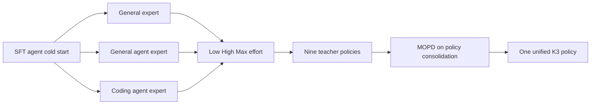
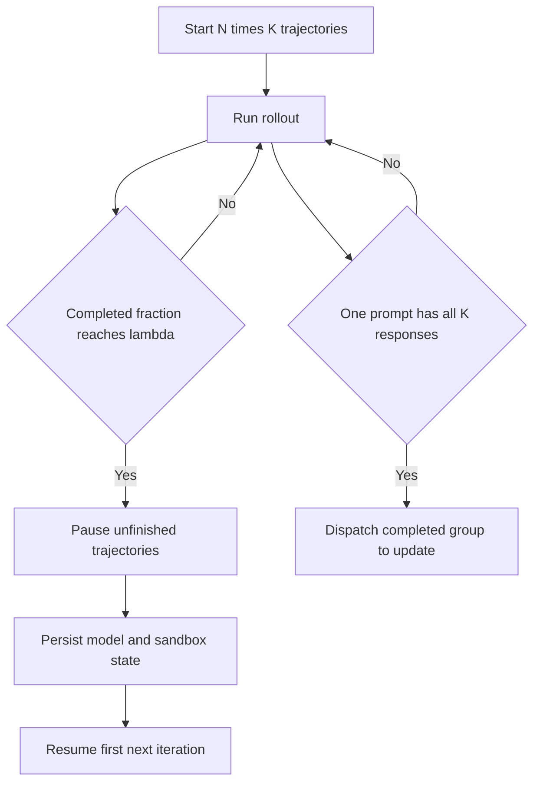

# D12 Kimi K3 后训练案例：九专家分化、在线蒸馏与百万 Token Agentic RL

> **阶段**：S05 前沿案例复核
> **文档编号**：D12
> **快照日期**：2026-07-28
> **来源基线**：MoonshotAI/Kimi-K3 [`0797decb`](https://github.com/MoonshotAI/Kimi-K3/commit/0797decb18ab079de86f991b87a64b81ec15a3c2)，官方报告 47 页，PDF SHA-256 `fd6ee35c07766a5eb6104235f1b407e4329f969e3482b8c42937c7b5f2b3efe1`
> **本地原文**：`raw/01_theory/01_models/moonshot_kimi/Kimi_K3_Technical_Report_2026-07-28.pdf`
> **证据边界**：本文分析官方技术报告中的项目级设计与项目方自报数据；K3 仓库未公开 RL trainer、rollout 或 MOPD 训练源码，不能据此赋予 P1–P4 源码实现等级。
> **结论先行**：K3 的主要增量不是又发明一个 GRPO 变体，而是把“能力分化、在线合并、长轨迹状态管理和部署精度”放进同一条后训练闭环。
> **阅读导航**：[[03_posttraining/11_cuda_ascend_posttraining_stack_comparison|上一篇 D11]] · [[03_posttraining/00_posttraining_source_reading_guide|回到 D00]]

---

## 1. 一条主线：先分化，再合并

K3 的后训练不是让一个 policy 从头同时承担所有任务，而是分三步：

1. SFT 建立 agent cold start；
2. 在三个领域和三个 reasoning-effort 档位上训练九个专家；
3. 用 Multi-Teacher On-Policy Distillation（MOPD）把九个专家重新合并为一个 effort-conditioned student。

这条主线把“专家化带来的训练可控性”与“部署时只服务一个模型”的矛盾放到了显式的能力合并阶段，而不是依赖参数平均或离线重放隐式解决。报告明确给出三阶段范式、三个领域和 `low/high/max` 三档 effort；Figure 8 只展示随 RL FLOPs 增长的趋势，没有提供可可靠抄录的坐标数值（报告 §4.1，pp.12–14；Fig. 8，p.13）。



| 阶段 | 训练对象 | 主要数据或信号 | 解决的问题 | 精确出处 |
|---|---|---|---|---|
| SFT | 单一 cold-start policy | 先前 Kimi 专家合成轨迹、多阶段验证、HITL、XTML | 先学会长程 agent 交互和工具协议 | §4.1.1，p.12 |
| 专家 RL | 3 领域 × 3 effort | 可验证任务、GRM、预算控制、环境反馈 | 让能力和推理成本先在较窄分布上分化 | §4.1.2，pp.12–13 |
| MOPD | 一个统一 student | student 自采样 token 上的教师 dense reward | 合并九个专家，避免部署九套独立 policy | §4.1.3、Eq. 15，pp.13–14 |
| 部署感知后训练 | SFT、RL、draft model | MXFP4/MXFP8 QAT、acceptance-oriented loss | 让部署精度和 speculative draft 成为训练目标 | §4.1.4、Eq. 16，p.14 |

> [!important]
> 报告把 OPD、MOPD 和 partial rollout 分别回引到既有工作 `[76,135,29]` 与 Kimi k1.5 `[119]`。因此本文把 K3 的贡献表述为**面向九专家和百万 token agent 的规模化组合**，不表述为这些基本概念的首次提出（报告 §4.1.2–4.1.3，pp.13–14；References `[29]`、`[76]`、`[119]`、`[135]`，pp.35、37、39）。

---

## 2. 九个 RL 专家怎样形成

### 2.1 三个领域不是九个任务

K3 把任务先归入三个覆盖面较宽的领域，而不是为每个 benchmark 单独训练 policy：

| 领域 | 报告列出的覆盖范围 | 训练含义 |
|---|---|---|
| general tasks | 通用经验、视觉、推理、faithfulness、搜索、知识工作 | 侧重单次或较短闭环的正确性与知识能力 |
| general agents | 长程 assistant、deep research、段落级写作 | 侧重跨步骤规划、材料读取与产物质量 |
| coding agents | SWE、coding experience、kernel、web development | 侧重可执行环境、测试、性能与 artifact |

每个领域再分别训练 `low/high/max` 三个 effort 专家，得到九个 teacher policies。报告没有披露九个专家各自的数据量、RL FLOPs、训练步数或混合比例，因此不能从 Figure 8 反推出精确 scaling law（报告 §4.1.2，pp.12–13；Fig. 8，p.13）。

### 2.2 Reasoning Effort RL 是相对预算约束

对问题 \(x\)，cold-start policy 先给出基线预算 \(b_0(x)\)。若轨迹 \(y\) 的实际预算超过 \(\tau b_0(x)\)，任务 reward 被直接覆盖为 \(-1\)：

\[
\widetilde R(x,y)=
\begin{cases}
R(x,y), & T(y)\le \tau b_0(x),\\
-1, & T(y)>\tau b_0(x).
\end{cases}
\]

这里的 \(T(y)\) 随任务类型变化：

- general task 统计 thinking tokens；
- agentic task 统计累计输出，包括 reasoning traces 和 tool-call arguments。

训练先使用较大的 \(\tau\) 得到 max expert，同时仍设置绝对上限抑制过度思考；随后按领域在 HITL 指导下逐步减小 \(\tau\)，得到 high 和 low experts。各档专家轨迹随后共同进入 SFT 数据收集和 MOPD（报告 §4.1.2 “Reasoning Effort RL”，p.13）。

这个设计没有向用户暴露固定 token budget，而是训练一个由 effort 条件控制的 policy。Appendix F 进一步说明，部署接口把 effort 写成位于输入历史之前的自然语言全局 option；XTML schema 预留 `low/medium/high/max`，K3 实际支持其中 `low/high/max` 三档（报告 Appendix F “Reasoning effort and options”，p.47）。

### 2.3 Agentic GRM 仍保留 group comparison

对不能用确定性 verifier 判分的通用任务，K3 沿用 tournament-style group reward 和二元比较。judge 必须执行固定协议：

1. 阅读 outcome、产品或文本；
2. 生成 rubric；
3. 按 rubric 逐候选评分；
4. 把 rubric 分数写入 scorepad。

为防止模型通过堆砌篇幅赢得 judge，系统从 cold-start 模型估计基线长度 \(\ell_0\)，超过 \(\sigma\ell_0\) 的候选自动输掉二元比较。报告没有公开 GRM 架构、训练数据、校准误差或 judge 一致性，因此这里能确认的是 reward protocol，而不是 reward model 的可复现实现（报告 §4.1.2 “Agentic Generative Reward Model”，p.13）。

---

## 3. Partial rollout：消除全局长尾，不取消组内完成边界

### 3.1 报告给出的状态变化

每个 iteration 从 \(N\) 个 prompt 各采 \(K\) 个 completion，维护 \(N\times K\) 条活跃 trajectory。当完成比例达到 \(\lambda\) 时，generation phase 不再等待所有长尾；未完成轨迹被暂停并进入优先队列，在下一 iteration 开始时优先恢复。一个 prompt 的 \(K\) 条 response 全部完成后，该 group 才立即送入 policy optimization（报告 §4.1.2 “Algorithm”，p.13）。



因此需要同时区分两个 barrier：

| Barrier | K3 是否打破 | 原因 |
|---|---|---|
| 全局 \(N\times K\) 全部结束后才能切换 phase | 是 | 达到 \(\lambda NK\) 即暂停长尾并推进 |
| 同一个 prompt 的 \(K\) 条样本组完整性 | 否 | 报告明确等待该 prompt 的全部 \(K\) 条完成后送优化 |

这回答了“group rollout 是否过时”的问题：**K3 仍保留按 prompt 采 \(K\) 条 response 并在组完成后 dispatch 的边界；partial rollout 取消的是全局整批等待。** 对非可验证通用任务，报告还明确保留 tournament-style group reward；但它没有重述所有任务的 advantage estimator，不能据此声称 \(K\) group 是全链路通用统计单位。K3 是同步 RL framework 上的 partial-rollout 扩展，不应被标成无 phase barrier 的 fully async RL（报告 §4.1.2，p.13）。

### 3.2 跨 iteration 轨迹怎样变成 off-policy

暂停后恢复意味着一条长轨迹可能跨多个 iteration；期间 policy 已经更新，所以不同 call 可能来自不同 behavior versions。K3 报告明确称其为 extreme off-policy，并称逐 token regularization 把更新约束在局部邻域，从而容忍 stale data；但报告没有重新给出该 regularizer 的公式、阈值或实现，只回引 Kimi K2.5（报告 §4.1.2 “Algorithm”，p.13）。

这对 batch schema 有直接要求：

```text
prompt_id and group_id
trajectory_id and continuation_id
policy_version_per_llm_call
pause_iteration and resume_iteration
rollout_log_probs and sampling_config
sandbox_snapshot_id
group_complete and dispatch_iteration
```

上面是由报告机制推导出的工程 schema，不是报告声称已经公开的字段。尤其不能只给整条 trajectory 一个 `policy_version`，否则无法区分暂停前后的 behavior policy。

---

## 4. MOPD：student 自己采样，teacher 提供逐 Token 奖励

对领域 \(d\) 和采样到的 effort \(e\)，从九个专家中选出对应 teacher \(\pi_{\text{teacher}}^{(d,e)}\)。student \(\pi_\theta\) 生成自己的 response；teacher 不生成替代轨迹，而是在 student 实际访问的 prefix 上评价其已采样 token。报告定义：

\[
r_{\mathrm{opd}}^d
(y_t\mid e,x,y_{<t})
=
\operatorname{clip}
\left(
\operatorname{sg}
\left[
\log
\frac{
\pi_{\mathrm{teacher}}^{(d,e)}(y_t\mid x,y_{<t})
}{
\pi_\theta(y_t\mid e,x,y_{<t})
}
\right],
-R_{\max},
R_{\max}
\right).
\]

其中 `sg` 表示 stop-gradient，\(R_{\max}>0\) 限制极端 advantage。这个 dense reward 可直接进入现有 RL reward 流，因此也能复用 partial rollout。项目还试过更细粒度的 top-k distillation objective，但在其设置下没有观察到明确的收敛速度或最终性能优势；报告没有给出对应数值表格（报告 §4.1.3、Eq. 15，pp.13–14）。

### 4.1 为什么不是普通离线 KD

| 方案 | 训练 token 来自谁 | 主要覆盖分布 | K3 的取舍 |
|---|---|---|---|
| teacher 离线轨迹 SFT | teacher | teacher 已访问状态 | 可做初始化，但不覆盖 student 自己犯错后的 prefix |
| 参数平均或 merge | 无显式 token | 参数空间 | 不直接表达领域和 effort 条件下的行为偏好 |
| MOPD | student | student 当前 on-policy 状态 | teacher 在 student 真正访问的 token 上提供 dense reward |

“更覆盖 student 当前状态”是由 on-policy sampling 机制得到的分析结论；K3 报告没有提供与离线 KD、参数合并或单 teacher 的隔离消融，因此不能进一步声称 MOPD 在所有场景都更优。

### 4.2 MOPD 不是 GRPO 的替代品

GRPO、GSPO 或 K2.5-style policy optimization回答“怎样用 reward 更新 policy”；MOPD 回答“九个 expert 的能力怎样进入一个 student”。K3 把 teacher log-ratio变成 dense reward 后接入同一 RL infra，说明二者位于不同层级，可以组合而非互斥（报告 §4.1.2–4.1.3，pp.13–14）。

---

## 5. White-box 环境：训练 harness 分布，而不是记住一个 scaffold

固定 agent harness 会让模型过拟合特定 tool schema、system prompt、context management 或 interaction protocol。K3 把 harness 拆成可配置模块，包括 tools、system prompt、context management、skills、memories 和 subagents；训练时动态组合出 Kimi Code、Claude Code、Codex、OpenClaw、Hermes 或新 harness（报告 §4.2.1，pp.14–15）。

这里真正变化的是环境分布：

\[
\text{task distribution}
\times
\text{harness configuration}
\times
\text{tool and verifier version}.
\]

因此 trajectory 不能只记录 `env_name`，还应记录 harness config hash、tool schemas、context policy 和 verifier version。这个 schema 是由报告的动态组合机制推导出的工程要求。

### 5.1 任务合成与 verifier 的七类落点

| 任务族 | 核心机制 | Reward 或验证边界 | 精确出处 |
|---|---|---|---|
| Knowledge-graph synthesis | agent 和 web search 扩展分层 DAG；采样相关概念并检索公开材料 | source material 和 task type 共同决定实例 | §4.2.2、Fig. 9，p.15 |
| Verifiable professional/visual tasks | sandbox 中多步搜索、专业产物、Python 图像变换 | 执行输出和生成图像成为后续 observation | §4.2.3，pp.15–16 |
| Kernel optimization | CUDA、Triton、CuTe、Gluon、ThunderKittens、TileLang | 超数值误差阈值 reward 为 0；达到 expert 为 0.5，接近 roofline 趋近 1 | §4.2.4，p.16 |
| Kernel anti-hacking | 持续增加 detector | CUDA Graph replay、input caching、降精度会被惩罚 | §4.2.4，p.16 |
| Personal assistant | Gmail、Notion、Slack、Canvas mock；跨模拟日的 living environment | 每个 event 用确定性规则或 LLM evaluator | §4.2.5，p.16 |
| Autonomous Execution Tasks | 初始状态、约束目标、工具、预算、独立 verifier；无参考轨迹 | reward 取决于最终环境状态；public/hidden verifier 和提交预算防 hacking | §4.2.6、Fig. 10，p.16 |
| Web development | 多 scaffold、容器化 artifact | 行为、结构、像素检查加 model judge；构建失败、运行错误或伪造直接归零 | §4.2.7，p.16 |

personal-assistant rollout 可达数千次工具调用和数百万累计 context tokens；这是项目方对任务上限的描述，不是平均 workload，也没有给出分位数（报告 §4.2.5，p.16）。

---

## 6. XTML：trajectory contract 本身也是训练组件

Appendix F 把 chat template 的目标定为 extensibility、low alignment tax 和 decoding friendliness，并用 `[open]`、`[sep]`、`[close]`、`[end_of_msg]` 四个 special tokens 显式表示结构边界（报告 Appendix F，pp.46–47；Fig. 16）。

### 6.1 Options 的位置由作用域和 KV 稳定性决定

| Zone | 位置 | 例子 | 设计理由 |
|---|---|---|---|
| global option | 所有 input messages 之前 | tool declaration、reasoning effort | 作用于整个 session，变化本来就会使历史 cache 失效 |
| input option | history 中间 | 动态加载 tool | 不重建已有历史即可扩展 tool set |
| one-shot option | input messages 之后 | `tool_choice`、`response_format` | 每请求变化时保持历史 KV cache 不变 |

这些位置和动态工具行为由 Appendix F “Messages and zones” 明确描述（pp.46–47；Fig. 16a）。

### 6.2 Preserved thinking 是状态不变量

assistant message 分成 `think`、`response` 和 `tools` 三个 channel。thinking mode 下，历史 `think` channel 总是保留，即使内容为空；instruct mode 的历史只保留 `response` 和 `tools`。两种模式由 generation prefix 选择，而不是两套 template（报告 Appendix F “Channels”，p.47；Fig. 16b）。

这意味着历史 thinking 不是可随意丢弃的日志，而是 policy observation 的一部分。若 rollout、恢复或服务层删除它，得到的是不同的输入状态；这种协议差异应与精度/kernel TIM 分开记录。

tool call 还带 `tool` 和 `index`，tool result 用相同二元组回配；参数按类型编码，纯 JSON fallback 只允许出现在输入 token 且训练时 mask loss（报告 Appendix F “Tool calling”，p.47；Fig. 16c）。

---

## 7. Deployment-aware post-training

### 7.1 QAT 覆盖 SFT 与 RL，rollout/train 同量化方案

K3 把占参数显存主体的 MoE routed-expert weights 量化为 MXFP4，expert input activations 使用 MXFP8；attention projections、latent-MoE projections、shared experts 和 routers 保持更高精度。QAT 从 SFT 开始贯穿整个 post-training，并且 RL 的 rollout 和 training 使用同一量化方案（报告 §4.1.1，p.12；§4.1.4，p.14）。

报告据此称消除了 train–inference mismatch。严格地说，这一证据只覆盖**量化方案不一致**这一条因果路径；它没有证明 batch-dependent kernel、并行布局、sampling backend 或权重发布造成的 TIM 全部为零。

### 7.2 Draft model 也属于后训练对象

K3 把预训练 MTP layer 改造成单层 EAGLE-3-style draft，冻结 target，只更新 draft layer 和 feature-fusion projection。训练时 unroll 七步，第一步之后由 draft 消费自己的先前输出；输入融合第 1、第 4 和最后一个 AttnRes block 的特征（报告 §4.1.4 “Draft Model Fine-Tuning”，p.14）。

因为 KL surrogate 不保证最大化 lossless speculative sampling 的接受率，K3 直接最小化：

\[
\mathcal L_{\mathrm{LK}}
=
-\log
\sum_{x\in\mathcal V}
\min\left(p(x),q(x)\right),
\]

其中 target distribution \(p\) 和 draft distribution \(q\) 均使用 temperature 1，不加 ground-truth cross-entropy；draft fine-tuning 沿用同一 QAT 配置（报告 §4.1.4、Eq. 16，p.14）。

报告没有提供该 draft recipe 的接受长度、吞吐或相对 KL/CE baseline 数值，因此可以记录优化目标与实现结构，不能写成已量化证明的端到端收益。

---

## 8. 百万 Token RL Infra：真正持久化的是状态

K3 采用 co-located RL，把每个 1M-context 实验控制在“数百 GPU”范围，并用 partial rollout 缩短长轨迹尾部。项目没有披露具体 GPU 型号、数量、并行度或吞吐，因此该规模只能作为项目方口径（报告 §5.3、p.21）。

### 8.1 External KV pool 是 write-back，不是 write-through

partial rollout 需要跨 iteration 保存未完成 prefix；1M context miss 又非常昂贵。K3 让 active decode blocks 留在 GPU，仅当可复用的 idle prefix 被 GPU 驱逐时，才写回 CPU DRAM external KV pool；下次复用前再 prefetch。KDA recurrent state 与对应 MLA KV blocks 共同 offload/prefetch，保持同一生命周期（报告 §5.3.1 “External KV cache pool”，p.21）。

| 阶段 | GPU/HBM | CPU DRAM | NVMe |
|---|---|---|---|
| rollout active | active KV 和 KDA state | 被驱逐的 reusable idle prefix | training states 可被卸载 |
| rollout pause | 需要恢复的 active path 逐步转入外部池 | external KV pool | model/optimizer state |
| training | training 工作集 | external pool 在 rollout 后释放，避免争用 | 作为 phase 间 training-state backing |

报告明确写到：training iteration 结束后把 model weights 和 optimizer states 卸载到 NVMe，为 external KV pool 释放 DRAM；rollout iteration 结束后再释放该 pool，避免与训练争用（报告 §5.3.1，p.21）。

### 8.2 自动限流把 KV 压力变成 admission signal

固定并发若按完整轨迹平均长度设置，早期过于保守；并发过高又会在后期 context 变长时引发 KV preemption。K3 scheduler 使用 active requests、queued requests 和 KV utilization 动态控制送入 inference engine 的请求数，早期提高并发，KV 压力上升后逐步限流（报告 §5.3.1 “Rollout auto-throttling scheduler”，p.21）。

这与仅看 queue length 的 backpressure 不同：admission decision 同时依赖请求状态和 cache pressure。不过报告没有提供命中率、preemption、吞吐或消融数据。

### 8.3 Gradient buffer 被复用为 reference-weight staging

RL loss 需要 reference 等 forward-only non-policy models，但 2.8T 模型无法长期驻留 GPU。K3 把这些权重保存在 CPU，需要时才 materialize，并让参数 tensor 临时使用 policy 的 FP32 gradient-buffer storage；真实 backward 随后覆盖这些 buffer（报告 §5.3.1，p.22）。

在 ZeRO-2 gradient sharding/offload 下，每卡只保留两个 VPP chunk 的 gradient buffers：一个承载当前 reference forward，另一个 prefetch 下一 chunk，形成双缓冲而不额外增加 GPU allocation（报告 §5.3.1，p.22）。

---

## 9. AgentENV：environment state 的 Pause、Fork 与 Snapshot

K3 同时使用传统 container、GPU sandbox 和 AgentENV microVM。报告称早期 container 实验曾因 agent 的非预期操作出现 kernel panic 和 deadlock；AgentENV 用 Firecracker microVM 允许 mount disk、运行 container 甚至启动 VM，同时提高隔离性（报告 §5.3.2，p.22）。

| 操作 | 语义 | 对 RL 的作用 |
|---|---|---|
| Pause and Resume | 暂停时不消耗 CPU 或内存，之后从同一状态恢复 | 在等待模型 inference 时释放环境资源 |
| Fork | 从同一状态派生新 sandbox，原实例继续运行 | 让 reward judging 无副作用 |
| Snapshot | 定期保存环境状态 | crash 后从检查点恢复，而非重做整条 trajectory |

AgentENV 用 dirty-page incremental checkpoint；报告给出的最低 checkpoint/resume latency 为 133 ms/49 ms，称 inference wait 最多占 sandbox lifetime 的 98%，并报告最高 6.5× memory overcommit。整个 K3 训练与评测创建了 51,219,741 个 sandboxes、覆盖 1,505,678 个 images（报告 §5.3.2，p.22）。

这些数字均是项目方自报，而且报告没有给出硬件、sandbox memory size、状态脏页量或延迟分位数，不能直接用于外部容量规划（报告脚注 4，p.22）。

### 9.1 仓库侧口径（2026-07-28 补）

[AgentENV 仓库](https://github.com/kvcache-ai/AgentENV)（`kvcache-ai/AgentENV`，Rust，MIT，建仓 2026-07-23、推送 2026-07-28）已公开，README 补出了报告里没有的三个机制：

| 机制 | 作用 | 报告是否提及 |
|---|---|---|
| **Firecracker microVM** | 虚拟化基座；快照支撑的环境启动/恢复 `< 50 ms`、暂停 `< 100 ms`；增量内存与文件系统快照 `< 100 ms`（即使磁盘被大量修改） | 提及 microVM，未给这组口径 |
| **overlaybd 按需镜像加载** | 镜像总量可**超过磁盘容量**而仍保持全集群快速启动 | **未提及**——它解释了 1,505,678 个 image 为何工程上可行 |
| **memory ballooning** | 把可回收的 guest 内存还给 host，环境跑得越久越能维持高超分比 | **未提及**——它是 6.5× 超分的实现基础 |

另有两项接口事实：快照持久化到 S3 兼容存储或共享分布式文件系统；对外暴露 **E2B 兼容 HTTP API**，因此现有 E2B Python/TS SDK 不改代码即可接入。运行要求 Linux kernel 6.8+ 与 `/dev/kvm`。

> [!important] 两组延迟数字口径不同，不要混用
> 报告给的是“最低 133 ms / 49 ms”（训练期实测最小值），README 给的是“`< 100 ms` / `< 50 ms`”（产品指标，且把 `<50 ms` 限定为 **snapshot-backed** 的启动或恢复）。二者不矛盾但统计口径不同，**都没有给分位数、硬件与 sandbox 内存规格**，因此本节开头的容量规划限制依然成立。
>
> 证据等级：从“报告自报”升级为“可下载实现 + README 自报指标”，但**本库尚未做 commit 级代码审计，也未复现任何延迟数字**，因此不升级为 P2/P3。栈级定位见 [[01_theory/01_models/moonshot_kimi/kimi_k3_open_source_stack_analysis|K3 开源栈全景]] §3.2。

---

## 10. 这份报告改变和没有改变什么

### 10.1 改变的判断

1. **按 prompt 的 \(K\)-response 采样与完成边界没有被淘汰。** K3 保持 group 完整后再 dispatch；partial rollout 消除的是全局 \(N\times K\) 长尾。报告只在 Agentic GRM 处明确 group reward，不能外推为所有任务共享同一 advantage estimator。
2. **专家 RL 后还需要显式能力合并。** K3 用 MOPD 把领域和 effort 专家统一为一个部署 policy，而不是把九个专家直接作为产品矩阵。
3. **Agentic RL 的 state 不只在 GPU。** 未完成 trajectory 同时依赖 KV/KDA state、sandbox state、history protocol 和 policy version。
4. **部署约束已进入 loss 和训练精度。** QAT 覆盖 SFT 与 RL，RL rollout/train 使用同一量化方案；draft model 直接优化 speculative acceptance objective。
5. **Harness 是训练分布的一部分。** tool schema、system prompt、context policy、skills、memory 和 subagent 组合都需要变化和版本化。

上述五点分别由 §4.1.2–4.1.4、§4.2.1、§5.3 和 Appendix F 支撑（pp.13–16、21–22、46–47）。

### 10.2 仍然未知

| 未披露项 | 为什么重要 |
|---|---|
| \(N,K,\lambda,\tau,\sigma,R_{\max}\) 与各领域 mixture | 无法复现 rollout、budget 和 MOPD 强度 |
| K2.5-style optimizer 与逐 token regularizer 的完整公式和实现 | 无法独立判断 extreme off-policy 的偏差和稳定区间 |
| policy version schema、staleness 分布与 correction telemetry | 无法确认跨 iteration trajectory 的真实 freshness |
| MOPD 对单 teacher、离线 KD、参数合并的数值消融 | 无法隔离“九专家矩阵”与“蒸馏方法”各自收益 |
| GRM 架构、训练数据和 judge calibration | 无法评估 reward model 偏差 |
| external KV pool 和 scheduler 的 hit rate、吞吐、带宽与消融 | 无法量化每个 infra 组件的收益 |
| 完整 RL trainer、rollout 和 weight-sync 源码 | 无法建立 file:line 调用链或 P1–P4 实现等级 |

这些缺口来自报告 §4.1、Fig. 8、§5.3 的披露边界以及固定 commit 仓库树；不能用模型最终 benchmark 反推内部超参数或单组件收益。

---

## 11. 工业实现检查表

若要在 verl、slime、AReaL 或 ROLL 中复现 K3 类设计，至少需要验证：

1. group completion 与全局 rollout phase 是否分成两个状态机；
2. continuation 是否保存 per-call policy version、log-prob、sampling config 和 sandbox snapshot；
3. MOPD teacher forward 怎样与 student token 对齐，dense reward 在哪里进入 advantage；
4. effort budget 是否按任务类型统计 thinking 或累计 agent output；
5. harness config、tool schema、history channel 和 verifier 是否版本化；
6. QAT 是否在 SFT、RL trainer、rollout 和 draft fine-tuning 中使用一致配置；
7. external KV eviction、CPU prefetch、NVMe offload 和 phase transition 是否有原子生命周期；
8. Pause、Fork、Snapshot 是否保持 environment side effects 和 reward judging 隔离；
9. 报告口径与源码可达性是否分开标记，未公开实现不填入框架能力矩阵。

---

## Related Pages

- [[03_posttraining/01_posttraining_frontier_map_analysis|D01 后训练前沿全景地图]]
- [[03_posttraining/02_reasoning_rl_algorithm_evolution_analysis|D02 Reasoning RL 算法演进]]
- [[03_posttraining/03_agentic_rl_algorithm_analysis|D03 Agentic RL 算法与环境]]
- [[03_posttraining/04_on_policy_off_policy_staleness_analysis|D04 On-policy、Off-policy 与 Staleness]]
- [[03_posttraining/05_posttraining_infra_mechanism_analysis|D05 后训练 Infra 核心机制]]
- [[03_posttraining/11_cuda_ascend_posttraining_stack_comparison|D11 CUDA–Ascend 后训练栈对照]]
- [[01_theory/01_models/moonshot_kimi/kimi_k3_analysis|Kimi K3 模型总览]]
- [[01_theory/01_models/moonshot_kimi/kimi_k3_architecture_deepdive|Kimi K3 架构深析]]
- [[01_theory/01_models/moonshot_kimi/kimi_k3_infra_deepdive|Kimi K3 训推基础设施深析]]
- [[01_theory/01_models/moonshot_kimi/kimi_k3_stability_analysis|Kimi K3 稳定性栈]] — §4.1.2 逐 token 正则化在“七条失稳轴”中的位置
- [[01_theory/01_models/moonshot_kimi/kimi_k3_open_source_stack_analysis|Kimi K3 开源栈全景]] — AgentENV 等仓库的证据等级地图
- [[01_theory/01_models/moonshot_kimi/moonep_analysis|MoonEP 源码级分析]] — 训练侧全平衡 EP 的实现
