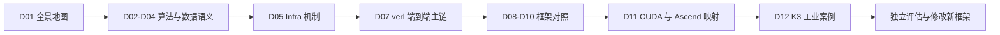

# LLM 后训练前沿阅读课程

> **本页角色**:纯导读页,不承载正文——只给阅读顺序、链接与每篇一句话导读。全部技术内容
> 已归属功能树三处:`01_theory/04_posttraining`(算法理论)、`02_engineering/04_posttrain_frameworks`
> (框架源码,含 `verl/` 子目录)与 `01_theory/01_models/moonshot_kimi`(K3 工业案例);本页过时
> 只改链接/顺序,不要在此加正文。
> 四个工业框架的固定基线 commit(verl `983cb0f`、slime `aaf5c20`、AReaL `b23fa6c`、
> ROLL `370cb24`)与工程定位见 [[01_posttraining_frontier_map_analysis|D01]] §3,本页不重复。
> 最后更新:2026-07-31(kb-reorg P5 Task 7:课程页化,原 `wiki/03_posttraining/` 纵向学习域
> (D00–D12 共 13 篇)解散,D00 的阅读路线骨架 + 六级能力门槛与 `03_posttraining/index.md` 的
> S00–S05 阶段叙述并入本页,`03_posttraining/` 目录整体删除)

---

## 这门课是什么

2026 后训练前沿研究(Reasoning RL + Agentic/Coding RL + 工业级训练系统)横跨两个功能树域:
`01_theory/04_posttraining` 讲算法与在线数据的统计假设,`02_engineering/04_posttrain_frameworks`
讲 rollout、buffer、权重同步、训练—推理一致性和资源调度怎样落地。分开查资料容易,却会割裂一次
真实 RL 迭代——loss 的统计假设必须与 rollout 数据实际怎样生成、缓存和消费对应。这条阅读路线把
两侧串成一条从"当前前沿在解决什么问题"到"能不能独立评估一个新框架"的顺序索引。

这不是按天数安排的课程表,而是一条按**可验证能力**推进的路线。推荐顺序是 D01 → D12,不要求逐字
记忆每篇内容——每读完一段应能完成对应的图、公式、源码定位或设计判断;做不到就回到前置文档补齐。

整条路线遵循三个原则:

1. **算法与系统一起学**:loss 的统计假设必须与 rollout 数据实际怎样生成、缓存和消费对应。
2. **先建立主链,再比较变体**:先用 verl 贯通一次端到端迭代,再用 slime、AReaL、ROLL 比较不同设计赌注。
3. **先解释 CUDA 基线,再判断 Ascend 适配**:不把"能安装"误当成训练闭环、性能和正确性已经等价。

**最短闭环**(建立主干后再展开变体与硬件对照):

**如果只想先抓主干**:按 `D01 → D02 → D04 → D05 → D07 → D11 → D12` 阅读。这条短路线先建立
optimizer 与样本分布的关系、on/off-policy 和 TIM 的正确性边界、一次工业 RL 迭代的真实调用链、
CUDA 方案迁移到 Ascend 时的判断框架,最后用一份最新工业报告把算法、trajectory、infra 与部署约束
重新对齐。随后再用 D03、D08、D09、D10 补 Agentic 和多框架源码对照。

---

## 阅读路线(按 S00→S05 阶段,D01→D12 顺序)

### S00 · 基线与研究地图

建立固定快照、四框架 baseline commit 与统一研究入口。

| 顺序 | 页面 | 位置 | 一句话 |
|---:|---|---|---|
| D01 | [[01_posttraining_frontier_map_analysis]] | `01_theory/04_posttraining/` | 当前前沿为什么同时是算法、在线数据和系统问题:五层后训练栈与四个工业源码样本的固定基线 |

### S01 · 算法与 Infra 的统一坐标系

| 顺序 | 页面 | 位置 | 一句话 |
|---:|---|---|---|
| D02 | [[13_reasoning_rl_algorithm_evolution_analysis]] | `01_theory/04_posttraining/` | GRPO、DAPO、GSPO 等方法改变了哪个估计量、clip 或采样假设(**GRPO 系列权威页**,`grpo_analysis`/`dapo_analysis`/`gspo_analysis` 公式细节已收缩指向本页) |
| D03 | [[24_agentic_rl_algorithm_analysis]] | `01_theory/04_posttraining/` | 多轮工具调用和 coding task 怎样改变 trajectory、reward 与 credit assignment |
| D04 | [[25_on_policy_off_policy_staleness_analysis]] | `01_theory/04_posttraining/` | policy lag、importance ratio 与 train–inference mismatch(TIM)怎样相互作用 |
| D05 | [[01_posttraining_infra_mechanism_analysis]] | `02_engineering/04_posttrain_frameworks/` | control/data/weight 三平面怎样协同,bubble、backpressure 和故障怎样产生 |

### S02 · 框架矩阵与 verl 主链贯通

| 顺序 | 页面 | 位置 | 一句话 |
|---:|---|---|---|
| D06 | [[30_rl_framework_comparison]] | `02_engineering/04_posttrain_frameworks/` | 怎样用统一术语和四级支持证据(P1 接口/P2 功能/P3 正确性/P4 性能)比较 verl、slime、AReaL、ROLL |
| D07 | [[10_verl_end_to_end_iteration_analysis]] | `02_engineering/04_posttrain_frameworks/verl/` | 一批 prompt 怎样穿过 rollout、reward、advantage、update 与权重刷新(主基线 `983cb0f`;与 `verl_ray_trainer_analysis`〔`8a694930`〕逐节调和,详情见该页) |

### S03 · 高性能与 Fully Async 对照

用 slime 与 AReaL 对照吞吐来源与 freshness 代价。

| 顺序 | 页面 | 位置 | 一句话 |
|---:|---|---|---|
| D08 | [[20_slime_architecture_analysis]] | `02_engineering/04_posttrain_frameworks/` | Megatron、SGLang、DataSource、buffer 和 async producer 怎样组合 |
| D09 | [[21_areal_async_architecture_analysis]] | `02_engineering/04_posttrain_frameworks/` | 服务化 training/inference/agent/weight update 如何维持在线 RL 闭环 |

### S04 · 异构、多后端与 Ascend

深挖 ROLL 的抽象边界,再用 CUDA–Ascend 矩阵判断迁移可行性。

| 顺序 | 页面 | 位置 | 一句话 |
|---:|---|---|---|
| D10 | [[22_roll_strategy_and_ascend_analysis]] | `02_engineering/04_posttrain_frameworks/` | Strategy/AutoDeviceMapping 能屏蔽哪些后端差异,哪些不能 |
| D11 | [[31_cuda_ascend_posttraining_stack_comparison]] | `02_engineering/04_posttrain_frameworks/` | 通信、推理、并行、权重同步、kernel 与诊断的差距在哪里(§13 四级迁移验收 M1–M4) |

### S05 · 综合验收:工业案例

| 顺序 | 页面 | 位置 | 一句话 |
|---:|---|---|---|
| D12 | [[24_kimi_k3_posttraining_case_study_analysis]] | `01_theory/01_models/moonshot_kimi/` | 九专家、MOPD、partial rollout、white-box environment、QAT 与百万 token 状态怎样形成一条工业闭环 |

### 框架阅读分工(选读 D08–D10 前先看这张表)

四者不按单一性能榜排名,目标函数不同:

| 框架 | 研究角色 | 重点问题 |
|---|---|---|
| verl(D07) | 覆盖面和可读性主基线 | 一次训练迭代、角色编排、算法扩展、weight sync/reshard |
| slime(D08) | 高性能训练—生成解耦对照 | Megatron + SGLang、DataSource/buffer、weight transport、async producer |
| AReaL(D09) | Fully async/Agentic 对照 | 微服务、Hermes、policy lag、agent trajectory |
| ROLL(D10) | 多后端/异构/Ascend 专项 | Strategy、AutoDeviceMapping、RLVR 与 Agentic async 差异 |

---

## 六级能力门槛

按 L1→L6 递进,每级给出验收物——完成不了就回到前置文档补齐,不要凭印象打勾。

| 等级 | 核心问题 | 验收物 |
|---|---|---|
| L1 解释核心数学对象 | policy/old/reference policy 分别用于什么;reward、return、advantage、KL、entropy、importance ratio 的定义;token/sequence/trajectory/prompt group 是什么统计单位;clip 在限制什么 | 给定一条 response 的 token log-prob、reward 和 mask,写出某 GRPO/PPO 类 loss 需要的全部张量、shape 和聚合维度 |
| L2 画出一次训练迭代 | `prompt → rollout → reward/verifier → advantage → policy update → weight publish → next rollout`,每条边标数据类型、生产者、消费者、同步点、policy version | 解释长尾 response、慢 verifier 或权重刷新分别在哪里造成 bubble,以及同步和异步方案怎样处理 |
| L3 追踪 verl 主链路 | 从真实配置和启动入口追到 controller/trainer 创建角色和资源、rollout 生成、reward/advantage 计算位置、policy loss/optimizer step、train↔rollout layout 转换 | 对固定 commit 给出可复核的 `入口 → 类 → 方法 → 数据结构 → collective/RPC` 路径,并指出修改一个算法所需的最小变更面 |
| L4 比较同步与 Fully Async | 区分 phase-level overlap、streamed pipeline、partial async、fully async;区分系统异步、样本 staleness 和算法 off-policy;吞吐提升来自消除 bubble 还是允许旧样本 | 为同一 workload 比较同步、freshness-preserving 与 fully async 方案,明确各自收益来源与风险 |
| L5 分析权重同步与资源布局 | train 和 rollout 是否 colocate;FSDP/Megatron layout 与推理 TP/EP layout 怎样转换;参数通过 collective/RPC/共享内存还是中间服务传递;"新权重可见"在哪个事件上提交;失败后谁能恢复一致状态 | 画出 weight publish 的时序图,列出通信量、额外峰值显存、阻塞点、版本原子性和一致性校验 |
| L6 独立评估新框架与 NPU 适配 | 固定仓库 commit、依赖和运行配置;找到入口/owner/状态/数据/通信;判断算法语义与实现是否一致;区分接口兼容、功能闭环、正确性闭环、性能闭环;给出 CUDA→Ascend 的适配矩阵和最小验证计划 | 针对一个未被 D06 覆盖的新框架,写一份含证据等级、风险、适配工作量和最小实验的评估报告 |

---

## 与功能树的关系

`01_theory/04_posttraining`、`02_engineering/04_posttrain_frameworks`(含 `verl/`)与
`01_theory/01_models/moonshot_kimi` 是唯一的内容权威;本页只是这几棵树之上的一条阅读顺序索引,
不持有正文,也不会成为第二份真相来源。发现内容缺失、过时或与功能树矛盾:去对应 index.md 或深潜页
修改,再回到本页只更新链接、顺序或一句话导读。

原 `wiki/03_posttraining/` 纵向学习域(D00–D12 共 13 篇)已随 kb-reorg P5 逐任务解散:D01/D03/D04/
D08–D11 纯迁移(Task 2)、D02 成为 GRPO 系列权威页并归一论文页三写(Task 3)、D05/D06 迁入并与
sandbox/infra/weight-sync 划界(Task 4)、D07 与 `verl_ray_trainer_analysis` 双基线调和(Task 5)、
D12 迁入 `moonshot_kimi/`(Task 2)。D00(阅读路线 + 六级能力门槛)与 `03_posttraining/index.md`
(S00–S05 阶段叙述)的导读级内容并入本页后,两个文件与 `03_posttraining/` 目录一并删除(Task 7)。

D00 §3(论文阅读五问法)、§4(源码阅读六问法与证据记录模板)、§6(阶段实践题)、§7(版本复习节奏)
为通用研究方法论,不含后训练领域独有事实,未迁移;§5(四级支持口径 P1–P4)与 §8(各框架最小源码
路径)已分别独立复现于 [[30_rl_framework_comparison|D06]] §3「四级支持证据」与各框架深挖页(D07/D08/
D09/D10 自身的入口—调用链描述细致度均超过 D00 原表),核对后未发现独有信息丢失。

---

## Related Pages

- [[01_posttraining_frontier_map_analysis]] — D01,五层后训练栈与四个工业源码样本的固定基线
- [[13_reasoning_rl_algorithm_evolution_analysis]] — D02,GRPO 系列演进权威页
- [[30_rl_framework_comparison]] — D06,四框架统一机制矩阵与四级支持证据
- [[10_verl_end_to_end_iteration_analysis]] — D07,verl 端到端主基线(`983cb0f`)
- [[31_cuda_ascend_posttraining_stack_comparison]] — D11,CUDA–Ascend 差距矩阵与四级迁移验收
- [[24_kimi_k3_posttraining_case_study_analysis]] — D12,Kimi K3 工业闭环案例
- [[01_theory/04_posttraining/index]] — 后训练算法理论域索引
- [[02_engineering/04_posttrain_frameworks/index]] — 后训练框架域索引
- [[02_engineering/04_posttrain_frameworks/verl/index]] — verl 系列分析索引
- [[courses/torch_compile_end_to_end]] — 姊妹课程页:torch.compile 端到端阅读课程(同一课程页规则的范本)
