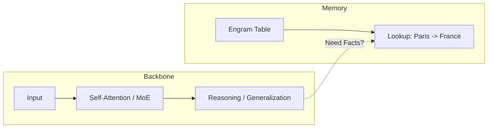
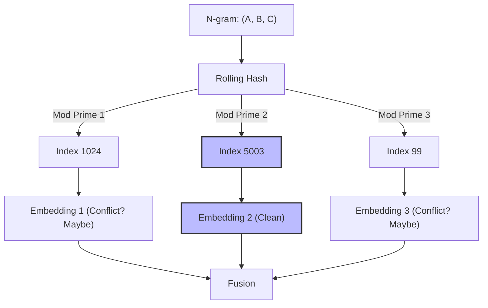
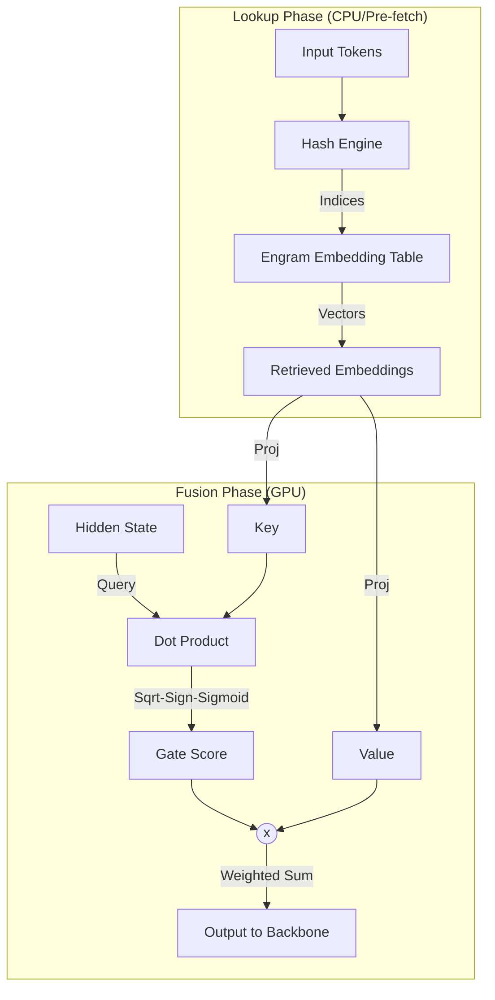
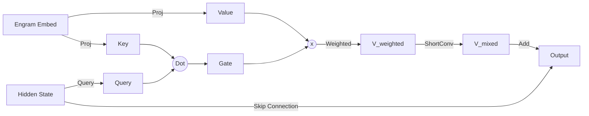

# DeepSeek Engram 技术原理与实现细节分析 (v3 - 融合计算与训练机制)

## 1. 核心定位：稀疏性的新维度 (A New Axis of Sparsity)
根据技术报告（论文），Engram 的核心论点是除了 **计算稀疏性 (MoE)** 之外，引入 **内存稀疏性 (Conditional Memory)**。

-   **U 型 Scaling Law**：论文提出了一个关键的权衡——在给定的总参数或 FLOPs 预算下，应该分配多少给“计算”（MLP/Attention），多少给“记忆”（Engram Table）。研究发现存在一个最优的 U 型曲线。
-   **角色分工**：
    -   **Backbone (MoE/Attention)**：负责逻辑推理、动态泛化。
    -   **Engram (Lookup)**：负责“死记硬背”的世界知识、固定搭配、事实性信息。



## 2. 深入技术原理

### 2.1 静态 N-gram 记忆 (Static N-gram Memory)
-   **机制**：将 N-gram 映射到 Embedding。这本质上是一个巨大的 Key-Value 存储，Key 是 N-gram 的哈希，Value 是预训练好的向量。
-   **零计算 (Zero FLOPs)**：相比于通过多层神经网络去拟合一个事实（如 "Paris is the capital of [France]"），直接查表几乎不消耗算力。
-   **存算分离**：Engram 表可以非常大（例如 100GB+），并且可以存储在 CPU 内存（Host Memory）中，只在需要时异步预取（Prefetch）到 GPU，因为它是**确定性查找**（基于 Input Token 即可提前算出地址，不依赖中间层激活值）。

### 2.2 确定性多头哈希 (Deterministic Multi-Head Hashing)
为了避免存储海量的 N-gram 索引（空间爆炸），Engram 采用了**无碰撞检测的近似存储**：
-   **哈希指纹**：使用多项式滚动哈希（Polynomial Rolling Hash）计算 N-gram 的签名。
-   **素数多头映射**：
    -   利用不同的素数（Prime Numbers）作为模数，将同一个 N-gram 映射到多个不同的物理地址。
    -   **优势**：类似于 Bloom Filter，即使某个 Head 发生哈希冲突，其他 Head 依然能检索到正确的 Embedding。模型会自动学习赋予“正确”的 Head 更高的权重。



### 2.3 门控融合 (Gated Fusion) 与 激活函数
代码中展示了一个独特的融合路径：
1.  **相似度计算**：`Gate = (Key * Query).sum()`。
2.  **特殊激活**：`Gate = sqrt(abs(Gate)) * sign(Gate)`。
    -   **分析**：这个设计非常罕见。相比于直接的 Softmax 或 Sigmoid，`sqrt` 实际上放大了微弱的信号（对于小于1的值，开根号会变大），使得模型对“模糊匹配”更加敏感，能够更轻易地激活稀疏记忆。



## 3. Hyper-Connection 与 mHC 的关联分析

在报告和代码中出现的 **Hyper-Connection (HC)** 是一个关键的架构特征。

### 3.1 什么是 Hyper-Connection?
在 `engram_demo_v1.py` 中：
```python
# Hidden States 维度: [Batch, Length, HC_MULT, Hidden_Size]
hidden_states = hidden_states.unsqueeze(2).expand(-1, -1, hc_mult, -1)
```
-   **定义**：Hyper-Connection 指的是模型的主干（Backbone）不再只维护**一条**隐状态流，而是维护 **$N$ 条独立的隐状态流（Hyper-Connections）**并行传播。
-   **作用**：这相当于在同一层内拥有多个独立的“语义子空间”。Engram 模块可以针对每一条流（Connection）独立地进行 N-gram 检索和融合。

### 3.2 与 mHC (Multi-Head Convolution?) 的关联
你提到的 **mHC** 很可能指的是 **Multi-Head Convolution** 或者 **Multi-Head Context** 相关的工作（虽然 DeepSeek 官方论文中鲜少直接使用 mHC 这个缩写作为主标题，但在代码实现层面有极强对应性）。

**证据链**：
1.  **Demo 中的 `ShortConv`**：
    ```python
    class ShortConv(nn.Module):
        # ...
        self.conv = nn.Conv1d(groups=total_channels, ...)
    ```
    这个 `ShortConv` 对每个 Hyper-Connection 分组进行卷积。这在功能上就是一种 **Multi-Head Convolution**。

2.  **功能关联**：
    -   **Engram 的融合后处理**：在查表融合后，代码立即接了一个 `ShortConv`。
    -   **推测**：**Hyper-Connection** 提供了架构上的“多通道”基础，而 **mHC (ShortConv)** 提供了在这些通道上的“局部时序混合”能力。
    -   Engram 实际上是在利用这种“多头宽架构”来存储更丰富、解耦的知识。比如，Head 1 可能专门存储“地理知识”，Head 2 存储“语言习语”。

### 3.3 总结关联
-   **Hyper-Connection** 是架构（状态维度扩展）。
-   **mHC (及其变体)** 是操作（在扩展维度上的变换）。
-   Engram 完美利用了 Hyper-Connection 的结构，实现了**“多头记忆检索”**，即不同的 Hyper-Connection 查阅不同的 N-gram 知识面。

## 4. 融合计算细节与训练机制 (Fusion & Training)

### 4.1 融合计算公式
Engram 的最终输出不仅仅是查表，而是经过了精细的加权和混合：



1.  **门控加权 (Gating)**：
    $$V_{weighted} = \text{Gate} \cdot \text{Proj}_{value}(E_{lookup})$$
    其中 $E_{lookup}$ 是查到的原始 Embedding。
2.  **局部混合 (Local Mixing)**：
    使用 `ShortConv` (mHC) 对加权后的值进行卷积处理，引入局部时序信息：
    $$V_{mixed} = V_{weighted} + \text{ShortConv}(V_{weighted})$$
3.  **残差连接 (Residual Add)**：
    最终结果被加回到主干网络流中：
    $$H_{output} = H_{input} + V_{mixed}$$

### 4.2 训练机制 (Training Strategy)
Engram 的训练是**端到端 (End-to-End)** 的，不需要分阶段训练。

1.  **梯度流向**：
    -   虽然哈希索引（Input IDs -> Index）过程是离散且不可导的，但这不影响训练。
    -   因为 `nn.Embedding` 的**查找操作**对于**权重（Values）**是可导的。
    -   **反向传播路径**：Loss $\to$ Output $\to$ Gating & Values $\to$ **Engram Embedding Table**。

2.  **联合优化**：
    -   模型同时学习两件事：
        1.  **"存什么"**：Engram 表中的 Embedding 向量会不断更新，以存储最有助于降低 Loss 的模式。
        2.  **"怎么用"**：Backbone 中的门控参数（`key_projs`, `norm`）会学习在什么语境下应该“打开门”去读取这些记忆。

3.  **冲突处理的学习**：
    -   由于哈希冲突的存在，同一个地址可能对应多个不同的 N-gram。
    -   模型通过**多头（Multi-Head）**和**门控（Gating）**自动适应这一点。如果 Head A 发生了严重的语义冲突（如 "cat" 和 "car" 撞车），模型会学会给 Head A 分配较低的门控权重，转而依赖未冲突的 Head B。

## Related Pages

- [[llm/overview]]
- [[deepseek_math_v2]]
