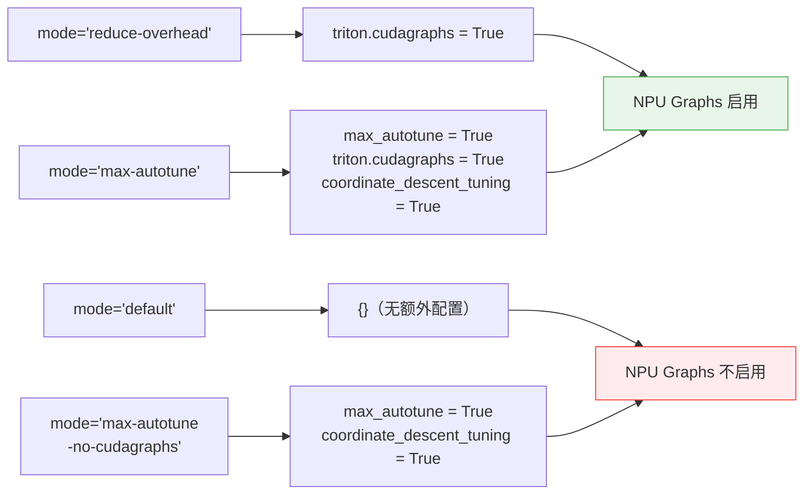
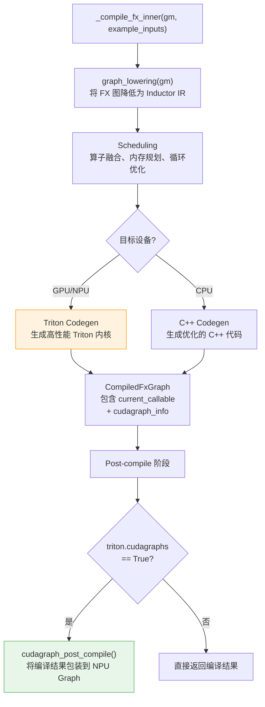
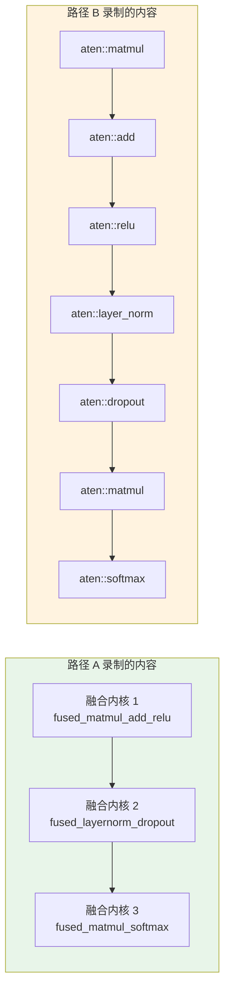
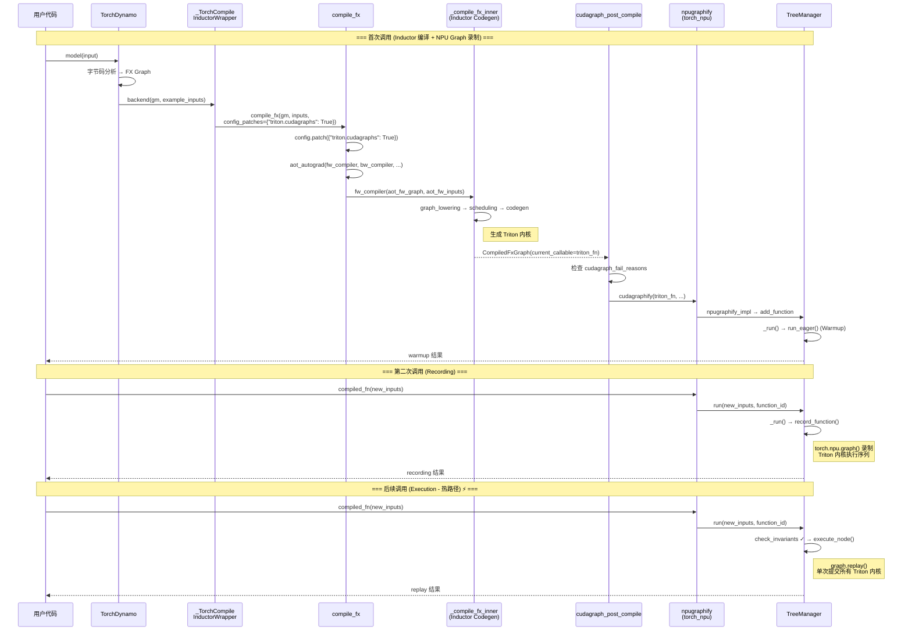
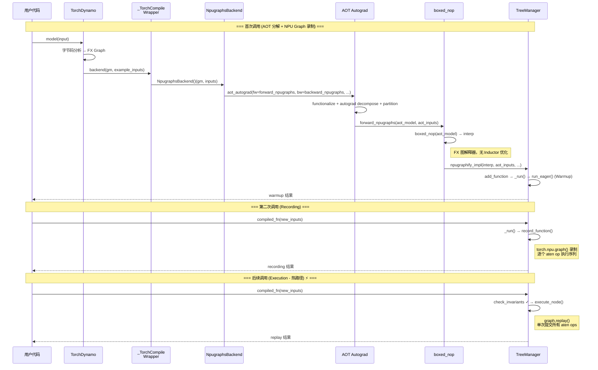
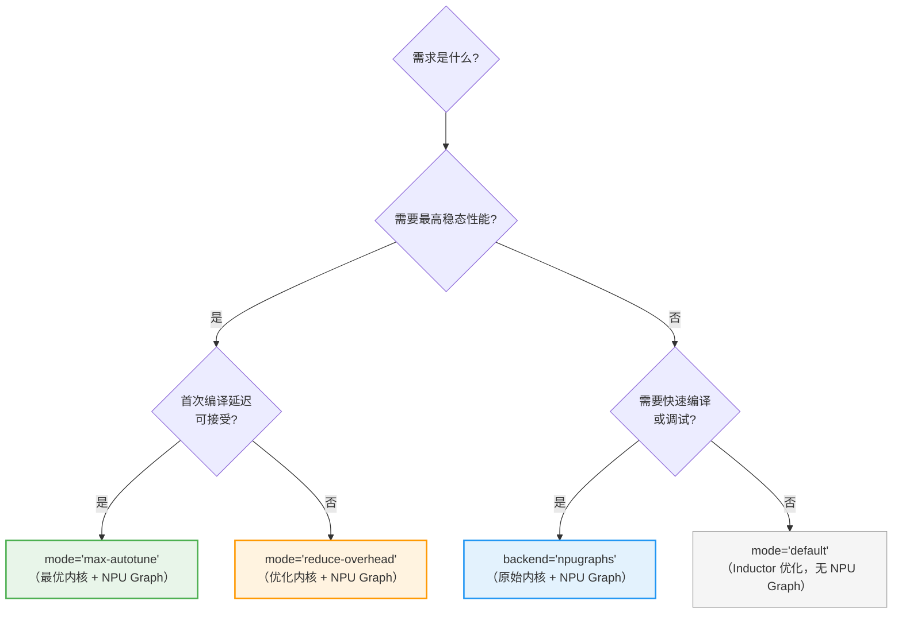

# torch.compile(mode="reduce-overhead") 与 backend="npugraphs" 的 NPU Graphs 深度对比

> 本文深入分析 `torch.compile(mode="reduce-overhead")` 路径下 NPU Graphs 的完整调用链路，并与 `torch.compile(backend="npugraphs")` 进行全面对比。两者都能实现 NPU Graph 加速，但编译流程、优化层级和适用场景存在本质差异。

---

## 一、mode 参数澄清

### 1.1 有效 mode 列表

`torch.compile` 的 `mode` 参数仅支持以下值（定义在 `torch/_inductor/__init__.py` 的 `list_mode_options` 中）：

| mode | 配置项 | NPU Graphs |
|------|--------|------------|
| `"default"` | `{}` | 不启用 |
| `"reduce-overhead"` | `{"triton.cudagraphs": True}` | **启用** |
| `"max-autotune"` | `{"max_autotune": True, "triton.cudagraphs": True, "coordinate_descent_tuning": True}` | **启用** |
| `"max-autotune-no-cudagraphs"` | `{"max_autotune": True, "coordinate_descent_tuning": True}` | 不启用 |

**注意**：`mode="max-reduce"` 并非有效值，会抛出 `RuntimeError: Unrecognized mode=max-reduce`。用户如需"最大化减少开销"，应使用 `mode="reduce-overhead"`（仅启用 NPU Graphs）或 `mode="max-autotune"`（同时启用 Triton 自动调优 + NPU Graphs）。

### 1.2 mode 与 backend 的关系

```python
# mode 参数仅在 backend="inductor"（默认）时生效
# mode 控制 Inductor 的配置选项，是 Inductor 后端的"预设配置"
torch.compile(model, mode="reduce-overhead")
# 等价于：
torch.compile(model, backend="inductor", options={"triton.cudagraphs": True})

# backend="npugraphs" 完全绕过 Inductor，mode 参数无意义
torch.compile(model, backend="npugraphs")
# 此时传 mode 会作为 kwargs 传给 NpugraphsBackend，被忽略
```

---

## 二、整体架构对比

### 2.1 两条路径的核心差异

```
路径 A: torch.compile(mode="reduce-overhead")
┌────────────────────────────────────────────────────────────────────────────┐
│  1. TorchDynamo                                                            │
│     └── 捕获 Python 代码 → FX Graph                                       │
├────────────────────────────────────────────────────────────────────────────┤
│  2. _TorchCompileInductorWrapper                                           │
│     └── apply_mode("reduce-overhead")                                      │
│         → config_patches = {"triton.cudagraphs": True}                     │
│     └── compile_fx(gm, inputs, config_patches=...)                         │
├────────────────────────────────────────────────────────────────────────────┤
│  3. Inductor 编译 (compile_fx → _compile_fx_inner)                         │
│     ├── AOT Autograd: 分离前向/反向/推理                                    │
│     ├── Pre-grad passes: 图级优化                                          │
│     ├── Joint graph passes: 联合前反向优化                                  │
│     ├── Post-grad passes: 后梯度优化                                       │
│     ├── Scheduling: 算子融合、内存规划                                      │
│     └── Codegen: 生成 Triton/C++ 内核代码                                  │
├────────────────────────────────────────────────────────────────────────────┤
│  4. CudaGraph Post-Compile (cudagraph_post_compile)                        │
│     └── cudagraphify() → 被 torch_npu monkey-patch 为 npugraphify()       │
│         → 将 Inductor 编译后的代码包装进 NPU Graph                         │
├────────────────────────────────────────────────────────────────────────────┤
│  5. NPU Graph Tree 核心 (torch_npu/npu/_graph_tree.py)                     │
│     ├── NPUGraphTreeManager: 管理图树生命周期                               │
│     ├── NPUGraphNode: 单个 NPU Graph 节点（录制/回放）                     │
│     └── NPUWarmupNode: Warmup 阶段节点                                     │
└────────────────────────────────────────────────────────────────────────────┘

路径 B: torch.compile(backend="npugraphs")
┌────────────────────────────────────────────────────────────────────────────┐
│  1. TorchDynamo                                                            │
│     └── 捕获 Python 代码 → FX Graph                                       │
├────────────────────────────────────────────────────────────────────────────┤
│  2. _TorchCompileWrapper → NpugraphsBackend                                │
│     └── npugraphs(dynamo_model, dynamo_inputs)                             │
├────────────────────────────────────────────────────────────────────────────┤
│  3. AOT Autograd（无 Inductor 编译）                                       │
│     ├── 分离前向/反向/推理                                                 │
│     ├── forward_npugraphs: boxed_nop(aot_model) → 解释执行 FX 图          │
│     └── 直接调用 npugraphify_impl → 进入 Graph Tree                       │
├────────────────────────────────────────────────────────────────────────────┤
│  4. NPU Graph Tree 核心（同路径 A 的第 5 步）                              │
│     ├── NPUGraphTreeManager                                                │
│     ├── NPUGraphNode                                                       │
│     └── NPUWarmupNode                                                      │
└────────────────────────────────────────────────────────────────────────────┘
```

### 2.2 流程对比图


---

## 三、路径 A 完整调用链路：torch.compile(mode="reduce-overhead")

### 3.1 Phase 1: 入口与配置分发

**调用栈**：
```
torch.compile(model, mode="reduce-overhead")
    ↓ (torch/__init__.py:2745-2749)
    backend == "inductor"
    → backend = _TorchCompileInductorWrapper(mode="reduce-overhead", options=None, dynamic=...)
    ↓ (_TorchCompileInductorWrapper.__init__)
    apply_mode("reduce-overhead")
    → list_mode_options("reduce-overhead") → {"triton.cudagraphs": True}
    → self.config = {"triton.cudagraphs": True}
    ↓ (torch/__init__.py:2753)
    torch._dynamo.optimize(backend=backend, ...)
    ↓ 首次调用 model(input) 时
    _TorchCompileInductorWrapper.__call__(model_, inputs_)
    → compile_fx(model_, inputs_, config_patches={"triton.cudagraphs": True})
```

**关键代码**（`torch/__init__.py` 第2384-2456行）：

```python
class _TorchCompileInductorWrapper:
    compiler_name = "inductor"

    def __init__(self, mode, options, dynamic):
        self.config: dict[str, Any] = {}
        self.dynamic = dynamic
        self.apply_mode(mode)        # ← 将 mode 转为 Inductor 配置
        self.apply_options(options)

    def apply_mode(self, mode: str | None):
        if mode and mode != "default":
            from torch._inductor import list_mode_options
            self.apply_options(list_mode_options(mode, self.dynamic))
            # "reduce-overhead" → {"triton.cudagraphs": True}
            # "max-autotune"    → {"max_autotune": True, "triton.cudagraphs": True, ...}

    def __call__(self, model_, inputs_):
        from torch._inductor.compile_fx import compile_fx
        return compile_fx(model_, inputs_, config_patches=self.config)
```

**mode 到 config 的映射关系**：



### 3.2 Phase 2: compile_fx — Inductor 编译主入口

**代码位置**：`torch/_inductor/compile_fx.py` (第2483行)

```python
def compile_fx(
    model_: GraphModule,
    example_inputs_: Sequence[InputType],
    inner_compile: Callable[..., OutputCode] = compile_fx_inner,
    config_patches: Optional[dict[str, Any]] = None,  # ← {"triton.cudagraphs": True}
    decompositions: Optional[dict[OpOverload, Callable[..., Any]]] = None,
    ignore_shape_env: bool = False,
) -> CompileFxOutput:
    # 递归地将 config_patches 应用到整个编译过程
    if config_patches:
        with config.patch(config_patches):  # ← 全局设置 triton.cudagraphs=True
            return compile_fx(
                model_, example_inputs_,
                inner_compile=config.patch(config_patches)(inner_compile),
                decompositions=decompositions,
            )
    ...
```

`config.patch({"triton.cudagraphs": True})` 在整个编译过程中生效，包括后续的 `_compile_fx_inner` 和 `cudagraph_post_compile`。

### 3.3 Phase 3: _compile_fx_main — AOT Autograd + Inductor 编译

**代码位置**：`torch/_inductor/compile_fx.py` (第2650行)

```python
def _compile_fx_main(model_, example_inputs_, inner_compile, decompositions, ...):
    """
    核心编译流程：
    (1) apply pre-grad passes
    (2) create fw_compiler / bw_compiler / inference_compiler
    (3) call aot_autograd:
        - (3a) creates a joint graph with decompositions
        - (3b) partitions it into fw/bw graphs (applying joint-graph passes)
        - (3c) calls fw_compiler and bw_compiler (applying post-grad passes)
        - (3d) assembles compiled functions back together
    """
    model_ = run_pre_grad_passes(model_, example_inputs_)
    compiler_config_extra = create_compiler_config_extra(config)
    # compiler_config_extra.cudagraphs = BoxedBool(True)  ← 因为 triton.cudagraphs=True

    def fw_compiler_base(gm, example_inputs, is_inference):
        return compile_fx_forward(gm, example_inputs, ...,
            compiler_config_extra=compiler_config_extra,
            inner_compile=inner_compile,
            is_inference=is_inference)

    fw_compiler = functools.partial(fw_compiler_base, is_inference=False)
    inference_compiler = functools.partial(fw_compiler_base, is_inference=True)

    def bw_compiler(gm, example_inputs):
        return compile_fx_backward(gm, example_inputs,
            compiler_config_extra=compiler_config_extra,
            inner_compile=inner_compile)

    return aot_autograd(
        fw_compiler=fw_compiler,
        bw_compiler=bw_compiler,
        inference_compiler=inference_compiler,
        decompositions=decompositions,
        partition_fn=partition_fn,
        cudagraphs=compiler_config_extra.cudagraphs,  # ← BoxedBool(True)
        boxed_forward_device_index=compiler_config_extra.forward_device,
    )(model_, example_inputs_)
```

### 3.4 Phase 4: Inductor Codegen — 与 backend="npugraphs" 的核心差异

在路径 A 中，`fw_compiler` / `bw_compiler` 实际调用 `compile_fx_inner` → `_compile_fx_inner`，执行完整的 Inductor 编译流程：



**Inductor 编译阶段做了什么**（路径 B 没有的）：

| 优化阶段 | 说明 | 对性能的影响 |
|----------|------|-------------|
| **Pre-grad passes** | 图级别优化（常量折叠、死代码消除等） | 减少计算量 |
| **Joint graph passes** | 联合前反向图优化（重计算策略等） | 优化内存/计算平衡 |
| **Post-grad passes** | 后梯度优化（算子融合、布局优化等） | 减少内核数量 |
| **Scheduling** | 算子融合（pointwise fusion、reduction fusion 等）、内存规划 | 显著减少内核启动次数 |
| **Triton Codegen** | 生成高性能 Triton GPGPU 内核 | 单内核执行效率更高 |
| **Memory Planning** | 静态内存分配、buffer 复用 | 减少内存碎片 |

### 3.5 Phase 5: cudagraph_post_compile — NPU Graph 包装

**代码位置**：`torch/_inductor/output_code.py` (第195行)

这是路径 A 中 NPU Graph 被引入的关键阶段。在 Inductor 编译产出 `CompiledFxGraph`（包含 Triton 内核的可调用函数）后，`cudagraph_post_compile` 将其包装进 NPU Graph。

```python
def cudagraph_post_compile(
    example_inputs, compiled_graph, cudagraphs, constants, boxed_forward_device_index
):
    """
    检查是否有不能使用 cudagraphs 的原因，
    如果可以，则将 compiled_graph.current_callable 包装进 NPU Graph。
    """
    cached_info = compiled_graph.cudagraph_info
    cudagraph_fail_reasons = cached_info.cudagraph_fail_reasons

    if not cudagraph_fail_reasons:
        # 准备 cudagraph 元数据
        prepare_cudagraph_post_compile(compiled_graph, example_inputs, ...)

        from .compile_fx import cudagraphify  # ← 被 torch_npu monkey-patch 为 npugraphify

        current_callable = compiled_graph.current_callable
        compiled_graph.current_callable = cudagraphify(
            current_callable,                                    # ← Inductor 编译后的 Triton 内核
            static_input_idxs=static_input_idxs or (),
            device_index=next(iter(compiled_graph.device_idxs)),
            stack_traces=stack_traces,
            is_backward=is_backward,
            is_inference=is_inference,
            constants=tuple(tensor_constants.values()),
            placeholders=placeholders,
            mutated_input_idxs=tuple(compiled_graph.mutated_input_idxs),
        )
    else:
        BoxedBool.disable(cudagraphs)
        # 跳过 NPU Graph，退化为普通执行
```

### 3.6 Phase 6: npugraphify — torch_npu 的 Monkey-Patch 入口

**代码位置**：`torch_npu/utils/_graph_tree.py` (第91行)

torch_npu 在初始化时通过 `_apply_npugraph_tree_methods()` 执行关键的 monkey-patch：

```python
def _apply_npugraph_tree_methods():
    register_backend(name="npugraphs", compiler_fn=NpugraphsBackend())
    torch._inductor.compile_fx.cudagraphify = npugraphify  # ← 核心 patch
    torch._inductor.cudagraph_utils.check_multiple_devices_or_any_cpu_nodes = (
        check_multiple_devices_or_any_cpu_nodes
    )
    torch.compiler.npugraph_mark_step_begin = npugraph_mark_step_begin
```

`npugraphify` 的签名与 Inductor 原始的 `cudagraphify` 完全一致，但内部将 CUDA Graph 操作替换为 NPU Graph：

```python
def npugraphify(model, static_input_idxs, *, device_index, stack_traces,
                is_backward, is_inference, constants, placeholders, mutated_input_idxs):
    from torch_npu.npu._graph_tree import npugraphify_impl as new_npugraphify_impl

    if config.triton.cudagraph_trees:
        npugraphify_fn = functools.partial(
            new_npugraphify_impl,         # ← Graph Tree 实现
            device_index=device_index,
            stack_traces=stack_traces,
            is_backward=is_backward,
            ...
        )
    else:
        npugraphify_fn = npugraphify_impl  # ← 旧版简单实现

    compiled_fn = None
    def run(new_inputs):
        nonlocal compiled_fn
        if compiled_fn is None:
            compiled_fn = npugraphify_fn(model, new_inputs, static_input_idxs)
        return compiled_fn(new_inputs)
    return run
```

**注意**：此处的 `model` 参数在路径 A 中是 **Inductor 编译后的 Triton 内核函数**，而在路径 B 中是 **boxed_nop 包装的 FX 图解释器**。这是两条路径最核心的区别。

### 3.7 Phase 7-8: NPU Graph Tree 核心（与路径 B 共享）

从 `npugraphify_impl` 开始，路径 A 和路径 B 进入相同的 NPU Graph Tree 核心逻辑。详细分析参见 `torch_compile_npugraphs_deep_dive_v2.md` 的 Phase 5-8 章节（`NPUGraphTreeManager` → `deferred_npugraphify` → `npugraphify` → `NPUGraphNode._record` / `NPUGraphNode.run`）。

---

## 四、路径 A 完整调用栈

```
torch.compile(model, mode="reduce-overhead")
    ↓ (torch/__init__.py:2749)
    _TorchCompileInductorWrapper(mode="reduce-overhead")
        → self.config = {"triton.cudagraphs": True}
    ↓ (torch.__init__.py:2753)
    torch._dynamo.optimize(backend=_TorchCompileInductorWrapper_inst)
    ↓ 首次调用 model(input) 时
    _TorchCompileInductorWrapper.__call__(model_, inputs_)
    ↓ (torch/__init__.py:2456)
    compile_fx(model_, inputs_, config_patches={"triton.cudagraphs": True})
    ↓ (compile_fx.py:2511-2520)
    config.patch({"triton.cudagraphs": True})  # 全局设置
    compile_fx(model_, inputs_)  # 递归调用，无 config_patches
    ↓ (compile_fx.py:2604)
    _maybe_wrap_and_compile_fx_main(model_, inputs_, inner_compile, ...)
    ↓ (compile_fx.py:2650)
    _compile_fx_main(model_, inputs_, inner_compile, decompositions, ...)
    ↓ (compile_fx.py:2836)
    aot_autograd(
        fw_compiler=fw_compiler,    # → compile_fx_forward → compile_fx_inner
        bw_compiler=bw_compiler,    # → compile_fx_backward → compile_fx_inner
        inference_compiler=inference_compiler,
        cudagraphs=BoxedBool(True),
    )(model_, inputs_)
    ↓ AOT Autograd 分离前向/反向后：
    fw_compiler(aot_fw_graph, aot_fw_inputs)
    ↓ (compile_fx.py:2695)
    fw_compiler_base(gm, example_inputs, is_inference=False)
    ↓ (compile_fx.py:2277)
    compile_fx_forward(gm, example_inputs, ...)
    ↓ (compile_fx.py:2277)
    inner_compile = compile_fx_inner(gm, example_inputs, cudagraphs=BoxedBool(True), ...)
    ↓ (compile_fx.py:829)
    _compile_fx_inner(gm, example_inputs, ...)
        ├── graph_lowering → Inductor IR
        ├── scheduling → 算子融合
        ├── codegen → Triton 内核 / C++ 代码
        └── 返回 CompiledFxGraph (包含 current_callable + cudagraph_info)
    ↓ (output_code.py:195)
    cudagraph_post_compile(example_inputs, compiled_graph, cudagraphs=BoxedBool(True), ...)
    ↓ (output_code.py:234)
    from .compile_fx import cudagraphify  # 已被 monkey-patch 为 npugraphify
    compiled_graph.current_callable = cudagraphify(
        current_callable,  # Inductor 编译后的 Triton 内核
        static_input_idxs=..., device_index=..., ...
    )
    ↓ (torch_npu/utils/_graph_tree.py:91)
    npugraphify(model=triton_kernel_fn, ...)
    ↓ (torch_npu/utils/_graph_tree.py:121)
    run(new_inputs)  # 首次调用时触发
    ↓ (torch_npu/npu/_graph_tree.py:327)
    npugraphify_impl(model, inputs, static_input_idxs, ...)
    → deferred_npugraphify(inputs)
    ↓ (torch_npu/npu/_graph_tree.py:376)
    npugraphify(model, inputs, static_input_idxs, ...)
    ↓ (torch_npu/npu/_graph_tree.py:376)
    manager = get_container(device_index).get_tree_manager()
    manager.add_function(model, inputs, ...)
    ↓ (torch_npu/npu/_graph_tree.py)
    _run() → run_eager() / record_function() / execute_node()
        ├── Warmup: NPUWarmupNode
        ├── Record: NPUGraphNode._record()  ← 录制 NPU Graph
        └── Execute: NPUGraphNode.run()     ← graph.replay()
```

---

## 五、路径 B 完整调用栈（对比参考）

```
torch.compile(model, backend="npugraphs")
    ↓ (torch/__init__.py:2751)
    backend != "inductor"
    → backend = _TorchCompileWrapper("npugraphs", None, None, dynamic)
        → self.compiler_fn = lookup_backend("npugraphs") → NpugraphsBackend()
    ↓ 首次调用 model(input) 时
    _TorchCompileWrapper.__call__(model_, inputs_)
    ↓ (torch/__init__.py:2530)
    NpugraphsBackend()(model_, inputs_)
    ↓ (torch_npu/utils/_graph_tree.py:367)
    npugraphs(dynamo_model, dynamo_inputs)
    ↓ (torch_npu/utils/_graph_tree.py:348)
    aot_autograd(
        fw_compiler=forward_npugraphs,
        bw_compiler=backward_npugraphs,
        inference_compiler=partial(forward_npugraphs, is_inference=True),
    )(dynamo_model, dynamo_inputs)
    ↓ AOT Autograd 分离前向/反向后：
    forward_npugraphs(aot_model, aot_inputs)
    ↓ (torch_npu/utils/_graph_tree.py:279)
    interp = boxed_nop(aot_model, aot_inputs)      ← FX 图解释执行，无 Inductor 优化
    fixed = num_fw_fixed_arguments(...)
    skip_msg = check_for_skip(aot_model, fixed)
    ↓ (torch_npu/utils/_graph_tree.py:291)
    out = npugraphify_impl(
        interp,              # ← 解释执行函数（非 Triton 内核）
        aot_inputs,
        range(fixed),
        device_index=..., is_backward=False, ...
    )
    ↓ 进入相同的 NPU Graph Tree 核心逻辑
    deferred_npugraphify → npugraphify → manager.add_function → _run()
```

---

## 六、关键代码路径差异分析

### 6.1 编译产物对比

| 维度 | 路径 A (mode="reduce-overhead") | 路径 B (backend="npugraphs") |
|------|------|------|
| **被 NPU Graph 录制的函数** | Inductor 编译后的 Triton 内核 | `boxed_nop` 包装的 FX 图解释器 |
| **函数内部执行** | 高度优化的融合内核（如 fused_add_relu） | 逐节点执行原始 aten ops（如 add、relu 分开） |
| **内核数量** | 少（经过算子融合） | 多（每个 aten op 一次调用） |
| **单内核效率** | 高（Triton auto-tuned） | 一般（默认实现） |
| **编译耗时** | 较长（Inductor 编译 + Graph 录制） | 较短（仅 Graph 录制） |

### 6.2 NPU Graph 录制的内容差异



**路径 A** 录制的是少量高效融合内核的序列，**路径 B** 录制的是大量原始 aten op 的序列。两者在 NPU Graph replay 时的行为差异：

- **路径 A**：少量内核启动，每个内核计算量大且经过优化 → **replay 时 NPU 利用率高**
- **路径 B**：大量小内核启动，每个内核计算量小 → replay 消除了 CPU dispatch 开销，但 **NPU 端执行效率较低**

### 6.3 跳过 NPU Graph 时的回退差异

| 场景 | 路径 A | 路径 B |
|------|--------|--------|
| NPU Graph 捕获失败 | 回退到 Inductor 编译后的 Triton 内核（仍然很快） | 回退到 `boxed_nop`（FX 图解释执行，较慢） |
| 包含 CPU 节点 | 跳过 cudagraph_post_compile，直接执行 Triton 内核 | `check_for_skip` 返回 skip_msg，回退到 `interp` |
| 输入 mutation | 可能跳过整个图或部分图的 cudagraph 包装 | `BoxedBool.disable(do_npugraphs)` 跳过 Graph |

---

## 七、Wrapper 类对比

### 7.1 `_TorchCompileInductorWrapper` vs `_TorchCompileWrapper`

`torch.compile` 根据 `backend` 参数选择不同的 Wrapper：

```python
# torch/__init__.py 第2745-2751行
if backend == "inductor":
    backend = _TorchCompileInductorWrapper(mode, options, dynamic)
else:
    backend = _TorchCompileWrapper(backend, mode, options, dynamic)
```

| 特性 | `_TorchCompileInductorWrapper` | `_TorchCompileWrapper` |
|------|------|------|
| **使用条件** | `backend == "inductor"`（默认） | `backend != "inductor"`（如 `"npugraphs"` 等） |
| **mode 处理** | `apply_mode()` → `list_mode_options()` → Inductor config_patches | 作为 `kwargs["mode"]` 传给后端（通常被忽略） |
| **options 处理** | `apply_options()` → 校验后存入 config | 作为 `kwargs["options"]` 传给后端 |
| **调用后端** | `compile_fx(model_, inputs_, config_patches=self.config)` | `self.compiler_fn(model_, inputs_, **self.kwargs)` |
| **reset 行为** | 调用 `reset_cudagraph_trees()` | 调用后端的 `reset()` 方法 |

### 7.2 mode 参数在路径 B 中的行为

当使用 `torch.compile(model, backend="npugraphs", mode="reduce-overhead")` 时：

```python
# _TorchCompileWrapper.__init__
self.compiler_fn = lookup_backend("npugraphs")  # → NpugraphsBackend()
self.kwargs = {"mode": "reduce-overhead"}  # mode 被存入 kwargs

# _TorchCompileWrapper.__call__
self.compiler_fn(model_, inputs_, mode="reduce-overhead")
# → NpugraphsBackend.__call__(model, inputs, mode="reduce-overhead")
# → npugraphs(model, inputs)  # **mode 参数被忽略**
```

`NpugraphsBackend.__call__` 的签名是 `def __call__(model, inputs)`，不接受 `mode` 参数。但由于 Python 的函数调用机制，如果 `@staticmethod` 方法不接受额外 kwargs，这会导致 **TypeError**。因此 `mode` 参数在 `backend="npugraphs"` 时实际上**不应与非默认 mode 组合使用**。

---

## 八、执行时序对比

### 8.1 路径 A：首次编译与执行



### 8.2 路径 B：首次编译与执行



---

## 九、性能特性对比

### 9.1 综合对比表

| 维度 | 路径 A: `mode="reduce-overhead"` | 路径 B: `backend="npugraphs"` |
|------|------|------|
| **编译时间** | 较长（Inductor codegen + Graph 录制） | 较短（仅 AOT 分解 + Graph 录制） |
| **首次执行延迟** | 高（Triton 编译 + warmup + recording） | 中（warmup + recording） |
| **稳态执行性能** | **最优**（优化内核 + Graph replay） | 良好（原始内核 + Graph replay） |
| **NPU 利用率** | 高（融合内核，少量 launch） | 中（未融合内核，多次 launch） |
| **CPU dispatch 开销** | 极低（Graph replay 消除） | 极低（Graph replay 消除） |
| **内存占用** | 较高（Triton 编译缓存 + Graph 内存池） | 较低（仅 Graph 内存池） |
| **动态形状支持** | 支持（Graph Tree + Inductor 动态支持） | 支持（Graph Tree） |
| **调试难度** | 高（Inductor + Graph Tree 双层抽象） | 中（仅 Graph Tree） |
| **代码侵入性** | 无 | 无 |
| **回退性能** | 好（回退到 Triton 内核，仍有优化） | 差（回退到 FX 图解释执行） |

### 9.2 适用场景

```
优先使用 mode="reduce-overhead":
├── 大模型推理（Triton 融合 + Graph replay → 极低延迟）
├── 训练循环（前反向均优化）
├── 稳定生产环境（编译一次，持续高效执行）
└── 对首次编译延迟不敏感的场景

优先使用 backend="npugraphs":
├── 调试和开发阶段（编译快，问题定位容易）
├── 作为性能 baseline（隔离 Inductor 优化的效果）
├── Inductor 不支持的特殊算子场景
└── 快速验证 NPU Graph 兼容性
```

---

## 十、mode="max-autotune" 的额外优化

当使用 `mode="max-autotune"` 时，在路径 A 的基础上增加了两项配置：

```python
"max-autotune": {
    "max_autotune": True,              # ← 额外：启用 Triton autotune
    "triton.cudagraphs": True,          # 启用 NPU Graphs
    "coordinate_descent_tuning": True,  # ← 额外：坐标下降法调优
}
```

| 额外优化 | 说明 | 对 NPU Graph 的影响 |
|----------|------|-------------------|
| `max_autotune` | 对 matmul 等操作搜索最优 Triton 配置 | 录制到 Graph 中的 Triton 内核性能更优 |
| `coordinate_descent_tuning` | 在 autotune 基础上进一步微调参数 | 进一步提升录制内核的性能 |

`mode="max-autotune"` 的编译时间比 `mode="reduce-overhead"` 更长（因为需要 profile 多种配置），但稳态性能通常更优。

---

## 十一、总结

### 11.1 核心区别一句话总结

- **`mode="reduce-overhead"`**：先用 Inductor 编译优化代码，再用 NPU Graph 消除 CPU dispatch 开销 → **"优化内核 + 快速启动"**
- **`backend="npugraphs"`**：跳过 Inductor 编译，直接用 NPU Graph 包装原始 aten ops → **"原始内核 + 快速启动"**

### 11.2 决策流程图



### 11.3 代码示例

```python
import torch
import torch_npu

model = MyModel().npu()
input = torch.randn(32, 3, 224, 224).npu()

# 方式 1: Inductor + NPU Graphs（推荐生产使用）
compiled_model_a = torch.compile(model, mode="reduce-overhead")

# 方式 2: Inductor + NPU Graphs + Max Autotune（追求极致性能）
compiled_model_b = torch.compile(model, mode="max-autotune")

# 方式 3: 纯 NPU Graphs（调试/baseline）
compiled_model_c = torch.compile(model, backend="npugraphs")

# 方式 4: 通过 options 精确控制
compiled_model_d = torch.compile(model, options={"triton.cudagraphs": True})

# 训练循环中建议标记 step 开始
for epoch in range(num_epochs):
    for batch in dataloader:
        torch.compiler.npugraph_mark_step_begin()
        output = compiled_model_a(batch)
        loss = criterion(output, target)
        loss.backward()
        optimizer.step()
        optimizer.zero_grad()
```

### 11.4 核心文件索引

| 文件 | 路径 A 角色 | 路径 B 角色 |
|------|------------|------------|
| `torch/__init__.py` | `_TorchCompileInductorWrapper` 创建与配置 | `_TorchCompileWrapper` 创建 |
| `torch/_inductor/__init__.py` | `list_mode_options()` mode→config 映射 | 不涉及 |
| `torch/_inductor/compile_fx.py` | `compile_fx` 主编译入口 + `cudagraphify` 定义 | 不涉及（被绕过） |
| `torch/_inductor/output_code.py` | `cudagraph_post_compile` NPU Graph 包装 | 不涉及 |
| `torch/_dynamo/backends/inductor.py` | `inductor` 后端注册 | 不涉及 |
| `torch_npu/utils/_graph_tree.py` | `npugraphify` (monkey-patch) + `npugraphs` 后端注册 | `NpugraphsBackend` + `npugraphs()` 函数 |
| `torch_npu/npu/_graph_tree.py` | NPU Graph Tree 核心（共享） | NPU Graph Tree 核心（共享） |

## Related Pages

- [[llm/02_training/torch_compile/overview]]
- [[torch_compile_npugraphs_deep_dive]]
- [[torch_compile_architecture]]
