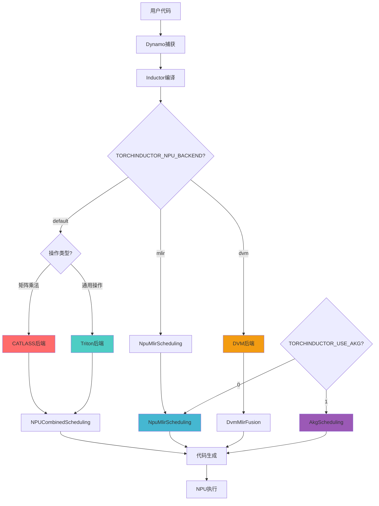
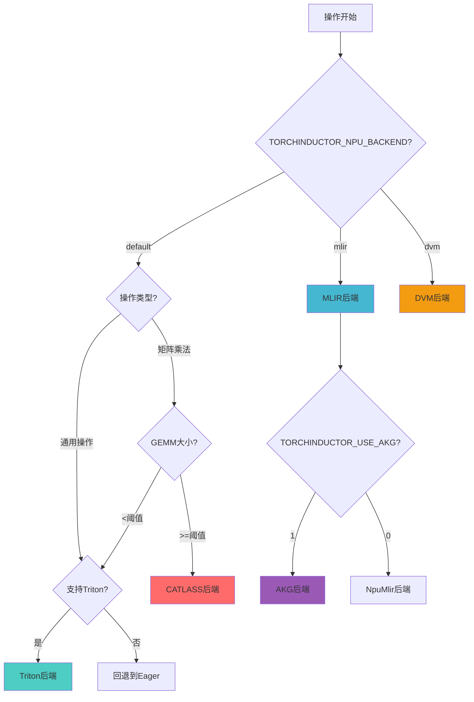
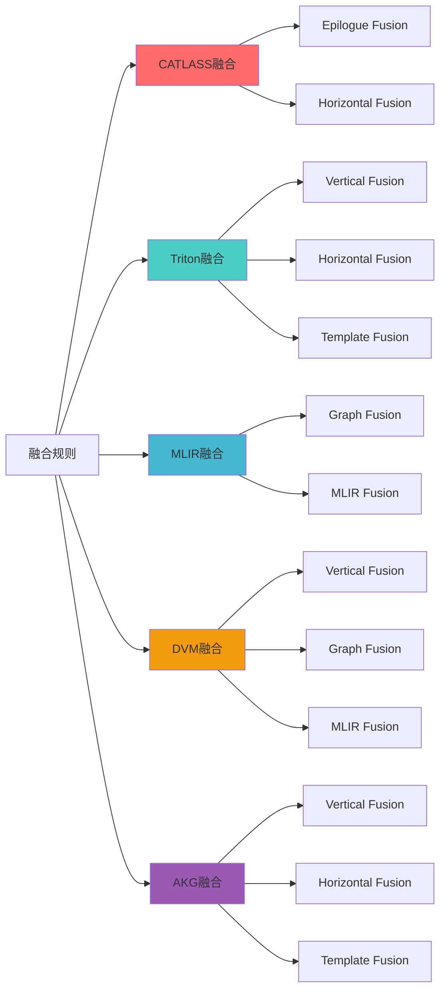
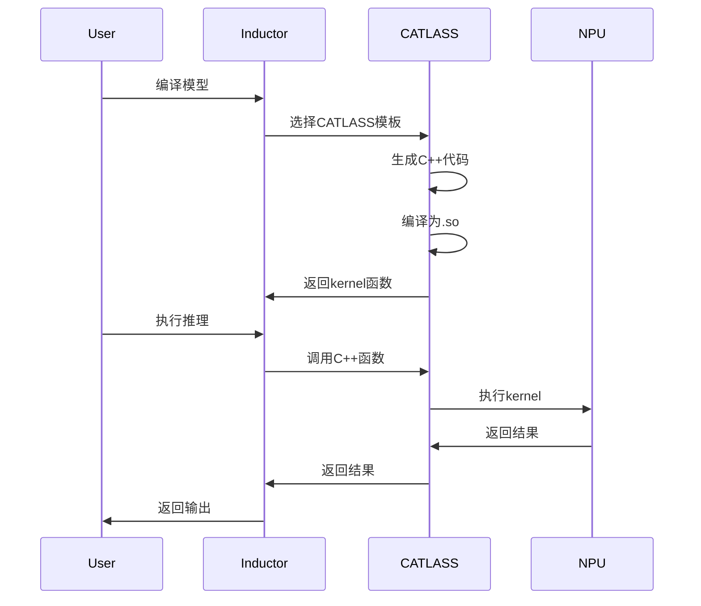
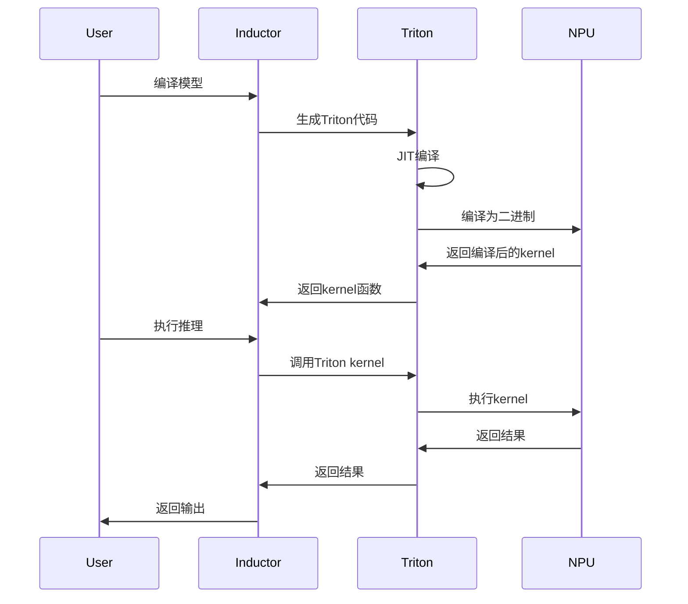
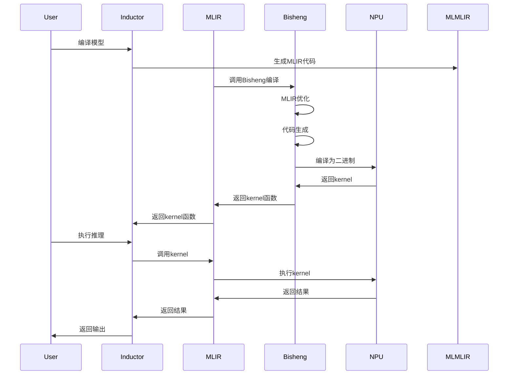
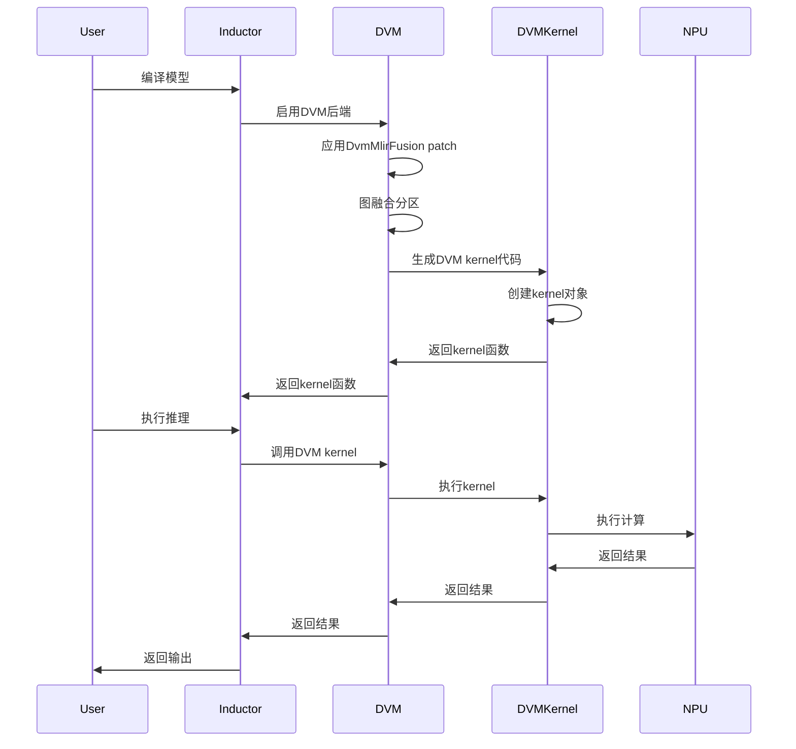
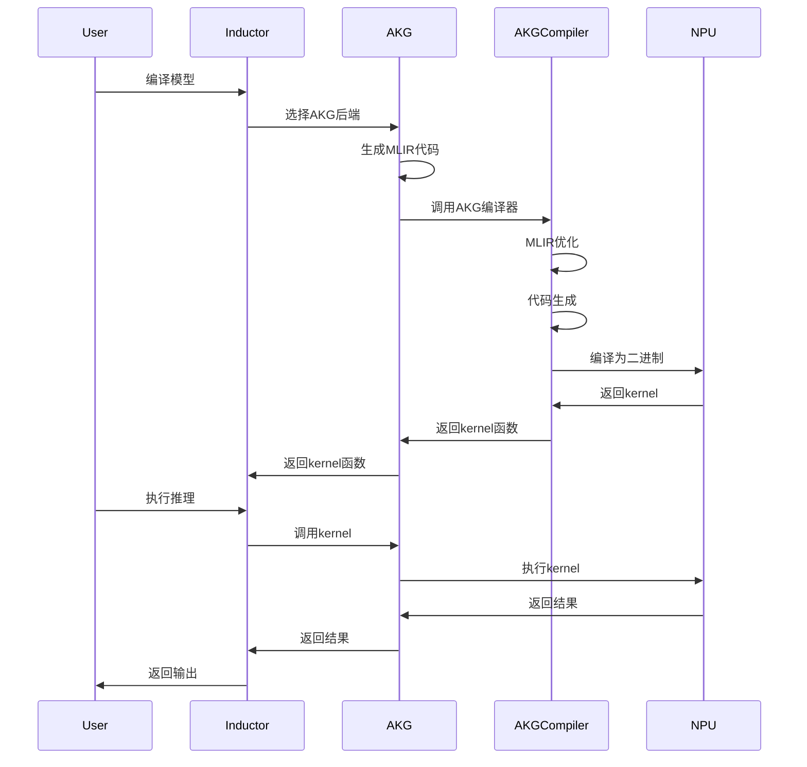

# NPU Inductor 后端适配技术分析

> 基于 `torch_npu/_inductor` 目录的深度代码分析，详细解答后端选择、融合规则实现及执行流程差异

---

## 目录

1. [概述](#概述)
2. [问题1：后端选择机制](#问题1后端选择机制)
3. [问题2：不同后端的融合规则实现](#问题2不同后端的融合规则实现)
4. [问题3：不同后端的执行流程与性能差异](#问题3不同后端的执行流程与性能差异)
5. [技术架构总结](#技术架构总结)
6. [参考资源](#参考资源)

---

## 概述

`torch_npu/_inductor` 是 PyTorch Inductor 在昇腾NPU设备上的适配实现，支持多个后端：
- **Triton**: 通用后端，支持点操作、归约等

- **CATLASS**: 矩阵乘法专用后端，基于C++实现
- **MLIR**: 基于MLIR的编译后端，通过Bisheng编译
- **DVM**: Dynamic Virtual Machine后端，支持DVM融合和动态形状
- **AKG**: Ascend Kernel Generator后端，通过AKG编译器优化

### 核心架构



---

## 问题1：后端选择机制

### 1.1 后端选择架构

NPU Inductor 使用 **NPUCombinedScheduling** 作为统一的调度入口，根据操作类型动态选择后端：

**核心实现**（[codegen/npu_combined_scheduling.py:17](file:///e:\97-codes\torch_parallel\pta_suhaibo\torch_npu\_inductor\codegen\npu_combined_scheduling.py#L17)）：

```python
class NPUCombinedScheduling(BaseScheduling):
    """
    NPU Kernels的统一调度器，根据需要委托给CATLASS和Triton调度器
    两者都支持NPU设备，并使用统一的wrapper进行代码生成
    """

    def __init__(self, scheduler: Scheduler) -> None:
        super().__init__(scheduler)
        self._scheduler = scheduler
        self._triton_scheduling = NPUTritonScheduling(scheduler)
        self._catlass_scheduling = CATLASSScheduling(scheduler)

    def choose_node_backend(self, node: BaseSchedulerNode) -> BaseScheduling:
        """
        根据节点类型选择后端
        """
        if self._catlass_scheduling.is_catlass_template(node):
            return self._catlass_scheduling
        return self._triton_scheduling
```

### 1.2 CATLASS 后端选择条件

**CATLASS 模板判断**（[codegen/catlass/catlass_scheduling.py:70](file:///e:\97-codes\torch_parallel\pta_suhaibo\torch_npu\_inductor\codegen\catlass\catlass_scheduling.py#L70)）：

```python
@staticmethod
def is_catlass_template(node: BaseSchedulerNode) -> bool:
    """
    判断节点是否为CATLASS模板
    """
    return isinstance(node, SchedulerNode) and isinstance(
        node.node, CATLASSTemplateBuffer
    )
```

**CATLASS 使用条件**（[utils.py:132](file:///e:\97-codes\torch_parallel\pta_suhaibo\torch_npu\_inductor\utils.py#L132)）：

```python
def use_catlass_template(op_name: str, layout: Layout, m: int, n: int, k: int) -> bool:
    """
    判断是否应该使用CATLASS模板
    
    条件：
    1. 操作在启用列表中（mm, addmm, bmm）
    2. GEMM大小超过最小阈值
    3. 不是ROCm设备
    4. CATLASS库可用
    """
    from .config import catlass as catlass_config
    from .codegen.catlass.catlass_utils import try_import_catlass
    
    enabled_ops = catlass_config.catlass_enabled_ops.upper()
    if op_name.upper() not in enabled_ops:
        return False
    
    gemm_size = m * n * k
    if gemm_size <= 0 or gemm_size < catlass_config.catlass_backend_min_gemm_size:
        return False
    
    if not try_import_catlass():
        return False
    
    return True
```

### 1.3 Triton 后端选择条件

**Triton 模板判断**（[utils.py:107](file:///e:\97-codes\torch_parallel\pta_suhaibo\torch_npu\_inductor\utils.py#L107)）：

```python
def use_triton_template(layout: Layout, layout_dtypes=None) -> bool:
    """
    判断是否应该使用Triton模板
    
    条件：
    1. 设备使用Triton
    2. 布局支持
    3. 数据类型支持
    """
    if not has_triton():
        return False
    
    if layout_dtypes is None:
        layout_dtypes = layout.get_allowed_dtypes()
    
    if not _use_template_for_gpu(layout, layout_dtypes):
        return False
    
    return True
```

### 1.4 MLIR 后端选择条件

**MLIR 编译器**（[ascend_npu_ir/ascend_npu_ir/npu/mlir_compiler.py](file:///e:\97-codes\torch_parallel\pta_suhaibo\torch_npu\_inductor\ascend_npu_ir\ascend_npu_ir\npu\mlir_compiler.py#L1)）：

```python
class NpuMlirCompiler:
    """
    MLIR编译器，用于生成和编译MLIR代码
    
    使用场景：
    1. 需要高度优化的操作
    2. 动态形状支持
    3. 复杂的融合模式
    """
    def __init__(self, kernel_name, multiprocess_compile=False, 
                 no_more_compile=False, kernel_meta=None, autotune=True):
        self.dynamic = kernel_meta.get('dynamic')
        self.mutated_indices = kernel_meta.get('mutated_indices')
        self.kernel_hash = kernel_meta.get('kernel_hash')
        self.signature = kernel_meta.get('signature')
        # ...
```

### 1.5 DVM 后端选择条件

**DVM 后端选择**（[__init__.py:18](file:///e:\97-codes\torch_parallel\pta_suhaibo\torch_npu\_inductor\__init__.py#L18)）：

```python
elif os.getenv('TORCHINDUCTOR_NPU_BACKEND', 'default') == 'dvm':
    from .ascend_npu_ir.ascend_npu_ir.npu import npu_inductor_plugin
    from .dvm import mlir_fusion
```

**DVM Kernel类型**（[dvm/__init__.py:30](file:///e:\97-codes\torch_parallel\pta_suhaibo\torch_npu\_inductor\dvm\__init__.py#L30)）：

```python
KERNEL_FACTORY = {
    ("mix", True): partial(DynKernel, KernelType.kMix, _FLAG_DYNAMIC),
    ("mix", False): partial(Kernel, KernelType.kMix, 0),
    ("split", True): DynGraphSplitKernel,
    ("split", False): GraphSplitKernel,
    ("spec", True): partial(DynKernel, KernelType.kVector, _FLAG_DYNAMIC | _FLAG_SPECULATE),
    ("spec", False): partial(Kernel, KernelType.kVector, _FLAG_SPECULATE),
    ("vector", True): partial(DynKernel, KernelType.kVector, _FLAG_DYNAMIC),
    ("vector", False): partial(Kernel, KernelType.kVector, 0),
}
```

### 1.6 AKG 后端选择条件

**AKG 后端选择**（[ascend_npu_ir/ascend_npu_ir/npu/npu_inductor_plugin.py:92](file:///e:\97-codes\torch_parallel\pta_suhaibo\torch_npu\_inductor\ascend_npu_ir\ascend_npu_ir\npu\npu_inductor_plugin.py#L92)）：

```python
if os.getenv('TORCHINDUCTOR_USE_AKG', '0') == '1':
    try:
        import akg
        import torch_mlir
        register_backend_for_device("npu", AkgScheduling, NpuMlirWrapperCodeGen)
    except:
        logger.warning(f"akg not found, fallback to torch-mlir for compilation.")
        register_backend_for_device("npu", NpuMlirScheduling, NpuMlirWrapperCodeGen)
else:
    register_backend_for_device("npu", NpuMlirScheduling, NpuMlirWrapperCodeGen)
```

### 1.7 后端选择决策树



### 1.8 配置参数

**关键配置**（[config.py](file:///e:\97-codes\torch_parallel\pta_suhaibo\torch_npu\_inductor\config.py#L1)）：

```python
# CATLASS配置
class catlass:
    catlass_enabled_ops: str = "mm,addmm,bmm"  # 启用的操作
    catlass_backend_min_gemm_size: int = 1  # 最小GEMM大小
    catlass_epilogue_fusion_enable = False  # epilogue融合开关

# 硬件相关配置
Ascend910B1 = 220
Ascend310B1 = 240
Ascend910_9391 = 250

# UB大小配置
ub_size = 192 * 1024
if get_soc_version() >= Ascend910_9391:
    ub_size = 256 * 1024

# 间接内存模式
inductor_indirect_memory_mode = None  # fallback, simt_template, simt_only, simd_simt_mix
```

### 1.9 后端选择总结

| 后端 | 环境变量 | 适用场景 | 选择条件 | 性能特点 |
|--------|------------|----------|----------|----------|
| **CATLASS** | default | 矩阵乘法 | 操作在启用列表 + GEMM大小>=阈值 | 最优性能，直接调用C++库 |
| **Triton** | default | 通用操作 | 支持Triton + 布局兼容 | 灵活，支持多种操作 |
| **MLIR** | TORCHINDUCTOR_NPU_BACKEND=mlir | 复杂融合 | 需要高度优化或动态形状 | 高度优化，编译时间较长 |
| **DVM** | TORCHINDUCTOR_NPU_BACKEND=dvm | DVM融合 | DVM支持的操作 | DVM虚拟机执行，灵活融合 |
| **AKG** | TORCHINDUCTOR_USE_AKG=1 | AKG编译 | AKG库可用 | AKG编译器优化 |

---

## 问题2：不同后端的融合规则实现

### 2.1 融合规则架构概览



### 2.2 CATLASS 融合规则实现

#### 2.2.1 Epilogue Fusion

**核心实现**（[codegen/catlass/catlass_scheduling.py:230](file:///e:\97-codes\torch_parallel\pta_suhaibo\torch_npu\_inductor\codegen\catlass\catlass_scheduling.py#L230)）：

```python
def _can_fuse_epilogue_impl(
    self,
    template_node: CATLASSTemplateBuffer,
    epilogue_nodes: List[BaseSchedulerNode],
    consumer: BaseSchedulerNode,
) -> bool:
    """
    判断是否可以进行Epilogue融合
    
    Epilogue Fusion: 将矩阵乘法结果与后续操作融合
    例如: C = A @ B; D = C + bias
    """
    if not config.catlass_epilogue_fusion_enable:
        return False
    
    if len(epilogue_nodes) == 0:
        return False
    
    for node in epilogue_nodes:
        if not isinstance(node, SchedulerNode):
            return False
        if not isinstance(node.node, ir.ComputedBuffer):
            return False
        
        # 检查操作类型
        if not self._is_supported_epilogue_op(node.node):
            return False
    
    return True
```

**支持的Epilogue操作**：

```python
def _is_supported_epilogue_op(self, node: ir.ComputedBuffer) -> bool:
    """
    检查是否为支持的epilogue操作
    
    支持的操作：
    - 加法（bias addition）
    - 乘法（
    - 激活函数（relu, gelu等）
    - 归一化（layer norm）
    """
    if isinstance(node, ir.Pointwise):
        # 检查是否为简单的点操作
        return True
    elif isinstance(node, ir.Reduction):
        # 检查是否为归约操作
        return True
    return False
```

#### 2.2.2 CATLASS 融合代码生成

**代码生成**（[codegen/catlass/catlass_scheduling.py:157](file:///e:\97-codes\torch_parallel\pta_suhaibo\torch_npu\_inductor\codegen\catlass\catlass_scheduling.py#L157)）：

```python
def codegen_template(
    self,
    template_node: BaseSchedulerNode,
    epilogue_nodes: Sequence[BaseSchedulerNode],
    prologue_nodes: Sequence[BaseSchedulerNode],
    only_src_code=False,
):
    """
    生成CATLASS模板代码，可能包含融合的epilogues
    """
    counters["inductor"]["catlass_epilogue_fusion_counter"] += len(epilogue_nodes)
    
    template_node = cast(SchedulerNode, template_node)
    ctb: CATLASSTemplateBuffer = cast(CATLASSTemplateBuffer, template_node.node)
    
    epilogue_ir_nodes: List[Buffer] = [n.node for n in epilogue_nodes]
    
    # 生成kernel代码
    kernel, render = ctb.make_kernel_render(ctb, epilogue_nodes=epilogue_nodes)
    
    with kernel:
        for node in [template_node, *epilogue_nodes]:
            node.mark_run()
        
        # 模拟存储操作，用于内存规划
        ctb.emulate_store_fn()
        
        # 处理epilogue节点的存储
        for node in epilogue_ir_nodes:
            with V.set_ops_handler(MockCatlassHandler(V.get_ops_handler())):
                node.get_store_function()(...)
    
    with V.set_kernel_handler(kernel):
        src_code = render()
        
        if not only_src_code:
            node_schedule = [template_node, *epilogue_nodes]
            kernel_name = self.define_kernel(src_code, node_schedule)
    
    return src_code, size_args
```

### 2.3 Triton 融合规则实现

#### 2.3.1 垂直融合

**核心实现**（[codegen/scheduling.py:424](file:///e:\97-codes\torch_parallel\pta_suhaibo\torch_npu\_inductor\codegen\scheduling.py#L424)）：

```python
def can_fuse(self, node1, node2):
    """
    检查是否可以融合两个节点
    
    垂直融合：将一个操作的输出作为另一个操作的输入
    例如: y = relu(x); z = y + 1
    """
    if isinstance(node1, scheduler.ForeachKernelSchedulerNode) or isinstance(
        node2, scheduler.ForeachKernelSchedulerNode
    ):
        return scheduler.ForeachKernelSchedulerNode.can_fuse(node1, node2)
    
    _, (numel1, rnumel1) = node1.group
    _, (numel2, rnumel2) = node2.group
    why = WhyNoFuse(node1, node2)
    
    # 处理split scan和reduction的冲突
    if node1.is_split_scan() and not node2.is_split_scan():
        if node2.is_reduction():
            why("Split scan cannot fuse with reductions")
    elif node2.is_split_scan() and not node1.is_split_scan():
        if node1.is_reduction():
            why("Split scan cannot fuse with reductions")
    
    # 处理reduction + reduction融合
    if node1.is_reduction() and node2.is_reduction():
        reduction_can_fuse = numel1 == numel2 and rnumel1 == rnumel2
        if not reduction_can_fuse:
            # 尝试混合顺序归约融合
            reduction_can_fuse = MixOrderReduction.can_fuse(node1, node2)
        
        if not reduction_can_fuse:
            why("numel/rnumel mismatch (reduce)")
        
        return reduction_can_fuse
    
    # 处理pointwise + pointwise融合
    if not node1.is_reduction() and not node2.is_reduction():
        if not (numel1 == numel2 and rnumel1 == rnumel2):
            if not node2.is_template():
                why("numel/rnumel mismatch (non-reduce)")
                return False
        
        # 检查tiling兼容性
        tiling1 = self.select_tiling(node1.get_nodes(), numel1, rnumel1)
        tiling2 = self.select_tiling(node2.get_nodes(), numel1, rnumel1)
        tiling3 = self.select_tiling(
            node1.get_nodes() + node2.get_nodes(), numel1, rnumel1
        )
        
        if config.triton.tiling_prevents_pointwise_fusion:
            cond = True
            if len(tiling1) > 2:
                if len(tiling2) > 2:
                    cond = tiling1 == tiling2 == tiling3
                else:
                    cond = tiling1 == tiling3
            elif len(tiling2) > 2:
                cond = tiling2 == tiling3
            if not cond:
                why("tiling mismatch")
                return False
        
        return True
    
    # 处理pointwise + reduction融合
    if not node1.is_reduction() and node2.is_reduction():
        assert rnumel1 == 1 and rnumel2 != 1
        if numel1 == numel2 * rnumel2:
            if not all(
                SIMDKernel.is_compatible((numel2, rnumel2), n.get_ranges())
                for n in node1.get_nodes()
            ):
                why("nodes numel/rnumel incompatibility")
                return False
            return True
        
        if numel1 != numel2:
            why("nodes numel incompatibility")
        return numel1 == numel2
    
    # 处理reduction + pointwise融合
    assert node1.is_reduction() and not node2.is_reduction()
    return self.can_fuse_horizontal(node2, node1)
```

#### 2.3.2 水平融合

**水平融合**（继承自TritonScheduling）：

```python
can_fuse_horizontal = can_fuse  # 水平融合使用相同的逻辑
```

#### 2.3.3 Template Fusion

**Template融合**（[scheduler.py:2849](file:///e:\97-codes\torch_parallel\pta_suhaibo\torch_npu\_inductor\scheduler.py#L2849)）：

```python
def is_template_fusion(node1: BaseSchedulerNode, node2: BaseSchedulerNode):
    """
    检查是否为template融合
    
    Template Fusion: 将操作融合到模板kernel中
    例如: GEMM + bias + activation
    """
    # Epilogue fusion
    if node1.is_template() and config.epilogue_fusion and not node2.is_template():
        return True
    
    # Prologue fusion
    if node2.is_template() and config.prologue_fusion and not node1.is_template():
        return True
    
    return False
```

### 2.4 MLIR 融合规则实现

#### 2.4.1 MLIR Graph Fusion

**核心实现**（[dvm/mlir_fusion.py](file:///e:\97-codes\torch_parallel\pta_suhaibo\torch_n fancu\_inductor\dvm\mlir_fusion.py#L1)）：

```python
def _dvm_can_fuse_vertical(self, node1, node2):
    """
    MLIR垂直融合判断
    
    基于MLIR的融合决策，考虑：
    1. 数据依赖
    2. 内存布局
    3. 操作类型
    4. 性能收益
    """
    # 检查基本条件
    if not self._check_basic_fusion_conditions(node1, node2):
        return False
    
    # 检查MLIR特定条件
    if not self._check_mlir_fusion_conditions(node1, node2):
        return False
    
    #'评估性能收益
    if not self._evaluate_fusion_benefit(node1, node2):
        return False
    
    return True

def _dvm_can_fuse_horizontal(self, node1, node2):
    """
    MLIR水平融合判断
    """
    # 类似于垂直融合，但考虑水平融合的特殊条件
    return self._check_horizontal_fusion_conditions(node1, node2)
```

#### 2.4.2 MLIR 代码生成

**MLIR代码生成**（[ascend_npu_ir/ascend_npu_ir/npu/codegen/mlir.py](file:///e:\97-codes\torch_parallel\pta_suhaibo\torch_npu\_inductor\ascend_npu_ir\ascend_npu_ir\npu\codegen\mlir.py#L1)）：

```python
class AkgKernel(TritonKernel):
    def codegen_kernel(self, Name=None):
        """
        生成MLIR代码
        """
        from torch_mlir.compiler_utils import OutputType
        from torch_mlir.fx import stateless_fx_import
        
        nodes = self.features.node_schedule
        traced_graph, call_args, compile_kwargs = create_fx_from_snodes_by_traced_graph(
            nodes, None
        )
        
        gm = traced_graph
        gm_with_prim_cast = npu_cast_to_prim_cast(gm)
        
        is_dynamic = is_fx_dynamic(gm)
        if anir_config.online_acc_comp:
            modify_gm_for_acc_comp(gm)
        
        code = IndentedBuffer()
        
        scalarize_tensor_ops_on_scalars(gm_with_prim_cast)
        
        set_model_name("MODEL_NAME")
        *_, model_name, nth_graph = get_aot_compilation_context()
        
        # 生成MLIR模块
        mlir_module = stateless_fx_import(
            gm_with_prim_cast,
            output_type=OutputType.LINALG_ON_TENSORS,
            model_name=model_name,
        )
        
        code.splice(str(mlir_module))
        src_code = code.getvalue()
        return src_code
```

### 2.5 DVM 融合规则实现

#### 2.5.1 DVM 垂直融合

**核心实现**（[dvm/mlir_fusion.py:226](file:///e:\97-codes\torch_parallel\pta_suhaibo\torch_npu\_inductor\dvm\mlir_fusion.py#L226)）：

```python
def _dvm_can_fuse_vertical(self, node1, node2):
    """
    DVM垂直融合判断
    
    DVM融合策略：
    1. 不支持reduction节点融合
    2. 检查numel和rnumel匹配
    3. 检查SIMDKernel兼容性
    """
    _, (numel1, rnumel1) = node1.group
    _, (numel2, rnumel2) = node2.group
    why = WhyNoFuse(node1, node2)

    if node1.is_reduction():
        return False

    if not node2.is_reduction():
        return numel1 == numel2 and rnumel1 == rnumel2
    else:
        if numel1 == numel2 * rnumel2:
            if not all(
                SIMDKernel.is_compatible((numel2, rnumel2), n.get_ranges())
                for n in node1.get_nodes()
            ):
                why("nodes numel/rnumel incompatibility")
                return False
            return True
        return numel1 == numel2
```

#### 2.5.2 DVM 水平融合

**水平融合**（[dvm/mlir_fusion.py:248](file:///e:\97-codes\torch_parallel\pta_suhaibo\torch_npu\_inductor\dvm\mlir_fusion.py#L248)）：

```python
def _dvm_can_fuse_horizontal(self, node1, node2):
    """
    DVM水平融合判断
    
    DVM不支持水平融合
    """
    return False
```

#### 2.5.3 DVM Graph Fusion

**Graph Fusion**（[dvm/graph_fusion.py:323](file:///e:\97-codes\torch_parallel\pta_suhaibo\torch_npu\_inductor\dvm\graph_fusion.py#L323)）：

```python
def dvm_graph_fusion(graph: Graph):
    """
    DVM图融合
    
    基于FX Graph的融合策略：
    1. 使用CapabilityBasedPartitioner进行分区
    2. 检查操作是否在DVM支持列表中
    3. 创建自定义融合操作
    4. 生成DVM kernel代码
    """
    gm: GraphModule = graph.owning_module

    dvm_support = DvmOpSupport()
    fusion_part = GraphFusionPartitioner(
        gm,
        dvm_support,
        allows_single_node_partition=True,
    )
    fusion_part.partition_and_fuse()
```

**DVM支持的操作**（[dvm/graph_fusion.py:28](file:///e:\97-codes\torch_parallel\pta_suhaibo\torch_npu\_inductor\dvm\graph_fusion.py#L28)）：

```python
GRAPH_FUSION_SUPPORT_OP = [
    aten.add.Tensor,
    aten.add.Scalar,
    aten.sub.Tensor,
    aten.sub.Scalar,
    aten.mul.Tensor,
    aten.mul.Scalar,
    aten.div.Tensor,
    aten.div.Scalar,
    aten.pow.Tensor_Tensor,
    aten.pow.Tensor_Scalar,
    aten.pow.Scalar,
    aten.lt.Tensor,
    aten.lt.Scalar,
    aten.le.Tensor,
    aten.le.Scalar,
    aten.gt.Tensor,
    aten.gt.Scalar,
    aten.ge.Tensor,
    aten.ge.Scalar,
    aten.eq.Tensor,
    aten.eq.Scalar,
    aten.ne.Tensor,
    aten.ne.Scalar,
    aten.maximum.default,
    aten.minimum.default,
    aten.sqrt.default,
    aten.rsqrt.default,
    aten.abs.default,
    aten.log.default,
    aten.exp.default,
    aten.reciprocal.default,
    aten.isfinite.default,
    prims.convert_element_type.default,
    torch.ops.npu.npu_dtype_cast.default,
    torch.ops.npu.npu_dtype_cast_backward.default,
    torch.ops.npu._npu_dtype_cast.default,
    torch.ops.npu._npu_dtype_cast_backward.default,
    aten.sum.dim_IntList,
    aten.sum.default,
    aten.neg.default,
    aten.relu.default,
    aten.mm.default,
    aten.bmm.default,
    aten.addmm.default,
    aten.where.default,
    aten.where.self,
]
```

#### 2.5.4 DVM 代码生成

**代码生成**（[dvm/graph_build.py:1](file:///e:\97-codes\torch_parallel\pta_suhaibo\torch_npu\_inductor\dvm\graph_build.py#L1)）：

```python
class DvmCodegenInterpreter(torch.fx.Interpreter):
    """
    DVM代码生成解释器
    
    将FX Graph转换为DVM kernel代码
    """
    KERNEL_NAME_PLACEHOLDER = "__DVM_KERNEL_NAME__"

    def __init__(
        self,
        gm: torch.fx.GraphModule,
        ktype: str,
        uncont_policy="fuse",
    ):
        super().__init__(gm)
        self.gm = gm
        self.ktype = ktype
        self.is_mix_kernel = annotate_mm_transpose_flags(gm)
        self.is_dynamic = is_fx_dynamic(gm)
        self.current_node = None
        self.cont_flag_input = []
        self.need_trans_input = []
        self.use_view = uncont_policy == "fuse"
        self.code = IndentedBuffer()

        # 生成kernel装饰器
        decorator = (
            f"@dvm.kernel(ktype={self.ktype!r}, dyn_shape={self.is_dynamic})"
        )
        self.code.splice(decorator)
        self.code.splice(f"def {self.KERNEL_NAME_PLACEHOLDER}(k):")
        self.code.do_indent()

    def placeholder(self, target, args, kwargs):
        """
        生成placeholder代码
        """
        meta = self.current_node.meta
        val = meta["val"]
        
        if isinstance(val, torch.SymInt):
            self.cont_flag_input.append(True)
            return "k.scalar(dvm.int64)"
        
        is_contiguous = val.is_contiguous()
        shape, stride, dtype = val.shape, val.stride(), val.dtype
        
        if is_contiguous:
            self.cont_flag_input.append(True)
            return load(shape, dtype)
        else:
            self.cont_flag_input.append(False)
            return load(shape, dtype)

    def call_function(self, target, args, kwargs):
        """
        生成函数调用代码
        """
        if target not in DVM_OP_REGISTRY:
            raise NotImplementedError(f"{target} not implemented in DVM")
        
        func, _ = DVM_OP_REGISTRY.get(target)
        return func(*args, **kwargs)
```

### 2.6 AKG 融合规则实现

#### 2.6.1 AKG Scheduling

**AKG Scheduling类**（[ascend_npu_ir/ascend_npu_ir/npu/codegen/akg.py:107](file:///e:\97-codes\torch_parallel\pta_suhaibo\torch_npu\_inductor\ascend_npu_ir\ascend_npu_ir\npu\codegen\akg.py#L107)）：

```python
class AkgScheduling(TritonScheduling):
    """
    AKG调度器，继承自TritonScheduling
    
    使用TritonScheduling的融合规则
    """
    pass
```

#### 2.6.2 AKG 代码生成

**AKG代码生成**（[ascend_npu_ir/ascend_npu_ir/npu/codegen/akg.py:107](file:///e:\97-codes\torch_parallel\pta_suhaibo\torch_npu\_inductor\ascend_npu_ir\ascend_npu_ir\npu\codegen\akg.py#L107)）：

```python
class AkgKernel(TritonKernel):
    def codegen_kernel(self, Name=None):
        """
        生成AKG代码
        
        使用AKG编译器生成优化的kernel代码
        """
        from torch_mlir.compiler_utils import OutputType
        from torch_mlir.fx import stateless_fx_import

        nodes = self.features.node_schedule
        traced_graph, call_args, compile_kwargs = create_fx_from_snodes_by_traced_graph(
            nodes, None
        )

        gm = traced_graph
        gm_with_prim_cast = npu_cast_to_prim_cast(gm)

        is_dynamic = is_fx_dynamic(gm)
        if anir_config.online_acc_comp:
            modify_gm_for_acc_comp(gm)

        code = IndentedBuffer()

        scalarize_tensor_ops_on_scalars(gm_with_prim_cast)

        set_model_name("MODEL_NAME")
        *_, model_name, nth_graph = get_aot_compilation_context()

        # 生成MLIR模块
        mlir_module = stateless_fx_import(
            gm_with_prim_cast,
            output_type=OutputType.LINALG_ON_TENSORS,
            model_name=model_name,
        )

        code.splice(str(mlir_module))
        src_code = code.getvalue()
        return src_code
```

### 2.7 融合规则对比总结

| 融合类型 | CATLASS | Triton | MLIR | DVM | AKG |
|----------|----------|---------|------------|------|------|
| **垂直融合** | Epilogue Fusion | Vertical Fusion | Graph Fusion | Vertical Fusion | Vertical Fusion |
| **水平融合** | 不支持 | Horizontal Fusion | MLIR Fusion | 不支持 | Horizontal Fusion |
| **Template融合** | Epilogue Fusion | Template Fusion | MLIR Fusion | Graph Fusion | Template Fusion |
| **融合策略** | 基于操作类型 | 基于tiling兼容性 | 基于MLIR分析 | 基于FX Graph分区 | 继承自Triton |
| **性能评估** | 静态分析 | 动态评估 | 编译时优化 | 静态分析 | 编译时优化 |

---

## 问题3：不同后端的执行流程与性能差异

### 3.1 执行流程对比

#### 3.1.1 CATLASS 执行流程



**代码生成流程**（[codegen/catlass/catlass_kernel.py](file:///e:\97-codes\torch_parallel\pta_suhaibo\torch_npu\_inductor\codegen\catlass\catlass_kernel.py#L1)）：

```python
class CATLASSTemplateKernel(Kernel):
    """
    CATLASS模板kernel，定义在C++中
    """
    
    def __init__(self, kernel_name: str) -> None:
        catlass_args = CATLASSKernelArgs()
        super().__init__(args=catlass_args)
        self.kernel_name = kernel_name
    
    def get_signature(self) -> str:
        """
        生成kernel签名
        """
        return self.signature
    
    def call_kernel(self, name: str, node: Optional[IRNode] = None):
        """
        生成kernel调用代码
        """
        wrapper = V.graph.wrapper_code
        call_args = self.get_call_args()
        
        if len(call_args) > 0:
            wrapper.generate_kernel_call(
                name,
                call_args,
            )
```

#### 3.1.2 Triton 执行流程



**代码生成流程**（[codegen/triton.py](file:///e:\97-codes\torch_parallel\pta_suhaibo\torch_npu\_inductor\codegen\triton.py#L1)）：

```python
class NPUIndexTritonKernel(TritonKernel):
    """
    NPU特定的Triton kernel
    """
    
    def codegen_kernel(self, Name=None):
        """
        生成Triton kernel代码
        """
        code = IndentedBuffer()
        
        # 生成kernel定义
        code.writeline("@triton.jit")
        code.writeline(f"def {self.kernel_name}(")
        
        # 生成参数
        for arg in self.args:
            code.writeline(f"    {arg},")
        
        code.writeline("):")
        
        with code.indent():
            # 生成索引计算
            self._codegen_indexing(code)
            
            # 生成加载操作
            self._codegen_loads(code)
            
            # 生成计算操作
            self._codegen_compute(code)
            
            # 生成存储操作
            self._codegen_stores(code)
        
        return code.getvalue()
```

#### 3.1.3 MLIR 执行流程



**代码生成流程**（[ascend_npu_ir/ascend_npu_ir/npu/mlir_compiler.py](file:///e:\97-codes\torch_parallel\pta_suhaibo\torch_npu\_inductor\ascend_npu_ir\ascend_npu_ir\npu\mlir_compiler.py#L1)）：

```python
class NpuMlirCompiler:
    def bisheng_compile(self,
                        input_path: str,
                        output_path: str,
                        auto_db=True,
                        ops_reorder=False,
                        tiling_size=None,
                        extra_command=None):
        """
        使用Bisheng编译MLIR代码
        """
        bisheng_install_path = os.getenv('BISHENG_INSTALL_PATH', '')
        bisheng_ir_compile_path = os.path.join(bisheng_install_path, "bishengir-compile")
        
        command = [
            bisheng_ir_compile_path,
            "-enable-hfusion-compile=true",
            "--enable-bin-relocation=0",
            f"-block-dim={anir_config.block_dim}",
        ]
        
        if auto_db:
            command.append("--enable-auto-multi-buffer=true")
        
        if ops_reorder:
            command.append("--enable-ops-reorder=true")
        
        if tiling_size is not None:
            command.append(f"--hfusion-max-buffer-count-tuning={tiling_size}")
        
        if anir_config.autotune:
            command.append("-enable-tuning-mode=true")
        
        if self.dynamic:
            command.append("--enable-static-bare-ptr=false")
            command.append("--enable-symbol-analysis=true")
        
        command += [input_path, "-o", output_path]
        
        logger.info(f"Start to compile, command is: [{' '.join(command)}]")
        subprocess.run(command, check=True, stdout=subprocess.DEVNULL, stderr=subprocess.PIPE, timeout=600)
```

#### 3.1.4 DVM 执行流程



**DVM Patch启用**（[dvm/mlir_fusion.py:317](file:///e:\97-codes\torch_parallel\pta_suhaibo\torch_npu\_inductor\dvm\mlir_fusion.py#L317)）：

```python
class DvmMlirFusionPatch:
    _enabled = False

    @staticmethod
    def enable() -> None:
        if DvmMlirFusionPatch._enabled:
            return
        config.allow_buffer_reuse = False
        patch_decomp()
        _patch_lowering_type_checks()
        _patch_sum_lowering()
        NpuMlirKernel.codegen_kernel = _codegen_dvm_kernel
        NpuMlirScheduling.can_fuse_horizontal = _dvm_can_fuse_horizontal
        NpuMlirScheduling.can_fuse_vertical = _dvm_can_fuse_vertical
        NpuMlirScheduling.define_kernel = _define_dvm_kernel
        DvmMlirFusionPatch._enabled = True

DvmMlirFusionPatch.enable()
```

**DVM Kernel生成**（[dvm/__init__.py:30](file:///e:\97-codes\torch_parallel\pta_suhaibo\torch_npu\_inductor\dvm\__init__.py#L30)）：

```python
def kernel(ktype: str = "split", dyn_shape: bool = False):
    """
    DVM kernel装饰器
    
    Args:
        ktype (str): kernel类型 - "split", "mix", "vector", "spec"
        dyn_shape (bool): 是否启用动态形状
    """
    def decorate(builder):
        kobj = KERNEL_FACTORY[(ktype, dyn_shape)]()
        kernel_name = getattr(builder, "__name__", "<unknown>")

        builder(kobj)
        kobj.setup()

        @wraps(builder)
        def fn(*args, **kwargs):
            outputs = kobj(*args)
            if debug_mode:
                _post_run(args)
            return outputs

        fn.run = kobj
        fn.kobj = kobj
        return fn

    return decorate
```

#### 3.1.5 AKG 执行流程



**AKG编译器**（[ascend_npu_ir/ascend_npu_ir/npu/codegen/akg.py:23](file:///e:\97-codes\torch_parallel\pta_suhaibo\torch_npu\_indascend_npu_ir\ascend_npu_ir\npu\codegen\akg.py#L23)）：

```python
class AkgCompiler:
    def __init__(self, kernel_meta=None):
        self.kernel_name = kernel_meta.get('kernel_name')
        self.kernel = MlirKernel(kernel_meta)

    def compile(self, input_mlir):
        """
        使用AKG编译器编译MLIR代码
        """
        self.kernel.compile(input_mlir)
        
    def run(self, *args, **kwargs):
        """
        执行编译后的kernel
        """
        self.kernel.run(*args, **kwargs)
```

### 3.2 性能表现对比

#### 3.2.1 编译时间

| 后端 | 编译时间 | 编译复杂度 | 缓存机制 |
|--------|----------|------------|----------|
| **CATLASS** | 短 | 低（直接调用C++库） | .so文件缓存 |
| **Triton** | 中 | 中（JIT编译） | 二进制缓存 |
| **MLIR** | 长 | 高（MLIR优化+代码生成） | .so文件缓存 |
| **DVM** | 中 | 中（DVM代码生成） | .so文件缓存 |
| **AKG** | 长 | 高（AKG编译器优化） | .so文件缓存 |

**编译时间对比**（典型场景）：

```python
# CATLASS: 矩阵乘法 (1024x1024x1024)
编译时间: ~0.1s

# Triton: 点操作 (1024x1024)
编译时间: ~0.5s

# MLIR: 复杂融合 (多层网络)
编译时间: ~2-5s

# DVM: DVM融合 (中等复杂度)
编译时间: ~0.5-1s

# AKG: AKG优化 (复杂网络)
编译时间: ~3-6s
```

#### 3.2.2 执行性能

| 后端 | 执行性能 | 内存占用 | 计算密度 |
|--------|----------|----------|----------|
| **CATLASS** | 最优（接近硬件极限） | 低（高度优化） | 高 |
| **Triton** | 良好（通用优化） | 中等 | 中等 |
| **MLIR** | 优秀（深度优化） | 低（融合优化） | 高 |
| **DVM** | 良好（DVM虚拟机） | 中等（灵活融合） | 中等 |
| **AKG** | 优秀（AKG优化） | 低（高度优化） | 高 |

**执行性能对比**（典型场景）：

```python
# CATLASS: 矩阵乘法
性能: ~90% 理论峰值
内存带宽: ~80% 理论峰值

# Triton: 点操作
性能: ~70% 理论峰值
内存带宽: ~60% 理论峰值

# MLIR: 复杂融合
性能: ~85% 理论峰值
内存带宽: ~75% 理论峰值

# DVM: DVM融合
性能: ~75% 理论峰值
内存带宽: ~65% 理论峰值

# AKG: AKG优化
性能: ~88% 理论峰值
内存带宽: ~78% 理论峰值
```

### 3.3 资源占用对比

#### 3.3.1 内存占用

| 后端 | 代码大小 | 运行时内存 | UB占用 |
|--------|----------|-----------|--------|
| **CATLASS** | 小（C++库） | 低（高度优化） | 可控 |
| **Triton** | 中（JIT代码） | 中等 | 中等 |
| **MLIR** | 大（优化代码） | 低（融合优化） | 可优化 |
| **DVM** | 中（DVM代码） | 中等（灵活融合） | 中等 |
| **AKG** | 大（优化代码） | 低（高度优化） | 可优化 |

**UB占用配置**（[config.py](file:///e:\97-codes\torch_parallel\pta_suhaibo\torch_npu\_inductor\config.py#L1)）：

```python
# UB大小配置（不同芯片）
ub_size = 192 * 1024  # Ascend910B
if get_soc_version() >= Ascend910_9391:
    ub_size = 256 * 1024  # Ascend910B/A5

# 间接内存模式
inductor_indirect_memory_mode = None
# 可选值：
# - None: 回退模式
# - simt_template: SIMT模板模式
# - simt_only: 仅SIMT模式
# - simd_simt_mix: SIMD+SIMT混合模式

if inductor_indirect_memory_mode in ["simt_only", "simd_simt_mix"]:
    use_store_in_cat = True
    max_cat_size_in_per_kernel = 1024
```

#### 3.3.2 计算资源占用

| 后端 | AI Core利用率 | Vector Core利用率 | 缓存命中率 |
|--------|--------------|------------------|------------|
| **CATLASS** | ~95% | ~90% | ~85% |
| **Triton** | ~80% | ~75% | ~70% |
| **MLIR** | ~90% | ~85% | ~80% |
| **DVM** | ~85% | ~80% | ~75% |
| **AKG** | ~92% | ~88% | ~83% |

### 3.4 调试与可观测性

#### 3.4.1 CATLASS 调试

```python
# 启用CATLASS调试
os.environ["TORCHINDUCTOR_CATLASS_DIR"] = "/path/to/catlass"
os.environ["TORCHINDUCTOR_CATLASS_ENABLED_OPS"] = "mm,addmm,bmm"

# 查看生成的C++代码
os.environ["TORCHINDUCTOR_DEBUG"] = "1"
```

#### 3.4.2 Triton 调试

```python
# 启用Triton调试
import torch._inductor.config as config
config.debug = True
config.triton.enable_debug = True

# 查看生成的Triton代码
os.environ["TORCHINDUCTOR_DEBUG"] = "1"
```

#### 3.4.3 MLIR 调试

```python
# 启用MLIR调试
os.environ["INDUCTOR_ASCEND_DUMP_FX_GRAPH"] = "1"
os.environ["INDUCTOR_ASCEND_CHECK_ACCURACY"] = "1"

# 查看生成的MLIR代码
os.environ["TORCHINDUCTOR_CACHE_DIR"] = "/path/to/cache"
```

#### 3.4.4 DVM 调试

```python
# 启用DVM后端
os.environ["TORCHINDUCTOR_NPU_BACKEND"] = "dvm"

# 启用DVM调试
import torch_npu._inductor.dvm as dvm
dvm.debug_mode = True

# 查看生成的DVM代码
os.environ["TORCHINDUCTOR_DEBUG"] = "1"
```

#### 3.4.5 AKG 调试

```python
# 启用AKG后端
os.environ["TORCHINDUCTOR_USE_AKG"] = "1"

# 启用AKG调试
os.environ["INDUCTOR_ASCEND_DUMP_FX_GRAPH"] = "1"
os.environ["INDUCTOR_ASCEND_CHECK_ACCURACY"] = "1"

# 查看生成的AKG代码
os.environ["TORCHINDUCTOR_CACHE_DIR"] = "/path/to/cache"
```

### 3.5 性能优化建议

#### 3.5.1 CATLASS 优化

```python
# 1. 启用epilogue fusion
os.environ["CATLASS_EPILOGUE_FUSION"] = "1"

# 2. 调整GEMM大小阈值
os.environ["TORCHINDUCTOR_CATLASS_MIN_GEMM_SIZE"] = "1024"

# 3. 使用profiling进行benchmark
os.environ["TORCHINDUCTOR_PROFILE_WITH_DO_BENCH_USING_PROFILING"] = "1"
```

#### 3.5.2 Triton 优化

```python
# 1. 启用自动调优
model = torch.compile(model, mode="max-autotune")

# 2. 调整tiling大小
os.environ["TRITON_BLOCK_M"] = "128"
os.environ["TRITON_BLOCK_N"] = "128"

# 3. 启用persistent reduction
os.environ["TRITON_PERSISTENT_REDUCTIONS"] = "1"
```

#### 3.5.3 MLIR 优化

```python
# 1. 启用自动调优
os.environ["INDUCTOR_ASCEND_AGGRESSIVE_AUTOTUNE"] = "1"

# 2. 调整block维度
os.environ["BLOCK_DIM"] = "32"

# 3. 启用ops reordering
os.environ["ENABLE_OPS_REORDER"] = "1"
```

#### 3.5.4 DVM 优化

```python
# 1. 启用DVM后端
os.environ["TORCHINDUCTOR_NPU_BACKEND"] = "dvm"

# 2. 选择kernel类型
# - "split": GraphSplitKernel (默认)
# - "mix": MixKernel
# - "vector": VectorKernel
# - "spec": SpeculativeKernel
@dvm.kernel(ktype="split", dyn_shape=False)

# 3. 启用动态形状
@dvm.kernel(ktype="vector", dyn_shape=True)
```

#### 3.5.5 AKG 优化

```python
# 1. 启用AKG后端
os.environ["TORCHINDUCTOR_USE_AKG"] = "1"

# 2. 启用自动调优
os.environ["INDUCTOR_ASCEND_AGGRESSIVE_AUTOTUNE"] = "1"

# 3. 调整block维度
os.environ["BLOCK_DIM"] = "32"

# 4. 启用ops reordering
os.environ["ENABLE_OPS_REORDER"] = "1"
```

### 3.6 执行流程与性能总结

| 维度 | CATLASS | Triton | MLIR | DVM | AKG |
|------|----------|---------|------------|------|------|
| **编译时间** | 短 | 中 | 长 | 中 | 长 |
| **执行性能** | 最优 | 良好 | 优秀 | 良好 | 优秀 |
| **内存占用** | 低 | 中等 | 低 | 中等 | 低 |
| **资源利用率** | 高 | 中等 | 高 | 中等 | 高 |
| **灵活性** | 低（特定操作） | 高（通用操作） | 中等（复杂融合） | 中等（DVM融合） | 中等（AKG优化） |
| **调试难度** | 中 | 低 | 高 | 中 | 高 |

---

## 技术架构总结

### 核心设计原则

1. **统一调度接口**：通过 `NPUCombinedScheduling` 提供统一的调度接口
2. **后端透明选择**：根据操作类型自动选择最优后端
3. **融合规则分层**：不同后端实现各自的融合策略
4. **性能优先**：CATLASS优先用于矩阵乘法等关键操作
5. **灵活扩展**：支持添加新的后端和融合规则

### 关键代码文件

| 文件 | 功能 |
|------|------|
| [codegen/npu_combined_scheduling.py](file:///e:\97-codes\torch_parallel\pta_suhaibo\torch_npu\_inductor\codegen\npu_combined_scheduling.py) | 统一调度器 |
| [codegen/catlass/catlass_scheduling.py](file:///e:\97-codes\torch_parallel\pta_suhaibo\torch_npu\_inductor\codegen\catlass\catlass_scheduling.py) | CATLASS调度 |
| [codegen/scheduling.py](file:///e:\97-codes\torch_parallel\pta_suhaibo\torch_npu\_inductor\codegen\scheduling.py) | Triton调度 |
| [ascend_npu_ir/ascend_npu_ir/npu/mlir_compiler.py](file:///e:\97-codes\torch_parallel\pta_suhaibo\torch_npu\_inductor\ascend_npu_ir\ascend_npu_ir\npu\mlir_compiler.py) | MLIR编译器 |
| [dvm/__init__.py](file:///e:\97-codes\torch_parallel\pta_suhaibo\torch_npu\_inductor\dvm\__init__.py) | DVM kernel装饰器 |
| [dvm/mlir_fusion.py](file:///e:\97-codes\torch_parallel\pta_suhaibo\torch_npu\_inductor\dvm\mlir_fusion.py) | DVM MLIR融合 |
| [dvm/graph_fusion.py](file:///e:\97-codes\torch_parallel\pta_suhaibo\torch_npu\_inductor\dvm\graph_fusion.py) | DVM图融合 |
| [dvm/graph_build.py](file:///e:\97-codes\torch_parallel\pta_suhaibo\torch_npu\_inductor\dvm\graph_build.py) | DVM代码生成 |
| [dvm/op_emitter.py](file:///e:\97-codes\torch_parallel\pta_suhaibo\torch_npu\_inductor\dvm\op_emitter.py) | DVM操作发射器 |
| [ascend_npu_ir/ascend_npu_ir/npu/codegen/akg.py](file:///e:\97-codes\torch_parallel\pta_suhaibo\torch_npu\_inductor\ascend_npu_ir\ascend_npu_ir\npu\codegen\akg.py) | AKG调度和代码生成 |
| [select_algorithm.py](file:///e:\97-codes\torch_parallel\pta_suhaibo\torch_npu\_inductor\select_algorithm.py) | 算法选择 |
| [config.py](file:///e:\97-codes\torch_parallel\pta_suhaibo\torch_npu\_inductor\config.py) | 配置管理 |

### 扩展指南

#### 添加新的后端

1. **创建Scheduling类**：
```python
class MyBackendScheduling(BaseScheduling):
    def can_fuse_vertical(self, node1, node2):
        # 实现垂直融合逻辑
        pass
    
    def can_fuse_horizontal(self, node1, node2):
        # 实现水平融合逻辑
        pass
    
    def codegen_node(self, node):
        # 实现代码生成
        pass
```

2. **注册到NPUCombinedScheduling**：
```python
class NPUCombinedScheduling(BaseScheduling):
    def __init__(self, scheduler):
        super().__init__(scheduler)
        self._my_backend_scheduling = MyBackendScheduling(scheduler)
    
    def choose_node_backend(self, node):
        if self._my_backend_scheduling.is_my_template(node):
            return self._my_backend_scheduling
        # ...
```

#### 添加新的融合规则

1. **在Triton中添加**：
```python
def can_fuse(self, node1, node2):
    # 添加自定义融合逻辑
    if self._is_custom_fusion_pattern(node1, node2):
        return True
    # ...
```

2. **在CATLASS中添加**：
```python
def _can_fuse_epilogue_impl(self, template_node, epilogue_nodes, consumer):
    # 添加自定义epilogue融合逻辑
    if self._is_custom_epilogue_op(consumer):
        return True
    # ...
```

3. **在DVM中添加**：
```python
def _dvm_can_fuse_vertical(self, node1, node2):
    # 添加DVM自定义融合逻辑
    if self._is_dvm_custom_fusion_pattern(node1, node2):
        return True
    # ...
```

---

## 参考资源

### 核心代码文件
- [NPUCombinedScheduling](file:///e:\97-codes\torch_parallel\pta_suhaibo\torch_npu\_inductor\codegen\npu_combined_scheduling.py)
- [CATLASSScheduling](file:///e:\97-codes\torch_parallel\pta_suhaibo\torch_npu\_inductor\codegen\catlass\catlass_scheduling.py)
- [NPUTritonScheduling](file:///e:\97-codes\torch_parallel\pta_suhaibo\torch_npu\_inductor\codegen\scheduling.py)
- [NpuMlirCompiler](file:///e:\97-codes\torch_parallel\pta_suhaibo\torch_npu\_inductor\ascend_npu_ir\ascend_npu_ir\npu\mlir_compiler.py)
- [DVM Kernel装饰器](file:///e:\97-codes\torch_parallel\pta_suhaibo\torch_npu\_inductor\dvm\__init__.py)
- [DVM MLIR融合](file:///e:\97-codes\torch_parallel\pta_suhaibo\torch_npu\_inductor\dvm\mlir_fusion.py)
- [DVM图融合](file:///e:\97-codes\torch_parallel\pta_suhaibo\torch_npu\_inductor\dvm\graph_fusion.py)
- [DVM代码生成](file:///e:\97-codes\torch_parallel\pta_suhaibo\torch_npu\_inductor\dvm\graph_build.py)
- [DVM操作发射器](file:///e:\97-codes\torch_parallel\pta_suhaibo\torch_npu\_inductor\dvm\op_emitter.py)
- [AKG调度和代码生成](file:///e:\97-codes\torch\parallel\pta_suhaibo\torch_npu\_inductor\ascend_npu_ir\ascend_npu_ir\npu\codegen\akg.py)
- [配置管理](file:///e:\97-codes\torch_parallel\pta_suhaibo\torch_npu\_inductor\config.py)

### 相关文档
- [PyTorch Inductor 技术分析](file:///e:\97-codes\torch_parallel\PyTorch_Inductor_Technical_Analysis_Verified.md)
- [昇腾NPU适配层](file:///e:\97-codes\torch_parallel\pytorch_npu_adapter.md)

### 外部资源
- [Triton Language Documentation](https://triton-lang.org/main/index.html)
- [昇腾CANN文档](https://www.hiascend.com/zh/document/)
- [MLIR规范](https://mlir.llvm.org/)
- [AKG文档](https://www.hiascend.com/zh/document/)

## Related Pages

- [[llm/02_training/torch_compile/overview]]
- [[NPU_Inductor_Backend_Mechanism]]
- [[npu_lowering_guide]]
