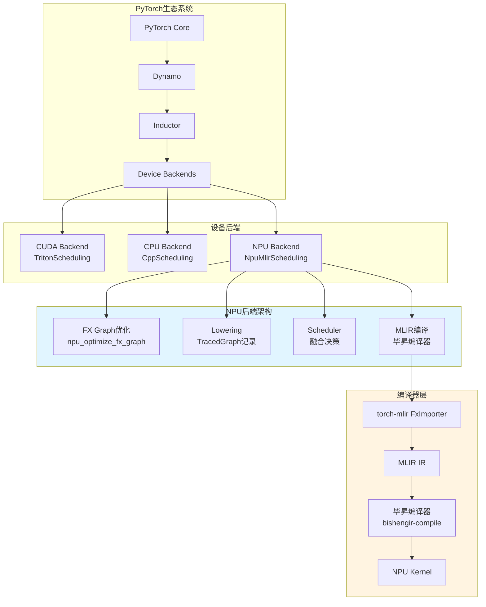
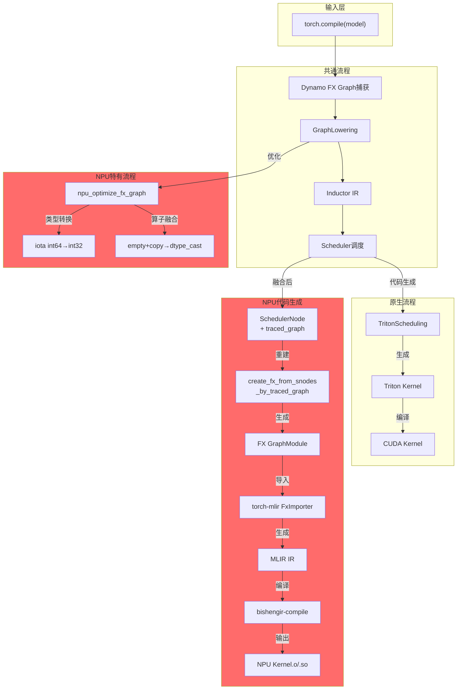
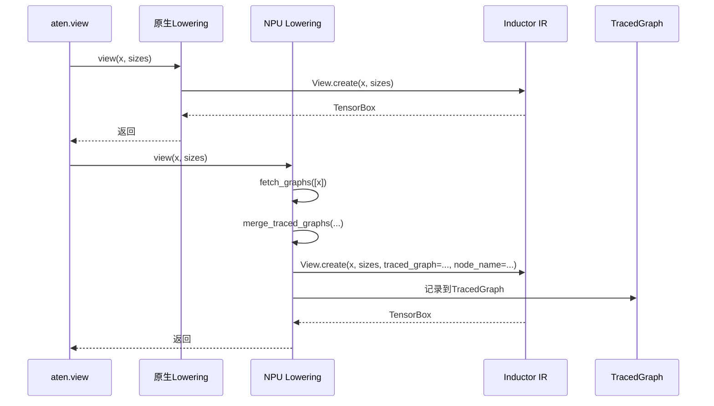
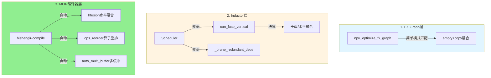
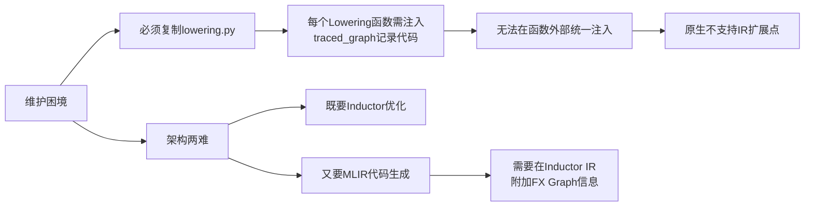
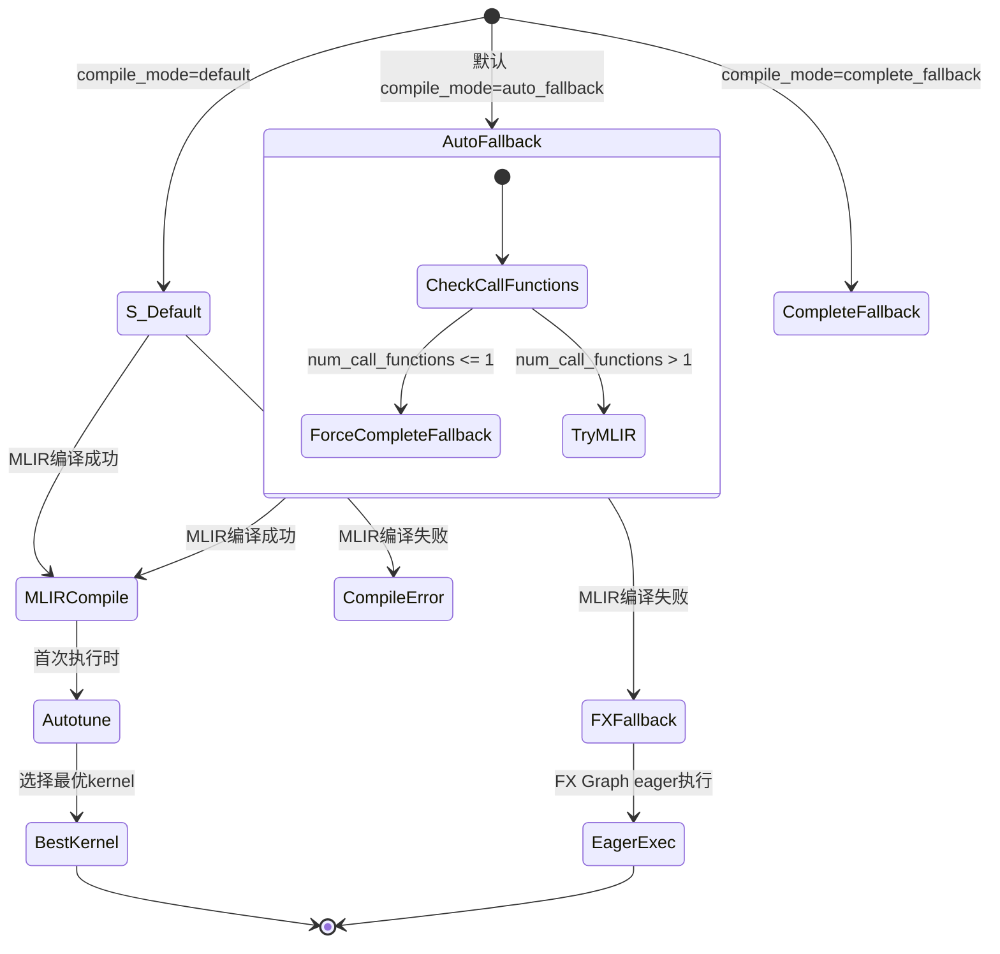
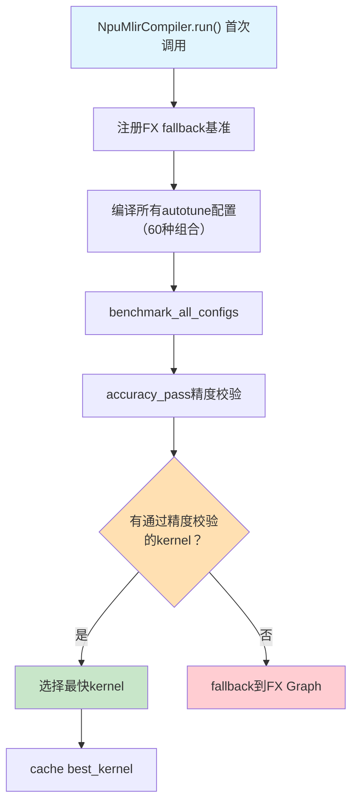

# NPU MLIR后端技术架构分析

> 基于torch_npu中Ascend NPU IR后端的深度技术分析，涵盖与PyTorch Inductor的集成机制、融合规则实现及维护挑战

---

## 目录

1. [架构概述](#架构概述)
2. [与原生Inductor的流程对比](#与原生inductor的流程对比)
3. [Lowering层的TracedGraph机制](#lowering层的tracedgraph机制)
4. [融合规则实现](#融合规则实现)
5. [代码生成与编译](#代码生成与编译)
6. [Monkey Patch与流程覆盖](#monkey-patch与流程覆盖)
7. [维护挑战与改进建议](#维护挑战与改进建议)
8. [编译模式状态机](#编译模式状态机)
9. [依赖关系](#依赖关系)
10. [初学者总结](#初学者总结)
11. [疑问与待确认事项](#疑问与待确认事项)
12. [参考资源](#参考资源)

---

## 架构概述

### 1.1 NPU MLIR后端在PyTorch生态中的位置



### 1.2 核心组件清单

| 组件 | 文件路径 | 职责 |
|------|----------|------|
| **入口插件** | `npu_inductor_plugin.py` | 注册NPU后端、Monkey Patch关键方法、禁用Triton |
| **Lowering覆盖** | `inductor_patch/lowering.py` | 完整的lowering实现，附加TracedGraph记录 |
| **IR扩展** | `inductor_patch/ir.py` | Monkey Patch Inductor IR类添加traced_graph支持 |
| **Scheduler扩展** | `inductor_patch/scheduler.py` | Scheduler buffer大小计算patch |
| **FakeTensor扩展** | `inductor_patch/fake_tensor.py` | FakeTensor fallback kernel处理 |
| **代码生成** | `codegen/mlir.py` | NpuMlirScheduling/NpuMlirKernel/NpuTritonKernel，重建FX Graph |
| **Wrapper代码生成** | `codegen/wrapper.py` | NpuMlirWrapperCodeGen - Python wrapper代码生成 |
| **C++ Launcher** | `codegen/cpp_wrapper.py` | NPU kernel的C++ launcher代码生成 |
| **编译器** | `mlir_compiler.py` | NpuMlirCompiler - 毕昇编译器封装、自动调优、精度对比 |
| **配置管理** | `config.py` | GENERATE_LIST/FALLBACK_LIST/compile_mode等NPU特有配置 |
| **分解规则** | `npu_decomp.py` | NPU特有分解规则，禁用部分aten分解 |
| **torch-mlir补丁** | `torch_mlir_patch.py` | Patch FxImporter支持符号形状、sympy表达式转换 |
| **NPU Fallback** | `npu_lowering.py` | 根据白名单/黑名单注册fallback算子 |
| **NPU Stream** | `npu_stream.py` | NPU多流管理（StreamRegistrator） |
| **NPU Meta** | `npu_meta.py` | NPU meta函数注册 |
| **工具函数** | `utils.py` | npu_optimize_fx_graph、MLIR处理、调试工具等 |

---

## 与原生Inductor的流程对比

### 2.1 完整流程对比图



### 2.2 流程一致性对比表

| 流程阶段 | 原生Inductor | NPU实现 | 差异说明 |
|---------|-------------|---------|---------|
| **FX Graph捕获** | Dynamo | Dynamo | ✅ 完全一致 |
| **符号形状系统** | ShapeEnv + SizeVarAllocator | 复用原生 | ✅ 完全一致 |
| **依赖分析** | MemoryDep/StarDep | 复用原生 | ✅ 完全一致 |
| **内存规划** | MemoryPlanningInfo | 复用原生 | ✅ 基本一致 |
| **FX预处理** | 无 | `npu_optimize_fx_graph` | 🔴 NPU特有 |
| **Lowering核心** | 标准IR转换 | 标准IR + TracedGraph记录 | 🔴 必须复制修改 |
| **融合决策** | `can_fuse_vertical` | 覆盖实现 | ⚠️ 部分覆盖 |
| **代码生成** | TritonScheduling | NpuMlirScheduling | 🔴 完全不同 |
| **编译执行** | Triton JIT | 毕昇编译器 | 🔴 NPU特有 |

---

## Lowering层的TracedGraph机制

### 3.1 核心问题：为什么必须复制lowering.py

NPU MLIR后端面临的核心挑战：**既要Inductor的融合优化，又要保留FX Graph供MLIR编译**。



### 3.2 TracedGraph类定义

```python
# inductor_patch/lowering.py:187-203
class TracedGraph:
    def __init__(self):
        self.graph = torch.fx.Graph()                    # FX Graph实例
        self.last_node: Optional[torch.fx.Node] = None   # 最后一个节点
        self.sym_nodes: Dict[str, torch.fx.Node] = {}    # 符号变量节点

    def __str__(self):
        return str(self.graph)

    def get_placeholder_names(self):
        # 获取所有输入placeholder名称（排除符号节点），用于kernel参数生成
        placeholder_names = set()
        for node in self.graph.nodes:
            if node.op == 'placeholder' and node.name not in self.sym_nodes:
                placeholder_names.add(node.name)
        return placeholder_names

    __repr__ = __str__
```

### 3.3 Lowering修改示例

以`view`算子为例，对比原生与NPU实现：

**原生实现**（简洁）：
```python
# torch/_inductor/lowering.py
@register_lowering(aten.view)
def view(x, sizes):
    return TensorBox(View.create(x.data, sizes))
```

**NPU实现**（附加记录）：
```python
# inductor_patch/lowering.py:1489-1495
def view(x, sizes):
    assert isinstance(x, TensorBox)
    assert isinstance(sizes, (list, tuple))

    # [NPU特有] 获取输入的traced_graph
    input_graphs = fetch_graphs([x.data, sizes])
    node_name = f'view_{next(node_id)}'

    # [NPU特有] 合并为新graph
    new_graph = merge_traced_graphs(input_graphs, aten.reshape, node_name)

    # [NPU特有] 创建IR时附加traced_graph
    return TensorBox(View.create(x.data, sizes,
                                  traced_graph=new_graph,
                                  node_name=node_name))
```

### 3.4 IR类扩展（Monkey Patch方式）

NPU **并非**通过继承扩展IR类，而是通过Monkey Patch向已有IR类注入`traced_graph`和`node_name`属性：

```python
# inductor_patch/ir.py:41-65
# 通过替换 Loops.create 类方法，在创建IR节点时注入 traced_graph
@classmethod
def _patch_loops_create(cls, *args, **kwargs):
    traced_graph = kwargs.pop("traced_graph", None)
    node_name = kwargs.pop("node_name", None)
    tb = kwargs.pop("traceback", None)
    r = cls(*args, **kwargs)
    r._post_init_setattr("origin_node", origin_node)
    r._post_init_setattr("traceback", tb or r.traceback)
    r._post_init_setattr("traced_graph", traced_graph)   # 注入traced_graph
    r._post_init_setattr("node_name", node_name)         # 注入node_name
    return ir.TensorBox.create(r)

# 替换原生方法
ir.Loops.get_name = _patch_loops_get_name
ir.Loops.get_traced_graph = _patch_loops_get_traced_graph
ir.Loops.create = _patch_loops_create

# Pointwise和Reduction也做了类似Patch
ir.Pointwise.constant_to_device = _patch_pointwise_constant_to_device  # ir.py:68-78
ir.Reduction.create = _patch_reduction_create                          # ir.py:80-200+
```

**关键机制**：`_post_init_setattr` 可以在dataclass冻结后动态添加属性，这使得NPU能在不修改原生IR类定义的情况下，将`traced_graph`附加到每个IR节点上。

---

## 融合规则实现

### 4.1 融合规则的三层架构

NPU的融合规则分布在三个层级：



### 4.2 FX Graph层预处理融合

```python
# utils.py:338-362
def npu_optimize_fx_graph(gm: torch.fx.GraphModule):
    """
    FX Graph层面的简单融合优化
    在Inductor处理前执行
    """
    aten_empty_nodes = set()
    for nd in gm.graph.nodes:
        # 1. iota类型转换优化（NPU硬件偏好int32）
        replace_iota_int64_to_int32(nd)

        # 2. empty + copy 模式融合为npu_dtype_cast
        if nd.target == torch.ops.aten.empty.memory_format and len(nd.users) == 1:
            aten_empty_nodes.add(nd)
        if nd.target == torch.ops.aten.copy.default:
            node0 = nd.args[0]
            if node0 in aten_empty_nodes:
                # 替换为单一的dtype转换操作
                op_target = torch.ops.npu.npu_dtype_cast.default
                # ... 节点替换逻辑
```

### 4.3 Inductor Scheduler层融合覆盖

NPU覆盖了关键的Scheduler方法以实现自定义融合决策：

```python
# npu_inductor_plugin.py:328-372
def npu_can_fuse_vertical(self, node1, node2):
    """
    NPU重写的垂直融合判断逻辑。
    与原生实现的主要区别：简化了融合条件，
    去除了原生中部分限制以适应MLIR编译器的融合能力。
    """
    node1_buf_names = node1.get_buffer_names()
    node1_op_names = node1.get_operation_names()
    computed_deps: OrderedSet[Dep] = OrderedSet()
    why = WhyNoFuse(node1, node2)

    for cd in node1.read_writes.writes:
        if not isinstance(cd, MemoryDep):
            continue
        for rd in node2.unmet_dependencies:
            if self.fusable_read_and_write(rd, cd):
                computed_deps.add(rd)

    for dep in node2.unmet_dependencies:
        if isinstance(dep, WeakDep) and self.fusable_weak_dep(dep, node1, node2):
            computed_deps.add(dep)

    remaining_deps = OrderedSet(
        dep.name for dep in node2.unmet_dependencies - computed_deps
    )
    if remaining_deps & node1_buf_names:
        why("memory deps did not match")
        return False
    for name in remaining_deps:
        if name not in self.name_to_buf:
            continue
        op_name = self.name_to_buf[name].defining_op.get_name()
        if node1_op_names & self.name_to_fused_node[op_name].ancestors:
            why("intermediate nodes between node1 & node2")
            return False
    return True

# npu_inductor_plugin.py:394-399 条件启用（需enable_graph_trace）
if anir_config.enable_graph_trace:
    Scheduler._codegen = wrap_scheduler_codegen(Scheduler._codegen)
    Scheduler.compute_ancestors = npu_compute_ancestors
    scheduler._prune_redundant_deps = _npu_prune_redundant_deps
    Scheduler.can_fuse_vertical = npu_can_fuse_vertical
    Scheduler._get_unmet_dep_nodes = _npu_get_unmet_dep_nodes
```

### 4.4 MLIR编译器层自动融合

毕昇编译器通过编译选项控制自动融合，各选项根据参数**有条件启用**：

```python
# mlir_compiler.py:103-151
def bisheng_compile(self, input_path, output_path,
                    auto_db=True, ops_reorder=False,
                    tiling_size=None, extra_command=None):
    bisheng_ir_compile_path = os.path.join(bisheng_install_path, "bishengir-compile")
    command = [
        bisheng_ir_compile_path,
        "-enable-hfusion-compile=true",            # 始终启用水平融合
        "--enable-bin-relocation=0",               # 始终禁用二进制重定位
        f"-block-dim={anir_config.block_dim}",     # block维度（默认48）
    ]
    # auto_db和ops_reorder根据自动调优参数有条件启用
    if auto_db:
        command.append("--enable-auto-multi-buffer=true")
    else:
        command.append("--enable-auto-multi-buffer=false")
    if ops_reorder:
        command.append("--enable-ops-reorder=true")
    else:
        command.append("--enable-ops-reorder=false")
    if tiling_size is not None:
        command.append(f"--hfusion-max-buffer-count-tuning={tiling_size}")
    if anir_config.autotune:
        command.append("-enable-tuning-mode=true")
    if self.dynamic:
        command.append("--enable-static-bare-ptr=false")
        command.append("--enable-symbol-analysis=true")
    if isinstance(extra_command, list) and extra_command:
        command += extra_command
    command += [input_path, "-o", output_path]
    subprocess.run(command, check=True, stdout=subprocess.DEVNULL,
                   stderr=subprocess.PIPE, timeout=600)
```

### 4.5 算子Fallback策略

NPU通过白名单/黑名单机制控制算子支持：

```python
# config.py:134-194
# GENERATE_LIST = POINTWISE_OPS + NON_POINTWISE_OPS（约58个算子）
POINTWISE_OPS = [
    aten.mul, aten.add, aten.sub, aten.div, aten.exp, aten.pow,
    aten.rsqrt, aten.neg, aten.lt, aten.gt, aten.ge, aten.le, aten.eq,
    aten.sigmoid, prims.convert_element_type,
    torch.ops.npu.npu_dtype_cast, torch.ops.npu.npu_dtype_cast_backward,
    aten.sin, aten.cos, aten.reciprocal, aten.relu, aten.where,
    aten.log, aten.sqrt, aten.clamp_min, aten.clamp_max,
    aten.bitwise_not, aten.tanh, aten.copy, aten.copy_,
    # ... 共约36个
]
NON_POINTWISE_OPS = [
    aten.split, aten.split_with_sizes, aten.cat, aten.squeeze,
    aten.unsqueeze, aten.expand, aten.repeat, aten.clone,
    aten.reshape, aten.var_mean, aten.sum, aten.mean, aten.full,
    aten.slice, aten.select, aten.permute, aten.amax,
    aten.scalar_tensor, aten.slice_scatter, aten.constant_pad_nd,
    aten.unbind, aten.lift_fresh_copy,
    # ... 共约22个
]
GENERATE_LIST = POINTWISE_OPS + NON_POINTWISE_OPS

# config.py:196-228 黑名单（约27个算子）
FALLBACK_LIST = [
    aten.mm, aten.bmm, aten.addmm,
    aten.convolution, aten.convolution_backward,
    aten._adaptive_avg_pool2d, aten.max_pool2d_with_indices,
    aten.embedding, aten.upsample_nearest2d,
    inductor_prims.lookup_seed, inductor_prims.random, prims.device_put,
    # ... 共约27个算子
]
```

**Fallback策略**（两个独立配置维度）：

`fallback_to_aten_mode`（`config.py:113`）控制算子级别fallback：
- `"exclude"`（默认）：不在GENERATE_LIST中的算子全部fallback
- `"include"`：仅FALLBACK_LIST中的算子fallback
- `"off"`：不做任何fallback

`config.mode`（`config.py:44`）控制全局编译模式：
- `"O1"`（默认）：正常编译模式
- `"O0"`：所有算子fallback到aten（调试模式，`npu_lowering.py:51-53`中清空decompositions）

---

## 代码生成与编译

### 5.1 重建FX Graph流程

Scheduler融合后，NPU需要重建FX Graph供MLIR编译：

```python
# codegen/mlir.py:225-270
def create_fx_from_snodes_by_traced_graph(
    snodes: List[scheduler.SchedulerNode],
    triton_kernel: TritonKernel     # NpuTritonKernel实例
):
    # 1. 设置节点名称并收集/合并所有traced_graph
    for snode in snodes:
        snode.node.data.traced_graph.last_node.name = snode.node.get_name()
    if len(snodes) == 1:
        traced_graph = snodes[0].node.data.traced_graph
    else:
        traced_graph = merge_fx_graphs([snode.node.data.traced_graph for snode in snodes])

    # 2. 提取输入/输出，跟踪非连续张量索引
    inputs, call_inputs = [], []
    for node in traced_graph.graph.nodes:
        if node.op == 'placeholder':
            call_inputs.append(node.target)
            inputs.append(node.meta['val'])
    non_contiguous_indices = {
        "inputs": [i for i, inp in enumerate(inputs) if torch.is_tensor(inp) and not inp.is_contiguous()]
    }

    # 3. 确定输出（处理mutation/alias）
    call_outputs = []
    for snode in snodes:
        if snode.has_aliasing_or_mutation():
            # 处理 inplace mutation 和 alias 情况
            ...
        elif snode.node.get_name() not in (V.graph.removed_buffers | V.graph.inplaced_to_remove):
            call_outputs.append(snode.node.get_name())
    call_args, mutated_indices = find_common_positions(call_inputs, call_outputs)

    # 4. 创建GraphModule并用make_fx获取最终版本
    traced_graph.graph.output(tuple(outputs))
    traced_graph.graph.lint()
    gm = torch.fx.GraphModule(torch.nn.Module(), traced_graph.graph)
    gm.recompile()
    def runnable_gm(*args):
        return torch.fx.Interpreter(gm).run(*args)
    with V.graph.fake_mode:
        gm = make_fx(runnable_gm)(*inputs)
    view_to_reshape(gm)  # 将view替换为reshape以兼容MLIR

    return (gm, call_args, {"num_outputs": num_outputs,
                            "non_contiguous_indices": non_contiguous_indices,
                            "mutated_indices": mutated_indices})
```

### 5.2 MLIR导入与编译

```python
# codegen/mlir.py:273-392
class NpuMlirScheduling(SIMDScheduling):
    kernel_type = NpuTritonKernel

    def define_kernel(self, src_code, mlir_kernel, traced_graph, mode=None):
        if mode is None:
            mode = anir_config._get_compile_mode()  # 默认'auto_fallback'

        # 自动降级：call_function数<=1的kernel强制complete_fallback
        num_call_functions = get_num_call_functions(mlir_kernel._gm)
        if num_call_functions <= 1 or kernel_name in anir_config.force_fallback_kernel_names:
            mode = "complete_fallback"

        kernel_meta = {
            'device_str': current_device.type,
            'device_index': current_device.index,
            'num_outputs': mlir_kernel.num_outputs,
            'non_contiguous_indices': mlir_kernel.non_contiguous_indices,
            'dynamic': mlir_kernel._is_dynamic,
            'mutated_indices': mlir_kernel.mutated_indices,
            'traced_graph_cache': anir_config.traced_graph_cache,
            'traced_graph_hash': traced_graph_hash,
            'num_call_functions': num_call_functions,
            **kernel_info    # MLIR处理后的命名算子信息
        }

        # 三种编译模式
        if mode == "auto_fallback":
            # MLIR编译 + 失败时自动回退到FX Graph执行
            compile_wrapper.writeline(
                f"{kernel_name} = async_compile.mlir_auto_fallback({kernel_name!r}, '''")
        elif mode == "complete_fallback":
            # 完全不编译MLIR，直接使用FX Graph eager执行
            compile_wrapper.writeline(
                f"async_compile.import_fx({kernel_name!r}, kernel_meta={kernel_meta})")
        elif mode == "default":
            # 纯MLIR编译（不带自动回退）
            compile_wrapper.writeline(
                f"async_compile.mlir({kernel_name!r}, '''")

        # auto_fallback和complete_fallback模式下，将FX Graph保存到磁盘供回退使用
        if mode in ["complete_fallback", "auto_fallback"]:
            dump_path = os.path.join(os.getenv("TORCHINDUCTOR_CACHE_DIR"),
                                     anir_config.traced_graph_cache, ...)
            to_folder(mlir_kernel._gm, dump_path, ...)

        wrapper.src_to_kernel[kernel_key] = kernel_name
```

### 5.3 自动调优机制

NPU编译器支持多维度自动调优：

```python
# mlir_compiler.py:335-343
def get_autotune_config(self):
    def get_tiling_range():
        return [i for i in range(-10, 20, 2)]   # 15个值
    compile_args = []
    for ops_reorder in [True, False]:            # 2种
        for auto_db in [True, False]:            # 2种
            for tiling_size in get_tiling_range():
                compile_args.append((tiling_size, ops_reorder, auto_db))
    return compile_args  # 15 * 2 * 2 = 60种组合
```

**调优维度**：
1. `tiling_size`：tiling大小参数（-10, -8, ..., 16, 18，共15个值）
2. `ops_reorder`：算子重排序开关（True/False）
3. `auto_db`：自动多缓冲开关（True/False）

当`anir_config.autotune=False`时，仅使用默认参数`(None, True, True)`单次编译。

### 5.4 在线精度对比

NPU特有的精度验证机制，通过环境变量`ANIR_ONLINE_ACC_COMP=1`启用：

```python
# mlir_compiler.py:520-596
def acc_compare_and_dump(self, *args, **kwargs):
    # 1. 注册FX参考实现作为对比基准
    self.register_fx_fallback(self.kernel_meta)
    launcher_fx = self.launchers[1]
    launcher = self.launchers[0]

    # 2. 执行FX参考实现（bfloat16提升为float32以获得更高精度基准）
    fx_outputs = [clone_preserve_strides(arg).to(torch.float32) if arg.dtype == torch.bfloat16
                  else clone_preserve_strides(arg) for arg in args[-self.num_outputs:]]
    fx_inputs = [clone_preserve_strides(arg) if isinstance(arg, torch.Tensor) else arg
                 for arg in args[:-self.num_outputs]]
    launcher_fx(*(fx_inputs + fx_outputs), **kwargs)

    # 3. 执行MLIR kernel（处理动态形状参数变换）
    output = launcher(*args_new, **kwargs)

    # 4. 逐输出精度对比
    has_acc_error = False
    for idx, (actual, expected) in enumerate(zip(args[num_inputs:], fx_outputs)):
        acc_comp_tol = anir_config.acc_comp_tol.get(actual.dtype,
                                                      anir_config.acc_comp_tol['default'])
        matches = torch.isclose(actual, expected,
                                rtol=acc_comp_tol['rtol'],
                                atol=acc_comp_tol['atol'], equal_nan=True)
        if not matches.all():
            # 生成详细的mismatch报告（包含百分比、最大绝对/相对误差）
            has_acc_error = True
            args[idx + num_inputs].copy_(expected)  # 用FX结果修正输出

    # 5. dump精度失败子图
    if has_acc_error and anir_config.fx_subgraph_dump_path:
        data_dump_path = self.fx_subgraph_dump('acc_failed')
        self.data_dump_fake(*args, dump_path=data_dump_path)
```

**精度容差配置**（`config.py:33-38`）：
| dtype | rtol | atol |
|-------|------|------|
| float32 | 1.3e-6 | 1e-5 |
| float16 | 1e-3 | 1e-5 |
| bfloat16 | 1.6e-2 | 1e-5 |

### 5.5 Kernel运行时执行流程

`NpuMlirCompiler.run()` (`mlir_compiler.py:610-688`) 是kernel实际执行入口：

```python
def run(self, *args, **kwargs):
    # 1. 处理非连续输入张量 → contiguous()
    # 2. 处理非连续输出张量 → 创建连续临时buffer
    # 3. 首次执行时触发autotune（注册FX fallback + benchmark所有配置）
    # 4. 选择最优launcher执行
    # 5. 如果开启在线精度对比，走acc_compare_and_dump路径
    # 6. 动态形状时，将args展开为 (tensor, tensor, 0) + size + stride 格式
    output = launcher(*args, **kwargs)
    # 7. 将非连续输出从临时buffer拷贝回原始张量
    return output
```

---

## Monkey Patch与流程覆盖

### 6.1 Monkey Patch清单

NPU通过Monkey Patch修改PyTorch原生行为：

| Patch目标 | 原属模块 | 覆盖目的 | 源码位置 |
|----------|---------|---------|---------|
| `_triton.has_triton` | torch.utils | 禁用Triton检测，强制走MLIR路径 | `npu_inductor_plugin.py:68-69` |
| `_TorchCompileInductorWrapper.__call__` | torch | 恢复compile_fx入口（覆盖torch_npu其他patch） | `npu_inductor_plugin.py:116-121` |
| `torch._dynamo.utils.run_node` | dynamo | 处理npu_fusion_attention的seq_len参数类型 | `npu_inductor_plugin.py:147-200` |
| `AotAutograd.__call__` | dynamo.backends | 包装fw/bw/inference compiler注入npu_optimize_fx_graph | `npu_inductor_plugin.py:209-222` |
| `Scheduler._codegen` | inductor | 融合前重算last_usage（基于traced_graph placeholder） | `npu_inductor_plugin.py:255-265` |
| `Scheduler.compute_ancestors` | inductor | 自定义祖先节点计算 | `npu_inductor_plugin.py:267-286` |
| `scheduler._prune_redundant_deps` | inductor | 自定义WeakDep依赖剪枝 | `npu_inductor_plugin.py:288-326` |
| `Scheduler.can_fuse_vertical` | inductor | 自定义垂直融合决策 | `npu_inductor_plugin.py:328-372` |
| `Scheduler._get_unmet_dep_nodes` | inductor | 自定义未满足依赖节点获取 | `npu_inductor_plugin.py:374-392` |
| `F.avg_pool2d` | torch.nn.functional | bfloat16输入先转float32再转回 | `npu_inductor_plugin.py:401-412` |
| `ir.Loops.create` | inductor.ir | 注入traced_graph/node_name属性 | `inductor_patch/ir.py:47-65` |
| `ir.Pointwise.constant_to_device` | inductor.ir | 支持traced_graph透传 | `inductor_patch/ir.py:68-78` |
| `ir.Reduction.create` | inductor.ir | 支持traced_graph透传 | `inductor_patch/ir.py:80-200+` |
| `fx_importer.FxImporter.import_stateless_graph` | torch-mlir | 添加符号形状范围约束 | `torch_mlir_patch.py:51-124` |
| `fx_importer.sympy_expr_to_semi_affine_expr` | torch-mlir | 扩展sympy到MLIR仿射表达式转换（支持Pow等） | `torch_mlir_patch.py:127-193` |

> 注：Scheduler相关patch（第5-9项）仅在`anir_config.enable_graph_trace=True`（默认开启）时生效。

### 6.2 关键Patch实现

**禁用Triton**（强制使用MLIR路径）：

```python
# npu_inductor_plugin.py:48,68-69
from torch.utils import _triton
_triton.has_triton = lambda: False
_triton.has_triton_package = lambda: False
```

**AotAutograd包装**（注入FX Graph优化）：

```python
# npu_inductor_plugin.py:202-222
def wrap_compiler(fn):
    def npu_compiler(gm: torch.fx.GraphModule, example_inputs, *args, **kwargs):
        npu_optimize_fx_graph(gm)   # 在编译前优化FX Graph
        return fn(gm, example_inputs, *args, **kwargs)
    return npu_compiler

def wrap_aot_autograd(fn):
    def npu_aot_autograd(*args, **kwargs):
        _register_npu_inductor_fallbacks()  # 注册fallback算子
        # 包装fw/bw/inference三个compiler
        for name in ['fw_compiler', 'bw_compiler', 'inference_compiler']:
            if name in kwargs:
                kwargs[name] = wrap_compiler(kwargs[name])
        return fn(*args, **kwargs)
    return npu_aot_autograd

AotAutograd.__call__ = wrap_aot_autograd(AotAutograd.__call__)
```

### 6.3 torch-mlir Patch

NPU需要Patch torch-mlir以支持符号形状和扩展的sympy表达式：

**Patch 1：符号形状范围约束**（`torch_mlir_patch.py:51-124`）

```python
def _patch_import_stateless_graph(self, g: Graph, ...):
    # 从placeholder节点的meta['val']中提取符号维度
    def get_range_constraints(graph: torch.fx.Graph):
        range_constraints = {}
        for nd in graph.find_nodes(op="placeholder"):
            if isinstance(nd.meta['val'], torch.Tensor):
                for s in nd.meta['val'].size():
                    if isinstance(s, torch.SymInt):
                        for symbol in s._sympy_().free_symbols:
                            # 硬编码范围[128, 1024]
                            range_constraints[symbol] = ValueRanges(128, 1024)
            else:
                for symbol in nd.meta['val']._sympy_().free_symbols:
                    range_constraints[symbol] = ValueRanges(128, 1024)
        return range_constraints

    # 注入到torch-mlir的symbolic guards
    self._cc._symbolic_guards = {
        str(k): RangeConstraint(_sympy_int_to_int(v.lower, math.ceil),
                                _sympy_int_to_int(v.upper, math.floor))
        for k, v in range_constraints.items()
    }
    # ... 后续创建FuncOp和导入节点
```

**Patch 2：sympy表达式到MLIR仿射表达式转换**（`torch_mlir_patch.py:127-189`）

```python
# 扩展原生转换器，增加对sympy.Pow和FloorDiv等表达式的支持
def _patch_sympy_expr_to_semi_affine_expr(expr, symbols_map):
    if isinstance(expr, sympy.Pow):
        base, exp = expr.args
        assert isinstance(exp, (int, sympy.Integer)) and exp > 0
        affine_expr = AffineConstantExpr.get(1)
        for _ in range(exp):
            affine_expr = AffineMulExpr.get(affine_expr,
                sympy_expr_to_semi_affine_expr(base, symbols_map))
        return affine_expr
    elif isinstance(expr, FloorDiv):
        return AffineFloorDivExpr.get(...)
    # ... 其他类型处理

# 同时替换两个方法
fx_importer.FxImporter.import_stateless_graph = _patch_import_stateless_graph
fx_importer.sympy_expr_to_semi_affine_expr = _patch_sympy_expr_to_semi_affine_expr
```

---

## 维护挑战与改进建议

### 7.1 当前维护困境

**文件大小对比**：

| 文件 | 原生PyTorch | NPU实现 | 说明 |
|------|------------|---------|------|
| lowering.py | ~5,000行 | 7,440行 | 大部分复制自原生，每个函数注入TracedGraph记录 |
| ir.py | ~3,000行 | ~700行 | Monkey Patch方式，非完整复制 |

**风险场景**：

1. **PyTorch版本升级**：原生lowering新增aten算子，NPU需手动同步
2. **Bug修复不同步**：原生修复的bug在NPU版本中可能仍存在
3. **IR接口变更**：原生IR类新增参数，NPU需全面修改

### 7.2 根因分析



### 7.3 改进建议

#### 短期方案（当前可行）

1. **建立自动化同步工具**
```python
class LoweringSyncTool:
    """自动检测并同步PyTorch lowering变更"""

    def diff_and_patch(self, native_lowering, npu_lowering):
        # 1. 对比两个文件差异
        diff = self.compute_diff(native_lowering, npu_lowering)

        # 2. 标记NPU特有修改
        npu_specific = self.identify_npu_specific_changes(npu_lowering)

        # 3. 生成合并建议
        return self.generate_merge_suggestion(diff, npu_specific)

    def auto_sync(self):
        # 定期执行（CI/CD）
        native = fetch_pytorch_lowering()
        npu = load_npu_lowering()
        suggestion = self.diff_and_patch(native, npu)
        create_pull_request(suggestion)
```

2. **代码标记规范**
```python
# 在NPU lowering中明确标记修改点
def view(x, sizes):
    # [NPU-DIFF-START] 获取traced_graph
    input_graphs = fetch_graphs([x.data, sizes])
    new_graph = merge_traced_graphs(...)
    # [NPU-DIFF-END]

    return TensorBox(View.create(x.data, sizes,
                                  # [NPU-EXT] 附加参数
                                  traced_graph=new_graph,
                                  node_name=node_name))
```

#### 中期方案（PyTorch新特性）

**利用PyTorch #146942（FX Backend）**：

```python
# PyTorch 2025年新增的FX Backend支持
class FxScheduling:
    """将Inductor优化后的IR输出为FX Graph"""

    def codegen_node(self, node):
        fx_graph = node.get_fx_graph()  # 直接获取优化后的FX
        return fx_graph

# NPU未来可简化为
class NpuFxScheduling(FxScheduling):
    def codegen_node(self, node):
        fx_graph = super().codegen_node(node)
        # 直接送给torch-mlir
        mlir_module = FxImporter().import_stateless_graph(fx_graph.graph)
        return self.compile_with_bisheng(mlir_module)
```

**优势**：
- 无需复制lowering.py
- 自动跟随PyTorch演进
- 减少维护成本80%+

#### 长期方案（架构改进）

1. **推动PyTorch原生支持IR扩展**
```python
# 理想状态：原生支持traced_graph扩展
class View:
    def create(cls, *args, **kwargs):
        # 原生支持扩展点
        traced_graph = kwargs.pop('traced_graph', None)
        node_name = kwargs.pop('node_name', None)
        # ... 原生逻辑
```

2. **参与torch-mlir社区**
- 贡献Inductor兼容层
- 推动符号形状标准支持
- 添加毕昇编译器后端

### 7.4 技术债务清单

| 债务项 | 风险等级 | 影响 | 建议处理时间 |
|--------|---------|------|-------------|
| lowering.py复制 | 🔴 高 | 版本不同步 | 6个月内迁移到FX Backend |
| ir.py复制 | 🔴 高 | IR变更不兼容 | 同上 |
| Scheduler覆盖 | 🟡 中 | 融合策略差异 | 评估后合并到原生 |
| Monkey Patch | 🟡 中 | 升级风险 | 逐步替换为标准扩展 |

---

## 编译模式状态机

### 8.1 compile_mode状态转换

NPU后端有三种编译模式，存在运行时自动降级：



### 8.2 Autotune首次执行流程



---

## 依赖关系

- **上游（调用方）**：`torch.compile()` → Dynamo → AotAutograd → Inductor `compile_fx`
- **下游（被调用）**：
  - torch-mlir：FX Graph到MLIR IR转换
  - 毕昇编译器（bishengir-compile）：MLIR IR到NPU二进制编译
  - torch_npu._C.mlir：加载编译后的kernel二进制
- **外部依赖**：
  - PyTorch Inductor（重度依赖，通过Monkey Patch集成）
  - torch-mlir（通过Patch扩展）
  - 毕昇编译器（通过subprocess调用）
  - NPU硬件驱动

---

## 初学者总结

NPU MLIR后端的核心任务是：**让PyTorch模型能在华为昇腾NPU上高效编译运行**。

它的工作原理可以用一句话概括：在PyTorch Inductor编译流程中"搭便车"——复用Inductor的图优化和算子融合能力，但在最后的代码生成阶段，不生成Triton/CUDA代码，而是重建FX Graph，通过torch-mlir转为MLIR IR，再调用毕昇编译器生成NPU可执行的kernel。

**关键设计选择**：
1. **TracedGraph机制**——Inductor在lowering时会丢弃FX Graph信息（转为内部IR），但NPU的MLIR编译器需要FX Graph作为输入。因此NPU在每个lowering函数中"偷偷记录"一份FX Graph副本（TracedGraph），在融合后再拼接起来。
2. **大量Monkey Patch**——由于PyTorch Inductor没有为第三方后端预留足够的扩展点，NPU不得不通过运行时替换方法来注入自己的逻辑。这虽然能工作，但升级PyTorch版本时容易出问题。
3. **自动调优 + 精度对比**——编译时尝试60种参数组合，运行时挑最快且精度达标的kernel。如果所有编译版本都不行，还能自动回退到FX Graph的eager执行。

### 建议下一步探索

- PyTorch Inductor的Scheduler融合机制（理解融合决策的上下文）
- torch-mlir的FxImporter工作原理（理解FX到MLIR的转换）
- 毕昇编译器的优化Pass（理解MLIR到NPU二进制的编译）

---

## 疑问与待确认事项

- `torch_mlir_patch.py`中符号形状范围硬编码为`[128, 1024]`，这个范围是否适用于所有模型？是否应该从用户配置或dynamic shape hints中获取？
- `inductor_patch/scheduler.py`中的buffer大小计算与原生实现的具体差异和必要性需要进一步分析
- `npu_stream.py`中的多流管理（StreamRegistrator）在整个编译流程中的集成方式和触发条件不明确
- `config.py`中`enable_graph_trace=True`默认开启，如果关闭会走什么路径？是否有非TracedGraph模式的fallback？
- `NpuTritonKernel`与`NpuMlirKernel`的分工关系——前者用于Scheduler交互，后者用于实际MLIR codegen，两者的生命周期和协作机制需要更清晰的文档

---

## 参考资源

### 源码路径

```
torch_npu/
├── torch_npu/_inductor/
│   ├── ascend_npu_ir/                         # NPU MLIR后端主目录
│   │   ├── ascend_npu_ir/
│   │   │   ├── npu/
│   │   │   │   ├── npu_inductor_plugin.py     # 入口插件（474行）
│   │   │   │   ├── inductor_patch/
│   │   │   │   │   ├── __init__.py            # 初始化，导入各patch
│   │   │   │   │   ├── lowering.py            # Lowering覆盖（7,440行）
│   │   │   │   │   ├── ir.py                  # IR类Monkey Patch（~700行）
│   │   │   │   │   ├── scheduler.py           # Scheduler buffer计算patch
│   │   │   │   │   └── fake_tensor.py         # FakeTensor fallback处理
│   │   │   │   ├── codegen/
│   │   │   │   │   ├── mlir.py                # NpuMlirScheduling代码生成（469行）
│   │   │   │   │   ├── wrapper.py             # NpuMlirWrapperCodeGen
│   │   │   │   │   ├── cpp_wrapper.py         # C++ launcher生成
│   │   │   │   │   └── akg.py                 # AKG调度（备选后端）
│   │   │   │   ├── mlir_compiler.py           # NpuMlirCompiler编译器封装（665行）
│   │   │   │   ├── npu_decomp.py              # 分解规则
│   │   │   │   ├── npu_lowering.py            # Fallback算子注册（59行）
│   │   │   │   ├── npu_stream.py              # NPU多流管理
│   │   │   │   ├── npu_meta.py                # NPU meta函数注册
│   │   │   │   ├── npu_patch_deprecated.py    # 废弃patch兼容
│   │   │   │   ├── torch_mlir_patch.py        # torch-mlir补丁
│   │   │   │   └── utils.py                   # 工具函数（824行）
│   │   │   ├── config.py                      # NPU配置
│   │   │   └── cache.py                       # 编译缓存管理
│   │   └── codecache.py                       # CustomAsyncCompile
│   └── lowering.py                            # 简单fallback封装（280行）
```

### 相关文档

- PyTorch Inductor文档：https://pytorch.org/docs/stable/torch.compiler_inductor.html
- torch-mlir项目：https://github.com/llvm/torch-mlir
- 毕昇编译器文档：需内部获取

### 关键论文/PR

- PyTorch #146942：[Inductor] FX backend via Wrapper IR
- PyTorch #153532：[RFC] Custom pass registration interface
- torch-mlir FxImporter扩展文档

---

*文档版本: 2.0*
*最后更新: 2026-03-12*
*作者: AI Assistant*
*基于: torch_npu Inductor MLIR后端代码分析*
*变更: v2.0 - 修正IR扩展机制描述、Fallback策略、行号引用、自动调优组合数；补充缺失组件、Monkey Patch完整清单、编译模式状态机、依赖关系、初学者总结等章节*

## Related Pages

- [[llm/02_training/torch_compile/overview]]
- [[NPU_Inductor_Backend_Mechanism]]
- [[npu_compile]]
