# PyTorch Inductor 完整技术流程验证分析

> 基于实际代码的深度技术分析，涵盖从FX Graph到Inductor IR再到Triton IR的完整编译流程

---

## 目录

1. [概述](#概述)
2. [后端选择与配置机制](#后端选择与配置机制)
3. [阶段1: Graph Lowering (FX Graph → Inductor IR)](#阶段1-graph-lowering-fx-graph--inductor-ir)
4. [阶段2: IR Optimization (Inductor IR 优化)](#阶段2-ir-optimization-inductor-ir-优化)
5. [阶段3: Scheduling (调度与融合)](#阶段3-scheduling-调度与融合)
6. [阶段4: Code Generation (Inductor IR → Triton IR)](#阶段4-code-generation-inductor-ir--triton-ir)
7. [CUDA Graphs 后端详解](#cuda-graphs-后端详解)
8. [昇腾NPU适配层实现](#昇腾npu适配层实现)
9. [编译入口与数据流](#编译入口与数据流)
10. [后端扩展机制](#后端扩展机制)
11. [自定义融合规则](#自定义融合规则)
12. [完整流程示例](#完整流程示例)
13. [参考资源](#参考资源)

---

## 概述

### PyTorch Inductor 编译架构

PyTorch Inductor 是 PyTorch 2.0 引入的默认深度学习编译器后端，负责将捕获的 FX Graph 编译成高性能的机器代码。其核心架构包括：

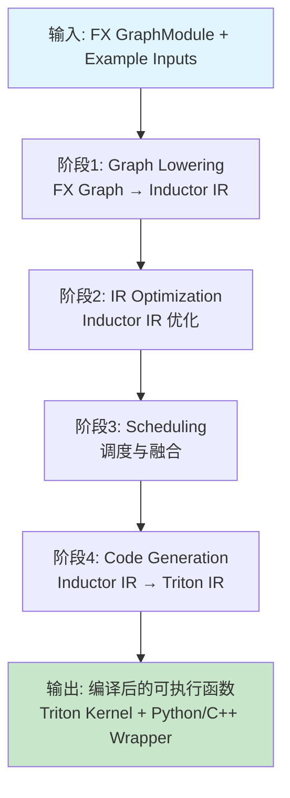
```mermaid
graph TB
    A["输入: FX GraphModule + Example Inputs"] --> B["阶段1: Graph Lowering<br/>FX Graph → Inductor IR"]
    B --> C["阶段2: IR Optimization<br/>Inductor IR 优化"]
    C --> D["阶段3: Scheduling<br/>调度与融合"]
    D --> E["阶段4: Code Generation<br/>Inductor IR → Triton IR"]
    E --> F["输出: 编译后的可执行函数<br/>Triton Kernel + Python/C++ Wrapper"]

    style A fill:#e1f5fe
    style F fill:#c8e6c9
```

### 完整编译流程时序图

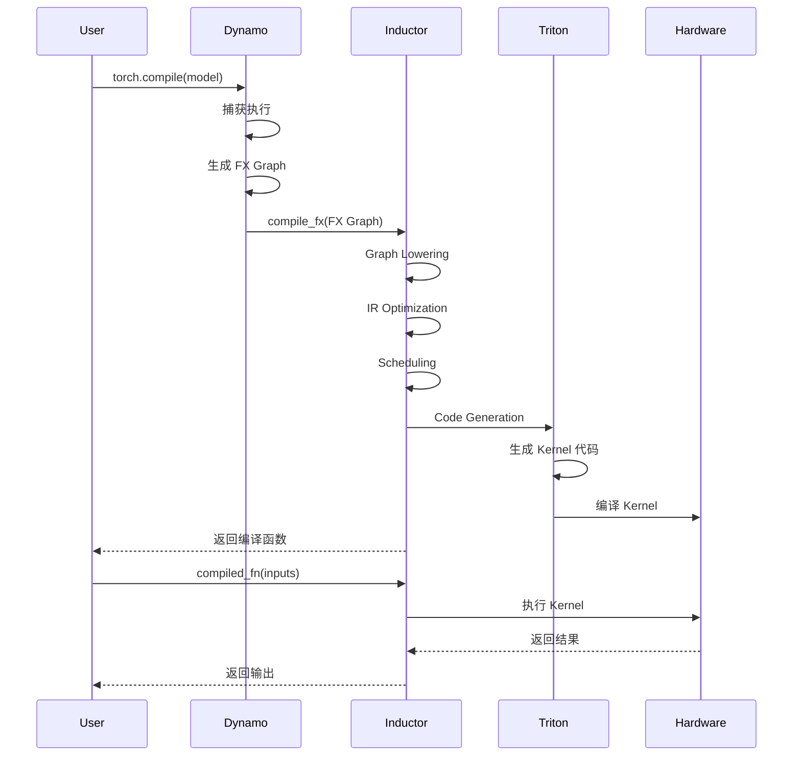
```mermaid
sequenceDiagram
    participant User
    participant Dynamo
    participant Inductor
    participant Triton
    participant Hardware

    User->>Dynamo: torch.compile(model)
    Dynamo->>Dynamo: 捕获执行
    Dynamo->>Dynamo: 生成 FX Graph
    Dynamo->>Inductor: compile_fx(FX Graph)

    Inductor->>Inductor: Graph Lowering
    Inductor->>Inductor: IR Optimization
    Inductor->>Inductor: Scheduling
    Inductor->>Triton: Code Generation

    Triton->>Triton: 生成 Kernel 代码
    Triton->>Hardware: 编译 Kernel

    Inductor-->>User: 返回编译函数

    User->>Inductor: compiled_fn(inputs)
    Inductor->>Hardware: 执行 Kernel
    Hardware-->>Inductor: 返回结果
    Inductor-->>User: 返回输出
```

---

## 后端选择与配置机制

### 1. 后端注册机制

后端注册的核心实现在 [torch/_inductor/codegen/common.py](file:///e:\97-codes\torch_parallel\pytorch\torch\_inductor\codegen\common.py#L408)：

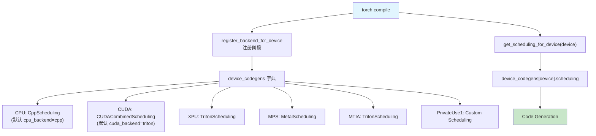
```mermaid
flowchart TD
    A["torch.compile"] --> B["register_backend_for_device<br/>注册阶段"]
    B --> C["device_codegens 字典"]

    C --> D1["CPU: CppScheduling<br/>(默认 cpu_backend=cpp)"]
    C --> D2["CUDA: CUDACombinedScheduling<br/>(默认 cuda_backend=triton)"]
    C --> D3["XPU: TritonScheduling"]
    C --> D4["MPS: MetalScheduling"]
    C --> D5["MTIA: TritonScheduling"]
    C --> D6["PrivateUse1: Custom Scheduling"]

    A --> G["get_scheduling_for_device(device)"]
    G --> H["device_codegens[device].scheduling"]
    H --> I["Code Generation"]

    style A fill:#e1f5fe
    style I fill:#c8e6c9
```

> **注意**：每个设备在 `device_codegens` 中只注册一个 scheduling 实现。CPU/CUDA 的具体 scheduling 类型取决于 `config.cpu_backend` 和 `config.cuda_backend` 配置。例如 CPU 默认使用 `CppScheduling`（`cpu_backend="cpp"`），CUDA 默认使用 `TritonScheduling`（`cuda_backend="triton"`），可通过配置切换为 `HalideScheduling` 或 `PallasScheduling`。


### 2. 后端注册与选择接口

**注册后端**（[common.py:408](file:///e:\97-codes\torch_parallel\pytorch\torch\_inductor\codegen\common.py#L408)）：

```python
def register_backend_for_device(
    device: str,
    device_scheduling: SchedulingConstructor,
    device_wrapper_codegen: WrapperConstructor,
    device_cpp_wrapper_codegen: Optional[WrapperConstructor] = None,
    device_fx_wrapper_codegen: Optional[WrapperConstructor] = None,
    device_custom_pass: Optional[CustomGraphModulePass] = None,
    device_custom_config: Optional[ConfigModule] = None,
) -> None:
    ...
```

**获取 Scheduling**（[common.py:473](file:///e:\97-codes\torch_parallel\pytorch\torch\_inductor\codegen\common.py#L473)）：

```python
def get_scheduling_for_device(device: str) -> Optional[SchedulingConstructor]:
    if device in device_codegens:
        return device_codegens[device].scheduling
    return None
```

**获取 Wrapper Codegen**（[common.py:477](file:///e:\97-codes\torch_parallel\pytorch\torch\_inductor\codegen\common.py#L477)）：

```python
def get_wrapper_codegen_for_device(
    device: str, cpp_wrapper: bool = False, fx_wrapper: bool = False
) -> Optional[WrapperConstructor]:
    if device in device_codegens:
        wrapper_codegen_obj: DeviceCodegen = device_codegens[device]
        if fx_wrapper:
            return wrapper_codegen_obj.fx_wrapper_codegen
        elif cpp_wrapper:
            return wrapper_codegen_obj.cpp_wrapper_codegen
        else:
            return wrapper_codegen_obj.wrapper_codegen
    return None
```

### 3. 配置系统

配置系统在 [torch/_inductor/config.py](file:///e:\97-codes\torch_parallel\pytorch\torch\_inductor\config.py) 中定义：

```python
# CPU 后端选择（默认 cpp）
cpu_backend: Literal["cpp", "triton", "halide", "pallas"] = "cpp"

# CUDA 后端选择
cuda_backend: Literal["triton", "halide", "pallas"] = "triton"

# 使用 C++ wrapper
cpp_wrapper: bool = os.environ.get("TORCHINDUCTOR_CPP_WRAPPER", "0") == "1"

# 使用 FX wrapper
fx_wrapper: bool = os.environ.get("TORCHINDUCTOR_FX_WRAPPER", "0") == "1"

# 内存规划
memory_planning: bool = os.environ.get("TORCHINDUCTOR_MEMORY_PLANNING", "0") == "1"

# 内存池策略
memory_pool: Literal["none", "intermediates", "outputs", "combined"] = "intermediates"
```

### 4. 模式选择

在 [torch/_inductor/__init__.py](file:///e:\97-codes\torch_parallel\pytorch\torch\_inductor\__init__.py#L351) 中定义了不同的编译模式：

```python
mode_options: dict[str, dict[str, bool]] = {
    "default": {},
    # lite backend for opt-in optimizations
    "lite": lite_mode_options,
    # enable cudagraphs
    "reduce-overhead": {
        "triton.cudagraphs": True,
    },
    # enable max-autotune
    "max-autotune-no-cudagraphs": {
        "max_autotune": True,
        "coordinate_descent_tuning": True,
    },
    # enable max-autotune
    # enable cudagraphs
    "max-autotune": {
        "max_autotune": True,
        "triton.cudagraphs": True,
        "coordinate_descent_tuning": True,
    },
}
```

使用方式：

```python
# 启用 CUDA Graphs
compiled_model = torch.compile(model, mode="reduce-overhead")

# 启用最大自动调优
compiled_model = torch.compile(model, mode="max-autotune")

# 自定义配置
compiled_model = torch.compile(
    model,
    options={
        "triton.cudagraphs": True,
        "max_autotune": True,
    }
)
```

---

## 阶段1: Graph Lowering (FX Graph → Inductor IR)

### 1.1 GraphLowering 核心类

核心实现在 [torch/_inductor/graph.py](file:///e:\97-codes\torch_parallel\pytorch\torch\_inductor\graph.py#L323)：

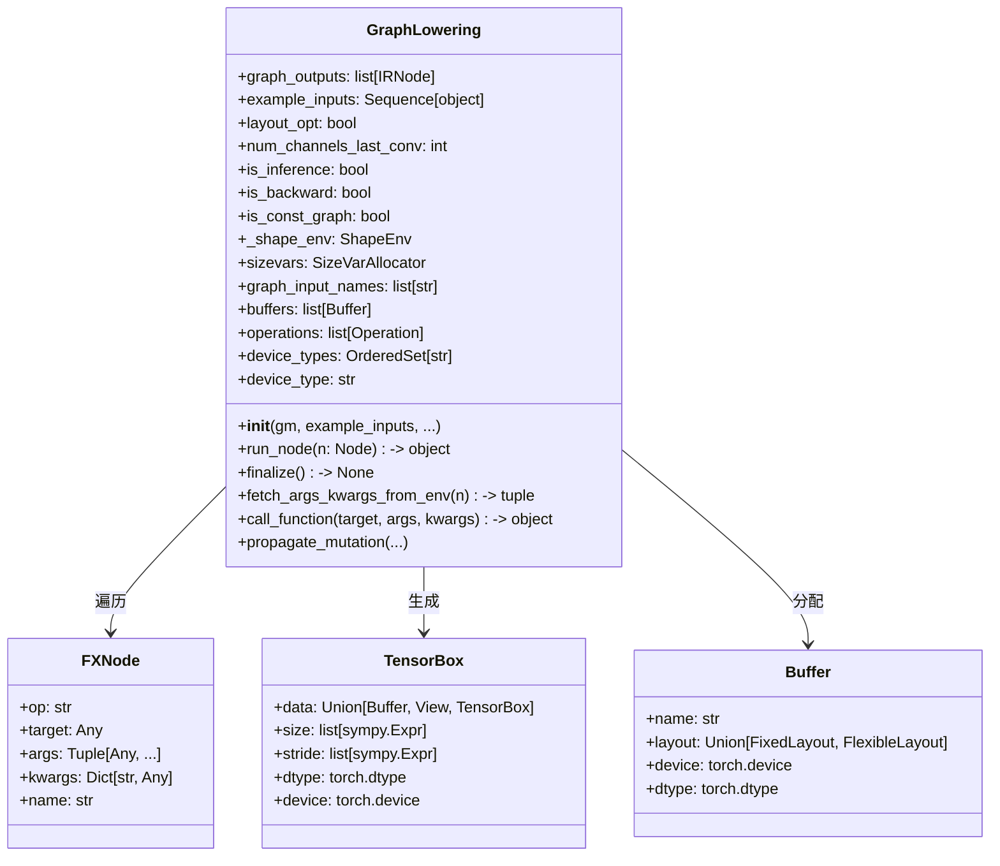
```mermaid
classDiagram
    class GraphLowering {
        +graph_outputs: list[IRNode]
        +example_inputs: Sequence[object]
        +layout_opt: bool
        +num_channels_last_conv: int
        +is_inference: bool
        +is_backward: bool
        +is_const_graph: bool
        +_shape_env: ShapeEnv
        +sizevars: SizeVarAllocator
        +graph_input_names: list[str]
        +buffers: list[Buffer]
        +operations: list[Operation]
        +device_types: OrderedSet[str]
        +device_type: str

        +__init__(gm, example_inputs, ...)
        +run_node(n: Node) -> object
        +finalize() -> None
        +fetch_args_kwargs_from_env(n) -> tuple
        +call_function(target, args, kwargs) -> object
        +propagate_mutation(...)
    }

    class FXNode {
        +op: str
        +target: Any
        +args: Tuple[Any, ...]
        +kwargs: Dict[str, Any]
        +name: str
    }

    class TensorBox {
        +data: Union[Buffer, View, TensorBox]
        +size: list[sympy.Expr]
        +stride: list[sympy.Expr]
        +dtype: torch.dtype
        +device: torch.device
    }

    class Buffer {
        +name: str
        +layout: Union[FixedLayout, FlexibleLayout]
        +device: torch.device
        +dtype: torch.dtype
    }

    GraphLowering --> FXNode: 遍历
    GraphLowering --> TensorBox: 生成
    GraphLowering --> Buffer: 分配
```

### 1.2 run_node 方法流程

节点执行的核心实现在 [torch/_inductor/graph.py](file:///e:\97-codes\torch_parallel\pytorch\torch\_inductor\graph.py#L1649)：

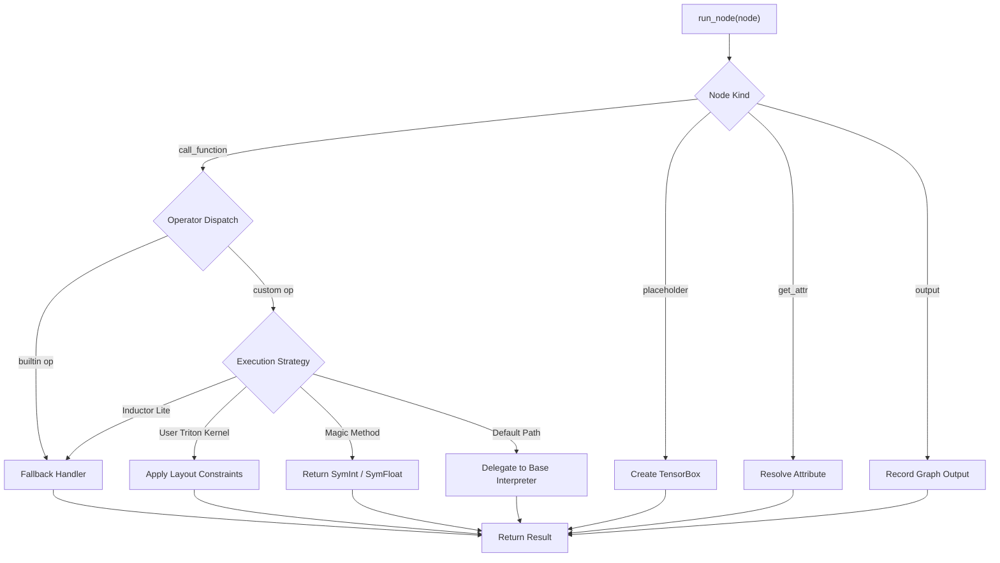
```mermaid
flowchart TD

    A["run_node(node)"] --> B{"Node Kind"}

    B -->|"placeholder"| P["Create TensorBox"]
    B -->|"get_attr"| GA["Resolve Attribute"]
    B -->|"output"| OUT["Record Graph Output"]
    B -->|"call_function"| CF{"Operator Dispatch"}

    CF -->|"builtin op"| FB["Fallback Handler"]
    CF -->|"custom op"| STRATEGY{"Execution Strategy"}

    STRATEGY -->|"Inductor Lite"| FB
    STRATEGY -->|"User Triton Kernel"| TR["Apply Layout Constraints"]
    STRATEGY -->|"Magic Method"| SYM["Return SymInt / SymFloat"]
    STRATEGY -->|"Default Path"| SUPER["Delegate to Base Interpreter"]

    FB --> RET["Return Result"]
    TR --> RET
    SYM --> RET
    SUPER --> RET
    P --> RET
    GA --> RET
    OUT --> RET

```

### 1.2.1 符号形状推理与 Guard 生成

**ShapeEnv 与 SizeVarAllocator 的作用**

GraphLowering 通过 `ShapeEnv` 和 `SizeVarAllocator` 管理符号形状推理和运行时 guard 生成：

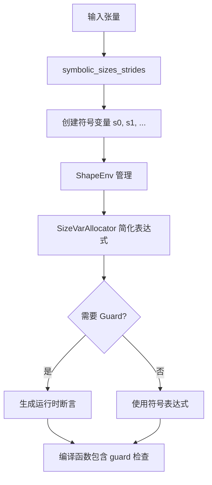
```mermaid
flowchart TD
    A["输入张量"] --> B["symbolic_sizes_strides"]
    B --> C["创建符号变量 s0, s1, ..."]
    C --> D["ShapeEnv 管理"]
    D --> E["SizeVarAllocator 简化表达式"]
    E --> F{"需要 Guard?"}
    F -->|"是"| G["生成运行时断言"]
    F -->|"否"| H["使用符号表达式"]
    G --> I["编译函数包含 guard 检查"]
    H --> I
```

**核心机制**（[torch/_inductor/sizevars.py](file:///e:\97-codes\torch_parallel\pytorch\torch\_inductor\sizevars.py)）：

```python
class SizeVarAllocator:
    def __init__(self, shape_env=None) -> None:
        self.shape_env = shape_env or ShapeEnv()
        self.replacements = self.shape_env.replacements
        self.precomputed_replacements = {}
        self.inv_precomputed_replacements = {}

    def guard_int(self, expr: Union[Expr, int]) -> int:
        """
        提取符号表达式的具体值并生成 guard
        如果表达式包含未知的符号，会抛出错误
        """
        val = self.size_hint_or_throw(expr)
        self.check_equals(expr, sympy.Integer(val))
        return int(val)

    def expect_true(self, expr: Expr) -> bool:
        """
        确保表达式为真，必要时添加 guard
        """
        if not self.statically_known_true(expr):
            return self.shape_env.guard_or_defer_runtime_assert(
                expr, "sizevars.expect_true"
            )
        return True

    def statically_known_true(self, expr: Union[sympy.Basic, bool]) -> bool:
        """
        判断表达式是否在符号上已知为真（不添加 guard）
        """
        return statically_known_true(self.shape_env, expr)
```

**Guard 生成示例**：

```python
# 假设输入张量形状为 (s0, s1)，其中 s0 和 s1 是符号变量
x = torch.randn(s0, s1)

# 在执行 reshape 时，Inductor 会生成 guard
y = x.reshape(s0 * s1)  # 生成 guard: assert s0 * s1 == s0 * s1

# 在执行切片时，Inductor 会检查边界
z = x[:s1]  # 生成 guard: assert s1 <= s0
```

### 1.2.2 In-Place Mutation 处理

**Mutation 跟踪机制**

GraphLowering 通过 `propagate_mutation` 方法处理 in-place 操作的 mutation 传播：

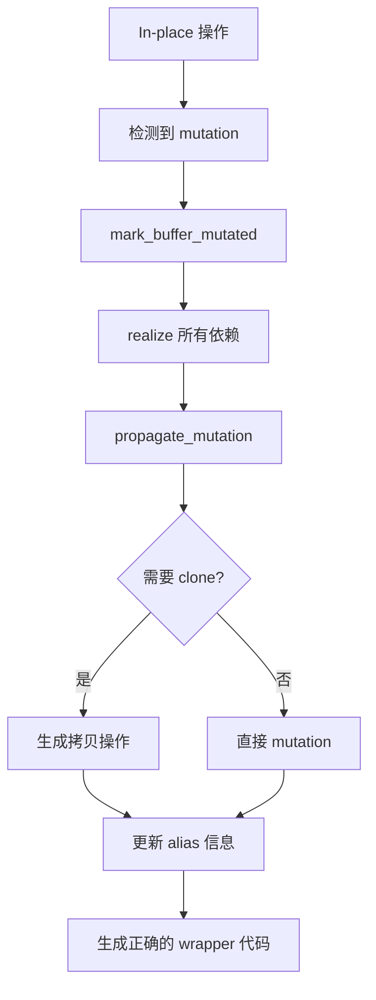
```mermaid
flowchart TD
    A["In-place 操作"] --> B["检测到 mutation"]
    B --> C["mark_buffer_mutated"]
    C --> D["realize 所有依赖"]
    D --> E["propagate_mutation"]
    E --> F{"需要 clone?"}
    F -->|"是"| G["生成拷贝操作"]
    F -->|"否"| H["直接 mutation"]
    G --> I["更新 alias 信息"]
    H --> I
    I --> J["生成正确的 wrapper 代码"]
```

**核心实现**（[torch/_inductor/graph.py:1574](file:///e:\97-codes\torch_parallel\pytorch\torch\_inductor\graph.py#L1574)）：

```python
def propagate_mutation(
    self,
    fx_node: torch.fx.Node,
    old_args: tuple[Any],
    old_kwargs: dict[str, Any],
    new_args: tuple[Any],
    new_kwargs: dict[str, Any],
) -> None:
    """
    将 new_args/new_kwargs 上的 mutation 传播回 old_args/old_kwargs

    假设我们已经将 old_args/old_kwargs 克隆到 new_args/new_kwargs
    并调用了 fx_node(*new_args, **new_kwargs)

    如果 fx_node 修改了 new_args/new_kwargs 中的任何参数，
    且它们与 old_args/old_kwargs 不同，则需要更新原始张量
    """
    assert len(old_args) == len(new_args)
    assert len(old_kwargs) == len(new_kwargs)

    # 处理 Triton kernel wrapper mutation
    if fx_node.target is torch.ops.higher_order.triton_kernel_wrapper_mutation:
        kwargs = fx_node.kwargs["kwargs"]
        mutated = torch._higher_order_ops.triton_kernel_wrap.get_mutated_tensors(
            old_kwargs["kernel_idx"],
            old_kwargs["constant_args_idx"],
            {
                k: v.meta["val"] if isinstance(v, torch.fx.Node) else v
                for k, v in kwargs.items()
            },
            old_kwargs["tma_descriptor_metadata"],
        )
        for name in mutated:
            old_arg = old_kwargs["kwargs"][name]
            new_arg = new_kwargs["kwargs"][name]
            # 更新原始张量
            self._update_mutation(old_arg, new_arg)

def mark_buffer_mutated(self, name: str) -> None:
    """
    当 buffer 被 mutation 时，确保所有对旧版本的读取在 mutation 之前完成
    """
    assert isinstance(name, str)
    self.mutated_buffers.add(name)

    if name not in self.name_to_users:
        return

    for user in self.name_to_users[name]:
        user.realize()
```

**Mutation 处理示例**：

```python
# 原始代码
def model(x):
    x.add_(1)  # in-place mutation
    return x.mul(2)

# Inductor 处理后的 wrapper 代码
def compiled_model(x):
    # 检测到 in-place 操作
    # 1. 标记 buffer 为 mutated
    # 2. realize 所有依赖
    # 3. 生成正确的 mutation 代码
    x = x.clone()  # 如果需要保护输入
    x.add_(1)
    y = x.mul(2)
    return y
```

**CUDA Graphs 与 Mutation**：

在启用 CUDA Graphs 时，mutation 处理更加严格：

```python
# CUDA Graphs 要求所有张量地址在录制时固定
# 如果检测到 mutation，Inductor 会：
# 1. 在 wrapper 中生成必要的设备守卫
# 2. 确保内存分配在录制前完成
# 3. 避免在 CUDA Graph 执行期间重新分配内存
```

### 1.3 Inductor IR 数据结构

> **注**：以下结构为简化模型（illustrative），实际实现请以源码为准。类名和成员可能与源码有细微差别，例如 Pointwise 的实现细节、View 存储 offset 的具体形式、Buffer 是否携带 is_constant 标记等。

核心 IR 结构在 [torch/_inductor/ir.py](file:///e:\97-codes\torch_parallel\pytorch\torch\_inductor\ir.py#L1)：

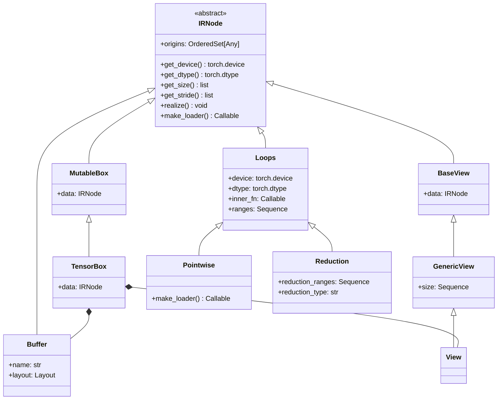
```mermaid
classDiagram
    class IRNode {
        <<abstract>>
        +origins: OrderedSet[Any]
        +get_device() torch.device
        +get_dtype() torch.dtype
        +get_size() list
        +get_stride() list
        +realize() void
        +make_loader() Callable
    }

    class MutableBox {
        +data: IRNode
    }

    class TensorBox {
        +data: IRNode
    }

    class Loops {
        +device: torch.device
        +dtype: torch.dtype
        +inner_fn: Callable
        +ranges: Sequence
    }

    class Buffer {
        +name: str
        +layout: Layout
    }

    class BaseView {
        +data: IRNode
    }

    class GenericView {
        +size: Sequence
    }

    class View {
    }

    class Pointwise {
        +make_loader() Callable
    }

    class Reduction {
        +reduction_ranges: Sequence
        +reduction_type: str
    }

    IRNode <|-- MutableBox
    MutableBox <|-- TensorBox
    IRNode <|-- Loops
    Loops <|-- Pointwise
    Loops <|-- Reduction
    IRNode <|-- Buffer
    IRNode <|-- BaseView
    BaseView <|-- GenericView
    GenericView <|-- View

    TensorBox *-- Buffer
    TensorBox *-- View
```

> **继承关系说明**：
> - `TensorBox` → `MutableBox` → `IRNode`（非直接继承 IRNode）
> - `Buffer` → `IRNode` + `CodegenSymbol`（多继承）
> - `View` → `GenericView` → `BaseView` → `IRNode`
> - `Pointwise` → `Loops` → `IRNode`
> - `Reduction` → `Loops` → `IRNode`

---

## 阶段2: IR Optimization (Inductor IR 优化)

### 2.1 Scheduler 核心类

调度器核心在 [torch/_inductor/scheduler.py](file:///e:\97-codes\torch_parallel\pytorch\torch\_inductor\scheduler.py#L2864)：

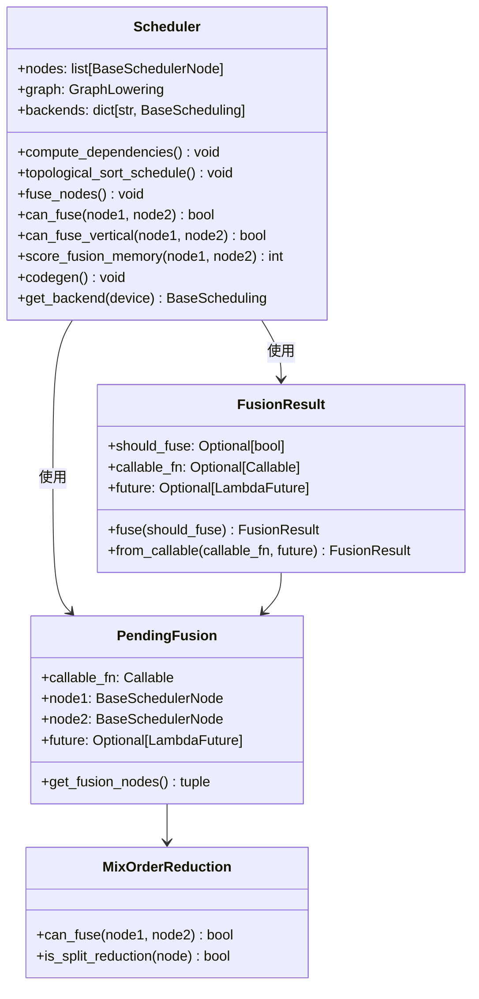
```mermaid
classDiagram
    class Scheduler {
        +nodes: list[BaseSchedulerNode]
        +graph: GraphLowering
        +backends: dict[str, BaseScheduling]
        +compute_dependencies() void
        +topological_sort_schedule() void
        +fuse_nodes() void
        +can_fuse(node1, node2) bool
        +can_fuse_vertical(node1, node2) bool
        +score_fusion_memory(node1, node2) int
        +codegen() void
        +get_backend(device) BaseScheduling
    }

    class FusionResult {
        +should_fuse: Optional[bool]
        +callable_fn: Optional[Callable]
        +future: Optional[LambdaFuture]
        +fuse(should_fuse) FusionResult
        +from_callable(callable_fn, future) FusionResult
    }

    class PendingFusion {
        +callable_fn: Callable
        +node1: BaseSchedulerNode
        +node2: BaseSchedulerNode
        +future: Optional[LambdaFuture]
        +get_fusion_nodes() tuple
    }

    class MixOrderReduction {
        +can_fuse(node1, node2) bool
        +is_split_reduction(node) bool
    }

    Scheduler --> FusionResult : 使用
    Scheduler --> PendingFusion : 使用
    FusionResult --> PendingFusion
    PendingFusion --> MixOrderReduction
```

> **说明**：`Scheduler`（line 2864）是调度的核心类，负责拓扑排序、融合决策和代码生成。`FusionResult`（line 104）、`PendingFusion`（line 126）和 `MixOrderReduction`（line 136）是辅助数据结构，服务于融合决策流程。

### 2.2 融合机会识别流程

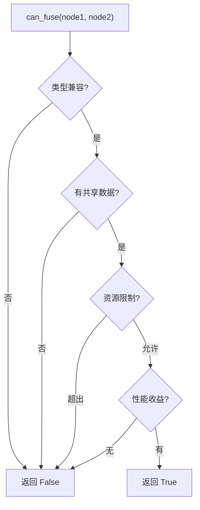
```mermaid
flowchart TD
    A["can_fuse(node1, node2)"] --> B{"类型兼容?"}
    B -->|"否"| Z["返回 False"]
    B -->|"是"| C{"有共享数据?"}
    C -->|"否"| Z
    C -->|"是"| D{"资源限制?"}
    D -->|"超出"| Z
    D -->|"允许"| E{"性能收益?"}
    E -->|"无"| Z
    E -->|"有"| F["返回 True"]
```

> **实际 can_fuse 逻辑**（[scheduler.py:5333](file:///e:\97-codes\torch_parallel\pytorch\torch\_inductor\scheduler.py#L5333)）：除上述检查外，还包括：排除相同节点、排除 `GroupedSchedulerNode`、检查 extern/nop 节点、检查设备一致性、委托到后端的 `can_fuse_vertical` / `can_fuse_horizontal` 方法等。

### 2.2.1 融合成本模型与自动调优

**成本模型评估**

Inductor 的融合决策结合了多种成本评估方法：

1. **简单成本模型**：操作计数 + 内存字节数
2. **内存访问分析**：估算 memory traffic、register pressure、L2 使用
3. **Warp 利用率**：评估 GPU warp 的利用效率
4. **Tile 大小优化**：通过自动调优选择最优 tile 配置

**核心实现**（[torch/_inductor/runtime/coordinate_descent_tuner.py](file:///e:\97-codes\torch_parallel\pytorch\torch\_inductor\runtime\coordinate_descent_tuner.py)）：

```python
class CoordescTuner:
    """
    Coordinate Descent Tuner for Triton kernels

    使用坐标下降算法优化 tile 大小、num_warps、num_stages 等参数
    """

    def __init__(
        self,
        is_mm=False,
        is_native_matmul=False,
        is_mix_order_reduction=False,
        name="unknown",
        size_hints=None,
        inductor_meta=None,
        frozen_fields=None,
    ):
        self.is_mm = is_mm
        self.is_native_matmul = is_native_matmul
        self.is_mix_order_reduction = is_mix_order_reduction
        self.cached_benchmark_results = {}
        self.name = name
        self.size_hints = size_hints
        self.inductor_meta = inductor_meta or {}
        self.frozen_fields = OrderedSet(frozen_fields or [])

    def autotune(
        self,
        func: Callable[["triton.Config"], float],
        baseline_config: "triton.Config",
        baseline_timing: float | None = None,
    ) -> "triton.Config":
        """
        使用坐标下降算法自动调优

        算法流程：
        1. 从 baseline config 开始
        2. 逐个优化每个可调参数（BLOCK_X, BLOCK_Y, num_warps, num_stages）
        3. 对每个参数，尝试增大和减小
        4. 如果找到更好的配置，更新 baseline
        5. 重复直到没有改进
        """
        if baseline_timing is None:
            baseline_timing = self.call_func(func, baseline_config)

        improved = True
        best_config = baseline_config
        best_timing = baseline_timing
        tunable_fields = self.tunable_fields

        while improved:
            improved = False

            for name in tunable_fields:
                cur_val = get_field(best_config, name)
                candidate_values = self.get_neighbour_values(name, cur_val)

                for new_val in candidate_values:
                    new_config = set_field(best_config, name, new_val)
                    if not self.is_valid_config(new_config):
                        continue

                    new_timing = self.call_func(func, new_config)
                    if self.has_improvement(best_timing, new_timing):
                        best_config = new_config
                        best_timing = new_timing
                        improved = True

        return best_config

    @staticmethod
    def has_improvement(baseline, test):
        threshold = 0.001  # 0.1% improvement threshold
        return test is not None and test < baseline * (1 - threshold)
```

**Triton Heuristics**（[torch/_inductor/runtime/triton_heuristics.py](file:///e:\97-codes\torch_parallel\pytorch\torch\_inductor\runtime\triton_heuristics.py)）：

```python
def pointwise(
    size_hints,
    triton_meta,
    tile_hint=None,
    filename=None,
    min_elem_per_thread=0,
    inductor_meta=None,
):
    """
    为 pointwise 操作构造 @triton.heuristics() 配置

    基于大小提示生成多个候选配置，然后通过自动调优选择最优
    """
    numel = functools.reduce(operator.mul, size_hints.values())
    bs = max(256, min(numel // 128, 1024))

    # 生成多个候选配置
    configs = [
        triton_config_with_settings(size_hints, bs, num_elements_per_warp=256),
        triton_config_with_settings(size_hints, bs // 2, num_elements_per_warp=64),
        *hinted_configs,
    ]

    return configs
```

**配置选项**（[torch/_inductor/config.py](file:///e:\97-codes\torch_parallel\pytorch\torch\_inductor\config.py)）：

```python
# 启用坐标下降调优
coordinate_descent_tuning = (
    os.environ.get("TORCHINDUCTOR_COORDINATE_DESCENT_TUNING") == "1"
)

# 坐标下降搜索半径
coordinate_descent_search_radius = int(
    os.environ.get("TORCHINDUCTOR_COORDINATE_DESCENT_RADIUS", "1")
)

# 检查所有方向
coordinate_descent_check_all_directions = (
    os.environ.get("TORCHINDUCTOR_COORDINATE_DESCENT_CHECK_ALL_DIRECTIONS") == "1"
)

# 最大融合大小
max_fusion_size = 64

# 融合内存阈值
score_fusion_memory_threshold = 10
```

**自动调优模式**：

```python
# 模式1: 默认模式（无自动调优）
model = torch.compile(model, mode="default")

# 模式2: 最大自动调优（包含坐标下降调优）
model = torch.compile(model, mode="max-autotune")

# 模式3: 最大自动调优 + CUDA Graphs
model = torch.compile(model, mode="max-autotune")

# 模式4: 仅坐标下降调优（无 CUDA Graphs）
model = torch.compile(model, mode="max-autotune-no-cudagraphs")

# 自定义配置
model = torch.compile(
    model,
    options={
        "max_autotune": True,
        "coordinate_descent_tuning": True,
        "triton.cudagraphs": True,
    }
)
```

**性能收益评估示例**：

```python
# 假设有两个 pointwise 操作：add 和 relu
# Inductor 会评估融合的性能收益

# 不融合的情况：
# - 两次 kernel launch
# - 中间结果需要写入内存
# - 总内存访问: 2 * read + 2 * write

# 融合的情况：
# - 一次 kernel launch
# - 中间结果保存在寄存器
# - 总内存访问: 1 * read + 1 * write
# - 寄存器压力增加

# Inductor 会计算：
# - memory_saved = (2 * read + 2 * write) - (1 * read + 1 * write)
# - register_pressure = fused_register_usage - max(individual_register_usage)
# - 如果 memory_saved > threshold 且 register_pressure < limit，则融合
```

**Tile 大小优化**：

```python
# 对于矩阵乘法，Inductor 会优化 tile 大小
# 候选配置：
# - BLOCK_M: [16, 32, 64, 128, 256]
# - BLOCK_N: [16, 32, 64, 128, 256]
# - BLOCK_K: [16, 32, 64]
# - num_stages: [1, 2, 3, 4, 5]
# - num_warps: [1, 2, 4, 8]

# 通过自动调优选择最优配置
# 评估指标：
# - 执行时间
# - 内存带宽利用率
# - 计算吞吐量
# - 寄存器使用率
```

### 2.3 常量折叠流程

常量折叠实现在 [torch/_inductor/constant_folding.py](file:///e:\97-codes\torch_parallel\pytorch\torch\_inductor\constant_folding.py)：

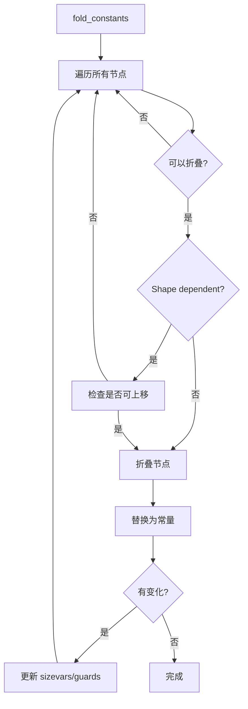
```mermaid
flowchart TD
    A["fold_constants"] --> B["遍历所有节点"]
    B --> C{"可以折叠?"}
    C -->|"否"| B
    C -->|"是"| D{"Shape dependent?"}
    D -->|"是"| E["检查是否可上移"]
    D -->|"否"| F["折叠节点"]
    E -->|"否"| B
    E -->|"是"| F
    F --> G["替换为常量"]
    G --> H{"有变化?"}
    H -->|"是"| I["更新 sizevars/guards"]
    H -->|"否"| J["完成"]
    I --> B
```

**常量折叠与 Shape Dependent 常量**

常量折叠在处理动态形状时需要格外小心：

1. **Shape Dependent 常量**：基于输入形状计算的参数不可随意上移
2. **SizeVars 更新**：折叠后必须更新 sizevars 和 guards
3. **Graph Partition 影响**：某些常量折叠可能触发重新调度

**核心实现**（[torch/_inductor/constant_folding.py:73](file:///e:\97-codes\torch_parallel\pytorch\torch\_inductor\constant_folding.py#L73)）：

```python
class ConstantFolder(torch.fx.Interpreter):
    def __init__(
        self,
        gm: torch.fx.GraphModule,
        skip_constructors: bool = False,
        lifted_constant_names: Optional[list[str]] = None,
        skip_folding_node_fn: Optional[Callable[[torch.fx.Node], bool]] = None,
    ) -> None:
        super().__init__(gm)
        self.node_replacements: dict[torch.fx.Node, Any] = {}
        self.replaced_uses: dict[torch.fx.Node, int] = collections.Counter()
        self.unknown_value = object()
        self.skip_constructors: bool = skip_constructors
        self.lifted_constant_names = lifted_constant_names
        self.skip_folding_node_fn = skip_folding_node_fn

    def _support_dynamic_shape(self) -> bool:
        # ConstantFolder 目前不支持动态形状
        return False

    def _deduce_value(self, node: torch.fx.Node) -> Any:
        """
        推导节点的值，考虑动态形状的限制
        """
        if self.lifted_constant_names is None:
            return super().run_node(node)

        # 如果有 lifted_constant_names，没有具体值可用
        # 只检查所有输入是否有值
        if self.skip_folding_node_fn is not None and self.skip_folding_node_fn(node):
            return self.unknown_value

        flattened_node_inps = pytree.arg_tree_leaves(*node.args, **node.kwargs)
        for inp in flattened_node_inps:
            if (
                isinstance(inp, torch.fx.Node)
                and inp.name not in (self.lifted_constant_names or ())
                and self.env[inp] != self.deferred_value
            ):
                return self.unknown_value
        return self.deferred_value
```

**Shape Dependent 常量示例**：

```python
# 原始代码
def model(x):
    # x.shape 是 shape dependent 常量
    batch_size = x.shape[0]
    # 这个常量不能随意上移，因为它依赖于输入形状
    y = torch.full((batch_size,), 1.0)
    return y

# 常量折叠后的处理
# Inductor 会：
# 1. 识别 batch_size 为 shape dependent 常量
# 2. 在编译时保留符号表达式
# 3. 在运行时通过 guard 确保形状一致性
# 4. 生成正确的 Triton kernel 代码
```

**常量折叠与 SymInt 传播**：

在 [torch/_inductor/fx_passes/joint_graph.py:408](file:///e:\97-codes\torch_parallel\pytorch\torch\_inductor\fx_passes\joint_graph.py#L408) 中有专门的注释说明：

```python
# note: [constant folding refining of symints]
# constant folding will partially evaluate a graph such that values which have
# dependencies which are entirely known at compile time may also become compile
# time constants. in some cases, this will include symints which we had not yet
# previously deduced are guaranteed a constant value and is then deduced in
# constant folding. an example is:
# unbacked_symint_eq_11 = torch.full((), 11).item()
# torch.full((unbacked_symint_eq_11,), 0)
```

这意味着常量折叠可以：
- 部分评估图，使完全已知的依赖成为编译时常量
- 推导出之前未知的 SymInt 常量值
- 更新 SizeVarAllocator 中的 replacements 和 guards

---

## 阶段3: Scheduling (调度与融合)

### 3.1 节点拓扑排序流程

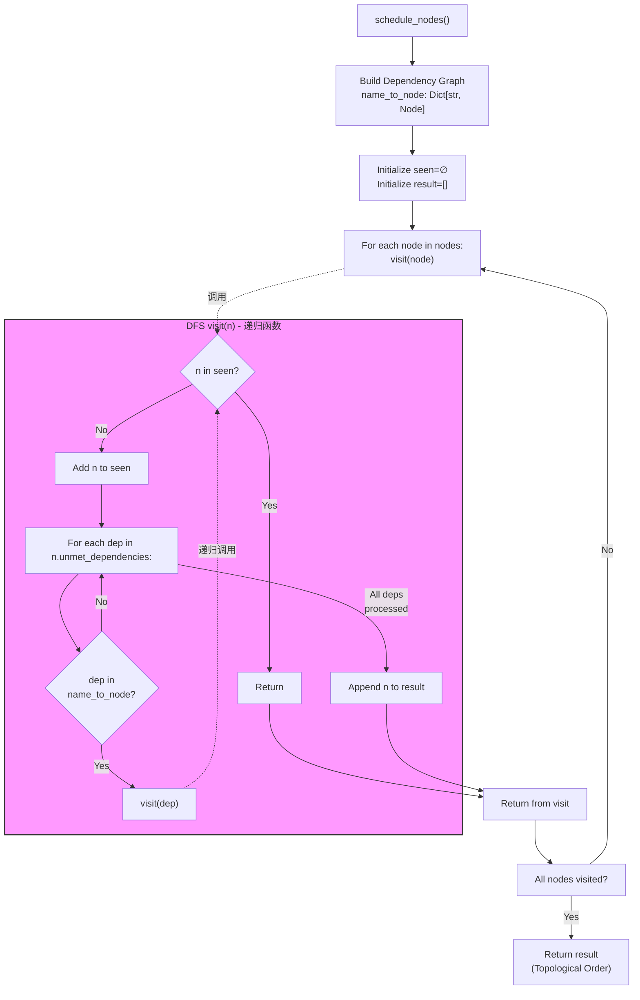
```mermaid
flowchart TD

    A["schedule_nodes()"] --> B["Build Dependency Graph<br/>name_to_node: Dict[str, Node]"]
    B --> C["Initialize seen=∅<br/>Initialize result=[]"]
    C --> D["For each node in nodes:<br/>visit(node)"]

    subgraph DFS_visit_n ["DFS visit(n) - 递归函数"]
        E{"n in seen?"} -->|"Yes"| F["Return"]
        E -->|"No"| G["Add n to seen"]
        G --> H["For each dep in n.unmet_dependencies:"]
        H --> I{"dep in<br/>name_to_node?"}
        I -->|"No"| H
        I -->|"Yes"| J["visit(dep)"]
        J -.递归调用.-> E
        H -->|"All deps<br/>processed"| K["Append n to result"]
    end

    D -.调用.-> E
    F --> L["Return from visit"]
    K --> L

    L --> M["All nodes visited?"]
    M -->|"No"| D
    M -->|"Yes"| N["Return result<br/>(Topological Order)"]

    style DFS_visit_n fill:#f9f,stroke:#333,stroke-width:2px
```

### 3.2 融合决策与执行流程

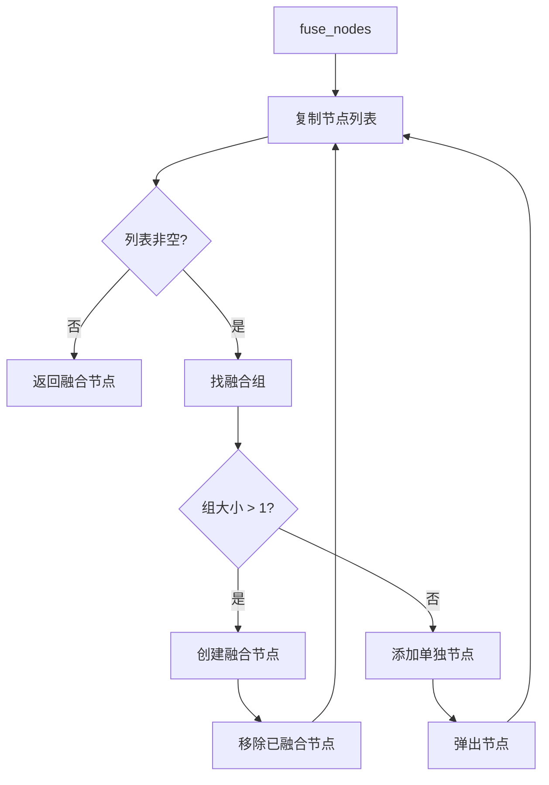
```mermaid
flowchart TD
    A["fuse_nodes"] --> B["复制节点列表"]
    B --> C{"列表非空?"}
    C -->|"否"| D["返回融合节点"]
    C -->|"是"| E["找融合组"]
    E --> F{"组大小 > 1?"}
    F -->|"是"| G["创建融合节点"]
    G --> H["移除已融合节点"]
    H --> B
    F -->|"否"| I["添加单独节点"]
    I --> J["弹出节点"]
    J --> B
```

### 3.3 内存分配流程

内存规划实现在 [torch/_inductor/memory.py](file:///e:\97-codes\torch_parallel\pytorch\torch\_inductor\memory.py)：

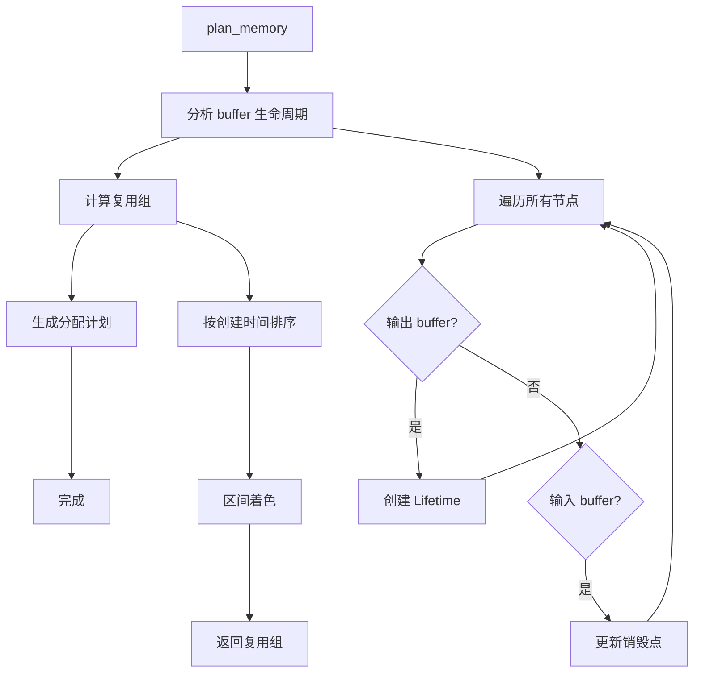
```mermaid
flowchart TD
    A["plan_memory"] --> B["分析 buffer 生命周期"]
    B --> C["计算复用组"]
    C --> D["生成分配计划"]
    D --> E["完成"]

    B --> B1["遍历所有节点"]
    B1 --> B2{"输出 buffer?"}
    B2 -->|"是"| B3["创建 Lifetime"]
    B2 -->|"否"| B4{"输入 buffer?"}
    B4 -->|"是"| B5["更新销毁点"]
    B5 --> B1
    B3 --> B1

    C --> C1["按创建时间排序"]
    C1 --> C2["区间着色"]
    C2 --> C3["返回复用组"]
```

---

## 阶段4: Code Generation (Inductor IR → Triton IR)

### 4.1 Triton Kernel 生成

Triton 代码生成在 [torch/_inductor/codegen/triton.py](file:///e:\97-codes\torch_parallel\pytorch\torch\_inductor\codegen\triton.py)：

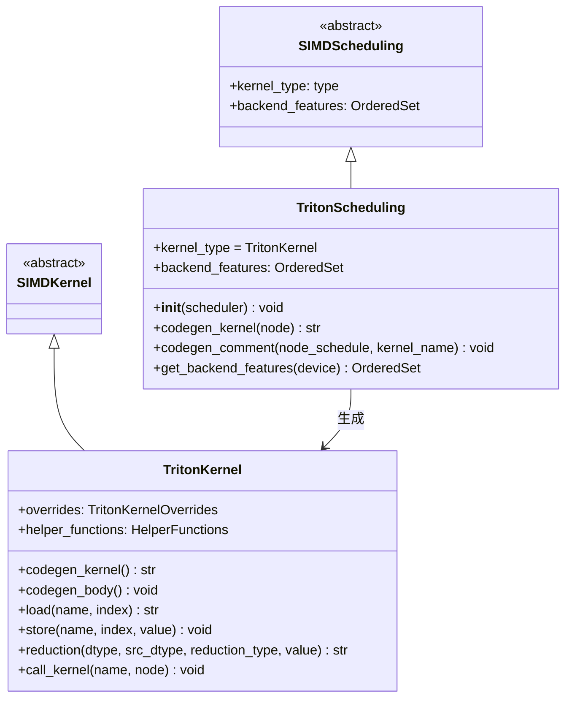
```mermaid
classDiagram
    class SIMDScheduling {
        <<abstract>>
        +kernel_type: type
        +backend_features: OrderedSet
    }

    class TritonScheduling {
        +kernel_type = TritonKernel
        +backend_features: OrderedSet
        +__init__(scheduler) void
        +codegen_kernel(node) str
        +codegen_comment(node_schedule, kernel_name) void
        +get_backend_features(device) OrderedSet
    }

    class SIMDKernel {
        <<abstract>>
    }

    class TritonKernel {
        +overrides: TritonKernelOverrides
        +helper_functions: HelperFunctions
        +codegen_kernel() str
        +codegen_body() void
        +load(name, index) str
        +store(name, index, value) void
        +reduction(dtype, src_dtype, reduction_type, value) str
        +call_kernel(name, node) void
    }

    SIMDScheduling <|-- TritonScheduling
    SIMDKernel <|-- TritonKernel
    TritonScheduling --> TritonKernel : 生成
```

> **继承关系**：`TritonScheduling` 继承自 `SIMDScheduling`（line 5957），`TritonKernel` 继承自 `SIMDKernel[TritonCSEVariable]`（line 2461）。`SIMDScheduling` 定义在 `codegen/simd.py:1272`，`SIMDKernel` 定义在 `codegen/simd.py:388`。

### 4.2 Wrapper 代码生成

Wrapper 代码生成在 [torch/_inductor/codegen/wrapper.py](file:///e:\97-codes\torch_parallel\pytorch\torch\_inductor\codegen\wrapper.py)：

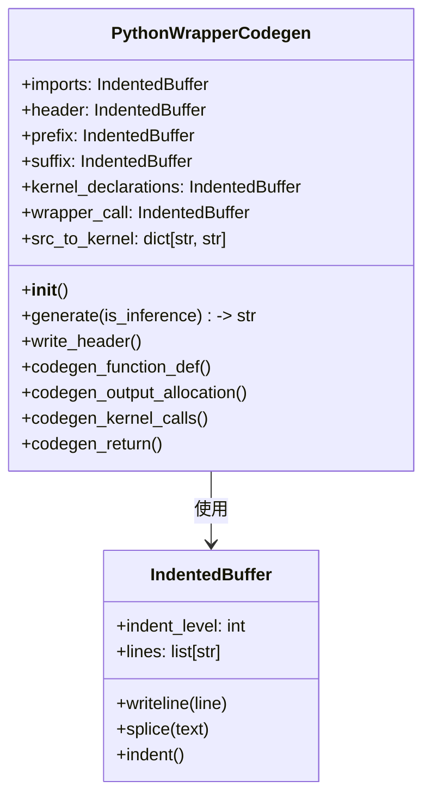
```mermaid
classDiagram
    class PythonWrapperCodegen {
        +imports: IndentedBuffer
        +header: IndentedBuffer
        +prefix: IndentedBuffer
        +suffix: IndentedBuffer
        +kernel_declarations: IndentedBuffer
        +wrapper_call: IndentedBuffer
        +src_to_kernel: dict[str, str]

        +__init__()
        +generate(is_inference) -> str
        +write_header()
        +codegen_function_def()
        +codegen_output_allocation()
        +codegen_kernel_calls()
        +codegen_return()
    }

    class IndentedBuffer {
        +indent_level: int
        +lines: list[str]

        +writeline(line)
        +splice(text)
        +indent()
    }

    PythonWrapperCodegen --> IndentedBuffer: 使用
```

## 昇腾NPU适配层实现

### 1. NPU 后端注册

NPU 后端适配在 [torch_npu/utils/_inductor.py](file:///e:\97-codes\torch_parallel\torch_npu\torch_npu\utils\_inductor.py)：

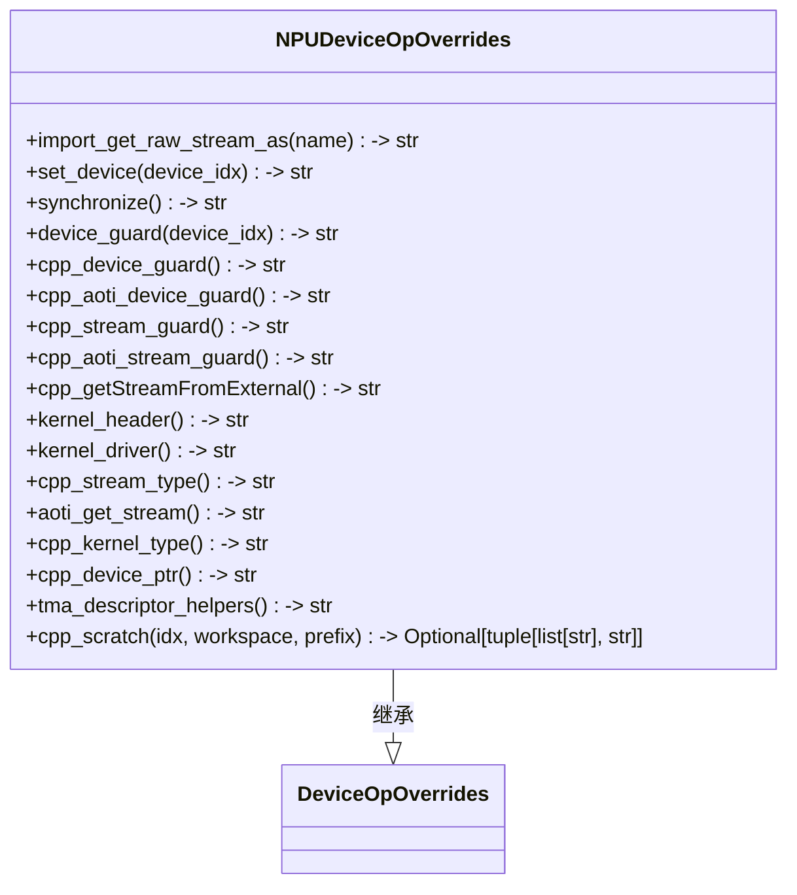
```mermaid
classDiagram
    class NPUDeviceOpOverrides {
        +import_get_raw_stream_as(name) -> str
        +set_device(device_idx) -> str
        +synchronize() -> str
        +device_guard(device_idx) -> str
        +cpp_device_guard() -> str
        +cpp_aoti_device_guard() -> str
        +cpp_stream_guard() -> str
        +cpp_aoti_stream_guard() -> str
        +cpp_getStreamFromExternal() -> str
        +kernel_header() -> str
        +kernel_driver() -> str
        +cpp_stream_type() -> str
        +aoti_get_stream() -> str
        +cpp_kernel_type() -> str
        +cpp_device_ptr() -> str
        +tma_descriptor_helpers() -> str
        +cpp_scratch(idx, workspace, prefix) -> Optional[tuple[list[str], str]]
    }

    NPUDeviceOpOverrides --|> DeviceOpOverrides: 继承
```

**核心代码**：

```python
from torch._inductor.codegen.common import DeviceOpOverrides, register_device_op_overrides


class NPUDeviceOpOverrides(DeviceOpOverrides):
    """
    NPU 设备操作覆盖
    """

    def import_get_raw_stream_as(self, name):
        return f"from torch_npu._C import _npu_getCurrentRawStream as {name}"

    def set_device(self, device_idx):
        return f"torch_npu.npu.set_device({device_idx})"

    def synchronize(self):
        return "torch_npu.npu.synchronize()"

    def device_guard(self, device_idx):
        return f"torch_npu.npu._DeviceGuard({device_idx})"


def _inductor_register_device_op_overrides():
    """
    注册 NPU 设备操作覆盖
    """
    register_device_op_overrides('npu', NPUDeviceOpOverrides())
```

### 2. NPU 后端初始化

在 torch_npu 初始化时调用：

```python
# torch_npu/__init__.py
from .utils._inductor import _inductor_register_device_op_overrides

_inductor_register_device_op_overrides()
```

### 3. NPU 补丁与 RNG 状态管理适配

NPU 适配层在模块导入时自动应用一系列补丁，包括 decomposition 修复和 RNG 状态管理适配（[torch_npu/utils/_inductor.py:205-208](file:///e:\97-codes\torch_parallel\torch_npu\torch_npu\utils\_inductor.py#L205)）：

**补丁总览**：

| 补丁函数 | 行号 | 作用 |
|---------|------|------|
| `_max_unpoolnd_patch` | 32-47 | 修复 `_max_unpoolnd` decomposition 以兼容 NPU |
| `patch_philox_rand_offset` | 51-59 | 适配 Philox 随机数的 offset 计算 |
| `patch_register_philox_rand` | 62-124 | 注册 NPU 版本的 Philox 随机算子 |
| `patch_register_run_and_save_rng_state_op` | 127-159 | 注册 NPU 的 `PrivateUse1` dispatch 实现 |
| `patch_register_run_with_rng_state_op` | 162-203 | 注册 NPU 的 RNG 状态恢复实现 |

```python
# torch_npu/utils/_inductor.py 中的核心适配

# 1. Philox 随机数 offset 适配（line 51）
def patch_philox_rand_offset():
    def get_philox_rand_offset_patch(shape):
        numel_scalar = 1
        for dim_size in shape:
            numel_scalar *= dim_size
        numel = torch.scalar_tensor(numel_scalar, dtype=torch.int64)
        return numel
    torch._prims.rng_prims.philox_rand_offset = get_philox_rand_offset_patch

# 2. NPU Philox 随机算子注册（line 62）
def patch_register_philox_rand():
    # 内部定义 _philox_rand 实现
    def _philox_rand(shape, seed, offset, stride, device, dtype):
        if device.type == "cpu":
            devices = []
        else:
            devices = [device]
        with torch.random.fork_rng(devices, device_type="npu"):
            CUDARngStateHelper.set_torch_state_tensor(seed, offset)
            random_values = torch.rand(shape, device=device, dtype=dtype)
        return random_values, philox_rand_offset(shape)

    # 注册到 PyTorch 的 RNG prim 系统
    register_rng_prim(
        name="philox_rand", schema="...",
        impl_aten=_philox_rand, impl_meta=_philox_rand_meta,
    )

# 3. RNG 状态保存/恢复适配（line 127, 162）
def patch_register_run_and_save_rng_state_op():
    # 为 PrivateUse1 dispatch key 注册 NPU 实现
    @run_and_save_rng_state.py_impl(DispatchKey.PrivateUse1)
    def impl_npu(op, *args, **kwargs):
        return torch_npu.npu.get_rng_state(), op(*args, **kwargs)
    # 并覆盖 BackendSelect 以支持 device="npu" 路由

def patch_register_run_with_rng_state_op():
    # 为 PrivateUse1 dispatch key 注册 RNG 状态恢复
    @run_with_rng_state.py_impl(DispatchKey.PrivateUse1)
    def impl_npu(rng_state, op, *args, **kwargs):
        current_state = torch_npu.npu.get_rng_state()
        torch_npu.npu.set_rng_state(rng_state)
        try:
            out = op(*args, **kwargs)
        finally:
            torch_npu.npu.set_rng_state(current_state)
        return out

# 模块导入时自动应用（line 205-208）
patch_register_run_and_save_rng_state_op()
patch_register_run_with_rng_state_op()
patch_philox_rand_offset()
patch_register_philox_rand()
```

### 4. NPU 特定配置

```python
import torch
import torch._inductor.config as config

# 设置 NPU 设备
config.device = "npu"

# NPU 特定的编译选项
model = torch.compile(
    model,
    backend="inductor",
    options={
        "device": "npu",
        "triton.cudagraphs": False,  # NPU 不支持 CUDA Graphs
    }
)
```

---

## 编译入口与数据流

### 1. 编译入口：compile_fx 调用链

Inductor 的实际编译入口是 `compile_fx` 函数（[torch/_inductor/compile_fx.py:2483](file:///e:\97-codes\torch_parallel\pytorch\torch\_inductor\compile_fx.py#L2483)），而非某个独立的 `DataFlow` 或 `InductorInterface` 类。数据流通过函数调用链隐式传递。

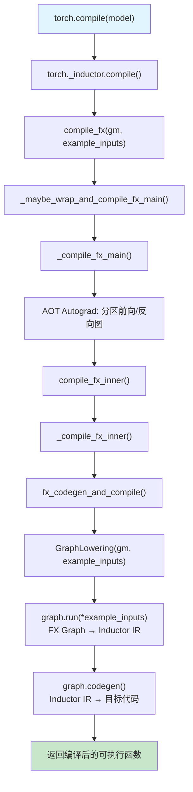
```mermaid
flowchart TD
    A["torch.compile(model)"] --> B["torch._inductor.compile()"]
    B --> C["compile_fx(gm, example_inputs)"]
    C --> D["_maybe_wrap_and_compile_fx_main()"]
    D --> E["_compile_fx_main()"]
    E --> F["AOT Autograd: 分区前向/反向图"]
    F --> G["compile_fx_inner()"]
    G --> H["_compile_fx_inner()"]
    H --> I["fx_codegen_and_compile()"]
    I --> J["GraphLowering(gm, example_inputs)"]
    J --> K["graph.run(*example_inputs)<br/>FX Graph → Inductor IR"]
    K --> L["graph.codegen()<br/>Inductor IR → 目标代码"]
    L --> M["返回编译后的可执行函数"]

    style A fill:#e1f5fe
    style M fill:#c8e6c9
```

**核心流程**（[torch/_inductor/compile_fx.py](file:///e:\97-codes\torch_parallel\pytorch\torch\_inductor\compile_fx.py)）：

```python
# 实际编译流程（简化）
def compile_fx(model_, example_inputs_, config_patches=None):
    # 1. 应用配置
    with config.patch(config_patches):
        # 2. 委托到主编译流程
        return _maybe_wrap_and_compile_fx_main(model_, example_inputs_)

# _compile_fx_inner 中的核心步骤（compile_fx.py:1444-1565）
def _compile_fx_inner(gm, example_inputs, ...):
    # 1. 创建 GraphLowering 实例
    graph = GraphLowering(gm, example_inputs=example_inputs, ...)

    # 2. 执行 lowering：遍历 FX Graph 中的每个节点，转换为 Inductor IR
    graph.run(*example_inputs)

    # 3. 代码生成：调度、融合、生成目标代码（Triton/C++/...）
    compiled_fn = graph.compile_to_fn()
    # 内部调用 graph.codegen() → Scheduler → Code Generation

    return compiled_fn
```

### 2. 数据流概览

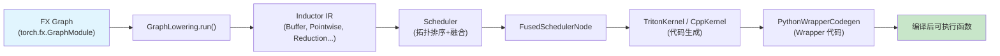
```mermaid
flowchart LR
    A["FX Graph<br/>(torch.fx.GraphModule)"] --> B["GraphLowering.run()"]
    B --> C["Inductor IR<br/>(Buffer, Pointwise, Reduction...)"]
    C --> D["Scheduler<br/>(拓扑排序+融合)"]
    D --> E["FusedSchedulerNode"]
    E --> F["TritonKernel / CppKernel<br/>(代码生成)"]
    F --> G["PythonWrapperCodegen<br/>(Wrapper 代码)"]
    G --> H["编译后可执行函数"]

    style A fill:#e1f5fe
    style H fill:#c8e6c9
```

> **说明**：PyTorch Inductor 中不存在独立的 `DataFlow` 或 `InductorInterface` 类。数据在各阶段间通过 `GraphLowering` 实例的属性（如 `graph.buffers`、`graph.operations`）和 `Scheduler` 实例传递。`GraphLowering` 同时承担了 FX Graph 遍历、IR 构建和代码生成的入口职责。

---

## 后端扩展机制

### 1. 后端架构概览

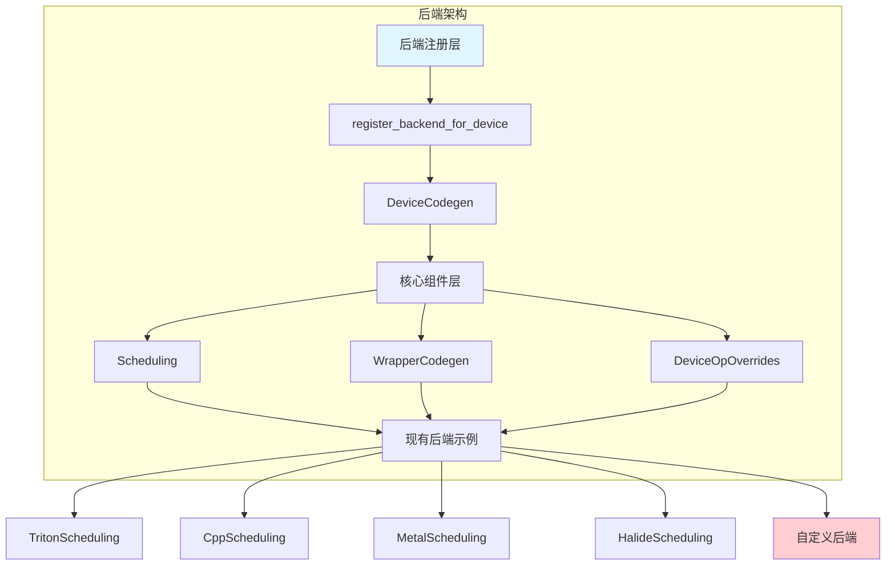
```mermaid
graph TB
    subgraph backend_arch["后端架构"]
        A["后端注册层"] --> B["register_backend_for_device"]
        B --> C["DeviceCodegen"]
        C --> D["核心组件层"]
        D --> E["Scheduling"]
        D --> F["WrapperCodegen"]
        D --> G["DeviceOpOverrides"]
        E --> H["现有后端示例"]
        F --> H
        G --> H
    end

    H --> I["TritonScheduling"]
    H --> J["CppScheduling"]
    H --> K["MetalScheduling"]
    H --> L["HalideScheduling"]
    H --> M["自定义后端"]

    style A fill:#e1f5fe
    style M fill:#ffcdd2
```

### 2. 核心数据结构

**后端注册数据结构**（[torch/_inductor/codegen/common.py:313](file:///e:\97-codes\torch_parallel\pytorch\torch\_inductor\codegen\common.py#L313)）：

```mermaid
classDiagram
    class DeviceCodegen {
        +scheduling: SchedulingConstructor
        +wrapper_codegen: WrapperConstructor
        +cpp_wrapper_codegen: Optional[WrapperConstructor]
        +fx_wrapper_codegen: Optional[WrapperConstructor]
    }

    class DeviceOpOverrides {
        <<abstract>>
        +import_get_raw_stream_as(name) -> str
        +set_device(device_idx) -> str
        +synchronize() -> str
        +device_guard(device_idx) -> str
        +cpp_device_guard() -> str
        +cpp_aoti_device_guard() -> str
        +cpp_stream_guard() -> str
        +cpp_aoti_stream_guard() -> str
        +cpp_getStreamFromExternal() -> str
        +kernel_header() -> str
        +kernel_driver() -> str
        +cpp_stream_type() -> str
        +aoti_get_stream() -> str
        +cpp_kernel_type() -> str
        +cpp_device_ptr() -> str
        +tma_descriptor_helpers() -> str
        +cpp_scratch(idx, workspace, prefix) -> Optional[tuple[list[str], str]]
    }

    DeviceCodegen --> SchedulingConstructor: 使用
    DeviceCodegen --> WrapperConstructor: 使用
```

### 3. 增加硬件后端的步骤

```mermaid
flowchart TD
    A["定义 Scheduling 类"] --> B["定义 Kernel 类"]
    B --> C["定义 Wrapper Codegen 类"]
    C --> D["定义 DeviceOpOverrides 类"]
    D --> E["注册后端"]
    E --> F["使用后端"]
```

#### 步骤1: 定义 Scheduling 类

**Scheduling 类职责**：
- 生成 kernel 代码
- 处理融合决策
- 管理内存布局

**基类继承层次**：

```mermaid
graph TB
    A["BaseScheduling<br/>抽象基类"] --> B["SIMDScheduling<br/>单指令多数据基类"]
    B --> C["TritonScheduling<br/>Triton 后端"]
    B --> D["PallasScheduling<br/>Pallas 后端"]
    B --> E["MetalScheduling<br/>MPS 后端"]
    A --> F["CppScheduling<br/>C++ 后端"]
    A --> G["HalideScheduling<br/>Halide 后端"]
    B --> H["自定义 Scheduling<br/>自定义后端"]

    style H fill:#ffcdd2
```

**示例：创建自定义 Scheduling 类**

```python
# mydevice_inductor/scheduling.py

import torch
from torch._inductor.codegen.simd import SIMDScheduling
from torch._inductor.codegen.common import BackendFeature
from torch.utils._ordered_set import OrderedSet

class MyDeviceScheduling(SIMDScheduling):
    """
    自定义设备 Scheduling 类
    继承自 SIMDScheduling 以获得基础功能
    """

    # 定义 kernel 类型
    kernel_type: type[Any] = MyDeviceKernel

    # 定义后端特性
    backend_features = OrderedSet([
        BackendFeature.FOREACH,
        BackendFeature.BUCKETIZE,
        BackendFeature.INPLACE_BUFFERS,
        BackendFeature.MASKED_SCATTER_WITH_INDEX,
        BackendFeature.SCAN,
        BackendFeature.SORT,
        BackendFeature.TRITON_TEMPLATES,
    ])

    def __init__(self, scheduler: Optional[Scheduler]) -> None:
        super().__init__(scheduler)

        if scheduler is None or not hasattr(scheduler, "nodes"):
            return

        # 初始化设备特定的调试信息
        for node in scheduler.nodes:
            if isinstance(node, (SchedulerNode, FusedSchedulerNode)):
                node.debug_device_str = "mydevice_code"

    @classmethod
    def get_backend_features(cls, device: torch.device):
        """
        返回后端支持的特性
        """
        return cls.backend_features

    def codegen_kernel(self, name: Optional[str] = None) -> str:
        """
        生成 kernel 代码
        这是核心方法，必须实现
        """
        kernel = MyDeviceKernel(
            scheduler=self.scheduler,
            name=name,
        )
        return kernel.generate()

    def codegen_comment(self, node_schedule, kernel_name=None):
        """
        生成注释代码
        """
        wrapper = V.graph.wrapper_code
        origins, _d_detailed_origins = get_kernel_metadata(node_schedule, wrapper)

        if origins:
            wrapper.make_comment(origins)

        if kernel_name:
            wrapper.make_comment(f"MyDevice Kernel: {kernel_name}")
```

#### 步骤2: 定义 Kernel 类

**Kernel 类职责**：
- 生成具体的 kernel 代码
- 处理索引计算
- 生成加载/存储操作

```python
# mydevice_inductor/kernel/kernel.py

import sympy
from torch._inductor.codegen.common import Kernel, IndentedBuffer
from torch._inductor.virtualized import V

class MyDeviceKernel(Kernel):
    """
    自定义设备 Kernel 类
    """

    def __init__(
        self,
        scheduler: Optional[Scheduler],
        name: Optional[str] = None,
    ):
        super().__init__()
        self.scheduler = scheduler
        self.name = name or f"mydevice_kernel_{uuid.uuid4().hex[:8]}"
        self.code = IndentedBuffer()

    def generate(self) -> str:
        """
        生成完整的 kernel 代码
        """
        # 1. 生成函数定义
        self._codegen_function_def()

        # 2. 生成函数体
        with self.code.indent():
            # 生成索引计算
            self._codegen_indexing()

            # 生成加载操作
            self._codegen_loads()

            # 生成计算操作
            self._codegen_compute()

            # 生成存储操作
            self._codegen_stores()

        return self.code.getvalue()

    def _codegen_function_def(self) -> None:
        """
        生成函数定义
        """
        self.code.writeline("@mydevice.jit")
        self.code.writeline(f"def {self.name}(")

        # 生成参数
        params = self._collect_parameters()
        with self.code.indent():
            for param in params:
                self.code.writeline(f"{param},")

        self.code.writeline("):")

    def _collect_parameters(self) -> List[str]:
        """
        收集 kernel 参数
        """
        params = []

        # 输入指针
        for i, input_tensor in enumerate(self.scheduler.inputs):
            ptr_name = f"ptr_{i}"
            dtype = self._get_dtype_str(input_tensor.dtype)
            params.append(f"{ptr_name}: mydevice.pointer_type({dtype})")

        # 输出指针
        params.append(f"ptr_out: mydevice.pointer_type({dtype})")

        # 形状参数
        for i, dim in enumerate(self.scheduler.output_size):
            params.append(f"n{i}: int")

        # 步长参数
        for i, input_tensor in enumerate(self.scheduler.inputs):
            for j, stride in enumerate(input_tensor.stride):
                params.append(f"stride_{i}_{j}: int")

        return params

    def _codegen_indexing(self) -> None:
        """
        生成索引计算
        """
        # 获取 program ID
        self.code.writeline("pid = mydevice.program_id(axis=0)")

        # 计算每个线程的索引
        if len(self.scheduler.output_size) == 1:
            # 1D
            self.code.writeline("idx = pid * BLOCK_SIZE + mydevice.arange(0, BLOCK_SIZE)")
            self.code.writeline("mask = idx < n0")
        elif len(self.scheduler.output_size) == 2:
            # 2D
            self.code.writeline("pid_m = pid // num_blocks_n")
            self.code.writeline("pid_n = pid % num_blocks_n")
            self.code.writeline("offs_m = pid_m * BLOCK_SIZE_M + mydevice.arange(0, BLOCK_SIZE_M)")
            self.code.writeline("offs_n = pid_n * BLOCK_SIZE_N + mydevice.arange(0, BLOCK_SIZE_N)")
            self.code.writeline("idx = offs_m[:, None] * n1 + offs_n[None, :]")
            self.code.writeline("mask = (offs_m[:, None] < n0) & (offs_n[None, :] < n1)")

    def _codegen_loads(self) -> None:
        """
        生成加载操作
        """
        for i, input_tensor in enumerate(self.scheduler.inputs):
            ptr_name = f"ptr_{i}"

            if len(input_tensor.size) == 1:
                # 1D
                self.code.writeline(f"x{i} = mydevice.load({ptr_name} + idx, mask=mask)")
            elif len(input_tensor.size) == 2:
                # 2D
                self.code.writeline(f"x{i} = mydevice.load({ptr_name} + offs_m[:, None] * stride_{i}_0 + offs_n[None, :] * stride_{i}_1, mask=mask)")

    def _codegen_compute(self) -> None:
        """
        生成计算操作
        """
        # 这里根据具体的操作生成计算代码
        # 例如：逐点运算、归约运算等
        pass

    def _codegen_stores(self) -> None:
        """
        生成存储操作
        """
        if len(self.scheduler.output_size) == 1:
            # 1D
            self.code.writeline(f"mydevice.store(ptr_out + idx, result, mask=mask)")
        elif len(self.scheduler.output_size) == 2:
            # 2D
            self.code.writeline(f"mydevice.store(ptr_out + offs_m[:, None] * n1 + offs_n[None, :], result, mask=mask)")

    def _get_dtype_str(self, dtype: torch.dtype) -> str:
        """
        将 PyTorch dtype 转换为设备 dtype 字符串
        """
        dtype_map = {
            torch.float32: "float32",
            torch.float16: "float16",
            torch.bfloat16: "bfloat16",
            torch.int32: "int32",
            torch.int64: "int64",
            torch.bool: "bool",
        }
        return dtype_map.get(dtype, "float32")
```

#### 步骤3: 定义 Wrapper Codegen 类

**Wrapper Codegen 类职责**：
- 生成调用 kernel 的 wrapper 代码
- 处理内存分配
- 管理设备同步

```python
# mydevice_inductor/wrapper/wrapper.py

import torch
from torch._inductor.codegen.wrapper import PythonWrapperCodegen
from torch._inductor.codegen.common import IndentedBuffer

class MyDeviceWrapperCodegen(PythonWrapperCodegen):
    """
    自定义设备 Wrapper Codegen 类
    继承自 PythonWrapperCodegen 以获得基础功能
    """

    def __init__(self):
        super().__init__()

    def write_header(self) -> None:
        """
        写入文件头（导入语句等）
        """
        super().write_header()

        # 添加设备特定的导入
        self.imports.splice("""
            import mydevice
            import mydevice.language as ml
        """, strip=True)

    def write_get_raw_stream_as(self, name: str) -> None:
        """
        写入获取原始流的代码
        """
        self.imports.writeline(f"from mydevice._C import _get_current_raw_stream as {name}")

    def codegen_device_guard(self, device_idx: int) -> str:
        """
        生成设备守卫代码
        """
        return f"with mydevice.device_guard({device_idx}):"

    def codegen_synchronize(self) -> str:
        """
        生成同步代码
        """
        return "mydevice.synchronize()"

    def codegen_kernel_call(
        self,
        kernel_name: str,
        grid: tuple[int, ...],
        params: List[str],
    ) -> None:
        """
        生成 kernel 调用代码
        """
        self.wrapper_call.writeline(f"{kernel_name}[grid]({', '.join(params)})")
```

#### 步骤4: 定义 DeviceOpOverrides 类

```python
# mydevice_inductor/device_ops/device_ops.py

from torch._inductor.codegen.common import DeviceOpOverrides

class MyDeviceOpOverrides(DeviceOpOverrides):
    """
    自定义设备操作覆盖类
    """

    def import_get_raw_stream_as(self, name: str) -> str:
        """
        导入原始流
        """
        return f"from mydevice._C import _get_current_raw_stream as {name}"

    def set_device(self, device_idx: int) -> str:
        """
        设置设备
        """
        return f"mydevice.set_device({device_idx})"

    def synchronize(self) -> str:
        """
        同步设备
        """
        return "mydevice.synchronize()"

    def device_guard(self, device_idx: int) -> str:
        """
        设备守卫
        """
        return f"mydevice.device_guard({device_idx})"

    def cpp_device_guard(self) -> str:
        """
        C++ 设备守卫
        """
        return f"MYDEVICE_DEVICE_GUARD({device_idx})"

    def kernel_header(self) -> str:
        """
        Kernel 头文件
        """
        return """
        #include <mydevice/mydevice.h>
        #include <mydevice/kernel.h>
        """

    def kernel_driver(self) -> str:
        """
        Kernel 驱动代码
        """
        return """
        namespace mydevice {
            void launch_kernel(...) {
                // MyDevice kernel launch code
            }
        }
        """
```

#### 步骤5: 注册后端

```python
# mydevice_inductor/__init__.py

import torch
from torch._inductor.codegen.common import (
    register_backend_for_device,
)
from .scheduling import MyDeviceScheduling
from .wrapper import MyDeviceWrapperCodegen
from .device_ops import MyDeviceOpOverrides

def register_mydevice_backend():
    """
    注册 MyDevice 后端
    """
    # 1. 注册后端代码生成器
    register_backend_for_device(
        device="mydevice",
        device_scheduling=MyDeviceScheduling,
        device_wrapper_codegen=MyDeviceWrapperCodegen,
        device_cpp_wrapper_codegen=None,  # 如果不需要 C++ wrapper
        device_fx_wrapper_codegen=None,  # 如果不需要 FX wrapper
        device_custom_pass=None,  # 自定义 graph pass（可选）
        device_custom_config=None,  # 自定义配置模块（可选）
    )

    # 2. 注册设备操作覆盖
    register_device_op_overrides("mydevice", MyDeviceOpOverrides())

# 自动注册
register_mydevice_backend()
```

#### 步骤6: 使用后端

```python
# 使用 MyDevice 后端

import torch

# 方法1: 指定后端
model = torch.compile(
    model,
    backend="inductor",
    options={
        "device": "mydevice",
    }
)

# 方法2: 在 MyDevice 上创建张量
x = torch.randn(1024, 1024, device="mydevice")

# 方法3: 使用 torch.compile
@torch.compile(backend="inductor")
def model(x):
    return torch.sin(x) + torch.cos(x)

# 在 MyDevice 上执行
x = torch.randn(1024, 1024, device="mydevice")
y = model(x)
```

---

## 自定义融合规则

### 1. 融合规则概述

Inductor 支持通过模式匹配和 Triton Template 来实现自定义的融合规则。融合规则可以将多个操作合并到一个 kernel 中，减少内存访问和 kernel launch 开销。

**融合规则的核心组件**：

1. **模式匹配**：使用 `register_lowering_pattern` 定义要匹配的计算图模式
2. **Triton Template**：定义融合的 Triton kernel 代码
3. **自动调优**：使用 `autotune_select_algorithm` 自动选择最优配置
4. **回退机制**：当条件不满足时，回退到非融合的逐个操作

### 2. 融合规则实现步骤

> **注**：以下以 `addmulnorm` 融合规则（`norm((a + b) * c)`）为例说明实现步骤，这是一个**教学示例**。实际开发中请参考 `torch/_inductor/kernel/mm_plus_mm.py` 等现有融合规则实现。

#### 步骤1: 创建融合规则文件

创建 `torch/_inductor/kernel/addmulnorm.py`：

```python
# mypy: allow-untyped-defs

import logging
from typing import TYPE_CHECKING

import torch
import triton
import triton.language as tl

from .. import config as inductor_config
from ..lowering import lowerings
from ..select_algorithm import (
    autotune_select_algorithm,
    TritonTemplate,
)
from ..utils import use_triton_template
from ..virtualized import V

if TYPE_CHECKING:
    from torch._inductor.ir import ChoiceCaller

log = logging.getLogger(__name__)

aten = torch.ops.aten

# 定义 Triton Template
addmulnorm_template = TritonTemplate(
    name="addmulnorm",
    grid=lambda M, N, BLOCK_M, BLOCK_N: (
        triton.cdiv(M, BLOCK_M),
        triton.cdiv(N, BLOCK_N),
    ),
    debug=False,
    source=r"""
{{def_kernel("a", "b", "c", "out")}}
    M = {{size("a", 0)}}
    N = {{size("a", 1)}}
    
    stride_a_m = {{stride("a", 0)}}
    stride_a_n = {{stride("a", 1)}}
    stride_b_m = {{stride("b", 0)}}
    stride_b_n = {{stride("b", 1)}}
    stride_c = {{stride("c", 0)}}
    stride_out = {{stride("out", 0)}}

    # 获取程序 ID
    pid_m = tl.program_id(0)
    pid_n = tl.program_id(1)

    # 计算线程块内索引
    rm = pid_m * BLOCK_M + tl.arange(0, BLOCK_M)
    rn = pid_n * BLOCK_N + tl.arange(0, BLOCK_N)

    # 计算掩码
    mask = (rm[:, None] < M) & (rn[None, :] < N)

    # 加载输入
    a = tl.load(a + rm[:, None] * stride_a_m + rn[None, :] * stride_a_n, mask=mask)
    b = tl.load(b + rm[:, None] * stride_b_m + rn[None, :] * stride_b_n, mask=mask)
    c = tl.load(c + rm[None, :] * stride_c, mask=mask)

    # 融合计算：out = norm((a + b) * c)
    # Step 1: add
    add_result = a + b
    
    # Step 2: mul
    mul_result = add_result * c
    
    # Step 3: norm (LayerNorm)
    # 计算均值
    mean = tl.sum(mul_result, axis=1, keepdims=True) / N
    
    # 计算方差
    var = tl.sum((mul_result - mean) ** 2, axis=1, keepdims=True) / N
    
    # 计算 epsilon
    eps = 1e-5
    
    # 归一化
    norm_result = (mul_result - mean) / tl.sqrt(var + eps)
    
    # 存储
    tl.store(out + rm[:, None] * stride_out + rn[None, :], norm_result, mask=mask)
""",
    cache_codegen_enabled_for_template=True,
)


def tuned_addmulnorm(a, b, c, *, layout=None):
    """
    融合计算：norm((a + b) * c)
    
    等价于：
        x = a + b
        y = x * c
        out = norm(y)
    """
    # 检查形状兼容性
    if not V.graph.sizevars.statically_known_list_equals(a.get_size(), b.get_size()):
        # 形状不匹配，回退到非融合版本
        x = lowerings[aten.add](a, b)
        y = lowerings[aten.mul](x, c)
        return lowerings[aten.native_layer_norm](y, [c.get_size()[-1]], None, None, 1e-5)[0]

    # 检查是否应该使用融合
    if not inductor_config.max_autotune:
        # 如果没有启用自动调优，回退到非融合版本
        x = lowerings[aten.add](a, b)
        y = lowerings[aten.mul](x, c)
        return lowerings[aten.native_layer_norm](y, [c.get_size()[-1] if hasattr(c, 'get_size') else 1], None, None, 1e-5)[0]

    # 收集可用的模板
    choices = []
    
    if use_triton_template(layout, check_max_autotune=False):
        choices.append(addmulnorm_template)

    # 自动选择最优算法
    return autotune_select_algorithm(
        "addmulnorm", choices, [a, b, c], layout
    )
```

#### 步骤2: 注册模式匹配规则

在 `torch/_inductor/fx_passes/post_grad.py` 中添加：

```python
# 在文件开头的 import 部分添加
from ..kernel import addmulnorm

# 定义 extra_check 函数
def is_valid_addmulnorm(match: Match):
    """
    检查 addmulnorm 模式是否有效
    
    匹配模式：
        x = a + b
        y = x * c
        out = norm(y)
    """
    if not (config.max_autotune or config.max_autotune_gemm):
        return False

    # 检查所有必需的值是否存在
    a_val = match.kwargs.get("a", {}).meta.get("val") if hasattr(match.kwargs.get("a", {}), 'meta') else None
    b_val = match.kwargs.get("b", {}).meta.get("val") if hasattr(match.kwargs.get("b", {}), 'meta') else None
    c_val = match.kwargs.get("c", {}).meta.get("val") if hasattr(match.kwargs.get("c", {}), 'meta') else None

    if a_val is None or b_val is None or c_val is None:
        return False

    # 检查形状
    if a_val.shape != b_val.shape:
        return False
    
    # c 应该是标量或者与 a, b 形状相同
    if len(c_val.shape) > 0 and c_val.shape != a_val.shape:
        return False

    # 检查数据类型
    if a_val.dtype != b_val.dtype:
        return False

    return True


# 注册 lowering pattern
@register_lowering_pattern(
    CallFunction(
        aten.native_layer_norm,
        CallFunction(
            aten.mul,
            CallFunction(
                aten.add,
                KeywordArg("a"),
                KeywordArg("b"),
            ),
            KeywordArg("c"),
        ),
        KeywordArg("normalized_shape"),
        Ignored(),  # weight
        Ignored(),  # bias
        Ignored(),  # eps
    ),
    extra_check=is_valid_addmulnorm,
)
def addmulnorm(match: Match, a, b, c, normalized_shape):
    return inductor.kernel.addmulnorm.tuned_addmulnorm(a, b, c)
```

#### 步骤3: 注册到 kernel 模块

在 `torch/_inductor/kernel/__init__.py` 中添加：

```python
from . import addmulnorm
```

### 3. 模式匹配语法

#### 基本模式匹配

```python
# 匹配简单的二元操作
@register_lowering_pattern(
    CallFunction(aten.add, KeywordArg("a"), KeywordArg("b")),
)
def simple_add(match: Match, a, b):
    return inductor.kernel.custom_add.tuned_custom_add(a, b)
```

#### 嵌套模式匹配

```python
# 匹配嵌套操作：add(mul(a, b), c)
@register_lowering_pattern(
    CallFunction(
        aten.add,
        CallFunction(aten.mul, KeywordArg("a"), KeywordArg("b")),
        KeywordArg("c"),
    ),
)
def add_mul(match: Match, a, b, c):
    return inductor.kernel.add_mul.tuned_add_mul(a, b, c)
```

#### 复杂模式匹配

```python
# 匹配更复杂的模式：norm((relu(a) + b) * c)
@register_lowering_pattern(
    CallFunction(
        aten.native_layer_norm,
        CallFunction(
            aten.mul,
            CallFunction(
                aten.add,
                CallFunction(aten.relu, KeywordArg("a")),
                KeywordArg("b"),
            ),
            KeywordArg("c"),
        ),
        KeywordArg("normalized_shape"),
        Ignored(),
        Ignored(),
        Ignored(),
    ),
    extra_check=is_valid_addmulnorm,
)
def addmulnorm_with_relu(match: Match, a, b, c, normalized_shape):
    return inductor.kernel.addmulnorm.tuned_addmulnorm(a, b, c)
```

### 4. 现有融合规则示例

#### mm_plus_mm 融合规则

`mm_plus_mm` 融合规则将两个矩阵乘法的结果相加：`mm(mat1, mat2) + mm(mat3, mat4)`

**模式定义**（[torch/_inductor/fx_passes/post_grad.py:845](file:///e:\97-codes\torch_parallel\pytorch\torch\_inductor\fx_passes\post_grad.py#L845)）：

```python
@register_lowering_pattern(
    CallFunction(
        aten.add,
        CallFunction(aten.mm, KeywordArg("mat1"), KeywordArg("mat2")),
        CallFunction(aten.mm, KeywordArg("mat3"), KeywordArg("mat4")),
    ),
    extra_check=is_valid_mm_plus_mm,
)
def mm_plus_mm(match: Match, mat1, mat2, mat3, mat4):
    return inductor.kernel.mm_plus_mm.tuned_mm_plus_mm(mat1, mat2, mat3, mat4)
```

**Triton Template**（[torch/_inductor/kernel/mm_plus_mm.py:29](file:///e:\97-codes\torch_parallel\pytorch\torch\_inductor\kernel\mm_plus_mm.py#L29)）：

```python
mm_plus_mm_template = TritonTemplate(
    name="mm_plus_mm",
    grid=mm_grid,
    debug=False,
    source=r"""
{{def_kernel("A", "B", "C", "D")}}
    M = {{size("A", 0)}}
    N = {{size("B", 1)}}
    K1 = {{size("A", 1)}}
    # ... 索引计算
    
    acc = tl.zeros((BLOCK_M, BLOCK_N), dtype=ACC_TYPE)
    
    # 第一个矩阵乘法：A @ B
    for k1 in range(K1, 0, -BLOCK_K):
        a = tl.load(A, mask=...)
        b = tl.load(B, mask=...)
        acc += tl.dot(a, b, allow_tf32=ALLOW_TF32)
        A += BLOCK_K * stride_ak
        B += BLOCK_K * stride_bk

    # 第二个矩阵乘法：C @ D
    for k2 in range(K1, 0, -BLOCK_K):
        c = tl.load(C, mask=...)
        d = tl.load(D, mask=...)
        acc += tl.dot(c, d, allow_tf32=ALLOW_TF32)
        C += BLOCK_K * stride_ck
        D += BLOCK_K * stride_dk

    # 存储结果
    {{store_output(("idx_m", "idx_n"), "acc", "mask", ...)}}
""",
)
```

### 5. 使用自定义融合规则

```python
import torch

# 定义模型
class AddMulNormModel(torch.nn.Module):
    def __init__(self):
        super().__init__()
    
    def forward(self, a, b, c):
        x = a + b
        y = x * c
        out = torch.nn.functional.layer_norm(y, [y.size(-1)])
        return out

# 创建模型
model = AddMulNormModel()

# 编译模型（启用自动调优以触发融合）
compiled_model = torch.compile(
    model,
    mode="max-autotune",
    fullgraph=True
)

# 测试
a = torch.randn(1024, 512, device='cuda')
b = torch.randn(1024, 512, device='cuda')
c = torch.randn(1024, 512, device='cuda')

result = compiled_model(a, b, c)
print(result.shape)
```

### 6. 验证融合是否生效

```python
import torch._inductor.config as config

# 启用调试信息
config.debug = True
config.triton.enable_debug = True

# 编译并运行
compiled_model = torch.compile(model, mode="max-autotune")
result = compiled_model(a, b, c)

# 查看生成的代码
# 可以通过环境变量设置：
# TORCHINDUCTOR_DEBUG=1 python your_script.py
```

### 7. 融合规则最佳实践

1. **模式匹配**：
   - 使用 `KeywordArg` 捕获需要传递给 handler 的参数
   - 使用 `Ignored()` 忽略不需要的参数
   - 使用 `extra_check` 添加额外的验证逻辑

2. **Triton Template**：
   - 使用 `{{def_kernel(...)}}` 定义 kernel 参数
   - 使用 `{{size(...)}}` 和 `{{stride(...)}}` 获取张量信息
   - 使用 `{{store_output(...)}}` 存储输出

3. **回退机制**：
   - 在 `tuned_*` 函数中检查条件
   - 条件不满足时回退到非融合版本
   - 确保正确性优先于性能

4. **自动调优**：
   - 使用 `autotune_select_algorithm` 自动选择最优配置
   - 在 `mode="max-autotune"` 下启用
   - 可以添加多个候选配置

---

## 完整流程示例

### 示例: y = relu(x + 1)

```python
import torch

# 定义模型
def model(x):
    return torch.relu(x + 1)

# 编译模型
compiled_model = torch.compile(model, mode="reduce-overhead")

# 运行
x = torch.randn(1024, device='cuda')
y = compiled_model(x)
```

### 编译流程分析

#### 1. FX Graph

```
graph():
    %x = placeholder[target=x]
    %1 = prim::Constant[value=1]()
    %add = aten::add(%x, %1)
    %y = aten::relu(%add)
    return %y
```

#### 2. Graph Lowering

```python
# placeholder %x
x_tensor = TensorBox(
    data=Buffer(name="x", size=1024, dtype=float32, device="cuda"),
    size=[1024],
    stride=[1],
    dtype=float32,
)

# prim::Constant %1
constant_buffer = Buffer(
    name="constant_1",
    size=4,
    dtype=float32,
    device="cpu",
    is_constant=True,
    data=np.array([1.0], dtype=np.float32),
)

# aten::add %add
add_buffer = Buffer(name="add_0", size=1024, dtype=float32, device="cuda")
add_node = Pointwise(
    name="add",
    inputs=[x_tensor, TensorBox(data=constant_buffer, ...)],
    output=add_buffer,
    expr=lambda x, y: x + y,
)

# aten::relu %y
relu_buffer = Buffer(name="relu_0", size=1024, dtype=float32, device="cuda")
relu_node = Pointwise(
    name="relu",
    inputs=[TensorBox(data=add_buffer, ...)],
    output=relu_buffer,
    expr=lambda x: max(x, 0),
)
```

#### 3. IR Optimization

```python
# 融合机会识别
# - add 和 relu 都是 Pointwise
# - relu 依赖 add
# - 可以融合

# 创建融合节点
fused_node = FusedSchedulerNode(
    name="fused_add_relu",
    nodes=[add_node, relu_node],
    inputs=[x_tensor, TensorBox(data=constant_buffer, ...)],
    output=relu_buffer,
)
```

#### 4. Scheduling

```python
# 拓扑排序: [fused_node]

# 内存分配
# - x: offset 0
# - constant_1: offset 1024
# - add_0: offset 1028 (复用)
# - relu_0: offset 1028 (复用 add_0 的内存)
```

#### 5. Code Generation

```python
# Triton Kernel
@triton.jit
def kernel_fused_add_relu(ptr0, ptr1, ptr_out, n0, stride0_0, stride1_0):
    pid = tl.program_id(axis=0)
    idx = pid * BLOCK_SIZE + tl.arange(0, BLOCK_SIZE)
    mask = idx < n0

    # 加载输入
    x0 = tl.load(ptr0 + idx * stride0_0, mask=mask)
    x1 = tl.load(ptr1 + idx * stride1_0, mask=mask)

    # 计算: add + relu
    var_0 = x0 + x1
    var_1 = tl.maximum(var_0, 0)

    # 存储输出
    tl.store(ptr_out + idx, var_1, mask=mask)

# Python Wrapper
import torch
import triton
import triton.language as tl

def forward(arg0: torch.Tensor):
    output = torch.empty([1024], dtype=torch.float32, device='cuda')

    grid = ((1024 + BLOCK_SIZE - 1) // BLOCK_SIZE,)
    kernel_fused_add_relu[grid](
        arg0.data_ptr(),
        constant_1.data_ptr(),
        output.data_ptr(),
        n0=1024,
        stride0_0=1,
        stride1_0=0,
    )

    return output
```

---

## 参考资源

### 官方文档
- [PyTorch 2.0 Compilation Tutorial](https://pytorch.org/tutorials/intermediate/torch_compile_tutorial.html)
- [Inductor Dev Documentation](https://pytorch.org/docs/stable/torch.compiler_inductor.html)
- [Triton Language Documentation](https://triton-lang.org/main/index.html)

### 源代码
- PyTorch Inductor: `torch/_inductor/`
- Triton: `triton/python/triton/`
- CANN: `usr/local/Ascend/ascend-toolkit/latest/`

### 论文
- [Triton: An Intermediate Language and Compiler for Tiled Neural Network Computations](https://www.eecs.harvard.edu/~shieber/papers/triton.pdf)
- [PyTorch 2.0: The Journey to Bringing Compilation to PyTorch](https://pytorch.org/blog/pytorch-2.0-compilation/)

---

## 附录：源码文件路径

本文档基于以下 PyTorch Inductor 源码文件进行分析：

### 核心模块
- [torch/_inductor/compile_fx.py](file:///e:\97-codes\torch_parallel\pytorch\torch\_inductor\compile_fx.py) - 编译入口（compile_fx 调用链）
- [torch/_inductor/graph.py](file:///e:\97-codes\torch_parallel\pytorch\torch\_inductor\graph.py) - GraphLowering 核心实现
- [torch/_inductor/ir.py](file:///e:\97-codes\torch_parallel\pytorch\torch\_inductor\ir.py) - Inductor IR 定义
- [torch/_inductor/scheduler.py](file:///e:\97-codes\torch_parallel\pytorch\torch\_inductor\scheduler.py) - 调度器实现
- [torch/_inductor/sizevars.py](file:///e:\97-codes\torch_parallel\pytorch\torch\_inductor\sizevars.py) - 符号变量管理
- [torch/_inductor/memory.py](file:///e:\97-codes\torch_parallel\pytorch\torch\_inductor\memory.py) - 内存规划

### 代码生成
- [torch/_inductor/codegen/common.py](file:///e:\97-codes\torch_parallel\pytorch\torch\_inductor\codegen\common.py) - 通用代码生成
- [torch/_inductor/codegen/triton.py](file:///e:\97-codes\torch_parallel\pytorch\torch\_inductor\codegen\triton.py) - Triton 代码生成
- [torch/_inductor/codegen/wrapper.py](file:///e:\97-codes\torch_parallel\pytorch\torch\_inductor\codegen\wrapper.py) - Wrapper 代码生成
- [torch/_inductor/codegen/simd.py](file:///e:\97-codes\torch_parallel\pytorch\torch\_inductor\codegen\simd.py) - SIMD 调度基类

### 优化与调优
- [torch/_inductor/constant_folding.py](file:///e:\97-codes\torch_parallel\pytorch\torch\_inductor\constant_folding.py) - 常量折叠
- [torch/_inductor/runtime/coordinate_descent_tuner.py](file:///e:\97-codes\torch_parallel\pytorch\torch\_inductor\runtime\coordinate_descent_tuner.py) - 坐标下降调优
- [torch/_inductor/runtime/triton_heuristics.py](file:///e:\97-codes\torch_parallel\pytorch\torch\_inductor\runtime\triton_heuristics.py) - Triton 启发式配置
- [torch/_inductor/tiling_utils.py](file:///e:\97-codes\torch_parallel\pytorch\torch\_inductor\tiling_utils.py) - Tiling 分析

### 配置
- [torch/_inductor/config.py](file:///e:\97-codes\torch_parallel\pytorch\torch\_inductor\config.py) - 配置系统
- [torch/_inductor/__init__.py](file:///e:\97-codes\torch_parallel\pytorch\torch\_inductor\__init__.py) - 模块初始化

### FX Passes
- [torch/_inductor/fx_passes/joint_graph.py](file:///e:\97-codes\torch_parallel\pytorch\torch\_inductor\fx_passes\joint_graph.py) - 联合图优化
- [torch/_inductor/fx_passes/reinplace.py](file:///e:\97-codes\torch_parallel\pytorch\torch\_inductor\fx_passes\reinplace.py) - In-place 操作优化
- [torch/_inductor/fx_passes/overlap_scheduling.py](file:///e:\97-codes\torch_parallel\pytorch\torch\_inductor\fx_passes\overlap_scheduling.py) - 重叠调度

### CUDA Graphs
- [torch/_inductor/cudagraph_trees.py](file:///e:\97-codes\torch_parallel\pytorch\torch\_inductor\cudagraph_trees.py) - CUDA Graphs 树实现

### 依赖分析
- [torch/_inductor/dependencies.py](file:///e:\97-codes\torch_parallel\pytorch\torch\_inductor\dependencies.py) - 依赖关系分析

### 模式匹配
- [torch/_inductor/pattern_matcher.py](file:///e:\97-codes\torch_parallel\pytorch\torch\_inductor\pattern_matcher.py) - 模式匹配工具

### 通信
- [torch/_inductor/comms.py](file:///e:\97-codes\torch_parallel\pytorch\torch\_inductor\comms.py) - 集合通信

### NPU 适配
- [torch_npu/utils/_inductor.py](file:///e:\97-codes\torch_parallel\torch_npu\torch_npu\utils\_inductor.py) - NPU 后端适配

> **注**：本文档中的 IR 结构（如 TensorBox、Buffer、View、Pointwise、Reduction 等）为简化模型（illustrative），实际实现请以源码为准。类名和成员可能与源码有细微差别，例如 Pointwise 的实现细节、View 存储 offset 的具体形式、Buffer 是否携带 is_constant 标记等。

---

*文档版本: 2.2 (Accuracy Review + Mermaid Syntax Fix)*
*最后更新: 2026-03-12*
*作者: AI Assistant*

## Related Pages

- [[llm/02_training/torch_compile/overview]]
- [[lowering_analysis]]
- [[inductor_codegen_analysis]]
