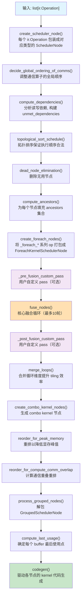
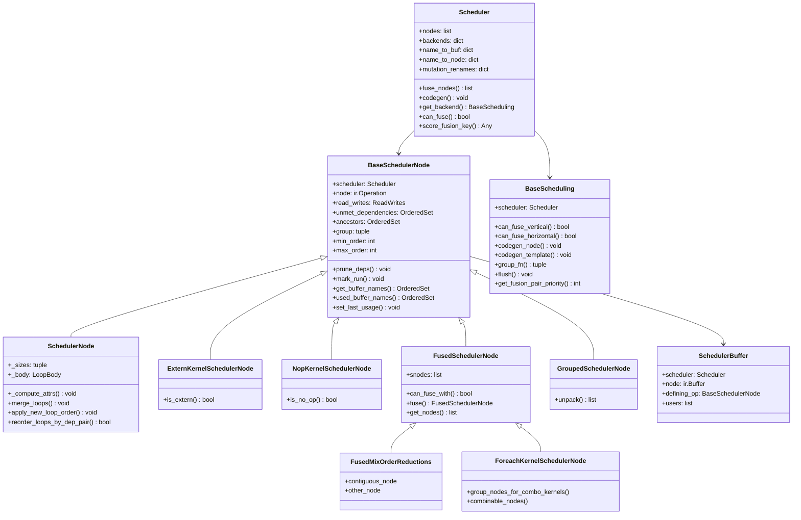
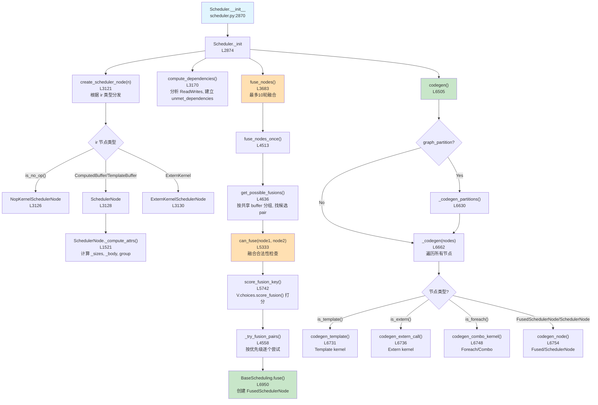
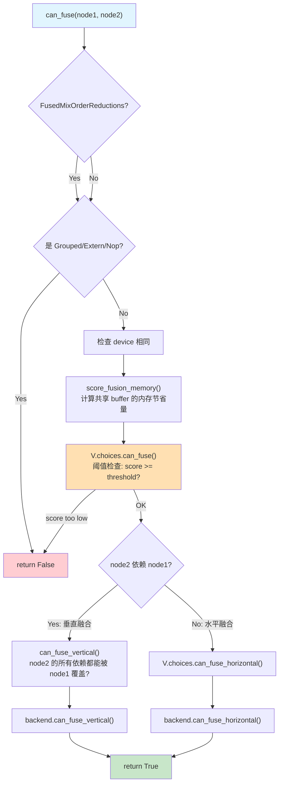
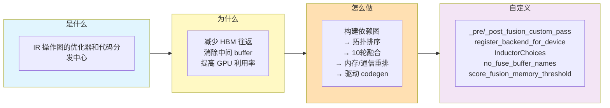

# TorchInductor Scheduler 深度分析

> 基于 `torch/_inductor/scheduler.py`（7075行）的完整技术分析
> 覆盖：是什么 / 为什么 / 怎么做 / 如何自定义

---

## 目录

1. [是什么：Scheduler 的定位与职责](#1-是什么scheduler-的定位与职责)
2. [为什么：设计动机与核心问题](#2-为什么设计动机与核心问题)
3. [怎么做：完整执行流程](#3-怎么做完整执行流程)
4. [核心类结构](#4-核心类结构)
5. [调用链：从构造到代码生成](#5-调用链从构造到代码生成)
6. [数据流：依赖与融合](#6-数据流依赖与融合)
7. [融合算法详解](#7-融合算法详解)
8. [关键设计决策](#8-关键设计决策)
9. [自定义指南](#9-自定义指南)
10. [调试与观测](#10-调试与观测)

---

## 1. 是什么：Scheduler 的定位与职责

`Scheduler`（`scheduler.py:2864`）是 TorchInductor 编译流水线中的**图优化与代码分发器**。

它的输入是一组扁平的 `ir.Operation` 节点（来自 lowering 阶段产出的 Inductor IR），输出是经过融合、重排后的 `BaseSchedulerNode` 序列，再交给各设备后端生成真实 kernel 代码。

```
FX Graph
   │  (Dynamo capture)
   ▼
Inductor IR (ir.py)        ←── lowering.py 降级
   │
   ▼
[Scheduler] ←── 本文分析重点
   │  融合 / 重排 / 内存规划
   ▼
BaseScheduling (per-device backend)
   │  codegen_node / codegen_template
   ▼
Triton / CPP Kernel 源码
```

**Scheduler 的核心职责：**

| 职责 | 对应方法 | 行号 |
|------|---------|------|
| 创建调度节点 | `create_scheduler_node()` | L3121 |
| 构建依赖图 | `compute_dependencies()` | L3170 |
| 拓扑排序 | `topological_sort_schedule()` | L3563 |
| 死节点消除 | `dead_node_elimination()` | 基于 ancestors |
| 算子融合 | `fuse_nodes()` | L3683 |
| 循环合并 | `merge_loops()` | L3656 |
| 内存峰值优化 | `reorder_for_peak_memory` | L2986 |
| 通信-计算重叠 | `reorder_for_compute_comm_overlap` | L2999 |
| 图分区（CUDAGraph） | `graph_partition()` | L5865 |
| 驱动 codegen | `codegen()` / `_codegen()` | L6505 / L6662 |

---

## 2. 为什么：设计动机与核心问题

### 2.1 核心瓶颈：内存带宽

GPU 算力远超内存带宽（H100: ~3000 TFLOPS vs ~3.3 TB/s）。对于 elementwise 算子，计算很快，但每次单独启动 kernel 都需要：
1. 从 HBM 读输入张量
2. 计算
3. 将结果写回 HBM
4. 下一个 kernel 再从 HBM 读

**不融合的代价示例（`x -> relu -> layernorm -> dropout`）：**
- 4 次 kernel 启动
- 每个中间结果都要回写 HBM 再读取
- 真实计算量很小，内存 IO 占主导

### 2.2 两种融合类型

```
垂直融合 (Vertical Fusion)         水平融合 (Horizontal Fusion)
─────────────────────────         ──────────────────────────────
 producer A   (写 buf0)            A (读 x, 写 buf_a)  B (读 x, 写 buf_b)
     │                              └───────┬───────────────┘
 consumer B   (读 buf0, 写 buf1)           合并为单个 kernel
                                           一次读 x, 同时写 buf_a 和 buf_b
合并后:
 A+B 内嵌在一个 kernel 中
 buf0 留在寄存器/shared memory
 不落回 HBM
```

**垂直融合**节省中间 buffer 的 HBM 往返；
**水平融合**节省对共享输入的多次读取。

### 2.3 为什么需要 Scheduler 而不是简单的 pass

- 融合必须满足**拓扑约束**（不能制造循环）
- 融合**不一定有收益**（reduction + pointwise 融合需要 benchmark 验证）
- 不同设备有不同融合规则（GPU Triton vs CPU CPP vs NPU）
- 内存规划需要知道 buffer 生命周期（必须先确定节点顺序）
- CUDAGraph 需要将图分区（有些 op 不能进 cudagraph）

---

## 3. 怎么做：完整执行流程

`Scheduler.__init__` 在 `_init` 方法（L2874）中完成所有初始化工作，按顺序执行以下 pass：



---

## 4. 核心类结构



### 节点类型说明

| 类型 | 对应 IR 节点 | 特点 |
|------|-------------|------|
| `SchedulerNode` | `ComputedBuffer`, `TemplateBuffer` | 可融合的计算节点，有 `_body` LoopBody |
| `ExternKernelSchedulerNode` | `ExternKernel` | 外部 kernel（cublas/cudnn），不参与融合 |
| `NopKernelSchedulerNode` | 无操作 | 纯内存别名/重排，`mark_run` 即完成 |
| `FusedSchedulerNode` | N/A | 若干 SchedulerNode 融合后的容器 |
| `FusedMixOrderReductions` | N/A | 混合规约顺序的特殊融合（L2134） |
| `ForeachKernelSchedulerNode` | `_foreach_*` | `foreach` 系列/combo kernel 容器 |
| `GroupedSchedulerNode` | N/A | 临时分组容器，最终 `unpack()` |

---

## 5. 调用链：从构造到代码生成



---

## 6. 数据流：依赖与融合

```mermaid
flowchart LR
    subgraph input["输入 IR 节点"]
        N1["op_0: buf0 = relu(x)"]
        N2["op_1: buf1 = mul(buf0, w)"]
        N3["op_2: buf2 = sum(buf1)"]
        N4["op_3: buf3 = relu(x)"]
    end

    subgraph deps["依赖分析"]
        D1["op_1.unmet_deps = {buf0}"]
        D2["op_2.unmet_deps = {buf1}"]
        D3["op_3.unmet_deps = {}"]
    end

    subgraph fusion["融合决策"]
        F1["op_0 + op_1: 垂直融合\nbuf0 共享, 不落 HBM"]
        F2["op_2: 独立, 规约不可与 pointwise 融合"]
        F3["op_3: 与 op_0+op_1 水平融合?\n检查 shared_data_score(x)"]
    end

    subgraph output["输出融合节点"]
        O1["FusedSchedulerNode\n[op_0, op_1, op_3]"]
        O2["SchedulerNode [op_2]"]
    end

    input --> deps --> fusion --> output

    style input fill:#e1f5fe
    style fusion fill:#ffe0b2
    style output fill:#c8e6c9
```



### 依赖计算关键逻辑（`compute_dependencies`, L3170）

`compute_dependencies` 遍历所有节点，通过分析 `ReadWrites` 建立 `unmet_dependencies`：

- **`MemoryDep`**: 常规读写依赖（由 `extract_read_writes` 分析 LoopBody 得到）
- **`WeakDep`**: 弱依赖（排序约束，不影响融合）
- **`StarDep`**: 全局 mutation 依赖

mutation 通过重命名机制处理（`mutation_renames`，L2918-L2928）：避免 buf 被原地修改导致的 DAG 环。

---

## 7. 融合算法详解

### 7.1 主循环（`fuse_nodes`, L3683）

```python
for i in range(10):           # 最多10轮
    old_len = len(nodes)
    nodes = self.fuse_nodes_once(nodes)
    if len(nodes) == old_len:  # 无进展则停止
        break
# 最后一轮用于 loop ordering
nodes = self.fuse_nodes_once(nodes, is_reorder_round=True)
```

### 7.2 候选对生成（`get_possible_fusions`, L4636）

```
对每个节点, 按 used_buffer_names 分组
→ 同组的节点对才可能共享数据
→ 调用 can_fuse(node1, node2) 过滤合法 pair
→ 按 score_fusion_key 降序排列
```

`config.max_fusion_buffer_group_pairwise_attempts` 控制每组最多检查多少对（避免 O(n²) 爆炸）。

### 7.3 融合合法性检查（`can_fuse`, L5333）



**`can_fuse_vertical`（L5516）关键逻辑：**
检查 node2 的所有 `unmet_dependencies` 中，凡是来自 node1 的 buffer，其索引访问模式是否与 node1 的写入完全匹配——只有访问模式一致（或是全局访问）才能内联，否则需要中间 buffer。

### 7.4 融合评分（`score_fusion_memory`, L5657）

```
score = Σ size(共享 memory dep)
```

- 对两节点的 `read_writes`（reads ∪ writes）求**交集**
- 交集越大 → 融合后节省的内存 IO 越多 → 优先融合
- 由 `V.choices.score_fusion()` 进一步包装，默认实现在 `inductor/choices.py`

### 7.5 循环检测（`will_fusion_create_cycle`, L4692）

融合本身会引入新的"合并祖先"。检查逻辑：
- 如果 node1 和 node2 融合后，是否有第三方 node3 满足：
  - node3 是 node1 的后代（依赖 node1 输出）
  - node3 也是 node2 的祖先（node2 依赖 node3）
  - 这会形成环

通过递归搜索 `FusedSchedulerNode` 中的组合祖先集来判定。

---

## 8. 关键设计决策

### 8.1 节点顺序：min_order / max_order

每个节点维护 `min_order` 和 `max_order`（L547-553）。融合后的 `FusedSchedulerNode` 的 `min_order = min(子节点)`, `max_order = max(子节点)`。这使拓扑排序和循环检测在 O(1) 内完成粗筛。

### 8.2 两阶段 Backend 分发

- `Scheduler` 持有设备到 `BaseScheduling` 实例的映射（L2877）
- `get_backend(device)` 懒加载，每个 device 实例化一次
- Backend 负责 `can_fuse_vertical/horizontal`、`codegen_node`、`group_fn`
- 这使得 NPU/XPU 等新设备只需实现 `BaseScheduling` 接口

### 8.3 V.choices：融合策略的外挂点

```python
# scheduler.py:5501
if not V.choices.can_fuse(self, node1, node2, shared_data_score):
    return False
```

`V.choices` 是 `GraphLowering.choices`，类型为 `InductorChoices`（定义于 `choices.py`）。它将融合策略与 Scheduler 核心逻辑解耦，是**自定义融合策略的最重要入口**。

### 8.4 Mutation 处理：重命名而非重排

原地修改（`buf0 = relu_(buf0)`）会导致 DAG 中出现环。Inductor 的解法是将修改后的版本重命名（`mutation_renames`），在依赖图中引入虚拟的新节点名，从而规避环的产生（L2913-L2928）。

### 8.5 MixOrderReduction（L2134）

当两个规约算子规约维度互换（一个按行，一个按列），正常情况下不可融合。`FusedMixOrderReductions` 通过特殊的 tiling 策略（将其中一个规约 tiled 化）实现融合，需满足严格的大小限制（L309-390）。

---

## 9. 自定义指南

### 9.1 自定义融合前/后 Pass

最简单的方式，无需修改 Scheduler 核心：

```python
import torch._inductor.config as inductor_config
from torch._inductor.scheduler import BaseSchedulerNode, SchedulerNode

def my_pre_fusion_pass(
    nodes: list[BaseSchedulerNode],
) -> list[BaseSchedulerNode]:
    """在融合前修改节点列表。例如：强制某些节点不参与融合"""
    for node in nodes:
        # 检查节点名字或类型，做自定义处理
        if "my_special_op" in node.get_name():
            # 将节点对应的 buffer 加入 no_fuse 集合
            from torch._inductor.virtualized import V
            for buf in node.get_buffer_names():
                V.graph.no_fuse_buffer_names.add(buf)
    return nodes

def my_post_fusion_pass(
    nodes: list[BaseSchedulerNode],
) -> list[BaseSchedulerNode]:
    """在融合后做进一步调整"""
    # 例如：打印融合统计
    from torch._inductor.scheduler import FusedSchedulerNode
    fused = [n for n in nodes if isinstance(n, FusedSchedulerNode)]
    print(f"融合后: {len(nodes)} 节点, 其中 {len(fused)} 个是融合节点")
    return nodes

# 注册 pass（在 torch.compile 之前设置）
inductor_config._pre_fusion_custom_pass = my_pre_fusion_pass
inductor_config._post_fusion_custom_pass = my_post_fusion_pass
```

### 9.2 禁止特定 Buffer 参与融合

```python
# 方式1：通过 config（静态）
import torch._inductor.config as cfg
# 在编译期间通过 pass 动态添加（见 9.1）

# 方式2：在 comm_lowering 中直接操作（框架内部用法）
# V.graph.no_fuse_buffer_names.add(buf_name)  # scheduler.py:5449-5453
```

### 9.3 为新设备注册 Backend

```python
from torch._inductor.codegen.common import register_backend_for_device
from torch._inductor.scheduler import BaseScheduling, BaseSchedulerNode, FusedSchedulerNode
from torch._inductor.codegen.wrapper import PythonWrapperCodegen

class MyNPUScheduling(BaseScheduling):
    def __init__(self, scheduler):
        super().__init__(scheduler)

    def can_fuse_vertical(
        self, node1: BaseSchedulerNode, node2: BaseSchedulerNode
    ) -> bool:
        # NPU 特有的垂直融合规则
        # 例如：NPU 不支持 reduction 与 pointwise 垂直融合
        if node1.is_reduction():
            return False
        return True

    def can_fuse_horizontal(
        self, node1: BaseSchedulerNode, node2: BaseSchedulerNode
    ) -> bool:
        # NPU 特有水平融合规则
        return True

    def group_fn(self, sizes):
        # 如何分组 loop 维度（影响 tiling 策略）
        from torch._inductor.codegen.simd import SIMDScheduling
        # 通常复用 triton 的实现
        return tuple(tuple(s) for s in sizes)

    def codegen_node(self, node):
        # 生成 NPU kernel 代码
        ...

    def codegen_template(self, template_node, epilogue_nodes, prologue_nodes):
        raise NotImplementedError

    def codegen_sync(self):
        # 生成同步代码
        V.graph.wrapper_code.writeline("torch.npu.synchronize()")

    def flush(self):
        # 将缓冲的 kernel 写入 wrapper
        ...

    def get_fusion_pair_priority(self, node1, node2) -> int:
        # 返回更小的数代表更高优先级
        # 可用于让 NPU 特有 kernel 优先被考虑融合
        return 0

    def get_backend_features(self, device):
        from torch.utils._ordered_set import OrderedSet
        from torch._inductor.codegen.common import BackendFeature
        return OrderedSet([BackendFeature.FOREACH])

class MyNPUWrapperCodegen(PythonWrapperCodegen):
    ...

# 注册 NPU backend
register_backend_for_device(
    "npu",                       # device type 字符串
    MyNPUScheduling,             # BaseScheduling 子类
    MyNPUWrapperCodegen,         # PythonWrapperCodegen 子类
)
```

### 9.4 自定义融合策略（InductorChoices）

覆盖 `V.choices` 是最精细的融合控制方式：

```python
from torch._inductor.choices import InductorChoices
from torch._inductor.virtualized import V

class MyFusionChoices(InductorChoices):
    def can_fuse(self, scheduler, node1, node2, shared_data_score: int) -> bool:
        # 完全控制融合决策
        # 例如：对大矩阵乘后的 pointwise 提高融合阈值
        if node1.is_reduction() and shared_data_score < 1024 * 1024:
            return False
        return super().can_fuse(scheduler, node1, node2, shared_data_score)

    def score_fusion(self, scheduler, node1, node2):
        # 自定义评分函数
        base_score = super().score_fusion(scheduler, node1, node2)
        # 加入自定义 bonus/penalty
        return base_score

# 在编译上下文中替换
# V.choices = MyFusionChoices()  # 需要在 GraphLowering 上下文中设置
```

### 9.5 自定义图分区规则

控制哪些 op 不进入 CUDAGraph 分区：

```python
import torch._inductor.config as cfg

# 方式1：通过 config 指定 op 名
cfg.custom_should_partition_ops = [
    "my_custom_op.default",   # op 名称
]

# 方式2：继承 Scheduler 并覆盖 should_partition
# （较重量级，通常不推荐）
```

### 9.6 调整融合相关超参

```python
import torch._inductor.config as cfg

# 融合的内存节省阈值（bytes）：低于此值不融合
cfg.score_fusion_memory_threshold = 10  # 默认 10 bytes

# 最大融合 buffer 分组中的 pairwise 检查数量
cfg.max_fusion_buffer_group_pairwise_attempts = 80  # 默认 80

# 是否开启激进融合（同 group 的所有节点都尝试两两融合）
cfg.aggressive_fusion = False

# 是否开启 Triton 模板 epilogue fusion
cfg.epilogue_fusion = True

# 是否开启 Triton 模板 prologue fusion
cfg.prologue_fusion = False

# 是否开启 loop ordering after fusion（影响 can_reorder 路径）
cfg.loop_ordering_after_fusion = True

# 混合规约顺序融合
cfg.triton.mix_order_reduction = False
```

---

## 10. 调试与观测

### 10.1 环境变量

```bash
# 输出融合日志（显示每轮融合情况）
TORCH_LOGS="+fusion" python script.py

# 输出调度器节点详细信息
TORCH_LOGS="+schedule" python script.py

# 可视化调度器图（需要 graphviz）
INDUCTOR_WRITE_SCHEDULER_GRAPH=1 python script.py

# 输出 loop ordering 日志
TORCH_LOGS="+loop_ordering" python script.py
```

### 10.2 关键调试函数

```python
# 打印节点依赖详情
node.debug_str()          # BaseSchedulerNode:L597
node.debug_str_short()    # L628
node.log_details()        # L643

# 打印融合原因（为什么两个节点没有被融合）
# WhyNoFuse 类会在 fusion_log 启用时记录原因
# scheduler.py:1387
from torch._inductor.scheduler import WhyNoFuse
```

### 10.3 Metrics

```python
import torch._inductor.metrics as metrics

# 查看融合前后的节点数
print(metrics.ir_nodes_pre_fusion)    # 融合前

# 通过 graph_stats metric table 获取统计信息
# scheduler.py:3077-3083
```

---

## 总结



**Beginner 一句话总结：**
Scheduler 就是一个"智能排课系统"——它把所有要执行的计算操作（IR 节点）按依赖关系排好序，然后尽可能地把能合并上课的课程（融合）合到同一个时间段（kernel），最后统一发给各设备的"老师"（Backend）去真正生成代码和执行。

---

## 文件引用

| 文件 | 关键内容 |
|------|---------|
| `scheduler.py:543` | `BaseSchedulerNode` 基类 |
| `scheduler.py:1503` | `SchedulerNode` - 主要计算节点 |
| `scheduler.py:1878` | `FusedSchedulerNode` |
| `scheduler.py:2864` | `Scheduler` 主类 |
| `scheduler.py:2874` | `Scheduler._init()` 完整初始化流程 |
| `scheduler.py:3121` | `create_scheduler_node()` 节点工厂 |
| `scheduler.py:3170` | `compute_dependencies()` 依赖分析 |
| `scheduler.py:3563` | `topological_sort_schedule()` |
| `scheduler.py:3683` | `fuse_nodes()` 融合主循环 |
| `scheduler.py:4513` | `fuse_nodes_once()` 单轮融合 |
| `scheduler.py:4636` | `get_possible_fusions()` 候选对生成 |
| `scheduler.py:5333` | `can_fuse()` 合法性检查 |
| `scheduler.py:5516` | `can_fuse_vertical()` |
| `scheduler.py:5657` | `score_fusion_memory()` 评分 |
| `scheduler.py:6505` | `codegen()` 代码生成入口 |
| `scheduler.py:6909` | `BaseScheduling` 后端接口 |
| `config.py:301` | `_pre_fusion_custom_pass` |
| `config.py:311` | `_post_fusion_custom_pass` |
| `codegen/common.py:408` | `register_backend_for_device()` |

## Related Pages

- [[llm/02_training/torch_compile/overview]]
- [[PyTorch_Inductor_Technical_Analysis]]
- [[inductor_codegen_analysis]]
