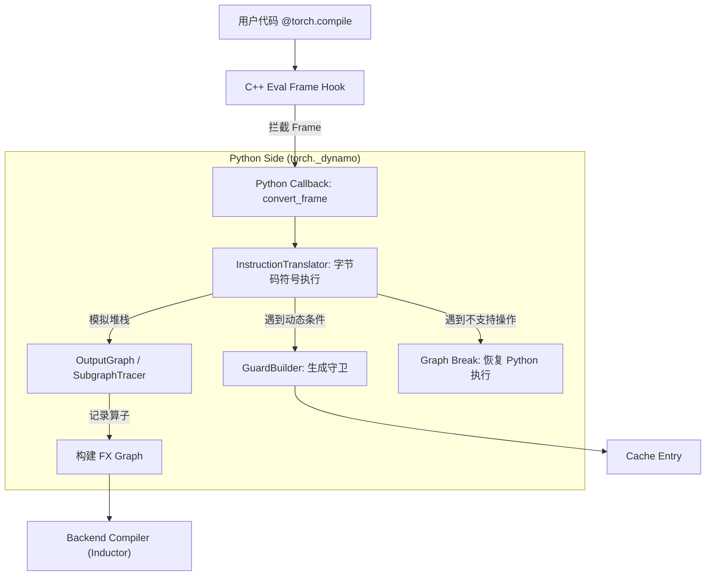
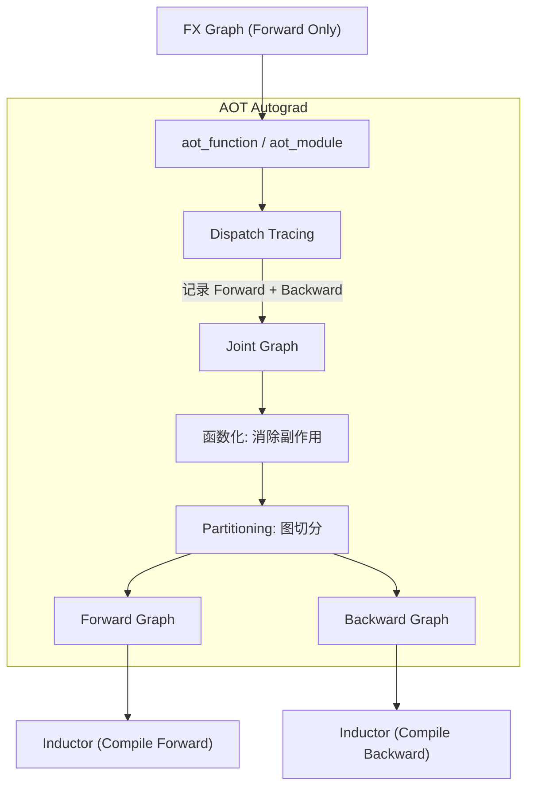
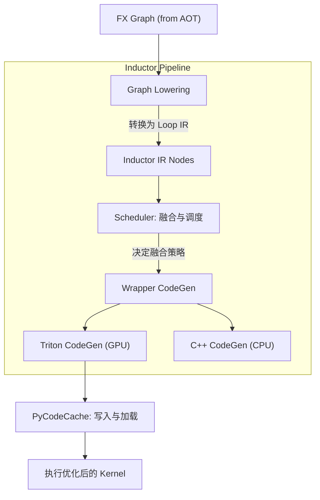

# PyTorch Compiler (`torch.compile`) 技术详解

`torch.compile` 是 PyTorch 2.0 引入的核心编译功能，旨在在保持 PyTorch 易用性的同时提供显著的性能提升。它由三个主要组件构成流水线：**TorchDynamo** (捕获图) -> **AOT Autograd** (处理反向传播) -> **TorchInductor** (生成优化代码)。

## 1. TorchDynamo (`torch._dynamo`)

**定位**：Python 级别的 JIT 编译器前端，负责捕获 PyTorch 图。

### 1.1 核心原理
Dynamo 的核心在于**Frame Evaluation API (帧评估 API)**。它不依赖于静态分析（如 TorchScript），而是挂载到 CPython 的运行时，拦截 Python 字节码的执行。

*   **实现位置**：
    *   **C++ 侧 (`torch/csrc/dynamo/`)**: 实现了 `set_eval_frame` 钩子。通过 `_PyInterpreterState_GetEvalFrameFunc` 获取 Python 解释器的控制权。
    *   **Python 侧 (`torch/_dynamo/`)**: 包含字节码分析、符号执行和图构建的主要逻辑。

### 1.2 工作流程与调用栈

Dynamo 的工作流程始于 Python 解释器执行被装饰的函数。



**关键调用栈 (Call Stack):**

```text
torch.compile(...)
  -> torch._dynamo.optimize(...)
     -> torch._C._dynamo.eval_frame.set_eval_frame(...)  # 设置 C++ Hook

# --- 运行时 ---
_PyEval_EvalFrameDefault (CPython Interpreter)
  -> custom_eval_frame (C++ Hook in torch/csrc/dynamo/eval_frame.c)
     -> torch._dynamo.convert_frame.convert_frame (Python Callback)
        -> torch._dynamo.convert_frame._compile
           -> torch._dynamo.symbolic_convert.InstructionTranslator.run
              -> step()  # 单步执行字节码
                 -> LOAD_FAST / BINARY_ADD ... (Methods in InstructionTranslator)
              -> torch._dynamo.output_graph.OutputGraph.create_graph_input
```

### 1.3 核心类与数据结构

*   **`InstructionTranslator` (`torch._dynamo.symbolic_convert`)**:
    *   核心驱动类。它在一个虚拟的堆栈上模拟 Python 字节码的执行。
    *   维护 `symbolic_locals`，将 Python 变量映射到 `VariableTracker`。
*   **`VariableTracker` (`torch._dynamo.variables.base`)**:
    *   Dynamo 中所有“值”的抽象基类。它不存储真实数据（Tensor 数据），而是存储元数据（类型、来源、属性）。
    *   子类包括 `TensorVariable`, `ListVariable`, `ConstantVariable` 等。
*   **`OutputGraph` (`torch._dynamo.output_graph`)**:
    *   负责构建最终的 FX Graph。包含 `SubgraphTracer`，用于记录 `torch.*` 操作到 FX 节点。
*   **`GuardBuilder` (`torch._dynamo.guards`)**:
    *   负责收集并生成 Guards。生成的 Guard 是 Python 函数，用于验证输入是否满足编译时的假设（例如 Tensor 的 shape、dtype 是否改变）。

---

## 2. AOT Autograd (`torch._functorch.aot_autograd`)

**定位**：负责自动微分（Autograd）的“提前”（Ahead-of-Time）捕获，连接前端（Dynamo）和后端（Inductor）。

### 2.1 核心原理
Dynamo 输出的是一个前向的 FX Graph。AOT Autograd 利用 PyTorch 的 `torch.dispatch` 机制，通过 tracing 生成包含反向传播逻辑的完整图（Joint Graph），然后将其切分为 Forward 和 Backward 图。

*   **实现位置**: `torch/_functorch/aot_autograd.py`。

### 2.2 工作流程与调用栈



**关键调用栈 (Call Stack):**

```text
# 由 Dynamo Backend 调用
torch._functorch.aot_autograd.aot_function (or aot_module_simplified)
  -> create_aot_state
  -> aot_stage1_graph_capture
     -> run_functionalized_fw_and_collect_metadata
        # 在这里使用 torch.dispatch 模式运行代码
        # 捕获联合图 (Joint Graph)
  -> aot_stage2_compile
     -> default_partition (切分 Forward/Backward)
     -> fw_compiler (通常是 Inductor)
     -> bw_compiler (通常是 Inductor)
```

### 2.3 核心类与数据结构

*   **`AOTConfig`**:
    *   配置对象，存储编译器函数 (`fw_compiler`, `bw_compiler`)、分区器 (`partition_fn`) 等配置。
*   **`AOTState`**:
    *   贯穿 AOT 过程的上下文对象，存储 tracing 期间的元数据。
*   **`JointGraph`**:
    *   一个临时的 FX Graph，同时包含前向计算和反向传播的逻辑（通过 tracing `autograd.grad` 得到）。
*   **Functionalization Wrapper**:
    *   处理如 `add_` 这类 In-place 操作，将其转换为非 In-place 的形式（返回新 Tensor），并在运行时通过 copy 回写。

---

## 3. TorchInductor (`torch._inductor`)

**定位**：默认的深度学习编译器后端，生成高性能机器码（Triton/C++）。

### 3.1 核心原理
Inductor 将 FX Graph 降级（Lowering）为基于 Loop 的 IR，进行激进的算子融合（Fusion），最后生成 Triton 或 C++ 代码。

*   **实现位置**: `torch/_inductor/`。

### 3.2 工作流程与调用栈



**关键调用栈 (Call Stack):**

```text
torch._inductor.compile_fx.compile_fx
  -> compile_fx_inner
     -> GraphLowering.run (图降级)
        -> GraphLowering.run_node (处理每个 FX 节点)
           -> lowerings[target] (调用对应的 lowering 函数, 如 aten.add)
              -> return Pointwise(...) / Reduction(...) (生成 IR 节点)

     -> Scheduler.process (调度与融合)
        -> Scheduler.create_scheduler_nodes
        -> Scheduler.fuse_nodes (核心融合逻辑)

     -> GraphLowering.compile_to_module
        -> PythonWrapperCodegen.generate
           -> TritonKernel.generate (生成 Triton 代码)
        -> PyCodeCache.write (写入缓存文件)
```

### 3.3 核心类与数据结构

*   **`GraphLowering` (`torch._inductor.graph`)**:
    *   Inductor 的主入口类，负责管理从 FX Graph 到 Inductor IR 的转换。维护 `graph_outputs` 等状态。
*   **Inductor IR Nodes (`torch._inductor.ir`)**:
    *   **`Pointwise`**: 表示逐元素操作（如 `add`, `sin`）。可以被融合到任何 Loop 中。
    *   **`Reduction`**: 表示归约操作（如 `sum`, `mean`）。是 Loop Fusion 的主要边界。
    *   **`StorageBox` / `TensorBox`**: 管理 Tensor 的存储布局。
*   **`Scheduler` (`torch._inductor.scheduler`)**:
    *   负责优化 IR。它决定哪些节点应该被计算，哪些应该被融合。
*   **`TritonCodeCache` / `TritonKernel` (`torch._inductor.codegen.triton`)**:
    *   负责拼接字符串生成最终的 Triton Kernel Python 代码。

---

## Related Pages

- [[llm/02_training/torch_compile/overview]]
- [[PyTorch_Dynamo_Technical_Analysis]]
- [[PyTorch_Inductor_Technical_Analysis]]
