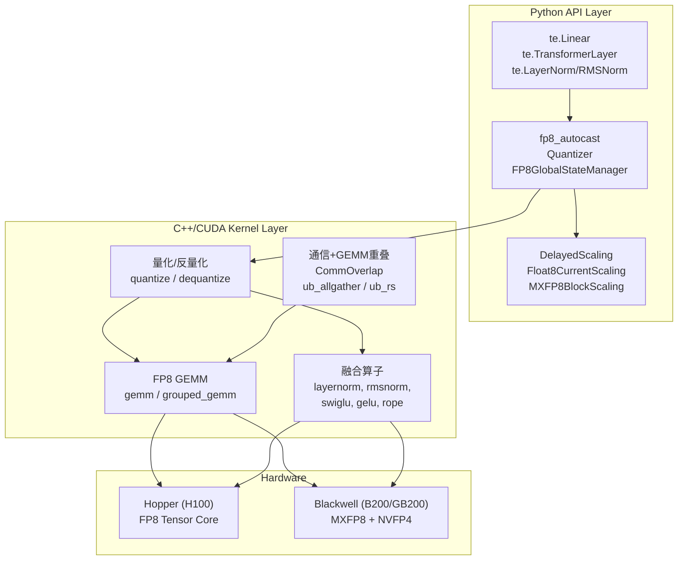
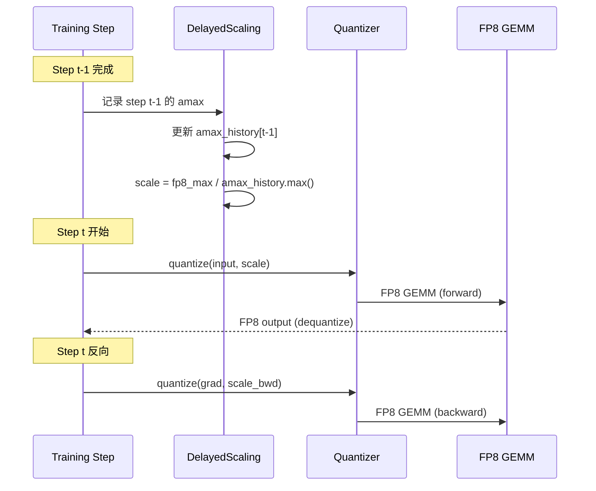

# Transformer Engine 技术分析：架构、精度体系与 Megatron 集成

> 基于 NVIDIA TransformerEngine GitHub 仓库 (dev/main, 2026) 源码分析
> 创建日期: 2026-05-06

---

## 1. 概述

Transformer Engine (TE) 是 NVIDIA 开源的 Transformer 加速库，核心价值是**通过低精度浮点格式（FP8/FP4/MXFP8）提升 Transformer 模型训练和推理的吞吐量并降低显存**。它与 Megatron-LM 深度集成，是 Megatron 低精度训练的实际执行引擎。

**关键特性：**
- 支持 FP8 (Hopper/Ada)、MXFP8/NVFP4 (Blackwell)、BF16/FP16 (Ampere+)
- 提供即用的 Transformer 构建模块（`te.Linear`、`te.TransformerLayer`、`te.LayerNorm`）
- 融合 kernel 优化（Attention、RMSNorm、SwiGLU、RoPE、MoE routing）
- 通信-计算重叠（User Buffer + CommOverlap）
- 多框架支持：PyTorch、JAX/Flax

---

## 2. 架构



TE 采用**两层架构**：
1. **Python API**：构建 Transformer 层的模块，管理量化状态和 scaling factors
2. **C++/CUDA 核心库**：高性能 kernel（GEMM、量化、融合算子），通过 pybind 暴露给 Python

---

## 3. 精度格式与硬件支持

### 3.1 格式对照表

| 格式 | 指数/尾数 | 最小正数 | 最大值 | 硬件代际 |
|------|----------|---------|-------|---------|
| FP32 | E8M23 | ~1.18e-38 | ~3.40e38 | All |
| BF16 | E8M7 | ~1.18e-38 | ~3.39e38 | Ampere+ |
| FP16 | E5M10 | ~6.10e-5 | 65504 | Volta+ |
| FP8 E4M3 | E4M3 | ~1.95e-3 | 448 | Hopper/Ada/Blackwell |
| FP8 E5M2 | E5M2 | ~1.53e-5 | 57344 | Hopper/Ada/Blackwell |
| FP8 HYBRID | — | FWD=E4M3, BWD=E5M2 | — | Hopper/Ada/Blackwell |
| MXFP8 | E8(共享)+微缩放 | 逐块可调 | 逐块可调 | Blackwell |
| NVFP4 (E2M1) | E2M1 | ~0.5 | 6 | Blackwell |

### 3.2 格式选择策略

```
训练推荐: HYBRID > E4M3 > E5M2
  - HYBRID: 前向用 E4M3（精度高）、反向用 E5M2（动态范围大）
  - E4M3: 纯精度优先（推理部署推荐）
  - E5M2: 训练初期 / loss 不收敛时（动态范围最大）

推理推荐: E4M3 > NVFP4
  - E4M3: 标准 FP8 推理，Hopper 广泛支持
  - NVFP4: 极致压缩，Blackwell 专属
```

---

## 4. Recipe 系统与量化控制

### 4.1 Recipe 类型

TE 的 recipe 控制 FP8 的**何时量化、如何 scale、amax 如何计算**：

| Recipe | 核心策略 | amax 历史 | 适用场景 |
|--------|---------|-----------|---------|
| **DelayedScaling** | 基于前一步的 amax 计算当前 scale | 可配置长度 | 通用训练，Megatron 默认 |
| **Float8CurrentScaling** | 实时计算 amax 和 scale | 不需要 | Megatron `tensorwise` |
| **MXFP8BlockScaling** | 硬件块级微缩放 | 硬件管理 | Blackwell 训练/推理 |
| **NVFP4BlockScaling2D** | 2D 块级 FP4 | 硬件管理 | Blackwell 推理 |

### 4.2 DelayedScaling 详解（Megatron 最常用）

```python
# TE recipe 创建
recipe = DelayedScaling(
    margin=0,                          # scale margin (2^margin)
    fp8_format=Format.HYBRID,          # 或 E4M3 / E5M2
    amax_history_len=1024,             # amax 历史窗口
    amax_compute_algo="max",           # "max" / "most_recent"
    reduce_amax=True,                  # 跨 DP group 做 amax all_reduce
    use_split_accumulator=True,        # FP8 GEMM split accumulator
)
```

**工作流程：**



延迟 scaling 的核心思想：**用上一步的 amax 估计当前步的 scale**，避免实时计算 overhead。

### 4.3 Float8CurrentScaling（对应 Megatron `tensorwise`）

```python
# Megatron 中的映射
# --fp8-recipe tensorwise → Float8CurrentScaling
recipe = Float8CurrentScaling(
    margin=0,
    fp8_format=Format.HYBRID,
)
```

实时计算当前 tensor 的 amax 并量化，精度更实时但计算开销略大。适合小 batch / 短序列场景。

---

## 5. 量化器体系

### 5.1 Quantizer 类型

从 `quantization.py` 和 `base.py`：

| Quantizer | 对应 Recipe | Scaling 方向 |
|-----------|------------|-------------|
| `Float8CurrentScalingQuantizer` | Float8CurrentScaling | `rowwise` / `columnwise` |
| `Float8Quantizer` (Delayed) | DelayedScaling | `rowwise` / `columnwise` |
| `MXFP8Quantizer` | MXFP8BlockScaling | 硬件块级 |
| `NVFP4Quantizer` | NVFP4BlockScaling2D | 2D 块级 |

### 5.2 量化/反量化流程

```python
# 伪代码重现 quantize_weight 逻辑 (base.py)
def quantize_weight(weight, quantizer, workspace_cache, skip_update=False):
    if workspace_cache is not None and not skip_update:
        # 命中缓存：更新已有量化工作区
        tex.quantize(weight, quantizer, workspace, skip_update_flag)
    else:
        # 缓存未命中：完整量化
        workspace = quantizer.quantize(weight)
    
    # rowwise scaling → columnwise 矩阵乘法
    # quantizer.set_usage(rowwise=True)  → 输入按行 scale
    # quantizer.set_usage(columnwise=True) → 权重按列 scale
```

### 5.3 Scale 计算核心公式

来自 `quantization.py: _default_sf_compute`:

$$sf = \frac{fp8\_max}{amax \cdot 2^{margin}}$$

其中：
- `fp8_max` = 448 (E4M3) 或 57344 (E5M2) 或 240 (HYBRID fwd)
- `amax` = $max(|tensor|)$（延迟 scaling 使用历史最大值）
- `margin` = 安全边际，防止溢出

**边界情况处理：**
- `amax == 0`：保持当前 scale 不变
- `amax == NaN/Inf`：保持当前 scale 不变
- 溢出（overflow）：scale clamp 到 `FP32_MAX`

---

## 6. FP8GlobalStateManager — 全局量化状态管理

### 6.1 设计动机

在大规模分布式训练中，每层独立管理 scale 会导致 **amax all_reduce 碎片化**。`FP8GlobalStateManager` 将各层的 amax 和 scale 聚合到全局 buffer，做**批量 reduce**。

### 6.2 核心数据结构

```python
class FP8GlobalState:
    global_amax_buffer: Dict[str, list]         # 按 (fwd/bwd, recipe, group) 分组的 amax
    global_amax_history_buffer: Dict[str, list] # 完整 amax 历史
    global_scale_buffer: Dict[str, list]        # scale factors
    fp8_enabled: bool                           # FP8 总开关
    fp8_calibration: bool                       # 仅校准模式
    fp8_recipe: Recipe                          # 当前 recipe
    fp8_distributed_group: ProcessGroup         # amax reduction 通信组
```

### 6.3 关键方法

| 方法 | 功能 |
|------|------|
| `add_fp8_tensors_to_global_buffer()` | 将每层的 amax/scale 注册到全局 buffer |
| `reduce_and_update_fp8_tensors()` | 批量 all_reduce(MAX) amax，更新所有 scale |
| `autocast_enter()/exit()` | 进入/退出 FP8 autocast 上下文 |
| `copy_forward_fp8_meta_tensors_for_recompute()` | 激活重计算前保存 fp8_meta |
| `get_old_fp8_meta_tensors_for_recompute()` | 第二次前向时恢复旧的 fp8_meta |
| `restore_fp8_meta_tensors()` | 重计算完成后恢复更新后的值 |

### 6.4 激活重计算与 FP8

```text
Forward (1st pass):
  计算 → save fp8_meta → 释放激活
Forward (2nd pass, recompute):
  恢复 old fp8_meta → 重计算 → restore 更新后的 fp8_meta
Backward:
  使用更新后的 scale 做反向量化
```

这是延迟 scaling 的关键特性——只有延迟 scaling 需要此机制，`Float8CurrentScaling` 是 noop。

---

## 7. C++ Kernel 层——高性能计算核心

### 7.1 量化与反量化

```cpp
// extensions.h 暴露的核心函数

// 单张量量化
py::object quantize(const Tensor &tensor, Quantizer quantizer, 
                     py::object output, optional<Tensor> noop_flag);

// 反量化
py::object dequantize(const py::handle &input, DType otype);

// 分块量化（blockwise）
at::Tensor group_quantize(const Tensor &tensor, Quantizer quantizer);

// 分块量化 + 偏置梯度融合
at::Tensor bgrad_group_quantize(const Tensor &tensor, Quantizer quantizer,
                                  const Tensor &bgrad);

// 多张量批量量化
void multi_tensor_quantize(const vector<Tensor> &tensors,
                             const vector<Quantizer> &quantizers);
```

### 7.2 FP8 GEMM

```cpp
// 主 GEMM 接口——融合了量化、bias、GELU、通信重叠
py::object gemm(py::handle A, bool transa, py::handle B, bool transb,
                py::object D, py::handle quantizer,
                optional<Tensor> bias,       // 可选 bias
                optional<Tensor> gelu_in,    // 可选 GELU 输入（融合）
                bool grad,                    // 是否为梯度模式
                bool accumulate,              // 是否累加到输出
                bool split_accumulator,       // split-k accumulator
                CommOverlapCore *comm_overlap // 通信重叠句柄
);

// Grouped GEMM（MoE 关键优化）
optional<vector<Tensor>> te_general_grouped_gemm(
    const vector<Tensor> &A_list, const vector<Tensor> &B_list,
    const vector<Quantizer> &quantizers, ...
);

// Atomic GEMM
at::Tensor te_atomic_gemm(const Tensor &A, const Tensor &B,
                           int math_sm_count, int m_split, int n_split,
                           bool gemm_producer, Tensor counter);
```

### 7.3 融合算子

| 算子 | Kernel | 融合内容 |
|------|--------|---------|
| **LayerNorm** | `layernorm_fwd/bwd` | LN + FP8 cast |
| **RMSNorm** | `rmsnorm_fwd/bwd` | RMSNorm + FP8 cast |
| **SwiGLU** | `swiglu_fwd/bwd` | SiLU + Gate + Mul |
| **GELU** | `gelu_fwd/bwd` | GELU + FP8 cast |
| **RoPE** | `fused_rope_forward/backward` | RoPE + QKV 融合 |
| **MoE TopK** | `fused_topk_with_score_function_fwd/bwd` | Top-K + Softmax + score |
| **MoE Permute** | `moe_permute_fwd/bwd` | Token permutation for dispatch |

---

## 8. 通信-计算重叠（CommOverlap）

### 8.1 三类 CommOverlap 对象

从 `extensions.h`：

| 类 | 用途 |
|----|------|
| `CommOverlapHelper` | 管理 process groups、rank 拓扑、节点信息 |
| `CommOverlap` | AG/RS 的 bulk overlap + pipelined overlap |
| `CommOverlapP2P` | P2P 通信重叠（Pipeline Parallel） |

### 8.2 Bulk Overlap 流程

```cpp
// AG Bulk Overlap 与外部 GEMM
void bulk_overlap_ag_with_external_gemm(
    CommOverlap &allgather_communicator,
    Stream send_stream,
    Stream recv_stream
);
```

Python 层（Megatron 集成）：
1. TE 层的 `ub_overlap_ag=True` → `CommOverlapHelper.ub_allgather()` 异步启动
2. GEMM 在 `recv_stream` 上流式消费已到达数据
3. `ub_overlap_rs=True` → ReduceScatter 与 wgrad GEMM 并行

### 8.3 NVSHMEM 支持

TE 内置 NVSHMEM 后端 (`init_nvshmem_backend`, `nvshmem_send_on_current_stream`, `nvshmem_finalize`)，用于跨节点低延迟通信。

---

## 9. Megatron-LM 集成桥接

### 9.1 架构总览

Megatron 通过 `megatron/core/extensions/transformer_engine.py` 实现完整的 TE 桥接层：

```mermaid
graph TD
    subgraph "Megatron-LM Config"
        MPC["ModelParallelConfig<br/>fp8_recipe, tp_comm_overlap,<br/>ub_overlap_ag, ub_bulk_wgrad, ..."]
        QC["TEQuantizationParams<br/>training_recipe + eval_recipe"]
    end

    subgraph "Bridge Layer"
        TEL["TELinear<br/>parallel_mode: column/row/duplicated"]
        TELN["TELayerNormColumnParallelLinear<br/>fused LN+Linear"]
        TENorm["TENorm<br/>LayerNorm / RMSNorm / FusedRMSNorm"]
        TEAct["TEActivationOp<br/>SwiGLU / GELU / ..."]
    end

    subgraph "Transformer Engine"
        TE_L ["te.Linear"]
        TE_LN ["te.LayerNormLinear"]
        TE_Norm["te.LayerNorm/RMSNorm"]
    end

    MPC --> TEL
    QC --> TEL
    TEL --> TE_L
    TELN --> TE_LN
    TENorm --> TE_Norm
```

### 9.2 TELinear — 核心桥接类

`TELinear` 统一处理 ColumnParallel / RowParallel / Duplicated 三种模式：

```python
# transformer_engine.py 核心逻辑简化

class TELinear(te.Linear):
    def __init__(self, config, parallel_mode):
        self.te_quant_params = TEQuantizationParams.parse_from_config(
            config.quantization_config
        )
        self.parallel_mode = parallel_mode  # "column" / "row" / "duplicated"
        
        # TP 通信重叠配置桥接
        if config.tp_comm_overlap:
            extra_kwargs["ub_overlap_ag"] = config.tp_comm_overlap_ag
            extra_kwargs["ub_overlap_rs"] = config.tp_comm_overlap_rs
            extra_kwargs["ub_bulk_wgrad"] = config.tp_comm_bulk_wgrad
            extra_kwargs["ub_bulk_dgrad"] = config.tp_comm_bulk_dgrad
    
    def forward(self, input, ...):
        # 获取 FP8 autocast 上下文
        autocast_ctx = _get_fp8_autocast_for_quant_params(
            self.te_quant_params, fp8_group=amax_group
        )
        with autocast_ctx:
            return super().forward(input)
```

### 9.3 FP8 Recipe 映射

Megatron 参数 → TE 内部类型：

| Megatron `--fp8-recipe` | TE Recipe 类 | Quantizer 类 |
|-------------------------|-------------|-------------|
| `tensorwise` | `Float8CurrentScaling` | `Float8CurrentScalingQuantizer` |
| `delayed` | `DelayedScaling` | `Float8Quantizer` |
| `blockwise` | `Float8BlockScaling` (TE 内部) | `Float8BlockScalingQuantizer` |
| `mxfp8` | `MXFP8BlockScaling` | `MXFP8Quantizer` |
| `custom` | 用户 YAML 定义 | 对应 Quantizer |

### 9.4 Amax Reduction Group

```python
def _get_amax_reduction_group(config):
    # 默认在 CP group 内做 amax reduction
    # tp_only_amax_red=True → 仅在 TP group 内 reduction
    if config.tp_only_amax_red:
        return tp_group
    return cp_group or tp_group
```

---

## 10. CUDA Graphs 与 FP8

来自 `Megatron-LM_Distributed_Parallel_Exam.md` Q14：

- TE 的 `make_graphed_callables()` 自动处理内部 FP8/BF16 kernel 的 graph capture
- `--cuda-graph-scope`：`full`（全图）/ `micro_batch` / 细粒度子模块
- FP8 的 scale update 在 graph 外部完成，graph 内部使用固定的 scale

---

## 11. 环境变量与调试

```bash
# FP8 调试
NVTE_DEBUG=1                         # 启用 TE debug 输出
NVTE_DEBUG_LEVEL=1                   # debug 详细级别

# 强制禁用 FP8（回退到 BF16）
NVTE_FP8_DISABLE=1

# 构建配置
NVTE_CUDA_ARCHS="90;100"            # CUDA 架构（90=H100, 100=B200）
NVTE_FRAMEWORK=pytorch              # 目标框架
MAX_JOBS=16                         # 并行编译线程数

# 量化模型初始化
# 使用 quantized_model_init 上下文创建仅保存量化参数的模型
```

---

## 12. 相关页面

- [[llm/02_training/low_precision_training_analysis]] — Megatron 低精度训练全栈
- [[llm/06_infra/megatron-lm/overview]] — Megatron-LM 知识地图
- [[llm/06_infra/megatron-lm/megatron_comm_overlap_analysis]] — TP 通信重叠中的 TE User Buffer
- [[llm/06_infra/megatron-lm/Megatron-LM_Distributed_Parallel_Exam]] — Q14 CUDA Graphs + Q15 FP8
- [[llm/05_model_families/deepseek/deepseek_v4_fp4_qat_analysis]] — FP4 QAT 实现
- [[llm/02_training/activation_checkpointing_analysis]] — TE checkpoint 与 FP8 激活重计算
- [[llm/02_training/RL_Training_Inference_Precision_Analysis]] — RL 训练推理精度对齐
