# Megatron-Core 通信掩盖（Communication Overlap）技术详解

> 基于 Megatron-LM `dev` 分支代码分析，所有引用均来自实际代码路径与行号。

---

## 一、概述

Megatron-Core 在训练大规模模型时，通信（AllGather/ReduceScatter/All-to-All/P2P）往往占据 30%~50% 的 step 时间。框架通过在不同并行维度（TP/DP/PP/EP/CP）上引入**通信与计算重叠**，将通信时间从关键路径上隐藏。

### 维度对照表

| 维度 | 通信类型 | 掩盖方式 | 关键参数 | 默认状态 |
|---|---|---|---|---|
| **TP** | AllGather / ReduceScatter | Bulk 异步 + Pipelined Ring 替换 | `--tp-comm-overlap` | 默认 `False` |
| **DP（梯度）** | ReduceScatter / AllReduce | Bucket 分块异步，随反向传播触发 | `--overlap-grad-reduce` | 默认 `False` |
| **DP（参数）** | AllGather | 异步 prefetch，随前向计算触发 | `--overlap-param-gather` | 默认 `False` |
| **PP** | P2P send/recv | 1F1B 稳态异步重叠 | `--overlap-p2p-comm` | 默认 `False`（⚠️ 注意） |
| **EP** | A2A | 1F1B 跨 microbatch 重叠 + delay-wgrad | `--overlap-moe-expert-parallel-comm` | 默认 `False` |
| **CP** | AllGather / RS | Ring P2P / async AllGather 重叠 Attention | 随 `--context-parallel-size` 启用 | 自动开启 |

---

## 二、TP 通信掩盖（`--tp-comm-overlap`）

### 2.1 原理与参数入口

TP 通信掩盖仅在与 Sequence Parallel 结合时生效。配置定义在：

- **文件**：[`megatron/core/model_parallel_config.py`](Megatron-LM/megatron/core/model_parallel_config.py)
- **行号**：`196~276`

```python
# model_parallel_config.py:196-225
tp_comm_overlap: bool = False
"""If true, allows overlapping of Linear layer execution with tensor parallel communication"""

tp_comm_bulk_wgrad: bool = True
"""Controls All-Gather overlap with Bprop activation gradient GEMM."""

tp_comm_bulk_dgrad: bool = True
"""Controls Reduce-Scatter overlap with Bprop weight gradient GEMM."""

tp_comm_overlap_ag: bool = True
"""Controls All-Gather overlap with GEMM by pipelining."""

tp_comm_overlap_rs: bool = True
"""Controls Reduce-Scatter overlap with GEMM by pipelining."""
```

### 2.2 User Buffer 初始化

TP 掩盖依赖 Transformer Engine (TE) 预分配的静态 user buffer，在训练初始化时注册：

- **文件**：[`megatron/training/initialize.py`](Megatron-LM/megatron/training/initialize.py)
- **行号**：`206~276`

```python
# initialize.py:206-276
def _initialize_tp_communicators():
    """initializing the communicators with user buffers for high-performance
    tensor-model-parallel communication overlap"""
    te_module.base.initialize_ub(
        shape=input_shape,
        tp_size=args.tensor_model_parallel_size,
        use_fp8=(args.fp8 is not None),
        ub_cfgs=ub_cfgs,
        bootstrap_backend=args.tp_comm_bootstrap_backend,
    )
```

### 2.3 TE 层参数桥接

Megatron-Core 通过 `TELinear` 将上述配置传递给 TE：

- **文件**：[`megatron/core/extensions/transformer_engine.py`](Megatron-LM/megatron/core/extensions/transformer_engine.py)
- **行号**：`740~775`

```python
# transformer_engine.py:740-775
if self.config.tp_comm_overlap and parallel_mode != "duplicated":
    if is_te_min_version("1.5.0"):
        extra_kwargs["ub_overlap_ag"] = self.config.tp_comm_overlap_ag
        extra_kwargs["ub_overlap_rs"] = self.config.tp_comm_overlap_rs
    extra_kwargs["ub_bulk_wgrad"] = self.config.tp_comm_bulk_wgrad
    extra_kwargs["ub_bulk_dgrad"] = self.config.tp_comm_bulk_dgrad
    extra_kwargs["ub_name"] = tp_comm_buffer_name
```

### 2.4 Pipelined Overlap（有依赖）

**场景**：Linear GEMM 与通信存在**数据依赖**（如前向必须先 AllGather 完整输入，才能做 GEMM）。

**实现**：TE 将 AllGather / ReduceScatter 拆分为多步 ring-exchange，每步只传一个 chunk。GEMM 可以"流式"消费已到达的数据，无需等待整个张量通信完成。

```mermaid
%%{init: {'theme': 'base', 'themeVariables': { 'primaryColor': '#e1f5fe', 'primaryTextColor': '#01579b', 'primaryBorderColor': '#0288d1', 'lineColor': '#0288d1', 'secondaryColor': '#fff3e0', 'tertiaryColor': '#e8f5e9'}}}%%
gantt
    title Pipelined TP Overlap（AG + GEMM）
    dateFormat X
    axisFormat %s
    section 无重叠
    AG(完整)         :ag0, 0, 4
    GEMM计算         :gemm0, after ag0, 4
    section Pipelined重叠
    AG-chunk0        :ag1, 0, 1
    AG-chunk1        :ag2, 1, 2
    AG-chunk2        :ag3, 2, 3
    AG-chunk3        :ag4, 3, 4
    GEMM-chunk0      :gemm1, 1, 2
    GEMM-chunk1      :gemm2, 2, 3
    GEMM-chunk2      :gemm3, 3, 4
    GEMM-chunk3      :gemm4, 4, 5
```



**关键代码**：`ub_overlap_ag` / `ub_overlap_rs` 由 TE 底层实现，Megatron 仅传递开关。

### 2.5 Bulk Overlap（无依赖）

Bulk 掩盖处理的是**反向传播中通信与计算无数据依赖**的场景。

#### 2.5.1 `ub_bulk_wgrad`：AllGather 与 DGRAD GEMM 重叠

**物理场景**：RowParallelLinear（如 `proj`、`fc2`）反向时，计算 dX（dgrad）**不需要完整的输入 X**，但计算 dW（wgrad）**需要**。因此先启动 `AllGather(X)`，同时立刻计算 `dgrad GEMM`。

**代码验证**：Legacy 层实现（`async_op=True` 的 AG 与 dgrad 并行）

- **文件**：[`megatron/core/tensor_parallel/layers.py`](Megatron-LM/megatron/core/tensor_parallel/layers.py)
- **行号**：`520~529`

```python
# layers.py:520-529
handle = dist_all_gather_func(
    all_gather_buffer, input, group=tp_group, async_op=True
)
# 立刻计算 dgrad —— 不依赖 all_gather_buffer！
grad_input = grad_output.matmul(weight)
```



```mermaid
%%{init: {'theme': 'base', 'themeVariables': { 'primaryColor': '#e1f5fe', 'primaryTextColor': '#01579b', 'primaryBorderColor': '#0288d1', 'lineColor': '#0288d1', 'secondaryColor': '#fff3e0', 'tertiaryColor': '#e8f5e9'}}}%%
gantt
    title Bulk Overlap：ub_bulk_wgrad（AG || dgrad）
    dateFormat X
    axisFormat %s
    section 串行执行
    AG(X)            :a0, 0, 4
    dgrad GEMM       :d0, after a0, 3
    wgrad GEMM       :w0, after d0, 4
    section Bulk重叠
    Comm Stream:AG(X) :a1, 0, 4
    Comp Stream:dgrad :d1, 0, 3
    Comp Stream:wgrad :w1, 3, 7
```

#### 2.5.2 `ub_bulk_dgrad`：ReduceScatter 与 WGRAD GEMM 重叠

**物理场景**：ColumnParallelLinear（如 QKV、FC1）反向时，dX 算完后需要 `ReduceScatter` 分发回各 rank。但 `wgrad GEMM`（`X.T @ dout`）与 RS 操作**内存对象完全不同**，可并行。

**代码验证**：

- **文件**：[`megatron/core/tensor_parallel/layers.py`](Megatron-LM/megatron/core/tensor_parallel/layers.py)
- **行号**：`552~558`

```python
# layers.py:552-558
# 异步启动 ReduceScatter(dX)
handle = dist_reduce_scatter_func(
    sub_grad_input, grad_input, group=tp_group, async_op=True
)
# 立刻计算 wgrad —— 不依赖 sub_grad_input！
```



```mermaid
%%{init: {'theme': 'base', 'themeVariables': { 'primaryColor': '#e1f5fe', 'primaryTextColor': '#01579b', 'primaryBorderColor': '#0288d1', 'lineColor': '#0288d1', 'secondaryColor': '#fff3e0', 'tertiaryColor': '#e8f5e9'}}}%%
gantt
    title Bulk Overlap：ub_bulk_dgrad（RS || wgrad）
    dateFormat X
    axisFormat %s
    section 串行执行
    dgrad GEMM       :dg0, 0, 3
    RS(dX)           :r0, after dg0, 4
    wgrad GEMM       :wg0, after r0, 4
    section Bulk重叠
    Comp Stream:dgrad :dg1, 0, 3
    Comm Stream:RS    :r1, 3, 7
    Comp Stream:wgrad :wg1, 3, 7
```

**收益来源**：将通信时间从"阻塞串行"变为"与独立 GEMM 并发"，当通信与 GEMM 耗时相当时，可省掉约一半反向通信暴露时间。

---

## 三、DP 通信掩盖

### 3.1 梯度掩盖（`--overlap-grad-reduce`）

**背景**：Distributed Optimizer 使用 `reduce-scatter`（或普通 DDP 使用 `all-reduce`）同步梯度。若不重叠，所有层反向完成后批量通信，阻塞严重。

**实现**：DDP 包装器将梯度存储在连续 buffer 中，按反向传播顺序切分为 bucket。每个参数的 backward hook 调用 `register_grad_ready()`，当**一个 bucket 内所有梯度就绪**，立即在该 bucket 上启动**异步**通信。

- **文件**：[`megatron/core/distributed/param_and_grad_buffer.py`](Megatron-LM/megatron/core/distributed/param_and_grad_buffer.py)
- **行号**：`709~731`

```python
# param_and_grad_buffer.py:709-731
def register_grad_ready(self, param, force_all_reduce=False):
    """Registers grads for the passed-in param to be 'ready' for grad sync."""
    if self.is_last_microbatch:
        if param not in self.per_param_grad_ready_counts:
            self.per_param_grad_ready_counts[param] = 0
        self.per_param_grad_ready_counts[param] += 1
        # If all params in bucket group have grads available, issue communication call.
        if not self.is_first_batch:
            if self.per_param_grad_ready_counts == self.golden_per_param_grad_ready_counts:
                self.start_grad_sync(force_all_reduce=force_all_reduce)
```

异步通信启动：

- **文件**：[`megatron/core/distributed/param_and_grad_buffer.py`](Megatron-LM/megatron/core/distributed/param_and_grad_buffer.py)
- **行号**：`587~604`

```python
# param_and_grad_buffer.py:587-604
with _coalescing_manager(communication_group, async_ops=async_op) as cm:
    for idx, bucket in enumerate(self.buckets):
        if self.ddp_config.use_distributed_optimizer and not force_all_reduce:
            grad_reduce_handle = dist_reduce_scatter_func(
                local_data_view, bucket.grad_data, op=reduce_op,
                group=communication_group, async_op=async_op
            )
```



```mermaid
%%{init: {'theme': 'base', 'themeVariables': { 'primaryColor': '#e1f5fe', 'primaryTextColor': '#01579b', 'primaryBorderColor': '#0288d1', 'lineColor': '#0288d1', 'secondaryColor': '#fff3e0', 'tertiaryColor': '#e8f5e9'}}}%%
gantt
    title DP 梯度掩盖：Bucket 级异步 ReduceScatter
    dateFormat X
    axisFormat %s
    section 无重叠
    Layer4反向       :l4, 0, 2
    Layer3反向       :l3, 2, 4
    Layer2反向       :l2, 4, 6
    Layer1反向       :l1, 6, 8
    RS全部梯度       :rs, 8, 12
    section 有重叠
    Layer4反向       :ll4, 0, 2
    Layer3反向       :ll3, 2, 4
    Layer2反向       :ll2, 4, 6
    Layer1反向       :ll1, 6, 8
    RS(bucket1)      :rs1, 2, 5
    RS(bucket2)      :rs2, 4, 7
    RS(bucket3)      :rs3, 6, 9
```

**关键收益**：通信被隐藏在所有后续层的反向计算时间内，总时间 ≈ `sum(backward) + last_RS_tail`。

### 3.2 参数掩盖（`--overlap-param-gather`）

**原理**：前向计算某一层时，**下一层（或下一个 bucket）的参数 AllGather 已在后台完成**。

**实现**：通过 forward pre-hook 机制。当 Module 的前向开始时，hook 调用 `finish_param_sync()`：
1. `wait()` 当前 bucket 的异步 all-gather
2. 立即派发**下一个 bucket** 的异步 `start_param_sync()`

- **文件**：[`megatron/core/distributed/distributed_data_parallel.py`](Megatron-LM/megatron/core/distributed/distributed_data_parallel.py)
- **行号**：`353~357`, `388~422`

```python
# distributed_data_parallel.py:353-357
self.use_forward_hook = self.ddp_config.overlap_param_gather
if self.use_forward_hook:
    self.enable_forward_pre_hook()

# distributed_data_parallel.py:388-422
def _make_forward_pre_hook(self):
    def hook(module, *unused):
        for param in module.parameters(recurse=False):
            if param not in self.param_to_bucket_group:
                continue
            self.param_to_bucket_group[param].finish_param_sync(
                skip_next_bucket_dispatch=...
            )
    return hook
```

异步参数同步启动：

- **文件**：[`megatron/core/distributed/param_and_grad_buffer.py`](Megatron-LM/megatron/core/distributed/param_and_grad_buffer.py)
- **行号**：`295~429`

```python
# param_and_grad_buffer.py:295-429
def start_param_sync(self, force_sync=False):
    async_op = self.ddp_config.overlap_param_gather and not force_sync
    with _coalescing_manager(..., async_ops=async_op) as cm:
        dist_all_gather_func(bucket.param_data, local_data_view, ... async_op=async_op)
```



```mermaid
%%{init: {'theme': 'base', 'themeVariables': { 'primaryColor': '#e1f5fe', 'primaryTextColor': '#01579b', 'primaryBorderColor': '#0288d1', 'lineColor': '#0288d1', 'secondaryColor': '#fff3e0', 'tertiaryColor': '#e8f5e9'}}}%%
gantt
    title DP 参数掩盖：异步 Prefetch AllGather
    dateFormat X
    axisFormat %s
    section 有重叠
    Prefetch bucket2   :p2, 0, 3
    Layer1 前向        :l1, 0, 3
    Prefetch bucket3   :p3, 3, 6
    Layer2 前向        :l2, 3, 6
    Prefetch bucket4   :p4, 6, 9
    Layer3 前向        :l3, 6, 9
```

**关键收益**：AllGather 通信与前向计算流水化，消除参数同步的显式等待。

---

## 四、PP 通信掩盖（`--overlap-p2p-comm`）

### 4.1 重要修正：非默认开启

配置定义在：

- **文件**：[`megatron/core/model_parallel_config.py`](Megatron-LM/megatron/core/model_parallel_config.py)
- **行号**：`321~328`

```python
# model_parallel_config.py:321-328
overlap_p2p_comm: bool = False
"""When True some of the peer to peer communication for pipeline parallelism
   will overlap with computation. Must be False if batch_p2p_comm is true."""

batch_p2p_comm: bool = True
"""Use batch_isend_irecv instead of individual isend/irecv calls."""
```

**默认开启的是 `batch_p2p_comm=True`**（同步的 `batch_isend_irecv`）。**必须显式设置 `overlap_p2p_comm=True` 才能启用异步重叠**。

### 4.2 实现机制

当 `overlap_p2p_comm=True` 时，`P2PCommunicator._communicate()` 设置 `wait_on_reqs=False`，返回异步 request handles。

- **文件**：[`megatron/core/pipeline_parallel/p2p_communication.py`](Megatron-LM/megatron/core/pipeline_parallel/p2p_communication.py)
- **行号**：`275~340`

```python
# p2p_communication.py:275-340
def _communicate(self, ..., wait_on_reqs: bool = True):
    # wait_on_reqs=False 时返回异步 handles，由调用者自行 wait
```

更关键的是 `_p2p_ops()` 利用 even/odd rank 分组，将独立 send/recv 映射到不同 process group，实现真并发：

- **文件**：[`megatron/core/pipeline_parallel/p2p_communication.py`](Megatron-LM/megatron/core/pipeline_parallel/p2p_communication.py)
- **行号**：`55~128`

```python
# p2p_communication.py:55-128
if group.size() == 2 and torch.distributed.get_backend(group) != 'ucc':
    even_recv_odd_send_group = torch.distributed.group.WORLD
else:
    even_recv_odd_send_group = group

# even rank: send_next (pp_group) -> recv_prev (WORLD) -> send_prev (pp_group) -> recv_next (WORLD)
# odd rank:  recv_prev (WORLD) -> send_next (pp_group) -> recv_next (WORLD) -> send_prev (pp_group)
```

### 4.3 1F1B 稳态中的调度

在 `schedules.py` 的 1F1B 稳态中，通过 `pp_pre_forward()` / `pp_post_forward()` / `pp_pre_backward()` / `pp_post_backward()` 管理异步 P2P：

- **文件**：[`megatron/core/pipeline_parallel/schedules.py`](Megatron-LM/megatron/core/pipeline_parallel/schedules.py)

```mermaid
%%{init: {'theme': 'base', 'themeVariables': { 'primaryColor': '#e1f5fe', 'primaryTextColor': '#01579b', 'primaryBorderColor': '#0288d1', 'lineColor': '#0288d1', 'secondaryColor': '#fff3e0', 'tertiaryColor': '#e8f5e9'}}}%%
gantt
    title PP P2P Overlap in 1F1B Steady State
    dateFormat X
    axisFormat %s
    section Stage N 计算
    FWD compute      :fwd, 0, 3
    BWD compute      :bwd, 3, 6
    section Stage N P2P
    recv_prev (async):rp, 0, 1
    send_next (async):sn, 0, 1
    recv_next (async):rn, 3, 4
    send_prev (async):sp, 3, 4
```



---

## 五、EP 通信掩盖（MoE A2A）

### 5.1 1F1B A2A Overlap（`--overlap-moe-expert-parallel-comm`）

**核心机制**：利用 1F1B 调度，让**当前 microbatch 的 MoE A2A 通信**与**另一个 microbatch 的 Attention/MLP 计算**同时执行。

参数定义：

- **文件**：[`megatron/core/model_parallel_config.py`](Megatron-LM/megatron/core/model_parallel_config.py)
- **行号**：`279~284`

```python
# model_parallel_config.py:279-284
overlap_moe_expert_parallel_comm: bool = False
delay_wgrad_compute: bool = False
"""Delay the weight gradient computation to improve batch-level communication overlapping"""
```

### 5.2 无 PP 时的 1F1B 调度

- **文件**：[`megatron/core/pipeline_parallel/combined_1f1b.py`](Megatron-LM/megatron/core/pipeline_parallel/combined_1f1b.py)
- **行号**：`23~113`

```python
# combined_1f1b.py:23-113
def combined_1f1b_schedule_for_no_pipelining(...):
    # Phase 0: 1st microbatch forward (alone)
    # Phase 1~N-1: backward(N) + forward(N+1) overlapped
    # Phase N: last microbatch backward (alone)
    for i in range(num_microbatches - 1):
        output_tensor, num_tokens, _ = combined_forward_backward_step(
            ..., b_model=model, ...  # backward of N + forward of N+1
        )
```

### 5.3 层级别的精细调度

核心的双 Stream 调度定义在：

- **文件**：[`megatron/core/models/common/model_chunk_schedule_plan.py`](Megatron-LM/megatron/core/models/common/model_chunk_schedule_plan.py)
- **行号**：`195~259`

```python
# model_chunk_schedule_plan.py:195-259 (注释精确描述了重叠模式)
# comm_stream: combine_bwd | dispatch_fwd -> dispatch_bwd | combine_fwd
# comp_stream: attn_fwd    | mlp_bwd -> mlp_bwd_dw -> mlp_fwd | attn_bwd
```



```mermaid
%%{init: {'theme': 'base', 'themeVariables': { 'primaryColor': '#e1f5fe', 'primaryTextColor': '#01579b', 'primaryBorderColor': '#0288d1', 'lineColor': '#0288d1', 'secondaryColor': '#fff3e0', 'tertiaryColor': '#e8f5e9'}}}%%
gantt
    title EP 1F1B A2A Overlap：层级别双 Stream 调度
    dateFormat X
    axisFormat %s
    section MB N+1 Forward
    attn_fwd N+1      :af, 0, 2
    dispatch_fwd N+1  :df, 2, 3
    mlp_fwd N+1       :mf, 3, 5
    combine_fwd N+1   :cf, 5, 6
    section MB N Backward
    combine_bwd N     :cb, 0, 2
    mlp_bwd N         :mb, 2, 4
    mlp_bwd_dw N      :md, 4, 5
    dispatch_bwd N    :db, 5, 6
    attn_bwd N        :ab, 6, 8
```

### 5.4 delay-wgrad-compute 的详细流水线

#### 5.4.1 标准反向 vs delay-wgrad（单层内部）

`TransformerLayerNode` 的 `backward_impl` 与 `backward_dw` 分离：

- **文件**：[`megatron/core/models/gpt/fine_grained_callables.py`](Megatron-LM/megatron/core/models/gpt/fine_grained_callables.py)
- **行号**：`314~348`

```python
# fine_grained_callables.py:314-348
class TransformerLayerNode(ScheduleNode):
    def backward_impl(self, outputs, output_grad):
        # 标准 backward：dX 和 dW 同时算完
        self.default_backward_func(outputs + self.before_detached, grads)
        if self.delay_wgrad_compute:
            self.output_grads = grads          # 保存梯度，不释放！
            self.delay_grads_release = True

    def backward_dw(self):
        # delay-wgrad：单独执行 dW GEMM
        for module in self.bwd_dw_callables:
            module.backward_dw()
        # 完成后才释放梯度内存
        if self.manual_release_grads:
            for tensor in self.output_grads:
                tensor.untyped_storage().resize_(0)
```

#### 5.4.2 三层对比图

```mermaid
%%{init: {'theme': 'base', 'themeVariables': { 'primaryColor': '#e1f5fe', 'primaryTextColor': '#01579b', 'primaryBorderColor': '#0288d1', 'lineColor': '#0288d1', 'secondaryColor': '#fff3e0', 'tertiaryColor': '#e8f5e9'}}}%%
gantt
    title Delay-WGrad 效果对比
    dateFormat X
    axisFormat %s
    section A: 无 delay-wgrad
    mlp_bwd(dX)       :a1, 0, 2
    mlp_bwd_dw(dW)    :a2, 2, 4
    A2A_wait          :a3, 4, 7
    section B: 无 delay-wgrad + EP Overlap
    mlp_bwd(dX+dW)    :b1, 0, 4
    attn_bwd          :b2, 4, 7
    dispatch_bwd      :b3, 4, 7
    section C: 有 delay-wgrad + EP Overlap
    mlp_bwd(dX)       :c1, 0, 2
    attn_bwd          :c2, 2, 5
    mlp_bwd_dw(dW)    :c3, 5, 7
    dispatch_bwd      :c4, 2, 5
```



**图 C 的收益**：
- `mlp_bwd(dX)` 缩短到 2 单位，A2A (`dispatch_bwd`) 可以提前到 Time=2 开始
- `attn_bwd (2~5)` 与 `dispatch_bwd (2~5)` 大面积重叠
- `mlp_bwd_dw(dW)` 被推迟到 Time=5，填充了通信尾部的 SM 空隙

#### 5.4.3 多层全局流水线

```mermaid
%%{init: {'theme': 'base', 'themeVariables': { 'primaryColor': '#e1f5fe', 'primaryTextColor': '#01579b', 'primaryBorderColor': '#0288d1', 'lineColor': '#0288d1', 'secondaryColor': '#fff3e0', 'tertiaryColor': '#e8f5e9'}}}%%
gantt
    title 多层全局流水线：delay-wgrad 隐藏 A2A 气泡
    dateFormat X
    axisFormat %s
    section 无 delay-wgrad
    Layer4 dX+dW     :n4, 0, 2
    A2A_wait4        :a4, 2, 4
    Layer3 dX+dW     :n3, 4, 6
    A2A_wait3        :a3, 6, 8
    Layer2 dX+dW     :n2, 8, 10
    A2A_wait2        :a2, 10, 12
    Layer1 dX+dW     :n1, 12, 14
    section 有 delay-wgrad
    Layer4 dX        :d4, 0, 1
    A2A_wait4        :aw4, 1, 3
    Layer3 dX        :d3, 3, 4
    A2A_wait3        :aw3, 4, 6
    Layer2 dX        :d2, 6, 7
    A2A_wait2        :aw2, 7, 9
    Layer1 dX        :d1, 9, 10
    A2A_wait1        :aw1, 10, 12
    delayed dW4      :dw4, 3, 5
    delayed dW3      :dw3, 6, 8
    delayed dW2      :dw2, 9, 11
    delayed dW1      :dw1, 12, 14
```



### 5.5 dw 与 dx 的通信依赖关系（关键澄清）

**结论：dw 是纯本地计算，dx 才需要 A2A。**

Forward dispatch 已经把 token 路由到专家 rank 并缓存在本地。Backward 时：

- **dw**（专家权重梯度）：`dispatched_input.T @ grad_output`，全部 tensor 已在本地，**无需通信**
- **dx**（数据梯度）：专家本地算出的 `dx_expert` 是按专家排序的，必须通过 reverse A2A（`combine` kernel）恢复原始 token 顺序

代码验证：

- **文件**：[`megatron/core/transformer/moe/fused_a2a.py`](Megatron-LM/megatron/core/transformer/moe/fused_a2a.py)
- **行号**：`139~160`, `191~200`

```python
# fused_a2a.py:139-160
# FusedDispatch.backward = combine：把专家梯度送回原始位置
class FusedDispatch(torch.autograd.Function):
    @staticmethod
    def backward(ctx, grad_output, ...):
        grad_x, grad_token_probs, after_event = buffer.combine(
            grad_output.contiguous(), handle, ...
        )

# fused_a2a.py:191-200
# FusedCombine.backward = dispatch：把上游梯度送到专家
class FusedCombine(torch.autograd.Function):
    @staticmethod
    def backward(ctx, grad_output, ...):
        grad_x, ... = buffer.dispatch(
            grad_output.contiguous(), handle=ctx.handle, ...
        )
```

### 5.6 DeepEP / HybridEP 后端

**收益点**：降低 A2A 的**绝对耗时**和**SM 占用**，属于"加速通信"而非"掩盖通信"。

- **文件**：[`megatron/core/transformer/moe/fused_a2a.py`](Megatron-LM/megatron/core/transformer/moe/fused_a2a.py)

```python
# fused_a2a.py:69-138
class FusedDispatch(torch.autograd.Function):
    @staticmethod
    def forward(ctx, x, token_indices, token_probs, num_experts, group,
                async_finish=False, allocate_on_comm_stream=False):
        # async_finish=True: 使用 EventOverlap 实现 stream 间异步
        buffer = get_buffer(group, get_hidden_bytes(x))
        buffer.dispatch(x, topk_idx=token_indices, topk_weights=token_probs,
                        async_finish=async_finish,
                        allocate_on_comm_stream=allocate_on_comm_stream)
```

- **文件**：[`megatron/core/transformer/moe/token_dispatcher.py`](Megatron-LM/megatron/core/transformer/moe/token_dispatcher.py)
- **类**：`_DeepepManager`（line 1113）、`_HybridEPManager`（line 964）

---

## 六、CP 通信掩盖（Context Parallel）

### 6.1 原理

CP 将序列切分到多 rank，Self-Attention 需要获取完整 KV。Megatron-Core 通过**异步 AllGather KV 与 Attention 计算重叠**来掩盖通信。

### 6.2 代码实现

- **文件**：[`megatron/core/transformer/dot_product_attention_context_parallel.py`](Megatron-LM/megatron/core/transformer/dot_product_attention_context_parallel.py)
- **行号**：`108~133`, `181~227`

```python
# dot_product_attention_context_parallel.py:108-133
class AllGatherComm:
    def all_gather(self, output_tensor, input_tensor):
        handle = torch.distributed.all_gather_into_tensor(
            output_tensor, input_tensor, group=self.group, async_op=True
        )
        self.handles.append(handle)

    def wait(self):
        for handle in self.handles:
            handle.wait()

# dot_product_attention_context_parallel.py:181-227 (Forward)
comm.all_gather(kv_buffer_copy[0], k_0)  # 异步启动第一轮 AG
for i in range(0, nheads_k, heads_k_stride):
    comm.wait()                           # 等上一轮 AG 完成
    kv_buffer, kv_buffer_copy = kv_buffer_copy, kv_buffer
    if i < nheads_k - heads_k_stride:
        comm.all_gather(kv_buffer_copy[0], send_k)  # 启动下一轮 AG
    # 同步做 Attention 计算（与下一轮 AG 重叠）
    out_i, probs_i = eager_attn_fwd(q_i, k_i, v_i, ...)
```

### 6.3 图示

```mermaid
%%{init: {'theme': 'base', 'themeVariables': { 'primaryColor': '#e1f5fe', 'primaryTextColor': '#01579b', 'primaryBorderColor': '#0288d1', 'lineColor': '#0288d1', 'secondaryColor': '#fff3e0', 'tertiaryColor': '#e8f5e9'}}}%%
gantt
    title CP Attention Overlap（Forward）
    dateFormat X
    axisFormat %s
    section Head Chunk 0
    AG KV₀           :ag0, 0, 2
    wait + Attn₀     :a0, 2, 4
    section Head Chunk 1
    AG KV₁           :ag1, 2, 4
    wait + Attn₁     :a1, 4, 6
    section Head Chunk 2
    AG KV₂           :ag2, 4, 6
    wait + Attn₂     :a2, 6, 8
```



---

## 七、综合收益量化

| 优化 | 隐藏/降低了哪部分时间 | 典型收益场景 |
|---|---|---|
| **TP Bulk** | AllGather / ReduceScatter 与独立 GEMM 并发 | 所有 SP + TP 训练 |
| **TP Pipelined** | AG/RS 与有依赖 GEMM 的串行等待 | 大 batch、长序列 |
| **DP Grad** | ReduceScatter 与后续反向计算 | 大 DP size |
| **DP Param** | AllGather 与后续前向计算 | Distributed Optimizer + 大模型 |
| **PP P2P** | Send/Recv 与 stage 内计算 | PP > 2，microbatch 多 |
| **EP 1F1B** | A2A 与跨 microbatch 的 Attn/MLP | MoE + EP > 1（A2A 占 30-40% 时收益最大） |
| **EP delay-wgrad** | dW GEMM 与 A2A 通信气泡 | 任何开启 EP overlap 的场景 |
| **CP** | KV AllGather 与 Self-Attention | CP > 1，长上下文 |

---

## 八、配置速查表

```python
# TP
args.tp_comm_overlap = True          # 总开关
args.tp_comm_bulk_wgrad = True       # AG 与 dgrad GEMM 的 Bulk 重叠（默认 True）
args.tp_comm_bulk_dgrad = True       # RS 与 wgrad GEMM 的 Bulk 重叠（默认 True）
args.tp_comm_overlap_ag = True       # Pipelined AG（默认 True）
args.tp_comm_overlap_rs = True       # Pipelined RS（默认 True）
args.tp_comm_overlap_cfg = None      # userbuffer YAML 配置

# DP
args.overlap_grad_reduce = True      # 梯度 bucket 异步 reduce-scatter
args.overlap_param_gather = True     # 参数异步 prefetch all-gather

# PP
args.overlap_p2p_comm = True         # ⚠️ 默认 False，需显式开启
args.batch_p2p_comm = False          # 必须与 overlap_p2p_comm 互斥

# EP
args.overlap_moe_expert_parallel_comm = True  # 1F1B A2A 重叠
args.delay_wgrad_compute = True               # 延迟 wgrad（需与上者同开）
args.moe_token_dispatcher_type = "flex"       # flex dispatcher
args.moe_flex_dispatcher_backend = "deepep"   # 或 "hybridep"

# CP
args.context_parallel_size = 2       # CP > 1 时自动启用 attention overlap
```

---

> **文档说明**：所有代码片段与文件路径均来自 Megatron-LM `dev` 分支（commit `3beeaa65b` 附近）的实际源码。若后续版本代码结构发生变化，请以实际代码为准。
