# NPUGraphs 内存管理与复用机制深度解析

## 目录
1. [概述](#概述)
2. [核心架构组件](#核心架构组件)
3. [内存池管理](#内存池管理)
4. [Graph Tree 机制](#graph-tree-机制)
5. [Capture 与 Replay 流程](#capture-与-replay-流程)
6. [内存复用策略](#内存复用策略)
7. [详细案例分析：@torch.compile 场景](#详细案例分析torchcompile-场景)

---

## 概述

NPUGraphs 是 PyTorch NPU 后端实现的一套图捕获与重放机制，类似于 CUDA Graphs。其核心目标是通过捕获 NPU 操作序列并在后续迭代中重放，从而消除 CPU 开销，提升推理性能。

**关键特性：**
- **内存池共享**：多个 Graph 可以共享同一个内存池，减少内存碎片
- **Graph Tree 结构**：支持任意树状结构的 Graph 执行路径，而非严格的线性顺序
- **动态重录**：支持在不同路径间切换时自动重新录制 Graph
- **内存复用**：通过精细的 liveness tracking 实现内存高效复用

---

## 核心架构组件

### 1. NPUGraph (C++ 层)

**源码引用**：`torch_npu/csrc/core/npu/NPUGraph.h`

```cpp
struct TORCH_NPU_API NPUGraph {
    NPUGraph();
    ~NPUGraph();

    // 公开接口
    void register_generator_state(c10::intrusive_ptr<at_npu::NPUGeneratorState> state);
    void register_generator_state(const at::Generator& generator);
    void capture_begin(
        MempoolId_t pool = {0, 0},
        aclmdlRICaptureMode capture_mode = aclmdlRICaptureMode::ACL_MODEL_RI_CAPTURE_MODE_GLOBAL,
        bool report_shape = true);
    void capture_end();
    void replay();
    void reset();
    MempoolId_t pool();
    void enable_debug_mode();
    void debug_dump(const std::string& debug_path);

protected:
    // 核心状态（注意：均为 protected 访问级别）
    aclmdlRI model_ri_ = nullptr;                   // 昇腾模型实例
    bool has_graph_exec_ = false;                    // 是否成功捕获
    CaptureId_t capture_id_ = -1;                    // 捕获期间分配的ID
    MempoolId_t mempool_id_;                         // 内存池标识
    NPUStream capture_stream_;                       // 捕获使用的流
    int capture_dev_;                                // 捕获设备

    // 随机数生成器状态: generator_state -> wholegraph_increments
    ska::flat_hash_map<c10::intrusive_ptr<at_npu::NPUGeneratorState>, uint64_t>
        captured_generator_states_;
};
```

> **源码位置**：`NPUGraph.h:L41-L98`

**职责**：
- 管理单个 Graph 的生命周期（捕获 → 重放 → 销毁）
- 维护与昇腾底层（ACL）的交互（`aclmdlRICaptureBegin/End`）
- 管理 Graph 私有的内存池
- 管理随机数生成器状态的捕获与重放

### 2. NPUCachingAllocator (C++ 层)

**源码引用**：`torch_npu/csrc/core/npu/NPUCachingAllocator.cpp`

```cpp
struct PrivatePool {
    PrivatePool() : large_blocks(false, this), small_blocks(true, this) {}
    PrivatePool(const PrivatePool &) = delete;
    PrivatePool(PrivatePool &&) = delete;
    PrivatePool &operator = (const PrivatePool &) = delete;

    int use_count{ 1 };              // 引用计数：活跃 Graph 数量
    int npuMalloc_count{ 0 };        // 未释放的分配计数
    BlockPool large_blocks;          // 大块内存池 (>1MB)
    BlockPool small_blocks;          // 小块内存池 (≤1MB)
};
```

> **源码位置**：`NPUCachingAllocator.cpp:L804-L822`

**核心机制**：
- **Block Pool**：按大小分别管理 large/small 内存块
- **Private Pool**：每个 Graph 或共享池有独立的内存管理空间
- **ExpandableSegment**：支持动态扩展的内存段（类似 mmap）

### 3. NPUGraphTreeManager (Python 层)

**源码引用**：`torch_npu/npu/_graph_tree.py`

```python
class NPUGraphTreeManager:
    """
    管理整个 Graph Tree 的生命周期
    - 维护根节点集合和从根到当前节点的路径
    - 管理不同路径间的状态切换（Warmup → Recording → Execution）
    - 处理内存池的 checkpoint 和恢复
    """
    
    def __init__(self, device_index: int) -> None:
        # 根节点集合：无依赖的函数入口
        self.roots: Dict[FunctionID, List[NPUGraphNode]] = defaultdict(list)
        # 函数 ID 到 WrappedFunction 的映射
        self.ids_to_funcs: Dict[FunctionID, WrappedFunction] = {}
        # 已完成 warmup 的函数集合
        self.warmed_up_functions: Set[FunctionID] = set()

        # 创建专用 stream 和 memory pool
        with torch.npu.device(device_index):
            torch.npu.synchronize()
            self.stream = torch.npu.Stream()
            self.stream.wait_stream(torch.npu.current_stream())
            self.graph: Optional[torch.npu.NPUGraph] = torch.npu.NPUGraph()
            self.npu_graphs_thread_pool = torch.npu.graph_pool_handle()

        # 执行状态：NONE / WARMUP / RECORDING / EXECUTION
        self.path_state = ExecutionState.NONE
        self.device_index = device_index

        # 当前节点（可能是 NPUGraphNode 或 NPUWarmupNode）
        self.current_node: Optional[Union[NPUGraphNode, NPUWarmupNode]] = None
        # 当前 generation（-1 表示初始）
        self.current_gen: int = -1
```

> **源码位置**：`_graph_tree.py:L1862-L1961`
>
> **注意**：`checkpointed_caching_state` 不在 Manager 上，而是在每个 `NPUGraphNode` 上。

### 4. NPUGraphNode (Python 层)

**源码引用**：`torch_npu/npu/_graph_tree.py`

```python
class NPUGraphNode:
    """
    Graph Tree 中的单个节点，封装了一个 NPU Graph 的录制和重放。
    同一棵树中的所有节点共享同一个内存池 (npu_graphs_pool)。
    """
    
    def __init__(
        self,
        wrapped_function: WrappedFunction,
        graph_id: GraphID,
        parent: Optional[NPUGraphNode],
        inputs: List[Tensor],
        npu_graphs_pool: Tuple[int, int],
        device_index: int,
        stack_traces: Optional[StackTraces],
        stream: torch.npu.Stream,
    ) -> None:
        # 核心属性
        self.wrapped_function = wrapped_function      # 被封装的函数
        self.id = graph_id                            # 唯一标识
        # 父节点使用弱引用，防止引用循环
        self._parent = weakref.ref(parent) if parent is not None else None
        self.children: Dict[FunctionID, List[NPUGraphNode]] = defaultdict(list)
        
        # 内存相关
        self.npu_graphs_pool = npu_graphs_pool        # 共享内存池ID（从构造参数传入）
        # checkpointed_caching_state 在 _record 结束后才被设置
        
        # 输出跟踪
        self.outputs_weakrefs: OutputList[Optional[StorageWeakRefWrapper]] = []
        self.path_weakrefs: LevelList[OutputList[Optional[StorageWeakRefWrapper]]] = [
            node.outputs_weakrefs for node in self._path_from_root
        ]
        self.tensor_weakrefs: OutputList[Optional[TensorWeakRef]] = []
```

> **源码位置**：`_graph_tree.py:L737-L812`

---

## 内存池管理

### 内存池标识 (MempoolId_t)

```cpp
// MempoolId_t 是一个 pair<uint64_t, uint64_t>
using MempoolId_t = std::pair<uint64_t, uint64_t>;

// 创建新的内存池
MempoolId_t graph_pool_handle() {
    // 只设置第二个值，用于区分 capture_begin 创建的 id
    auto new_pool = c10_npu::MemPool();
    return new_pool.id();  // 返回 {0, unique_id}
}
```

**创建方式**：
1. **Graph 内部创建**：`capture_begin` 时如果不传 pool 参数，自动创建新的内存池
2. **显式创建**：调用 `graph_pool_handle()` 获取共享池标识

### 内存池生命周期

```cpp
// 在 capture_begin 中关联分配器与内存池
void NPUGraph::capture_begin(MempoolId_t pool, ...) {
    // ... 前置检查 ...
    
    // 确定内存池ID
    if (pool.first != 0 || pool.second != 0) {
        // 用户提供了共享池
        TORCH_INTERNAL_ASSERT(!(pool.first && pool.second));  // 只有一个非零
        mempool_id_ = pool;
    } else {
        // 创建新的私有池
        auto mempool = c10_npu::MemPool({}, false);
        mempool_id_ = mempool.id();
        TORCH_INTERNAL_ASSERT(mempool_id_.first > 0);
    }
    
    // 注册到分配器：开始将该设备的所有分配导向此内存池
    c10_npu::NPUCachingAllocator::beginAllocateToPool(
        capture_dev_, 
        mempool_id_, 
        [this](aclrtStream stream) {
            // 回调函数：检查该流是否处于活跃捕获状态
            aclmdlRICaptureStatus status;
            aclmdlRI model_ri;
            NPU_CHECK_ERROR(c10_npu::acl::AclmdlRICaptureGetInfo(stream, &status, &model_ri));
            return status == aclmdlRICaptureStatus::ACL_MODEL_RI_CAPTURE_STATUS_ACTIVE 
                   && model_ri == model_ri_;
        }
    );
    
    // 开始捕获
    NPU_CHECK_ERROR(c10_npu::acl::AclmdlRICaptureBegin(capture_stream_, capture_mode));
    // ...
}
```

### 私有内存池 (PrivatePool)

```cpp
struct PrivatePool {
    PrivatePool() : large_blocks(false, this), small_blocks(true, this) {}
    PrivatePool(const PrivatePool &) = delete;
    PrivatePool(PrivatePool &&) = delete;
    PrivatePool &operator = (const PrivatePool &) = delete;

    int use_count{ 1 };              // 引用计数：活跃 Graph 数量
    int npuMalloc_count{ 0 };        // 未释放的分配计数
    BlockPool large_blocks;          // 大块池 (>1MB)
    BlockPool small_blocks;          // 小块池 (≤1MB)
};
```

**生命周期管理**：
- `use_count == 0` 且 `npuMalloc_count == 0` 时可安全销毁
- Graph 的 `reset()` 会减少引用并触发清理

---

## Graph Tree 机制

### 核心概念

NPU Graph Tree 是对传统线性 Graph 执行模式的重大改进，允许构建任意树状结构的 Graph 执行路径。

**传统模式的局限**：
```
A → B → C → D  (只能顺序执行，不能回退或分支)
```

**Graph Tree 的优势**：
```
       [Root]
       /    \
    [A]      [B]
    / \        \
 [C]   [D]     [E]
  |
 [F]
```
- 支持从任意节点分叉创建新路径
- 支持在不同分支间动态切换
- 内存占用最优：max(mem(A→C→F), mem(A→D), mem(B→E))

### 树节点结构

```python
class NPUGraphNode:
    def __init__(self, ...):
        self.wrapped_function: WrappedFunction  # 封装的计算函数
        self.id: GraphID                          # 唯一标识
        self._parent = weakref.ref(parent) if parent is not None else None  # 弱引用防止循环
        self.children: Dict[FunctionID, List[NPUGraphNode]]  # 子节点分组
        
        self.npu_graphs_pool: Tuple[int, int]       # 共享内存池ID
        # checkpointed_caching_state 在 _record 完成后由 _npu_getCheckpointState 设置
```

### 路径管理与状态切换

> **源码位置**：`_graph_tree.py:L2055-L2173` (`_run`)，`L2504-L2534` (`apply_checkpoint_execution_state_in_allocator`)

```python
class NPUGraphTreeManager:
    def _run(self, new_inputs, function_id):
        """
        执行 Graph Tree 的运行逻辑。
        根据当前状态决定：warmup / 重放已有节点 / 录制新节点。
        """
        # 1. 如果当前正在录制或 warmup，尝试结束
        if self.in_recording:
            self.try_end_curr_recording(function_id)
        if self.in_warmup:
            self.try_end_curr_warmup(function_id)
        
        # 2. 如果函数尚未 warmup，先执行 eager warmup
        if function_id not in self.warmed_up_functions or self.in_warmup:
            if self.path_state == ExecutionState.EXECUTION:
                self.apply_checkpoint_execution_state_in_allocator()
            return self.run_eager(new_inputs, function_id)
        
        # 3. 查找匹配的已录制子节点
        child_nodes = (
            self.roots if self.current_node is None else self.current_node.children
        )
        
        if not self.in_recording:
            for child in child_nodes[function_id]:
                status, status_logger = child.check_invariants(new_inputs)
                if status == CheckInvariantStatus.SUCCESS:
                    # 找到匹配的子节点，执行重放
                    return self.execute_node(child, new_inputs)
        
        # 4. 没有匹配的子节点，需要录制新节点
        #    先结束当前执行并恢复 checkpoint
        self.try_end_curr_execution()
        if self.current_node is not None:
            self.apply_checkpoint_execution_state_in_allocator()
        
        # 5. 调用 record_function 创建并录制新节点
        return self.record_function(new_inputs, function_id)
    
    def try_end_curr_execution(self):
        """
        尝试结束当前执行路径。
        如果所有输出已死亡或 generation 已更新，则清理路径状态。
        源码位置：_graph_tree.py:L2367-L2384
        """
        if self.current_node is None:
            return
        if self.can_start_new_generation() or self.current_node.all_outputs_are_dead():
            self.clear_path_state()
            self.current_node = None
            self.path_state = ExecutionState.NONE
    
    def apply_checkpoint_execution_state_in_allocator(self):
        """
        把私有内存池的状态回退到 current_node 录制结束时的快照，
        同时保护仍然存活的 tensor 内存不被覆盖，并释放已死亡的 tensor 内存。
        源码位置：_graph_tree.py:L2504-L2551
        """
        state = self.current_node.checkpointed_caching_state
        device = self.current_node.device
        
        # Step 1: 移除缓存 tensor 的额外引用（必须在收集存活列表之前）
        #   缓存 tensor 持有额外引用会导致本应回收的 storage 看起来仍存活
        self.current_node.remove_path_cached_tensors()
        
        # Step 2: 收集当前仍然存活的 storage 弱引用
        live_storages_wrappers = list(self.current_node.path_live_weakrefs())
        live_storages_weak_refs = [t() for t in live_storages_wrappers]
        
        # Step 3: 计算自上次调用以来已死亡的 tensor 数据指针
        ptrs_to_deallocate = self.current_node.data_ptrs_dead_since_invocation()
        
        # Step 4: 核心 API — 将 allocator 恢复到 checkpoint 状态
        #   stale_storages 当前始终为空列表
        torch_npu._C._npu_setCheckpointPoolState(
            device, state, [], live_storages_weak_refs
        )
        
        # Step 5: 显式释放已死亡 tensor 的内存
        #   不能依赖 Python GC 时机，必须在新录制前确保内存可用
        for ptr in ptrs_to_deallocate:
            torch_npu._C._npu_npuCachingAllocator_raw_delete(ptr)
    
    def record_function(self, new_inputs, function_id):
        """录制新的 Graph 节点"""
        graph_id = self.new_graph_id()
        node = NPUGraphNode(
            self.ids_to_funcs[function_id],
            graph_id,
            self.current_node,            # parent
            new_inputs,
            self.npu_graphs_thread_pool,   # 共享内存池
            self.device_index,
            self.ids_to_stack_traces[function_id],
            self.stream,
        )
        if self.current_node is None:
            self.roots[function_id].append(node)
        else:
            self.current_node.add_child(function_id, node)
        self.current_node = node
        self.path_state = ExecutionState.RECORDING
        return node.run_first_inputs(new_inputs)
    
    def execute_node(self, node, new_inputs):
        """执行已录制的节点（重放）"""
        self.current_node = node
        self.path_state = ExecutionState.EXECUTION
        return node.run(new_inputs)
```

---

## Capture 与 Replay 流程

### Capture 流程详解

> **源码位置**：`NPUGraph.cpp:L145-L218`

```cpp
void NPUGraph::capture_begin(MempoolId_t pool, aclmdlRICaptureMode capture_mode, bool report_shape) {
    // 1. 前置检查
    TORCH_CHECK(_task_queue_enable != 2, "Do not support TASK_QUEUE_ENABLE = 2 during NPU graph capture");
    TORCH_CHECK(!has_graph_exec_, "This NPUGraph instance already owns a captured graph.");
    auto stream = c10_npu::getCurrentNPUStream();
    TORCH_CHECK(stream != c10_npu::getDefaultNPUStream(), 
                "NPU graphs must be captured on a non-default stream");
    
    // 2. 设置 report_shape 属性
    apply_cache_op_info(stream, report_shape);
    
    // 3. 注册默认随机数生成器并执行 capture_prologue
    auto* gen = at::get_generator_or_default<at_npu::NPUGeneratorImpl>(...);
    gen->register_graph(this);
    for (auto& [generator_state, wholegraph_increments] : captured_generator_states_) {
        generator_state->capture_prologue();
    }
    
    // 4. 记录捕获流和设备
    capture_stream_ = stream;
    capture_dev_ = c10_npu::current_device();
    
    // 5. 确定/创建内存池
    if (pool.first != 0 || pool.second != 0) {
        TORCH_INTERNAL_ASSERT(!(pool.first && pool.second));
        mempool_id_ = pool;
    } else {
        auto mempool = c10_npu::MemPool({}, false);
        mempool_id_ = mempool.id();
        TORCH_INTERNAL_ASSERT(mempool_id_.first > 0);
    }
    
    // 6. 注册到分配器（在 ACL 捕获之前）
    c10_npu::NPUCachingAllocator::beginAllocateToPool(
        capture_dev_, mempool_id_, 
        [this](aclrtStream stream) {
            aclmdlRICaptureStatus status;
            aclmdlRI model_ri;
            NPU_CHECK_ERROR(c10_npu::acl::AclmdlRICaptureGetInfo(stream, &status, &model_ri));
            return status == aclmdlRICaptureStatus::ACL_MODEL_RI_CAPTURE_STATUS_ACTIVE 
                   && model_ri == model_ri_;
        }
    );
    
    // 7. 等待未完成的 NCCL 事件查询
    while (num_pending_event_queries()) {
        std::this_thread::sleep_for(std::chrono::milliseconds(kSynchronizeBusyWaitMillis));
    }
    
    // 8. 开始 ACL 捕获
    NPU_CHECK_ERROR(c10_npu::acl::AclmdlRICaptureBegin(capture_stream_, capture_mode));
    
    // 9. 获取 model_ri_ 并验证捕获状态
    aclmdlRICaptureStatus status;
    NPU_CHECK_ERROR(c10_npu::acl::AclmdlRICaptureGetInfo(stream, &status, &model_ri_));
    TORCH_INTERNAL_ASSERT(status == aclmdlRICaptureStatus::ACL_MODEL_RI_CAPTURE_STATUS_ACTIVE);
}
```

### Replay 流程详解

> **源码位置**：`NPUGraph.cpp:L255-L268`

```cpp
void NPUGraph::replay() {
    // 1. 前置检查
    TORCH_CHECK(has_graph_exec_,
                "Called NPUGraph::replay without a preceding successful capture.");
    
    // 2. 设置设备上下文
    c10::OptionalDeviceGuard device_guard{capture_stream_.device()};
    
    // 3. 更新随机数生成器状态
    for (auto& [generator_state, wholegraph_increments] : captured_generator_states_) {
        generator_state->replay_prologue(wholegraph_increments);
    }
    
    // 4. 执行 ACL 重放（核心操作）
    // model_ri_ 可以在任意流上重放
    NPU_CHECK_ERROR(c10_npu::acl::AclmdlRIExecuteAsync(model_ri_, c10_npu::getCurrentNPUStream()));
}
```

### 关键差异：Capture vs Replay

| 方面 | Capture | Replay |
|------|---------|--------|
| **CPU 开销** | 高（首次执行所有操作） | 极低（直接提交预编译图） |
| **内存分配** | 实际执行分配 | 不复用分配逻辑，直接使用预分配内存 |
| **Kernel 启动** | 逐个启动 | 批量提交 |
| **适用场景** | 初始化/编译阶段 | 推理/训练迭代 |

---

## 内存复用策略

### 1. Liveness Tracking（活性追踪）

```python
class NPUGraphNode:
    def __init__(self, ...):
        # ...
        
        # 记录录制前/后的活性状态
        # 每个节点维护其路径上所有节点的输出活性
        self.recorded_liveness_before_graph: LevelList[OutputList[bool]] = []
        self.recorded_liveness_after_graph: LevelList[OutputList[bool]] = []
        
        # 预期在录制前/后应该死亡的索引
        self.expected_dead_indices_before_graph: List[PathOutputIndex] = []
        self.expected_dead_indices_after_graph: List[PathOutputIndex] = []
        
        # 录制后仍存活的索引
        self.live_indices_after_graph: List[PathOutputIndex] = []
```

### 2. Storage Weak Reference（存储弱引用）

```python
class StorageWeakRefWrapper:
    """
    对 Storage 的弱引用包装。
    用于追踪内存是否仍被使用，而不阻止垃圾回收。
    """
    
    __slots__ = ["ref", "_data_ptr", "extra_ref_check"]
    
    def __init__(
        self,
        inp: Union[Tensor, UntypedStorage],
        extra_ref_check: Optional[Callable[[], bool]] = None,
    ) -> None:
        """
        extra_ref_check 是一个额外的检查回调，用于判断弱引用是否过期。
        当 extra_ref_check 存在时，会对 Storage 多持有一个引用。
        """
        if isinstance(inp, Tensor):
            stor = inp.untyped_storage()
        else:
            stor = inp
        
        self.ref = StorageWeakRef(stor)
        self._data_ptr = stor.data_ptr()
        self.extra_ref_check = extra_ref_check
    
    @classmethod
    def from_weakref_and_data_ptr(cls, cdata, data_ptr, extra_ref_check=None):
        """从已有的弱引用和数据指针构造（不需要原始 Storage）"""
        instance = cls.__new__(cls)
        instance._data_ptr = data_ptr
        instance.ref = StorageWeakRef.from_weakref(cdata)
        instance.extra_ref_check = extra_ref_check
        return instance
    
    def __call__(self) -> Optional[StorageWeakRefPointer]:
        """返回弱引用的 cdata，如果已过期则返回 None"""
        if self.expired():
            return None
        return self.ref.cdata
    
    def expired(self) -> bool:
        """检查引用的 Storage 是否已被释放"""
        if self.extra_ref_check is not None and not self.extra_ref_check():
            return False
        
        stor_count = torch_npu._C._storage_Use_Count(self.ref.cdata)
        return (stor_count - (self.extra_ref_check is not None)) == 0
    
    def data_ptr(self) -> int:
        """返回数据指针（即使 Storage 已过期）"""
        return self._data_ptr
```

> **源码位置**：`_graph_tree.py:L410-L481`

### 3. Alias Detection（别名检测）

```python
class OutputAliasInfo:
    """标记输出存储的别名关系"""
    pass

class _UnaliasedStorage(OutputAliasInfo):
    "Singleton to mark that the graph output constructs a new alias or is None"
    pass

UnaliasedStorage = _UnaliasedStorage()

class AliasesPriorGraphOutput(OutputAliasInfo):
    "Marks that the graph output aliases an output of a prior graph"
    __slots__ = ["index"]
    index: PathOutputIndex  # (depth, output_index) 路径索引

    def __init__(self, index: PathOutputIndex) -> None:
        self.index = index

class AliasesNewOutput(OutputAliasInfo):
    "Marks that the graph output aliases an index in the new, returned outputs"
    __slots__ = ["index"]
    index: int

    def __init__(self, index: int) -> None:
        self.index = index
```

> **源码位置**：`_graph_tree.py:L700-L734`

---

## 详细案例分析：@torch.compile 场景

### 概述

本章节基于具体的 `torch.compile` 场景，详细展示 NPUGraphs 的 Graph Tree 内存复用机制如何在实际代码中工作。

**分析目标**：
- 理解 `@torch.compile(mode="reduce-overhead")` 如何触发 Graph Tree
- 追踪 `graph break` 导致的多个 Graph 的创建过程
- 分析内存池的共享与复用机制
- 展示路径切换时的 Checkpoint/Restore 过程

---

### 示例代码结构

**源码引用**：示例代码（用户提供的示例代码）

```python
@torch.compile(mode="reduce-overhead")
def foo(x):
    # GRAPH 1
    y = x * x * x
    # graph break triggered here
    if y.sum() > 0:
        # GRAPH 2
        z = y ** y
    else:
        # GRAPH 3
        z = (y.abs() ** y.abs())
    torch._dynamo.graph_break()
    # GRAPH 4
    return z * torch.rand_like(z)

# 第一次调用：NPUGraphTreeManager 对每个 graph 执行 warmup（eager 模式运行）
foo(torch.arange(0, 10, device="npu"))
# 第二次调用：warmup 已完成，执行 NPU Graph 录制（capture_begin → model → capture_end）
foo(torch.arange(0, 10, device="npu"))
# 第三次调用：命中已录制节点，直接 replay（最优性能路径）
foo(torch.arange(0, 10, device="npu"))
```

---

### Graph Tree 结构分析

#### 代码执行流程图

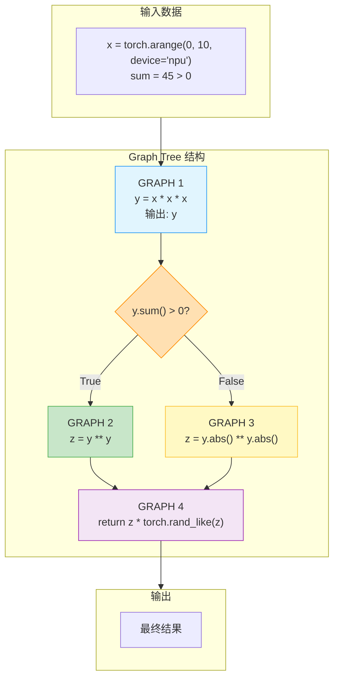

#### Graph Tree 节点关系

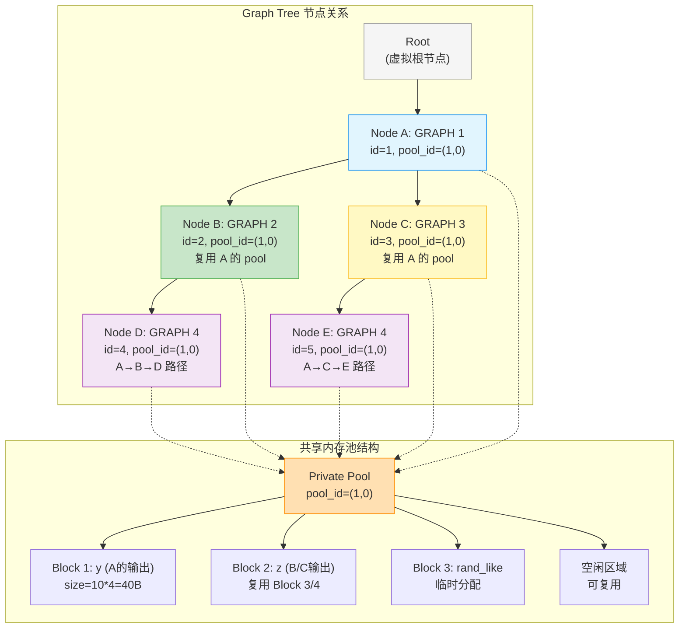

---

### 执行流程时序分析

#### 完整执行时序图

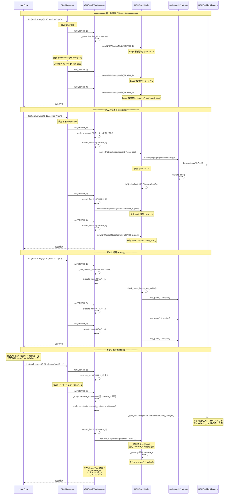

---

### 内存复用关键机制详解

#### 1. Liveness Tracking 在示例中的工作

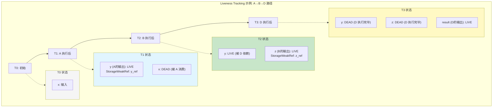

#### 2. Checkpoint/Restore 在路径切换中的作用

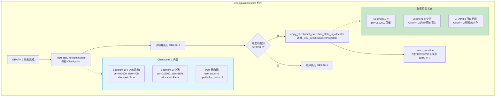

#### 3. 路径切换检查点机制详解

##### Checkpoint 记录了什么

Checkpoint（`checkpointed_caching_state`）记录的是**私有内存池在节点录制结束那一刻的 block 结构快照**，由 `_npu_getCheckpointState` 在 `_record()` 尾部创建（`_graph_tree.py:L1349-L1352`）。

| 内容 | 类型 | 说明 |
|------|------|------|
| `owner_id` | `MempoolId_t` | 私有内存池标识 |
| `segments` | `vector<SegmentState>` | 所有内存段的 block 链状态 |
| 每个 block 的 `ptr` | `void*` | block 的设备内存地址 |
| 每个 block 的 `size` | `size_t` | block 的大小 |
| 每个 block 的 `allocated` | `bool` | block 是否被分配（录制时的状态） |

**关键理解**：checkpoint 是一个"结构快照"——它不拷贝内存内容，只记录内存池的 block 划分方式和分配状态。恢复时，allocator 会把 block 结构重新调整到这个快照的布局。内存内容的正确性由 NPUGraph replay 本身保证。

##### 完整调用链

> **源码位置**：`_graph_tree.py:L2055-L2173` (`_run`)，`L2504-L2551` (`apply_checkpoint`)，`L2367-L2384` (`try_end_curr_execution`)，`L1571-L1594` (`data_ptrs_dead_since_invocation` / `path_live_weakrefs`)

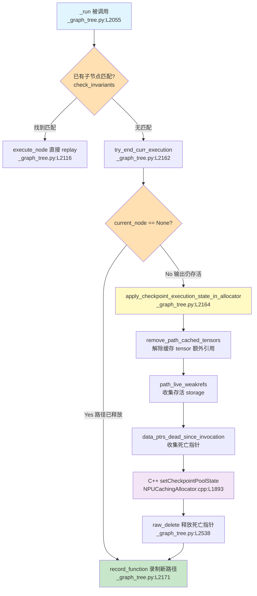

##### 数据流

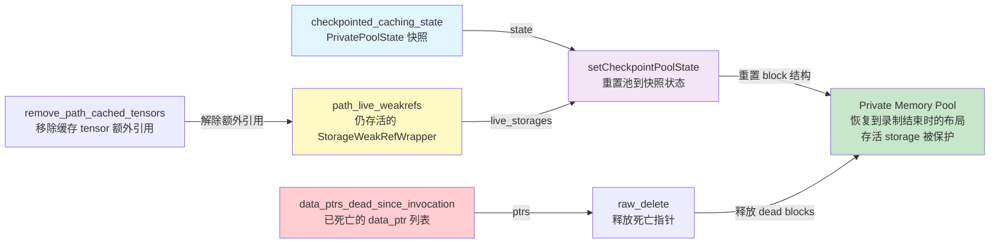

##### 执行状态转换

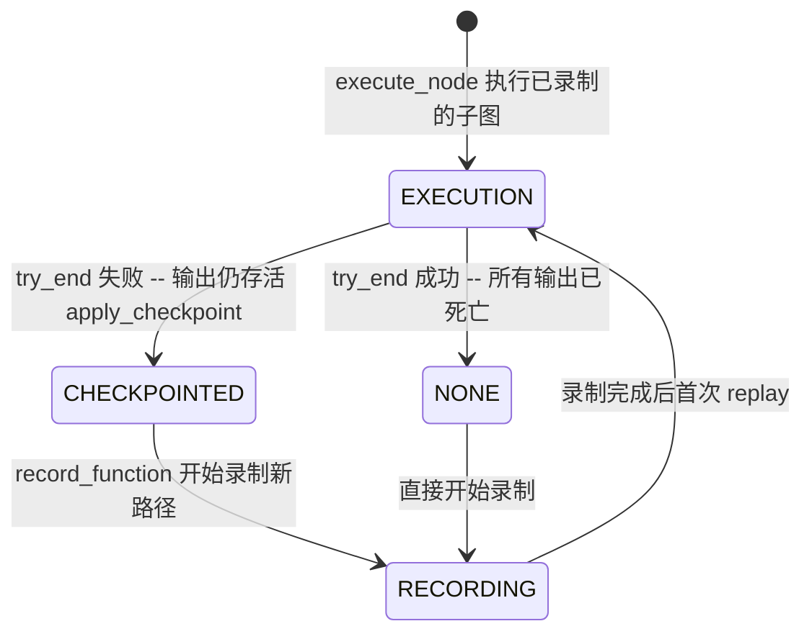

##### 内存引用三分类

路径切换时，内存中的 tensor 被分为三类，分别采取不同处理方式：

**保留（live — 不可释放）**

| 来源 | 判定方式 | 保护机制 |
|------|----------|----------|
| 路径上所有节点输出中 `StorageWeakRefWrapper` 仍可解引用的 | `path_live_weakrefs()` 遍历 `live_indices_after_graph`，检查 `is_live()` | 传入 `setCheckpointPoolState()` 的 `live_storages` 参数，C++ 侧恢复时将其标记为 allocated |
| 被用户代码持有的 tensor（如中间结果传给后续 step） | Python GC 引用计数保持 `StorageWeakRefWrapper` 存活 | 同上 |

**释放（dead — 需要回收）**

| 来源 | 判定方式 | 释放机制 |
|------|----------|----------|
| 录制时存活但当前已被 GC 回收的输出 | `data_ptrs_dead_since_invocation()`: 对比 `recorded_liveness_after_graph` 与当前 `_get_liveness()` 的差异 | `_npu_npuCachingAllocator_raw_delete(ptr)` 显式释放 |
| 缓存 tensor 持有的额外引用 | `remove_path_cached_tensors()` 遍历所有路径节点的 `cached_tensor_outputs` | `_remove_cached_tensor()` 和 `remove_extra_reference()` |

**不释放但重置的（allocator block 结构）**

`setCheckpointPoolState()` 在 C++ 层的操作（`NPUCachingAllocator.cpp:L1893-L1941`）：

1. **先释放**池中当前所有 allocated blocks（`freeBlocksAllocatedToPool`）
2. **再按快照重建** block 结构（`setSegmentStateToCheckpoint`）
3. **最后释放**快照中标记为非 live 的 blocks

这实现了"回退到录制结束时的内存布局"，同时通过 `live_storages` 参数保护了仍在使用的 tensor。

##### 关键设计决策

| 决策 | 实现方式 | 原因 |
|------|----------|------|
| **Lazy 路径清理** | `try_end_curr_execution()` 只在需要录制新节点时调用 | 避免在 hot path（replay）上做不必要的存活检查 |
| **Checkpoint 而非 Copy** | 只记录 block 结构不拷贝内容 | 内存内容由 NPUGraph replay 保证正确，checkpoint 只需重建 allocator 的簿记 |
| **死亡 tensor 显式释放** | `raw_delete()` 逐个释放 | 不能依赖 Python GC 时机，必须在新录制前确保内存可用 |
| **先移除缓存再收集存活** | `remove_path_cached_tensors()` 在 `path_live_weakrefs()` 之前 | 缓存 tensor 持有额外引用会导致本应回收的 storage 看起来仍存活 |
| **弱引用追踪** | `StorageWeakRefWrapper` 包装 storage | 不阻止 GC，同时能检测 tensor 是否存活 |

#### 4. 内存复用在各阶段的体现

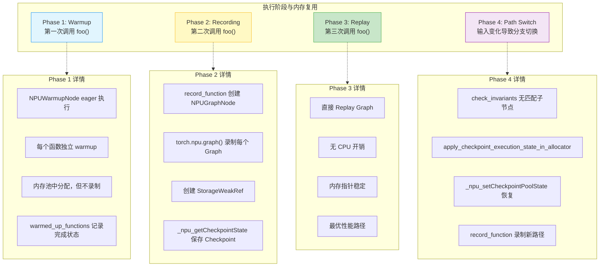

---

### 关键源码解析

#### 1. Graph Tree 创建流程（源码引用）

> **调用链**：`torch_npu/utils/_graph_tree.py:npugraphify` (L91) → `torch_npu/npu/_graph_tree.py:npugraphify` (L376) → `manager.add_function`

**源码引用**：`_graph_tree.py:L376-L407`

```python
def npugraphify(
    model: ModelType,
    inputs: List[InputType],
    static_input_idxs: Sequence[int] = (),
    *,
    device_index: int,
    is_backward: bool,
    is_inference: bool,
    stack_traces: Optional[StackTraces] = None,
    constants: Tuple[torch.Tensor, ...] = (),
    placeholders: Tuple[PlaceholderInfo, ...] = (),
    mutated_input_idxs: Tuple[int, ...] = (),
) -> Tuple[ModelType, OutputType]:
    """
    将模型转换为 NPU Graph 格式
    这是 Graph Tree 的入口函数
    """
    manager = get_container(device_index).get_tree_manager()
    
    mode = (
        CompilationMode.BACKWARD
        if is_backward
        else (CompilationMode.INFERENCE if is_inference else CompilationMode.FORWARD)
    )

    return manager.add_function(
        model,
        inputs,
        static_input_idxs,
        stack_traces,
        mode,
        constants,
        placeholders,
        mutated_input_idxs,
    )
```

#### 2. Manager 的 add_function 流程（源码引用）

**源码引用**：`_graph_tree.py:L2266-L2292` (add_function)，`_graph_tree.py:L2055-L2173` (_run)

```python
class NPUGraphTreeManager:
    def add_function(
        self,
        model: ModelType,
        inputs: List[InputType],
        static_input_idxs: Sequence[int],
        stack_traces: Optional[StackTraces],
        mode: CompilationMode,
        constants: Tuple[torch.Tensor, ...],
        placeholders: Tuple[PlaceholderInfo, ...],
        mutated_input_idxs: Tuple[int, ...],
    ) -> Tuple[ModelType, OutputType]:
        """
        添加函数到 Graph Tree。
        创建 WrappedFunction 和 function_id，返回 (fn, fn(inputs))。
        """
        id_for_func = self.new_func_id()
        self.ids_to_funcs[id_for_func] = WrappedFunction(
            model, list(static_input_idxs), id_for_func,
            tuple(t for t in constants if isinstance(t, torch.Tensor) and t.is_npu),
            placeholders, mutated_input_idxs,
        )
        fn = functools.partial(self.run, function_id=id_for_func)
        get_container(self.device_index).add_strong_reference(fn)
        return fn, fn(inputs)
    
    def _run(self, new_inputs: List[InputType], function_id: FunctionID) -> OutputType:
        """
        执行 Graph Tree 的运行逻辑。
        决定：warmup / 重放已有节点 / 录制新节点。
        """
        # 1. 如果当前正在录制或 warmup，尝试结束
        if self.in_recording:
            self.try_end_curr_recording(function_id)
        if self.in_warmup:
            self.try_end_curr_warmup(function_id)
        
        # 2. 如果函数尚未 warmup，先执行 eager warmup
        if function_id not in self.warmed_up_functions or self.in_warmup:
            if self.path_state == ExecutionState.EXECUTION:
                self.apply_checkpoint_execution_state_in_allocator()
            return self.run_eager(new_inputs, function_id)
        
        # 3. 查找匹配的已录制子节点
        child_nodes = (
            self.roots if self.current_node is None else self.current_node.children
        )
        
        if not self.in_recording:
            for child in child_nodes[function_id]:
                status, status_logger = child.check_invariants(new_inputs)
                if status == CheckInvariantStatus.SUCCESS:
                    return self.execute_node(child, new_inputs)
        
        # 4. 没有匹配的子节点，需要录制新节点
        #    先结束当前执行并恢复 checkpoint
        self.try_end_curr_execution()
        if self.current_node is not None:
            self.apply_checkpoint_execution_state_in_allocator()
        
        # 5. 录制新节点
        return self.record_function(new_inputs, function_id)
    
    def record_function(self, new_inputs, function_id):
        """创建并录制新的 Graph 节点"""
        graph_id = self.new_graph_id()
        node = NPUGraphNode(
            self.ids_to_funcs[function_id], graph_id,
            self.current_node, new_inputs,
            self.npu_graphs_thread_pool,
            self.device_index,
            self.ids_to_stack_traces[function_id],
            self.stream,
        )
        if self.current_node is None:
            self.roots[function_id].append(node)
        else:
            self.current_node.add_child(function_id, node)
        self.current_node = node
        self.path_state = ExecutionState.RECORDING
        return node.run_first_inputs(new_inputs)
    
    def execute_node(self, node, new_inputs):
        """执行已录制的节点（重放）"""
        self.current_node = node
        self.path_state = ExecutionState.EXECUTION
        return node.run(new_inputs)
```

#### 3. NPUGraphNode 的内存管理（源码引用）

**源码引用**：`_graph_tree.py:L737-L898` (__init__)，`_graph_tree.py:L1194-L1360` (_record)，`_graph_tree.py:L1060-L1081` (run)

```python
class NPUGraphNode:
    def __init__(self, wrapped_function, graph_id, parent, inputs, npu_graphs_pool, ...):
        """
        创建新的 Graph Node。
        npu_graphs_pool 从构造参数传入（由 Manager 提供），所有同一棵树中的节点共享同一个 pool。
        """
        self.wrapped_function = wrapped_function
        self.id = graph_id
        self._parent = weakref.ref(parent) if parent is not None else None
        
        # 内存池从外部传入（Manager 的 npu_graphs_thread_pool）
        self.npu_graphs_pool = npu_graphs_pool
        
        self.outputs_weakrefs: OutputList[Optional[StorageWeakRefWrapper]] = []
        self.path_weakrefs: LevelList[...] = [
            node.outputs_weakrefs for node in self._path_from_root
        ]
        
        # Liveness tracking 属性在此初始化
        self.recorded_liveness_before_graph: LevelList[OutputList[bool]] = []
        self.recorded_liveness_after_graph: LevelList[OutputList[bool]] = []
        self.expected_dead_indices_before_graph: List[PathOutputIndex] = []
        self.expected_dead_indices_after_graph: List[PathOutputIndex] = []
        self.live_indices_after_graph: List[PathOutputIndex] = []
        
        # 在 __init__ 中设置 liveness before graph（如果有父节点）
        if self.parent is not None:
            previous_liveness = self.parent.recorded_liveness_after_graph
            curr_liveness = self._get_liveness(self.path_weakrefs)
            different_indices = self._get_different_indices(previous_liveness, curr_liveness)
            self.recorded_liveness_before_graph = curr_liveness
            self.expected_dead_indices_before_graph = different_indices
        
        # 注意：__init__ 中不直接调用 _record，_record 由 run_first_inputs 触发
    
    def _record(self, model, inputs):
        """
        录制 Graph。
        关键：使用 torch.npu.graph() context manager 而非手动 capture_begin/end。
        """
        # 使用 context manager 自动管理 capture_begin / capture_end
        with preserve_rng_state(), torch.npu.device(self.device), \
             torch.npu.graph(
                 self.graph,
                 stream=self.stream,
                 pool=self.npu_graphs_pool,
                 capture_error_mode="thread_local",
                 auto_dispatch_capture=True,
             ):
            static_outputs = model(inputs)
        
        # 记录录制后的 liveness 状态
        self.recorded_liveness_after_graph = self._get_liveness(self.path_weakrefs)
        
        # 保存 checkpoint
        self.checkpointed_caching_state = torch_npu._C._npu_getCheckpointState(
            self.device, self.npu_graphs_pool
        )
        
        return static_outputs
    
    def run(self, new_inputs: List[InputType]) -> OutputType:
        """
        重放 Graph。
        检查输入稳定性 → 拷贝输入 → 重放 → 重建输出。
        """
        self.check_static_inputs_are_stable(new_inputs)
        self._copy_inputs_and_remove_from_src(self.reconstructed_inputs, new_inputs)
        
        # run_graph 内部调用 self.graph.replay()
        self.run_graph()
        
        outputs = self.reconstruct_outputs()
        new_inputs.clear()
        return outputs
```

---

### 内存复用可视化总结

#### 完整执行流程内存变化

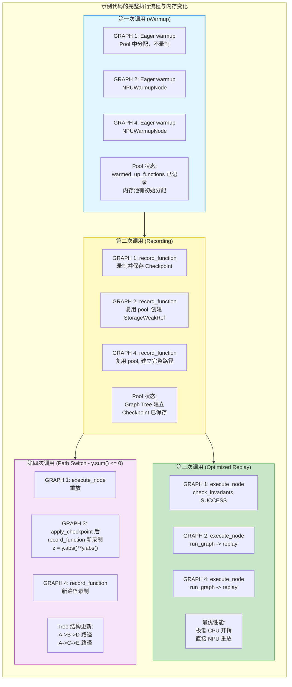

#### 内存复用效率对比

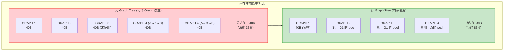

---

## 总结

### 核心机制回顾

| 机制 | 实现方式 | 作用 |
|------|----------|------|
| **内存池共享** | `MempoolId_t` + `PrivatePool` | 多个 Graph 共享同一内存空间 |
| **Liveness Tracking** | `StorageWeakRefWrapper` + 活性检查 | 追踪 Tensor 生命周期，及时回收 |
| **Checkpoint/Restore** | `_npu_getCheckpointState` / `_npu_setCheckpointPoolState` | 路径切换时恢复内存状态（block 结构快照，不拷贝数据） |
| **弱引用管理** | `weakref` + 引用计数检查 | 不阻止 GC，但可检测对象存活 |
| **显式释放** | `_npu_npuCachingAllocator_raw_delete` | 不依赖 GC 时机，录制前主动释放死亡 tensor 内存 |
| **Lazy 路径清理** | `try_end_curr_execution` 按需调用 | 避免 hot path (replay) 上的不必要开销 |

### 路径切换时的内存处理三分类

| 分类 | 判定方式 | 处理 |
|------|----------|------|
| **保留** (live) | `path_live_weakrefs()` — `StorageWeakRefWrapper` 仍可解引用 | 传入 `setCheckpointPoolState` 的 `live_storages`，C++ 侧标记为 allocated |
| **释放** (dead) | `data_ptrs_dead_since_invocation()` — 录制时存活但已被 GC | `raw_delete()` 显式释放 |
| **解除缓存** (cached) | `remove_path_cached_tensors()` — 缓存持有额外引用 | `_remove_cached_tensor()` + `remove_extra_reference()` |

### 内存复用触发条件

1. **同一路径顺序执行**：后一个 Graph 自动复用前一个 Graph 释放的内存
2. **路径切换**：Checkpoint 恢复到共同祖先状态，新路径复用祖先释放的内存
3. **Tensor 死亡**：Liveness Tracking 检测到 Tensor 不再被引用，`raw_delete` 回收复用

### 最佳实践建议

1. **减少 graph break**：每次 graph break 都会创建新的 Graph 节点，增加 Tree 的复杂度。尽量保持代码的静态性。

2. **稳定输入形状**：输入形状变化会导致重新录制，破坏内存复用。确保输入张量的形状稳定。

3. **避免频繁路径切换**：路径切换需要 Restore Checkpoint（`setCheckpointPoolState` + `raw_delete`），有一定开销。尽量保持执行路径的稳定。

4. **使用 `torch.compile`**：`reduce-overhead` 模式会自动启用 Graph Tree，无需手动管理。

### 待探索问题

- `stale_storages` 在 `apply_checkpoint` 中始终为空列表（L2522），注释暗示未来可能支持 stale storage 处理
- `clear_path_state()` 当前为空操作（L1614-1616），作为 placeholder 保留

---

## 参考文档

- 源码文件：
  - `torch_npu/npu/_graph_tree.py` - Graph Tree 核心实现（NPUGraphNode, NPUGraphTreeManager）
  - `torch_npu/utils/_graph_tree.py` - npugraphify 入口、NpugraphsBackend
  - `torch_npu/csrc/core/npu/NPUGraph.h/cpp` - C++ Graph 实现（capture_begin/end, replay, reset）
  - `torch_npu/csrc/core/npu/NPUCachingAllocator.cpp` - 内存分配器（PrivatePool, BlockPool）

- 相关文档：
  - [PyTorch CUDA Graphs](https://pytorch.org/docs/stable/cuda.html#cuda-graphs)
  - [Ascend ACL 文档](https://www.hiascend.com/document)
