# PyTorch Dynamo 技术全面分析

## 目录
1. [技术概述](#1-技术概述)
2. [核心架构与工作原理](#2-核心架构与工作原理)
3. [技术实现细节](#3-技术实现细节)
4. [典型示例代码分析](#4-典型示例代码分析)
5. [核心模块架构与工作流程](#5-核心模块架构与工作流程)
6. [在PyTorch生态中的作用与应用](#6-在pytorch生态中的作用与应用)
7. [文档覆盖度说明](#7-文档覆盖度说明)

---

## 1. 技术概述

### 1.1 什么是PyTorch Dynamo

PyTorch Dynamo（通常通过`torch.compile()`访问）是一个Python级别的即时（JIT）编译器，旨在使未修改的PyTorch程序更快。它是PyTorch 2.0引入的编译基础设施的核心组件。

**核心特性**：
- **Python级JIT编译器**：通过PEP 523帧评估API钩入CPython
- **动态字节码重写**：在执行前动态修改Python字节码
- **FX图提取**：将PyTorch操作序列提取到FX图中
- **可定制后端**：支持多种编译后端（Inductor、Eager、AOT等）
- **混合执行**：混合Python执行和编译后端以获得最佳性能

### 1.2 技术定位

Dynamo在PyTorch编译栈中的位置：

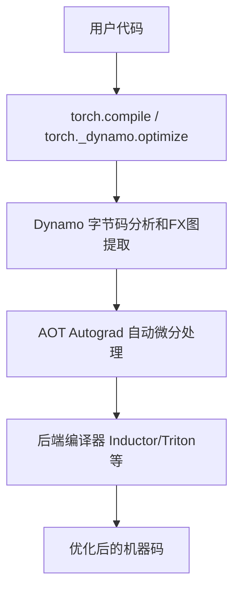

### 1.3 关键设计理念

1. **零代码修改**：无需修改用户代码即可获得性能提升
2. **渐进式编译**：在运行时动态编译，支持动态形状和控制流
3. **安全降级**：编译失败时自动回退到eager模式
4. **可扩展性**：支持自定义后端和编译策略

---

## 2. 核心架构与工作原理

### 2.1 整体架构

Dynamo采用分层架构设计：

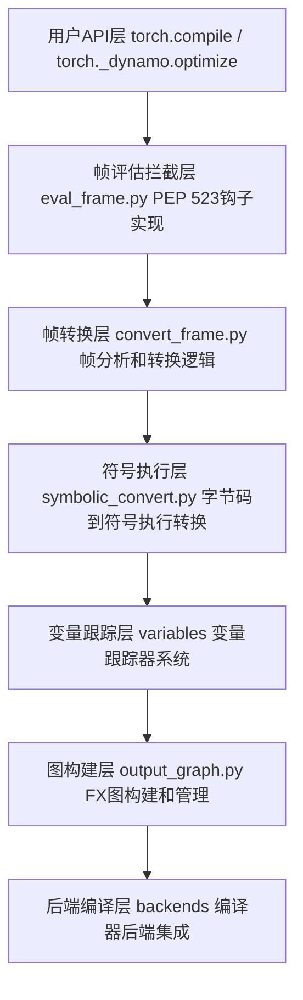

### 2.2 核心工作流程

#### 阶段1：帧评估拦截

**入口点**：[`eval_frame.py`](file:///e:/97-codes/torch_parallel/pytorch/torch/_dynamo/eval_frame.py)

Dynamo通过PEP 523的`PyEval_SetFrameEvalFunc`API注册自定义的帧评估函数：

```python
# 【演示代码】简化的执行流程
# 实际的回调是 ConvertFrame 实例，由 OptimizeContext 创建并通过 set_eval_frame 注册
def frame_callback(frame, cache_entry, hooks, frame_state):
    # 1. 检查是否应该编译此帧（通过 trace_rules.check）
    if trace_rules.check(frame.f_code):
        return None  # 跳过此帧，继续正常执行

    # 2. 检查缓存（由C++层的 guard 管理器处理）
    if cache_entry and cache_entry.check_guards(frame):
        return cache_entry.code  # 返回缓存的编译代码

    # 3. 转换帧为FX图（ConvertFrameAssert.__call__）
    fx_graph, guards = convert_frame_assert(frame, ...)

    # 4. 编译FX图
    compiled_fn = backend_compile(fx_graph)

    # 5. 缓存结果
    cache_entry = CacheEntry(compiled_fn, guards)
    store_cache(cache_entry)

    # 6. 返回编译后的代码对象
    return compiled_code
```

**关键机制**：
- **帧过滤**：通过`trace_rules.py`判断哪些函数需要编译
- **缓存查找**：使用`guards.py`检查缓存是否仍然有效
- **惰性编译**：首次执行时触发编译，后续直接使用缓存

#### 阶段2：字节码分析和转换

**核心文件**：
- [`bytecode_analysis.py`](file:///e:/97-codes/torch_parallel/pytorch/torch/_dynamo/bytecode_analysis.py) - 静态分析
- [`bytecode_transformation.py`](file:///e:/97-codes/torch_parallel/pytorch/torch/_dynamo/bytecode_transformation.py) - 动态转换

**分析过程**（以上函数均在`bytecode_analysis.py`中定义）：

```python
# 【演示代码】字节码分析流程
# 1. 提取字节码指令（通过 bytecode_transformation.py 的 cleaned_instructions）
instructions = cleaned_instructions(code)

# 2. 死代码消除（bytecode_analysis.py）
live_instructions = remove_dead_code(instructions)

# 3. 跳转优化（bytecode_analysis.py）
optimized_instructions = remove_pointless_jumps(live_instructions)

# 4. 栈大小分析（bytecode_analysis.py）
stack_size = stacksize_analysis(optimized_instructions)

# 5. 活跃变量分析（bytecode_analysis.py）
live_vars = livevars_analysis(instructions, current_inst)
```

**转换过程**：

```python
# 【演示代码】字节码转换过程
# 将Python字节码转换为Dynamo内部表示
for inst in instructions:
    if inst.opname == "LOAD_FAST":
        # 转换为变量加载
        var = create_variable_tracker(inst.argval)
        stack.push(var)
    elif inst.opname == "BINARY_ADD":
        # 转换为二元操作
        right = stack.pop()
        left = stack.pop()
        result = create_binary_op(left, right, operator.add)
        stack.push(result)
    # ... 其他指令处理
```

#### 阶段3：符号执行

**核心文件**：[`symbolic_convert.py`](file:///e:/97-codes/torch_parallel/pytorch/torch/_dynamo/symbolic_convert.py)

符号执行是Dynamo的核心技术，它在不实际执行代码的情况下分析程序行为：

```python
# 【PyTorch源码简化】symbolic_convert.py
class InstructionTranslator(InstructionTranslatorBase):
    pass  # 继承 InstructionTranslatorBase 的全部逻辑

class InstructionTranslatorBase:
    # 使用 BytecodeDispatchTableMeta 作为元类，构建 dispatch_table
    def step(self) -> bool:
        """执行单个字节码指令的符号版本"""
        inst = self.instructions[self.instruction_pointer]
        self.current_instruction = inst

        # 检查是否应该编译部分图
        if not self.stack and self.should_compile_partial_graph():
            # 可能触发图断点（speculation）
            ...

        # 通过 dispatch_table 分派到对应的指令处理方法
        # 如 LOAD_FAST, BINARY_ADD 等各有专门处理方法
        self.dispatch_table[inst.opcode](self, inst)

        return not self.output.should_exit
```

**关键特性**：
- **符号值**：使用`VariableTracker`表示程序值
- **符号形状**：使用sympy符号表示动态形状
- **控制流处理**：支持条件分支和循环
- **函数内联**：内联小函数以提高优化机会

#### 阶段4：变量跟踪

**核心目录**：[`variables/`](file:///e:/97-codes/torch_parallel/pytorch/torch/_dynamo/variables/)

变量跟踪系统使用继承层次结构跟踪不同类型的值：

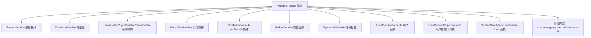

**变量创建**：变量跟踪器的实例化主要通过[`variables/builder.py`](file:///e:/97-codes/torch_parallel/pytorch/torch/_dynamo/variables/builder.py)中的`VariableBuilder`和`SourcelessBuilder`完成，而非直接调用各Variable类的构造函数。

**示例**：[`variables/tensor.py`](file:///e:/97-codes/torch_parallel/pytorch/torch/_dynamo/variables/tensor.py)

```python
# 【PyTorch源码简化】variables/tensor.py
class TensorVariable(VariableTracker):
    def __init__(self, proxy, dtype, device, ndim, size, stride,
                 requires_grad, is_quantized, is_contiguous,
                 is_nested, is_sparse, class_type, has_grad_fn,
                 layout=None, ...):
        super().__init__()
        self.proxy = proxy  # FX代理
        self.dtype = dtype
        self.device = device
        self.ndim = ndim
        self.size = size  # 即 _size
        self.requires_grad = requires_grad
        # ... 其他属性

    def dynamic_getattr(self, tx, name):
        """处理张量属性访问"""
        if name == "shape":
            return SizeVariable(self.size)
        elif name == "dtype":
            return ConstantVariable(self.dtype)
        # ... 其他属性

    def call_method(self, tx, name, args, kwargs):
        """处理张量方法调用"""
        # 委托给内置函数处理
        # ... 方法分发逻辑

# 注意：TensorVariable 没有 create() 静态方法
# 创建 TensorVariable 的实际路径是通过 builder.py:
# wrap_fx_proxy() → wrap_fx_proxy_cls() → construct_tensor_variable()
```

#### 阶段5：Guard系统

**核心文件**：[`guards.py`](file:///e:/97-codes/torch_parallel/pytorch/torch/_dynamo/guards.py)

Guard系统确保编译代码的正确性：

```python
# 【演示代码】Guard系统示例
class GuardManager:
    def __init__(self):
        self.guards = []

    def add_guard(self, guard_fn):
        """添加一个guard条件"""
        self.guards.append(guard_fn)

    def check(self, frame_locals):
        """检查所有guard是否满足"""
        for guard in self.guards:
            if not guard(frame_locals):
                return False
        return True

# Guard类型示例
def tensor_shape_guard(tensor, expected_shape):
    """检查张量形状是否匹配"""
    def check(locals):
        actual_tensor = locals[tensor.name]
        return actual_tensor.shape == expected_shape
    return check

def nn_module_guard(module):
    """检查nn.Module是否被修改"""
    def check(locals):
        return module.__dict__ is not modified
    return check
```

**Guard优化**：
- **分层Guard**：使用树结构组织guard以快速失效
- **Guard缓存**：缓存guard检查结果
- **增量Guard**：只检查可能变化的条件

#### 阶段6：FX图构建

**核心文件**：[`output_graph.py`](file:///e:/97-codes/torch_parallel/pytorch/torch/_dynamo/output_graph.py)

```python
# 【PyTorch源码简化】output_graph.py
class OutputGraph(OutputGraphCommon):
    def __init__(self, ...):
        # 图由 SubgraphTracer 持有，OutputGraph 通过属性访问
        self.tracers: list[SubgraphTracer] = [SubgraphTracer(...)]
        self.side_effects = SideEffects(self)

    @property
    def graph(self):
        """当前活跃的FX图"""
        return self.current_tracer.graph

    @property
    def current_tracer(self):
        return self.tracers[-1]

    def create_node(self, *args, **kwargs):
        """创建一个FX节点（注意：方法名是 create_node 而非 add_node）"""
        return self.current_tracer.create_node(*args, **kwargs)

    def compile_subgraph(self, tx, ...):
        """编译子图（注意：方法名是 compile_subgraph 而非 finalize）"""
        ...

    def compile_and_call_fx_graph(self, tx, ...):
        """编译并调用FX图"""
        # 1. 构建 GraphModule
        # 2. 调用后端编译
        # 3. 生成调用代码
        ...

# SubgraphTracer 持有实际的 FX 图
class SubgraphTracer(fx.Tracer):
    def __init__(self, output_graph, ...):
        self.graph = torch.fx.Graph()
        self.output_graph = output_graph
```

#### 阶段7：后端编译

**核心目录**：[`backends/`](file:///e:/97-codes/torch_parallel/pytorch/torch/_dynamo/backends/)

支持的后端（后端文件在[`backends/`](file:///e:/97-codes/torch_parallel/pytorch/torch/_dynamo/backends/)目录下）：
- **Inductor**（`inductor.py`）：默认后端，生成优化的Triton/CPU代码
- **AOT Eager**（`debugging.py`）：AOT Autograd的eager实现，用于调试
- **CUDAGraphs**（`cudagraphs.py`）：CUDA图优化
- **ONNX Runtime**（`onnxrt.py`）：导出到ONNX
- **TVM**（`tvm.py`）：TVM后端集成
- **TorchXLA**（`torchxla.py`）：XLA后端
- **TensorRT**（`tensorrt.py`）：TensorRT后端

**示例**：[`backends/inductor.py`](file:///e:/97-codes/torch_parallel/pytorch/torch/_dynamo/backends/inductor.py)

```python
# 【PyTorch源码】backends/inductor.py
@register_backend
def inductor(*args, **kwargs):
    """Inductor后端入口"""
    # 惰性导入以减少内存占用
    with dynamo_timed("inductor_import", log_pt2_compile_event=True):
        from torch._inductor.compile_fx import compile_fx
    return compile_fx(*args, **kwargs)
```

### 2.3 数据流转路径

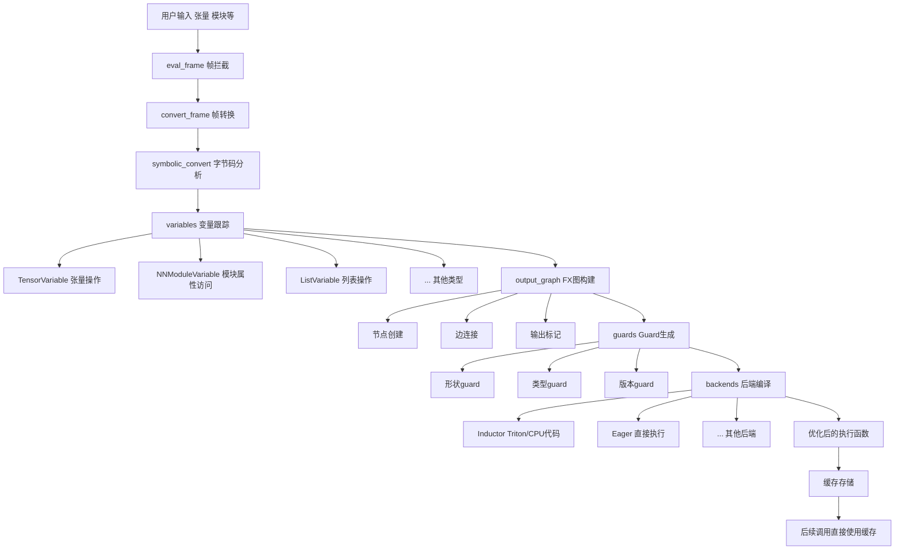

---

## 3. 技术实现细节

### 3.1 PEP 523帧评估API

**位置**：[`torch/csrc/dynamo/`](file:///e:/97-codes/torch_parallel/pytorch/torch/csrc/dynamo/)

Dynamo使用Python 3.7+的PEP 523 API来拦截函数调用：

```cpp
// 【PyTorch源码简化】torch/csrc/dynamo/eval_frame.c + eval_frame_cpp.cpp
// 实际由三个函数组成调用链：
// dynamo_custom_eval_frame_shim → dynamo__custom_eval_frame_shim → dynamo__custom_eval_frame

// 1. 安装为解释器帧评估函数的入口（eval_frame.c）
static PyObject* dynamo_custom_eval_frame_shim(
    PyThreadState* tstate,
    _PyInterpreterFrame* frame,
    int throw_flag
) {
    // 获取线程局部存储中的回调
    PyObject* callback = eval_frame_callback_get();

    if (callback == Py_None || callback == NULL) {
        return dynamo_eval_frame_default(tstate, frame, throw_flag);
    }

    return dynamo__custom_eval_frame(tstate, frame, throw_flag, callback);
}

// 2. 核心逻辑：调用Python回调（eval_frame_cpp.cpp）
static PyObject* dynamo__custom_eval_frame(
    PyThreadState* tstate,
    _PyInterpreterFrame* frame,
    int throw_flag,
    PyObject* callback
) {
    // 调用Python回调进行帧转换
    PyObject* result = PyObject_CallOneArg(callback, (PyObject*)frame);
    // ... 处理返回结果
    return result;
}

// 3. 注册eval_frame函数（Python可调用）
static PyObject* set_eval_frame(PyObject* self, PyObject* args) {
    // 设置回调到线程局部存储
    eval_frame_callback_set(callback);
    // 注册帧评估函数
    _PyInterpreterState_SetEvalFrameFunc(interp, dynamo_custom_eval_frame_shim);
    return old_callback;
}
```

**Python接口**：

```python
# 【PyTorch源码简化】eval_frame.py
from torch._C._dynamo.eval_frame import set_eval_frame

# 回调由 OptimizeContext（_TorchDynamoContext子类）在 __enter__ 时注册
# 实际回调是通过 convert_frame.convert_frame() 创建的 ConvertFrame 实例
# 简化流程如下：

class OptimizeContext(_TorchDynamoContext):
    """torch._dynamo.optimize() 创建的上下文"""
    def __enter__(self):
        # 创建帧转换回调
        callback = convert_frame.convert_frame(self.compiler_fn, self.hooks)
        # 注册到C扩展
        set_eval_frame(callback)

# ConvertFrame.__call__ 的简化逻辑：
class ConvertFrame:
    def __call__(self, frame, cache_entry, hooks, frame_state):
        # 检查是否应该编译
        if trace_rules.check(frame.f_code):
            return None  # 跳过此帧

        # 尝试编译
        try:
            return self._inner_convert(frame, cache_entry, hooks, frame_state)
        except Exception:
            return None  # 回退到eager
```

### 3.2 字节码分析技术

**死代码消除**：[`bytecode_analysis.py:remove_dead_code()`](file:///e:/97-codes/torch_parallel/pytorch/torch/_dynamo/bytecode_analysis.py)

```python
# 【PyTorch源码】bytecode_analysis.py
def remove_dead_code(instructions):
    """基于控制流分析的死代码消除"""
    indexof = {inst: i for i, inst in enumerate(instructions)}
    live_code = set()

    def find_live_code(start):
        for i in range(start, len(instructions)):
            if i in live_code:
                return
            live_code.add(i)
            inst = instructions[i]

            # 处理异常表
            if inst.exn_tab_entry:
                find_live_code(indexof[inst.exn_tab_entry.target])

            # 处理跳转指令
            if inst.opcode in JUMP_OPCODES:
                find_live_code(indexof[inst.target])

            # 终止指令
            if inst.opcode in TERMINAL_OPCODES:
                return

    find_live_code(0)
    return [inst for i, inst in enumerate(instructions) if i in live_code]
```

**栈大小分析**：[`bytecode_analysis.py:stacksize_analysis()`](file:///e:/97-codes/torch_parallel/pytorch/torch/_dynamo/bytecode_analysis.py)

```python
# 【PyTorch源码】bytecode_analysis.py
def stacksize_analysis(instructions):
    """计算每个指令点的栈大小范围"""
    stack_sizes = {
        inst: StackSize(float('inf'), float('-inf'))
        for inst in instructions
    }
    stack_sizes[instructions[0]] = StackSize(0, 0)

    # 固定点迭代
    for _ in range(100):
        changed = False

        for inst, next_inst in zip(instructions, instructions[1:] + [None]):
            stack_size = stack_sizes[inst]

            if inst.opcode not in TERMINAL_OPCODES:
                # 正常流
                eff = stack_effect(inst.opcode, inst.arg, jump=False)
                stack_sizes[next_inst].update(stack_size + eff)

            if inst.opcode in JUMP_OPCODES:
                # 跳转流
                eff = stack_effect(inst.opcode, inst.arg, jump=True)
                stack_sizes[inst.target].update(stack_size + eff)

        if not changed:
            break

    return max(s.high for s in stack_sizes.values())
```

### 3.3 符号执行引擎

**指令翻译器**：[`symbolic_convert.py:InstructionTranslator`](file:///e:/97-codes/torch_parallel/pytorch/torch/_dynamo/symbolic_convert.py)

```python
# 【PyTorch源码简化】symbolic_convert.py
class InstructionTranslatorBase(metaclass=BytecodeDispatchTableMeta):
    def __init__(self, output: OutputGraph, ...):
        self.output = output
        self.stack: list[VariableTracker] = []  # 符号栈
        self.symbolic_locals: dict[str, VariableTracker] = {}  # 局部符号变量表
        self.symbolic_globals: dict[str, VariableTracker] = {}  # 全局符号变量表
        self.block_stack: list[BlockStackEntry] = []  # 块栈（循环、条件等）
        self.instruction_pointer: Optional[int] = 0
        self.dispatch_table: list[Any] = ...  # 由元类构建的指令分派表

    def step(self) -> bool:
        """执行单个指令"""
        inst = self.instructions[self.instruction_pointer]
        # 通过 dispatch_table 分派，而非手动的 opcode_handlers 字典
        self.dispatch_table[inst.opcode](self, inst)
        return not self.output.should_exit

    def LOAD_FAST(self, inst: Instruction):
        """LOAD_FAST指令处理"""
        name = inst.argval
        if name not in self.symbolic_locals:
            unimplemented("undefined local variable")
        self.stack.append(self.symbolic_locals[name])

    # BINARY_ADD 通过 stack_op 工厂函数定义
    BINARY_ADD = stack_op(operator.add)
    # stack_op 内部使用 BuiltinVariable(fn).call_function(self, self.popn(nargs), {})
```

**控制流处理**：

```python
# 【演示代码】控制流处理示例
def pop_jump_if_false(self, inst):
    """POP_JUMP_IF_FALSE指令处理"""
    condition = self.stack.pop()

    # 检查条件是否可以静态求值
    if isinstance(condition, ConstantVariable):
        if condition.value:
            # 条件为真，跳过跳转
            pass
        else:
            # 条件为假，执行跳转
            self.jump_to(inst.target)
    else:
        # 动态条件，需要创建guard
        guard = create_guard(condition)
        self.output.add_guard(guard)

        # 创建条件节点
        true_block = self.create_block()
        false_block = self.create_block()

        # 添加条件分支
        self.output.add_if_else(condition, true_block, false_block)
```

### 3.4 变量跟踪系统

**基类**：[`variables/base.py:VariableTracker`](file:///e:/97-codes/torch_parallel/pytorch/torch/_dynamo/variables/base.py)

```python
# 【PyTorch源码简化】variables/base.py
class VariableTracker:
    """变量跟踪器基类"""

    def __init__(self, source=None, mutation_type=None, **kwargs):
        self.source = source  # 变量来源
        self.mutation_type = mutation_type  # 变异类型
        # 注意：guards 列在 _nonvar_fields 中，但不在 __init__ 中设置

    def as_python_constant(self):
        """如果可能，返回Python常量"""
        raise AsPythonConstantNotImplementedError()

    def reconstruct(self, codegen):
        """生成代码以重建此变量"""
        raise NotImplementedError()

    def call_function(self, tx, args, kwargs):
        """调用此变量作为函数"""
        unimplemented(f"call_function on {self}")

    @staticmethod
    def build(tx, value, source=None):
        """工厂方法：创建适当的变量跟踪器
        委托给 SourcelessBuilder.create、LazyConstantVariable.create
        或 LazyVariableTracker.create"""
        ...
```

**张量变量**：[`variables/tensor.py:TensorVariable`](file:///e:/97-codes/torch_parallel/pytorch/torch/_dynamo/variables/tensor.py)

```python
# 【PyTorch源码简化】variables/tensor.py + variables/builder.py
class TensorVariable(VariableTracker):
    """张量变量跟踪器"""

    def __init__(self, proxy, dtype, device, ndim, size, stride,
                 requires_grad, is_quantized, is_contiguous,
                 is_nested, is_sparse, class_type, has_grad_fn,
                 layout=None, ...):
        super().__init__()
        self.proxy = proxy  # FX代理
        self.dtype = dtype
        self.device = device
        self.ndim = ndim
        self.requires_grad = requires_grad
        # ... 更多属性

    # 注意：TensorVariable 没有 create() 方法
    # 创建路径在 builder.py 中：

# 【builder.py 中的创建路径】
def wrap_fx_proxy(tx, proxy, ...):
    """将 FX Proxy 包装为 VariableTracker"""
    return wrap_fx_proxy_cls(TensorVariable, tx, proxy, ...)

def wrap_fx_proxy_cls(target_cls, tx, proxy, ...):
    """创建指定类型的变量跟踪器"""
    # 1. 运行 fake tensor 推理获取 tensor_meta
    # 2. 调用 construct_tensor_variable() 构造 TensorVariable
    return construct_tensor_variable(target_cls, proxy, **options)

# 【TensorVariable 的属性和方法访问】
class TensorVariable(VariableTracker):
    def dynamic_getattr(self, tx, name):
        """处理动态属性访问"""
        if name == "shape":
            return SizeVariable(self.size)
        elif name == "dtype":
            return ConstantVariable(self.dtype)
        elif name == "device":
            return ConstantVariable(self.device)
        # ... 其他属性

    def call_method(self, tx, name, args, kwargs):
        """处理方法调用 - 分派到内置函数"""
        # 委托给 BuiltinVariable 或 torch.ops.aten 处理
        ...
```

**NN模块变量**：[`variables/nn_module.py:NNModuleVariable`](file:///e:/97-codes/torch_parallel/pytorch/torch/_dynamo/variables/nn_module.py)

```python
# 【PyTorch源码简化】variables/nn_module.py
class NNModuleVariable(VariableTracker):
    """nn.Module变量跟踪器"""

    def __init__(self, module_type, module_key, value, source=None,
                 nn_module_stack_source=None, **kwargs):
        super().__init__(source=source, **kwargs)
        self.module_type = module_type  # 模块类型
        self.module_key = module_key    # 模块在根模块中的key
        self.value = value              # 实际的nn.Module引用

    def var_getattr(self, tx, name):
        """处理模块属性访问（注意：方法名是 var_getattr 而非 dynamic_getattr）"""
        # 获取属性值
        attr_value = getattr(self.value, name)

        # 根据类型创建相应的变量跟踪器
        if isinstance(attr_value, torch.nn.Module):
            return NNModuleVariable(type(attr_value), ...)
        elif isinstance(attr_value, torch.Tensor):
            # 通过 VariableTracker.build() 或 wrap_fx_proxy() 创建
            return VariableTracker.build(tx, attr_value, source=...)
        elif isinstance(attr_value, (int, float, bool, str)):
            return ConstantVariable(attr_value)
        # ... 其他类型

    def call_function(self, tx, args, kwargs):
        """处理模块调用（即 module(x) 调用 forward）"""
        # 内联模块的 forward 方法
        ...

    def call_method(self, tx, name, args, kwargs):
        """处理模块方法调用"""
        # 分发到对应的方法处理逻辑
        ...
```

### 3.5 Guard系统实现

**Guard管理器**：[`guards.py:GuardManagerWrapper`](file:///e:/97-codes/torch_parallel/pytorch/torch/_dynamo/guards.py)

```python
# 【PyTorch源码简化】guards.py
class GuardManagerWrapper:
    """Guard管理器包装类 - 持有根Guard管理器"""

    def __init__(self, root: Optional[RootGuardManager] = None):
        if root is None:
            self.root = RootGuardManager()
        else:
            self.root = root
        self.diff_guard_root: Optional[RootGuardManager] = None
        self.closure_vars: Optional[dict[str, Any]] = None
        self.args: Optional[list[str]] = None

# Guard的实际构建通过 GuardBuilder 完成：
class GuardBuilder:
    """Guard构建器 - 负责为不同类型的值构建guard"""

    def __init__(self, guard_manager: GuardManagerWrapper, ...):
        self.guard_manager = guard_manager

    # guard类型方法示例：
    def TYPE_MATCH(self, guard): ...      # 类型匹配guard
    def ID_MATCH(self, guard): ...        # 身份匹配guard
    def CONSTANT_MATCH(self, guard): ...  # 常量匹配guard
    def NN_MODULE(self, guard): ...       # nn.Module guard
    def HASATTR(self, guard): ...         # 属性存在guard
    # ... 更多guard类型

# 底层guard检查由C++实现：
# RootGuardManager, DictGuardManager, GetAttrGuardAccessor 等
```

**Guard类型**：

```python
# 【演示代码】Guard类型示例
# 形状Guard
def tensor_shape_guard(tensor, expected_shape):
    def check(frame_locals):
        actual = frame_locals[tensor.name]
        return actual.shape == expected_shape
    return check

# 类型Guard
def type_guard(obj, expected_type):
    def check(frame_locals):
        actual = frame_locals[obj.name]
        return type(actual) == expected_type
    return check

# 版本Guard
def version_guard(obj, expected_version):
    def check(frame_locals):
        actual = frame_locals[obj.name]
        return get_version(actual) == expected_version
    return check

# 字典版本Guard
def dict_version_guard(dict_obj, expected_version):
    def check(frame_locals):
        actual = frame_locals[dict_obj.name]
        return get_dict_version(actual) == expected_version
    return check
```

### 3.6 副作用跟踪

**核心类**：[`side_effects.py:SideEffects`](file:///e:/97-codes/torch_parallel/pytorch/torch/_dynamo/side_effects.py)

```python
# 【PyTorch源码简化】side_effects.py
class SideEffects:
    """副作用跟踪器"""

    def __init__(self, output_graph):
        self.id_to_variable = {}          # ID到变量的映射
        self.store_attr_mutations = {}    # 属性变异
        self.keepalive = []               # 保持活跃的对象
        self.mutation_user_stacks = {}    # 变异用户栈
        self.save_for_backward = []       # 反向传播保存
        self.tensor_hooks = {}            # 张量钩子

    def _track_obj(self, item, variable, ...):
        """开始跟踪一个对象的变异"""
        self.id_to_variable[id(item)] = variable

    # track_mutable 是 _track_obj 的别名
    track_mutable = _track_obj

    def store_attr(self, item, name, value):
        """记录属性变异"""
        ...

    def mutation(self, variable):
        """标记一个变量已被变异"""
        ...

    def codegen_update_mutated(self, cg):
        """生成代码以应用所有变异（相当于"重放"副作用）"""
        # 遍历所有变异的对象和属性
        for obj_var, attrs in self.store_attr_mutations.items():
            for attr, new_var in attrs.items():
                cg.store_attr(obj_var, attr, new_var)
        # ... 其他变异类型
```

### 3.7 代码生成

**代码生成器**：[`codegen.py:PyCodegen`](file:///e:/97-codes/torch_parallel/pytorch/torch/_dynamo/codegen.py)

```python
# 【PyTorch源码】codegen.py
class PyCodegen:
    """Python字节码生成器"""

    def __init__(self, tx, root_module):
        self.tx = tx
        self.root_module = root_module
        self.output = []  # 生成的指令
        self.tempvars = {}  # 临时变量
        self.uses = Counter()  # 使用计数

    def __call__(self, value):
        """生成代码以将value放在栈顶"""
        if value in self.tempvars:
            # 从临时变量加载
            self.output.append(create_load(self.tempvars[value]))
        elif isinstance(value, Source):
            # 从源重建
            value.reconstruct(self)
        elif isinstance(value, VariableTracker):
            # 重建变量
            value.reconstruct(self)
        else:
            # 常量
            self.output.append(create_load_const(value))

    def add_cache(self, value):
        """添加值到缓存"""
        if value not in self.tempvars:
            var_name = f"tmp_{len(self.tempvars)}"
            self.tempvars[value] = var_name
            self.output.append(create_store_fast(var_name))

    def create_load(self, name):
        """创建加载指令"""
        return create_instruction("LOAD_FAST", argval=name)

    def create_store(self, name):
        """创建存储指令"""
        return create_instruction("STORE_FAST", argval=name)
```

### 3.8 配置系统

**配置文件**：[`config.py`](file:///e:/97-codes/torch_parallel/pytorch/torch/_dynamo/config.py)

```python
# 【PyTorch源码】config.py
# 运行时行为配置
recompile_limit = 8  # 最大重编译次数
accumulated_recompile_limit = 256  # 累积重编译限制
fail_on_recompile_limit_hit = False  # 达到限制时是否失败

# 特化配置
specialize_int = False  # 是否特化整数输入
specialize_float = False  # 是否特化浮点输入
dynamic_shapes = True  # 已标记为遗留配置，当前实际不起作用
assume_static_by_default = True  # 默认假设静态
automatic_dynamic_shapes = True  # 实际控制动态形状的配置（由环境变量控制）

# 调试配置
verbose = False  # 详细输出
verify_correctness = False  # 验证正确性
repro_level = 2  # 重放级别

# Guard配置
guard_nn_modules = True  # 是否guard nn.Module
guard_nn_modules_using_dict_tags = True  # 使用字典标签guard

# 优化配置
dead_code_elimination = True  # 死代码消除
replay_side_effects = True  # 重放副作用
```

---

## 4. 典型示例代码分析

### 4.1 基础示例：简单函数编译

```python
# 【演示代码】用户代码
import torch

def simple_function(x):
    return x * 2 + 1

# 编译函数
compiled_fn = torch.compile(simple_function)

# 执行
x = torch.randn(10, 10)
result = compiled_fn(x)
```

**执行流程分析**：

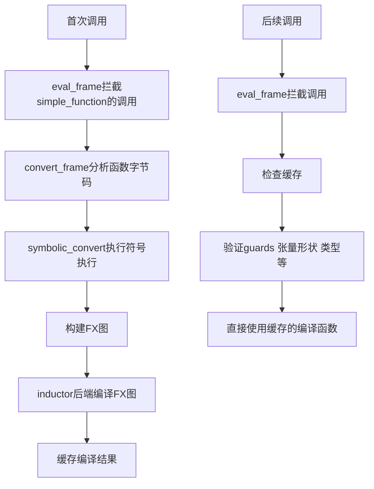

生成的FX图：


### 4.2 nn.Module编译示例

```python
# 【演示代码】用户代码
import torch
import torch.nn as nn

class SimpleModel(nn.Module):
    def __init__(self):
        super().__init__()
        self.linear = nn.Linear(10, 10)
        self.relu = nn.ReLU()

    def forward(self, x):
        x = self.linear(x)
        x = self.relu(x)
        return x

# 编译模型
model = SimpleModel()
compiled_model = torch.compile(model)

# 执行
x = torch.randn(32, 10)
output = compiled_model(x)
```

**执行流程分析**：

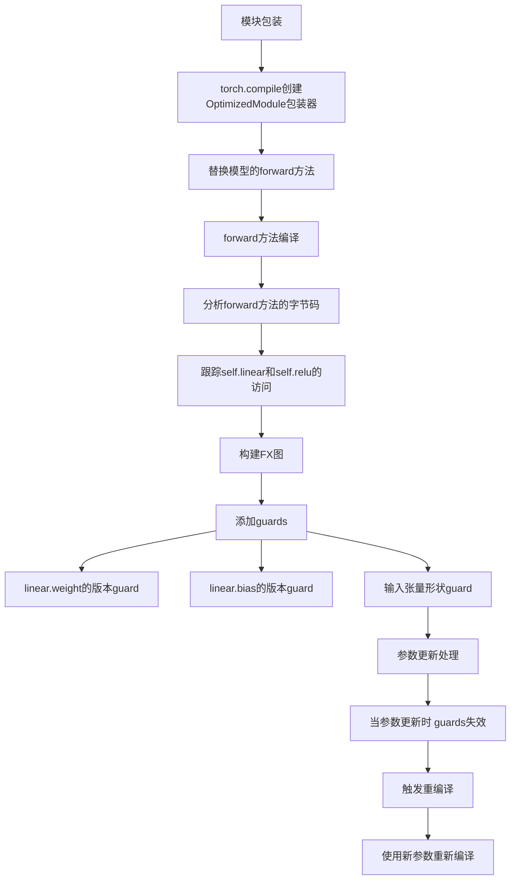

生成的FX图：

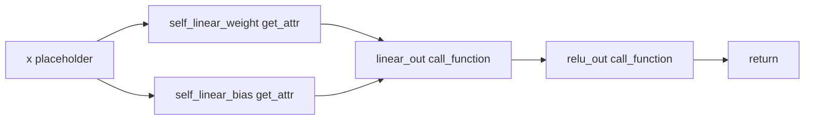

### 4.3 动态形状示例

```python
# 【演示代码】用户代码
import torch

def dynamic_shape_fn(x, y):
    # x和y的形状可能不同
    if x.shape[0] > y.shape[0]:
        return x + y[:x.shape[0]]
    else:
        return y + x[:y.shape[0]]

# 编译函数
compiled_fn = torch.compile(dynamic_shape_fn, dynamic_shapes=True)

# 执行不同形状的输入
x1 = torch.randn(10, 10)
y1 = torch.randn(5, 10)
result1 = compiled_fn(x1, y1)

x2 = torch.randn(8, 10)
y2 = torch.randn(12, 10)
result2 = compiled_fn(x2, y2)
```

**执行流程分析**：

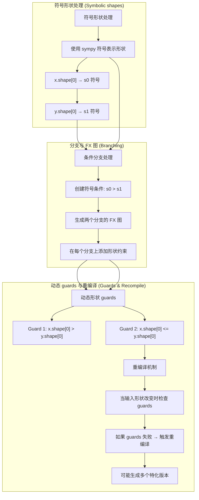

动态形状Guard示例：

```python
# 【演示代码】动态形状guards
# Guard 1: x.shape[0] > y.shape[0]
def guard1(frame_locals):
    x = frame_locals['x']
    y = frame_locals['y']
    return x.shape[0] > y.shape[0]

# Guard 2: x.shape[0] <= y.shape[0]
def guard2(frame_locals):
    x = frame_locals['x']
    y = frame_locals['y']
    return x.shape[0] <= y.shape[0]
```

### 4.4 带图断点的示例

```python
# 【演示代码】用户代码
import torch

def fn_with_break(x):
    x = x * 2
    torch._dynamo.graph_break()  # 显式图断点
    x = x + 1
    return x

# 编译函数
compiled_fn = torch.compile(fn_with_break)

# 执行
x = torch.randn(10, 10)
result = compiled_fn(x)
```

**执行流程分析**：

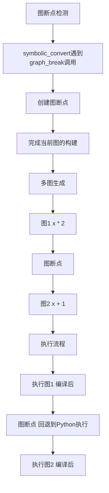

### 4.5 循环处理示例

```python
# 【演示代码】用户代码
import torch

def loop_fn(x, iterations):
    for i in range(iterations):
        x = x * 0.5 + 1
    return x

# 编译函数
compiled_fn = torch.compile(loop_fn)

# 执行
x = torch.randn(10, 10)
result = compiled_fn(x, 5)
```

**执行流程分析**：

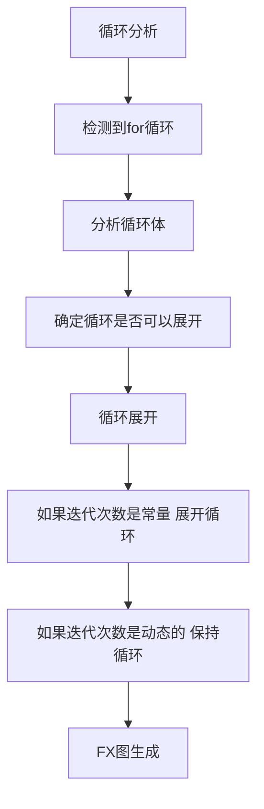

展开后的FX图（iterations=5）：


### 4.6 测试用例分析

**测试文件**：[`test/dynamo/test_compile.py`](file:///e:/97-codes/torch_parallel/pytorch/test/dynamo/test_compile.py)

```python
# 【PyTorch源码】test/dynamo/test_compile.py
class ToyModel(torch.nn.Module):
    def __init__(self):
        super().__init__()
        self.linear = torch.nn.Linear(10, 10)
        self.relu = torch.nn.ReLU()

    def forward(self, x):
        return self.relu(self.linear(x))

class InPlaceCompilationTests(TestCase):
    def test_compilation(self):
        """测试原地编译"""
        torch._dynamo.reset()
        model = ToyModel()
        cnt = CompileCounter()
        model.compile(backend=cnt)
        x = torch.randn(10, 10)
        model(x)
        self.assertEqual(cnt.frame_count, 1)

    def test_overwrite_call_impl(self):
        """测试覆盖call_impl"""
        torch._dynamo.reset()
        model = ToyModel()
        self.assertTrue(model._compiled_call_impl is None)
        model.compile()
        self.assertTrue(model._compiled_call_impl is not None)
```

**测试分析**：
- `test_compilation`：验证编译只发生一次
- `test_overwrite_call_impl`：验证`compile()`方法正确替换`__call__`

---

## 5. 核心模块架构与工作流程

### 5.1 模块依赖关系图

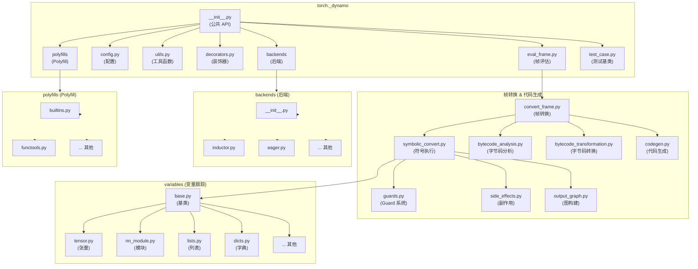

### 5.2 关键调用链

#### 编译调用链

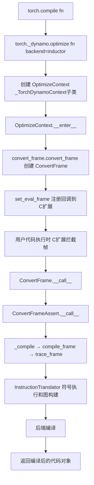

#### 符号执行调用链

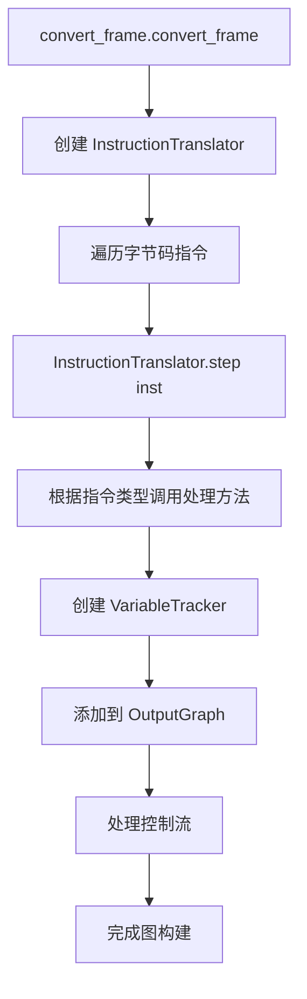

#### 变量跟踪调用链

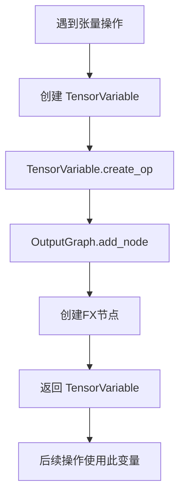

### 5.3 数据流转详细路径

#### 阶段1：用户代码到帧评估

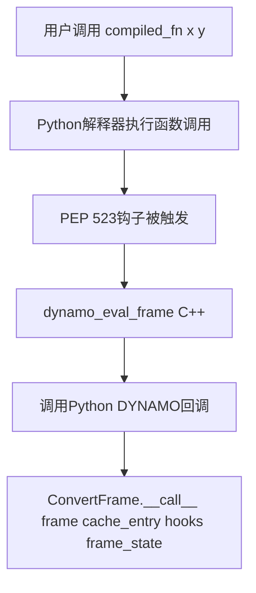

#### 阶段2：帧评估到转换

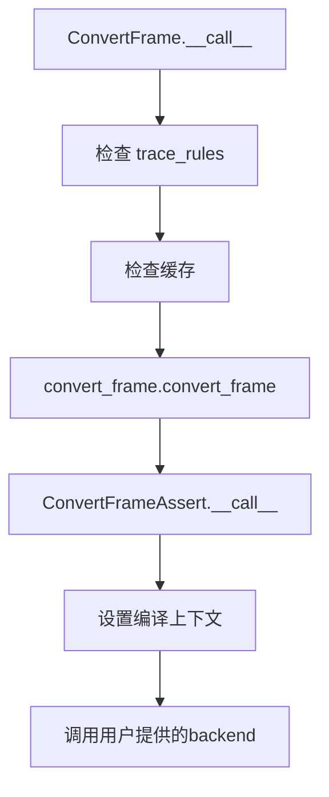

#### 阶段3：转换到符号执行

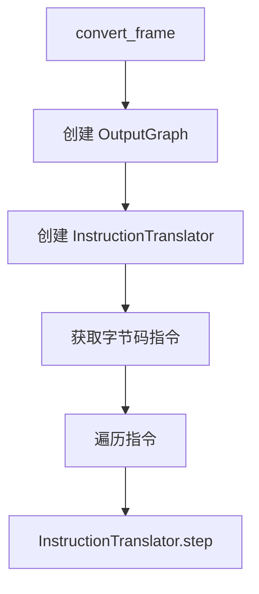

#### 阶段4：符号执行到变量跟踪

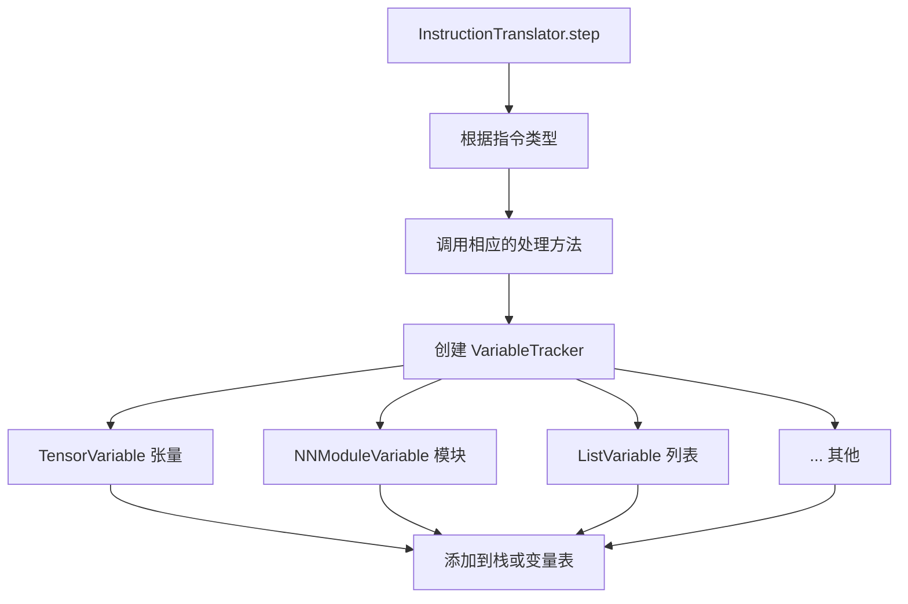

#### 阶段5：变量跟踪到图构建

```mermaid
graph TD
    A[VariableTracker 操作] --> B[创建FX节点]
    B --> C[OutputGraph.add_node]
    C --> D[添加到FX图]
    D --> E[创建guard]
    E --> F[添加到GuardManager]
```

#### 阶段6：图构建到后端编译

```mermaid
graph TD
    A[OutputGraph.finalize] --> B[创建 GraphModule]
    B --> C[应用优化pass]
    C --> D[调用backend编译]
    D --> E[inductor.compile_fx]
    E --> F[生成优化代码]
```

#### 阶段7：后端编译到执行

```mermaid
graph TD
    A[inductor.compile_fx] --> B[AOT Autograd处理]
    B --> C[生成Triton/CPU代码]
    C --> D[编译为可执行函数]
    D --> E[返回编译后的函数]
    E --> F[缓存结果]
```

### 5.4 模块间接口

#### eval_frame ↔ convert_frame

```python
# 【PyTorch源码简化】eval_frame.py 与 convert_frame.py 的交互

# eval_frame.py 中的 OptimizeContext 创建回调链：
# OptimizeContext.__enter__
#   → convert_frame.convert_frame(compiler_fn, hooks)  # 工厂函数
#   → 返回 ConvertFrame 实例
#   → set_eval_frame(callback)  # 注册到C扩展

# convert_frame.py
def convert_frame(compiler_fn, hooks, package=None) -> ConvertFrame:
    """工厂函数：返回 ConvertFrame 实例"""
    return ConvertFrame(compiler_fn, hooks, package=package)

class ConvertFrame:
    """帧转换的外层包装，处理错误"""
    def __init__(self, compiler_fn, hooks, ...):
        self._inner_convert = ConvertFrameAssert(compiler_fn, ...)

    def __call__(self, frame, cache_entry, hooks, frame_state):
        try:
            return self._inner_convert(frame, cache_entry, hooks, frame_state)
        except Exception:
            return None  # 回退到eager

class ConvertFrameAssert:
    """帧转换的核心逻辑"""
    def __call__(self, frame, cache_entry, hooks, frame_state, *, skip=0):
        # 1. 创建 InstructionTranslator
        # 2. 执行符号执行
        # 3. 编译FX图
        # 4. 返回编译后的代码对象
        ...
```

#### symbolic_convert ↔ variables

```python
# 【PyTorch源码简化】symbolic_convert.py
class InstructionTranslatorBase:
    def LOAD_FAST(self, inst):
        """加载局部变量"""
        name = inst.argval
        if name not in self.symbolic_locals:
            unimplemented("undefined local variable")
        self.stack.append(self.symbolic_locals[name])

# 【PyTorch源码简化】variables/base.py
class VariableTracker:
    @staticmethod  # 注意：是 staticmethod 而非 classmethod
    def build(tx, value, source=None):
        """工厂方法：创建适当的变量跟踪器
        委托给 SourcelessBuilder.create、LazyConstantVariable.create
        或 LazyVariableTracker.create"""
        if source is None:
            return SourcelessBuilder.create(tx, value)
        else:
            return LazyVariableTracker.create(value, source)
        # 内部根据 value 类型分派到 TensorVariable、
        # NNModuleVariable、ListVariable 等
```

#### variables ↔ output_graph

```python
# 【PyTorch源码简化】变量跟踪与图构建的交互
# 当遇到张量操作时，通过 builder.py 中的 wrap_fx_proxy 创建节点

# variables/builder.py
def wrap_fx_proxy(tx, proxy, ...):
    """将 FX Proxy 包装为 TensorVariable"""
    return wrap_fx_proxy_cls(TensorVariable, tx, proxy, ...)

def wrap_fx_proxy_cls(target_cls, tx, proxy, ...):
    """构造张量变量"""
    # 1. 通过 fake tensor 推理获取 tensor 元信息
    # 2. 调用 construct_tensor_variable() 创建 TensorVariable
    return target_cls(proxy=proxy, dtype=..., device=..., ndim=..., ...)

# output_graph.py
class OutputGraph(OutputGraphCommon):
    @property
    def graph(self):
        return self.current_tracer.graph

    def create_node(self, *args, **kwargs):
        return self.current_tracer.create_node(*args, **kwargs)
```

#### output_graph ↔ backends

```python
# 【PyTorch源码简化】output_graph.py
class OutputGraph(OutputGraphCommon):
    def compile_and_call_fx_graph(self, tx, rv, root):
        """编译FX图并生成调用代码"""
        # 1. 创建 GraphModule
        gm = fx.GraphModule(root, self.graph)
        # 2. 调用后端编译器
        compiled_fn = self.call_user_compiler(gm)
        # 3. 生成调用字节码
        ...
        return compiled_fn

    def call_user_compiler(self, gm):
        """调用用户指定的编译器后端"""
        return self.compiler_fn(gm, self.example_inputs)

# 【PyTorch源码】backends/inductor.py
@register_backend
def inductor(*args, **kwargs):
    """Inductor后端"""
    from torch._inductor.compile_fx import compile_fx
    return compile_fx(*args, **kwargs)
```

---

## 6. 在PyTorch生态中的作用与应用

### 6.1 主要作用

#### 1. 性能优化

**作用**：显著提升PyTorch程序的性能

**机制**：
- 算子融合（Operator Fusion）
- 内存布局优化
- 循环展开和向量化
- 并行化

**性能提升**：
- 典型模型：2-3倍加速
- Transformer模型：可达4倍加速
- 小模型：1.5-2倍加速

#### 2. 动态形状支持

**作用**：支持动态批大小和可变长度输入

**特性**：
- 符号形状推理
- 动态guard生成
- 多版本缓存

**应用场景**：
- NLP：可变长度序列
- CV：动态批大小
- RL：可变状态大小

#### 3. 零代码修改

**作用**：无需修改用户代码即可获得性能提升

**优势**：
- 降低使用门槛
- 易于集成现有代码
- 渐进式采用

**对比**：

```mermaid
graph LR
    A[传统方式] --> B[需要修改代码]
    B --> C[with torch.jit.optimized_execution True]
    C --> D[output = model input]

    E[Dynamo方式] --> F[无需修改]
    F --> G[model = torch.compile model]
    G --> H[output = model input]
```

#### 4. 安全降级

**作用**：编译失败时自动回退到eager模式

**机制**：
- 异常捕获
- 图断点
- 部分编译

**保证**：
- 功能正确性优先
- 用户体验不受影响
- 调试友好

### 6.2 技术优势

#### 1. Python级实现

**优势**：
- 易于理解和调试
- 快速迭代
- 社区贡献友好

**对比C++实现**：

```mermaid
graph TD
    A[C++实现 如TorchScript] --> B[高性能]
    A --> C[难于调试]
    A --> D[修改成本高]

    E[Python实现 Dynamo] --> F[可接受性能]
    E --> G[易于调试]
    E --> H[快速迭代]
```

#### 2. 灵活的编译策略

**支持策略**：
- 全图编译（`fullgraph=True`）
- 部分编译（默认）
- 图断点控制
- 自定义后端

**应用示例**：

```python
# 【演示代码】全图编译
model = torch.compile(model, fullgraph=True)

# 【演示代码】自定义后端
def my_backend(gm, inputs):
    # 自定义编译逻辑
    return compiled_fn

model = torch.compile(model, backend=my_backend)
```

#### 3. 强大的调试工具

**工具**：
- `torch._dynamo.explain()`：解释编译失败原因
- `TORCH_LOGS=dynamo`：详细日志
- 重放工具：最小化失败案例

**示例**：

```python
# 【演示代码】解释编译失败
torch._dynamo.explain(model)

# 【演示代码】启用详细日志
import os
os.environ['TORCH_LOGS'] = 'dynamo'
```

#### 4. 与其他组件的集成

**集成点**：
- **torch.compile**：统一编译API
- **torch.export**：导出API
- **torch.nn.Module.compile()**：模块级编译
- **AOT Autograd**：自动微分

### 6.3 应用场景

#### 1. 模型训练

**场景**：训练深度学习模型

**优势**：
- 前向传播加速
- 反向传播优化
- 梯度计算优化

**示例**：

```python
# 【演示代码】模型训练
model = MyModel()
optimizer = torch.optim.Adam(model.parameters())
model = torch.compile(model)

for epoch in range(epochs):
    for batch in dataloader:
        optimizer.zero_grad()
        loss = model(batch)
        loss.backward()
        optimizer.step()
```

#### 2. 模型推理

**场景**：部署训练好的模型

**优势**：
- 低延迟推理
- 高吞吐量
- 批处理优化

**示例**：

```python
# 【演示代码】模型推理
# 编译模型用于推理
model = torch.load('model.pth')
model = torch.compile(model, mode='reduce-overhead')

# 推理
with torch.no_grad():
    output = model(input)
```

#### 3. 研究和实验

**场景**：快速原型和实验

**优势**：
- 快速迭代
- 易于调试
- 灵活修改

**示例**：

```python
# 【演示代码】研究实验
# 实验新架构
class ExperimentalModel(nn.Module):
    def forward(self, x):
        # 复杂的控制流和动态操作
        if x.shape[0] > 100:
            return self.branch1(x)
        else:
            return self.branch2(x)

model = torch.compile(ExperimentalModel())
```

#### 4. 生产部署

**场景**：在生产环境中部署模型

**优势**：
- 性能稳定
- 资源利用率高
- 易于监控

**示例**：

```python
# 【演示代码】生产部署
# 生产部署配置
model = torch.compile(
    model,
    backend='inductor',
    mode='max-autotune',
    options={'max_autotune_gemm_backends': 'TRITON'}
)
```

### 6.4 与其他PyTorch组件的交互

#### 1. 与torch.compile的交互

```python
# 【演示代码】torch.compile是Dynamo的主要入口
import torch

# 函数级编译
@torch.compile
def my_function(x):
    return x * 2

# 模块级编译
model = torch.compile(model)

# 模块方法
model.compile()
```

#### 2. 与torch.export的交互

```python
# 【演示代码】torch.export使用Dynamo进行导出
import torch.export

# 导出模型
exported_program = torch.export.export(
    model,
    (example_input,),
    dynamic_shapes={'batch_size': torch.export.Dim('batch')}
)
```

#### 3. 与torch.fx的交互

```python
# 【演示代码】Dynamo生成FX图
import torch.fx

# 获取FX图
model = torch.compile(model, backend='eager')
gm = model._get_fx_graph()

# 打印FX图
gm.graph.print_tabular()
```

#### 4. 与torch.autograd的交互

```python
# 【演示代码】Dynamo与自动微分集成
model = torch.compile(model)

loss = model(input)
loss.backward()  # 正常的反向传播
```

### 6.5 性能优化技术

#### 1. 算子融合

**技术**：将多个操作融合为单个内核

**示例**：

```mermaid
graph LR
    A[原始代码] --> B[x = x * 2]
    B --> C[x = x + 1]
    C --> D[x = torch.relu x]

    E[融合后] --> F[x = fused_mul_add_relu x 2 1]
```

#### 2. 内存布局优化

**技术**：优化张量内存布局以减少拷贝

**示例**：

```mermaid
graph LR
    A[原始] --> B[x = x.contiguous 强制连续内存]
    B --> C[y = x.t 转置]

    D[优化] --> E[y = x.t 避免不必要的连续拷贝]
```

#### 3. 循环优化

**技术**：循环展开和向量化

**示例**：

```mermaid
graph LR
    A[原始] --> B[for i in range 100]
    B --> C[x i = x i * 2]

    D[1展开] --> E[x 0 4 = x 0 4 * 2]
    D --> F[x 4 8 = x 4 8 * 2]
    D --> G[...]
```

#### 4. 并行化

**技术**：自动并行化独立操作

**示例**：

```mermaid
graph TD
    A[原始] --> B[x = op1 x]
    A --> C[y = op2 y]
    A --> D[z = op3 z]

    E[并行] --> F[并行执行 op1 op2 op3]
```

### 6.6 限制和挑战

#### 1. 编译开销

**问题**：首次编译有显著开销

**缓解**：
- 预热（warmup）
- 缓存编译结果
- 异步编译

#### 2. 动态控制流

**问题**：复杂的动态控制流可能导致图断点

**缓解**：
- 符号执行
- 动态形状支持
- 多版本缓存

#### 3. 不支持的操作

**问题**：某些操作不支持编译

**缓解**：
- 图断点
- Polyfill实现
- 自定义后端

#### 4. 内存占用

**问题**：编译过程可能消耗大量内存

**缓解**：
- 增量编译
- 缓存限制
- 内存清理

---

## 7. 文档覆盖度说明

本文档覆盖了Dynamo的主要模块和流程，但以下重要组件未详细展开：

| 组件 | 文件 | 说明 |
|------|------|------|
| **VariableBuilder** | `variables/builder.py` | 变量跟踪器的核心创建路径，包含`wrap_fx_proxy()`等关键函数 |
| **SubgraphTracer** | `output_graph.py` | 持有实际的FX图，支持嵌套子图 |
| **Source系统** | `source.py` | 追踪变量的来源，用于guard生成和代码重建 |
| **Mutation处理** | `mutation_guard.py` | 变异检测和guard生成 |
| **Export模式** | `export.py` | `torch.export`的Dynamo集成 |
| **Speculation** | `symbolic_convert.py` | 投机编译和部分图生成策略 |
| **高阶操作** | `variables/higher_order_ops.py` | `torch.cond`、`torch.vmap`等高阶操作的支持 |
| **分布式支持** | `variables/distributed.py` | FSDP等分布式训练的变量跟踪 |

---

## 总结

PyTorch Dynamo是一个强大的Python级JIT编译器，通过以下关键技术实现性能优化：

1. **PEP 523帧评估API**：拦截函数调用进行编译
2. **字节码分析和转换**：分析Python字节码并转换为优化形式
3. **符号执行**：在不执行代码的情况下分析程序行为
4. **变量跟踪系统**：跟踪不同类型变量的操作和属性
5. **Guard系统**：确保编译代码的正确性
6. **FX图构建**：将操作序列转换为FX图
7. **后端编译**：使用Inductor等后端生成优化代码

Dynamo在PyTorch生态中发挥着重要作用，提供了零代码修改的性能优化方案，支持动态形状和控制流，并具有强大的调试工具和灵活的编译策略。它是PyTorch 2.0编译基础设施的核心组件，为用户提供了显著的性能提升，同时保持了易用性和灵活性。

通过理解Dynamo的技术实现细节，开发者可以更好地利用其功能，诊断编译问题，并为PyTorch编译基础设施做出贡献。

## Related Pages

- [[torch_compile/index]]
- [[torch_compile_architecture]]
- [[aotautograd_analysis]]
